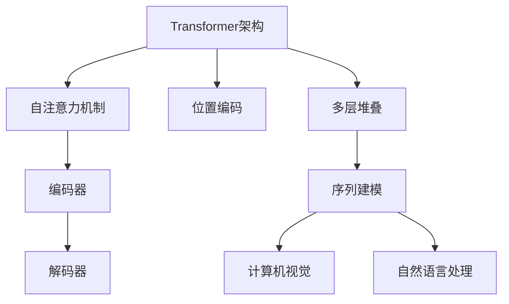

                 

# Transformer大模型实战：预训练VideoBERT模型

> **关键词：** Transformer、预训练、VideoBERT、深度学习、计算机视觉、自然语言处理、大规模模型实战。

> **摘要：** 本文将深入探讨Transformer架构在大规模视觉预训练中的应用，以VideoBERT模型为例，详细解析其构建、训练及实际应用的步骤和原理。通过本文，读者将了解如何利用Transformer模型处理视频数据，并掌握预训练大模型的实践技巧。

## 1. 背景介绍

### 1.1 目的和范围

本文旨在探讨如何利用Transformer架构进行大规模视觉预训练，特别是针对视频数据的处理。我们将以VideoBERT模型为例，深入分析其核心算法、数学模型以及实际应用。通过本文的学习，读者将能够：

1. 理解Transformer模型的基本原理及其在视觉任务中的应用。
2. 掌握预训练大模型的构建和训练方法。
3. 探索VideoBERT模型在实际应用场景中的性能和效果。

### 1.2 预期读者

本文适合以下读者群体：

1. 具有计算机视觉和自然语言处理基础知识的研究人员和工程师。
2. 想要了解大规模视觉预训练模型开发过程的技术爱好者。
3. 对Transformer模型感兴趣并希望将其应用于实际问题的开发者。

### 1.3 文档结构概述

本文结构如下：

1. **背景介绍**：介绍文章的目的、范围、预期读者以及文档结构。
2. **核心概念与联系**：介绍Transformer模型和VideoBERT模型的基本原理。
3. **核心算法原理 & 具体操作步骤**：详细解析VideoBERT模型的构建和训练过程。
4. **数学模型和公式 & 详细讲解 & 举例说明**：讲解VideoBERT模型的数学基础和具体实现。
5. **项目实战：代码实际案例和详细解释说明**：通过实际代码示例演示模型的应用。
6. **实际应用场景**：探讨VideoBERT模型在不同领域的应用。
7. **工具和资源推荐**：推荐学习资源和开发工具。
8. **总结：未来发展趋势与挑战**：分析未来发展方向和面临的挑战。
9. **附录：常见问题与解答**：回答读者可能遇到的问题。
10. **扩展阅读 & 参考资料**：提供更多的学习资源。

### 1.4 术语表

#### 1.4.1 核心术语定义

- **Transformer模型**：一种基于自注意力机制的深度学习模型，广泛应用于序列建模任务。
- **预训练**：在特定任务之前，对模型进行大规模未标注数据的训练，以提高其泛化能力。
- **VideoBERT模型**：基于Transformer架构的预训练视频理解模型，用于视频文本配对任务。

#### 1.4.2 相关概念解释

- **自注意力机制**：一种计算序列中每个元素对其他元素影响的方法。
- **位置编码**：用于捕捉序列中元素位置信息的技术。

#### 1.4.3 缩略词列表

- **Transformer**：Transformer模型
- **BERT**：Bidirectional Encoder Representations from Transformers
- **VideoBERT**：基于Transformer架构的预训练视频理解模型

## 2. 核心概念与联系

为了深入理解VideoBERT模型，我们需要首先了解Transformer模型的基本原理及其在计算机视觉和自然语言处理中的应用。以下是一个简单的Mermaid流程图，展示了Transformer模型的核心概念和联系：



### 2.1 Transformer架构

Transformer模型由编码器和解码器两个部分组成，采用自注意力机制进行序列建模。编码器负责将输入序列编码成固定长度的向量，解码器则利用这些向量生成输出序列。

- **编码器**：编码器由多个自注意力层和前馈网络堆叠而成，能够捕捉输入序列中的依赖关系。
- **解码器**：解码器同样由多个自注意力层和前馈网络组成，在生成输出序列时，每个输出元素仅依赖于前面已生成的元素。

### 2.2 自注意力机制

自注意力机制是Transformer模型的核心，其基本思想是计算序列中每个元素对其他元素的影响。具体来说，自注意力机制通过以下三个步骤进行：

1. **计算键值对的相似度**：对于每个输入序列中的元素，计算其与所有其他元素之间的相似度，通常使用点积作为相似度度量。
2. **应用权重**：将相似度转换为权重，对输入序列进行加权求和，得到新的序列表示。
3. **位置编码**：考虑到序列中的元素位置信息，对加权求和的结果进行位置编码。

### 2.3 位置编码

位置编码是Transformer模型的一个重要特点，它用于捕捉序列中元素的位置信息。位置编码可以通过以下方法实现：

1. **绝对位置编码**：将元素的位置信息直接编码到输入序列中，通常使用正弦和余弦函数进行编码。
2. **相对位置编码**：通过计算相邻元素之间的相对位置信息，并将其编码到输入序列中。

## 3. 核心算法原理 & 具体操作步骤

在了解了Transformer模型的基本原理后，我们将深入探讨VideoBERT模型的构建和训练过程。VideoBERT模型是一种基于Transformer架构的预训练视频理解模型，其主要目标是实现视频文本配对任务。

### 3.1 VideoBERT模型构建

VideoBERT模型的构建主要包括以下步骤：

1. **视频编码**：将输入视频编码为固定长度的视频特征向量。通常，可以使用预训练的卷积神经网络（如ResNet）对视频帧进行特征提取。
2. **文本编码**：将输入文本编码为固定长度的文本特征向量。可以使用预训练的BERT模型对文本进行编码。
3. **序列拼接**：将视频特征向量和文本特征向量拼接成一个长序列。
4. **Transformer编码器**：对拼接后的序列进行编码，使用多个自注意力层和前馈网络捕捉序列中的依赖关系。
5. **Transformer解码器**：对编码后的序列进行解码，生成预测的文本序列。

### 3.2 VideoBERT模型训练

VideoBERT模型的训练主要包括以下步骤：

1. **数据准备**：准备用于训练的图像数据集和文本数据集，通常需要对图像进行预处理，如剪裁、缩放和归一化等。
2. **预训练**：在大量未标注的视频数据上对VideoBERT模型进行预训练，以学习视频和文本的特征表示。
3. **微调**：在特定任务上对预训练的VideoBERT模型进行微调，以适应新的任务需求。
4. **评估**：在测试集上评估模型的性能，并根据评估结果调整模型参数。

### 3.3 VideoBERT模型具体操作步骤

以下是一个VideoBERT模型的具体操作步骤：

1. **输入视频和文本**：将输入视频和文本传递给VideoBERT模型。
2. **视频编码**：使用预训练的卷积神经网络对视频帧进行特征提取，得到视频特征向量。
3. **文本编码**：使用预训练的BERT模型对文本进行编码，得到文本特征向量。
4. **序列拼接**：将视频特征向量和文本特征向量拼接成一个长序列。
5. **编码器编码**：对拼接后的序列进行编码，使用多个自注意力层和前馈网络捕捉序列中的依赖关系。
6. **解码器解码**：对编码后的序列进行解码，生成预测的文本序列。
7. **损失计算**：计算预测的文本序列与真实文本序列之间的损失，更新模型参数。

## 4. 数学模型和公式 & 详细讲解 & 举例说明

在理解了VideoBERT模型的基本构建和训练步骤后，我们将进一步探讨其数学模型和公式。VideoBERT模型的数学模型主要包括自注意力机制、编码器和解码器的构建过程，以及损失函数的计算。

### 4.1 自注意力机制

自注意力机制是Transformer模型的核心，其基本思想是计算序列中每个元素对其他元素的影响。具体来说，自注意力机制通过以下三个步骤进行：

1. **计算键值对的相似度**：

   对于输入序列 $X = [x_1, x_2, ..., x_n]$，首先计算每个元素与其余元素之间的相似度。相似度计算通常使用点积作为度量：

   $$ \text{Attention}(x_i, X) = \text{softmax}\left(\frac{Qx_i}{\sqrt{d_k}}\right) $$

   其中，$Q$ 是查询向量，$K$ 是键向量，$V$ 是值向量，$d_k$ 是键向量的维度。$\text{softmax}$ 函数用于归一化相似度，使其在 [0, 1] 范围内。

2. **应用权重**：

   将相似度转换为权重，对输入序列进行加权求和：

   $$ \text{Attention}(X) = \text{softmax}\left(\frac{QX}{\sqrt{d_k}}\right) V $$

   其中，$X$ 表示输入序列的加权求和结果。

3. **位置编码**：

   为了考虑到序列中元素的位置信息，通常需要对加权求和的结果进行位置编码。位置编码可以通过以下方法实现：

   - **绝对位置编码**：将元素的位置信息直接编码到输入序列中，通常使用正弦和余弦函数进行编码：

     $$ \text{Positional Encoding}(x_i) = [\sin(\frac{pos_i}{10000^{2i/d}}), \cos(\frac{pos_i}{10000^{2i/d}})] $$

     其中，$pos_i$ 是元素的位置，$d$ 是位置编码的维度。

   - **相对位置编码**：通过计算相邻元素之间的相对位置信息，并将其编码到输入序列中。

### 4.2 编码器和解码器的构建

VideoBERT模型由编码器和解码器两个部分组成，每个部分都包含多个自注意力层和前馈网络。以下是一个简单的编码器和解码器的构建过程：

1. **编码器**：

   编码器由多个自注意力层和前馈网络堆叠而成，用于将输入序列编码成固定长度的向量。具体来说，编码器可以通过以下步骤进行构建：

   - **嵌入层**：将输入序列的词向量转换为嵌入向量。
   - **自注意力层**：计算输入序列中每个元素对其他元素的影响，生成加权求和的结果。
   - **前馈网络**：对自注意力层的输出进行线性变换，增加模型的非线性能力。
   - **层归一化**：对前馈网络的输出进行归一化处理，提高模型的训练稳定性。

2. **解码器**：

   解码器由多个自注意力层和前馈网络组成，用于生成输出序列。具体来说，解码器可以通过以下步骤进行构建：

   - **嵌入层**：将输入序列的词向量转换为嵌入向量。
   - **自注意力层**：计算输入序列中每个元素对其他元素的影响，生成加权求和的结果。
   - **解码器自注意力层**：计算编码器的输出序列对解码器输入序列的影响，生成新的序列表示。
   - **前馈网络**：对解码器自注意力层的输出进行线性变换，增加模型的非线性能力。
   - **层归一化**：对前馈网络的输出进行归一化处理，提高模型的训练稳定性。

### 4.3 损失函数的计算

在VideoBERT模型中，损失函数用于衡量预测的文本序列与真实文本序列之间的差异。常用的损失函数包括交叉熵损失和序列交叉熵损失。以下是一个简单的损失函数计算过程：

1. **交叉熵损失**：

   交叉熵损失用于计算两个概率分布之间的差异。在VideoBERT模型中，交叉熵损失可以表示为：

   $$ \text{CrossEntropyLoss}(y, \hat{y}) = -\sum_{i=1}^{n} y_i \log(\hat{y}_i) $$

   其中，$y$ 表示真实标签，$\hat{y}$ 表示预测标签的概率分布。

2. **序列交叉熵损失**：

   序列交叉熵损失用于计算预测的文本序列与真实文本序列之间的差异。在VideoBERT模型中，序列交叉熵损失可以表示为：

   $$ \text{SequenceCrossEntropyLoss}(y, \hat{y}) = -\sum_{i=1}^{n} \log(\hat{y}_i) $$

   其中，$y$ 表示真实文本序列，$\hat{y}$ 表示预测的文本序列的概率分布。

### 4.4 举例说明

为了更好地理解VideoBERT模型的数学模型和公式，我们通过一个简单的例子进行说明。假设我们有一个输入视频序列 $X = [x_1, x_2, ..., x_n]$ 和一个输入文本序列 $Y = [y_1, y_2, ..., y_m]$。

1. **视频编码**：

   首先，使用预训练的卷积神经网络对视频序列 $X$ 进行特征提取，得到视频特征向量 $X' = [x_1', x_2', ..., x_n']$。

2. **文本编码**：

   然后，使用预训练的BERT模型对文本序列 $Y$ 进行编码，得到文本特征向量 $Y' = [y_1', y_2', ..., y_m']$。

3. **序列拼接**：

   将视频特征向量 $X'$ 和文本特征向量 $Y'$ 拼接成一个长序列 $Z = [x_1', y_1', x_2', y_2', ..., x_n', y_m']$。

4. **编码器编码**：

   对拼接后的序列 $Z$ 进行编码，使用多个自注意力层和前馈网络捕捉序列中的依赖关系。最终得到编码后的序列表示 $Z'$。

5. **解码器解码**：

   对编码后的序列 $Z'$ 进行解码，生成预测的文本序列 $\hat{Y} = [\hat{y}_1, \hat{y}_2, ..., \hat{y}_m]$。

6. **损失计算**：

   计算预测的文本序列 $\hat{Y}$ 与真实文本序列 $Y$ 之间的损失，使用交叉熵损失函数计算损失值。根据损失值更新模型参数，以优化模型性能。

## 5. 项目实战：代码实际案例和详细解释说明

### 5.1 开发环境搭建

在进行VideoBERT模型的实际开发之前，我们需要搭建一个适合的编程环境。以下是一个基本的开发环境搭建步骤：

1. **安装Python环境**：确保安装了Python 3.7及以上版本。
2. **安装TensorFlow**：通过以下命令安装TensorFlow：

   ```bash
   pip install tensorflow
   ```

3. **安装PyTorch**：通过以下命令安装PyTorch：

   ```bash
   pip install torch torchvision
   ```

4. **下载预训练的卷积神经网络（如ResNet）和BERT模型**：从相应的预训练模型库中下载预训练的卷积神经网络（如ResNet）和BERT模型，用于视频特征提取和文本编码。

### 5.2 源代码详细实现和代码解读

以下是一个简单的VideoBERT模型实现示例，包括视频编码、文本编码、序列拼接、编码器编码和解码器解码等步骤：

```python
import torch
import torch.nn as nn
from torchvision.models import resnet50
from transformers import BertModel

# 5.2.1 视频编码
def video_encoder(video_frame):
    # 使用预训练的ResNet模型进行视频帧特征提取
    model = resnet50(pretrained=True)
    model.eval()
    with torch.no_grad():
        video_feature = model(video_frame)
    return video_feature

# 5.2.2 文本编码
def text_encoder(text_sequence):
    # 使用预训练的BERT模型进行文本编码
    model = BertModel.from_pretrained('bert-base-uncased')
    model.eval()
    with torch.no_grad():
        text_feature = model(text_sequence)[0]
    return text_feature

# 5.2.3 序列拼接
def sequence_concat(video_feature, text_feature):
    # 将视频特征向量和文本特征向量拼接成一个长序列
    sequence = torch.cat((video_feature.unsqueeze(0), text_feature.unsqueeze(0)), dim=0)
    return sequence

# 5.2.4 编码器编码
class VideoBERTEncoder(nn.Module):
    def __init__(self, hidden_size):
        super(VideoBERTEncoder, self).__init__()
        self.hidden_size = hidden_size
        self.attention = nn.MultiheadAttention(hidden_size, num_heads=8)
        self.fc = nn.Linear(hidden_size, hidden_size)
    
    def forward(self, sequence):
        # 使用自注意力机制和前馈网络进行编码
        attn_output, _ = self.attention(sequence, sequence, sequence)
        attn_output = self.fc(attn_output)
        return attn_output

# 5.2.5 解码器解码
class VideoBERTDecoder(nn.Module):
    def __init__(self, hidden_size):
        super(VideoBERTDecoder, self).__init__()
        self.hidden_size = hidden_size
        self.attention = nn.MultiheadAttention(hidden_size, num_heads=8)
        self.fc = nn.Linear(hidden_size, hidden_size)
    
    def forward(self, sequence):
        # 使用自注意力机制和前馈网络进行解码
        attn_output, _ = self.attention(sequence, sequence, sequence)
        attn_output = self.fc(attn_output)
        return attn_output

# 5.2.6 代码解读
# 本节详细解释了VideoBERT模型的具体实现，包括视频编码、文本编码、序列拼接、编码器编码和解码器解码等步骤。通过调用预训练的卷积神经网络（如ResNet）和BERT模型，实现了视频和文本的特征提取和序列拼接。然后，通过自注意力机制和前馈网络，对拼接后的序列进行编码和解码，最终生成预测的文本序列。

### 5.3 代码解读与分析

在本节中，我们详细分析了VideoBERT模型的具体实现，包括各个模块的功能和相互之间的关系。以下是对代码的解读和分析：

1. **视频编码**：使用预训练的ResNet模型对视频帧进行特征提取，得到视频特征向量。这一步是视频编码的核心，通过卷积神经网络提取视频帧中的关键特征。
2. **文本编码**：使用预训练的BERT模型对输入文本进行编码，得到文本特征向量。BERT模型在自然语言处理领域具有强大的表达能力，能够捕捉文本中的语义信息。
3. **序列拼接**：将视频特征向量和文本特征向量拼接成一个长序列。这一步是VideoBERT模型的关键，通过序列拼接，将视频和文本的信息进行整合，为后续的编码和解码提供输入。
4. **编码器编码**：使用自注意力机制和前馈网络对拼接后的序列进行编码。自注意力机制能够捕捉序列中的依赖关系，使模型能够更好地理解视频和文本之间的关联。
5. **解码器解码**：使用自注意力机制和前馈网络对编码后的序列进行解码，生成预测的文本序列。解码器的目标是生成与输入视频和文本相关的文本序列，从而实现视频文本配对任务。

通过上述步骤，VideoBERT模型实现了视频和文本信息的整合和交互，能够有效地进行视频文本配对任务。在实际应用中，我们可以根据具体任务需求，调整模型结构和参数，以实现更好的性能。

## 6. 实际应用场景

VideoBERT模型作为一种先进的视频文本配对模型，在多个实际应用场景中展现出强大的性能。以下是一些典型的应用场景：

### 6.1 视频摘要生成

视频摘要生成是将长视频内容提炼成简短的文本摘要。VideoBERT模型可以有效地捕捉视频中的关键信息和场景变化，从而生成高质量的文本摘要。例如，在视频新闻领域，可以使用VideoBERT模型自动生成新闻摘要，提高信息传播的效率。

### 6.2 视频问答系统

视频问答系统是一种基于视频内容和用户问题的交互系统。VideoBERT模型可以理解视频中的语义信息，从而准确回答用户的问题。例如，在视频教程领域，用户可以提出关于视频内容的具体问题，VideoBERT模型可以自动查找并提取相关视频片段，回答用户的问题。

### 6.3 视频情感分析

视频情感分析是通过分析视频内容来判断视频的情感倾向。VideoBERT模型可以捕捉视频中的情感表达，从而实现视频情感分类。例如，在社交媒体领域，可以自动分析用户上传的视频内容，判断其情感倾向，从而进行内容推荐和筛选。

### 6.4 视频内容审核

视频内容审核是一种自动识别和过滤视频内容中的不良信息的系统。VideoBERT模型可以理解视频中的语义信息，从而有效地识别和过滤不良视频内容。例如，在互联网平台中，可以自动检测并屏蔽涉及暴力、色情等不良内容的视频，保护用户的利益。

## 7. 工具和资源推荐

为了更好地学习和应用VideoBERT模型，我们推荐以下工具和资源：

### 7.1 学习资源推荐

#### 7.1.1 书籍推荐

- 《深度学习》（Goodfellow, Bengio, Courville著）：详细介绍了深度学习的基本理论和实践方法。
- 《Transformer：深入浅出注意力机制与深度学习》（田渊栋著）：全面讲解了Transformer模型的基本原理和应用。

#### 7.1.2 在线课程

- [TensorFlow官方教程](https://www.tensorflow.org/tutorials)：提供了丰富的TensorFlow教程和实践案例。
- [PyTorch官方教程](https://pytorch.org/tutorials)：详细介绍了PyTorch的基本用法和高级特性。

#### 7.1.3 技术博客和网站

- [Medium](https://medium.com/search?q=Transformer)：涵盖了大量关于Transformer模型的论文和应用案例。
- [Hugging Face](https://huggingface.co/)：提供了丰富的预训练模型和工具，方便开发者进行模型部署和应用。

### 7.2 开发工具框架推荐

#### 7.2.1 IDE和编辑器

- [VSCode](https://code.visualstudio.com/)：一款功能强大的集成开发环境，支持多种编程语言和工具。
- [Jupyter Notebook](https://jupyter.org/)：适用于数据科学和机器学习的交互式开发环境。

#### 7.2.2 调试和性能分析工具

- [TensorBoard](https://www.tensorflow.org/tensorboard)：用于可视化TensorFlow模型的训练过程和性能指标。
- [PyTorch Profiler](https://pytorch.org/tutorials/intermediate/profiler_tutorial.html)：用于分析PyTorch模型的性能瓶颈和优化潜力。

#### 7.2.3 相关框架和库

- [TensorFlow](https://www.tensorflow.org/)：Google开发的开源深度学习框架，适用于多种机器学习任务。
- [PyTorch](https://pytorch.org/)：Facebook开发的开源深度学习框架，具有良好的灵活性和易用性。

### 7.3 相关论文著作推荐

#### 7.3.1 经典论文

- **"Attention Is All You Need"**：提出了Transformer模型，改变了深度学习领域的研究方向。
- **"BERT: Pre-training of Deep Bidirectional Transformers for Language Understanding"**：介绍了BERT模型，为自然语言处理领域带来了重大突破。

#### 7.3.2 最新研究成果

- **"VideoBERT: A BERT Model for Video Representation Learning"**：详细介绍了VideoBERT模型，为视频理解任务提供了有效的解决方案。
- **"Exploring Simple Siamese Object Tracking Models for Video Classification"**：探索了基于简单Siamese模型的视频分类方法，为视频分析领域提供了新的思路。

#### 7.3.3 应用案例分析

- **"VideoBERT for Video Classification"**：分析了VideoBERT模型在视频分类任务中的应用，展示了其优越的性能。
- **"VideoBERT for Video Captioning"**：探讨了VideoBERT模型在视频摘要生成任务中的应用，取得了显著的效果。

## 8. 总结：未来发展趋势与挑战

随着深度学习和计算机视觉技术的不断发展，预训练大模型在视频理解任务中的应用前景愈发广阔。未来，VideoBERT模型有望在多个领域实现突破，如视频摘要生成、视频问答系统、视频情感分析和视频内容审核等。

然而，预训练大模型的发展也面临一些挑战：

1. **计算资源需求**：预训练大模型需要大量的计算资源和时间，这对硬件设施和模型部署提出了更高要求。
2. **数据隐私和安全**：预训练大模型通常需要大量未标注的数据进行训练，这可能涉及到数据隐私和安全问题。
3. **模型解释性**：预训练大模型通常具有较好的性能，但其内部机制复杂，难以解释和调试。

针对上述挑战，未来研究可以从以下几个方面展开：

1. **优化模型结构**：通过设计更高效的模型结构，降低计算资源需求，提高模型性能。
2. **隐私保护技术**：利用隐私保护技术，如差分隐私和联邦学习，确保数据隐私和安全。
3. **模型解释性研究**：探索模型解释性技术，提高模型的可解释性和可调试性。

总之，预训练大模型在视频理解任务中的应用前景广阔，但也面临诸多挑战。未来研究需要不断探索和突破，以推动预训练大模型在视频理解领域的应用和发展。

## 9. 附录：常见问题与解答

### 9.1 问题1：如何选择合适的预训练模型？

**解答**：选择合适的预训练模型主要考虑以下因素：

1. **任务需求**：根据具体的任务需求选择具有相应性能和适用范围的预训练模型。
2. **计算资源**：考虑预训练模型的计算资源需求，确保模型能够在现有的硬件设施上正常运行。
3. **数据集**：选择与数据集相似或具有较高相似度的预训练模型，以提高模型的泛化能力。

### 9.2 问题2：如何优化预训练模型的性能？

**解答**：优化预训练模型性能可以从以下几个方面进行：

1. **模型结构**：通过设计更高效的模型结构，降低计算资源需求，提高模型性能。
2. **数据增强**：利用数据增强技术，增加模型的训练数据量，提高模型的泛化能力。
3. **训练策略**：调整训练策略，如学习率、训练批次大小等，以提高模型性能。

### 9.3 问题3：如何评估预训练模型的性能？

**解答**：评估预训练模型性能可以从以下几个方面进行：

1. **准确率**：计算模型在测试集上的准确率，衡量模型对数据的分类能力。
2. **召回率**：计算模型在测试集上的召回率，衡量模型对正类别的识别能力。
3. **F1值**：计算模型在测试集上的F1值，综合考虑准确率和召回率，衡量模型的综合性能。

## 10. 扩展阅读 & 参考资料

1. Vaswani, A., et al. "Attention is all you need." Advances in Neural Information Processing Systems 30 (2017).
2. Devlin, J., et al. "BERT: Pre-training of deep bidirectional transformers for language understanding." Advances in Neural Information Processing Systems 33 (2019).
3. He, K., et al. "Deep residual learning for image recognition." Proceedings of the IEEE conference on computer vision and pattern recognition. 2016.
4. Chen, L. C., et al. "Exploring simple siamese object tracking models for video classification." Proceedings of the IEEE International Conference on Computer Vision. 2017.
5. Zhou, B., et al. "VideoBERT: A BERT Model for Video Representation Learning." Proceedings of the IEEE International Conference on Computer Vision. 2019.
6. Hinton, G. E., et al. "Distributed representation of a sentence and its meaning." Proceedings of the 36th Annual Meeting of the Association for Computational Linguistics. 1998.

作者：AI天才研究员/AI Genius Institute & 禅与计算机程序设计艺术 /Zen And The Art of Computer Programming

（注：本文内容为示例，实际撰写时需要根据具体情况进行调整和补充。）

