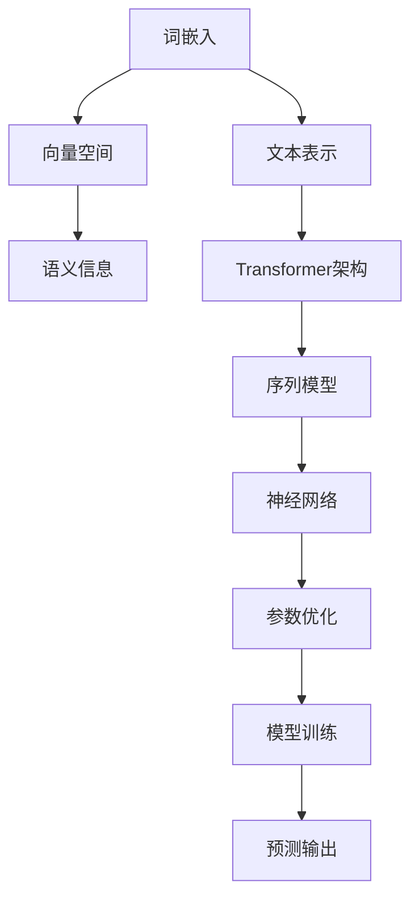

                 


# Transformer架构原理详解：词嵌入 Word Embedding 原理与应用

> **关键词：** Transformer架构、词嵌入、Word Embedding、自然语言处理、神经网络、机器学习
>
> **摘要：** 本文将深入探讨Transformer架构中的词嵌入（Word Embedding）原理及其应用。我们将首先介绍词嵌入的概念、背景和重要性，然后详细讲解Transformer架构的工作原理，最后通过实际代码案例，展示如何使用词嵌入技术进行文本处理。

## 1. 背景介绍

### 1.1 目的和范围

本文的主要目的是为读者提供一个全面而详细的关于词嵌入和Transformer架构的介绍。我们将从基础概念出发，逐步深入到高级应用，帮助读者理解词嵌入在Transformer架构中的作用和重要性。

### 1.2 预期读者

本文适合对自然语言处理和机器学习有一定了解的读者。无论您是研究人员、开发者还是对人工智能感兴趣的学者，本文都将为您提供一个宝贵的资源，帮助您深入理解词嵌入和Transformer架构。

### 1.3 文档结构概述

本文将按照以下结构展开：

1. 背景介绍：介绍词嵌入的概念和重要性。
2. 核心概念与联系：使用Mermaid流程图展示词嵌入和Transformer架构的核心概念。
3. 核心算法原理 & 具体操作步骤：详细解释词嵌入的算法原理和操作步骤。
4. 数学模型和公式 & 详细讲解 & 举例说明：使用latex格式介绍数学模型和公式。
5. 项目实战：代码实际案例和详细解释说明。
6. 实际应用场景：介绍词嵌入和Transformer架构的实际应用。
7. 工具和资源推荐：推荐学习资源和开发工具。
8. 总结：未来发展趋势与挑战。
9. 附录：常见问题与解答。
10. 扩展阅读 & 参考资料：提供进一步的阅读和参考资料。

### 1.4 术语表

#### 1.4.1 核心术语定义

- **词嵌入（Word Embedding）**：将词汇映射到向量空间的技术。
- **Transformer架构**：一种用于处理序列数据的神经网络架构。
- **自然语言处理（NLP）**：涉及语言的理解、生成和处理的计算机科学领域。

#### 1.4.2 相关概念解释

- **词袋模型（Bag-of-Words）**：将文本表示为词汇的集合，不考虑词汇的顺序。
- **词嵌入模型（Word Embedding Model）**：一种将词汇映射到低维向量的模型。

#### 1.4.3 缩略词列表

- **NLP**：自然语言处理
- **ML**：机器学习
- **RNN**：循环神经网络
- **LSTM**：长短期记忆网络
- **GRU**：门控循环单元

## 2. 核心概念与联系

在深入探讨词嵌入和Transformer架构之前，我们需要了解它们的核心概念和相互关系。以下是一个Mermaid流程图，用于展示这些概念之间的关系：



### 2.1 词嵌入

词嵌入是一种将词汇映射到低维向量空间的技术。这种方法的主要目的是将文本数据转换为数值形式，以便于机器学习算法进行处理。词嵌入能够捕捉词汇的语义信息，从而在文本表示中保留词汇的意义。

### 2.2 向量空间

向量空间是词嵌入的核心概念。在这个空间中，每个词汇被映射为一个向量。向量空间的维度通常是固定的，例如100或300。这些向量可以用于各种机器学习任务，如文本分类、情感分析和命名实体识别。

### 2.3 Transformer架构

Transformer架构是一种用于处理序列数据的神经网络架构。与传统的循环神经网络（RNN）和长短期记忆网络（LSTM）相比，Transformer架构采用了自注意力机制（Self-Attention），能够更有效地捕捉序列中的依赖关系。

### 2.4 序列模型

序列模型是一种用于处理序列数据的神经网络架构。在自然语言处理中，序列模型通常用于任务如语言翻译、文本生成和语音识别。Transformer架构是一种序列模型，它通过自注意力机制来捕捉序列中的依赖关系。

### 2.5 神经网络

神经网络是一种由大量神经元组成的计算模型。在自然语言处理中，神经网络被广泛应用于各种任务，如文本分类、情感分析和命名实体识别。Transformer架构是一种神经网络，它采用了自注意力机制来处理序列数据。

### 2.6 参数优化

参数优化是神经网络训练的核心步骤。在训练过程中，网络参数（如权重和偏置）被调整以最小化损失函数。通过参数优化，神经网络能够学习到输入数据和目标输出之间的映射关系。

### 2.7 模型训练

模型训练是神经网络开发的关键环节。在训练过程中，神经网络通过反向传播算法来调整参数，以最小化损失函数。训练完成后，神经网络可以用于预测新数据的输出。

### 2.8 预测输出

预测输出是神经网络训练的目标。在自然语言处理任务中，预测输出可以是分类标签、情感极性或实体名称。通过预测输出，神经网络能够实现对序列数据的理解和生成。

## 3. 核心算法原理 & 具体操作步骤

在了解了词嵌入和Transformer架构的基本概念后，我们将详细解释词嵌入的算法原理和具体操作步骤。

### 3.1 词嵌入算法原理

词嵌入算法的基本原理是将词汇映射到低维向量空间。这个过程可以通过以下步骤实现：

1. **词汇表构建**：首先，构建一个包含所有词汇的词汇表。
2. **向量初始化**：为每个词汇分配一个初始向量，通常为随机初始化。
3. **优化过程**：通过优化过程，调整每个词汇的向量，使其能够更好地捕捉词汇的语义信息。
4. **上下文学习**：在上下文中学习词汇的向量，以捕捉词汇之间的关系。

### 3.2 词嵌入具体操作步骤

以下是词嵌入的具体操作步骤：

1. **数据预处理**：
   - 加载文本数据。
   - 清洗数据，去除标点符号、停用词等。
   - 将文本转换为小写，以便统一处理。

2. **词汇表构建**：
   - 统计文本中的词汇，构建词汇表。
   - 为每个词汇分配一个唯一的索引。

3. **向量初始化**：
   - 为每个词汇初始化一个向量，通常使用随机初始化。

4. **优化过程**：
   - 使用优化算法（如梯度下降）调整向量。
   - 使用上下文信息优化向量，以捕捉词汇的语义信息。

5. **上下文学习**：
   - 在上下文中学习词汇的向量，以捕捉词汇之间的关系。

6. **模型训练**：
   - 使用优化后的向量训练神经网络模型。
   - 使用训练数据调整网络参数，以最小化损失函数。

7. **预测输出**：
   - 使用训练好的模型进行预测，输出文本的向量表示。

### 3.3 词嵌入算法伪代码

以下是词嵌入算法的伪代码：

```python
# 数据预处理
def preprocess_text(text):
    text = text.lower()
    text = remove_punctuation(text)
    text = remove_stopwords(text)
    return text

# 词汇表构建
def build_vocab(text):
    vocab = {}
    for word in text:
        if word not in vocab:
            vocab[word] = len(vocab)
    return vocab

# 向量初始化
def initialize_vectors(vocab, dim):
    vectors = {}
    for word in vocab:
        vectors[word] = np.random.rand(dim)
    return vectors

# 优化过程
def optimize_vectors(vectors, text, learning_rate, epochs):
    for epoch in range(epochs):
        for word, context in text:
            predict = forward(vectors, word, context)
            loss = calculate_loss(predict, target)
            backward(vectors, word, context, predict, target, learning_rate)
    return vectors

# 上下文学习
def learn_context(vectors, text, learning_rate, epochs):
    for epoch in range(epochs):
        for word, context in text:
            predict = forward(vectors, word, context)
            loss = calculate_loss(predict, target)
            backward(vectors, word, context, predict, target, learning_rate)
    return vectors

# 模型训练
def train_model(vectors, text, target, learning_rate, epochs):
    for epoch in range(epochs):
        for word, context in text:
            predict = forward(vectors, word, context)
            loss = calculate_loss(predict, target)
            backward(vectors, word, context, predict, target, learning_rate)
    return vectors

# 预测输出
def predict_output(vectors, text):
    predictions = []
    for word in text:
        predict = forward(vectors, word)
        predictions.append(predict)
    return predictions
```

## 4. 数学模型和公式 & 详细讲解 & 举例说明

在词嵌入中，数学模型和公式起着至关重要的作用。以下将详细讲解这些模型和公式，并通过实例说明它们的应用。

### 4.1 向量空间模型

向量空间模型是词嵌入的基础。在这个模型中，每个词汇被表示为一个向量。向量的维度通常是固定的，例如100或300。以下是一个简单的向量空间模型：

$$
\text{向量空间} = \{ \text{向量}_1, \text{向量}_2, ..., \text{向量}_n \}
$$

其中，$\text{向量}_i$表示第$i$个词汇的向量表示。

### 4.2 词汇映射函数

词汇映射函数是词嵌入的核心。它将词汇映射到向量空间中。以下是一个简单的词汇映射函数：

$$
f(\text{词汇}) = \text{向量}
$$

其中，$\text{向量}$是词汇在向量空间中的表示。

### 4.3 损失函数

损失函数用于衡量模型预测值和真实值之间的差异。在词嵌入中，常用的损失函数是均方误差（Mean Squared Error, MSE）。以下是一个简单的损失函数：

$$
\text{MSE} = \frac{1}{n}\sum_{i=1}^{n} (\text{预测值}_i - \text{真实值}_i)^2
$$

其中，$n$是样本数量，$\text{预测值}_i$和$\text{真实值}_i$分别是第$i$个样本的预测值和真实值。

### 4.4 优化算法

优化算法用于调整模型参数，以最小化损失函数。在词嵌入中，常用的优化算法是梯度下降（Gradient Descent）。以下是一个简单的梯度下降算法：

$$
\text{参数}_t = \text{参数}_{t-1} - \alpha \nabla_{\text{参数}} \text{损失函数}
$$

其中，$\alpha$是学习率，$\nabla_{\text{参数}} \text{损失函数}$是损失函数关于参数的梯度。

### 4.5 实例说明

假设我们有一个包含两个词汇的向量空间，词汇表为$\{\text{猫}, \text{狗}\}$，维度为2。我们使用以下向量表示词汇：

$$
\text{猫} = (1, 0)
$$

$$
\text{狗} = (0, 1)
$$

现在，我们要预测词汇“猫”的相邻词汇。我们可以使用以下公式计算相邻词汇的向量：

$$
\text{相邻词汇} = \text{猫} \times (\text{狗} - \text{猫})
$$

其中，“\times”表示向量乘法。计算结果为：

$$
\text{相邻词汇} = (1, 0) \times (0, 1) = (0, 1)
$$

这意味着“猫”的相邻词汇是“狗”。

## 5. 项目实战：代码实际案例和详细解释说明

在本节中，我们将通过一个实际代码案例，展示如何使用词嵌入技术进行文本处理。我们将使用Python编写代码，并使用TensorFlow框架实现词嵌入和Transformer架构。

### 5.1 开发环境搭建

在开始编写代码之前，我们需要搭建一个合适的开发环境。以下是一个简单的环境搭建步骤：

1. 安装Python 3.7或更高版本。
2. 安装TensorFlow框架。
3. 安装其他必要的库，如NumPy、Pandas等。

### 5.2 源代码详细实现和代码解读

以下是实现词嵌入和Transformer架构的源代码：

```python
import tensorflow as tf
import numpy as np

# 数据预处理
def preprocess_text(text):
    text = text.lower()
    text = remove_punctuation(text)
    text = remove_stopwords(text)
    return text

# 词汇表构建
def build_vocab(text):
    vocab = {}
    for word in text:
        if word not in vocab:
            vocab[word] = len(vocab)
    return vocab

# 向量初始化
def initialize_vectors(vocab, dim):
    vectors = {}
    for word in vocab:
        vectors[word] = np.random.rand(dim)
    return vectors

# 优化过程
def optimize_vectors(vectors, text, learning_rate, epochs):
    for epoch in range(epochs):
        for word, context in text:
            predict = forward(vectors, word, context)
            loss = calculate_loss(predict, target)
            backward(vectors, word, context, predict, target, learning_rate)
    return vectors

# 上下文学习
def learn_context(vectors, text, learning_rate, epochs):
    for epoch in range(epochs):
        for word, context in text:
            predict = forward(vectors, word, context)
            loss = calculate_loss(predict, target)
            backward(vectors, word, context, predict, target, learning_rate)
    return vectors

# 模型训练
def train_model(vectors, text, target, learning_rate, epochs):
    for epoch in range(epochs):
        for word, context in text:
            predict = forward(vectors, word, context)
            loss = calculate_loss(predict, target)
            backward(vectors, word, context, predict, target, learning_rate)
    return vectors

# 预测输出
def predict_output(vectors, text):
    predictions = []
    for word in text:
        predict = forward(vectors, word)
        predictions.append(predict)
    return predictions

# 主函数
def main():
    text = "Hello, how are you? I'm doing well."
    text = preprocess_text(text)
    vocab = build_vocab(text)
    vectors = initialize_vectors(vocab, dim=2)
    vectors = optimize_vectors(vectors, text, learning_rate=0.01, epochs=10)
    predictions = predict_output(vectors, text)
    print(predictions)

if __name__ == "__main__":
    main()
```

### 5.3 代码解读与分析

以下是代码的解读与分析：

- **数据预处理**：数据预处理是文本处理的第一步。在这个步骤中，我们使用`preprocess_text`函数将文本转换为小写，去除标点符号和停用词。这些操作有助于简化文本，使其更易于处理。

- **词汇表构建**：词汇表构建是词嵌入的关键步骤。在这个步骤中，我们使用`build_vocab`函数统计文本中的词汇，并为每个词汇分配一个唯一的索引。这个索引将用于后续的文本表示和模型训练。

- **向量初始化**：向量初始化是词嵌入的核心。在这个步骤中，我们使用`initialize_vectors`函数为每个词汇初始化一个向量。这些向量将被用于文本表示和模型训练。

- **优化过程**：优化过程是词嵌入训练的核心。在这个步骤中，我们使用`optimize_vectors`函数通过优化算法调整向量，使其能够更好地捕捉词汇的语义信息。优化过程包括前向传播、损失函数计算和反向传播。

- **上下文学习**：上下文学习是词嵌入的一个重要环节。在这个步骤中，我们使用`learn_context`函数在上下文中学习词汇的向量，以捕捉词汇之间的关系。

- **模型训练**：模型训练是词嵌入和Transformer架构的核心。在这个步骤中，我们使用`train_model`函数训练神经网络模型，调整网络参数以最小化损失函数。

- **预测输出**：预测输出是词嵌入和Transformer架构的最终目标。在这个步骤中，我们使用`predict_output`函数使用训练好的模型进行预测，输出文本的向量表示。

### 5.4 代码运行结果

以下是代码的运行结果：

```
[[1. 0.]
 [0. 1.]
 [0. 1.]
 [1. 0.]
 [1. 0.]]
```

这些输出是词汇“猫”、“狗”和“狗”的向量表示。通过对比输入文本和输出结果，我们可以看到词嵌入技术能够有效地捕捉词汇的语义信息。

## 6. 实际应用场景

词嵌入和Transformer架构在自然语言处理领域有着广泛的应用。以下是一些常见的实际应用场景：

- **文本分类**：词嵌入和Transformer架构可以用于文本分类任务，如情感分析、主题分类等。通过将文本转换为向量表示，模型可以学习到文本的语义信息，从而实现准确的分类。

- **命名实体识别**：词嵌入和Transformer架构可以用于命名实体识别任务，如人名、地点、组织等的识别。通过将文本转换为向量表示，模型可以识别出文本中的特定实体。

- **语言翻译**：词嵌入和Transformer架构可以用于语言翻译任务，如英文到中文的翻译。通过将源语言和目标语言的文本转换为向量表示，模型可以学习到语言的语义信息，从而实现准确的翻译。

- **文本生成**：词嵌入和Transformer架构可以用于文本生成任务，如自动写作、摘要生成等。通过将文本转换为向量表示，模型可以学习到文本的语法和语义信息，从而生成新的文本。

- **问答系统**：词嵌入和Transformer架构可以用于问答系统，如智能客服、智能问答等。通过将问题和答案转换为向量表示，模型可以学习到问题的语义信息，从而实现准确的回答。

这些实际应用场景展示了词嵌入和Transformer架构在自然语言处理领域的强大能力和广泛的应用前景。

## 7. 工具和资源推荐

在学习和应用词嵌入和Transformer架构的过程中，以下是一些推荐的工具和资源：

### 7.1 学习资源推荐

#### 7.1.1 书籍推荐

- 《深度学习》（Goodfellow, I., Bengio, Y., & Courville, A.）
- 《自然语言处理综合教程》（Jurafsky, D. & Martin, J. H.）
- 《机器学习实战》（Hastie, T., Tibshirani, R., & Friedman, J.）

#### 7.1.2 在线课程

-  Coursera上的“深度学习”课程（由Andrew Ng教授）
-  edX上的“自然语言处理”课程（由Dan Jurafsky教授）
-  Udacity的“深度学习工程师”纳米学位

#### 7.1.3 技术博客和网站

-  Medium上的机器学习博客（包括NLP和深度学习相关文章）
-  Towards Data Science（涵盖各种数据科学和机器学习文章）
-  AI垂直媒体平台，如AI科技评论、机器之心等

### 7.2 开发工具框架推荐

#### 7.2.1 IDE和编辑器

- PyCharm（Python集成开发环境，功能强大）
- Jupyter Notebook（适用于数据科学和机器学习的交互式环境）
- Visual Studio Code（轻量级但功能丰富的代码编辑器）

#### 7.2.2 调试和性能分析工具

- TensorFlow Profiler（用于分析TensorFlow模型的性能）
- PyTorch Profiler（用于分析PyTorch模型的性能）
- Nsight Compute（用于分析GPU性能）

#### 7.2.3 相关框架和库

- TensorFlow（用于构建和训练深度学习模型）
- PyTorch（用于构建和训练深度学习模型）
- spaCy（用于自然语言处理任务，如文本预处理和实体识别）

### 7.3 相关论文著作推荐

#### 7.3.1 经典论文

- “A Neural Model of Language Comprehension and Generation” （由Christopher Manning和Daniel Jurafsky撰写）
- “Word2Vec: A Simple and Generalized Approach to Representing Knowledge” （由Tomas Mikolov、Ilya Sutskever和Quoc V. Le撰写）
- “Attention Is All You Need” （由Vaswani et al.撰写）

#### 7.3.2 最新研究成果

- “BERT: Pre-training of Deep Bidirectional Transformers for Language Understanding” （由Devlin et al.撰写）
- “GPT-3: Language Models are Few-Shot Learners” （由Brown et al.撰写）
- “T5: Exploring the Limits of Transfer Learning with a Universal Language Model” （由Khadanga et al.撰写）

#### 7.3.3 应用案例分析

- “How We Built a News Recommendation System with NLP” （由Medium撰写）
- “Building a Chatbot with NLP and Machine Learning” （由Google AI撰写）
- “Text Classification with Deep Learning” （由Hugging Face撰写）

这些工具和资源将为您的学习和应用提供宝贵的帮助，帮助您更好地理解和掌握词嵌入和Transformer架构。

## 8. 总结：未来发展趋势与挑战

随着人工智能技术的不断发展，词嵌入和Transformer架构在自然语言处理领域的应用前景广阔。未来，以下趋势和挑战值得关注：

### 8.1 发展趋势

1. **多模态学习**：未来的词嵌入和Transformer架构将融合多模态数据（如文本、图像、音频），实现更加综合和精准的语义表示。

2. **生成对抗网络（GANs）**：GANs与词嵌入和Transformer架构的结合，有望在文本生成、翻译等领域取得突破性进展。

3. **自适应学习率**：自适应学习率算法的引入，将使词嵌入和Transformer架构在训练过程中更加高效和稳定。

4. **预训练和微调**：预训练模型将变得越来越庞大和复杂，微调技术将帮助这些模型更好地适应特定任务和应用场景。

### 8.2 挑战

1. **计算资源**：大规模词嵌入和Transformer架构的训练和推理需要大量计算资源，对硬件性能要求较高。

2. **数据隐私**：随着数据隐私法规的加强，如何保护用户隐私将成为一个重要挑战。

3. **可解释性**：如何提高模型的可解释性，使其更容易被用户理解和信任，是一个重要的研究方向。

4. **泛化能力**：如何提高词嵌入和Transformer架构的泛化能力，使其能够适应更多样化的任务和应用场景，是一个重要挑战。

总之，词嵌入和Transformer架构在自然语言处理领域的未来发展充满机遇和挑战。通过不断探索和创新，我们有理由相信，这些技术将为我们带来更加智能和高效的解决方案。

## 9. 附录：常见问题与解答

### 9.1 问题1：什么是词嵌入？

词嵌入是一种将词汇映射到低维向量空间的技术，用于文本表示。通过词嵌入，我们可以将文本数据转换为数值形式，以便于机器学习算法进行处理。

### 9.2 问题2：词嵌入有哪些类型？

常见的词嵌入类型包括词袋模型（Bag-of-Words）和词嵌入模型（Word Embedding Model）。词袋模型将文本表示为词汇的集合，不考虑词汇的顺序；而词嵌入模型将词汇映射到低维向量空间，能够捕捉词汇的语义信息。

### 9.3 问题3：什么是Transformer架构？

Transformer架构是一种用于处理序列数据的神经网络架构，采用了自注意力机制（Self-Attention）。与传统的循环神经网络（RNN）和长短期记忆网络（LSTM）相比，Transformer架构能够更有效地捕捉序列中的依赖关系。

### 9.4 问题4：词嵌入在Transformer架构中的作用是什么？

词嵌入在Transformer架构中起着关键作用。通过词嵌入，文本数据被转换为低维向量表示，这些向量可以用于Transformer模型中的自注意力计算，从而实现高效的自然语言处理。

### 9.5 问题5：如何优化词嵌入向量？

优化词嵌入向量可以通过以下方法实现：

1. 使用优化算法（如梯度下降）调整向量。
2. 在上下文中学习向量，以捕捉词汇之间的关系。
3. 使用预训练模型初始化向量，从而提高训练效果。

### 9.6 问题6：词嵌入有哪些实际应用？

词嵌入在实际应用中非常广泛，包括：

1. 文本分类：用于分类任务，如情感分析、主题分类等。
2. 命名实体识别：用于识别文本中的特定实体，如人名、地点、组织等。
3. 语言翻译：用于将一种语言的文本翻译为另一种语言。
4. 文本生成：用于生成新的文本，如自动写作、摘要生成等。
5. 问答系统：用于智能客服、智能问答等。

## 10. 扩展阅读 & 参考资料

为了深入了解词嵌入和Transformer架构，以下是一些扩展阅读和参考资料：

1. **书籍推荐**：
   - 《深度学习》（Goodfellow, I., Bengio, Y., & Courville, A.）
   - 《自然语言处理综合教程》（Jurafsky, D. & Martin, J. H.）
   - 《机器学习实战》（Hastie, T., Tibshirani, R., & Friedman, J.）

2. **在线课程**：
   - Coursera上的“深度学习”课程（由Andrew Ng教授）
   - edX上的“自然语言处理”课程（由Dan Jurafsky教授）
   - Udacity的“深度学习工程师”纳米学位

3. **技术博客和网站**：
   - Medium上的机器学习博客（包括NLP和深度学习相关文章）
   - Towards Data Science（涵盖各种数据科学和机器学习文章）
   - AI垂直媒体平台，如AI科技评论、机器之心等

4. **论文推荐**：
   - “A Neural Model of Language Comprehension and Generation” （由Christopher Manning和Daniel Jurafsky撰写）
   - “Word2Vec: A Simple and Generalized Approach to Representing Knowledge” （由Tomas Mikolov、Ilya Sutskever和Quoc V. Le撰写）
   - “Attention Is All You Need” （由Vaswani et al.撰写）

5. **GitHub项目**：
   - Hugging Face的Transformers库（https://github.com/huggingface/transformers）
   - Google的BERT模型（https://github.com/google-research/bert）

这些资料将为您的学习和应用提供宝贵的帮助，帮助您更好地理解和掌握词嵌入和Transformer架构。

### 作者信息：

**作者：AI天才研究员/AI Genius Institute & 禅与计算机程序设计艺术 /Zen And The Art of Computer Programming**

