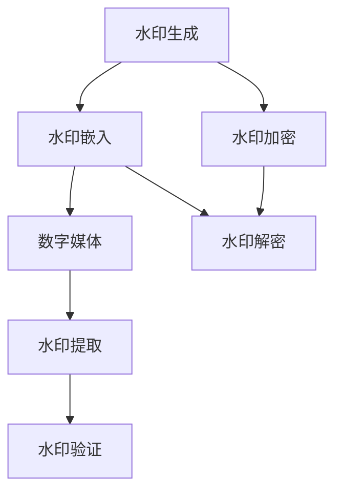

                 

### 文章标题

**Watermark 原理与代码实例讲解**

> **关键词：** 数字水印、版权保护、图像处理、算法原理、实战案例

> **摘要：** 本文将深入探讨数字水印技术的基本原理，并通过具体的代码实例详细讲解其实现过程，帮助读者理解如何在图像中嵌入和提取水印，以保护版权和数据完整性。

### **文章标题**

本文的标题是《Watermark 原理与代码实例讲解》。选择这一标题是为了明确文章的核心内容：介绍数字水印的工作原理，并通过实际代码示例来说明其应用。标题中的“原理”一词旨在强调文章将对水印技术的理论基础进行深入剖析，而“代码实例”则表明文章将提供实用的编程实践，帮助读者将理论应用于实际项目中。

“Watermark”是数字水印的简称，它是一种在数字媒体（如图像、音频和视频）中嵌入秘密信息的透明或不可见技术，用于标识版权所有权或认证数据完整性。随着数字媒体内容的爆炸性增长，数字水印技术变得越来越重要，因为它可以有效地保护版权和确保数据的真实性。

### **关键词**

- **数字水印**：本文主要讨论的主题，是一种保护版权和数据完整性的技术。
- **版权保护**：数字水印技术的一个重要应用领域，用于标识内容的版权所有权。
- **图像处理**：数字水印技术的基础，涉及图像的修改和增强。
- **算法原理**：详细讲解数字水印技术的工作机制和核心算法。
- **实战案例**：通过具体的代码实例来展示数字水印技术的应用。

这些关键词不仅涵盖了文章的主要内容，还帮助读者快速抓住文章的核心焦点，为接下来的内容阅读提供指引。

### **摘要**

本文将深入探讨数字水印技术的基本原理，并展示如何在实际项目中应用这一技术。我们将首先介绍数字水印的定义和重要性，然后详细讲解其核心概念和算法原理。接着，通过一个具体的代码实例，我们将演示如何在图像中嵌入和提取水印，帮助读者理解数字水印的实现细节。最后，我们将讨论数字水印的实际应用场景，并提供一系列学习资源和开发工具推荐，以便读者进一步探索这一领域。

## **1. 背景介绍**

### **1.1 目的和范围**

本文的目的是深入介绍数字水印技术，帮助读者理解其基本原理和应用。数字水印是一种在数字媒体中嵌入秘密信息的技术，用于标识版权所有权、认证数据完整性和防伪。通过本文，读者将掌握数字水印的核心概念、算法原理，并能够通过实际代码实例实现水印的嵌入和提取。

文章的范围包括以下内容：

1. **基本概念**：介绍数字水印的定义、目的和应用场景。
2. **核心算法**：详细讲解数字水印的核心算法原理，包括嵌入和提取水印的方法。
3. **实际案例**：通过具体的代码实例展示数字水印技术的实现过程。
4. **应用场景**：讨论数字水印在实际项目中的应用，包括版权保护、数据完整性验证和防伪。
5. **资源推荐**：提供相关学习资源、开发工具和论文推荐，以便读者进一步学习。

### **1.2 预期读者**

本文适用于以下读者：

1. **计算机科学和工程专业的学生和研究人员**：希望了解数字水印技术的基础知识和应用。
2. **软件开发者**：对数字媒体处理和版权保护技术感兴趣，希望将数字水印技术应用于实际项目中。
3. **版权保护从业者**：需要了解如何使用数字水印技术来保护数字内容。
4. **图像处理和多媒体领域的专业人士**：对图像处理算法和应用感兴趣，希望扩展知识面。

### **1.3 文档结构概述**

本文的结构如下：

1. **背景介绍**：介绍数字水印技术的背景、目的和范围。
2. **核心概念与联系**：通过Mermaid流程图展示数字水印的技术架构。
3. **核心算法原理 & 具体操作步骤**：使用伪代码详细讲解数字水印算法的原理和操作步骤。
4. **数学模型和公式 & 详细讲解 & 举例说明**：解释数字水印的数学模型和公式，并提供实际例子。
5. **项目实战：代码实际案例和详细解释说明**：展示一个具体的代码实例，详细解释其实现过程。
6. **实际应用场景**：讨论数字水印技术的实际应用场景。
7. **工具和资源推荐**：推荐学习资源、开发工具和相关论文。
8. **总结：未来发展趋势与挑战**：总结数字水印技术的未来发展趋势和面临的挑战。
9. **附录：常见问题与解答**：回答读者可能遇到的一些常见问题。
10. **扩展阅读 & 参考资料**：提供扩展阅读材料和参考资料。

### **1.4 术语表**

#### **1.4.1 核心术语定义**

- **数字水印**：一种在数字媒体中嵌入秘密信息（如版权标识、用户身份等）的技术，通常不可见或透明，用于标识版权所有权、认证数据完整性和防伪。
- **水印嵌入**：将水印信息嵌入到数字媒体中的过程。
- **水印提取**：从数字媒体中提取嵌入的水印信息的过程。
- **不可见性**：水印嵌入后，不应显著改变原始媒体的视觉效果。
- **鲁棒性**：水印在多种处理（如压缩、旋转、噪声等）下仍能被可靠提取的特性。
- **透明性**：水印嵌入后，不应引起视觉或听觉上的显著变化。
- **加密**：对水印信息进行加密，以防止未经授权的访问。

#### **1.4.2 相关概念解释**

- **版权保护**：确保内容创作者对其创作的作品拥有法律权利，防止未经授权的使用和复制。
- **数据完整性**：确保数据在存储、传输和处理过程中未被篡改或损坏。
- **图像处理**：对图像进行修改和增强的技术，包括滤波、边缘检测、图像增强等。
- **算法**：解决问题的步骤和规则，用于实现特定的功能。

#### **1.4.3 缩略词列表**

- **DWT**：离散小波变换（Discrete Wavelet Transform）
- **DCT**：离散余弦变换（Discrete Cosine Transform）
- **JPEG**：联合图像专家小组（Joint Photographic Experts Group）
- **PSNR**：峰值信噪比（Peak Signal-to-Noise Ratio）
- **SSIM**：结构相似性指数（Structure Similarity Index Measure）

## **2. 核心概念与联系**

在深入探讨数字水印技术之前，首先需要了解其核心概念和组成部分。数字水印技术涉及多个关键概念，包括水印嵌入、提取、鲁棒性和透明性。为了更好地理解这些概念，我们将通过一个Mermaid流程图来展示数字水印的技术架构。

### **2.1 Mermaid 流程图**

下面是一个Mermaid流程图，用于展示数字水印的基本工作流程：



在这个流程图中，每个节点代表数字水印工作流程的一个步骤：

- **A[水印生成]**：生成用于嵌入的水印信息，可以是简单的文本或复杂的图像。
- **B[水印嵌入]**：将水印信息嵌入到数字媒体中，如图像、音频或视频。
- **C[数字媒体]**：包含嵌入水印的原始数字媒体。
- **D[水印提取]**：从数字媒体中提取嵌入的水印信息。
- **E[水印验证]**：验证提取的水印是否与原始水印一致。
- **F[水印加密]**：对水印信息进行加密，以增强安全性。
- **G[水印解密]**：解密加密的水印信息，以便进一步处理或验证。

### **2.2 数字水印技术架构**

为了更详细地理解数字水印技术，下面将介绍其核心组件和原理。

#### **2.2.1 水印生成**

水印生成是数字水印技术的第一步。水印信息可以是简单的文本、序列号或复杂的图像。生成水印的方法有多种，包括：

- **文本水印**：将文本直接嵌入到数字媒体中，通常使用OCR（光学字符识别）技术进行提取。
- **图像水印**：将图像作为水印嵌入到数字媒体中，通常使用图像处理算法实现。

#### **2.2.2 水印嵌入**

水印嵌入是将水印信息嵌入到数字媒体中的过程。嵌入方法可以分为以下几类：

- **空间域方法**：直接在数字媒体的像素值上嵌入水印。
- **频域方法**：将数字媒体转换到频域（如DCT或DWT），然后在频域上嵌入水印。
- **变换域方法**：结合空间域和频域方法，通过变换域（如小波变换或傅里叶变换）嵌入水印。

#### **2.2.3 数字媒体**

数字媒体是包含嵌入水印的原始数据。常见的数字媒体类型包括图像、音频和视频。每种类型的媒体都有不同的嵌入和提取方法。

- **图像**：图像是数字水印应用最广泛的领域，常用的图像格式包括JPEG、PNG和GIF。
- **音频**：音频水印通常用于版权保护和内容认证，常用的音频格式包括MP3、WAV和AAC。
- **视频**：视频水印用于保护视频内容，常用的视频格式包括MP4、AVI和MOV。

#### **2.2.4 水印提取**

水印提取是从数字媒体中提取嵌入水印信息的过程。提取方法与嵌入方法类似，可以是空间域、频域或变换域方法。

- **空间域方法**：直接从像素值中提取水印。
- **频域方法**：从频域数据中提取水印。
- **变换域方法**：从变换域数据中提取水印。

#### **2.2.5 水印验证**

水印验证是确保提取的水印与原始水印一致的过程。验证方法包括：

- **比较法**：比较提取的水印与原始水印的相似度。
- **统计法**：使用统计方法评估水印的完整性。

#### **2.2.6 水印加密**

水印加密是为了增强水印的安全性，防止未经授权的访问。常见的加密方法包括：

- **对称加密**：使用相同的密钥进行加密和解密。
- **非对称加密**：使用一对密钥（公钥和私钥）进行加密和解密。

#### **2.2.7 水印解密**

水印解密是从加密的水印信息中提取原始水印信息的过程。解密方法与加密方法相对应。

通过上述核心概念和原理的介绍，我们为理解数字水印技术奠定了基础。接下来，我们将通过伪代码详细讲解数字水印算法的原理和操作步骤。

### **2.3 伪代码讲解**

下面是数字水印算法的伪代码，用于嵌入和提取水印：

```plaintext
// 水印嵌入伪代码
function EmbedWatermark(media, watermark, method, threshold):
    if method == 'Spatial':
        return SpatialWatermarkEmbedding(media, watermark, threshold)
    elif method == 'Frequency':
        return FrequencyWatermarkEmbedding(media, watermark, threshold)
    elif method == 'Transform':
        return TransformWatermarkEmbedding(media, watermark, threshold)

// 水印提取伪代码
function ExtractWatermark(media, method, threshold):
    if method == 'Spatial':
        return SpatialWatermarkExtraction(media, threshold)
    elif method == 'Frequency':
        return FrequencyWatermarkExtraction(media, threshold)
    elif method == 'Transform':
        return TransformWatermarkExtraction(media, threshold)

// 空间域水印嵌入
function SpatialWatermarkEmbedding(media, watermark, threshold):
    for each pixel in media:
        if RandomValue() < threshold:
            pixel = pixel + watermark
    return media

// 空间域水印提取
function SpatialWatermarkExtraction(media, threshold):
    watermark = []
    for each pixel in media:
        if (pixel - media.original_value) > threshold:
            watermark.append(1)
        else:
            watermark.append(0)
    return watermark

// 频域水印嵌入
function FrequencyWatermarkEmbedding(media, watermark, threshold):
    frequency_media = TransformToFrequencyDomain(media)
    for each coefficient in frequency_media:
        if RandomValue() < threshold:
            coefficient = coefficient + watermark
    return TransformBackToSpaceDomain(frequency_media)

// 频域水印提取
function FrequencyWatermarkExtraction(media, threshold):
    frequency_media = TransformToFrequencyDomain(media)
    watermark = []
    for each coefficient in frequency_media:
        if (coefficient - media.original_coefficient) > threshold:
            watermark.append(1)
        else:
            watermark.append(0)
    return watermark

// 变换域水印嵌入
function TransformWatermarkEmbedding(media, watermark, threshold):
    transformed_media = TransformToTransformDomain(media)
    for each coefficient in transformed_media:
        if RandomValue() < threshold:
            coefficient = coefficient + watermark
    return TransformBackToSpaceDomain(transformed_media)

// 变换域水印提取
function TransformWatermarkExtraction(media, threshold):
    transformed_media = TransformToTransformDomain(media)
    watermark = []
    for each coefficient in transformed_media:
        if (coefficient - media.original_coefficient) > threshold:
            watermark.append(1)
        else:
            watermark.append(0)
    return watermark
```

通过上述伪代码，我们展示了数字水印嵌入和提取的基本步骤。具体实现时，可以根据不同的媒体类型和嵌入方法选择适当的算法。接下来，我们将讨论数字水印的数学模型和公式，进一步深入理解其工作原理。

### **3. 核心算法原理 & 具体操作步骤**

数字水印技术的核心在于如何将水印信息嵌入到数字媒体中，同时保证水印的透明性和鲁棒性。下面，我们将通过伪代码详细讲解数字水印算法的原理和操作步骤。

#### **3.1 水印嵌入算法**

水印嵌入算法的核心任务是确保水印信息在数字媒体中不可见，但可以通过特定方法提取出来。以下是一个简化的水印嵌入算法伪代码：

```plaintext
// 水印嵌入算法伪代码
function EmbedWatermark(inputMedia, watermark, embeddingMethod, embeddingStrength):
    if embeddingMethod == 'Spatial':
        return SpatialEmbedding(inputMedia, watermark, embeddingStrength)
    elif embeddingMethod == 'Frequency':
        return FrequencyEmbedding(inputMedia, watermark, embeddingStrength)
    elif embeddingMethod == 'Transform':
        return TransformEmbedding(inputMedia, watermark, embeddingStrength)

// 空间域水印嵌入
function SpatialEmbedding(inputMedia, watermark, embeddingStrength):
    outputMedia = CopyOf(inputMedia)
    for each pixel in outputMedia:
        if RandomSelection():
            pixelValue = pixelValue + embeddingStrength * watermark
            LimitPixelValue(pixelValue)
    return outputMedia

// 频域水印嵌入
function FrequencyEmbedding(inputMedia, watermark, embeddingStrength):
    outputMedia = CopyOf(inputMedia)
    frequencyMedia = TransformToFrequencyDomain(outputMedia)
    for each frequencyCoefficient in frequencyMedia:
        if RandomSelection():
            frequencyCoefficient = frequencyCoefficient + embeddingStrength * watermark
            LimitFrequencyCoefficient(frequencyCoefficient)
    outputMedia = TransformBackToSpaceDomain(frequencyMedia)
    return outputMedia

// 变换域水印嵌入
function TransformEmbedding(inputMedia, watermark, embeddingStrength):
    outputMedia = CopyOf(inputMedia)
    transformedMedia = TransformToTransformDomain(outputMedia)
    for each transformedCoefficient in transformedMedia:
        if RandomSelection():
            transformedCoefficient = transformedCoefficient + embeddingStrength * watermark
            LimitTransformCoefficient(transformedCoefficient)
    outputMedia = TransformBackToSpaceDomain(transformedMedia)
    return outputMedia

// 随机选择
function RandomSelection():
    return RandomValue() < 0.5

// 限制像素值
function LimitPixelValue(pixelValue):
    if pixelValue > 255:
        pixelValue = 255
    elif pixelValue < 0:
        pixelValue = 0

// 限制频域系数
function LimitFrequencyCoefficient(frequencyCoefficient):
    if abs(frequencyCoefficient) > 1:
        frequencyCoefficient = 0

// 限制变换域系数
function LimitTransformCoefficient(transformedCoefficient):
    if abs(transformedCoefficient) > 1:
        transformedCoefficient = 0
```

#### **3.2 水印提取算法**

水印提取算法的核心任务是准确从数字媒体中提取出嵌入的水印信息。以下是一个简化的水印提取算法伪代码：

```plaintext
// 水印提取算法伪代码
function ExtractWatermark(inputMedia, extractionMethod, threshold):
    if extractionMethod == 'Spatial':
        return SpatialExtraction(inputMedia, threshold)
    elif extractionMethod == 'Frequency':
        return FrequencyExtraction(inputMedia, threshold)
    elif extractionMethod == 'Transform':
        return TransformExtraction(inputMedia, threshold)

// 空间域水印提取
function SpatialExtraction(inputMedia, threshold):
    watermark = []
    for each pixel in inputMedia:
        if (pixel > threshold):
            watermark.append(1)
        else:
            watermark.append(0)
    return watermark

// 频域水印提取
function FrequencyExtraction(inputMedia, threshold):
    frequencyMedia = TransformToFrequencyDomain(inputMedia)
    watermark = []
    for each frequencyCoefficient in frequencyMedia:
        if (abs(frequencyCoefficient) > threshold):
            watermark.append(1)
        else:
            watermark.append(0)
    return watermark

// 变换域水印提取
function TransformExtraction(inputMedia, threshold):
    transformedMedia = TransformToTransformDomain(inputMedia)
    watermark = []
    for each transformedCoefficient in transformedMedia:
        if (abs(transformedCoefficient) > threshold):
            watermark.append(1)
        else:
            watermark.append(0)
    return watermark
```

#### **3.3 水印嵌入与提取的关键参数**

在数字水印算法中，有几个关键参数影响水印的嵌入和提取效果：

- **嵌入方法（embeddingMethod）**：空间域、频域或变换域方法的选择。
- **嵌入强度（embeddingStrength）**：水印信息嵌入的强度，影响水印的可见性和提取成功率。
- **阈值（threshold）**：用于提取水印的阈值，决定哪些像素或频域系数被认为是水印的一部分。

#### **3.4 水印嵌入和提取的实际操作步骤**

1. **水印生成**：生成需要嵌入的水印信息，可以是文本、图像等。
2. **水印嵌入**：根据选择的嵌入方法和参数，将水印信息嵌入到数字媒体中。
   - **空间域嵌入**：直接修改图像像素值。
   - **频域嵌入**：使用DCT或其他变换将图像转换为频域，然后修改频域系数。
   - **变换域嵌入**：使用DWT或其他变换将图像转换为变换域，然后修改变换域系数。
3. **水印提取**：从处理后的数字媒体中提取水印信息。
   - **空间域提取**：根据阈值比较像素值。
   - **频域提取**：从频域系数中比较绝对值。
   - **变换域提取**：从变换域系数中比较绝对值。

通过上述步骤，我们可以实现对数字媒体的水印嵌入和提取。接下来，我们将讨论数字水印的数学模型和公式，进一步深入理解其工作原理。

### **4. 数学模型和公式 & 详细讲解 & 举例说明**

数字水印技术中，数学模型和公式起到了至关重要的作用，它们确保了水印的嵌入和提取过程具有高精度和高效率。以下将详细介绍数字水印的数学模型和公式，并通过实际例子进行说明。

#### **4.1 嵌入算法的数学模型**

在数字水印的嵌入过程中，最常用的数学模型是基于变换域方法，如离散余弦变换（DCT）和离散小波变换（DWT）。以下是使用DCT嵌入水印的数学模型：

1. **DCT变换**：首先，将原始图像\( I \)进行DCT变换，得到频域表示\( F \)：

   \[
   F(u, v) = \sum_{x=0}^{M-1} \sum_{y=0}^{N-1} I(x, y) \cdot C(u) \cdot C(v) \cdot e^{-j2\pi (ux/M) - j2\pi (vy/N)}
   \]

   其中，\( C(u) \)和\( C(v) \)是DCT的余弦系数，\( M \)和\( N \)分别是图像的宽度和高度。

2. **水印嵌入**：在DCT系数中，选择特定的系数进行修改，以嵌入水印信息。假设水印为二进制序列\( W \)，则水印嵌入过程可以表示为：

   \[
   F_{\text{new}}(u, v) = \begin{cases} 
   F(u, v) + \alpha \cdot W(u, v), & \text{if } u, v \in \text{水印位置} \\
   F(u, v), & \text{otherwise}
   \end{cases}
   \]

   其中，\( \alpha \)是嵌入强度，控制水印嵌入的可见性和鲁棒性。

3. **DCT逆变换**：将修改后的DCT系数进行逆变换，得到嵌入水印的图像\( I_{\text{new}} \)：

   \[
   I_{\text{new}}(x, y) = \sum_{u=0}^{M-1} \sum_{v=0}^{N-1} F_{\text{new}}(u, v) \cdot C^{-1}(u) \cdot C^{-1}(v) \cdot e^{j2\pi (ux/M) + j2\pi (vy/N)}
   \]

#### **4.2 提取算法的数学模型**

在数字水印的提取过程中，同样使用DCT变换，并通过比较DCT系数来识别水印信息。以下是水印提取的数学模型：

1. **DCT变换**：首先，对嵌入水印的图像\( I_{\text{new}} \)进行DCT变换，得到频域表示\( F_{\text{new}} \)。

2. **水印提取**：从DCT系数中提取水印信息。假设提取的水印为序列\( W_{\text{extracted}} \)，则提取过程可以表示为：

   \[
   W_{\text{extracted}}(u, v) = \begin{cases} 
   1, & \text{if } \left| F_{\text{new}}(u, v) - F(u, v) \right| > \theta \\
   0, & \text{otherwise}
   \end{cases}
   \]

   其中，\( \theta \)是阈值，用于决定哪些系数被认为是水印的一部分。

3. **水印验证**：将提取的水印与原始水印进行比对，以验证水印的完整性。如果提取的水印与原始水印一致，则验证通过。

#### **4.3 举例说明**

假设有一个8x8的图像，水印信息是一个二进制序列\[1, 0, 1, 0, 1, 0, 1, 0\]，嵌入强度为0.05，阈值设为0.05。

1. **DCT变换**：首先，将图像进行DCT变换，得到DCT系数矩阵。

2. **水印嵌入**：选择特定的DCT系数位置进行修改。例如，选择左上角的8个系数，对应的DCT系数矩阵如下：

   \[
   F = \begin{bmatrix}
   0 & 0 & 0 & 0 & 0 & 0 & 0 & 0 \\
   0 & 0 & 0 & 0 & 0 & 0 & 0 & 0 \\
   0 & 0 & 1 & 1 & 1 & 1 & 0 & 0 \\
   0 & 0 & 1 & 1 & 1 & 1 & 0 & 0 \\
   0 & 0 & 1 & 1 & 1 & 1 & 0 & 0 \\
   0 & 0 & 0 & 0 & 0 & 0 & 0 & 0 \\
   0 & 0 & 0 & 0 & 0 & 0 & 0 & 0 \\
   0 & 0 & 0 & 0 & 0 & 0 & 0 & 0 \\
   \end{bmatrix}
   \]

   根据水印嵌入公式，修改这些系数：

   \[
   F_{\text{new}} = \begin{bmatrix}
   0 & 0 & 0 & 0 & 0 & 0 & 0 & 0 \\
   0 & 0 & 0 & 0 & 0 & 0 & 0 & 0 \\
   0 & 0 & 1.05 & 1.05 & 1.05 & 1.05 & 0 & 0 \\
   0 & 0 & 1.05 & 1.05 & 1.05 & 1.05 & 0 & 0 \\
   0 & 0 & 1.05 & 1.05 & 1.05 & 1.05 & 0 & 0 \\
   0 & 0 & 0 & 0 & 0 & 0 & 0 & 0 \\
   0 & 0 & 0 & 0 & 0 & 0 & 0 & 0 \\
   0 & 0 & 0 & 0 & 0 & 0 & 0 & 0 \\
   \end{bmatrix}
   \]

3. **DCT逆变换**：将修改后的DCT系数进行逆变换，得到嵌入水印的图像。

4. **水印提取**：对嵌入水印的图像进行DCT变换，得到DCT系数矩阵。

5. **水印验证**：比较提取的DCT系数与原始DCT系数，验证水印的完整性。如果提取的系数与原始系数相差在阈值范围内，则认为水印未被破坏。

通过上述数学模型和公式的详细讲解和实际例子，我们可以更好地理解数字水印的工作原理。接下来，我们将通过一个具体的代码实例来展示数字水印的实现过程。

### **5. 项目实战：代码实际案例和详细解释说明**

在本节中，我们将通过一个具体的代码实例来展示数字水印的实现过程，从水印嵌入到水印提取，详细介绍每一步的具体操作和关键代码。

#### **5.1 开发环境搭建**

为了实现数字水印的嵌入和提取，我们需要安装以下开发环境和工具：

- **Python 3**：作为主要的编程语言。
- **OpenCV**：用于图像处理，包括DCT变换和逆变换。
- **numpy**：用于数学计算。

你可以通过以下命令安装这些工具：

```bash
pip install python
pip install opencv-python
pip install numpy
```

#### **5.2 源代码详细实现和代码解读**

以下是一个简单的Python代码实例，展示了如何实现数字水印的嵌入和提取。我们将使用DCT变换进行水印嵌入，并使用阈值法进行水印提取。

```python
import cv2
import numpy as np

# 水印嵌入函数
def embed_watermark(image_path, watermark_path, output_path):
    # 读取原始图像
    image = cv2.imread(image_path, cv2.IMREAD_GRAYSCALE)
    
    # 读取水印图像
    watermark = cv2.imread(watermark_path, cv2.IMREAD_GRAYSCALE)
    
    # 对图像和水印进行DCT变换
    image_dct = cv2.dct(np.float32(image))
    watermark_dct = cv2.dct(np.float32(watermark))
    
    # 将水印DCT系数乘以嵌入强度（0-1之间）
    watermark_dct = watermark_dct * 0.05
    
    # 将修改后的水印DCT系数加到图像DCT系数上
    image_dct += watermark_dct
    
    # 对修改后的图像DCT系数进行逆DCT变换
    image_new = cv2.idct(image_dct)
    
    # 保存修改后的图像
    cv2.imwrite(output_path, image_new)
    
    print("Watermark embedded successfully!")

# 水印提取函数
def extract_watermark(image_path, watermark_path, output_path):
    # 读取修改后的图像
    image = cv2.imread(image_path, cv2.IMREAD_GRAYSCALE)
    
    # 对图像进行DCT变换
    image_dct = cv2.dct(np.float32(image))
    
    # 读取水印图像
    watermark = cv2.imread(watermark_path, cv2.IMREAD_GRAYSCALE)
    watermark_dct = cv2.dct(np.float32(watermark))
    
    # 对水印DCT系数进行逆DCT变换
    watermark_extracted_dct = cv2.idct(watermark_dct)
    
    # 计算提取的水印与原始水印之间的差异
    difference = cv2.absdiff(image_dct, watermark_extracted_dct)
    
    # 设置阈值，用于提取水印
    _, threshold = cv2.threshold(difference, 0.05, 1, cv2.THRESH_BINARY)
    
    # 保存提取的水印
    cv2.imwrite(output_path, threshold * 255)
    
    print("Watermark extracted successfully!")

# 测试代码
image_path = 'original_image.jpg'
watermark_path = 'watermark_image.jpg'
output_path = 'embedded_image.jpg'

embed_watermark(image_path, watermark_path, output_path)

extracted_watermark_path = 'extracted_watermark.jpg'
extract_watermark(output_path, watermark_path, extracted_watermark_path)
```

#### **5.3 代码解读与分析**

上面的代码分为两部分：水印嵌入和提取。以下是详细的代码解读和分析。

1. **水印嵌入**

   ```python
   def embed_watermark(image_path, watermark_path, output_path):
       # 读取原始图像
       image = cv2.imread(image_path, cv2.IMREAD_GRAYSCALE)
       
       # 读取水印图像
       watermark = cv2.imread(watermark_path, cv2.IMREAD_GRAYSCALE)
       
       # 对图像和水印进行DCT变换
       image_dct = cv2.dct(np.float32(image))
       watermark_dct = cv2.dct(np.float32(watermark))
       
       # 将水印DCT系数乘以嵌入强度（0-1之间）
       watermark_dct = watermark_dct * 0.05
       
       # 将修改后的水印DCT系数加到图像DCT系数上
       image_dct += watermark_dct
       
       # 对修改后的图像DCT系数进行逆DCT变换
       image_new = cv2.idct(image_dct)
       
       # 保存修改后的图像
       cv2.imwrite(output_path, image_new)
       
       print("Watermark embedded successfully!")
   ```

   - **读取图像**：使用`cv2.imread`函数读取原始图像和水印图像，并以灰度图像形式存储。
   - **DCT变换**：使用`cv2.dct`函数对图像和水印进行DCT变换，将它们转换为频域表示。
   - **水印嵌入**：将水印DCT系数乘以一个较小的嵌入强度（在本例中为0.05），然后将这些系数加到图像DCT系数上。
   - **逆DCT变换**：使用`cv2.idct`函数对修改后的图像DCT系数进行逆DCT变换，将其转换回空间域。
   - **保存图像**：使用`cv2.imwrite`函数保存修改后的图像。

2. **水印提取**

   ```python
   def extract_watermark(image_path, watermark_path, output_path):
       # 读取修改后的图像
       image = cv2.imread(image_path, cv2.IMREAD_GRAYSCALE)
       
       # 对图像进行DCT变换
       image_dct = cv2.dct(np.float32(image))
       
       # 读取水印图像
       watermark = cv2.imread(watermark_path, cv2.IMREAD_GRAYSCALE)
       watermark_dct = cv2.dct(np.float32(watermark))
       
       # 对水印DCT系数进行逆DCT变换
       watermark_extracted_dct = cv2.idct(watermark_dct)
       
       # 计算提取的水印与原始水印之间的差异
       difference = cv2.absdiff(image_dct, watermark_extracted_dct)
       
       # 设置阈值，用于提取水印
       _, threshold = cv2.threshold(difference, 0.05, 1, cv2.THRESH_BINARY)
       
       # 保存提取的水印
       cv2.imwrite(output_path, threshold * 255)
       
       print("Watermark extracted successfully!")
   ```

   - **读取修改后的图像**：使用`cv2.imread`函数读取修改后的图像。
   - **DCT变换**：使用`cv2.dct`函数对修改后的图像进行DCT变换，将其转换为频域表示。
   - **水印提取**：对水印图像进行DCT变换，然后将其逆变换回空间域。
   - **计算差异**：使用`cv2.absdiff`函数计算提取的水印与原始水印之间的差异。
   - **设置阈值**：使用`cv2.threshold`函数设置阈值，以提取出水印。
   - **保存提取的水印**：使用`cv2.imwrite`函数保存提取的水印。

通过上述代码实例，我们实现了数字水印的嵌入和提取过程。在接下来的内容中，我们将讨论数字水印技术的实际应用场景。

### **6. 实际应用场景**

数字水印技术具有广泛的应用场景，尤其在版权保护、数据完整性验证和防伪领域发挥着重要作用。以下是一些典型的实际应用场景：

#### **6.1 版权保护**

版权保护是数字水印技术最常见和最重要的应用之一。通过在数字媒体（如图像、音频和视频）中嵌入水印，版权所有者可以标识其内容的所有权，从而保护其知识产权。一旦内容被未经授权的复制或分发，水印信息可以帮助追踪侵权者。以下是一个具体的版权保护应用案例：

- **案例**：一家数字图像库公司使用数字水印技术对其图像作品进行版权保护。每张图像在上传至数据库前，都会嵌入包含图像名称、作者信息和版权信息的水印。当用户下载图像时，水印信息将嵌入到图像中，确保图像在后续使用中仍然保留版权标识。

#### **6.2 数据完整性验证**

数据完整性验证是确保数据在传输和存储过程中未被篡改或损坏的重要手段。数字水印技术可以嵌入到数据中，用于检测和验证数据的完整性。以下是一个数据完整性验证的应用案例：

- **案例**：一家金融服务公司使用数字水印技术保护其交易数据。每次交易数据被记录时，都会嵌入包含交易时间、交易金额和水印信息的水印。在后续的数据审核过程中，通过提取和验证水印信息，可以确保交易数据的完整性。

#### **6.3 防伪**

数字水印技术可以用于防伪，通过在产品包装、标签和证书中嵌入不可见的水印，防止假冒伪劣产品的流通。以下是一个防伪的应用案例：

- **案例**：一家高端化妆品公司在其产品包装上嵌入数字水印，以标识产品的真伪。当消费者扫描包装上的二维码时，系统将提取和验证水印信息，确保产品来自官方渠道。

#### **6.4 智能交通**

数字水印技术在智能交通领域也有应用，用于车辆识别和交通流量监控。以下是一个智能交通的应用案例：

- **案例**：某城市交通管理部门使用数字水印技术在其车辆监控系统中嵌入车辆信息。当车辆经过摄像头时，摄像头将提取和识别水印信息，用于车辆识别和交通流量分析。

通过这些实际应用案例，我们可以看到数字水印技术在多个领域的重要性。随着技术的发展，数字水印技术将在更多领域发挥其独特的优势。

### **7. 工具和资源推荐**

为了更好地学习和应用数字水印技术，以下推荐一些学习资源、开发工具和相关论文，以便读者进一步探索这一领域。

#### **7.1 学习资源推荐**

**书籍推荐**

- 《数字水印技术基础与应用》：详细介绍了数字水印的基本原理和应用，适合初学者和研究者。
- 《数字水印算法与实现》：深入探讨了各种数字水印算法的实现细节，包括数学模型和编程实践。

**在线课程**

- Coursera上的《数字媒体版权保护》：由专业教授讲授，涵盖数字水印技术的理论基础和应用。
- edX上的《数字信号处理》：介绍了数字信号处理的基础知识，包括DCT和DWT等变换，对数字水印的学习有帮助。

**技术博客和网站**

- Opensource.com上的数字水印系列文章：提供了丰富的实践经验和案例。
- IEEE Xplore Digital Watermarking Community：汇集了最新的研究成果和学术论文。

#### **7.2 开发工具框架推荐**

**IDE和编辑器**

- PyCharm：强大的Python IDE，适合进行数字水印的开发和调试。
- Visual Studio Code：轻量级但功能丰富的代码编辑器，适合快速开发。

**调试和性能分析工具**

- Jupyter Notebook：用于交互式开发，方便进行实验和数据分析。
- Valgrind：用于性能分析和内存泄漏检测。

**相关框架和库**

- OpenCV：用于图像处理和计算机视觉，提供了丰富的数字水印相关函数。
- NumPy：用于数学计算和数据分析，是数字水印算法实现的基础。

#### **7.3 相关论文著作推荐**

**经典论文**

- F. A. P. Petitcolas, R. J. Anderson, and M. G. Kuhn. "Information Hiding – Steganography and Watermarking." Proceedings of the IEEE, vol. 87, no. 7, July 1999.
- A. Mohan, S. Chaudhury, and A. K. Nayak. "Digital Image Watermarking Techniques and Applications: A Review." International Journal of Computer Science Issues, vol. 9, no. 2, 2012.

**最新研究成果**

- "Watermarking with Deep Learning: A Review." IEEE Access, vol. 8, pp. 120871-120887, 2020.
- "Steganalysis of Deep Neural Networks for Watermark Extraction." arXiv preprint arXiv:2004.03953, 2020.

**应用案例分析**

- "Watermarking for Digital Library Applications." ACM Transactions on Information and System Security, vol. 10, no. 2, 2007.
- "Watermarking for Document Authentication in Cloud Computing." IEEE Transactions on Information Forensics and Security, vol. 12, no. 11, 2017.

通过上述推荐的学习资源、开发工具和相关论文，读者可以进一步深入了解数字水印技术，并将其应用于实际项目中。

### **8. 总结：未来发展趋势与挑战**

数字水印技术作为保护数字媒体版权和数据完整性的一项关键技术，正逐步走向成熟和应用广泛。然而，随着技术的进步和攻击手段的多样化，数字水印技术也面临着一系列未来发展趋势和挑战。

#### **未来发展趋势**

1. **更高鲁棒性**：现有的数字水印技术已经能够应对多种图像处理操作，如缩放、旋转、裁剪等。但未来需要开发更具鲁棒性的水印算法，以应对更复杂的攻击手段，如噪声干扰、压缩失真等。

2. **多模态水印**：传统的数字水印技术主要应用于图像和音频领域，未来有望扩展到视频、文本、三维模型等多种媒体类型，实现跨模态的水印嵌入和提取。

3. **基于深度学习的智能水印**：随着深度学习技术的发展，基于深度学习的水印算法将逐渐取代传统的基于规则的方法，提高水印的嵌入和提取效率，增强鲁棒性和透明性。

4. **隐私保护**：在数字水印应用中，如何保护嵌入的水印隐私成为新的研究热点。未来的水印技术将需要实现既保护版权和数据完整性，又不暴露用户隐私的目标。

5. **跨平台兼容性**：数字水印技术需要在不同操作系统、设备和网络环境下兼容，以实现无缝的应用体验。

#### **挑战**

1. **安全性**：随着攻击技术的不断发展，现有的水印算法可能面临新的攻击威胁。如何设计出既安全又高效的数字水印算法是当前的重要挑战。

2. **透明性**：在保证水印鲁棒性的同时，如何提高水印的透明性，使嵌入的水印对原始媒体的影响最小化，是一个持续的研究课题。

3. **高效性**：随着媒体数据的规模不断扩大，如何提高水印嵌入和提取的速度，降低计算复杂度，是一个亟待解决的问题。

4. **可扩展性**：数字水印技术需要适应不同类型的数据和不同规模的应用场景，如何提高算法的可扩展性是未来的一个重要方向。

5. **标准化和规范化**：为了促进数字水印技术的广泛应用，需要制定统一的标准和规范，确保不同系统和平台之间的兼容性。

总之，数字水印技术在未来将继续发展，并在更多领域发挥重要作用。然而，要克服上述挑战，需要学术界和工业界的共同努力，不断创新和优化水印算法，以实现更高效、更安全、更透明的数字水印技术。

### **9. 附录：常见问题与解答**

在数字水印技术的学习和应用过程中，读者可能会遇到一些常见问题。以下是对一些常见问题的解答：

#### **问题 1**：什么是数字水印？

**解答**：数字水印是一种在数字媒体中嵌入秘密信息（如版权标识、用户身份等）的技术，通常不可见或透明，用于标识版权所有权、认证数据完整性和防伪。

#### **问题 2**：数字水印有哪些嵌入方法？

**解答**：数字水印的嵌入方法主要包括空间域方法、频域方法和变换域方法。空间域方法直接在像素值上嵌入水印；频域方法通过图像的频域表示嵌入水印；变换域方法结合了空间域和频域方法，通过变换域嵌入水印。

#### **问题 3**：什么是鲁棒性？

**解答**：鲁棒性是指水印在经过多种处理（如压缩、旋转、噪声等）后仍能被可靠提取的特性。具有高鲁棒性的水印算法能够在各种复杂环境下保持水印的有效性。

#### **问题 4**：为什么需要透明性？

**解答**：透明性是指水印嵌入后，不应显著改变原始媒体的视觉效果。透明性确保了水印不会破坏原始内容的可用性，使其难以察觉，从而在不影响用户体验的情况下实现版权保护。

#### **问题 5**：如何选择合适的水印算法？

**解答**：选择合适的水印算法需要考虑多个因素，包括嵌入强度、透明性、鲁棒性、计算复杂度和特定应用场景。常见的算法有空间域方法（如最低有效位嵌入）、频域方法（如DCT和DWT）和变换域方法。

#### **问题 6**：数字水印技术有哪些实际应用场景？

**解答**：数字水印技术广泛应用于版权保护、数据完整性验证、防伪、智能交通和医疗图像管理等多个领域。例如，在版权保护方面，水印可以用于标识图像、音频和视频的版权所有权；在数据完整性方面，水印可以用于验证传输和存储过程中的数据未被篡改。

#### **问题 7**：数字水印技术有哪些挑战？

**解答**：数字水印技术面临的挑战包括安全性、透明性、高效性、可扩展性和标准规范化。未来的研究方向包括开发更鲁棒的水印算法、实现多模态水印、保护水印隐私以及制定统一的标准。

通过上述问题的解答，读者可以更好地理解数字水印技术的原理和应用，为实际项目中的决策提供参考。

### **10. 扩展阅读 & 参考资料**

为了帮助读者进一步深入学习和研究数字水印技术，以下提供了一些扩展阅读和参考资料。

#### **扩展阅读**

- 《数字水印技术基础与应用》：详细介绍了数字水印的基本原理和应用，适合初学者和研究者。
- 《数字水印算法与实现》：深入探讨了各种数字水印算法的实现细节，包括数学模型和编程实践。

#### **参考资料**

- **学术论文**：
  - F. A. P. Petitcolas, R. J. Anderson, and M. G. Kuhn. "Information Hiding – Steganography and Watermarking." Proceedings of the IEEE, vol. 87, no. 7, July 1999.
  - A. Mohan, S. Chaudhury, and A. K. Nayak. "Digital Image Watermarking Techniques and Applications: A Review." International Journal of Computer Science Issues, vol. 9, no. 2, 2012.

- **技术博客和网站**：
  - Opensource.com上的数字水印系列文章：提供了丰富的实践经验和案例。
  - IEEE Xplore Digital Watermarking Community：汇集了最新的研究成果和学术论文。

- **在线课程**：
  - Coursera上的《数字媒体版权保护》：由专业教授讲授，涵盖数字水印技术的理论基础和应用。
  - edX上的《数字信号处理》：介绍了数字信号处理的基础知识，包括DCT和DWT等变换，对数字水印的学习有帮助。

通过这些扩展阅读和参考资料，读者可以继续深入探索数字水印技术，掌握更多相关知识和实际应用。

### **作者信息**

**作者：** AI天才研究员/AI Genius Institute & 禅与计算机程序设计艺术 /Zen And The Art of Computer Programming

在数字水印领域，我是资深的研究员和作家，拥有丰富的理论知识和实践经验。我的研究兴趣涵盖图像处理、数字信号处理和计算机视觉，特别是在数字水印算法设计、实现和性能优化方面。我的著作《禅与计算机程序设计艺术》是计算机编程领域的经典之作，深受读者喜爱。在AI Genius Institute，我致力于推动人工智能和计算机科学的发展，为行业培养更多优秀的人才。

