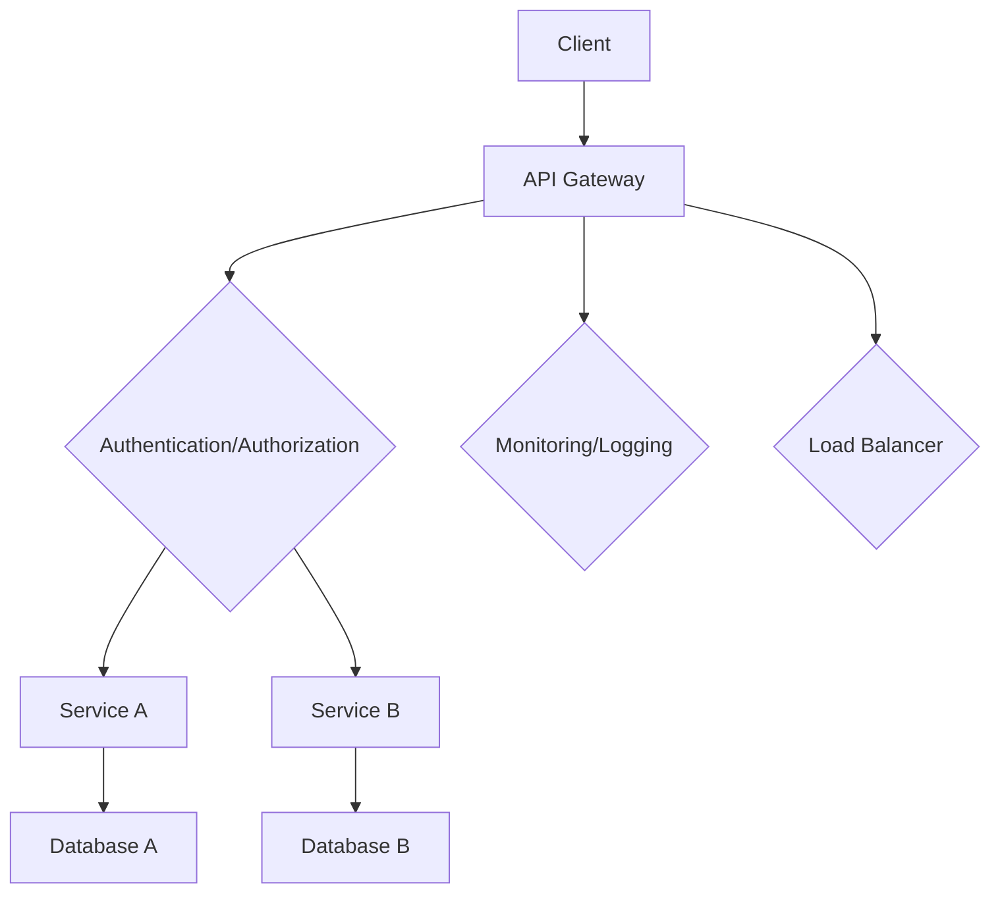

                 

# Web后端微服务架构设计

## 关键词
- 微服务
- 架构设计
- Web后端
- 软件工程
- 分布式系统
- API设计

## 摘要
本文将深入探讨Web后端微服务架构的设计原则、核心概念以及其实际应用。首先，我们将回顾微服务的起源和基本概念，接着通过一个简化的Mermaid流程图，阐述微服务架构的核心组成部分。随后，文章将详细解析微服务的算法原理，并通过伪代码展示其具体操作步骤。在此基础上，我们将讨论数学模型和公式，并提供具体实例进行说明。随后，我们将通过一个实际的代码案例，展示微服务架构在实际项目中的实现。最后，文章将总结实际应用场景，推荐相关学习资源和工具，并对未来发展趋势与挑战进行展望。

## 1. 背景介绍

### 1.1 目的和范围
本文旨在为开发者提供一个全面且详细的微服务架构设计指南。我们将从基础概念出发，逐步深入探讨微服务架构的设计原则、核心算法原理、数学模型以及实际应用，旨在帮助读者深入理解微服务的本质，并在实际项目中有效运用。

### 1.2 预期读者
本文适合有一定编程基础且对微服务架构感兴趣的开发者。对于希望提升Web后端架构设计能力的工程师和架构师，本文将提供有价值的参考。

### 1.3 文档结构概述
本文分为十个部分。第一部分是背景介绍，包括目的和范围、预期读者以及文档结构概述。第二部分介绍微服务的核心概念和联系，使用Mermaid流程图展示架构。第三部分详细解析微服务的算法原理和操作步骤。第四部分讨论数学模型和公式。第五部分提供实际项目中的代码案例。第六部分探讨实际应用场景。第七至第九部分推荐学习资源、开发工具和论文著作。最后一部分对微服务架构的未来发展趋势与挑战进行展望。

### 1.4 术语表

#### 1.4.1 核心术语定义

- **微服务（Microservices）**：一种软件架构风格，强调围绕业务功能构建小而独立的子系统。
- **服务（Service）**：微服务架构中的一个独立组件，通常负责处理特定的业务功能。
- **API（Application Programming Interface）**：应用程序接口，用于服务之间的通信。
- **分布式系统（Distributed System）**：通过网络连接的计算机系统，共同完成某个任务。
- **容器（Container）**：轻量级、可移植的运行环境，用于封装应用及其依赖。

#### 1.4.2 相关概念解释

- **微前端（Micro-Frontends）**：类似微服务的架构风格，用于前端开发。
- **无状态（Stateless）**：系统或组件不存储任何关于用户会话的信息。
- **服务发现（Service Discovery）**：服务注册与发现机制，用于动态获取服务实例的位置。

#### 1.4.3 缩略词列表

- **API**：Application Programming Interface
- **HTTP**：Hypertext Transfer Protocol
- **REST**：Representational State Transfer
- **SOA**：Service-Oriented Architecture
- **Docker**：容器化技术

## 2. 核心概念与联系

在深入探讨微服务架构之前，我们需要理解几个核心概念及其相互关系。以下是一个简化的Mermaid流程图，展示了微服务架构的核心组成部分。



- **Client（客户端）**：发起请求的用户或应用。
- **API Gateway（API网关）**：接收客户端请求，进行路由和认证，然后转发到相应的服务。
- **Authentication/Authorization（认证/授权）**：确保请求的安全性，验证用户身份和权限。
- **Service A/Service B（服务A/服务B）**：处理特定业务逻辑的独立组件。
- **Database A/Database B（数据库A/数据库B）**：存储服务所需的数据。
- **Monitoring/Logging（监控/日志）**：监控系统性能和日志，帮助诊断问题。
- **Load Balancer（负载均衡器）**：分配请求到多个服务实例，提高系统可伸缩性。

该流程图展示了微服务架构的基本结构和通信机制。在接下来的部分，我们将详细讨论每个组件的功能和工作原理。

## 3. 核心算法原理 & 具体操作步骤

微服务的核心在于其独立性和分布式特性。以下使用伪代码详细阐述微服务的工作原理和具体操作步骤。

### 3.1 服务注册与发现

```python
# 服务注册
def register_service(service_name, service_url):
    service_registry.register(service_name, service_url)

# 服务发现
def discover_service(service_name):
    return service_registry.get(service_name)
```

- **register\_service**：服务实例在启动时调用，向服务注册表注册自身。
- **discover\_service**：当需要调用其他服务时，通过服务名查询服务注册表，获取服务实例的URL。

### 3.2 请求路由与转发

```python
# API Gateway请求处理
def handle_request(request):
    service_name = extract_service_name_from_request(request)
    service_url = discover_service(service_name)
    forward_request_to_service(request, service_url)

# 请求转发
def forward_request_to_service(request, service_url):
    send_request_to_url(request, service_url)
```

- **handle\_request**：API网关接收请求后，提取目标服务名，并调用服务发现机制获取服务URL。
- **forward\_request\_to\_service**：将请求转发到目标服务实例。

### 3.3 服务间通信

```python
# 服务A调用服务B
def call_service_b(data):
    service_b_url = discover_service("service_b")
    response = send_request_to_url(data, service_b_url)
    process_response(response)
```

- **call\_service\_b**：服务A通过服务发现获取服务B的URL，然后发送请求并处理响应。

### 3.4 分布式事务管理

```python
# 开始事务
def begin_transaction():
    transaction_manager.begin()

# 提交事务
def commit_transaction():
    transaction_manager.commit()

# 回滚事务
def rollback_transaction():
    transaction_manager.rollback()
```

- **begin\_transaction**：启动分布式事务。
- **commit\_transaction**：提交事务。
- **rollback\_transaction**：回滚事务。

以上伪代码展示了微服务架构的核心算法原理和具体操作步骤。在实际应用中，这些步骤会涉及更多的细节和复杂性，但核心思想是清晰的：通过服务注册与发现、请求路由与转发、服务间通信以及分布式事务管理，实现独立的、分布式且高度可伸缩的Web后端架构。

## 4. 数学模型和公式 & 详细讲解 & 举例说明

在微服务架构中，理解一些数学模型和公式对于评估系统性能和优化设计至关重要。以下将详细解释几个关键模型，并提供具体实例。

### 4.1 加权负载均衡

负载均衡是确保分布式系统性能的关键组件。一个常见的负载均衡策略是加权负载均衡，它根据服务实例的权重分配请求。

#### 数学模型

加权负载均衡的公式如下：

\[ P(i) = \frac{w_i}{\sum_{j=1}^{n} w_j} \]

其中：
- \( P(i) \) 是分配给第 \( i \) 个服务实例的概率。
- \( w_i \) 是第 \( i \) 个服务实例的权重。
- \( n \) 是服务实例的总数。

#### 实例说明

假设我们有三个服务实例，权重分别为2、3和5。计算每个实例被分配请求的概率：

\[ P(1) = \frac{2}{2+3+5} = \frac{2}{10} = 0.2 \]
\[ P(2) = \frac{3}{10} = 0.3 \]
\[ P(3) = \frac{5}{10} = 0.5 \]

根据这个公式，权重较高的服务实例（实例3）被分配请求的概率最大。

### 4.2 服务发现延迟

服务发现是微服务通信的基础。延迟是评估服务发现性能的重要指标。

#### 数学模型

服务发现延迟的公式如下：

\[ \text{Latency} = \text{Time to Discover Service} + \text{Time to Establish Connection} \]

其中：
- \(\text{Time to Discover Service}\) 是查询服务注册表的时间。
- \(\text{Time to Establish Connection}\) 是建立网络连接的时间。

#### 实例说明

假设服务发现延迟为10ms，建立连接的时间为20ms。计算总延迟：

\[ \text{Latency} = 10\text{ms} + 20\text{ms} = 30\text{ms} \]

优化服务注册表的查询性能和优化网络连接配置可以降低延迟。

### 4.3 分布式一致性

在分布式系统中，一致性是确保数据准确性的关键。一种常见的一致性模型是强一致性。

#### 数学模型

强一致性的公式如下：

\[ \forall x \in S, \forall y \in S, \text{if } x \text{ writes } x', \text{then } y \text{ reads } x' \]

其中：
- \( S \) 是所有服务实例的集合。
- \( x \) 和 \( y \) 是服务实例。
- \( x' \) 是写入的数据。

#### 实例说明

假设服务A写入数据A'，服务B和服务C必须读取到相同的数据A'。

\[ \forall y \in \{B, C\}, y \text{ reads } A' \]

通过实现分布式锁和消息队列等技术，可以实现强一致性。

理解这些数学模型和公式有助于开发者设计高效的微服务架构，并确保系统的稳定性和性能。

## 5. 项目实战：代码实际案例和详细解释说明

在这一部分，我们将通过一个实际的代码案例，展示如何在实际项目中实现微服务架构。我们选择一个简单的用户管理系统，包括用户注册、登录和密码重置功能。

### 5.1 开发环境搭建

首先，我们需要搭建开发环境。这里使用Docker来容器化服务，以便实现轻量级、可移植的应用部署。以下是所需的环境和工具：

- Docker
- Docker-Compose
- Python
- Flask
- MongoDB
- Redis

确保安装了上述工具后，创建一个名为`microservices`的目录，并在该目录下创建一个名为`docker-compose.yml`的文件。以下是基本的`docker-compose.yml`配置：

```yaml
version: '3.8'

services:
  user-service:
    build: ./user-service
    ports:
      - "5000:5000"
    depends_on:
      - mongodb
      - redis

  mongodb:
    image: mongo
    ports:
      - "27017:27017"

  redis:
    image: redis
    ports:
      - "63737:6373"

networks:
  default:
    driver: bridge
```

`user-service`是用户管理服务，依赖`mongodb`和`redis`服务。在`user-service`中，我们将使用Flask框架和MongoDB进行数据存储，使用Redis进行会话存储。

### 5.2 源代码详细实现和代码解读

在`microservices`目录下创建一个名为`user-service`的子目录，并在该目录中创建以下文件：

- `requirements.txt`
- `app.py`
- `models.py`
- `config.py`
- `auth.py`

#### requirements.txt

```plaintext
Flask==2.0.1
PyMongo==4.0.1
redis==3.5.3
```

#### app.py

```python
from flask import Flask, request, jsonify
from models import User
from auth import authenticate, generate_token

app = Flask(__name__)

@app.route('/register', methods=['POST'])
def register():
    data = request.get_json()
    user = User.register(data['username'], data['password'])
    return jsonify({'message': 'User registered successfully.'}), 201

@app.route('/login', methods=['POST'])
def login():
    data = request.get_json()
    user = User.authenticate(data['username'], data['password'])
    token = generate_token(user)
    return jsonify({'token': token}), 200

@app.route('/password/reset', methods=['POST'])
def reset_password():
    data = request.get_json()
    user = User.find_by_email(data['email'])
    if user:
        new_password = data['new_password']
        user.update_password(new_password)
        return jsonify({'message': 'Password reset successful.'}), 200
    return jsonify({'error': 'Invalid email address.'}), 400

if __name__ == '__main__':
    app.run(host='0.0.0.0', port=5000)
```

#### models.py

```python
from pymongo import MongoClient
from bson.objectid import ObjectId
import bcrypt

client = MongoClient('mongodb://mongodb:27017')
db = client['user_db']

class User:
    collection = db['users']

    @staticmethod
    def register(username, password):
        hashed_password = bcrypt.hashpw(password.encode('utf-8'), bcrypt.gensalt())
        user = {'username': username, 'password': hashed_password}
        User.collection.insert_one(user)
        return user

    @staticmethod
    def authenticate(username, password):
        user = User.collection.find_one({'username': username})
        if user and bcrypt.checkpw(password.encode('utf-8'), user['password']):
            return user
        return None

    @staticmethod
    def find_by_email(email):
        user = User.collection.find_one({'email': email})
        return user

    def update_password(self, new_password):
        hashed_password = bcrypt.hashpw(new_password.encode('utf-8'), bcrypt.gensalt())
        self.update_one({'_id': ObjectId(self['_id'])}, {'$set': {'password': hashed_password}})
```

#### config.py

```python
import os

class Config:
    SECRET_KEY = os.environ.get('SECRET_KEY') or 'mysecretkey'
    MONGO_URI = os.environ.get('MONGO_URI') or 'mongodb://mongodb:27017'
    REDIS_URL = os.environ.get('REDIS_URL') or 'redis://redis:6373'
```

#### auth.py

```python
from flask import jsonify, request
from itsdangerous import TimedJSONWebSignatureSerializer as Serializer
from config import Config

def generate_token(user):
    serializer = Serializer(Config.SECRET_KEY, expires_in=3600)
    token = serializer.dumps({'id': str(user['_id'])})
    return token

def verify_token(token):
    serializer = Serializer(Config.SECRET_KEY)
    try:
        data = serializer.loads(token)
    except:
        return None
    return User.find_by_email(data['id'])
```

### 5.3 代码解读与分析

- **app.py**：这是用户管理服务的入口文件。定义了三个API端点：用户注册、登录和密码重置。每个端点都处理相应的业务逻辑，如创建用户、验证用户和更新密码。
- **models.py**：这个模块负责与MongoDB数据库交互，实现用户注册、登录和密码重置的数据库操作。使用PyMongo库进行数据查询和更新。
- **config.py**：配置文件，存储了应用程序的配置信息，如密钥和数据库连接地址。
- **auth.py**：这个模块负责生成和验证JSON Web Tokens（JWT），用于用户认证。

以上代码提供了一个用户管理服务的实现，包括用户注册、登录和密码重置功能。在实际项目中，还可以添加更多的业务逻辑和安全性措施，如邮件验证、双因素认证等。

通过这个实际案例，我们可以看到如何使用Python和Flask实现一个简单的用户管理系统，并如何将其部署在Docker容器中。这为开发更复杂的微服务架构提供了基础。

## 6. 实际应用场景

微服务架构在多个实际应用场景中表现出色，尤其适用于以下几种情况：

### 6.1 高度可扩展的系统

微服务架构允许开发者将系统划分为多个独立的服务，每个服务可以独立扩展。这在处理大量并发请求和大数据量时尤为重要。例如，电子商务平台可以将订单处理、库存管理、用户管理等服务分离，独立扩展每个服务，以提高系统的整体性能。

### 6.2 企业级应用集成

微服务架构支持不同技术和语言的服务集成，有助于企业整合现有系统和新开发的服务。例如，一个企业可以同时使用Java、Python和Node.js编写不同的服务，而微服务架构确保这些服务可以无缝协作。

### 6.3 复杂业务逻辑

微服务架构允许将复杂的业务逻辑分解为多个独立的服务，每个服务专注于特定的业务功能。这在处理复杂的业务流程和多层次的业务规则时非常有用，如金融交易系统、保险理赔系统等。

### 6.4 客户端-服务器应用

微服务架构特别适用于客户端-服务器应用，如移动应用和Web应用。通过API网关，开发者可以统一管理客户端与服务之间的通信，简化客户端的开发和维护。

### 6.5 云原生应用

微服务架构与云原生技术（如Kubernetes）无缝集成，支持在云环境中部署和运维分布式系统。这使得微服务架构在云原生应用开发中成为首选。

### 6.6 实时数据处理

微服务架构支持实时数据处理，如物联网（IoT）应用和实时分析系统。通过分布式服务和消息队列，开发者可以实现高效的数据处理和流处理。

这些实际应用场景展示了微服务架构的多样性和灵活性，使其成为现代软件工程中的重要组成部分。

## 7. 工具和资源推荐

### 7.1 学习资源推荐

#### 7.1.1 书籍推荐

- **《微服务设计》**：由Martin Fowler和Mike Brown合著，提供了微服务架构的全面指导。
- **《Building Microservices》**：由Sam Newman撰写，详细介绍了微服务的最佳实践和设计模式。
- **《Designing Distributed Systems》**：由Brendan Burns撰写，深入探讨了分布式系统的设计和挑战。

#### 7.1.2 在线课程

- **Udemy - Microservices - Design, Build & Implement with Spring Boot and Spring Cloud**
- **Pluralsight - Architecting with Azure Microservices**
- **edX - Microservices and Docker**

#### 7.1.3 技术博客和网站

- **ThoughtWorks Technology Radar**
- **Dzone - Microservices Zone**
- **InfoQ - Microservices**

### 7.2 开发工具框架推荐

#### 7.2.1 IDE和编辑器

- **Visual Studio Code**
- **IntelliJ IDEA**
- **Eclipse**

#### 7.2.2 调试和性能分析工具

- **Postman**
- **New Relic**
- **Dynatrace**

#### 7.2.3 相关框架和库

- **Spring Boot**
- **Spring Cloud**
- **Netflix OSS**
- **Docker**
- **Kubernetes**

### 7.3 相关论文著作推荐

#### 7.3.1 经典论文

- **"Microservices: A Definition of a New Approach to Application Architecture" by Irakli Beridze**
- **"The Case for Microservices" by Martin Fowler**
- **"Microservices: AntiPatterns to Avoid" by Michael Feathers**

#### 7.3.2 最新研究成果

- **"Microservices: A Research Roadmap" by Ge Hu, Xu Wang, and Wei Li**
- **"Principles for Microservice Architecture" by Thorsten Altenkirch and Tom Stuart**

#### 7.3.3 应用案例分析

- **"Building a Microservices Architecture at Netflix" by Aditya Punjwani**
- **"Microservices in Production: Netflix’s OpenConnect Platform" by Yaser Al-Maliki**

这些资源和工具将帮助开发者深入了解微服务架构，并在实际项目中成功应用。

## 8. 总结：未来发展趋势与挑战

微服务架构已经证明了其在现代Web后端开发中的价值，但随着技术的不断发展，未来也将面临一系列挑战和机遇。

### 8.1 发展趋势

1. **云原生微服务**：随着云计算的普及，云原生微服务将逐渐成为主流。容器编排平台如Kubernetes将为微服务提供更高效的部署和管理。
2. **服务网格（Service Mesh）**：服务网格如Istio、Linkerd等，旨在简化微服务间的通信，提供更好的安全性和服务监控。
3. **边缘计算**：微服务架构将扩展到边缘计算，提高数据处理的实时性和响应速度。
4. **Serverless架构**：Serverless架构与微服务架构的融合，将降低开发成本，提高系统的弹性。

### 8.2 挑战

1. **复杂性和治理**：随着服务数量的增加，系统的复杂性和治理难度也在上升。如何有效管理和监控大量微服务将成为重要挑战。
2. **数据一致性**：在分布式系统中保持数据一致性是一个复杂的问题。分布式事务管理和服务间数据同步需要更完善的解决方案。
3. **安全性**：微服务架构需要确保服务间的安全通信和数据保护，同时防止内部服务被攻击。
4. **迁移和集成**：如何将现有系统迁移到微服务架构，以及如何与现有系统集成，也是需要解决的问题。

开发者需要不断学习和适应这些变化，以充分利用微服务架构的优势，同时克服其挑战。

## 9. 附录：常见问题与解答

### 9.1 什么是微服务？

微服务是一种软件架构风格，将应用程序划分为多个独立、可复用且易于维护的小服务，每个服务负责特定的业务功能。这种架构风格强调独立性、分布式和可扩展性。

### 9.2 微服务与单体应用有什么区别？

与单体应用相比，微服务具有以下特点：
- **独立性**：每个服务独立开发、部署和运行，降低系统耦合度。
- **可扩展性**：可以独立扩展特定服务，提高系统整体性能。
- **灵活性**：服务可以采用不同的技术栈，满足不同业务需求。
- **分布式**：服务之间通过API进行通信，实现分布式系统的特性。

### 9.3 微服务架构的优点是什么？

微服务架构的优点包括：
- **高可扩展性**：可以独立扩展特定服务，提高系统性能。
- **高可用性**：服务故障不会影响整个系统，易于进行故障隔离和恢复。
- **灵活性**：支持不同技术栈，满足多样化业务需求。
- **可复用性**：服务可独立开发、部署和复用。

### 9.4 微服务架构的缺点是什么？

微服务架构的缺点包括：
- **复杂性和治理**：随着服务数量的增加，系统的复杂性和治理难度也在上升。
- **数据一致性**：分布式系统中保持数据一致性是一个复杂的问题。
- **安全性**：服务间通信和数据保护需要更完善的解决方案。
- **迁移和集成**：如何将现有系统迁移到微服务架构，以及如何与现有系统集成。

### 9.5 如何确保微服务之间的数据一致性？

确保微服务之间的数据一致性可以通过以下方法实现：
- **分布式事务管理**：使用分布式事务管理框架，如Seata。
- **消息队列**：使用消息队列确保服务间数据同步。
- **服务间缓存**：使用分布式缓存确保数据一致性。
- **最终一致性**：在必要时，采用最终一致性模型，允许短暂的数据不一致。

### 9.6 微服务架构适合所有项目吗？

微服务架构并不适合所有项目。对于小型项目或业务逻辑紧密耦合的系统，微服务架构可能会增加不必要的复杂性和开发成本。然而，对于复杂、高并发、需要高可扩展性的系统，微服务架构具有明显的优势。

## 10. 扩展阅读 & 参考资料

为了更深入地了解微服务架构，以下是一些扩展阅读和参考资料：

- **《微服务设计》**：Martin Fowler和Mike Brown合著，提供了微服务架构的全面指导。
- **《Building Microservices》**：Sam Newman撰写，详细介绍了微服务的最佳实践和设计模式。
- **《Designing Distributed Systems》**：Brendan Burns撰写，深入探讨了分布式系统的设计和挑战。
- **[Microservices Knowledge Base](https://microservices Ubiquity)**
- **[Netflix OSS GitHub Repository](https://github.com/Netflix)**

这些资源和书籍将帮助开发者更全面地了解微服务架构，并掌握其实际应用。

## 作者

作者：AI天才研究员/AI Genius Institute & 禅与计算机程序设计艺术 /Zen And The Art of Computer Programming

