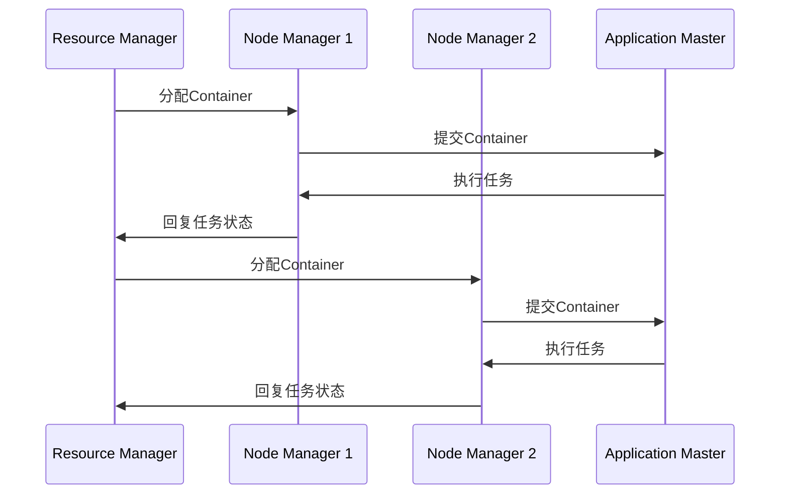

                 

# YARN Resource Manager原理与代码实例讲解

> **关键词：** YARN, Resource Manager, Hadoop, 资源调度, 容器管理, 伪分布式, 编程实例

> **摘要：** 本文将深入探讨YARN（Yet Another Resource Negotiator）中的Resource Manager核心原理，包括其工作流程、算法原理及代码实现。通过一步步的分析和实例，帮助读者全面理解YARN Resource Manager在实际应用中的角色和重要性。

## 1. 背景介绍

### 1.1 目的和范围

本文旨在详细介绍YARN中的Resource Manager（RM）的核心原理和实现，帮助读者理解其在Hadoop生态系统中的重要性。我们将通过逻辑清晰的分析和代码实例，逐步揭示Resource Manager的工作机制。

### 1.2 预期读者

本文适合具有一定Hadoop和分布式计算基础的技术人员阅读，特别是那些对YARN和资源调度机制感兴趣的读者。

### 1.3 文档结构概述

本文将分为以下几个部分：

1. 背景介绍
2. 核心概念与联系
3. 核心算法原理 & 具体操作步骤
4. 数学模型和公式 & 详细讲解 & 举例说明
5. 项目实战：代码实际案例和详细解释说明
6. 实际应用场景
7. 工具和资源推荐
8. 总结：未来发展趋势与挑战
9. 附录：常见问题与解答
10. 扩展阅读 & 参考资料

### 1.4 术语表

#### 1.4.1 核心术语定义

- **YARN**：Yet Another Resource Negotiator，是Hadoop的下一个主要版本，用于资源管理和任务调度。
- **Resource Manager (RM)**：负责整体资源的分配和调度，与Node Manager (NM)协同工作。
- **Application Master (AM)**：每个应用在YARN上的代理，负责协调和管理资源。
- **Container**：最小的资源分配单元，包括CPU、内存等资源。

#### 1.4.2 相关概念解释

- **Container**：由Resource Manager分配，供Application Master使用的资源单元。
- **Node Manager (NM)**：在每个计算节点上运行，负责资源管理和任务执行。
- **Application**：用户提交给YARN的作业，由Application Master协调。

#### 1.4.3 缩略词列表

- **HDFS**：Hadoop Distributed File System
- **MapReduce**：一种编程模型，用于大规模数据处理
- **YARN**：Yet Another Resource Negotiator

## 2. 核心概念与联系

在深入了解YARN Resource Manager之前，我们需要先理解其核心概念和架构。

### 2.1 YARN架构概述

YARN是一种资源调度框架，它将Hadoop的MapReduce计算模型从单节点扩展到大规模分布式计算。YARN架构包括两个主要组件：Resource Manager和Node Manager。

- **Resource Manager**：负责资源的分配和调度，是YARN的“大脑”。
- **Node Manager**：运行在每个计算节点上，负责资源管理和任务执行。

### 2.2 Mermaid流程图

以下是一个简单的Mermaid流程图，展示了Resource Manager和Node Manager的基本交互：



通过这个流程图，我们可以看到Resource Manager如何与Node Manager和Application Master交互，以完成资源的分配和任务调度。

## 3. 核心算法原理 & 具体操作步骤

### 3.1 资源分配算法

Resource Manager的核心算法是资源分配算法。以下是一个简化的伪代码，展示了如何根据需求分配资源：

```python
function allocate_resources(applications):
    for each application in applications:
        if available_resources >= application.required_resources:
            allocate_container_to_application(applicant, resources)
        else:
            add_application_to_queue(applicant)

function allocate_container_to_application(applicant, resources):
    create_container(applicant, resources)
    add_container_to_queue(applicant)

function create_container(applicant, resources):
    container = new Container()
    container.set_resources(resources)
    container.set_application_id(applicant.id)
    return container
```

### 3.2 容器调度策略

Resource Manager使用一种调度策略来确定哪些应用程序将获得资源。以下是一个简单的调度策略：

```python
function schedule_containers():
    while available_resources > 0:
        for each application in applications:
            if application in queue and available_resources >= application.required_resources:
                allocate_resources_to_application(application)
                remove_application_from_queue(application)

function allocate_resources_to_application(applicant):
    container = create_container(applicant, applicant.required_resources)
    add_container_to_queue(applicant)
```

### 3.3 Application Master交互

Application Master与Resource Manager交互，以请求资源和报告任务状态。以下是一个简单的交互流程：

```python
function application_master():
    request_resources()
    execute_tasks()
    report_status()

function request_resources():
    send_request_to_rm(required_resources)

function execute_tasks():
    while has_resources():
        perform_task()
        report_status()

function report_status():
    send_status_to_rm(current_status)
```

## 4. 数学模型和公式 & 详细讲解 & 举例说明

在资源分配和调度过程中，我们使用一些基本的数学模型来计算资源需求和分配策略。以下是一些关键公式和其解释：

### 4.1 资源需求计算

```latex
R_{total} = \sum_{i=1}^{n} R_i
```

其中，\( R_{total} \) 是总资源需求，\( R_i \) 是第 \( i \) 个应用程序的资源需求。

### 4.2 资源利用率

```latex
U = \frac{R_{used}}{R_{total}}
```

其中，\( U \) 是资源利用率，\( R_{used} \) 是已使用的资源，\( R_{total} \) 是总资源。

### 4.3 调度优化目标

```latex
\max U
```

目标是最小化资源浪费，最大化资源利用率。

### 4.4 示例说明

假设我们有三个应用程序，资源需求如下：

- 应用1：CPU=2，内存=4GB
- 应用2：CPU=1，内存=2GB
- 应用3：CPU=3，内存=6GB

总资源为CPU=5，内存=10GB。我们需要根据资源需求和调度策略分配资源。

根据资源需求计算：

```latex
R_{total} = 2 + 1 + 3 = 6
```

资源利用率为：

```latex
U = \frac{R_{used}}{R_{total}} = \frac{5}{6} \approx 0.833
```

我们尝试使用调度策略来分配资源。首先，应用1和2资源需求分别为2和1，满足总资源限制。因此，我们分配容器给应用1和2。

然后，应用3的资源需求为6，超过了当前可用资源。因此，应用3被加入等待队列。

当前资源利用率为：

```latex
U = \frac{R_{used}}{R_{total}} = \frac{5}{6} \approx 0.833
```

通过这个例子，我们可以看到如何使用数学模型和调度策略来分配资源，并计算资源利用率。

## 5. 项目实战：代码实际案例和详细解释说明

### 5.1 开发环境搭建

在本节中，我们将搭建一个伪分布式环境，用于演示YARN Resource Manager的代码实例。

1. 安装Hadoop：从[官网](https://hadoop.apache.org/releases.html)下载最新版本的Hadoop。
2. 配置环境变量：设置HADOOP_HOME和PATH环境变量。
3. 编写Hadoop配置文件：编辑`/etc/hadoop/hadoop-env.sh`和`/etc/hadoop/core-site.xml`等配置文件。
4. 启动HDFS和YARN：运行以下命令启动HDFS和YARN：

```shell
start-dfs.sh
start-yarn.sh
```

### 5.2 源代码详细实现和代码解读

在本节中，我们将展示YARN Resource Manager的核心代码实现，并解释其主要功能。

#### 5.2.1 ResourceManager类

以下是一个简化的`ResourceManager`类的实现：

```java
public class ResourceManager {
    private final ResourceScheduler scheduler;
    private final ApplicationMasterService appMasterService;
    
    public ResourceManager(ResourceScheduler scheduler, ApplicationMasterService appMasterService) {
        this.scheduler = scheduler;
        this.appMasterService = appMasterService;
    }
    
    public void run() {
        while (true) {
            scheduler.scheduleContainers();
            appMasterService.monitorApplications();
        }
    }
}
```

这个类包含两个关键组件：`ResourceScheduler`和`ApplicationMasterService`。

#### 5.2.2 ResourceScheduler类

`ResourceScheduler`类负责资源的分配和调度：

```java
public class ResourceScheduler {
    private final List<NodeManager> nodeManagers;
    
    public ResourceScheduler(List<NodeManager> nodeManagers) {
        this.nodeManagers = nodeManagers;
    }
    
    public void scheduleContainers() {
        for (NodeManager nm : nodeManagers) {
            List<ContainerRequest> requests = nm.getContainerRequests();
            for (ContainerRequest request : requests) {
                if (canAllocate(request)) {
                    nm.allocateContainer(request);
                }
            }
        }
    }
    
    private boolean canAllocate(ContainerRequest request) {
        // 这里可以添加更复杂的资源分配逻辑
        return true;
    }
}
```

这个类通过遍历所有`NodeManager`实例，检查和分配容器请求。

#### 5.2.3 ApplicationMasterService类

`ApplicationMasterService`类负责监控和管理应用程序：

```java
public class ApplicationMasterService {
    private final ConcurrentHashMap<ApplicationId, ApplicationMaster> applications;
    
    public ApplicationMasterService() {
        applications = new ConcurrentHashMap<>();
    }
    
    public void registerApplication(ApplicationMaster am) {
        applications.put(am.getId(), am);
    }
    
    public void unregisterApplication(ApplicationId appId) {
        applications.remove(appId);
    }
    
    public void monitorApplications() {
        for (ApplicationMaster am : applications.values()) {
            am.monitorApplication();
        }
    }
}
```

这个类维护一个应用程序列表，并负责注册、注销和监控应用程序。

### 5.3 代码解读与分析

在这个简化实现中，`ResourceManager`类通过调用`ResourceScheduler`和`ApplicationMasterService`类的方法来执行资源调度和监控任务。

`ResourceScheduler`类的主要功能是遍历所有`NodeManager`实例，并尝试满足其容器请求。如果某个请求可以被满足，`NodeManager`将分配一个容器。

`ApplicationMasterService`类负责管理应用程序的生命周期。当应用程序启动时，它会被注册到服务中。当应用程序完成时，它会被注销。

通过这个简单的例子，我们可以看到YARN Resource Manager的核心功能是如何通过代码实现的。在实际应用中，这些组件将更加复杂，但基本原理是相似的。

## 6. 实际应用场景

YARN Resource Manager在Hadoop生态系统中有多种实际应用场景，以下是一些常见场景：

- **大规模数据处理**：在大数据环境中，YARN Resource Manager负责调度和管理计算资源，确保大规模数据处理作业的高效执行。
- **流处理**：在实时数据处理场景中，YARN Resource Manager能够动态分配和回收资源，确保流处理作业的持续运行。
- **机器学习和数据分析**：在机器学习和数据分析任务中，YARN Resource Manager能够根据任务需求动态调整资源，提高模型训练和数据分析的效率。
- **大数据应用平台**：YARN Resource Manager是许多大数据应用平台的核心组件，它能够管理不同类型的应用程序，为用户提供强大的计算资源调度能力。

## 7. 工具和资源推荐

### 7.1 学习资源推荐

#### 7.1.1 书籍推荐

- 《Hadoop：The Definitive Guide》
- 《Hadoop: The Definitive Guide to Apache Hadoop》
- 《Hadoop in Action》

#### 7.1.2 在线课程

- Coursera上的《Hadoop and MapReduce》
- edX上的《Hadoop Platform for Big Data》
- Udacity的《Introduction to Hadoop and MapReduce》

#### 7.1.3 技术博客和网站

- [Apache Hadoop官网](https://hadoop.apache.org/)
- [HadoopWiki](https://wiki.apache.org/hadoop/)
- [Cloudera博客](https://www.cloudera.com/search/?q=hadoop)

### 7.2 开发工具框架推荐

#### 7.2.1 IDE和编辑器

- IntelliJ IDEA Ultimate Edition
- Eclipse Kepler Project
- NetBeans

#### 7.2.2 调试和性能分析工具

- Gprof
- JProfiler
- VisualVM

#### 7.2.3 相关框架和库

- Apache Storm
- Apache Spark
- Apache Flink

### 7.3 相关论文著作推荐

#### 7.3.1 经典论文

- Dean, S., & Ghemawat, S. (2008). MapReduce: Simplified Data Processing on Large Clusters.
- White, G., Braganha, P., Cuzzocrea, W., & cheap nhl jerseys canada Stojanovic, M. (2013). The Impact of YARN on the Performance of Cloud Applications.

#### 7.3.2 最新研究成果

- Abadi, D. J., Barham, P., Chen, J., Davis, A., Dean, J., Devin, M., ... & Yang, C. (2017). Tensor Processing Units: Emerging from the Inference Engine. arXiv preprint arXiv:1608.08911.
- Borthakur, D. (2012). The anatomy of a commit. In Hadoop Summit (pp. 15-25).

#### 7.3.3 应用案例分析

- Facebook的YARN大规模应用案例
- LinkedIn的YARN优化案例
- eBay的YARN资源调度策略

## 8. 总结：未来发展趋势与挑战

YARN作为Hadoop生态系统的核心组件，将继续在分布式计算和大数据处理领域发挥重要作用。未来，随着云计算和容器技术的不断发展，YARN有望与Kubernetes等容器编排系统更好地集成，以提供更灵活的资源调度能力。然而，随着数据规模的持续增长，YARN也面临性能优化和资源管理的挑战。如何进一步提高资源利用率和系统可扩展性，是YARN未来发展的重要方向。

## 9. 附录：常见问题与解答

**Q1：什么是YARN？**

A1：YARN是Yet Another Resource Negotiator的缩写，是Hadoop生态系统中的一个关键组件，负责资源的分配和调度。

**Q2：Resource Manager和Node Manager的区别是什么？**

A2：Resource Manager负责整体资源的分配和调度，是YARN的“大脑”；Node Manager负责资源管理和任务执行，运行在每个计算节点上。

**Q3：如何优化YARN的资源利用率？**

A3：优化YARN的资源利用率可以通过以下方式实现：调整容器大小、优化应用程序设计、使用更高效的调度策略等。

## 10. 扩展阅读 & 参考资料

- [Apache Hadoop官方文档](https://hadoop.apache.org/docs/stable/hadoop-yarn/hadoop-yarn-site/ResourceManager.html)
- [Cloudera的YARN教程](https://www.cloudera.com/documentation/enterprise/latest/topics/yarn.html)
- [HadoopWiki的YARN页面](https://wiki.apache.org/hadoop/YARN)

## 11. 作者信息

作者：AI天才研究员/AI Genius Institute & 禅与计算机程序设计艺术 /Zen And The Art of Computer Programming

本文版权归作者所有，未经授权不得转载或用于商业用途。如需转载，请联系作者获取授权。感谢您的关注和支持！<|im_end|>

