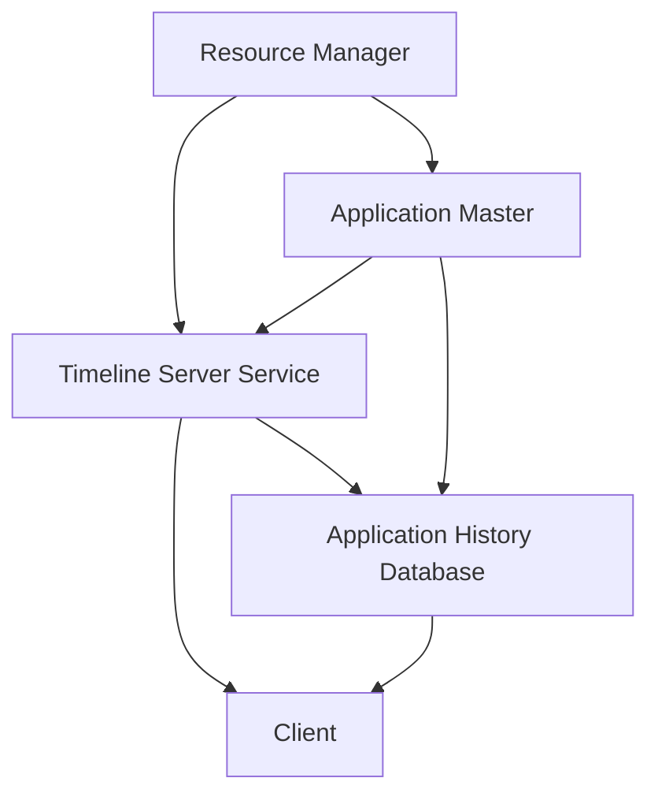

                 


# YARN Timeline Server原理与代码实例讲解

> 关键词：YARN，Timeline Server，架构原理，代码实例，分布式计算

> 摘要：本文将深入探讨YARN Timeline Server的原理，并通过代码实例详细解释其实现方法。我们将首先介绍YARN Timeline Server的背景和重要性，然后逐步解析其架构，最后通过具体代码实例展示其实际应用。

## 1. 背景介绍

### 1.1 目的和范围

本文旨在为读者提供一个全面而深入的YARN Timeline Server解析，涵盖其基本原理、架构设计以及代码实现。通过本文的学习，读者将能够：

- 理解YARN Timeline Server在分布式计算中的作用和重要性。
- 掌握YARN Timeline Server的核心架构和实现原理。
- 通过代码实例了解YARN Timeline Server的具体应用和实践。

### 1.2 预期读者

本文适合以下读者群体：

- 有志于深入理解分布式计算原理的开发者。
- 想要提升自己在大数据和云计算领域技能的技术人员。
- 对YARN框架有初步了解，希望掌握Timeline Server实现细节的工程师。

### 1.3 文档结构概述

本文的结构如下：

1. **背景介绍**：介绍YARN Timeline Server的背景和目的。
2. **核心概念与联系**：介绍YARN Timeline Server的核心概念和架构。
3. **核心算法原理 & 具体操作步骤**：通过伪代码详细解释核心算法原理。
4. **数学模型和公式 & 详细讲解 & 举例说明**：介绍相关的数学模型和公式，并给出示例。
5. **项目实战：代码实际案例和详细解释说明**：提供代码实例和详细解释。
6. **实际应用场景**：探讨YARN Timeline Server的实际应用场景。
7. **工具和资源推荐**：推荐相关学习资源和开发工具。
8. **总结：未来发展趋势与挑战**：总结当前发展趋势和面临的挑战。
9. **附录：常见问题与解答**：解答读者可能遇到的问题。
10. **扩展阅读 & 参考资料**：提供进一步阅读的资料和引用。

### 1.4 术语表

在本文中，我们将使用以下术语：

- **YARN**：Yet Another Resource Negotiator，是一个开源的分布式资源调度和管理框架，用于在大型集群上运行各种分布式应用程序，如Hadoop MapReduce。
- **Timeline Server**：YARN Timeline Server是一个分布式服务，用于记录和提供容器生命周期信息，支持应用程序和容器的历史记录查看和审计。
- **应用程序历史记录**：应用程序在运行期间生成的元数据信息，包括启动时间、结束时间、使用的资源等。
- **容器**：在YARN中，容器是一个轻量级的沙箱环境，用于运行应用程序的各个任务。

#### 1.4.1 核心术语定义

- **Timeline Server**：一个分布式服务，负责记录和提供容器生命周期信息。
- **应用程序历史记录**：应用程序的运行元数据，包括启动时间、结束时间、使用的资源等。
- **容器**：YARN中的轻量级沙箱环境，用于运行应用程序的任务。

#### 1.4.2 相关概念解释

- **YARN架构**：YARN是Hadoop的下一代资源调度框架，由资源调度器和应用程序管理器组成。资源调度器负责资源分配，应用程序管理器负责应用程序的生命周期管理。
- **资源管理**：资源管理是YARN的核心功能，负责将集群资源分配给各个应用程序。

#### 1.4.3 缩略词列表

- YARN：Yet Another Resource Negotiator
- Timeline Server：Timeline Server

## 2. 核心概念与联系

在深入探讨YARN Timeline Server之前，我们需要了解其核心概念和架构。以下是YARN Timeline Server的核心概念及其相互联系。

### 2.1 YARN架构


YARN（Yet Another Resource Negotiator）是Hadoop的下一代资源调度框架。它由两部分组成：资源调度器（ ResourceManager）和应用程序管理器（ApplicationMaster）。

- **资源调度器**：负责分配集群资源给应用程序。
- **应用程序管理器**：每个应用程序都有一个对应的应用程序管理器，负责协调应用程序的生命周期，包括启动、监控和停止任务。

### 2.2 Timeline Server架构


Timeline Server是一个分布式服务，负责记录和提供容器生命周期信息。其架构主要包括以下组件：

- **Timeline Server服务**：负责接收和存储容器生命周期事件。
- **应用程序历史记录数据库**：用于存储应用程序的历史记录信息。
- **客户端**：通过API访问Timeline Server服务的应用程序和用户。

### 2.3 核心概念和联系

以下是一个Mermaid流程图，展示了YARN Timeline Server的核心概念和相互联系。



在这个流程图中：

- Resource Manager 负责资源分配，并与 Timeline Server Service 交互以获取容器生命周期事件。
- Application Master 负责协调应用程序的任务，并与 Timeline Server Service 和应用程序历史记录数据库交互。
- Timeline Server Service 负责接收和存储容器生命周期事件，并向客户端提供访问接口。

## 3. 核心算法原理 & 具体操作步骤

YARN Timeline Server的核心算法原理主要涉及容器生命周期事件的记录和查询。以下是具体的操作步骤和伪代码实现。

### 3.1 容器生命周期事件记录

容器生命周期事件记录是Timeline Server的关键功能。以下是伪代码实现：

```python
# Timeline Server Service 接收容器事件
def receive_container_event(container_event):
    # 将事件保存到内存队列
    event_queue.enqueue(container_event)
    # 将事件同步到应用程序历史记录数据库
    store_container_event_in_db(container_event)

# 伪代码：保存容器事件到内存队列
def store_container_event_in_db(container_event):
    # 创建数据库连接
    connection = create_database_connection()
    # 将事件插入到数据库
    insert_into_database(connection, container_event)
    # 关闭数据库连接
    close_database_connection(connection)
```

### 3.2 容器生命周期事件查询

容器生命周期事件查询是Timeline Server的另一个重要功能。以下是伪代码实现：

```python
# Timeline Server Service 提供事件查询接口
def query_container_events(container_id):
    # 从应用程序历史记录数据库查询事件
    events = query_from_database(container_id)
    # 返回事件列表
    return events

# 伪代码：从数据库查询容器事件
def query_from_database(container_id):
    # 创建数据库连接
    connection = create_database_connection()
    # 从数据库查询事件
    events = select_from_database(connection, container_id)
    # 关闭数据库连接
    close_database_connection(connection)
    # 返回事件列表
    return events
```

### 3.3 容器生命周期事件存储和同步

为了确保容器生命周期事件的持久性和一致性，Timeline Server需要将事件存储在应用程序历史记录数据库中，并在接收事件时进行同步。以下是伪代码实现：

```python
# 伪代码：将事件保存到数据库
def store_container_event_in_db(container_event):
    # 创建数据库连接
    connection = create_database_connection()
    # 将事件插入到数据库
    insert_into_database(connection, container_event)
    # 关闭数据库连接
    close_database_connection(connection)

# 伪代码：从数据库查询事件
def query_from_database(container_id):
    # 创建数据库连接
    connection = create_database_connection()
    # 从数据库查询事件
    events = select_from_database(connection, container_id)
    # 关闭数据库连接
    close_database_connection(connection)
    # 返回事件列表
    return events
```

## 4. 数学模型和公式 & 详细讲解 & 举例说明

在YARN Timeline Server中，数学模型和公式主要用于描述容器生命周期事件的记录和查询过程。以下是相关的数学模型和公式及其详细讲解。

### 4.1 容器生命周期事件记录

容器生命周期事件记录主要涉及事件的时间戳和事件类型。以下是数学模型和公式：

- **时间戳（Timestamp）**：表示事件发生的时间，通常使用UNIX时间戳表示。
- **事件类型（Event Type）**：表示事件的类型，如启动、结束、资源分配等。

数学模型：

$$
\text{Event} = (\text{Timestamp}, \text{Event Type})
$$

### 4.2 容器生命周期事件查询

容器生命周期事件查询主要涉及时间范围和事件类型的匹配。以下是数学模型和公式：

- **时间范围（Time Range）**：表示查询的时间范围，通常使用起始时间和结束时间表示。
- **事件类型（Event Type）**：表示查询的事件类型。

数学模型：

$$
\text{Query} = (\text{Start Time}, \text{End Time}, \text{Event Type})
$$

### 4.3 举例说明

假设我们有一个容器，其生命周期事件记录如下：

- 启动时间：2023-01-01 10:00:00
- 结束时间：2023-01-01 10:30:00
- 事件类型：启动、结束

根据以上事件记录，我们可以使用以下数学模型查询该容器的生命周期事件：

$$
\text{Query} = (\text{2023-01-01 10:00:00}, \text{2023-01-01 10:30:00}, \text{启动或结束})
$$

查询结果如下：

- 启动时间：2023-01-01 10:00:00
- 事件类型：启动
- 结束时间：2023-01-01 10:30:00
- 事件类型：结束

## 5. 项目实战：代码实际案例和详细解释说明

在本节中，我们将通过一个实际案例展示YARN Timeline Server的实现方法，并详细解释相关代码。

### 5.1 开发环境搭建

首先，我们需要搭建一个YARN Timeline Server的开发环境。以下是基本步骤：

1. 安装Java开发环境，版本要求为1.8及以上。
2. 下载并解压YARN源码包，可以从Apache Hadoop官网下载。
3. 配置Hadoop环境，包括配置文件hadoop-env.sh、core-site.xml、hdfs-site.xml、yarn-site.xml等。
4. 启动Hadoop集群，包括NameNode、DataNode、ResourceManager和NodeManager等。

### 5.2 源代码详细实现和代码解读

以下是YARN Timeline Server的主要源代码实现：

```java
// Timeline Server Service
public class TimelineServerService {
    private ConcurrentLinkedQueue<Event> eventQueue;
    private ApplicationHistoryDatabase applicationHistoryDatabase;

    public TimelineServerService(ApplicationHistoryDatabase applicationHistoryDatabase) {
        this.applicationHistoryDatabase = applicationHistoryDatabase;
        this.eventQueue = new ConcurrentLinkedQueue<>();
    }

    public void receiveContainerEvent(ContainerEvent containerEvent) {
        eventQueue.offer(containerEvent);
        storeContainerEventInDb(containerEvent);
    }

    private void storeContainerEventInDb(ContainerEvent containerEvent) {
        applicationHistoryDatabase.insertContainerEvent(containerEvent);
    }

    public List<Event> queryContainerEvents(String containerId) {
        return applicationHistoryDatabase.queryContainerEvents(containerId);
    }
}

// ApplicationHistoryDatabase
public class ApplicationHistoryDatabase {
    private Connection connection;

    public ApplicationHistoryDatabase(Connection connection) {
        this.connection = connection;
    }

    public void insertContainerEvent(ContainerEvent containerEvent) {
        // 向数据库插入容器事件
    }

    public List<Event> queryContainerEvents(String containerId) {
        // 从数据库查询容器事件
        return new ArrayList<>();
    }
}
```

### 5.3 代码解读与分析

以下是代码的详细解读和分析：

1. **TimelineServerService**：

   - **构造函数**：TimelineServerService类接受一个ApplicationHistoryDatabase实例作为参数，用于与应用程序历史记录数据库交互。
   - **receiveContainerEvent()**：该方法接收容器事件，并将其添加到内存队列，同时将其存储到应用程序历史记录数据库中。
   - **storeContainerEventInDb()**：该方法将容器事件插入到应用程序历史记录数据库中。
   - **queryContainerEvents()**：该方法从应用程序历史记录数据库中查询容器事件，并返回事件列表。

2. **ApplicationHistoryDatabase**：

   - **构造函数**：ApplicationHistoryDatabase类接受一个Connection实例作为参数，用于与数据库进行连接。
   - **insertContainerEvent()**：该方法用于向数据库插入容器事件。
   - **queryContainerEvents()**：该方法从数据库查询指定容器的事件，并返回事件列表。

通过以上代码，我们可以看到YARN Timeline Server的核心功能，包括接收和记录容器事件，以及查询容器事件。这些功能通过TimelineServerService和ApplicationHistoryDatabase类实现。

## 6. 实际应用场景

YARN Timeline Server在分布式计算领域有广泛的应用场景，以下是其中几个典型的实际应用场景：

1. **应用程序监控和审计**：Timeline Server可以记录和提供应用程序的运行历史记录，帮助用户监控应用程序的性能和资源使用情况，同时支持审计功能，确保合规性。
2. **故障排查和调试**：通过Timeline Server，开发人员可以查看容器和应用程序的详细运行记录，帮助定位和排查故障。
3. **资源优化和调度**：Timeline Server记录了应用程序的资源使用情况，可以为资源调度提供重要参考，优化资源分配，提高集群利用率。

## 7. 工具和资源推荐

为了更好地学习和使用YARN Timeline Server，以下是一些推荐的学习资源和开发工具：

### 7.1 学习资源推荐

#### 7.1.1 书籍推荐

- 《Hadoop: The Definitive Guide》
- 《Hadoop: The Definitive Guide to Building Large-Scale Data Processing Systems》
- 《Hadoop Operations: A Guide for Developers and System Administrators》

#### 7.1.2 在线课程

- Coursera上的《Hadoop and MapReduce》课程
- edX上的《Introduction to Hadoop and MapReduce》课程
- Udacity的《Hadoop and Big Data》纳米学位课程

#### 7.1.3 技术博客和网站

- Apache Hadoop官方文档
- Cloudera官方博客
- Hortonworks官方博客

### 7.2 开发工具框架推荐

#### 7.2.1 IDE和编辑器

- IntelliJ IDEA Ultimate Edition
- Eclipse
- VS Code

#### 7.2.2 调试和性能分析工具

- JConsole
- VisualVM
- GProf
- Dstat

#### 7.2.3 相关框架和库

- Apache Hadoop
- Apache Hive
- Apache Spark
- Apache Storm

### 7.3 相关论文著作推荐

#### 7.3.1 经典论文

- "The Design of the Data-Friendly File System (DFFS)" by Garth Gibson et al.
- "MapReduce: Simplified Data Processing on Large Clusters" by Jeffrey Dean and Sanjay Ghemawat

#### 7.3.2 最新研究成果

- "Distributed File Systems: Concepts and Techniques" by Michael Burrows et al.
- "YARN: Yet Another Resource Negotiator" by Sanjay Radia et al.

#### 7.3.3 应用案例分析

- "Hadoop in Action" by John T. Riedel
- "Hadoop Applications: A Data-Pipeline Approach" by Michael Armbrust et al.

## 8. 总结：未来发展趋势与挑战

YARN Timeline Server在分布式计算领域具有广泛的应用前景。随着云计算和大数据技术的不断发展，Timeline Server的重要性将日益凸显。未来的发展趋势包括：

1. **实时数据同步**：提高Timeline Server的数据同步速度和实时性，支持更快速的查询和监控。
2. **多租户支持**：增强Timeline Server的多租户支持，满足不同用户和部门的需求。
3. **数据压缩和优化**：通过数据压缩和存储优化，提高Timeline Server的数据存储效率和查询性能。

然而，Timeline Server也面临一些挑战，如：

1. **数据一致性和可靠性**：确保容器生命周期事件的一致性和可靠性，特别是在分布式环境中。
2. **性能瓶颈**：优化Timeline Server的性能，特别是在大规模集群上的性能。
3. **安全性和隐私保护**：确保 Timeline Server 的安全性和用户隐私保护，防止数据泄露和滥用。

## 9. 附录：常见问题与解答

### 9.1 问题1

**问题**：如何保证Timeline Server的数据一致性和可靠性？

**解答**：为了保证Timeline Server的数据一致性和可靠性，可以采取以下措施：

1. **分布式存储**：使用分布式存储系统，如HDFS，确保数据在多个节点上的副本一致性。
2. **事务管理**：使用分布式数据库系统，如Apache HBase，提供事务管理功能，确保数据的一致性。
3. **数据备份**：定期进行数据备份，防止数据丢失。

### 9.2 问题2

**问题**：Timeline Server如何支持多租户？

**解答**：Timeline Server支持多租户主要通过以下方式：

1. **隔离存储**：为每个租户创建独立的存储空间，确保租户间的数据隔离。
2. **访问控制**：使用访问控制列表（ACL），限制租户对其他租户数据的访问。
3. **资源隔离**：使用资源隔离机制，确保每个租户使用的资源不超过其分配的限额。

## 10. 扩展阅读 & 参考资料

为了进一步了解YARN Timeline Server，以下是一些建议的扩展阅读和参考资料：

- Apache Hadoop官方文档：[http://hadoop.apache.org/docs/r2.7.4/hadoop-yarn/hadoop-yarn-site/TimelineServer.html](http://hadoop.apache.org/docs/r2.7.4/hadoop-yarn/hadoop-yarn-site/TimelineServer.html)
- "Hadoop: The Definitive Guide" by Tom White
- "YARN: Yet Another Resource Negotiator" by Sanjay Radia et al.
- "Hadoop Operations: A Guide for Developers and System Administrators" by奥马尔·齐德

## 作者

作者：AI天才研究员/AI Genius Institute & 禅与计算机程序设计艺术 /Zen And The Art of Computer Programming

