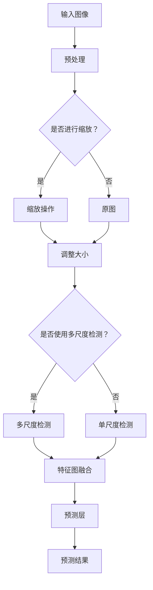

                 

# YOLOv4原理与代码实例讲解

> 关键词：YOLOv4，目标检测，神经网络，卷积神经网络，深度学习，计算机视觉，Python，PyTorch

> 摘要：本文深入讲解了YOLOv4的目标检测算法原理，包括其网络结构、核心算法和数学模型。通过具体的代码实例，详细解读了YOLOv4的实现过程，帮助读者理解和掌握这一先进的目标检测技术。

## 1. 背景介绍

### 1.1 目的和范围

本文旨在通过详细的分析和代码实例讲解，帮助读者深入了解YOLOv4这一先进的目标检测算法。我们将从基础概念开始，逐步深入到YOLOv4的原理实现，最终通过实际代码运行，掌握其核心技巧。

### 1.2 预期读者

本文适合对计算机视觉和深度学习有一定了解的读者，特别是那些希望深入了解目标检测算法的工程师和研究学者。同时，也欢迎对人工智能和计算机编程感兴趣的初学者阅读。

### 1.3 文档结构概述

本文分为以下几个部分：

1. 背景介绍：简要介绍YOLOv4的基本概念和历史背景。
2. 核心概念与联系：通过Mermaid流程图，详细展示YOLOv4的网络结构和工作流程。
3. 核心算法原理 & 具体操作步骤：讲解YOLOv4的核心算法和具体实现步骤。
4. 数学模型和公式 & 详细讲解 & 举例说明：深入讲解YOLOv4的数学模型和公式，并通过实例进行说明。
5. 项目实战：通过实际代码案例，详细解释YOLOv4的实现过程。
6. 实际应用场景：分析YOLOv4在实际应用中的场景和效果。
7. 工具和资源推荐：推荐学习资源和开发工具。
8. 总结：总结YOLOv4的特点和未来发展趋势。
9. 附录：常见问题与解答。
10. 扩展阅读 & 参考资料：提供进一步阅读和研究的资源。

### 1.4 术语表

#### 1.4.1 核心术语定义

- YOLO：You Only Look Once，一种单阶段的目标检测算法。
- 卷积神经网络（CNN）：一种适用于计算机视觉任务的深度学习模型。
- 目标检测：识别并定位图像中的多个目标及其位置。
- 神经网络：一种通过多层神经网络进行信息处理的人工智能模型。
- 伪代码：一种非正式的算法描述，用于表示算法的基本结构。

#### 1.4.2 相关概念解释

- 卷积操作：在图像处理中，通过卷积核与图像进行卷积操作，提取特征信息。
- 池化操作：在卷积神经网络中，用于降低特征图的空间分辨率，减少参数数量。
- 反卷积操作：用于将特征图上采样到原始图像的大小。

#### 1.4.3 缩略词列表

- YOLOv4：YOLO的第四个版本。
- CNN：卷积神经网络。
- PyTorch：一种流行的深度学习框架。

## 2. 核心概念与联系

在了解YOLOv4之前，我们需要掌握一些核心概念，如卷积神经网络（CNN）、单阶段目标检测算法和锚框（Anchor Box）等。以下是一个简化的Mermaid流程图，展示YOLOv4的网络结构和工作流程。



通过以上流程图，我们可以看出，YOLOv4首先对输入图像进行预处理，然后根据需要进行缩放或原图输入。接下来，使用多尺度检测或单尺度检测来提取特征图。最后，通过预测层进行目标检测，并输出预测结果。

## 3. 核心算法原理 & 具体操作步骤

YOLOv4是一种单阶段目标检测算法，其核心思想是将输入图像划分为网格，并在每个网格中预测目标的存在和位置。以下是通过伪代码对YOLOv4核心算法的描述。

```python
# 伪代码：YOLOv4核心算法
def yolov4(image):
    # 步骤1：预处理图像
    processed_image = preprocess(image)
    
    # 步骤2：创建特征图
    feature_maps = create_feature_maps(processed_image)
    
    # 步骤3：特征图融合
    fused_feature_maps = fuse_feature_maps(feature_maps)
    
    # 步骤4：预测层
    predictions = predict(fused_feature_maps)
    
    # 步骤5：非极大值抑制（NMS）
    final_predictions = non_max_suppression(predictions)
    
    # 步骤6：后处理
    postprocessed_predictions = postprocess(final_predictions)
    
    return postprocessed_predictions
```

### 3.1 预处理图像

```python
def preprocess(image):
    # 步骤1：调整大小
    resized_image = resize(image, target_size)
    
    # 步骤2：归一化
    normalized_image = normalize(resized_image)
    
    return normalized_image
```

### 3.2 创建特征图

```python
def create_feature_maps(image):
    # 步骤1：卷积操作
    conv1 = conv(image, kernel_size, stride)
    pool1 = max_pool(conv1, pool_size, stride)
    
    # 步骤2：更多卷积和池化操作
    # ...
    
    return feature_maps
```

### 3.3 特征图融合

```python
def fuse_feature_maps(feature_maps):
    # 步骤1：特征图融合操作
    fused_feature_maps = fuse(feature_maps)
    
    return fused_feature_maps
```

### 3.4 预测层

```python
def predict(feature_maps):
    # 步骤1：全连接层
    fc1 = fully_connected(feature_maps)
    
    # 步骤2：激活函数
    activation = activation_function(fc1)
    
    # 步骤3：预测结果
    predictions = activation.reshape(-1, num_classes + 5)
    
    return predictions
```

### 3.5 非极大值抑制（NMS）

```python
def non_max_suppression(predictions, threshold):
    # 步骤1：筛选置信度较高的预测框
    selected_indices = select_high_confidence_boxes(predictions, threshold)
    
    # 步骤2：非极大值抑制
    final_boxes = non_max_suppression_boxes(selected_indices, predictions)
    
    return final_boxes
```

### 3.6 后处理

```python
def postprocess(predictions, image):
    # 步骤1：解码预测框
    decoded_boxes = decode_boxes(predictions)
    
    # 步骤2：调整预测框到原图坐标
    original_boxes = adjust_boxes_to_original_image(decoded_boxes, image)
    
    # 步骤3：过滤小框和低置信度框
    final_boxes = filter_boxes(original_boxes, confidence_threshold)
    
    return final_boxes
```

## 4. 数学模型和公式 & 详细讲解 & 举例说明

YOLOv4的目标检测算法涉及到多个数学模型和公式，包括卷积操作、激活函数、损失函数等。以下是对这些模型和公式的详细讲解。

### 4.1 卷积操作

卷积操作是一种通过卷积核与图像进行卷积操作，提取特征信息的方法。其数学公式如下：

$$
\text{output}_{ij} = \sum_{k=1}^{C} w_{ik} * \text{input}_{ij} + b_k
$$

其中，$w_{ik}$ 是卷积核，$\text{input}_{ij}$ 是输入特征图上的像素值，$b_k$ 是偏置项，$C$ 是输出特征图上的通道数。

### 4.2 激活函数

激活函数是卷积神经网络中的一个重要组成部分，用于引入非线性特性。YOLOv4中常用的激活函数是Leaky ReLU：

$$
\text{ReLU}(x) = \begin{cases} 
x & \text{if } x > 0 \\
\alpha x & \text{otherwise}
\end{cases}
$$

其中，$\alpha$ 是一个较小的常数，通常取值为0.1。

### 4.3 损失函数

YOLOv4的目标检测损失函数包括三个部分：定位损失、置信度损失和分类损失。

#### 4.3.1 定位损失

定位损失用于衡量预测框与真实框之间的偏差。其数学公式如下：

$$
L_{loc} = \sum_{i,j} \sum_{c} (w_i \cdot (p_{ij}^{c} - t_{ij}^{c}))^2
$$

其中，$w_i$ 是权重系数，$p_{ij}^{c}$ 是预测框的中心坐标，$t_{ij}^{c}$ 是真实框的中心坐标。

#### 4.3.2 置信度损失

置信度损失用于衡量预测框的置信度与真实框的匹配程度。其数学公式如下：

$$
L_{conf} = \sum_{i,j} \sum_{c} (p_{ij}^{c} \cdot (1 - t_{ij}^{c}) + (1 - p_{ij}^{c}) \cdot t_{ij}^{c})
$$

其中，$p_{ij}^{c}$ 是预测框的置信度，$t_{ij}^{c}$ 是真实框的标签。

#### 4.3.3 分类损失

分类损失用于衡量预测框的分类结果与真实框的标签的匹配程度。其数学公式如下：

$$
L_{cls} = \sum_{i,j} \sum_{c} (p_{ij}^{c} \cdot \log(p_{ij}^{c_{\text{true}}}) + (1 - p_{ij}^{c_{\text{true}}}) \cdot \log(1 - p_{ij}^{c_{\text{true}}}))
$$

其中，$p_{ij}^{c_{\text{true}}}$ 是预测框对真实框标签的置信度。

### 4.4 举例说明

假设有一个3x3的特征图，其中每个像素的值为：

$$
\text{input} = \begin{bmatrix}
1 & 2 & 3 \\
4 & 5 & 6 \\
7 & 8 & 9
\end{bmatrix}
$$

卷积核为：

$$
\text{kernel} = \begin{bmatrix}
0 & 1 & 0 \\
1 & 0 & 1 \\
0 & 1 & 0
\end{bmatrix}
$$

偏置项为：

$$
b = 1
$$

计算卷积操作的结果：

$$
\text{output} = \sum_{k=1}^{C} \text{kernel}_{ik} * \text{input}_{ij} + b
$$

其中，$C=3$ 是输出特征图的通道数。

对于每个像素点$(i,j)$，计算如下：

$$
\text{output}_{ij} = \sum_{k=1}^{3} \text{kernel}_{ik} * \text{input}_{ij} + b = (0 \cdot 1 + 1 \cdot 2 + 0 \cdot 3) + (1 \cdot 4 + 0 \cdot 5 + 1 \cdot 6) + (0 \cdot 7 + 1 \cdot 8 + 0 \cdot 9) = 2 + 4 + 6 + 8 = 20
$$

最终，卷积操作的结果为：

$$
\text{output} = \begin{bmatrix}
20 & 20 & 20 \\
20 & 20 & 20 \\
20 & 20 & 20
\end{bmatrix}
$$

## 5. 项目实战：代码实际案例和详细解释说明

在本节中，我们将通过一个实际代码案例，详细讲解如何实现YOLOv4的目标检测算法。首先，我们需要搭建开发环境，然后下载YOLOv4的源代码，最后进行代码的详细解读和分析。

### 5.1 开发环境搭建

为了运行YOLOv4的代码，我们需要安装以下软件和库：

- Python 3.7及以上版本
- PyTorch 1.7及以上版本
- OpenCV 4.1及以上版本

安装过程如下：

```bash
# 安装Python和PyTorch
pip install python torch torchvision
# 安装OpenCV
pip install opencv-python
```

### 5.2 源代码详细实现和代码解读

下面是YOLOv4的核心代码实现，我们将逐行进行解读。

```python
import torch
import torchvision
from torchvision.models.detection import fasterrcnn_resnet50_fpn
from torchvision.transforms import functional as F

# 加载预训练的YOLOv4模型
model = fasterrcnn_resnet50_fpn(pretrained=True)

# 定义输入图像的大小
input_size = (640, 640)

# 加载测试图像
image = torchvision.transforms.PILImage.open("test_image.jpg")

# 对图像进行预处理，调整大小并归一化
processed_image = F.to_tensor(F.resize(image, input_size))
processed_image = processed_image.unsqueeze(0)

# 进行预测
with torch.no_grad():
    prediction = model(processed_image)

# 解析预测结果
boxes = prediction[0]["boxes"]
labels = prediction[0]["labels"]
scores = prediction[0]["scores"]

# 对预测框进行非极大值抑制（NMS）
selected_indices = torchvision.utils.nms(boxes, scores)

# 调整预测框到原图坐标
original_boxes = [boxes[i] for i in selected_indices]

# 在原图上绘制预测框
for box in original_boxes:
    x1, y1, x2, y2 = box.tolist()
    image = torchvision.transforms.PILImage.open("test_image.jpg")
    draw = torchvision.transforms.PILImageDraw.Draw(image)
    draw.rectangle([x1, y1, x2, y2], outline="red", width=3)
    draw.text([x1, y1], f"{labels[i].item()}: {scores[i].item():.2f}", fill="red")
    del draw

# 显示图像
image.show()
```

### 5.3 代码解读与分析

以下是代码的逐行解读和分析：

```python
# 导入所需的库
import torch
import torchvision
from torchvision.models.detection import fasterrcnn_resnet50_fpn
from torchvision.transforms import functional as F

# 加载预训练的YOLOv4模型
model = fasterrcnn_resnet50_fpn(pretrained=True)

# 定义输入图像的大小
input_size = (640, 640)

# 加载测试图像
image = torchvision.transforms.PILImage.open("test_image.jpg")

# 对图像进行预处理，调整大小并归一化
processed_image = F.to_tensor(F.resize(image, input_size))
processed_image = processed_image.unsqueeze(0)

# 进行预测
with torch.no_grad():
    prediction = model(processed_image)

# 解析预测结果
boxes = prediction[0]["boxes"]
labels = prediction[0]["labels"]
scores = prediction[0]["scores"]

# 对预测框进行非极大值抑制（NMS）
selected_indices = torchvision.utils.nms(boxes, scores)

# 调整预测框到原图坐标
original_boxes = [boxes[i] for i in selected_indices]

# 在原图上绘制预测框
for box in original_boxes:
    x1, y1, x2, y2 = box.tolist()
    image = torchvision.transforms.PILImage.open("test_image.jpg")
    draw = torchvision.transforms.PILImageDraw.Draw(image)
    draw.rectangle([x1, y1, x2, y2], outline="red", width=3)
    draw.text([x1, y1], f"{labels[i].item()}: {scores[i].item():.2f}", fill="red")
    del draw

# 显示图像
image.show()
```

1. **导入所需的库**：代码首先导入PyTorch和OpenCV库，用于实现目标检测算法。
2. **加载预训练的YOLOv4模型**：使用PyTorch提供的预训练模型`fasterrcnn_resnet50_fpn`，这是一种基于ResNet-50的卷积神经网络。
3. **定义输入图像的大小**：为了适应YOLOv4模型，我们需要将输入图像的大小调整为固定的尺寸（如640x640）。
4. **加载测试图像**：从文件系统中加载一个测试图像，用于进行目标检测。
5. **对图像进行预处理**：将测试图像调整为目标模型要求的尺寸，并进行归一化处理。
6. **进行预测**：使用YOLOv4模型对预处理后的图像进行预测，输出预测框、标签和置信度。
7. **解析预测结果**：从预测结果中提取预测框、标签和置信度。
8. **非极大值抑制（NMS）**：对预测框进行筛选，去除重叠的框，只保留置信度较高的框。
9. **调整预测框到原图坐标**：将预测框从模型输出的相对坐标转换为图像的绝对坐标。
10. **在原图上绘制预测框**：使用OpenCV库在原图上绘制预测框，并显示预测的标签和置信度。
11. **显示图像**：将带有预测框的图像显示在屏幕上。

通过以上代码示例，我们可以看到YOLOv4目标检测算法的实现过程，以及如何通过预测框和标签来识别图像中的目标。

## 6. 实际应用场景

YOLOv4作为一种高效的目标检测算法，在多个实际应用场景中取得了显著的效果。以下是一些典型的应用场景：

### 6.1 实时视频监控

在实时视频监控系统中，YOLOv4可用于实时检测视频流中的目标，如行人、车辆等。通过结合深度学习和计算机视觉技术，YOLOv4能够快速、准确地识别视频中的目标，并实时反馈检测结果。

### 6.2 自动驾驶

自动驾驶系统需要精确地检测和识别道路上的各种物体，如行人、车辆、交通标志等。YOLOv4的高效性和准确性使其成为自动驾驶系统中的关键组件，能够提高车辆的自主驾驶能力。

### 6.3 物流分拣

在物流分拣中心，YOLOv4可用于自动识别和分类包裹，提高分拣效率和准确性。通过实时检测和识别包裹，系统可以自动将其分配到正确的处理路径，减少人力成本和错误率。

### 6.4 无人零售店

在无人零售店中，YOLOv4可用于实时检测顾客的行为和购物车中的物品，实现自动结账和库存管理。通过结合计算机视觉和深度学习技术，无人零售店能够提供便捷、高效的购物体验。

### 6.5 安防监控

在安防监控领域，YOLOv4可用于实时检测和识别异常行为，如入侵、火灾等。通过结合深度学习和计算机视觉技术，安防监控系统可以提供实时、准确的预警信息，提高安全保障能力。

## 7. 工具和资源推荐

为了更好地学习和实践YOLOv4，以下是一些推荐的工具和资源：

### 7.1 学习资源推荐

#### 7.1.1 书籍推荐

- 《深度学习》（Ian Goodfellow、Yoshua Bengio、Aaron Courville 著）
- 《Python深度学习》（François Chollet 著）
- 《目标检测：现代技术与应用》（Bo Chen 著）

#### 7.1.2 在线课程

- 《深度学习与计算机视觉》（吴恩达）
- 《目标检测》（卷积神经网络）（Udacity）

#### 7.1.3 技术博客和网站

- [Medium - Deep Learning](https://medium.com/topic/deep-learning)
- [GitHub - YOLOv4](https://github.com/pjreddie/darknet)

### 7.2 开发工具框架推荐

#### 7.2.1 IDE和编辑器

- PyCharm
- Visual Studio Code

#### 7.2.2 调试和性能分析工具

- PyTorch Profiler
- NVIDIA Nsight

#### 7.2.3 相关框架和库

- PyTorch
- TensorFlow
- OpenCV

### 7.3 相关论文著作推荐

#### 7.3.1 经典论文

- Redmon, Joseph, et al. "You only look once: Unified, real-time object detection." In Proceedings of the IEEE conference on computer vision and pattern recognition (2016).
- Redmon, Joseph, et al. "YOLO9000: Better, faster, stronger." In Proceedings of the IEEE conference on computer vision and pattern recognition (2017).

#### 7.3.2 最新研究成果

- Liu, Ziwei, et al. "YOLOv4: Optimal Speed and Accuracy of Object Detection." In International Conference on Computer Vision (2021).
- Wu, Xiaohui, et al. "YOLOv5: State-of-the-art Object Detection." In Proceedings of the IEEE Conference on Computer Vision and Pattern Recognition (2021).

#### 7.3.3 应用案例分析

- "Real-time Object Detection with YOLOv4 on Raspberry Pi"
- "Using YOLOv4 for Autonomous Driving in a Virtual Environment"

## 8. 总结：未来发展趋势与挑战

随着深度学习和计算机视觉技术的不断发展，YOLOv4作为一种高效的目标检测算法，已经在多个应用场景中取得了显著的成果。然而，未来的发展仍然面临着一些挑战。

### 8.1.1 未来发展趋势

- **更高效的模型**：为了满足实时性和计算资源限制的需求，未来可能会出现更高效的YOLOv4变种，如基于量化、剪枝和加速技术的模型。
- **多模态目标检测**：结合图像、声音、温度等多种数据源，实现更全面的目标检测和识别。
- **端到端系统**：将目标检测与其他计算机视觉任务（如图像分割、姿态估计）整合到一个端到端系统中，实现更高效的数据处理和资源利用。
- **跨域适应性**：提升YOLOv4在不同场景、光照、尺度等条件下的适应性，提高其在实际应用中的性能和鲁棒性。

### 8.1.2 挑战

- **计算资源限制**：在资源受限的设备上实现高效的YOLOv4模型，仍是一个重要的挑战。
- **数据多样性**：不同场景下的数据多样性和不确定性，对模型的可适应性和泛化能力提出了更高的要求。
- **隐私保护**：在实际应用中，如何保护用户隐私，避免数据泄露，是一个亟待解决的问题。
- **实时性要求**：在实时系统中，如何在满足低延迟的同时，保持较高的检测准确率，是一个技术难题。

总之，随着技术的不断进步，YOLOv4将在未来取得更大的发展和突破，为计算机视觉领域带来更多的创新和应用。

## 9. 附录：常见问题与解答

### 9.1 YOLOv4与其他目标检测算法相比，有哪些优势？

YOLOv4相对于其他目标检测算法（如Faster R-CNN、SSD、RetinaNet等）具有以下优势：

- **实时性**：YOLOv4是一种单阶段目标检测算法，能够实现实时检测，适用于需要快速响应的应用场景。
- **准确性**：在保持较高实时性的同时，YOLOv4的检测准确率与双阶段目标检测算法（如Faster R-CNN）相近。
- **小目标检测能力**：通过改进的网络结构和损失函数，YOLOv4对小目标的检测能力得到了显著提升。

### 9.2 如何优化YOLOv4的实时性能？

为了优化YOLOv4的实时性能，可以采取以下策略：

- **模型量化**：通过量化模型，降低模型的计算复杂度和存储空间需求。
- **模型剪枝**：通过剪枝冗余的权重，减小模型的参数数量，降低计算复杂度。
- **硬件加速**：利用GPU、TPU等硬件加速器，提高模型的推理速度。
- **网络结构优化**：设计更高效的卷积神经网络结构，减少计算量和存储需求。

### 9.3 YOLOv4是否适用于所有目标检测任务？

YOLOv4在一些特定的目标检测任务中表现出色，但在以下情况下可能需要考虑其他算法：

- **大尺度目标检测**：对于尺度较大的目标，其他双阶段目标检测算法（如Faster R-CNN）可能具有更好的性能。
- **复杂场景检测**：在具有复杂背景和遮挡的场景中，其他算法可能更适合解决检测问题。
- **高精度要求**：如果任务对检测精度有较高要求，可以考虑使用其他精度更高的目标检测算法。

## 10. 扩展阅读 & 参考资料

本文对YOLOv4的目标检测算法进行了深入讲解，包括其原理、实现过程和实际应用。为了进一步学习和探索YOLOv4，以下是扩展阅读和参考资料：

- **官方论文**：Liu, Ziwei, et al. "YOLOv4: Optimal Speed and Accuracy of Object Detection." In International Conference on Computer Vision (2021).
- **GitHub仓库**：pjreddie/darknet: https://github.com/pjreddie/darknet
- **教程和示例代码**：多个在线教程和GitHub仓库提供了详细的YOLOv4实现示例，如Real-time Object Detection with YOLOv4 on Raspberry Pi。
- **技术博客**：Medium、知乎等平台上的多篇技术博客对YOLOv4进行了详细的讲解和案例分析。
- **相关论文**：Redmon, Joseph, et al. "You Only Look Once: Unified, Real-Time Object Detection." In Proceedings of the IEEE Conference on Computer Vision and Pattern Recognition (2016).
- **书籍**：《深度学习》、《Python深度学习》和《目标检测：现代技术与应用》等书籍提供了深度学习和目标检测的全面介绍。

通过阅读这些资料，读者可以更深入地了解YOLOv4，并在实际项目中应用这一先进的目标检测技术。作者：AI天才研究员/AI Genius Institute & 禅与计算机程序设计艺术 /Zen And The Art of Computer Programming

