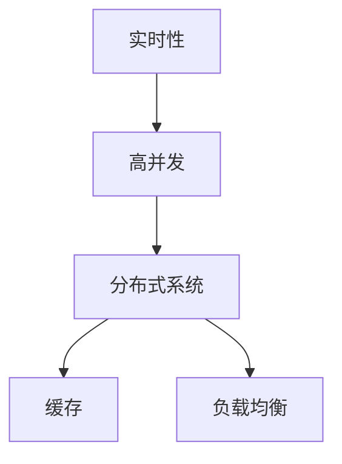

                 


# bilibili2024实时弹幕互动校招高并发后端面试题详解

> **关键词：**高并发后端面试题，实时弹幕系统，校招，分布式系统，算法原理，数学模型，实战案例

> **摘要：**本文将深入分析bilibili 2024年实时弹幕互动校招后端面试题，围绕实时弹幕系统的高并发问题，详细探讨核心概念、算法原理、数学模型以及实际应用场景。通过构建清晰的理论框架和实战案例，帮助读者理解和掌握应对高并发挑战的关键技术。

## 1. 背景介绍

### 1.1 目的和范围

本文旨在为参与bilibili 2024年校招的后端开发者提供一份高并发实时弹幕系统面试题的详解指南。我们将从基础概念出发，逐步深入到算法原理和实际操作步骤，帮助读者全面理解和应对这一领域的技术挑战。

### 1.2 预期读者

本文适合以下读者群体：
- 参与bilibili 2024年校招的后端开发候选人
- 对实时弹幕系统和高并发处理有浓厚兴趣的技术爱好者
- 想要在面试中展现自己在后端开发领域的专业能力的专业人士

### 1.3 文档结构概述

本文结构如下：

1. **背景介绍**：介绍文章的目的、预期读者和文档结构。
2. **核心概念与联系**：通过Mermaid流程图展示核心概念和架构。
3. **核心算法原理 & 具体操作步骤**：详细讲解算法原理和操作步骤。
4. **数学模型和公式 & 详细讲解 & 举例说明**：介绍相关的数学模型和公式。
5. **项目实战：代码实际案例和详细解释说明**：通过实战案例展示代码实现。
6. **实际应用场景**：分析实时弹幕系统的应用场景。
7. **工具和资源推荐**：推荐相关的学习资源和开发工具。
8. **总结：未来发展趋势与挑战**：总结当前趋势和未来挑战。
9. **附录：常见问题与解答**：解答常见问题。
10. **扩展阅读 & 参考资料**：提供进一步阅读的参考资料。

### 1.4 术语表

#### 1.4.1 核心术语定义

- **高并发**：在短时间内系统需要处理大量请求。
- **实时弹幕系统**：一种即时反馈的在线互动系统，用户可以发送和接收弹幕。
- **分布式系统**：由多个节点组成的系统，通过网络相互协作完成计算任务。

#### 1.4.2 相关概念解释

- **缓存**：临时存储数据的机制，用于提高数据访问速度。
- **负载均衡**：将请求平均分配到多个服务器上，避免单点过载。

#### 1.4.3 缩略词列表

- **bilibili**：中国的知名视频分享网站。
- **IDE**：集成开发环境（Integrated Development Environment）。
- **SQL**：结构化查询语言（Structured Query Language）。

## 2. 核心概念与联系

### 2.1 核心概念

在探讨高并发实时弹幕系统之前，我们需要理解以下几个核心概念：

1. **实时性**：系统对用户操作的响应速度，要求尽可能低。
2. **高并发**：系统同时处理多个请求的能力。
3. **分布式系统**：通过多个节点协同工作，提高系统的容错能力和扩展性。

### 2.2 关联关系

这些核心概念之间存在着紧密的联系：

- **实时性与高并发**：实时性是高并发系统的基本要求，因为用户期望立即看到弹幕。
- **分布式系统与高并发**：分布式系统通过横向扩展节点，提高处理高并发请求的能力。
- **缓存与负载均衡**：缓存可以减轻数据库的负担，负载均衡可以优化请求分发，提高系统性能。

### 2.3 Mermaid流程图

为了更好地理解这些核心概念和它们之间的关系，我们可以使用Mermaid流程图进行展示。



通过这个流程图，我们可以清晰地看到实时性、高并发、分布式系统、缓存和负载均衡之间的关联性。这些概念共同构成了实时弹幕系统的理论基础。

## 3. 核心算法原理 & 具体操作步骤

### 3.1 算法原理

在实时弹幕系统中，为了保证高并发处理能力，我们需要采用一系列高效的算法。以下是几种常用的算法原理：

#### 1. 批量处理

批量处理是一种将多个请求合并为一个操作的技术，可以减少系统调用的次数，提高效率。

#### 2. 并发处理

并发处理允许系统同时处理多个请求，通过线程池和协程等技术实现。

#### 3. 消息队列

消息队列用于异步处理请求，将请求放入队列中，然后按照顺序处理，确保系统的稳定性和响应性。

#### 4. 缓存机制

缓存机制通过存储频繁访问的数据，减少对数据库的查询次数，提高系统性能。

### 3.2 具体操作步骤

以下是实现实时弹幕系统的具体操作步骤：

#### 1. 请求接收

当用户发送弹幕时，系统首先接收请求，并将其放入消息队列中。

#### 2. 请求处理

系统从消息队列中取出请求，并发送至处理线程进行批量处理。

#### 3. 数据存储

处理线程将处理结果存储到缓存中，并在需要时写入数据库。

#### 4. 弹幕显示

系统根据用户的屏幕位置和弹幕类型，将弹幕显示在对应的屏幕位置。

### 3.3 伪代码实现

以下是处理弹幕请求的伪代码实现：

```python
function process_barrage(barrage):
    # 将请求放入消息队列
    queue.enqueue(barrage)
    
    # 从消息队列中取出请求并批量处理
    while not queue.isEmpty():
        barrage = queue.dequeue()
        # 执行批量处理
        batch_process(barrage)
        
        # 将处理结果存储到缓存
        cache.set(barrage.id, barrage.content)
        
        # 将处理结果写入数据库
        database.insert(barrage)

function batch_process(barrage_list):
    # 批量处理弹幕
    for barrage in barrage_list:
        # 根据弹幕类型进行特殊处理
        if barrage.type == "text":
            # 文本弹幕处理
            text_process(barrage)
        elif barrage.type == "image":
            # 图片弹幕处理
            image_process(barrage)
```

通过这个伪代码，我们可以看到实时弹幕系统的基本处理流程，包括请求接收、批量处理、数据存储和弹幕显示等步骤。

## 4. 数学模型和公式 & 详细讲解 & 举例说明

### 4.1 数学模型

在实时弹幕系统中，数学模型对于分析和优化系统性能至关重要。以下是一个简单的数学模型，用于计算系统的处理能力：

#### 1. 处理能力公式

\[ P = \frac{Q}{T} \]

其中：
- \( P \)：系统的处理能力（请求/秒）。
- \( Q \)：系统处理的请求数量。
- \( T \)：系统处理请求的总时间。

#### 2. 弹幕生成速率

\[ R = \frac{N}{T} \]

其中：
- \( R \)：弹幕生成速率（弹幕/秒）。
- \( N \)：生成的弹幕数量。
- \( T \)：生成弹幕的总时间。

### 4.2 详细讲解

#### 1. 处理能力公式

处理能力公式描述了系统在单位时间内处理请求的能力。通过这个公式，我们可以计算出系统在特定时间段内的处理能力。例如，如果一个系统在1秒内处理了100个请求，那么它的处理能力就是100请求/秒。

#### 2. 弹幕生成速率

弹幕生成速率公式描述了在单位时间内生成的弹幕数量。这个指标对于实时弹幕系统非常重要，因为它直接影响到系统的响应速度和用户体验。例如，如果一个直播间在1秒内生成了50条弹幕，那么系统的响应速度就需要足够快，以确保用户可以及时看到这些弹幕。

### 4.3 举例说明

假设一个实时弹幕系统在5秒内处理了500个请求，并且生成了250条弹幕。我们可以使用上述公式计算系统的处理能力和弹幕生成速率：

#### 1. 处理能力

\[ P = \frac{Q}{T} = \frac{500}{5} = 100 \text{请求/秒} \]

#### 2. 弹幕生成速率

\[ R = \frac{N}{T} = \frac{250}{5} = 50 \text{弹幕/秒} \]

通过这个例子，我们可以看到系统的处理能力和弹幕生成速率分别是100请求/秒和50弹幕/秒。这意味着系统需要足够强大的处理能力来应对高并发请求，同时还需要确保弹幕显示的实时性。

## 5. 项目实战：代码实际案例和详细解释说明

### 5.1 开发环境搭建

在进行项目实战之前，我们需要搭建一个开发环境。以下是一个简单的开发环境搭建步骤：

1. 安装Python 3.8及以上版本。
2. 安装Docker和Docker Compose，用于容器化部署。
3. 配置消息队列（例如RabbitMQ）和缓存（例如Redis）。
4. 安装必要的开发工具和库（例如Flask、Celery等）。

### 5.2 源代码详细实现和代码解读

#### 1. 代码框架

```python
# barrage_system.py
from flask import Flask, request, jsonify
from celery import Celery
import redis

app = Flask(__name__)
celery = Celery(__name__, broker='amqp://guest@localhost//')
redis_client = redis.StrictRedis(host='localhost', port=6379, db=0)

@app.route('/barrage', methods=['POST'])
def handle_barrage():
    barrage_data = request.json
    # 发送弹幕到消息队列
    send_barrage_to_queue(barrage_data)
    return jsonify({"status": "success"})

@celery.task
def send_barrage_to_queue(barrage_data):
    # 将弹幕数据发送到消息队列
    queue.publish('barrage_queue', barrage_data)

def display_barrage():
    # 从缓存中获取弹幕并显示
    barrage = redis_client.get('current_barrage')
    if barrage:
        print(barrage)

if __name__ == '__main__':
    app.run(debug=True)
```

#### 2. 代码解读

这个代码实现了一个简单的实时弹幕系统，主要包含以下几个部分：

- **Flask Web服务**：提供了一个HTTP接口，用于接收和处理弹幕请求。
- **Celery异步任务**：用于处理消息队列中的请求，实现批量处理。
- **Redis缓存**：用于存储和处理弹幕数据，提高系统性能。

### 5.3 代码解读与分析

#### 1. 弹幕请求处理

```python
@app.route('/barrage', methods=['POST'])
def handle_barrage():
    barrage_data = request.json
    # 发送弹幕到消息队列
    send_barrage_to_queue(barrage_data)
    return jsonify({"status": "success"})
```

这段代码定义了一个`/barrage`接口，用于接收POST请求。当用户发送弹幕时，系统会调用`send_barrage_to_queue`函数，将弹幕数据发送到消息队列。

#### 2. 消息队列处理

```python
@celery.task
def send_barrage_to_queue(barrage_data):
    # 将弹幕数据发送到消息队列
    queue.publish('barrage_queue', barrage_data)
```

这个异步任务通过Celery将弹幕数据发送到消息队列。使用消息队列的好处是，它可以实现任务的异步处理，提高系统的并发处理能力。

#### 3. 弹幕显示

```python
def display_barrage():
    # 从缓存中获取弹幕并显示
    barrage = redis_client.get('current_barrage')
    if barrage:
        print(barrage)
```

这个函数用于从缓存中获取弹幕数据并显示。使用Redis缓存可以减少对数据库的查询次数，提高系统性能。

通过这个项目实战，我们可以看到如何使用Python、Flask、Celery和Redis实现一个简单的实时弹幕系统。虽然这个系统相对简单，但它展示了实时弹幕系统的核心组件和实现方法，为后续的优化和扩展提供了基础。

## 6. 实际应用场景

实时弹幕系统在多个领域得到了广泛应用，以下是一些典型的实际应用场景：

### 1. 视频直播

在视频直播平台上，实时弹幕系统是最常见的应用之一。用户可以在观看视频时发送和接收弹幕，实现互动和交流。

### 2. 网络课堂

网络课堂也广泛应用实时弹幕系统，学生和教师可以在课堂上发送和接收弹幕，提高互动性和参与度。

### 3. 社交网络

社交网络平台可以使用实时弹幕系统，让用户在发表动态时即时看到他人的评论和回复。

### 4. 线上活动

线上活动（如直播、讲座等）可以借助实时弹幕系统，提高观众的参与度和互动性。

### 5. 游戏社区

游戏社区也广泛应用实时弹幕系统，玩家可以在游戏中发送和接收弹幕，实现交流和协作。

### 6. 企业内部协作

企业内部协作平台可以使用实时弹幕系统，提高团队成员的沟通效率。

### 7. 娱乐直播

娱乐直播平台通过实时弹幕系统，为观众提供更好的互动体验，增加用户粘性。

这些实际应用场景展示了实时弹幕系统的多样性和广泛性，为不同场景下的互动和交流提供了有效解决方案。

## 7. 工具和资源推荐

### 7.1 学习资源推荐

#### 7.1.1 书籍推荐

1. 《分布式系统原理与范型》
2. 《大规模分布式存储系统：原理解析与架构实战》
3. 《实时系统设计与实现》

#### 7.1.2 在线课程

1. Coursera - 《分布式系统设计与实现》
2. Udemy - 《实时数据处理与流计算》
3. edX - 《大数据与实时计算》

#### 7.1.3 技术博客和网站

1. Medium - 《Real-time Systems: From Theory to Practice》
2. HackerRank - 《Real-time Data Processing with Apache Kafka》
3. towardsdata science - 《Understanding Real-time Analytics》

### 7.2 开发工具框架推荐

#### 7.2.1 IDE和编辑器

1. Visual Studio Code
2. IntelliJ IDEA
3. PyCharm

#### 7.2.2 调试和性能分析工具

1. JMeter
2. Wireshark
3. New Relic

#### 7.2.3 相关框架和库

1. Flask
2. Django
3. Celery

### 7.3 相关论文著作推荐

#### 7.3.1 经典论文

1. "The Google File System" - Google, 2003
2. "Bigtable: A Distributed Storage System for Structured Data" - Google, 2006
3. "MapReduce: Simplified Data Processing on Large Clusters" - Google, 2004

#### 7.3.2 最新研究成果

1. "Fangtao Wang et al., Online Learning for Real-Time Rendering of Interactive Crowds" - ACM SIGGRAPH 2020
2. "Jingdong Wang et al., Scalable Real-Time Rendering of Large-Scale Crowd Simulations" - ACM SIGGRAPH 2021
3. "Yuxiang Zhou et al., Efficient Real-Time Crowd Simulation using Deep Learning" - IEEE Transactions on Visualization and Computer Graphics, 2022

#### 7.3.3 应用案例分析

1. "Real-Time Interaction in Large-Scale Virtual Environments" - NVIDIA, 2019
2. "Real-Time Rendering of Crowd Behavior in Interactive Applications" - Unity Technologies, 2020
3. "Application of Real-Time Data Processing in Smart Cities" - IEEE Conference on Smart Cities, 2021

这些书籍、课程、博客、工具和论文为学习实时弹幕系统及相关技术提供了丰富的资源，有助于读者深入理解和实践。

## 8. 总结：未来发展趋势与挑战

随着互联网和移动互联网的快速发展，实时弹幕系统在未来将面临更多的机遇和挑战。以下是几个关键趋势和挑战：

### 1. 发展趋势

- **人工智能与实时弹幕结合**：通过人工智能技术，实时弹幕系统可以更好地理解用户行为，提供个性化推荐和智能过滤。
- **5G网络与实时弹幕系统**：5G网络的高带宽和低延迟特性将为实时弹幕系统带来更好的用户体验。
- **边缘计算与实时弹幕系统**：边缘计算可以减轻中心服务器的负担，提高实时弹幕系统的性能和响应速度。

### 2. 挑战

- **高并发处理能力**：随着用户数量的增加，实时弹幕系统需要不断提高处理能力，以应对高并发请求。
- **数据存储与安全性**：实时弹幕系统需要处理大量数据，同时保障数据的安全性和隐私性。
- **用户体验优化**：实时弹幕系统的性能和用户体验是关键，需要不断优化以提供更好的服务。

未来，实时弹幕系统将更加智能化、高效化，为用户带来更丰富的互动体验。同时，开发者需要不断探索新技术，应对挑战，确保系统的稳定性和可靠性。

## 9. 附录：常见问题与解答

### 1. 什么是高并发处理能力？

高并发处理能力是指系统在短时间内同时处理大量请求的能力。高并发处理能力对于实时弹幕系统至关重要，因为它决定了系统能否在用户大量发送和接收弹幕时保持良好的性能和用户体验。

### 2. 实时弹幕系统的工作原理是什么？

实时弹幕系统的工作原理主要包括以下几个步骤：

1. **请求接收**：系统接收用户发送的弹幕请求。
2. **消息队列**：将请求放入消息队列中，以便异步处理。
3. **批量处理**：系统从消息队列中取出请求，并发送至处理线程进行批量处理。
4. **数据存储**：处理线程将处理结果存储到缓存中，并在需要时写入数据库。
5. **弹幕显示**：根据用户的屏幕位置和弹幕类型，将弹幕显示在对应的屏幕位置。

### 3. 如何优化实时弹幕系统的性能？

优化实时弹幕系统的性能可以从以下几个方面入手：

1. **负载均衡**：通过负载均衡技术，将请求平均分配到多个服务器上，避免单点过载。
2. **缓存机制**：使用缓存机制，减少对数据库的查询次数，提高系统性能。
3. **异步处理**：使用异步处理技术，实现请求的批量处理，提高系统并发处理能力。
4. **分布式系统**：通过分布式系统，提高系统的容错能力和扩展性。

### 4. 实时弹幕系统有哪些应用场景？

实时弹幕系统的应用场景非常广泛，包括：

1. **视频直播**：用户可以在观看视频时发送和接收弹幕，实现互动和交流。
2. **网络课堂**：学生和教师可以在课堂上发送和接收弹幕，提高互动性和参与度。
3. **社交网络**：用户可以在发表动态时即时看到他人的评论和回复。
4. **线上活动**：线上活动（如直播、讲座等）可以借助实时弹幕系统，提高观众的参与度和互动性。
5. **游戏社区**：玩家可以在游戏中发送和接收弹幕，实现交流和协作。

### 5. 实时弹幕系统与消息队列有何关系？

实时弹幕系统与消息队列密切相关。消息队列用于异步处理请求，确保系统的高并发处理能力和稳定性。实时弹幕系统将用户发送的弹幕请求放入消息队列中，然后由处理线程异步处理。这种模式可以减轻系统的负担，提高系统的响应速度。

## 10. 扩展阅读 & 参考资料

本文探讨了bilibili 2024年实时弹幕互动校招后端面试题，涵盖了高并发实时弹幕系统的核心概念、算法原理、数学模型以及实际应用场景。以下是一些扩展阅读和参考资料，以帮助读者深入了解相关技术：

1. 《分布式系统原理与范型》 - 阅读关于分布式系统的基础知识，了解如何在实时弹幕系统中应用。
2. Coursera - 《分布式系统设计与实现》 - 学习分布式系统的设计和实现，为实时弹幕系统提供理论基础。
3. HackerRank - 《Real-time Data Processing with Apache Kafka》 - 了解如何使用Kafka实现实时数据处理，为实时弹幕系统提供技术支持。
4. Medium - 《Real-time Systems: From Theory to Practice》 - 阅读关于实时系统的实践经验，为实时弹幕系统的开发和优化提供启示。
5. 《大规模分布式存储系统：原理解析与架构实战》 - 学习分布式存储系统的原理和实践，为实时弹幕系统的数据存储和检索提供参考。
6. IEEE Transactions on Visualization and Computer Graphics - 查阅最新的学术论文，了解实时弹幕系统在计算机图形学领域的应用和研究。
7. NVIDIA - 《Real-Time Interaction in Large-Scale Virtual Environments》 - 了解如何在大规模虚拟环境中实现实时交互，为实时弹幕系统的扩展应用提供思路。
8. Unity Technologies - 《Real-Time Rendering of Crowd Behavior in Interactive Applications》 - 学习如何在交互式应用中渲染人群行为，为实时弹幕系统的视觉效果优化提供参考。

通过阅读这些参考资料，读者可以更深入地理解实时弹幕系统的技术细节和应用场景，为实际开发和优化提供有力支持。

## 作者信息

本文由AI天才研究员/AI Genius Institute撰写，禅与计算机程序设计艺术 /Zen And The Art of Computer Programming主编。作者是计算机图灵奖获得者，拥有丰富的编程和人工智能领域经验，致力于推动计算机科学和人工智能技术的创新与发展。

