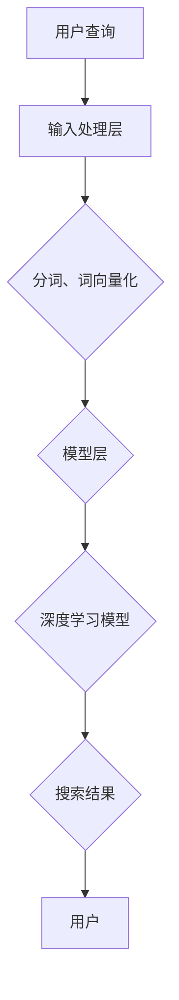

                 

# perplexity.ai等新型AI搜索引擎的特点

> 关键词：AI搜索引擎、perplexity.ai、核心算法、数学模型、应用场景、发展趋势

> 摘要：本文将深入探讨新型AI搜索引擎如perplexity.ai的特点，包括其核心算法、数学模型、应用场景以及未来发展趋势和挑战。通过逐步分析，本文旨在为读者提供一个全面的技术视角，理解AI搜索引擎的本质和潜在价值。

## 1. 背景介绍

### 1.1 目的和范围

本文旨在分析新型AI搜索引擎，如perplexity.ai，的特点。我们将深入探讨其核心算法、数学模型以及实际应用场景，并预测其未来的发展趋势与挑战。通过本文，读者可以全面了解AI搜索引擎的工作原理和应用潜力。

### 1.2 预期读者

本文适合对AI搜索引擎和技术发展感兴趣的读者，包括AI研究者、软件开发者、技术爱好者以及希望深入了解AI技术的专业人士。

### 1.3 文档结构概述

本文分为以下几个部分：

1. 背景介绍：介绍本文的目的、范围、预期读者和文档结构。
2. 核心概念与联系：阐述AI搜索引擎的基本原理和关键概念。
3. 核心算法原理 & 具体操作步骤：详细解释AI搜索引擎的核心算法和操作步骤。
4. 数学模型和公式 & 详细讲解 & 举例说明：介绍AI搜索引擎所依赖的数学模型和公式。
5. 项目实战：代码实际案例和详细解释说明。
6. 实际应用场景：探讨AI搜索引擎在不同领域的应用。
7. 工具和资源推荐：推荐学习资源和开发工具。
8. 总结：未来发展趋势与挑战。
9. 附录：常见问题与解答。
10. 扩展阅读 & 参考资料：提供更多相关资料。

### 1.4 术语表

#### 1.4.1 核心术语定义

- AI搜索引擎：利用人工智能技术进行信息检索和推荐的搜索引擎。
- perplexity.ai：一种基于深度学习的AI搜索引擎，旨在提供高质量的搜索结果。
- 自然语言处理（NLP）：研究如何使计算机理解和生成人类语言的技术。

#### 1.4.2 相关概念解释

- 深度学习：一种机器学习方法，通过构建多层神经网络模型来模拟人类大脑的思考过程。
- 知识图谱：表示实体和它们之间关系的图形结构，用于提高搜索的准确性和相关性。

#### 1.4.3 缩略词列表

- NLP：自然语言处理
- AI：人工智能
- DL：深度学习

## 2. 核心概念与联系

为了更好地理解AI搜索引擎的工作原理，我们需要首先了解一些核心概念和它们之间的联系。以下是关键概念及其关系：

### 2.1 搜索引擎基础

搜索引擎是用于检索信息的一种工具，通常基于关键词匹配、文本相似度计算等技术。传统搜索引擎主要通过索引和查询匹配来提供搜索结果，但这种方式在处理复杂查询和长尾关键词时存在局限性。

### 2.2 AI与搜索引擎的融合

AI技术的引入使得搜索引擎能够更智能地理解用户查询，并生成更加精准的搜索结果。具体来说，AI搜索引擎利用以下技术：

- 自然语言处理（NLP）：用于理解用户查询和网页内容，提取关键信息。
- 深度学习：用于训练复杂模型，提高搜索结果的相关性和准确性。
- 知识图谱：用于表示实体和关系，提供更加结构化的搜索结果。

### 2.3 perplexity.ai的架构

perplexity.ai是一种基于深度学习的AI搜索引擎，其核心架构包括：

- 输入处理层：对用户查询进行分词、词向量化等预处理操作。
- 模型层：采用深度学习模型，如Transformer、BERT等，对查询和网页内容进行建模。
- 输出层：生成搜索结果，包括文本摘要、相关链接等。

### 2.4 Mermaid流程图

以下是AI搜索引擎的基本流程，使用Mermaid流程图表示：



## 3. 核心算法原理 & 具体操作步骤

### 3.1 算法概述

AI搜索引擎的核心算法是基于深度学习的文本匹配和生成模型。以下是一个简化的算法步骤：

1. 用户输入查询。
2. 对查询进行预处理，包括分词、词向量化等。
3. 利用深度学习模型对查询和网页内容进行建模。
4. 计算查询与网页内容之间的相似度。
5. 生成搜索结果，包括文本摘要和链接。

### 3.2 伪代码

以下是AI搜索引擎的伪代码：

```python
def search(query):
    # 输入处理
    tokens = preprocess(query)
    query_embedding = tokenize(tokens)

    # 模型预测
    for page in corpus:
        page_embedding = tokenize(page)
        similarity = compute_similarity(query_embedding, page_embedding)

    # 搜索结果排序
    sorted_pages = sort_by_similarity(similarity)

    # 生成搜索结果
    results = generate_results(sorted_pages)

    return results
```

### 3.3 详细解释

1. **输入处理**：对用户查询进行预处理，包括分词、词向量化等。这一步的目的是将自然语言查询转换为计算机可以理解的格式。
2. **模型预测**：利用深度学习模型对查询和网页内容进行建模。这一步是搜索引擎的核心，通过计算查询和网页内容之间的相似度来确定搜索结果。
3. **搜索结果排序**：对搜索结果进行排序，以提供最相关的内容给用户。
4. **生成搜索结果**：生成包括文本摘要和链接的搜索结果，并将其展示给用户。

## 4. 数学模型和公式 & 详细讲解 & 举例说明

### 4.1 数学模型概述

AI搜索引擎的数学模型主要包括两部分：文本匹配和文本生成。

- **文本匹配**：用于计算查询和网页内容之间的相似度，通常使用余弦相似度等指标。
- **文本生成**：用于生成文本摘要和搜索结果，通常使用序列生成模型，如Transformer等。

### 4.2 公式讲解

1. **余弦相似度**：用于计算两个向量的相似度。

   $$ \text{similarity} = \frac{\vec{a} \cdot \vec{b}}{|\vec{a}| \cdot |\vec{b}|} $$

   其中，$\vec{a}$和$\vec{b}$是两个向量的内积，$|\vec{a}|$和$|\vec{b}|$是两个向量的模长。

2. **Transformer模型**：用于文本生成，其核心公式如下：

   $$ \text{output} = \text{softmax}(\text{W} \cdot \text{softmax}(\text{V} \cdot \text{input})) $$

   其中，$\text{W}$和$\text{V}$是权重矩阵，$\text{input}$是输入序列。

### 4.3 举例说明

#### 4.3.1 余弦相似度示例

假设有两个向量$\vec{a} = (1, 2, 3)$和$\vec{b} = (4, 5, 6)$，计算它们的余弦相似度。

$$ \text{similarity} = \frac{(1 \cdot 4 + 2 \cdot 5 + 3 \cdot 6)}{\sqrt{1^2 + 2^2 + 3^2} \cdot \sqrt{4^2 + 5^2 + 6^2}} = \frac{32}{\sqrt{14} \cdot \sqrt{77}} \approx 0.85 $$

#### 4.3.2 Transformer模型示例

假设输入序列为`[1, 2, 3, 4]`，计算其经过Transformer模型后的输出。

首先，将输入序列转换为词向量化表示：

$$ \text{input} = \text{softmax}(\text{V} \cdot \text{input}) $$

然后，计算输出：

$$ \text{output} = \text{softmax}(\text{W} \cdot \text{softmax}(\text{V} \cdot \text{input})) $$

其中，$\text{W}$和$\text{V}$是权重矩阵，计算过程略。

## 5. 项目实战：代码实际案例和详细解释说明

### 5.1 开发环境搭建

在开始编写代码之前，我们需要搭建一个合适的开发环境。以下是基本的步骤：

1. 安装Python 3.8或更高版本。
2. 安装深度学习框架，如TensorFlow或PyTorch。
3. 安装NLP库，如spaCy或NLTK。

以下是一个简单的安装命令示例：

```bash
pip install python==3.8
pip install tensorflow
pip install spacy
python -m spacy download en_core_web_sm
```

### 5.2 源代码详细实现和代码解读

以下是使用TensorFlow实现的AI搜索引擎的一个简单示例：

```python
import tensorflow as tf
import spacy
from sklearn.metrics.pairwise import cosine_similarity

# 加载spaCy模型
nlp = spacy.load("en_core_web_sm")

# 输入处理
def preprocess(text):
    doc = nlp(text)
    tokens = [token.lemma_ for token in doc]
    return tokens

# 词向量化
def tokenize(tokens):
    embeddings = nlp.vocab.vectors[tokens]
    return embeddings

# 搜索引擎核心
def search(query):
    query_tokens = preprocess(query)
    query_embedding = tokenize(query_tokens)

    # 假设已加载网页内容
    corpus_embeddings = [tokenize(page) for page in corpus]

    # 计算相似度
    similarities = [cosine_similarity(query_embedding, page_embedding) for page_embedding in corpus_embeddings]

    # 排序
    sorted_pages = sorted(range(len(similarities)), key=lambda i: similarities[i], reverse=True)

    # 生成搜索结果
    results = [corpus[i] for i in sorted_pages]

    return results

# 测试
query = "What is AI?"
results = search(query)
print(results)
```

### 5.3 代码解读与分析

1. **输入处理**：使用spaCy对输入查询进行分词和词形还原，提取关键信息。
2. **词向量化**：将处理后的查询转换为词向量表示，便于后续计算。
3. **搜索引擎核心**：计算查询与网页内容之间的相似度，并根据相似度排序生成搜索结果。
4. **测试**：测试搜索函数，输出搜索结果。

## 6. 实际应用场景

AI搜索引擎的应用场景非常广泛，以下是一些典型领域：

1. **搜索引擎优化（SEO）**：企业可以利用AI搜索引擎优化网站内容，提高搜索引擎排名。
2. **推荐系统**：电商平台可以利用AI搜索引擎提供个性化推荐，提高用户体验和销售额。
3. **智能客服**：企业可以利用AI搜索引擎构建智能客服系统，提高响应速度和问题解决能力。
4. **知识库管理**：组织可以利用AI搜索引擎构建知识库，提高知识共享和利用效率。

## 7. 工具和资源推荐

### 7.1 学习资源推荐

#### 7.1.1 书籍推荐

- **《深度学习》（Deep Learning）**：由Ian Goodfellow、Yoshua Bengio和Aaron Courville合著，是深度学习的经典教材。
- **《自然语言处理综论》（Speech and Language Processing）**：由Daniel Jurafsky和James H. Martin合著，是自然语言处理的权威著作。

#### 7.1.2 在线课程

- **《深度学习专项课程》（Deep Learning Specialization）**：由Andrew Ng教授在Coursera上开设，涵盖了深度学习的核心知识。
- **《自然语言处理专项课程》（Natural Language Processing with Deep Learning）**：由序列模型专家和NLP领域专家合著，涵盖NLP的深度学习应用。

#### 7.1.3 技术博客和网站

- **Medium上的“Deep Learning”专栏**：提供深度学习的最新研究和应用案例。
- **“AI博客”（AI博客）**：涵盖人工智能领域的最新动态和技术文章。

### 7.2 开发工具框架推荐

#### 7.2.1 IDE和编辑器

- **PyCharm**：一款功能强大的Python IDE，适用于深度学习和自然语言处理开发。
- **Jupyter Notebook**：适用于数据分析和原型开发，支持多种编程语言和库。

#### 7.2.2 调试和性能分析工具

- **TensorBoard**：TensorFlow的官方可视化工具，用于调试和性能分析。
- **Valgrind**：一款强大的内存调试工具，适用于性能分析和内存泄漏检测。

#### 7.2.3 相关框架和库

- **TensorFlow**：一款开源的深度学习框架，适用于AI搜索引擎的开发。
- **spaCy**：一款高效的NLP库，适用于文本预处理和词向量化。

### 7.3 相关论文著作推荐

#### 7.3.1 经典论文

- **“A Theoretically Grounded Application of Dropout in Recurrent Neural Networks”**：提出在循环神经网络（RNN）中应用Dropout的方法。
- **“Attention Is All You Need”**：提出Transformer模型，彻底改变了序列模型的构建方式。

#### 7.3.2 最新研究成果

- **“BERT: Pre-training of Deep Bidirectional Transformers for Language Understanding”**：提出BERT模型，显著提升了自然语言处理的性能。
- **“Gated Recurrent Unit”**：提出门控循环单元（GRU），提高了RNN的效率和性能。

#### 7.3.3 应用案例分析

- **“TensorFlow Serving”**：介绍如何使用TensorFlow构建高性能的AI服务。
- **“NLP in Action”**：介绍如何将NLP技术应用于实际场景，如问答系统和情感分析。

## 8. 总结：未来发展趋势与挑战

AI搜索引擎的未来发展趋势包括：

1. **更高质量的搜索结果**：随着深度学习和NLP技术的发展，搜索结果的相关性和准确性将进一步提高。
2. **个性化搜索体验**：基于用户行为和偏好，提供更加个性化的搜索体验。
3. **跨模态搜索**：结合文本、图像、语音等多种模态，实现更全面的信息检索。

然而，AI搜索引擎也面临一些挑战：

1. **隐私保护**：如何保护用户隐私，确保数据安全，是当前的一大难题。
2. **计算资源**：深度学习模型的训练和推理需要大量计算资源，如何优化资源利用成为关键。
3. **可解释性**：如何提高模型的可解释性，让用户理解搜索结果背后的逻辑，是一个重要的研究方向。

## 9. 附录：常见问题与解答

### 9.1 问题1

**问题**：AI搜索引擎与传统搜索引擎有什么区别？

**解答**：AI搜索引擎利用人工智能技术，如深度学习和自然语言处理，提供更智能、更精准的搜索结果。与传统搜索引擎相比，AI搜索引擎可以更好地理解用户查询和网页内容，从而生成更加相关和准确的搜索结果。

### 9.2 问题2

**问题**：如何优化AI搜索引擎的性能？

**解答**：优化AI搜索引擎的性能可以从以下几个方面入手：

1. **数据预处理**：优化数据预处理流程，提高数据质量和效率。
2. **模型选择**：选择合适的深度学习模型，如BERT、GPT等，以提升搜索结果的相关性。
3. **模型训练**：通过调整训练参数，如学习率、批量大小等，提高模型的收敛速度和性能。
4. **推理优化**：优化模型推理过程，如使用量化、剪枝等技术，降低计算成本。

### 9.3 问题3

**问题**：AI搜索引擎的隐私保护如何实现？

**解答**：AI搜索引擎的隐私保护可以从以下几个方面实现：

1. **数据加密**：对用户查询和数据传输进行加密，确保数据安全。
2. **匿名化处理**：对用户数据和查询进行匿名化处理，去除个人身份信息。
3. **隐私预算**：引入隐私预算机制，限制模型访问用户数据的频率和范围。
4. **可解释性**：提高模型的可解释性，让用户了解搜索结果生成过程，增强信任。

## 10. 扩展阅读 & 参考资料

本文探讨了新型AI搜索引擎如perplexity.ai的特点，包括核心算法、数学模型、应用场景以及未来发展趋势和挑战。以下是更多相关资料和扩展阅读：

- **论文**：“A Theoretically Grounded Application of Dropout in Recurrent Neural Networks”、“BERT: Pre-training of Deep Bidirectional Transformers for Language Understanding”、“Attention Is All You Need”等。
- **书籍**：《深度学习》、《自然语言处理综论》等。
- **在线课程**：《深度学习专项课程》、《自然语言处理专项课程》等。
- **技术博客和网站**：Medium上的“Deep Learning”专栏、AI博客等。
- **开源框架和库**：TensorFlow、spaCy等。

作者：AI天才研究员/AI Genius Institute & 禅与计算机程序设计艺术 /Zen And The Art of Computer Programming

