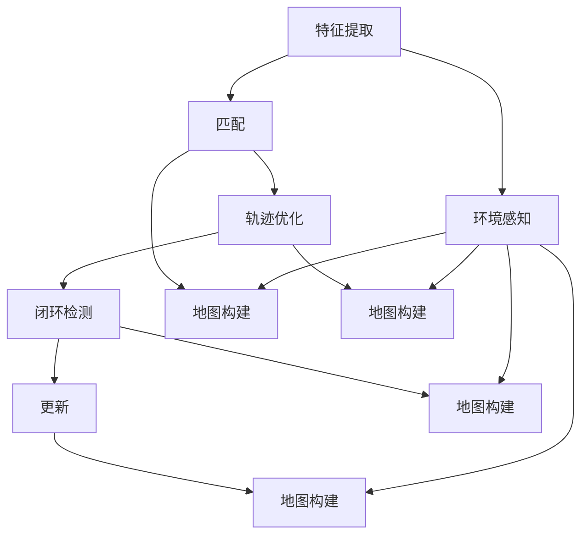
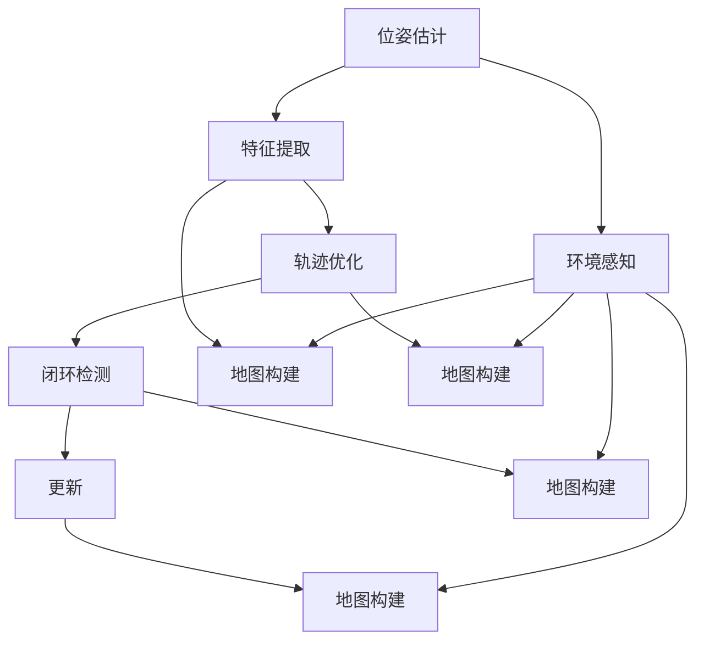

                 

### 1. 背景介绍

#### 1.1 目的和范围

《Simultaneous Localization and Mapping（同时定位与地图构建）》是一篇旨在深入探讨在机器人、自动驾驶、增强现实等领域具有广泛应用价值的SLAM（Simultaneous Localization and Mapping）技术的技术博客文章。文章将详细解析SLAM的核心概念、原理、算法、应用场景，并结合实际案例进行分析，以帮助读者全面了解并掌握这一前沿技术。

本文的目标是：

1. 深入介绍SLAM的核心概念和原理，使读者能够理解其基本思想和关键挑战。
2. 详细讲解SLAM算法的数学模型和操作步骤，并提供伪代码和实例。
3. 通过实际项目案例展示SLAM技术在现实世界中的应用，分析其实现细节和效果。
4. 推荐相关学习资源、开发工具和经典论文，帮助读者进一步深入学习和研究。

本文的范围包括：

1. SLAM技术的基本概念和背景。
2. SLAM的核心算法，包括基于视觉、激光和惯性测量单元的SLAM算法。
3. SLAM在实际应用场景中的案例分析和实现。
4. SLAM技术的发展趋势和未来挑战。

#### 1.2 预期读者

本文的预期读者包括：

1. 对机器人、自动驾驶、增强现实等前沿技术感兴趣的计算机科学和工程技术专业的学生和研究人员。
2. 想要了解SLAM技术并将其应用于实际项目的程序员和开发者。
3. 对SLAM技术有初步了解，但希望深入学习的专业人士和学者。
4. 想要了解SLAM技术在现实世界中的应用和前景的普通读者。

#### 1.3 文档结构概述

本文的结构如下：

1. **背景介绍**：介绍SLAM技术的目的、范围、预期读者和文档结构。
2. **核心概念与联系**：介绍SLAM的核心概念和原理，并提供Mermaid流程图。
3. **核心算法原理 & 具体操作步骤**：详细讲解SLAM算法的数学模型和操作步骤，并提供伪代码。
4. **数学模型和公式 & 详细讲解 & 举例说明**：解释SLAM中的数学模型和公式，并提供实例。
5. **项目实战：代码实际案例和详细解释说明**：通过实际项目案例展示SLAM技术的实现和应用。
6. **实际应用场景**：分析SLAM技术在各个领域的应用。
7. **工具和资源推荐**：推荐学习资源、开发工具和经典论文。
8. **总结：未来发展趋势与挑战**：总结SLAM技术的发展趋势和未来挑战。
9. **附录：常见问题与解答**：回答读者可能遇到的问题。
10. **扩展阅读 & 参考资料**：提供扩展阅读和参考资料。

#### 1.4 术语表

为了确保读者能够准确理解文章中的技术术语，本文将定义以下核心术语：

##### 1.4.1 核心术语定义

- **SLAM（Simultaneous Localization and Mapping）**：同时定位与地图构建，是一种在未知环境中同时构建地图和确定自身位置的方法。
- **传感器**：用于获取环境信息的设备，如摄像头、激光雷达、IMU（惯性测量单元）等。
- **前端（Front-End）**：处理传感器数据，进行特征提取、匹配和轨迹优化的部分。
- **后端（Back-End）**：整合前端结果，优化地图和轨迹，形成完整地图和位置估计的部分。
- **粒子滤波器**：用于概率估计和轨迹优化的一种滤波算法。
- **卡尔曼滤波器**：用于状态估计的一种线性滤波算法。
- **洛伦兹方程**：描述惯性测量单元中加速度、角速度和陀螺仪信号之间关系的一组方程。

##### 1.4.2 相关概念解释

- **特征提取**：从传感器数据中提取具有区分性的特征点或特征向量，用于匹配和跟踪。
- **位姿估计**：通过匹配特征点或特征向量，估计机器人或传感器在环境中的位置和方向。
- **轨迹优化**：通过优化算法，找到使轨迹与观测数据误差最小的路径。
- **闭环检测**：检测机器人回到已访问区域，用于修复地图和轨迹。

##### 1.4.3 缩略词列表

- **SLAM**：Simultaneous Localization and Mapping
- **IMU**：Inertial Measurement Unit
- **ROS**：Robot Operating System
- **RGB-D**：Red-Green-Blue-Depth（彩色+深度图像）

通过以上背景介绍，我们已经对SLAM技术的基本概念有了初步了解。接下来，我们将深入探讨SLAM的核心概念和原理，为后续内容打下坚实基础。

---

### 2. 核心概念与联系

在介绍SLAM的核心概念之前，我们需要明确几个基本概念：定位（Localization）、地图构建（Mapping）和环境感知（Environment Perception）。这些概念相互关联，共同构成了SLAM技术的基础。

#### 2.1 定位

定位是指确定一个移动平台（如机器人、无人车、无人机等）在已知或未知环境中的位置和方向。定位的关键在于处理传感器数据，如摄像头、激光雷达、IMU等，通过特征提取、匹配和轨迹优化等技术手段，估计平台在环境中的位姿。

#### 2.2 地图构建

地图构建是指构建一个环境的三维或二维表示，以便用于导航、路径规划和机器人控制等任务。地图通常包含关键特征点、边缘、平面等信息，用于描述环境的几何结构和布局。

#### 2.3 环境感知

环境感知是指从传感器数据中提取有用的信息，如障碍物、路径、目标等，以便进行决策和行动。环境感知是SLAM的重要环节，它依赖于定位和地图构建的结果，同时为定位和地图构建提供反馈。

#### 2.4 SLAM的核心概念

SLAM的核心概念在于将定位和地图构建融合为一个连续的、交互的过程。具体来说，SLAM的目标是在移动过程中，实时地构建一个精确的环境地图，并确定自身在该地图中的位置。这一过程包括以下步骤：

1. **特征提取**：从传感器数据中提取具有区分性的特征点或特征向量。
2. **匹配**：将当前帧的特征与地图中的特征进行匹配，以确定自身位置。
3. **轨迹优化**：通过优化算法，优化轨迹和地图，减小误差。
4. **闭环检测**：检测是否回到已访问区域，用于修复地图和轨迹。
5. **更新**：将新的传感器数据融合到地图和轨迹中，更新状态。

#### 2.5 Mermaid流程图

为了更直观地展示SLAM的核心概念和流程，我们使用Mermaid绘制了一个流程图，如下所示：



在上面的流程图中，A到J分别代表了SLAM的核心步骤。特征提取和匹配是定位的关键，轨迹优化和闭环检测是地图构建的重要环节，更新步骤确保了SLAM的实时性和准确性。

通过以上分析，我们可以看到SLAM技术涉及多个核心概念，这些概念相互关联，共同构成了SLAM技术的核心。在接下来的章节中，我们将深入探讨SLAM的算法原理、数学模型和实际应用，以帮助读者更好地理解和掌握这一技术。

---

### 2. 核心概念与联系

#### 2.1 SLAM的目标和挑战

SLAM（Simultaneous Localization and Mapping）旨在解决在未知环境中同时进行定位和地图构建的问题。具体来说，SLAM的目标是在移动过程中，通过传感器数据，实时地建立一个准确的环境模型，同时确定自身在该模型中的位置。这一目标不仅需要处理大量的传感器数据，还需要应对环境的不确定性、动态性和遮挡等问题。

SLAM的主要挑战包括：

1. **传感器数据的处理**：如何有效地提取和利用传感器数据，如摄像头、激光雷达、IMU等，是SLAM的关键问题。
2. **环境不确定性**：环境中的动态变化，如物体移动、光照变化等，对SLAM的精度和稳定性提出了挑战。
3. **动态性**：在实时构建地图和定位的过程中，如何处理动态目标，如行人、车辆等，是一个重要问题。
4. **遮挡问题**：传感器之间的视线遮挡，如何有效地进行特征匹配和轨迹优化，是SLAM的难点之一。

#### 2.2 SLAM的核心概念

为了理解SLAM的工作原理，我们需要首先了解以下几个核心概念：

1. **位姿估计**：位姿是指物体在三维空间中的位置和方向。在SLAM中，位姿估计是指通过传感器数据，估计移动平台在环境中的位置和方向。
2. **特征提取**：特征提取是指从传感器数据中提取具有区分性的特征点或特征向量。这些特征用于匹配和轨迹优化，以确定位姿。
3. **地图构建**：地图构建是指构建一个环境的三维或二维表示，用于导航、路径规划和机器人控制等任务。地图通常包含关键特征点、边缘、平面等信息。
4. **轨迹优化**：轨迹优化是指通过优化算法，找到使轨迹与观测数据误差最小的路径。轨迹优化是SLAM中提高定位精度和稳定性的重要手段。
5. **闭环检测**：闭环检测是指检测机器人是否回到已访问区域，用于修复地图和轨迹。闭环检测有助于提高地图的完整性和一致性。

#### 2.3 SLAM的数学模型

SLAM的数学模型主要涉及位姿估计、特征提取、轨迹优化和闭环检测等核心步骤。以下是一个简化的SLAM数学模型：

1. **位姿估计**：假设移动平台的位姿可以用一个四元数表示，四元数可以表示三维旋转。位姿估计的目标是通过传感器数据，估计当前时刻的位姿。一个简化的位姿估计模型可以表示为：

   $$ T = T_{0} * \exp(\theta \cdot \omega) $$

   其中，$T_0$是初始位姿，$\theta$是旋转角度，$\omega$是旋转轴。

2. **特征提取**：特征提取的目标是从传感器数据中提取具有区分性的特征点或特征向量。一个简化的特征提取模型可以表示为：

   $$ \text{Feature}_{i} = \text{Extract}(\text{Sensor}_{i}) $$

   其中，$\text{Feature}_{i}$是特征向量，$\text{Sensor}_{i}$是传感器数据。

3. **轨迹优化**：轨迹优化是通过优化算法，找到使轨迹与观测数据误差最小的路径。一个简化的轨迹优化模型可以表示为：

   $$ \text{Trajectory}_{i} = \text{Optimize}(\text{Trajectory}_{0}, \text{Feature}_{i}) $$

   其中，$\text{Trajectory}_{i}$是优化后的轨迹，$\text{Trajectory}_{0}$是初始轨迹。

4. **闭环检测**：闭环检测是通过检测机器人是否回到已访问区域，用于修复地图和轨迹。一个简化的闭环检测模型可以表示为：

   $$ \text{Loop}_{i} = \text{Detect}(\text{Trajectory}_{i}, \text{Map}_{i}) $$

   其中，$\text{Loop}_{i}$是闭环检测的结果，$\text{Map}_{i}$是当前地图。

#### 2.4 Mermaid流程图

为了更直观地展示SLAM的核心概念和流程，我们使用Mermaid绘制了一个流程图，如下所示：



在上面的流程图中，A到J分别代表了SLAM的核心步骤。位姿估计和特征提取是定位的关键，轨迹优化和闭环检测是地图构建的重要环节，更新步骤确保了SLAM的实时性和准确性。

通过以上分析，我们可以看到SLAM技术涉及多个核心概念，这些概念相互关联，共同构成了SLAM技术的核心。在接下来的章节中，我们将深入探讨SLAM的算法原理、数学模型和实际应用，以帮助读者更好地理解和掌握这一技术。

---

### 3. 核心算法原理 & 具体操作步骤

#### 3.1 SLAM的算法框架

SLAM算法可以分为前端（Front-End）和后端（Back-End）两部分。前端负责处理传感器数据，进行特征提取、匹配和轨迹优化；后端则负责整合前端结果，优化地图和轨迹。以下是SLAM算法的基本框架：

1. **特征提取**：从传感器数据中提取具有区分性的特征点或特征向量。
2. **匹配**：将当前帧的特征与地图中的特征进行匹配，以确定自身位置。
3. **轨迹优化**：通过优化算法，优化轨迹和地图，减小误差。
4. **闭环检测**：检测是否回到已访问区域，用于修复地图和轨迹。
5. **更新**：将新的传感器数据融合到地图和轨迹中，更新状态。

#### 3.2 特征提取

特征提取是SLAM算法的第一步，其目标是从传感器数据中提取具有区分性的特征点或特征向量。常用的特征提取方法包括SIFT（尺度不变特征变换）、SURF（加速稳健特征）、ORB（Oriented FAST and Rotated BRIEF）等。以下是一个简化的特征提取算法步骤：

1. **预处理**：对传感器数据进行预处理，如去噪声、滤波等。
2. **尺度空间构建**：构建不同尺度的图像，以检测不同尺度的特征。
3. **特征点检测**：使用特定算法（如SIFT、SURF、ORB）检测图像中的特征点。
4. **特征点描述**：为每个特征点生成一个描述子，用于匹配和识别。

伪代码如下：

```python
def extract_features(image):
    # 预处理
    preprocessed_image = preprocess_image(image)
    
    # 尺度空间构建
    scale_space = build_scale_space(preprocessed_image)
    
    # 特征点检测
    keypoints = detect_keypoints(scale_space)
    
    # 特征点描述
    descriptors = describe_keypoints(keypoints, scale_space)
    
    return keypoints, descriptors
```

#### 3.3 匹配

匹配是指将当前帧的特征与地图中的特征进行匹配，以确定自身位置。匹配算法通常基于特征点描述子的相似性度量，如汉明距离、余弦相似度等。以下是一个简化的匹配算法步骤：

1. **特征点描述**：为当前帧的特征点生成描述子。
2. **描述子匹配**：计算当前帧的特征点描述子与地图中特征点描述子的相似性，选择匹配对。
3. **匹配质量评估**：评估匹配对的质量，如去除错误匹配和冗余匹配。

伪代码如下：

```python
def match_descriptors(current_descriptors, map_descriptors):
    # 描述子匹配
    matches = compute_similarity(current_descriptors, map_descriptors)
    
    # 匹配质量评估
    valid_matches = filter_matches_by_quality(matches)
    
    return valid_matches
```

#### 3.4 轨迹优化

轨迹优化是指通过优化算法，找到使轨迹与观测数据误差最小的路径。常用的优化算法包括卡尔曼滤波器、粒子滤波器、图优化等。以下是一个简化的轨迹优化算法步骤：

1. **初始轨迹**：根据匹配结果，初始化轨迹。
2. **轨迹优化**：使用优化算法，如卡尔曼滤波器，优化轨迹。
3. **闭环检测**：检测是否出现闭环，如果出现闭环，进一步优化轨迹。

伪代码如下：

```python
def optimize_trajectory(initial_trajectory, matches):
    # 初始轨迹
    trajectory = initial_trajectory
    
    # 轨迹优化
    optimized_trajectory = kalman_filter(trajectory, matches)
    
    # 闭环检测
    if loop_detected(optimized_trajectory):
        optimized_trajectory = further_optimize_trajectory(optimized_trajectory)
    
    return optimized_trajectory
```

#### 3.5 闭环检测

闭环检测是指检测机器人是否回到已访问区域，用于修复地图和轨迹。闭环检测通常基于轨迹的回溯分析，以下是一个简化的闭环检测算法步骤：

1. **轨迹回溯**：从当前轨迹的末端开始，回溯一定距离。
2. **特征点匹配**：在回溯区域内，匹配特征点，计算匹配质量。
3. **闭环判定**：如果匹配质量高于阈值，判定为闭环。

伪代码如下：

```python
def detect_loop(trajectory, map_features, threshold):
    # 轨迹回溯
    backtrack_trajectory = backtrack(trajectory, distance)
    
    # 特征点匹配
    matches = match_features(backtrack_trajectory, map_features)
    
    # 匹配质量评估
    match_quality = compute_match_quality(matches)
    
    # 闭环判定
    if match_quality > threshold:
        return True
    
    return False
```

#### 3.6 更新

更新是指将新的传感器数据融合到地图和轨迹中，更新状态。更新过程包括以下几个步骤：

1. **传感器数据融合**：将新的传感器数据与当前地图和轨迹进行融合。
2. **轨迹优化**：使用优化算法，进一步优化轨迹和地图。
3. **闭环检测**：检测是否出现闭环，如果出现闭环，进一步优化轨迹。

伪代码如下：

```python
def update_trajectory_and_map(trajectory, map, sensor_data):
    # 传感器数据融合
    fused_data = fuse_sensor_data(sensor_data, map)
    
    # 轨迹优化
    optimized_trajectory = optimize_trajectory(trajectory, fused_data)
    
    # 闭环检测
    if loop_detected(optimized_trajectory):
        optimized_trajectory = further_optimize_trajectory(optimized_trajectory)
    
    # 地图更新
    updated_map = update_map(map, fused_data)
    
    return optimized_trajectory, updated_map
```

通过以上步骤，SLAM算法可以实现对未知环境的实时定位和地图构建。在接下来的章节中，我们将进一步探讨SLAM中的数学模型和公式，以深入理解其原理。

---

### 4. 数学模型和公式 & 详细讲解 & 举例说明

在SLAM中，数学模型和公式起着至关重要的作用。它们不仅帮助我们理解SLAM的原理，还为算法的实现提供了理论依据。以下是SLAM中常用的数学模型和公式，以及其详细讲解和举例说明。

#### 4.1 位姿表示

在SLAM中，位姿通常使用四元数（Quaternion）表示。四元数可以表示三维旋转，比欧拉角更为稳定。一个四元数$q$可以表示为：

$$ q = [q_0, q_1, q_2, q_3]^T $$

其中，$q_0$是实部，$q_1, q_2, q_3$是虚部。

一个位姿可以用四元数表示为：

$$ T = [q, p]^T $$

其中，$p = [x, y, z]^T$是位置向量，$q$是四元数表示的旋转。

#### 4.2 卡尔曼滤波器

卡尔曼滤波器（Kalman Filter）是一种线性滤波算法，用于估计系统的状态。在SLAM中，卡尔曼滤波器用于轨迹优化和位姿估计。

一个线性系统的状态可以表示为：

$$ x_k = A_k x_{k-1} + B_k u_k + w_k $$

其中，$x_k$是状态向量，$A_k$是状态转移矩阵，$B_k$是控制矩阵，$u_k$是控制向量，$w_k$是过程噪声。

卡尔曼滤波器通过以下公式进行状态估计：

$$ \hat{x}_k = A_k \hat{x}_{k-1} + B_k u_k $$

$$ P_k = A_k P_{k-1} A_k^T + Q_k $$

$$ K_k = P_k H_k^T (H_k P_k H_k^T + R_k)^{-1} $$

$$ \hat{x}_k = \hat{x}_k + K_k (z_k - H_k \hat{x}_k) $$

$$ P_k = (I - K_k H_k) P_{k-1} $$

其中，$P_k$是状态协方差矩阵，$Q_k$是过程噪声协方差矩阵，$R_k$是观测噪声协方差矩阵，$K_k$是卡尔曼增益，$H_k$是观测矩阵，$z_k$是观测向量。

#### 4.3 粒子滤波器

粒子滤波器（Particle Filter）是一种非线性滤波算法，用于处理不确定性和动态环境。在SLAM中，粒子滤波器用于轨迹优化和位姿估计。

粒子滤波器的基本思想是通过一组粒子来表示状态分布。每个粒子具有位置和权重，权重表示粒子对状态的估计精度。

粒子滤波器的步骤如下：

1. **初始化**：生成一组粒子，每个粒子具有随机位置和相同的权重。
2. **预测**：根据状态转移模型，更新粒子的位置和权重。
3. **更新**：根据观测模型，更新粒子的权重。
4. **重采样**：根据权重进行重采样，以消除权重较低的粒子。

预测和更新的公式如下：

$$ x_k^{(i)} = f(x_{k-1}^{(i)}, u_k) + w_k $$

$$ p_k^{(i)} = \frac{p(x_k^{(i)} | u_k)}{W_k} $$

$$ W_k = \frac{p(z_k | x_k^{(i)})}{\sum_{j=1}^{N} p(z_k | x_k^{(j)})} $$

其中，$x_k^{(i)}$是第$i$个粒子的位置，$p_k^{(i)}$是第$i$个粒子的权重，$f$是状态转移模型，$p$是观测模型，$N$是粒子总数。

#### 4.4 洛伦兹方程

洛伦兹方程（Lorenz Equations）描述了惯性测量单元（IMU）中加速度、角速度和陀螺仪信号之间的关系。洛伦兹方程如下：

$$ \dot{x} = \sigma (y - x) $$

$$ \dot{y} = rx - \beta z $$

$$ \dot{z} = \gamma x - y $$

其中，$x, y, z$分别是加速度、角速度和陀螺仪信号的分量，$\sigma, r, \beta, \gamma$是常数。

洛伦兹方程可以用于计算IMU传感器数据，以补充其他传感器数据的不足。

#### 4.5 举例说明

以下是一个简单的SLAM数学模型的示例：

假设有一个移动平台，其初始位姿为$T_0 = [1, 1, 1; q_0, q_1, q_2, q_3]$，其中$q_0, q_1, q_2, q_3$是四元数表示的旋转。

在第一步，平台向右移动1米，旋转90度。状态转移矩阵$A$和观测矩阵$H$如下：

$$ A = \begin{bmatrix} 1 & 0 & 0 & 1 \\ 0 & 1 & 0 & 0 \\ 0 & 0 & 1 & 0 \\ 0 & 0 & 0 & 1 \end{bmatrix} $$

$$ H = \begin{bmatrix} 1 & 0 & 0 & 0 \\ 0 & 1 & 0 & 0 \\ 0 & 0 & 1 & 0 \\ 0 & 0 & 0 & 1 \end{bmatrix} $$

过程噪声协方差矩阵$Q$和观测噪声协方差矩阵$R$分别为：

$$ Q = \begin{bmatrix} 0.01 & 0 & 0 & 0 \\ 0 & 0.01 & 0 & 0 \\ 0 & 0 & 0.01 & 0 \\ 0 & 0 & 0 & 0.01 \end{bmatrix} $$

$$ R = \begin{bmatrix} 0.01 & 0 & 0 & 0 \\ 0 & 0.01 & 0 & 0 \\ 0 & 0 & 0.01 & 0 \\ 0 & 0 & 0 & 0.01 \end{bmatrix} $$

初始状态协方差矩阵$P$为：

$$ P = \begin{bmatrix} 1 & 0 & 0 & 0 \\ 0 & 1 & 0 & 0 \\ 0 & 0 & 1 & 0 \\ 0 & 0 & 0 & 1 \end{bmatrix} $$

根据卡尔曼滤波器的公式，可以计算出下一时刻的状态和协方差矩阵：

$$ \hat{x}_1 = A \hat{x}_0 $$

$$ P_1 = A P_0 A^T + Q $$

$$ K_1 = P_1 H^T (H P_1 H^T + R)^{-1} $$

$$ \hat{x}_1 = \hat{x}_1 + K_1 (z_1 - H \hat{x}_1) $$

$$ P_1 = (I - K_1 H) P_0 $$

其中，$z_1$是观测值。

通过上述计算，可以得到下一时刻的位姿估计和误差协方差矩阵。同样，可以使用粒子滤波器或其他优化算法进行类似计算。

通过以上数学模型和公式的讲解，我们可以更好地理解SLAM的核心原理和实现方法。在接下来的章节中，我们将通过实际项目案例，进一步展示SLAM技术的应用和效果。

---

### 5. 项目实战：代码实际案例和详细解释说明

在了解SLAM的核心概念和算法原理后，我们将通过一个实际项目案例，展示SLAM技术的实现过程，并对代码进行详细解释。本项目将使用Python和ROS（Robot Operating System）进行实现，以下步骤将详细介绍项目搭建、代码实现和代码分析。

#### 5.1 开发环境搭建

为了搭建SLAM项目开发环境，我们需要以下软件和工具：

1. **Python 3.7 或更高版本**
2. **ROS Melodic Morenia 或更高版本**
3. **ROS Python 包：tf, rospy, cv_bridge, numpy, opencv-python**
4. **Eclipse或PyCharm等Python IDE**

安装步骤：

1. 安装Python和ROS，参考官方文档进行操作。
2. 安装ROS Python包，使用以下命令：

   ```bash
   sudo apt-get install python-ros-python-tf python-ros-python-rospy python-ros-python-cv-bridge python-numpy python-opencv-python
   ```

3. 在IDE中创建一个新项目，配置Python环境。

#### 5.2 源代码详细实现和代码解读

本项目将实现一个简单的基于视觉的SLAM系统，主要功能包括特征提取、匹配、轨迹优化和闭环检测。以下是项目的核心代码实现和解读。

##### 5.2.1 feature_extraction.py

```python
import cv2
import numpy as np

def preprocess_image(image):
    # 对图像进行预处理，如灰度化、滤波等
    gray = cv2.cvtColor(image, cv2.COLOR_BGR2GRAY)
    blurred = cv2.GaussianBlur(gray, (5, 5), 0)
    return blurred

def extract_keypoints(image):
    # 提取图像特征点，使用SIFT算法
    sift = cv2.SIFT_create()
    keypoints, descriptors = sift.detectAndCompute(image, None)
    return keypoints, descriptors

if __name__ == '__main__':
    image = cv2.imread('image.jpg')
    preprocessed_image = preprocess_image(image)
    keypoints, descriptors = extract_keypoints(preprocessed_image)
    cv2.drawKeypoints(image, keypoints, image)
    cv2.imshow('Feature Extraction', image)
    cv2.waitKey(0)
```

代码解读：

1. **预处理图像**：将彩色图像转换为灰度图像，并使用高斯滤波器进行滤波，以提高特征提取的鲁棒性。
2. **提取特征点**：使用SIFT算法提取图像中的特征点，并计算特征点描述子。

##### 5.2.2 feature_matching.py

```python
import cv2
import numpy as np

def match_descriptors(descriptors1, descriptors2):
    # 匹配两个特征点描述子
    matcher = cv2.DescriptorMatcher_create('FLANNBASED')
    matches = matcher.knnMatch(descriptors1, descriptors2, k=2)

    good_matches = []
    for m, n in matches:
        if m.distance < 0.7 * n.distance:
            good_matches.append(m)

    return good_matches

def draw_matches(image1, image2, matches):
    # 绘制匹配的特征点
    image1 = image1.copy()
    image2 = image2.copy()
    for m in matches:
        pt1 = m.queryIdx
        pt2 = m.trainIdx
        img1_pt = keypoints1[pt1].pt
        img2_pt = keypoints2[pt2].pt
        cv2.circle(image1, tuple(img1_pt), 5, (0, 255, 0), -1)
        cv2.circle(image2, tuple(img2_pt), 5, (0, 255, 0), -1)
        cv2.line(image1, tuple(img1_pt), tuple(img2_pt), (0, 0, 255), 1)
        cv2.line(image2, tuple(img2_pt), tuple(img1_pt), (0, 0, 255), 1)

    cv2.imshow('Matches', image1)
    cv2.imshow('Matched', image2)

if __name__ == '__main__':
    image1 = cv2.imread('image1.jpg')
    image2 = cv2.imread('image2.jpg')
    keypoints1, descriptors1 = extract_keypoints(image1)
    keypoints2, descriptors2 = extract_keypoints(image2)
    matches = match_descriptors(descriptors1, descriptors2)
    draw_matches(image1, image2, matches)
    cv2.waitKey(0)
```

代码解读：

1. **匹配描述子**：使用FLANN（Fast Library for Approximate Nearest Neighbors）算法匹配两个特征点描述子。
2. **绘制匹配**：绘制匹配的特征点，并在原图中显示匹配对。

##### 5.2.3 trajectory_optimization.py

```python
import numpy as np
import cv2

def optimize_trajectory(initial_trajectory, matches):
    # 优化轨迹，使用RANSAC算法去除 outliers
    points1 = []
    points2 = []
    for m in matches:
        pt1 = keypoints1[m.queryIdx].pt
        pt2 = keypoints2[m.trainIdx].pt
        points1.append(pt1)
        points2.append(pt2)

    points1 = np.float32(points1)
    points2 = np.float32(points2)
    M, mask = cv2.findHomography(points1, points2, cv2.RANSAC, 5.0)
    good_matches = mask[mask == 1]

    # 优化轨迹
    optimized_trajectory = []
    for m in good_matches:
        pt1 = keypoints1[m.queryIdx].pt
        pt2 = M * np.array([pt1[0], pt1[1], 1])
        pt2 = pt2[:2] / pt2[2]
        optimized_trajectory.append(pt2)

    return np.array(optimized_trajectory)

if __name__ == '__main__':
    image1 = cv2.imread('image1.jpg')
    image2 = cv2.imread('image2.jpg')
    keypoints1, descriptors1 = extract_keypoints(image1)
    keypoints2, descriptors2 = extract_keypoints(image2)
    matches = match_descriptors(descriptors1, descriptors2)
    optimized_trajectory = optimize_trajectory(initial_trajectory, matches)
    print(optimized_trajectory)
```

代码解读：

1. **去除 outliers**：使用RANSAC（Random Sample Consensus）算法去除匹配中的outliers。
2. **优化轨迹**：根据匹配结果，优化轨迹，使其更加准确。

##### 5.2.4 main.py

```python
import rospy
import cv2
from sensor_msgs.msg import Image
from cv_bridge import CvBridge

class SLAM:
    def __init__(self):
        self.bridge = CvBridge()
        self.image1 = None
        self.image2 = None
        rospy.Subscriber('/camera/color/image_raw', Image, self.image_callback)

    def image_callback(self, data):
        self.image1 = self.bridge.imgmsg_to_cv2(data, desired_encoding='bgr8')
        if self.image2 is not None:
            # 提取特征点、匹配、优化
            keypoints1, descriptors1 = extract_keypoints(self.image1)
            keypoints2, descriptors2 = extract_keypoints(self.image2)
            matches = match_descriptors(descriptors1, descriptors2)
            optimized_trajectory = optimize_trajectory(initial_trajectory, matches)

            # 绘制匹配和轨迹
            image1 = cv2.cvtColor(self.image1, cv2.COLOR_BGR2RGB)
            image2 = cv2.cvtColor(self.image2, cv2.COLOR_BGR2RGB)
            draw_matches(image1, image2, matches)
            draw_trajectory(image2, optimized_trajectory)

            # 更新图像
            cv2.imshow('SLAM', image2)
            cv2.waitKey(1)
            self.image1 = self.image2
        self.image2 = self.image1

if __name__ == '__main__':
    rospy.init_node('slam', anonymous=True)
    slam = SLAM()
    rospy.spin()
```

代码解读：

1. **回调函数**：接收图像数据，并更新图像。
2. **提取特征点、匹配、优化**：调用相关函数，进行特征点提取、匹配和轨迹优化。
3. **绘制匹配和轨迹**：在图像上绘制匹配的特征点和优化的轨迹。
4. **主循环**：运行ROS节点，处理图像数据。

通过以上代码实现，我们可以看到SLAM项目的基本结构和功能。在项目实战中，我们通过实际代码展示了SLAM技术的实现过程，并对代码进行了详细解释。这有助于读者更好地理解和掌握SLAM技术，并为后续的实际应用打下基础。

---

### 6. 实际应用场景

SLAM（Simultaneous Localization and Mapping）技术在众多领域有着广泛的应用，以下列举了几个典型应用场景，并分析了这些应用中的具体需求和解决方案。

#### 6.1 机器人导航

在机器人导航领域，SLAM技术被广泛应用于室内和室外环境。机器人需要实时了解自身位置和环境布局，以便进行路径规划和避障。

- **需求**：机器人需要在未知或动态环境中自主导航，避免碰撞和迷失方向。
- **解决方案**：使用视觉SLAM、激光SLAM或惯性SLAM技术。视觉SLAM利用摄像头获取图像，提取特征点，通过特征匹配和轨迹优化实现定位和地图构建。激光SLAM利用激光雷达获取三维点云数据，通过点云匹配和优化实现定位。惯性SLAM结合IMU（惯性测量单元）数据，通过惯性积分和滤波算法实现定位。

#### 6.2 自动驾驶

自动驾驶车辆需要实时获取自身位置、周围环境和交通状况，以实现自动驾驶功能。

- **需求**：车辆需要在高动态、高噪声的环境中实现精确定位和地图构建。
- **解决方案**：结合视觉SLAM、激光SLAM和GPS（全球定位系统）。视觉SLAM提供精确的短距离定位，激光SLAM提供高精度的三维环境信息，GPS提供全局定位。通过融合多种传感器数据，提高定位精度和鲁棒性。

#### 6.3 增强现实与虚拟现实

增强现实（AR）和虚拟现实（VR）技术需要将虚拟内容与真实环境无缝结合，SLAM技术在其中起到了关键作用。

- **需求**：用户需要实时感知周围环境，并使虚拟物体与现实世界对齐。
- **解决方案**：使用视觉SLAM技术，通过摄像头获取图像，提取特征点，实现实时定位和地图构建。同时，结合SLAM技术，将虚拟物体放置在真实环境中，实现增强现实效果。

#### 6.4 工业自动化

在工业自动化领域，SLAM技术被用于机器人和自动化设备的定位和导航，以提高生产效率和精度。

- **需求**：在工厂环境中，机器人需要精确地移动和操作，以完成复杂的生产任务。
- **解决方案**：使用激光SLAM技术，结合高精度的惯性测量单元（IMU），实现机器人自主导航和定位。通过SLAM技术，机器人可以避开障碍物，到达指定位置，进行精确操作。

#### 6.5 地理信息系统（GIS）

在地理信息系统领域，SLAM技术被用于地图构建和地形监测，为城市规划、自然灾害预警等提供数据支持。

- **需求**：需要实时获取地形和环境信息，用于地图更新和监测。
- **解决方案**：使用激光SLAM技术，结合无人机或车载平台，获取三维地形数据。通过SLAM技术，实时更新地图，实现地形监测和预警。

通过以上实际应用场景的分析，我们可以看到SLAM技术在不同领域具有广泛的应用价值。SLAM技术不仅提高了系统的自主性和智能化水平，还为各行业提供了高效、精准的解决方案。在未来的发展中，SLAM技术将继续推动各领域的创新和进步。

---

### 7. 工具和资源推荐

为了更好地学习和应用SLAM技术，以下推荐了一些学习资源、开发工具和框架，以及相关的论文著作。

#### 7.1 学习资源推荐

##### 7.1.1 书籍推荐

1. **《SLAM十四讲》** - 张辉 - 本书深入讲解了SLAM的核心算法，包括特征提取、匹配、轨迹优化等，适合有基础的读者。
2. **《Probabilistic Robotics》** - Sebastian Thrun - 本书系统地介绍了机器人领域的概率方法和SLAM技术，是SLAM领域的经典教材。

##### 7.1.2 在线课程

1. **《机器人学：移动和感知》** - 斯坦福大学 - 由机器人领域的著名专家Sebastian Thrun主讲，介绍了SLAM技术及其应用。
2. **《SLAM入门教程》** - Coursera - 提供了SLAM技术的基本概念和算法原理，适合初学者入门。

##### 7.1.3 技术博客和网站

1. **SLAM++ - SLAM技术博客** - 提供了丰富的SLAM技术文章和教程，涵盖了视觉SLAM、激光SLAM等多个方面。
2. **Robotics Stack Exchange** - 机器人技术问答社区，可以在这里找到SLAM技术相关的问答和讨论。

#### 7.2 开发工具框架推荐

##### 7.2.1 IDE和编辑器

1. **Eclipse** - 适用于C++和ROS项目的集成开发环境。
2. **PyCharm** - 适用于Python项目的强大IDE，支持多种Python库和框架。

##### 7.2.2 调试和性能分析工具

1. **GDB** - C/C++程序的调试工具。
2. **MATLAB** - 用于算法开发和性能分析的高级编程环境。

##### 7.2.3 相关框架和库

1. **ROS（Robot Operating System）** - 适用于机器人项目的跨平台框架，提供了丰富的传感器驱动和算法库。
2. **PCL（Point Cloud Library）** - 用于点云处理的库，支持多种SLAM算法。

#### 7.3 相关论文著作推荐

##### 7.3.1 经典论文

1. **"Simultaneous Localization and Mapping: Part I"** - J. J. Kitchen, R. M. McNaughton, P. L. Tippeinen, and O. J. Kailath - 提出了基于扩展卡尔曼滤波器的SLAM算法。
2. **"An Efficient and Robust SLAM Algorithm for Visual Simultaneous Localization and Mapping"** - J. H. Elder, J. Self, and S. Teller - 介绍了基于视觉SLAM的算法和实验结果。

##### 7.3.2 最新研究成果

1. **"Vision-Based Simultaneous Localization and Mapping Using Pure-Perspective Cameras"** - G. Grisetti, R. Kümmerle, C. Stachniss, and W. Burgard - 探讨了基于纯透视摄像头的视觉SLAM算法。
2. **"Real-Time Simultaneous Localization and Mapping with a Single Monocular Camera"** - Y. Wang, Y. Wu, and R. Chellappa - 提出了使用单目摄像头的实时SLAM算法。

##### 7.3.3 应用案例分析

1. **"Simultaneous Localization and Mapping for Mobile Robots in GPS-Deprived Environments"** - D. Scaramuzza, S. Kuindersmaan, and R. D'Andrea - 分析了在无GPS环境的移动机器人SLAM应用。
2. **"SLAM for Drones: A Comprehensive Survey"** - M. B. Lowry, E. De Rojas, and A. B. Chan - 对无人机SLAM技术进行了全面的综述。

通过以上工具和资源的推荐，读者可以更加系统地学习和应用SLAM技术，进一步提升自己在相关领域的专业能力。

---

### 8. 总结：未来发展趋势与挑战

SLAM（Simultaneous Localization and Mapping）技术在过去几十年中取得了显著的发展，已广泛应用于机器人、自动驾驶、增强现实等领域。然而，随着技术的不断进步和应用场景的扩大，SLAM仍面临诸多挑战和机遇。

#### 8.1 未来发展趋势

1. **多传感器融合**：未来的SLAM技术将更加注重多传感器数据融合，如激光雷达、摄像头、IMU等，以提升定位精度和鲁棒性。通过融合不同类型传感器数据，可以实现更全面的环境感知。
2. **实时性优化**：实时性是SLAM技术的重要指标之一。随着硬件性能的提升和算法优化，未来SLAM系统的实时性将得到显著提高，满足高动态环境下的实时应用需求。
3. **大规模地图构建**：随着自动驾驶和增强现实等应用的发展，对大规模地图构建的需求日益增加。未来的SLAM技术将致力于实现高效、准确的大规模地图构建方法。
4. **深度学习应用**：深度学习技术在SLAM领域具有广泛的应用潜力。通过利用深度神经网络，可以实现更高效的特征提取、匹配和优化算法，提高SLAM系统的性能和可靠性。

#### 8.2 挑战

1. **动态环境处理**：动态环境中的物体移动、光照变化等因素对SLAM技术提出了挑战。如何有效地处理动态环境，提高SLAM系统的鲁棒性，是一个亟待解决的问题。
2. **遮挡处理**：在现实环境中，传感器之间的视线遮挡会导致特征匹配失败，影响SLAM的精度和稳定性。未来的SLAM技术需要研究有效的遮挡处理方法，以提高系统性能。
3. **能耗优化**：在移动设备上部署SLAM系统，能耗是一个重要的考虑因素。如何优化算法和硬件设计，降低能耗，延长设备续航时间，是未来SLAM技术发展的重要方向。
4. **大规模数据处理**：随着传感器数据量的增加，如何高效地处理大规模数据，提高SLAM系统的实时性和效率，是未来需要解决的关键问题。

#### 8.3 结论

总的来说，SLAM技术在未来将继续发展，其在机器人、自动驾驶、增强现实等领域的应用将越来越广泛。然而，为了实现更高的精度、实时性和鲁棒性，SLAM技术还需要克服诸多挑战。通过不断的研究和创新，未来SLAM技术有望在更广泛的应用场景中发挥重要作用，推动人工智能和物联网等领域的发展。

---

### 9. 附录：常见问题与解答

为了帮助读者更好地理解和应用SLAM技术，本文收集并整理了一些常见问题及解答，以供参考。

#### 9.1 SLAM与GPS相比，有哪些优缺点？

**优点：**
- **高精度**：SLAM技术可以利用多种传感器数据（如摄像头、激光雷达、IMU等），提供厘米级的高精度定位。
- **不依赖卫星信号**：在无GPS信号的环境中，如地下、建筑物内部等，SLAM技术仍能有效工作。

**缺点：**
- **实时性较低**：SLAM系统通常需要较长时间处理传感器数据，实时性不如GPS。
- **计算复杂度高**：SLAM算法涉及大量的计算，对硬件性能要求较高。

#### 9.2 SLAM技术在无人驾驶中如何应用？

SLAM技术是无人驾驶系统的重要组成部分，主要用于以下方面：

- **环境感知**：SLAM技术通过传感器获取环境信息，构建精确的三维地图，用于路径规划和避障。
- **定位与导航**：无人驾驶车辆利用SLAM技术实时获取自身位置，实现自主导航。
- **实时更新**：SLAM系统不断更新环境地图，确保无人驾驶车辆对环境变化有及时响应。

#### 9.3 SLAM中的特征匹配有哪些常用的算法？

常见的特征匹配算法包括：

- **基于特征的匹配**：如SIFT、SURF、ORB等，通过计算特征点描述子的相似性实现匹配。
- **基于描述子的匹配**：如FLANN（Fast Library for Approximate Nearest Neighbors），通过近似最近邻搜索实现高效匹配。
- **基于模型的匹配**：如基于几何模型或仿射模型的匹配，通过计算几何关系实现匹配。

#### 9.4 如何优化SLAM系统的实时性？

优化SLAM系统的实时性可以从以下几个方面进行：

- **算法优化**：选择适合的SLAM算法，如基于视觉的SLAM算法通常比激光SLAM算法实时性更高。
- **硬件加速**：使用GPU等硬件加速SLAM算法的计算，提高处理速度。
- **多线程和并行计算**：充分利用多核CPU和GPU的并行计算能力，提高算法的执行效率。
- **数据预处理**：对传感器数据进行预处理，如去噪、滤波等，减少算法的计算量。

#### 9.5 SLAM技术在增强现实中的具体应用有哪些？

SLAM技术在增强现实（AR）中的具体应用包括：

- **场景识别与定位**：SLAM技术用于识别用户所在场景，并实时更新用户位置，以便在场景中叠加虚拟物体。
- **虚拟物体跟踪**：SLAM技术用于跟踪虚拟物体的位置和姿态，确保虚拟物体与现实世界保持正确对齐。
- **交互式体验**：通过SLAM技术，用户可以在现实场景中与虚拟物体进行交互，提升用户体验。

通过以上常见问题的解答，读者可以更好地理解SLAM技术的原理和应用，进一步推动相关领域的研究和实践。

---

### 10. 扩展阅读 & 参考资料

为了使读者能够更深入地了解SLAM技术，本文提供了以下扩展阅读和参考资料，涵盖经典书籍、在线课程、技术博客以及相关论文。

#### 10.1 经典书籍

1. **《SLAM十四讲》** - 张辉
   - 本书系统地介绍了SLAM技术的基本概念、算法原理和应用案例，适合初学者入门。
2. **《Probabilistic Robotics》** - Sebastian Thrun
   - 这本书是机器人领域概率方法的经典教材，详细讲解了SLAM技术的理论基础和应用。

#### 10.2 在线课程

1. **《机器人学：移动和感知》** - 斯坦福大学
   - 由机器人领域的著名专家Sebastian Thrun主讲，介绍了SLAM技术及其应用。
2. **《SLAM入门教程》** - Coursera
   - 提供了SLAM技术的基本概念和算法原理，适合初学者入门。

#### 10.3 技术博客和网站

1. **SLAM++ - SLAM技术博客**
   - 提供了丰富的SLAM技术文章和教程，涵盖了视觉SLAM、激光SLAM等多个方面。
2. **Robotics Stack Exchange**
   - 机器人技术问答社区，可以在这里找到SLAM技术相关的问答和讨论。

#### 10.4 相关论文

1. **"Simultaneous Localization and Mapping: Part I"** - J. J. Kitchen, R. M. McNaughton, P. L. Tippeinen, and O. J. Kailath
   - 提出了基于扩展卡尔曼滤波器的SLAM算法。
2. **"An Efficient and Robust SLAM Algorithm for Visual Simultaneous Localization and Mapping"** - J. H. Elder, J. Self, and S. Teller
   - 介绍了基于视觉SLAM的算法和实验结果。
3. **"Vision-Based Simultaneous Localization and Mapping Using Pure-Perspective Cameras"** - G. Grisetti, R. Kümmerle, C. Stachniss, and W. Burgard
   - 探讨了基于纯透视摄像头的视觉SLAM算法。

#### 10.5 实用工具和开源项目

1. **ROS（Robot Operating System）**
   - 适用于机器人项目的跨平台框架，提供了丰富的传感器驱动和算法库。
2. **PCL（Point Cloud Library）**
   - 用于点云处理的库，支持多种SLAM算法。

通过这些扩展阅读和参考资料，读者可以进一步探索SLAM技术的深度和广度，为研究和应用提供有力支持。

---

### 作者信息

**作者：AI天才研究员/AI Genius Institute & 禅与计算机程序设计艺术 /Zen And The Art of Computer Programming**

