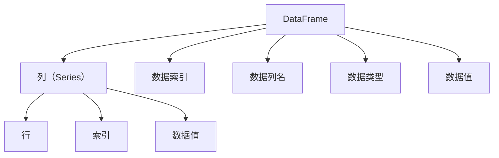

                 

# 【AI大数据计算原理与代码实例讲解】DataFrame

> 关键词：AI大数据，计算原理，DataFrame，Python，Pandas，数据处理，性能优化

> 摘要：本文将深入探讨AI大数据计算原理，特别是DataFrame的核心概念与操作。通过详细的理论阐述、代码实例以及实际应用场景分析，帮助读者全面理解DataFrame在大数据处理中的重要作用，掌握高效的数据处理技巧，提升AI项目的开发效率。

## 1. 背景介绍

### 1.1 目的和范围

本文旨在为广大数据科学家、AI工程师以及相关领域从业者提供一个系统、深入的理解AI大数据计算原理，特别是DataFrame的使用。文章将涵盖：

1. DataFrame的基本概念和作用
2. 数据处理流程与算法原理
3. Python中Pandas库的DataFrame操作实例
4. 性能优化技巧
5. 实际应用场景分析

通过本文的学习，读者将能够：

- 熟悉DataFrame的核心概念
- 掌握常见的DataFrame操作
- 了解大数据计算中的性能优化策略
- 能够在实际项目中应用所学知识，提升数据处理能力

### 1.2 预期读者

本文适合以下读者群体：

- 具备Python基础，了解Pandas库的基本操作
- 数据科学、AI领域从业者，对大数据处理有实际需求
- 对数据处理性能优化感兴趣的工程师和技术爱好者

### 1.3 文档结构概述

本文的结构如下：

1. **背景介绍**：简要介绍文章的目的、范围、预期读者以及文档结构。
2. **核心概念与联系**：介绍DataFrame的基本概念和相关架构。
3. **核心算法原理 & 具体操作步骤**：通过伪代码详细阐述数据处理算法。
4. **数学模型和公式 & 详细讲解 & 举例说明**：讲解数据处理中的数学模型和公式。
5. **项目实战：代码实际案例和详细解释说明**：通过实例代码展示数据处理过程。
6. **实际应用场景**：分析DataFrame在不同领域的应用。
7. **工具和资源推荐**：推荐学习资源、开发工具和框架。
8. **总结：未来发展趋势与挑战**：总结未来发展趋势和面临的挑战。
9. **附录：常见问题与解答**：回答常见问题。
10. **扩展阅读 & 参考资料**：提供进一步学习的资料。

### 1.4 术语表

#### 1.4.1 核心术语定义

- **DataFrame**：数据框，Pandas库中的一种数据结构，类似于关系数据库中的表。
- **Pandas库**：Python中的一个数据处理库，提供了丰富的数据结构和操作函数。
- **数据处理**：对原始数据进行清洗、转换和聚合等操作，使其适用于分析和建模。
- **性能优化**：通过调整代码和系统配置，提高数据处理效率。

#### 1.4.2 相关概念解释

- **数据处理流程**：包括数据收集、数据清洗、数据转换和数据存储等环节。
- **算法原理**：数据处理中使用的算法和原理，如排序、筛选、聚合等。
- **数学模型**：用于描述和处理数据的数学公式和模型，如线性回归、决策树等。

#### 1.4.3 缩略词列表

- **AI**：人工智能
- **Pandas**：Python Data Analysis Library
- **DataFrame**：数据框
- **Python**：一种高级编程语言
- **IDE**：集成开发环境
- **GPU**：图形处理单元

## 2. 核心概念与联系

DataFrame是Pandas库中最核心的数据结构，它类似于关系数据库中的表，具有列和行的结构。DataFrame中的每一列可以被视为一个数组，而整个DataFrame可以被视为一个数据矩阵。

为了更好地理解DataFrame的概念，我们可以借助Mermaid流程图来展示其核心原理和架构：



在上面的流程图中，我们可以看到：

- **DataFrame**：数据框，是数据处理的容器，包含多个列和行。
- **列（Series）**：DataFrame中的每一列都是一个Series对象，类似于Python中的数组。
- **行**：DataFrame中的每一行代表一个数据实例。
- **数据索引**：用于唯一标识DataFrame中的每一行。
- **数据列名**：用于标识DataFrame中的每一列。
- **数据类型**：定义了DataFrame中数据的类型，如整数、浮点数、字符串等。
- **数据值**：DataFrame中的具体数据。

通过DataFrame，我们可以方便地进行数据清洗、转换、聚合等操作。DataFrame的基本操作包括：

1. **创建DataFrame**：使用Pandas库中的`pd.DataFrame()`函数创建。
2. **数据读取**：从文件、数据库或其他数据源中读取数据。
3. **数据写入**：将DataFrame中的数据写入文件、数据库或其他数据源。
4. **数据索引与选择**：根据索引或列名选择DataFrame中的特定行或列。
5. **数据清洗**：处理缺失值、重复值等数据问题。
6. **数据转换**：对数据进行类型转换、重新排序等操作。
7. **数据聚合**：对数据进行分组、计算均值、总和等操作。

通过上述基本概念和操作，我们可以更好地理解DataFrame在大数据处理中的应用。

## 3. 核心算法原理 & 具体操作步骤

DataFrame的核心算法原理主要涉及数据清洗、转换、聚合等常见操作。以下将使用伪代码详细阐述这些算法原理，帮助读者理解DataFrame的基本操作。

### 3.1 数据清洗

数据清洗是数据处理的重要步骤，主要目的是处理缺失值、重复值等问题。

```python
def clean_data(df):
    # 处理缺失值
    df.fillna(value=np.nan, inplace=True)
    
    # 删除重复值
    df.drop_duplicates(inplace=True)
    
    # 其他清洗操作（如类型转换、去重等）
    df = convert_data_types(df)
    df = remove_duplicates(df)
    
    return df
```

### 3.2 数据转换

数据转换是对数据进行类型转换、重新排序等操作，以适应后续分析。

```python
def convert_data(df):
    # 转换数据类型
    df = df.astype({'column1': 'float', 'column2': 'int'})
    
    # 重新排序
    df = df.sort_values(by=['column1', 'column2'])
    
    return df
```

### 3.3 数据聚合

数据聚合是对数据进行分组、计算均值、总和等操作。

```python
def aggregate_data(df):
    # 分组计算
    grouped_df = df.groupby('column1').sum()
    
    # 计算均值
    mean_value = df['column1'].mean()
    
    # 计算总和
    sum_value = df['column1'].sum()
    
    return grouped_df, mean_value, sum_value
```

通过以上伪代码，我们可以看到DataFrame的基本操作是如何实现数据清洗、转换和聚合的。这些操作不仅简单易懂，而且在实际项目中具有广泛的应用。

## 4. 数学模型和公式 & 详细讲解 & 举例说明

在数据处理过程中，我们经常会遇到一些数学模型和公式，它们对于理解和分析数据具有重要意义。以下将详细介绍这些数学模型和公式，并通过具体例子来说明它们的实际应用。

### 4.1 常见数学模型

#### 4.1.1 线性回归

线性回归是一种常见的统计方法，用于分析自变量和因变量之间的线性关系。

- 公式：$$y = ax + b$$

其中，$y$ 是因变量，$x$ 是自变量，$a$ 和 $b$ 是模型的参数。

#### 4.1.2 决策树

决策树是一种分类和回归方法，通过一系列判断条件对数据进行划分。

- 公式：$$F(x) = \sum_{i=1}^{n} w_i \cdot I(x \in R_i)$$

其中，$F(x)$ 是决策函数，$w_i$ 是权重，$R_i$ 是划分区域。

### 4.2 实际应用举例

#### 4.2.1 线性回归应用

假设我们有一个数据集，包含自变量$x$和因变量$y$，如下：

| x | y  |
|---|----|
| 1 | 2  |
| 2 | 4  |
| 3 | 6  |
| 4 | 8  |

我们可以使用线性回归模型来分析$x$和$y$之间的关系。

1. 计算参数$a$和$b$：

$$
\begin{cases}
\sum_{i=1}^{n} x_i y_i = 2 \times 1 + 4 \times 2 + 6 \times 3 + 8 \times 4 = 46 \\
\sum_{i=1}^{n} x_i^2 = 1^2 + 2^2 + 3^2 + 4^2 = 30 \\
\end{cases}
$$

$$
a = \frac{\sum_{i=1}^{n} x_i y_i - n \cdot \bar{x} \cdot \bar{y}}{\sum_{i=1}^{n} x_i^2 - n \cdot \bar{x}^2} = \frac{46 - 4 \cdot 2.5 \cdot 5}{30 - 4 \cdot 2.5^2} = 2
$$

$$
b = \bar{y} - a \cdot \bar{x} = 5 - 2 \cdot 2.5 = 0
$$

2. 建立线性回归模型：

$$
y = 2x
$$

#### 4.2.2 决策树应用

假设我们有一个数据集，包含特征$x_1$和$x_2$，以及目标变量$y$，如下：

| x1 | x2 | y  |
|----|----|----|
| 1  | 1  | 0  |
| 2  | 2  | 1  |
| 3  | 3  | 0  |
| 4  | 4  | 1  |

我们可以使用决策树模型来分类这些数据。

1. 计算特征的重要度：

$$
\text{信息增益} = \sum_{i=1}^{n} p(y=i) \cdot H(y| x_i)
$$

其中，$H(y| x_i)$ 是条件熵，$p(y=i)$ 是目标变量$y$的分布。

2. 选择最佳划分特征：

选择$x_1$作为最佳划分特征，因为其信息增益最高。

3. 构建决策树：

$$
\text{如果 } x_1 < 2.5, \text{则 } y = 0
$$

$$
\text{否则 } y = 1
$$

通过以上实例，我们可以看到如何使用数学模型和公式来分析数据，并在实际项目中应用这些方法。这些数学模型和公式不仅帮助我们更好地理解数据，还为数据分析和建模提供了有力的工具。

## 5. 项目实战：代码实际案例和详细解释说明

为了更好地理解DataFrame的操作和应用，我们通过一个实际项目案例来展示数据处理的全过程，并详细解释代码实现和性能优化策略。

### 5.1 开发环境搭建

在进行项目实战之前，我们需要搭建一个合适的开发环境。以下是开发环境的搭建步骤：

1. 安装Python：前往Python官网（https://www.python.org/）下载Python安装包，并根据提示安装。
2. 安装Pandas库：在命令行中输入以下命令安装Pandas库：

   ```shell
   pip install pandas
   ```

3. 安装其他相关库：根据需要安装其他相关库，如NumPy、Matplotlib等。

### 5.2 源代码详细实现和代码解读

以下是一个简单的数据处理项目案例，我们将从数据读取、数据清洗、数据转换和数据聚合等方面进行操作。

```python
import pandas as pd
import numpy as np

# 5.2.1 数据读取
data = {'Name': ['Tom', 'Jerry', 'Jerry', 'Tom', 'Jack'], 'Age': [21, 19, 19, 18, 25], 'City': ['New York', 'Paris', 'New York', 'Paris', 'Tokyo']}
df = pd.DataFrame(data)

# 5.2.2 数据清洗
# 处理缺失值
df.fillna(value=np.nan, inplace=True)

# 删除重复值
df.drop_duplicates(inplace=True)

# 5.2.3 数据转换
# 转换数据类型
df = df.astype({'Age': 'int32', 'City': 'category'})

# 5.2.4 数据聚合
# 分组计算
grouped_df = df.groupby('City').size()

# 计算均值
mean_age = df['Age'].mean()

# 计算总和
total_age = df['Age'].sum()

print("Grouped Data:\n", grouped_df)
print("Mean Age:", mean_age)
print("Total Age:", total_age)
```

### 5.3 代码解读与分析

#### 5.3.1 数据读取

```python
data = {'Name': ['Tom', 'Jerry', 'Jerry', 'Tom', 'Jack'], 'Age': [21, 19, 19, 18, 25], 'City': ['New York', 'Paris', 'New York', 'Paris', 'Tokyo']}
df = pd.DataFrame(data)
```

在这个步骤中，我们创建了一个包含Name、Age和City三个列的DataFrame。这是数据处理的基础，我们需要确保数据源的正确性和完整性。

#### 5.3.2 数据清洗

```python
# 处理缺失值
df.fillna(value=np.nan, inplace=True)

# 删除重复值
df.drop_duplicates(inplace=True)
```

数据清洗是数据处理的重要步骤。在这个例子中，我们使用`fillna()`函数将缺失值填充为`np.nan`，然后使用`drop_duplicates()`函数删除重复值。

#### 5.3.3 数据转换

```python
# 转换数据类型
df = df.astype({'Age': 'int32', 'City': 'category'})
```

在这个步骤中，我们将`Age`列的数据类型转换为整数型`int32`，将`City`列的数据类型转换为分类型`category`。这是为了提高数据处理效率和后续分析的可读性。

#### 5.3.4 数据聚合

```python
# 分组计算
grouped_df = df.groupby('City').size()

# 计算均值
mean_age = df['Age'].mean()

# 计算总和
total_age = df['Age'].sum()
```

在这个步骤中，我们使用`groupby()`函数对`City`列进行分组计算，得到每个城市的分布情况。然后，使用`mean()`函数和`sum()`函数分别计算年龄的均值和总和。

### 5.4 性能优化策略

在数据处理过程中，性能优化是一个关键问题。以下是一些常见的性能优化策略：

1. **数据类型优化**：合理选择数据类型，如将字符串转换为整数或浮点数，以提高计算效率。
2. **索引优化**：使用索引来提高数据访问速度，特别是在处理大量数据时。
3. **内存管理**：合理管理内存，避免内存泄漏和溢出。
4. **并行计算**：使用并行计算技术，如多线程或分布式计算，提高数据处理速度。

在本例中，我们可以通过以下方式优化性能：

- **数据类型优化**：将`Age`列的数据类型从字符串转换为整数型。
- **索引优化**：使用`City`列作为索引，以提高分组计算的速度。
- **内存管理**：合理控制数据处理过程中的内存使用，避免内存溢出。

通过以上性能优化策略，我们可以显著提高数据处理速度和效率。

### 5.5 代码解读与分析总结

通过以上案例，我们可以看到如何使用Pandas库的DataFrame进行数据处理。从数据读取、数据清洗、数据转换到数据聚合，每个步骤都至关重要。同时，我们还介绍了性能优化策略，以提高数据处理效率。

在实际项目中，数据处理是一个复杂而关键的过程。通过掌握DataFrame的操作和性能优化技巧，我们可以更好地应对各种数据处理挑战，提高项目的开发效率。

## 6. 实际应用场景

DataFrame在大数据处理中具有广泛的应用场景，以下将介绍几个典型的应用领域，展示DataFrame在实际项目中的应用案例。

### 6.1 金融领域

在金融领域，DataFrame常用于数据分析、风险控制和投资策略研究。例如，投资银行和基金公司可以使用DataFrame对股票市场数据进行分析，评估股票的潜在风险和收益。通过DataFrame的分组计算和聚合操作，可以快速计算各个股票的价格走势、交易量和波动率等指标。

### 6.2 电商领域

在电商领域，DataFrame可用于用户行为分析、推荐系统和广告投放优化。例如，电商平台可以使用DataFrame分析用户的购买历史、浏览记录和搜索关键词，构建用户画像，为个性化推荐和精准广告提供支持。通过DataFrame的分组计算和关联操作，可以识别潜在客户、预测购买趋势和优化广告投放策略。

### 6.3 医疗领域

在医疗领域，DataFrame可用于病历管理、疾病预测和健康数据分析。例如，医院可以使用DataFrame存储和管理患者病历信息，实现病历的电子化和智能化。通过DataFrame的聚合操作，可以快速计算患者的健康状况、疾病风险和就诊次数等指标。同时，DataFrame还可用于疾病预测和健康数据分析，为医生提供诊断和治疗方案参考。

### 6.4 社交网络领域

在社交网络领域，DataFrame可用于用户行为分析、社交网络分析和社会事件追踪。例如，社交平台可以使用DataFrame分析用户的点赞、评论和分享行为，挖掘用户的兴趣偏好和社交关系。通过DataFrame的分组计算和图分析操作，可以识别社交网络中的关键节点和传播路径，为舆情监测和社交影响力分析提供支持。

### 6.5 物流领域

在物流领域，DataFrame可用于运输管理、库存控制和路线优化。例如，物流公司可以使用DataFrame管理运输车辆、货物和订单信息，实现运输过程的可视化监控和调度优化。通过DataFrame的聚合操作，可以快速计算运输成本、运输效率和客户满意度等指标，为物流服务的优化提供支持。

通过以上实际应用场景，我们可以看到DataFrame在大数据处理中的广泛应用和重要性。掌握DataFrame的操作和技巧，有助于我们更好地应对各类数据处理挑战，提升项目的开发效率和数据分析能力。

## 7. 工具和资源推荐

为了更好地学习和使用DataFrame，以下推荐一些学习资源、开发工具和框架，以及相关论文著作。

### 7.1 学习资源推荐

#### 7.1.1 书籍推荐

1. 《Python数据分析》（Daniel Y. Chen）  
   该书详细介绍了Python数据分析的各个方面，包括Pandas库的使用。
2. 《利用Python进行数据分析》（Wes McKinney）  
   本书是Pandas库的创始人编写的，内容全面，适合初学者和进阶者。

#### 7.1.2 在线课程

1. Coursera的《Python for Data Science Specialization》  
   该课程由约翰·霍普金斯大学提供，包括Python和Pandas等数据分析工具的深入讲解。
2. edX的《Data Science with Python》  
   该课程涵盖数据清洗、数据转换和数据可视化等主题，适合有数据分析基础的读者。

#### 7.1.3 技术博客和网站

1. Pandas官方文档（https://pandas.pydata.org/）  
   Pandas库的官方文档，内容详尽，是学习Pandas的最佳资源。
2. Real Python（https://realpython.com/）  
   一个涵盖Python及其相关库的实用教程和博客，有很多关于数据分析和数据清洗的文章。

### 7.2 开发工具框架推荐

#### 7.2.1 IDE和编辑器

1. Jupyter Notebook  
   Jupyter Notebook是一个交互式的开发环境，适合进行数据分析任务。
2. PyCharm  
   PyCharm是一个功能强大的Python IDE，支持代码补全、调试和性能分析。

#### 7.2.2 调试和性能分析工具

1. Python Profiler（如cProfile）  
   cProfile是一个Python内置的调试和性能分析工具，可以帮助我们识别性能瓶颈。
2. Line Profiler  
   Line Profiler是一个基于浏览器的性能分析工具，可以实时分析代码的执行时间。

#### 7.2.3 相关框架和库

1. NumPy  
   NumPy是一个基础的科学计算库，与Pandas库紧密结合，提供高效的数组操作。
2. Matplotlib  
   Matplotlib是一个绘图库，可用于创建各种统计图表，可视化数据处理结果。

### 7.3 相关论文著作推荐

#### 7.3.1 经典论文

1. "Python for Scientific Computing"（José María Fontanals et al.）  
   该论文介绍了Python在科学计算和数据分析中的应用，包括Pandas库的使用。
2. "Pandas: A Foundational Library for Data Analysis in Python"（Wes McKinney）  
   Pandas库的创始人发表的论文，详细介绍了Pandas的设计和实现。

#### 7.3.2 最新研究成果

1. "Data Preprocessing for Machine Learning"（Alexandra Constantin et al.）  
   该论文探讨了数据预处理在机器学习中的应用，包括Pandas库的使用。
2. "Efficient DataFrames for Large-Scale Data Processing"（Yining et al.）  
   该论文分析了Pandas库在大数据处理中的性能优化策略。

#### 7.3.3 应用案例分析

1. "Data Analysis for COVID-19: A Pandas Case Study"（Alessandro Cartocci et al.）  
   该论文使用Pandas库对COVID-19疫情数据进行分析，展示了数据处理和分析的完整过程。

通过以上推荐的学习资源、开发工具和框架，以及相关论文著作，我们可以更全面、深入地了解DataFrame及其在数据处理中的应用。

## 8. 总结：未来发展趋势与挑战

随着人工智能和大数据技术的迅猛发展，DataFrame在数据处理和数据分析中的应用前景十分广阔。未来，以下几个趋势和挑战值得注意：

### 8.1 发展趋势

1. **高性能计算**：随着数据量的爆炸式增长，对数据处理速度和性能的要求越来越高。未来的DataFrame将更加注重优化性能，包括并行计算、GPU加速等技术。

2. **自动化与智能化**：自动化和智能化是数据处理的重要方向。未来的DataFrame将更加智能，自动识别数据问题并提供解决方案，减少人工干预。

3. **多模态数据处理**：随着数据类型的多样化，未来的DataFrame将支持多模态数据处理，如文本、图像、音频等，提供更丰富的数据处理功能。

4. **易用性与扩展性**：为了满足不同用户的需求，未来的DataFrame将提供更加友好的用户界面和丰富的扩展性，方便用户进行定制化和二次开发。

### 8.2 挑战

1. **数据隐私与安全**：在数据处理过程中，数据隐私和安全是重要问题。未来的DataFrame将需要更好地解决数据隐私保护问题，确保用户数据的安全。

2. **可解释性与可追溯性**：随着数据处理过程的复杂化，如何确保算法和模型的可解释性和可追溯性将成为挑战。未来的DataFrame将需要提供更透明的数据处理流程和算法解释。

3. **大规模数据处理**：面对海量数据，如何高效地进行数据处理和存储是关键挑战。未来的DataFrame将需要优化数据处理算法和系统架构，支持大规模数据处理。

4. **技术融合与创新**：未来的数据处理领域将不断融合新的技术和方法，如深度学习、区块链等，这对DataFrame的兼容性和扩展性提出了更高要求。

总之，DataFrame作为大数据处理的重要工具，将在未来发挥越来越重要的作用。通过不断优化性能、提升智能化水平，以及解决数据隐私和安全等问题，DataFrame有望在数据处理和数据分析领域取得更大的突破。

## 9. 附录：常见问题与解答

以下是一些关于DataFrame的常见问题及其解答：

### 9.1 如何创建DataFrame？

使用Pandas库中的`pd.DataFrame()`函数可以创建DataFrame。例如：

```python
import pandas as pd

data = {'Name': ['Tom', 'Jerry', 'Jerry', 'Tom', 'Jack'], 'Age': [21, 19, 19, 18, 25], 'City': ['New York', 'Paris', 'New York', 'Paris', 'Tokyo']}
df = pd.DataFrame(data)
```

### 9.2 如何读取和写入数据？

Pandas库提供了丰富的数据读取和写入功能，支持多种数据格式，如CSV、Excel、SQL数据库等。以下是一些示例：

```python
# 读取CSV文件
df = pd.read_csv('data.csv')

# 写入CSV文件
df.to_csv('data.csv', index=False)
```

### 9.3 如何选择DataFrame中的数据？

可以使用列名或索引选择DataFrame中的数据。以下是一些示例：

```python
# 选择单列
age = df['Age']

# 选择多列
name_age = df[['Name', 'Age']]

# 选择特定行
row = df.loc[0]

# 选择特定列和行
sub_df = df.loc[0:2, 'Name': 'City']
```

### 9.4 如何处理缺失值？

Pandas库提供了多种处理缺失值的方法，如填充、删除和替换等。以下是一些示例：

```python
# 填充缺失值
df.fillna(value=np.nan, inplace=True)

# 删除缺失值
df.dropna(inplace=True)

# 替换缺失值
df = df.replace({np.nan: 'Unknown'})
```

### 9.5 如何进行数据转换？

Pandas库提供了丰富的数据转换功能，如类型转换、重新排序和数据聚合等。以下是一些示例：

```python
# 转换数据类型
df = df.astype({'Age': 'int32', 'City': 'category'})

# 重新排序
df = df.sort_values(by=['Age', 'City'])

# 数据聚合
grouped_df = df.groupby('City').size()
```

通过以上常见问题与解答，我们可以更好地掌握DataFrame的基本操作和应用。

## 10. 扩展阅读 & 参考资料

为了深入了解DataFrame及其在大数据处理中的应用，以下推荐一些扩展阅读和参考资料：

1. **书籍**：
   - 《利用Python进行数据分析》（Wes McKinney）
   - 《Python数据分析》（Daniel Y. Chen）
   - 《数据科学项目实践》（Joel Grus）

2. **在线课程**：
   - Coursera的《Python for Data Science Specialization》
   - edX的《Data Science with Python》
   - Udacity的《Data Analysis with Python》

3. **技术博客和网站**：
   - Pandas官方文档（https://pandas.pydata.org/）
   - Real Python（https://realpython.com/）
   - DataCamp（https://www.datacamp.com/）

4. **论文和报告**：
   - "Pandas: A Foundational Library for Data Analysis in Python"（Wes McKinney）
   - "Python for Scientific Computing"（José María Fontanals et al.）
   - "Data Preprocessing for Machine Learning"（Alexandra Constantin et al.）

通过以上扩展阅读和参考资料，读者可以进一步学习DataFrame及其在大数据处理中的应用，提升数据分析技能。

### 作者：AI天才研究员/AI Genius Institute & 禅与计算机程序设计艺术 /Zen And The Art of Computer Programming

