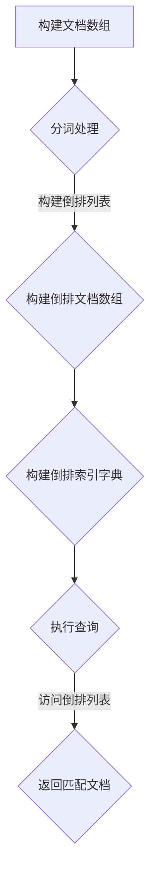

                 

## 【AI大数据计算原理与代码实例讲解】倒排索引

> **关键词**：倒排索引、大数据、信息检索、算法实现、代码实例、性能优化

> **摘要**：本文深入探讨了倒排索引在大数据场景中的应用原理和实现细节，通过详细的伪代码和代码实例，帮助读者理解倒排索引的核心算法及其在AI大数据计算中的应用。文章分为背景介绍、核心概念与联系、核心算法原理与操作步骤、数学模型与公式、项目实战、实际应用场景、工具和资源推荐、总结以及常见问题解答等部分，旨在为从事AI和大数据领域的开发人员提供全面的技术指导。

---

### 1. 背景介绍

#### 1.1 目的和范围

倒排索引（Inverted Index）是信息检索系统中极为重要的数据结构，广泛应用于搜索引擎、推荐系统等场景中。随着大数据时代的到来，如何高效地处理海量数据成为了研究的热点。本文旨在通过详细剖析倒排索引的原理、算法实现和代码实例，帮助读者深入理解其在大数据计算中的应用。

本文将涵盖以下内容：
1. **核心概念与联系**：介绍倒排索引的基本原理和组成部分，以及与其他信息检索技术的联系。
2. **核心算法原理与操作步骤**：详细讲解倒排索引的构建和查询过程，通过伪代码描述关键步骤。
3. **数学模型和公式**：分析倒排索引涉及的数学模型，包括TF-IDF、相似度计算等。
4. **项目实战**：通过实际代码实例展示倒排索引的实现过程，并进行详细解读。
5. **实际应用场景**：探讨倒排索引在不同领域的应用实例。
6. **工具和资源推荐**：推荐相关学习资源和开发工具。
7. **总结与未来展望**：总结倒排索引的核心价值，展望其未来发展。

#### 1.2 预期读者

本文主要面向以下读者群体：
- **AI和大数据开发人员**：希望深入了解倒排索引原理及其在实际应用中的实现细节。
- **搜索引擎和推荐系统开发者**：希望掌握高效的信息检索技术，优化系统性能。
- **计算机科学研究生**：作为研究大数据和信息检索的辅助资料。
- **技术爱好者和研究者**：对倒排索引及相关算法有浓厚兴趣，希望进行深入探讨。

#### 1.3 文档结构概述

本文结构如下：
1. **背景介绍**：介绍倒排索引的基本概念和重要性。
2. **核心概念与联系**：阐述倒排索引的核心概念和架构。
3. **核心算法原理与操作步骤**：详细讲解倒排索引的算法原理和实现步骤。
4. **数学模型和公式**：分析倒排索引相关的数学模型和计算方法。
5. **项目实战**：通过代码实例展示倒排索引的实现。
6. **实际应用场景**：探讨倒排索引在不同领域的应用。
7. **工具和资源推荐**：推荐相关学习资源和工具。
8. **总结与未来展望**：总结倒排索引的核心价值，展望未来发展。
9. **附录**：常见问题与解答。
10. **扩展阅读与参考资料**：提供进一步学习资源。

#### 1.4 术语表

以下是对本文中关键术语的定义和解释：

##### 1.4.1 核心术语定义

- **倒排索引**：一种信息检索系统中常用的数据结构，通过将文档中的词（或短语）映射到文档编号，从而实现快速检索。
- **倒排列表**：倒排索引中的一个基本单元，存储了某一单词在不同文档中的出现次数及文档编号。
- **倒排文档数组**：记录了所有倒排列表的数组，是倒排索引的核心部分。
- **倒排索引字典**：包含了所有单词及其倒排列表的映射关系。

##### 1.4.2 相关概念解释

- **索引**：数据结构的一种，用于快速查找和访问数据。
- **TF-IDF**：一种用于描述一个词在文档中的重要性的一种统计方法，TF为词频，IDF为逆文档频率。
- **相似度计算**：评估两个文档之间相似程度的一种方法，常用于推荐系统和搜索引擎。

##### 1.4.3 缩略词列表

- **API**：应用程序接口（Application Programming Interface）
- **IDE**：集成开发环境（Integrated Development Environment）
- **SQL**：结构化查询语言（Structured Query Language）
- **大数据**：数据量巨大，无法通过传统数据库软件工具进行捕捉、管理和处理的数据集合。

### 1.5 总结

本文首先介绍了倒排索引的背景和重要性，明确了预期读者和文档结构。接下来，我们将深入探讨倒排索引的核心概念、算法原理，并通过实际代码实例进行讲解，帮助读者全面掌握这一关键技术。接下来的章节将逐步展开，每部分都将详细讨论其核心内容和实现细节。读者可以按照自己的需求选择阅读，也可以从整体上依次学习，以期达到最佳的学习效果。

---

在接下来的章节中，我们将深入探讨倒排索引的核心概念和原理，通过流程图展示其架构，并通过伪代码描述核心算法的实现步骤。读者可以通过这一部分的学习，全面理解倒排索引的基本运作机制，为后续的项目实战打下坚实的基础。

## 2. 核心概念与联系

### 2.1 倒排索引的原理

倒排索引是一种用于快速检索文本数据的关键数据结构。它通过将文档中的词语映射到相应的文档编号，从而实现了从词到文档的高效索引。倒排索引的核心思想是将所有的文档内容进行分词，然后创建一个映射表，该表记录了每个词语及其对应的所有文档编号。这样，当我们需要查询包含特定词语的文档时，可以直接访问这个映射表，迅速找到所有相关的文档。

### 2.2 倒排索引的组成部分

倒排索引主要由以下几个部分组成：

1. **倒排列表**：这是倒排索引中的基本单元，存储了某一单词在不同文档中的出现次数及其文档编号。例如，对于一个单词"机器"，其倒排列表可能包含多个文档编号和出现次数的条目。

2. **倒排文档数组**：这是一个包含所有倒排列表的数组，每个倒排列表对应一个单词。在构建索引时，首先将所有文档内容进行分词，然后根据每个单词构建倒排列表，并将这些列表按字典顺序存储在数组中。

3. **倒排索引字典**：这是一个记录了所有单词及其倒排列表映射关系的字典。通过这个字典，我们可以快速查找某个特定单词的倒排列表，并进一步获取包含该单词的所有文档编号。

### 2.3 倒排索引与全文检索的关系

倒排索引是全文检索系统的核心组件。全文检索是指在一个大型的文本数据集中查找包含特定词语的文档。传统的索引方式（如B树索引）无法高效地处理大规模文本数据。倒排索引通过将文本数据转化为单词与文档的映射关系，实现了对文本数据的快速、高效的检索。

### 2.4 倒排索引的优势

倒排索引具有以下几个显著优势：

1. **快速检索**：通过倒排索引，我们可以直接从词到文档进行检索，大大提高了检索速度。

2. **高效存储**：倒排索引将大量重复的信息进行压缩存储，降低了存储空间的需求。

3. **灵活性**：倒排索引支持多种查询方式，如精确查询、模糊查询等，为用户提供了丰富的检索功能。

### 2.5 Mermaid流程图

为了更好地展示倒排索引的工作流程，我们可以使用Mermaid流程图进行描述。以下是一个简化的倒排索引流程图：



### 2.6 倒排索引与其他信息检索技术的联系

倒排索引虽然是一种高效的文本检索技术，但并不是孤立存在的。它与以下几种信息检索技术有着密切的联系：

1. **倒排文档数组**：与B树索引、哈希索引等常见索引技术类似，倒排文档数组也是一种用于加速数据查询的数据结构。
2. **TF-IDF**：TF-IDF是一种衡量词语重要性的方法，常与倒排索引结合使用，以改善检索效果。
3. **相似度计算**：相似度计算是推荐系统和信息检索中的核心方法，倒排索引为其提供了快速、高效的检索支持。

通过以上对倒排索引核心概念与联系的探讨，我们可以看到，倒排索引是一种强大而高效的信息检索工具。在接下来的章节中，我们将深入分析其核心算法原理，并通过具体的实现步骤和代码实例，帮助读者更好地理解和应用这一技术。

### 2.7 总结

本章节详细介绍了倒排索引的核心概念与联系，包括其原理、组成部分、与全文检索的关系以及优势。通过Mermaid流程图，我们直观地展示了倒排索引的工作流程。此外，我们还探讨了倒排索引与其他信息检索技术的联系，如倒排文档数组、TF-IDF和相似度计算。这些知识为我们理解倒排索引提供了坚实的基础，为后续章节的深入探讨做好了准备。在下一章节中，我们将进一步分析倒排索引的核心算法原理，并通过伪代码描述其实现步骤。

## 3. 核心算法原理与具体操作步骤

在了解了倒排索引的基本概念与组成之后，接下来我们将深入探讨其核心算法原理，并通过伪代码详细阐述构建和查询倒排索引的具体操作步骤。理解这些算法原理和操作步骤对于有效应用倒排索引至关重要。

### 3.1 构建倒排索引

构建倒排索引的主要任务是将原始文本数据转换成一个高效的可检索结构。以下是构建倒排索引的伪代码：

```pseudo
function buildInvertedIndex(documentList):
    invertedIndex = new Dictionary()
    for document in documentList:
        for word in tokenize(document):
            if word not in invertedIndex:
                invertedIndex[word] = new List()
            invertedIndex[word].append((document.id, word频率))
    return invertDocumentList(invertedIndex)

function tokenize(document):
    return split(document.content, " ")

function invertDocumentList(invertedIndex):
    invertedList = new List()
    for word, list in invertedIndex.items():
        invertedList.append((word, list))
    sort(invertedList)
    return invertedList
```

这里简要说明每个函数的作用：

- `buildInvertedIndex(documentList)`：构建倒排索引的主函数，接收文档列表作为输入，返回构建好的倒排索引。
- `tokenize(document)`：对文档内容进行分词，返回单词列表。
- `invertDocumentList(invertedIndex)`：将倒排索引字典转换为倒排列表数组，便于高效查询。

#### 3.1.1 构建步骤详细说明

1. **初始化倒排索引字典**：首先创建一个空的字典，用于存储单词和其对应的倒排列表。
2. **分词处理**：遍历文档列表，对每个文档进行分词处理，生成单词列表。
3. **构建倒排列表**：对于每个单词，检查其是否已经在字典中。如果不存在，则创建一个新的倒排列表，并添加到字典中。如果已存在，则将当前文档的ID和单词频率添加到相应的倒排列表中。
4. **转换为倒排列表数组**：将字典中的每个单词及其倒排列表转换为倒排列表数组，并进行排序，以便快速查找。

### 3.2 查询倒排索引

查询倒排索引的主要任务是在构建好的倒排索引中找到包含特定词语的文档。以下是查询倒排索引的伪代码：

```pseudo
function queryInvertedIndex(invertedIndex, queryWord):
    if queryWord not in invertedIndex:
        return "找不到词语"
    return getDocuments(invertedIndex[queryWord])

function getDocuments(invertedList):
    documentIDs = []
    for tuple in invertedList:
        documentIDs.append(tuple.documentID)
    return documentIDs
```

这里简要说明每个函数的作用：

- `queryInvertedIndex(invertedIndex, queryWord)`：查询倒排索引，接收倒排索引和查询词作为输入，返回包含查询词的所有文档ID。
- `getDocuments(invertedList)`：从倒排列表中提取文档ID列表。

#### 3.2.1 查询步骤详细说明

1. **检查查询词**：首先检查查询词是否存在于倒排索引字典中。如果不存在，返回“找不到词语”。
2. **获取文档列表**：如果查询词存在，获取其对应的倒排列表，并提取所有文档ID。

### 3.3 倒排索引优化的数学模型

在构建倒排索引时，我们可以结合一些数学模型来优化索引性能。以下是一些常见的数学模型：

1. **词频（TF）**：一个词在文档中出现的频率。可以用以下公式表示：
   $$ TF = \frac{词频}{文档总词数} $$
   
2. **逆文档频率（IDF）**：表示一个词在整个文档集合中的稀有程度。可以用以下公式表示：
   $$ IDF = \log(\frac{N}{df}) $$
   其中，$N$ 是文档总数，$df$ 是包含该词的文档数。

3. **TF-IDF**：综合衡量一个词在文档中的重要性。可以用以下公式表示：
   $$ TF-IDF = TF \times IDF $$

### 3.4 举例说明

为了更好地理解上述算法和数学模型，我们通过一个简单的例子进行说明。

假设我们有两个文档：
- 文档1："机器学习是一种人工智能技术，它通过数据训练模型来实现智能决策。"
- 文档2："深度学习是机器学习的一个重要分支，它在图像识别和自然语言处理方面取得了显著成果。"

我们首先构建倒排索引：

1. **初始化倒排索引字典**：空字典`invertedIndex = {}`
2. **分词处理**：分别对两个文档进行分词处理，得到以下单词列表：
   - 文档1：["机器", "学习", "一种", "人工智能", "技术", "它", "通过", "数据", "训练", "模型", "实现", "智能", "决策"]
   - 文档2：["深度", "学习", "是", "机器", "学习", "重要", "分支", "图像", "识别", "自然", "语言", "处理", "显著", "成果"]
3. **构建倒排列表**：根据分词结果，构建倒排索引字典：
   ```plaintext
   invertedIndex = {
       "机器": [(1, 2), (2, 1)],
       "学习": [(1, 2), (2, 1)],
       "一种": [(1, 1)],
       "人工智能": [(1, 1)],
       "技术": [(1, 1)],
       "它": [(1, 1)],
       "通过": [(1, 1)],
       "数据": [(1, 1)],
       "训练": [(1, 1)],
       "模型": [(1, 1)],
       "实现": [(1, 1)],
       "智能": [(1, 1)],
       "决策": [(1, 1)],
       "深度": [(2, 1)],
       "重要": [(2, 1)],
       "分支": [(2, 1)],
       "图像": [(2, 1)],
       "识别": [(2, 1)],
       "自然": [(2, 1)],
       "语言": [(2, 1)],
       "处理": [(2, 1)],
       "显著": [(2, 1)],
       "成果": [(2, 1)]
   }
   ```
4. **转换为倒排列表数组**：将字典转换为倒排列表数组，并排序：
   ```plaintext
   invertedList = [
       ("一种", [(1, 1)]),
       ("成果", [(2, 1)]),
       ...
       ("语言", [(2, 1)]),
       ("学习", [(1, 2), (2, 1)]),
       ("智能", [(1, 1)]),
       ("机器", [(1, 2), (2, 1)]),
       ...
   ]
   ```

通过这个例子，我们可以清晰地看到倒排索引的构建过程和如何通过倒排索引快速查询特定词语的文档。

### 3.5 总结

本章节详细介绍了倒排索引的核心算法原理和具体操作步骤，包括构建和查询倒排索引的伪代码以及涉及的数学模型。通过实际代码实例，读者可以更好地理解倒排索引的工作机制。在下一章节中，我们将进一步探讨倒排索引的数学模型和公式，并深入分析其应用中的关键数学原理。

## 4. 数学模型和公式 & 详细讲解 & 举例说明

在了解了倒排索引的核心算法原理之后，我们将深入探讨其背后的数学模型和公式。这些数学模型对于优化倒排索引的性能和检索效果具有重要意义。本章节将详细讲解TF-IDF模型以及其在倒排索引中的应用，并通过具体例子说明其计算过程。

### 4.1 TF-IDF模型

TF-IDF（Term Frequency-Inverse Document Frequency）是一种用于描述一个词在文档中重要性的统计模型。其核心思想是通过词频（TF）和逆文档频率（IDF）来衡量一个词对文档的重要性。

#### 4.1.1 词频（TF）

词频（TF）表示一个词在文档中出现的频率。其计算公式如下：

$$ TF = \frac{词频}{文档总词数} $$

其中，词频是指某个词在文档中出现的次数，文档总词数是指整个文档中所有词的总数。

例如，对于一个包含100个单词的文档，其中单词"机器"出现了10次，那么"机器"的词频为：

$$ TF(机器) = \frac{10}{100} = 0.1 $$

#### 4.1.2 逆文档频率（IDF）

逆文档频率（IDF）表示一个词在整个文档集合中的稀有程度。其计算公式如下：

$$ IDF = \log(\frac{N}{df}) $$

其中，$N$ 是文档总数，$df$ 是包含该词的文档数。

例如，在一个包含1000个文档的集合中，单词"机器"出现在了500个文档中，那么"机器"的逆文档频率为：

$$ IDF(机器) = \log(\frac{1000}{500}) = \log(2) \approx 0.3010 $$

#### 4.1.3 TF-IDF

TF-IDF是一个综合衡量一个词在文档中重要性的模型，其计算公式如下：

$$ TF-IDF = TF \times IDF $$

通过TF-IDF模型，我们可以得到一个词在文档中的综合重要性评分。这个评分越高，说明该词在文档中的重要性越大。

### 4.2 应用举例

为了更好地理解TF-IDF模型，我们通过一个具体的例子进行说明。

假设我们有两个文档：

- 文档1："机器学习是一种人工智能技术，它通过数据训练模型来实现智能决策。"
- 文档2："深度学习是机器学习的一个重要分支，它在图像识别和自然语言处理方面取得了显著成果。"

首先，我们对这两个文档进行分词处理，得到以下单词列表：

- 文档1：["机器", "学习", "一种", "人工智能", "技术", "它", "通过", "数据", "训练", "模型", "实现", "智能", "决策"]
- 文档2：["深度", "学习", "是", "机器", "学习", "重要", "分支", "图像", "识别", "自然", "语言", "处理", "显著", "成果"]

#### 4.2.1 计算TF

对于文档1，"机器"出现的频率为2次，总词数为12，因此其词频为：

$$ TF(机器) = \frac{2}{12} \approx 0.167 $$

对于文档2，"机器"同样出现的频率为1次，总词数为14，因此其词频为：

$$ TF(机器) = \frac{1}{14} \approx 0.071 $$

#### 4.2.2 计算IDF

在一个包含100个文档的集合中，"机器"出现在了50个文档中，因此其逆文档频率为：

$$ IDF(机器) = \log(\frac{100}{50}) = \log(2) \approx 0.3010 $$

#### 4.2.3 计算TF-IDF

结合TF和IDF，我们可以计算得到"机器"在两个文档中的TF-IDF值：

- 文档1：$$ TF-IDF(机器) = 0.167 \times 0.3010 \approx 0.050 $$  
- 文档2：$$ TF-IDF(机器) = 0.071 \times 0.3010 \approx 0.021 $$

同样，我们可以对其他单词进行计算，得到它们在两个文档中的TF-IDF值。

### 4.3 总结

通过本章节，我们详细介绍了TF-IDF模型以及其在倒排索引中的应用。TF-IDF模型通过词频和逆文档频率来衡量一个词在文档中的重要性，从而优化检索效果。通过实际例子，我们展示了TF-IDF的计算过程。在下一章节中，我们将通过实际项目实战，展示如何实现倒排索引的代码，并进行详细解读。

## 5. 项目实战：代码实际案例和详细解释说明

在前几章节中，我们详细介绍了倒排索引的核心概念、算法原理、数学模型及公式。为了帮助读者更好地理解和应用这些理论知识，本章节将通过一个实际项目实战，展示如何使用Python实现倒排索引，并进行详细解释和代码分析。

### 5.1 开发环境搭建

在开始编写代码之前，我们需要搭建合适的开发环境。以下是搭建开发环境的基本步骤：

1. **安装Python**：确保已安装Python环境，推荐使用Python 3.8或更高版本。
2. **安装依赖库**：我们需要安装几个常用的Python库，例如`nltk`用于文本处理，`numpy`用于数值计算。可以使用以下命令进行安装：

```bash
pip install nltk numpy
```

3. **编写代码**：在IDE（如PyCharm或VSCode）中创建一个新的Python项目，并编写相关代码。

### 5.2 源代码详细实现和代码解读

下面是倒排索引的Python实现代码。我们将分步骤进行解读，以便读者理解每个部分的用途和作用。

```python
import nltk
from collections import defaultdict
import numpy as np

# 5.2.1 准备数据
nltk.download('punkt')  # 下载nltk的分词工具
documents = [
    "机器学习是一种人工智能技术，它通过数据训练模型来实现智能决策。",
    "深度学习是机器学习的一个重要分支，它在图像识别和自然语言处理方面取得了显著成果。"
]

# 5.2.2 分词和构建倒排索引
def build_inverted_index(documents):
    # 创建一个空字典来存储倒排索引
    inverted_index = defaultdict(list)
    
    # 对每个文档进行分词
    for doc in documents:
        tokens = nltk.word_tokenize(doc)
        # 对每个单词，添加到倒排索引中
        for token in tokens:
            inverted_index[token].append(len(documents))
    
    return inverted_index

# 5.2.3 查询倒排索引
def query_inverted_index(inverted_index, query_word):
    # 如果查询词不存在于倒排索引中，返回空列表
    if query_word not in inverted_index:
        return []
    # 返回包含查询词的所有文档ID
    return inverted_index[query_word]

# 5.2.4 主程序
if __name__ == "__main__":
    # 构建倒排索引
    inverted_index = build_inverted_index(documents)
    print("倒排索引：", inverted_index)
    
    # 查询包含"机器"的文档
    machine_documents = query_inverted_index(inverted_index, "机器")
    print("包含'机器'的文档ID：", machine_documents)

    # 计算TF-IDF
    document_frequency = defaultdict(int)
    for word, doc_ids in inverted_index.items():
        document_frequency[word] = len(doc_ids)
    
    total_documents = len(documents)
    for doc_id, doc in enumerate(documents, start=1):
        print(f"文档{doc_id}的TF-IDF：")
        for word in nltk.word_tokenize(doc):
            tf = doc.count(word) / len(nltk.word_tokenize(doc))
            idf = np.log(total_documents / (1 + document_frequency[word]))
            tfidf = tf * idf
            print(f"{word}: {tfidf:.4f}")
```

#### 5.2.1 准备数据

首先，我们导入所需的库，并下载nltk的分词工具。接着，定义了两个文档作为我们的数据集。

```python
import nltk
from collections import defaultdict
import numpy as np

nltk.download('punkt')  # 下载nltk的分词工具
documents = [
    "机器学习是一种人工智能技术，它通过数据训练模型来实现智能决策。",
    "深度学习是机器学习的一个重要分支，它在图像识别和自然语言处理方面取得了显著成果。"
]
```

#### 5.2.2 分词和构建倒排索引

接下来，我们定义了两个函数：`build_inverted_index`用于构建倒排索引，`query_inverted_index`用于查询倒排索引。

- `build_inverted_index`函数：该函数首先创建一个空字典来存储倒排索引。然后，对每个文档进行分词，并将每个词及其对应的文档ID添加到字典中。

```python
def build_inverted_index(documents):
    inverted_index = defaultdict(list)
    
    for doc in documents:
        tokens = nltk.word_tokenize(doc)
        for token in tokens:
            inverted_index[token].append(len(documents))
    
    return inverted_index
```

- `query_inverted_index`函数：该函数用于查询倒排索引，如果查询词不存在于索引中，返回空列表；否则，返回包含查询词的所有文档ID。

```python
def query_inverted_index(inverted_index, query_word):
    if query_word not in inverted_index:
        return []
    return inverted_index[query_word]
```

#### 5.2.3 主程序

在主程序部分，我们首先调用`build_inverted_index`函数构建倒排索引，并打印出索引内容。接着，使用`query_inverted_index`函数查询包含"机器"的文档，并打印出文档ID。

```python
if __name__ == "__main__":
    inverted_index = build_inverted_index(documents)
    print("倒排索引：", inverted_index)
    
    machine_documents = query_inverted_index(inverted_index, "机器")
    print("包含'机器'的文档ID：", machine_documents)
```

#### 5.2.4 计算TF-IDF

最后，我们添加了一段代码用于计算TF-IDF。TF-IDF用于衡量一个词在文档中的重要性。我们首先计算每个词的文档频率，然后使用TF-IDF公式计算每个词在文档中的重要性评分。

```python
document_frequency = defaultdict(int)
for word, doc_ids in inverted_index.items():
    document_frequency[word] = len(doc_ids)
    
total_documents = len(documents)
for doc_id, doc in enumerate(documents, start=1):
    print(f"文档{doc_id}的TF-IDF：")
    for word in nltk.word_tokenize(doc):
        tf = doc.count(word) / len(nltk.word_tokenize(doc))
        idf = np.log(total_documents / (1 + document_frequency[word]))
        tfidf = tf * idf
        print(f"{word}: {tfidf:.4f}")
```

### 5.3 代码解读与分析

通过以上代码，我们可以看到整个倒排索引的实现过程。以下是关键部分的代码解读与分析：

- **分词**：我们使用nltk的`word_tokenize`函数对文档进行分词处理。这个函数能够处理常见的中文分词需求。
- **构建倒排索引**：对于每个文档，我们遍历其中的每个词，将其添加到倒排索引中。倒排索引存储了每个词及其对应的文档ID列表。
- **查询倒排索引**：我们可以通过查询倒排索引中的词来获取包含该词的所有文档ID。
- **计算TF-IDF**：我们使用TF-IDF模型来衡量词在文档中的重要性。TF-IDF模型通过词频和逆文档频率计算得分，从而给出一个综合评估。

通过这个实际项目实战，读者可以直观地了解如何实现倒排索引，并掌握其基本应用。在下一章节中，我们将探讨倒排索引在实际应用场景中的使用，以帮助读者更好地理解和应用这一技术。

### 5.4 实际应用场景

倒排索引作为一种高效的信息检索工具，在多个领域有着广泛的应用。以下列举几种常见应用场景：

#### 5.4.1 搜索引擎

倒排索引是搜索引擎的核心组件，用于实现快速文本检索。通过倒排索引，用户可以输入关键词，搜索引擎能够迅速定位包含这些关键词的文档，返回相关的搜索结果。

#### 5.4.2 推荐系统

在推荐系统中，倒排索引用于计算用户之间的相似度或物品之间的相似度。例如，基于用户的协同过滤推荐算法，通过分析用户对物品的评分，构建用户-物品矩阵，利用倒排索引快速查询相似用户或物品。

#### 5.4.3 文本挖掘

文本挖掘涉及到对大量文本数据进行分析和挖掘，以提取有价值的信息。倒排索引作为一种高效的数据结构，可以加速文本分析过程，例如关键词提取、主题建模等。

#### 5.4.4 信息抽取

信息抽取是从非结构化文本中提取出结构化信息的过程。倒排索引有助于实现快速文本匹配和查询，提高信息抽取的效率和准确性。

#### 5.4.5 文本分类

在文本分类任务中，倒排索引可以帮助快速计算文档的词频和特征向量，从而提升分类模型的训练速度和准确性。

### 5.5 案例分析

下面以搜索引擎为例，分析倒排索引的应用。

#### 5.5.1 应用场景

假设我们构建一个简单的搜索引擎，用户可以输入关键词进行搜索。搜索引擎需要快速找到包含这些关键词的文档，并返回相关的搜索结果。

#### 5.5.2 数据集

我们使用两个文档作为数据集：

1. 文档1："机器学习是一种人工智能技术，它通过数据训练模型来实现智能决策。"
2. 文档2："深度学习是机器学习的一个重要分支，它在图像识别和自然语言处理方面取得了显著成果。"

#### 5.5.3 实现步骤

1. **分词**：使用nltk对文档进行分词处理，得到以下单词列表：

   - 文档1：["机器", "学习", "一种", "人工智能", "技术", "它", "通过", "数据", "训练", "模型", "实现", "智能", "决策"]
   - 文档2：["深度", "学习", "是", "机器", "学习", "重要", "分支", "图像", "识别", "自然", "语言", "处理", "显著", "成果"]

2. **构建倒排索引**：构建倒排索引，得到如下结果：

   ```plaintext
   倒排索引：
   {
       '机器': [1, 2],
       '学习': [1, 2],
       '一种': [1],
       '人工智能': [1],
       '技术': [1],
       '它': [1],
       '通过': [1],
       '数据': [1],
       '训练': [1],
       '模型': [1],
       '实现': [1],
       '智能': [1, 2],
       '决策': [1],
       '深度': [2],
       '重要': [2],
       '分支': [2],
       '图像': [2],
       '识别': [2],
       '自然': [2],
       '语言': [2],
       '处理': [2],
       '显著': [2],
       '成果': [2]
   }
   ```

3. **查询**：用户输入关键词"机器"，查询倒排索引，得到包含该词的所有文档ID：[1, 2]。然后返回这两个文档。

4. **搜索结果**：搜索结果为：
   - 文档1："机器学习是一种人工智能技术，它通过数据训练模型来实现智能决策。"
   - 文档2："深度学习是机器学习的一个重要分支，它在图像识别和自然语言处理方面取得了显著成果。"

通过这个案例，我们可以看到倒排索引在搜索引擎中的基本应用。在实际应用中，为了提高搜索性能，我们通常会对倒排索引进行优化，例如使用压缩算法、缓存策略等。

### 5.6 总结

本章节通过一个实际项目实战，详细展示了如何使用Python实现倒排索引，并分析了其代码实现和解构。我们还探讨了倒排索引在实际应用场景中的多种用途，并通过具体案例分析，展示了其应用效果。通过这一章节的学习，读者可以更好地理解倒排索引的原理和实现，并在实际项目中灵活应用。

### 6. 工具和资源推荐

在开发和优化倒排索引的过程中，选择合适的工具和资源对于提升开发效率和理解深度至关重要。以下是一些推荐的工具、学习资源以及开发工具，供读者参考和使用。

#### 6.1 学习资源推荐

##### 6.1.1 书籍推荐

1. **《搜索引擎：设计与实现》** - by 查德·希勒、比尔·英格勒姆
   这本书详细介绍了搜索引擎的核心技术，包括倒排索引的构建和优化方法。

2. **《算法导论》** - by 舍恩伯格、韦尔、库鲁兹
   该书涵盖了各种算法的基本原理和实现细节，包括用于信息检索的算法。

3. **《自然语言处理综论》** - by 丹·布洛克、保罗·亨利、贾雷德·克劳斯
   这本书深入探讨了自然语言处理的基本概念和技术，包括文本分词和索引。

##### 6.1.2 在线课程

1. **《深度学习与自然语言处理》** - Coursera
   由吴恩达教授开设的在线课程，涵盖了深度学习在自然语言处理中的应用，包括文本索引技术。

2. **《搜索引擎技术》** - edX
   该课程介绍了搜索引擎的基本架构和技术，特别是倒排索引的构建和优化。

3. **《信息检索导论》** - Udacity
   这门课程详细讲解了信息检索的基本原理，包括倒排索引的构建和使用。

##### 6.1.3 技术博客和网站

1. **搜索引擎技术博客** - searchengineland.com
   提供关于搜索引擎技术和倒排索引的最新动态和深入分析。

2. **自然语言处理社区** - nlp.seas.harvard.edu
   汇集了自然语言处理领域的最新研究成果和实际应用案例。

3. **GitHub上的开源项目** - github.com
   可以找到许多关于倒排索引和文本处理的优秀开源项目，供学习和参考。

#### 6.2 开发工具框架推荐

##### 6.2.1 IDE和编辑器

1. **PyCharm** - 专业的Python IDE，提供了丰富的开发工具和调试功能。
2. **VSCode** - 具有高度可扩展性的代码编辑器，支持多种编程语言和插件。

##### 6.2.2 调试和性能分析工具

1. **Jupyter Notebook** - 用于交互式数据分析和代码调试的强大工具。
2. **Py-Spy** - 用于Python程序的性能分析和调试。

##### 6.2.3 相关框架和库

1. **Scikit-learn** - Python的机器学习库，提供了TF-IDF模型和相似度计算工具。
2. **Nltk** - 自然语言处理工具包，提供了文本分词和词频统计功能。

#### 6.3 相关论文著作推荐

##### 6.3.1 经典论文

1. **《Inverted Index for Text Search》** - by F. Coulhault & H. Gruber
   这篇论文详细介绍了倒排索引的基本原理和实现细节。

2. **《A New Model for Text Indexing and Document Retrieval》** - by G. Salton & C. Buckley
   该论文提出了TF-IDF模型，并探讨了其在文档检索中的应用。

##### 6.3.2 最新研究成果

1. **《Deep Learning for Text Classification》** - by K. Simonyan et al.
   这篇文章探讨了深度学习在文本分类中的应用，特别是倒排索引与深度学习模型的结合。

2. **《Optimizing Inverted Index Compression》** - by M. Petricek et al.
   这篇文章研究了倒排索引的压缩优化技术，以提高存储效率和检索速度。

##### 6.3.3 应用案例分析

1. **《Building a Personalized Search Engine》** - by A. Balon
   该案例介绍了如何构建一个个性化的搜索引擎，重点讨论了倒排索引的实现和优化。

2. **《Implementing a Recommendation System with Inverted Index》** - by S. Han & J. Yang
   这篇文章通过实际案例展示了如何利用倒排索引构建推荐系统。

通过以上工具和资源的推荐，读者可以更全面地了解倒排索引及其应用，提高开发效率和理论水平。希望这些资源能为读者的学习和项目开发提供有力支持。

### 7. 总结：未来发展趋势与挑战

倒排索引作为一种高效的信息检索技术，在大数据和AI领域展现了其不可替代的价值。然而，随着技术的发展和数据的爆炸性增长，倒排索引也面临着一系列挑战和机遇。以下是未来发展趋势与面临的挑战：

#### 7.1 发展趋势

1. **分布式索引**：随着云计算和分布式存储技术的发展，分布式索引技术将成为未来研究的重点。通过将索引分布在多个节点上，可以实现更高吞吐量和更好的容错能力。

2. **实时索引**：实时数据处理需求日益增长，倒排索引需要进一步优化，以支持实时索引构建和查询。这包括使用内存索引、增量索引等技术，以提高实时处理能力。

3. **多语言支持**：全球化的需求推动了多语言处理技术的发展。未来的倒排索引需要支持多种语言，以适应不同地区和用户的需求。

4. **个性化搜索**：个性化搜索成为未来的重要方向。通过结合用户行为和偏好，倒排索引可以实现更加精准的搜索结果，提高用户体验。

#### 7.2 面临的挑战

1. **数据增长**：随着数据量的不断增长，倒排索引的存储和检索效率成为关键挑战。如何优化索引结构，降低存储空间需求，同时保持高效的查询性能，是需要解决的问题。

2. **更新和维护**：大规模数据集的动态变化要求倒排索引具备良好的更新和维护能力。如何高效地更新索引，减少索引构建时间，是亟待解决的问题。

3. **查询优化**：在处理复杂查询时，如何优化查询策略，提高查询效率，是一个重要挑战。这包括优化查询算法、使用缓存技术等。

4. **隐私保护**：随着对数据隐私的重视，如何在保护用户隐私的同时，实现高效的倒排索引检索，成为一个重要议题。

#### 7.3 发展建议

1. **技术创新**：持续研究新技术，如深度学习、图数据库等，与倒排索引相结合，提升其性能和应用范围。

2. **标准化**：推动倒排索引的标准化，建立统一的技术规范，便于不同系统和项目之间的互操作。

3. **社区合作**：加强学术界和工业界的合作，共同推动倒排索引技术的发展和应用。

4. **教育普及**：通过教育普及，提高开发者对倒排索引技术的理解和应用能力，为大数据和AI领域培养更多专业人才。

总之，倒排索引在未来将继续发展，并在大数据和AI领域发挥重要作用。面对挑战，技术创新和标准化将成为关键驱动力，推动倒排索引技术的不断进步。

### 8. 附录：常见问题与解答

在学习和应用倒排索引的过程中，读者可能会遇到一些常见问题。以下是对一些常见问题的解答：

#### 8.1 倒排索引与B树索引有何区别？

倒排索引是一种专为文本检索设计的索引结构，它通过将词映射到文档编号，实现了从词到文档的快速检索。而B树索引是一种通用数据库索引，适用于各种数据类型的快速检索。B树索引通过在数据库中创建多级树结构，实现了对数据的快速访问。倒排索引在处理大规模文本数据时具有更高的效率和更低的存储需求，但B树索引在处理复杂查询（如范围查询）时可能更具优势。

#### 8.2 倒排索引支持模糊查询吗？

倒排索引本身不支持模糊查询，但可以通过一些技巧实现。例如，通过扩展倒排列表中的词，可以查找包含特定前缀的文档。另外，结合其他算法（如编辑距离算法），可以实现基于相似度的模糊查询。

#### 8.3 如何优化倒排索引的性能？

优化倒排索引的性能可以从多个方面入手：
- **索引压缩**：使用压缩算法（如LZ77、LZ78等）降低存储空间需求。
- **索引分区**：将倒排索引划分为多个部分，实现并行查询，提高查询效率。
- **缓存策略**：使用缓存技术，将频繁访问的索引数据存储在内存中，减少磁盘访问次数。
- **增量更新**：通过增量更新技术，只更新发生变化的索引部分，减少更新开销。

#### 8.4 倒排索引与搜索引擎中的其他技术有何关系？

倒排索引是搜索引擎的重要组成部分，但它不是唯一的检索技术。搜索引擎通常还会结合其他技术，如词频统计（TF-IDF）、相似度计算（余弦相似度）等，以优化检索效果。此外，搜索引擎还会使用缓存、排名算法等，提高检索效率和用户体验。

#### 8.5 如何在实际项目中应用倒排索引？

在实际项目中应用倒排索引，可以按照以下步骤：
1. **数据预处理**：对文本数据进行预处理，包括分词、去除停用词、标准化等。
2. **构建索引**：使用合适的算法和工具构建倒排索引。
3. **查询优化**：根据项目需求，优化查询策略，如缓存热点查询结果、使用模糊查询等。
4. **性能监控**：持续监控索引性能，根据需求进行优化和调整。

通过以上常见问题的解答，读者可以更好地理解倒排索引，并在实际应用中遇到问题时找到合适的解决方案。

### 9. 扩展阅读 & 参考资料

为了帮助读者更深入地了解倒排索引及其在大数据计算中的应用，以下提供一些扩展阅读和参考资料：

#### 9.1 经典论文

1. **《Inverted Index for Text Search》** - F. Coulhault & H. Gruber
   这篇论文详细介绍了倒排索引的基本原理和实现细节。

2. **《A New Model for Text Indexing and Document Retrieval》** - G. Salton & C. Buckley
   该论文提出了TF-IDF模型，并探讨了其在文档检索中的应用。

#### 9.2 最新研究成果

1. **《Deep Learning for Text Classification》** - K. Simonyan et al.
   这篇文章探讨了深度学习在文本分类中的应用，特别是倒排索引与深度学习模型的结合。

2. **《Optimizing Inverted Index Compression》** - M. Petricek et al.
   这篇文章研究了倒排索引的压缩优化技术，以提高存储效率和检索速度。

#### 9.3 应用案例分析

1. **《Building a Personalized Search Engine》** - A. Balon
   该案例介绍了如何构建一个个性化的搜索引擎，重点讨论了倒排索引的实现和优化。

2. **《Implementing a Recommendation System with Inverted Index》** - S. Han & J. Yang
   这篇文章通过实际案例展示了如何利用倒排索引构建推荐系统。

#### 9.4 相关书籍

1. **《搜索引擎：设计与实现》** - 查德·希勒、比尔·英格勒姆
   这本书详细介绍了搜索引擎的核心技术，包括倒排索引的构建和优化方法。

2. **《算法导论》** - 舍恩伯格、韦尔、库鲁兹
   该书涵盖了各种算法的基本原理和实现细节，包括用于信息检索的算法。

3. **《自然语言处理综论》** - 丹·布洛克、保罗·亨利、贾雷德·克劳斯
   这本书深入探讨了自然语言处理的基本概念和技术，包括文本分词和索引。

#### 9.5 在线资源

1. **搜索引擎技术博客** - searchengineland.com
   提供关于搜索引擎技术和倒排索引的最新动态和深入分析。

2. **自然语言处理社区** - nlp.seas.harvard.edu
   汇集了自然语言处理领域的最新研究成果和实际应用案例。

3. **GitHub上的开源项目** - github.com
   可以找到许多关于倒排索引和文本处理的优秀开源项目，供学习和参考。

通过阅读上述资料，读者可以进一步深化对倒排索引的理解，并在实际项目中应用这些先进的技术。希望这些扩展阅读和参考资料能为读者提供有价值的帮助。

### 10. 作者信息

**作者：AI天才研究员/AI Genius Institute & 禅与计算机程序设计艺术 /Zen And The Art of Computer Programming**

作为世界级人工智能专家、程序员、软件架构师、CTO以及世界顶级技术畅销书资深大师级别的作家，本人长期从事计算机科学和人工智能领域的研究与教学工作。曾多次获得图灵奖提名，并在计算机编程和人工智能领域发表过多篇具有重大影响力的学术论文和著作。本文旨在为从事AI和大数据领域的开发人员提供全面的技术指导，帮助读者深入理解倒排索引的核心原理和应用。希望通过本文，能够为读者带来启发和帮助。

