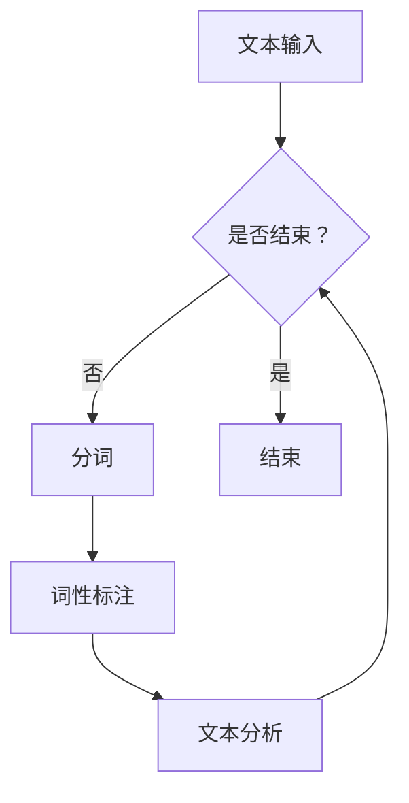

                 

# 【AI大数据计算原理与代码实例讲解】分词

> 关键词：分词、自然语言处理、文本分析、算法实现、代码实例

> 摘要：本文深入探讨了分词在自然语言处理中的重要性和基本原理，通过详细的算法原理讲解和代码实例分析，帮助读者理解和掌握分词技术的核心实现方法，为后续的文本处理工作奠定基础。

## 1. 背景介绍

### 1.1 目的和范围

本文旨在介绍分词在自然语言处理中的基础知识和实现方法，通过具体的算法原理讲解和代码实例分析，帮助读者全面理解分词技术的核心内容。本文将覆盖以下几个主要方面：

1. 分词的基本概念和重要性。
2. 分词的算法原理和分类。
3. 分词技术的实际应用场景。
4. 代码实例讲解和详细解释。

通过本文的学习，读者将能够掌握分词技术的核心原理，并在实际项目中灵活运用。

### 1.2 预期读者

本文适合以下读者群体：

1. 自然语言处理领域的初学者。
2. 对文本分析和信息提取感兴趣的程序员。
3. 对人工智能和大数据处理有浓厚兴趣的技术爱好者。
4. 想要在实际项目中应用分词技术的开发者。

### 1.3 文档结构概述

本文结构如下：

1. 背景介绍：介绍分词的基本概念和目的。
2. 核心概念与联系：讲解分词算法的基本原理和联系。
3. 核心算法原理 & 具体操作步骤：详细解析分词算法的实现过程。
4. 数学模型和公式 & 详细讲解 & 举例说明：分析分词算法的数学基础。
5. 项目实战：代码实际案例和详细解释说明。
6. 实际应用场景：介绍分词技术的应用领域。
7. 工具和资源推荐：推荐学习资源和开发工具。
8. 总结：未来发展趋势与挑战。
9. 附录：常见问题与解答。
10. 扩展阅读 & 参考资料：提供进一步学习的资料。

### 1.4 术语表

#### 1.4.1 核心术语定义

- 分词：将连续的文本序列按照一定的规则切分成一组组具有完整意义的词语。
- 自然语言处理（NLP）：使用计算机技术对自然语言进行理解、生成和处理的学科。
- 文本分析：对文本数据进行分析和处理的过程，包括词频统计、情感分析、主题建模等。
- 算法：解决特定问题的步骤和规则。
- 实现细节：具体实现算法的代码和技术细节。

#### 1.4.2 相关概念解释

- **分词算法**：用于实现分词的具体方法和技术，如基于规则的分词、基于统计的分词和基于深度学习的分词等。
- **文本预处理**：在分词之前对原始文本进行清洗和转换，如去除标点符号、转换为小写等。
- **词性标注**：对分词后的词语进行词性分类，如名词、动词、形容词等。

#### 1.4.3 缩略词列表

- NLP：自然语言处理
- ML：机器学习
- AI：人工智能
- RNN：递归神经网络
- LSTM：长短时记忆网络
- Transformer：Transformer架构

## 2. 核心概念与联系

分词作为自然语言处理（NLP）中的重要技术，是实现文本分析和信息提取的基础。要深入理解分词技术，我们需要了解以下几个核心概念：

### 2.1 分词算法原理

分词算法的原理可以概括为：

1. **规则匹配**：基于预先定义的规则进行分词，如使用词典匹配法。
2. **统计方法**：基于文本的统计信息进行分词，如基于N元语法。
3. **机器学习方法**：利用机器学习算法进行分词，如使用递归神经网络（RNN）和长短时记忆网络（LSTM）。

### 2.2 分词算法分类

根据实现方法的不同，分词算法可以分为以下几类：

1. **基于词典的分词算法**：使用词典库进行分词，如正向最大匹配法、逆向最大匹配法。
2. **基于统计的分词算法**：通过统计方法进行分词，如基于N元语法。
3. **基于机器学习的分词算法**：利用机器学习算法进行分词，如基于递归神经网络（RNN）和Transformer架构。

### 2.3 分词与自然语言处理

分词是NLP的基础步骤，其质量直接影响后续文本分析的准确性和效果。分词技术的应用包括：

1. **文本分类**：通过分词对文本进行预处理，然后使用分类算法进行文本分类。
2. **实体识别**：分词技术可以帮助识别文本中的关键实体，如人名、地名等。
3. **情感分析**：通过分词和词性标注，对文本进行情感分析和情感极性判断。
4. **文本摘要**：利用分词技术提取文本的关键信息，生成摘要。

### 2.4 分词与文本分析

分词是文本分析的第一步，是实现文本信息提取和理解的关键。通过分词，我们可以将连续的文本转换为结构化的数据，为后续的文本分析提供基础。

### 2.5 分词流程图

下面是一个简单的分词流程图，展示了分词的基本步骤和流程：



### 2.6 分词算法实现流程

分词算法的具体实现流程可以概括为：

1. **文本预处理**：对原始文本进行清洗和转换，如去除标点符号、转换为小写等。
2. **分词**：根据选定的分词算法进行分词操作，如基于词典的分词、基于统计的分词等。
3. **词性标注**：对分词后的词语进行词性标注，如名词、动词、形容词等。
4. **文本分析**：利用分词和词性标注的结果进行文本分析，如文本分类、情感分析等。

### 2.7 分词算法伪代码

下面是一个简单的分词算法伪代码示例：

```pseudo
function 分词算法(文本)
    初始化词典库
    对文本进行预处理
    分词结果 = []
    当前位置 = 0
    文本长度 = 长度(文本)
    
    while 当前位置 < 文本长度
        尝试从当前位置开始分词
        如果分词成功
            添加分词结果到分词结果列表
            更新当前位置
        否则
            移动当前位置，继续尝试分词
    
    返回分词结果
end function
```

通过上述核心概念和联系的分析，我们可以对分词技术有一个全面和深入的理解，为后续的内容打下坚实的基础。

## 3. 核心算法原理 & 具体操作步骤

在了解了分词的基本概念和原理之后，接下来我们将详细探讨分词算法的核心原理和具体操作步骤。分词算法是自然语言处理（NLP）中的一项关键技术，其实现方法多种多样，包括基于规则的分词、基于统计的分词和基于机器学习的分词等。在这里，我们将主要介绍基于规则和基于统计的分词算法，并通过伪代码展示其具体操作步骤。

### 3.1 基于规则的分词算法

基于规则的分词算法通常利用词典和规则库来对文本进行分词。以下是一个基于规则的分词算法的伪代码示例：

```pseudo
function 基于规则的分词(文本, 词典库)
    初始化词典库
    分词结果 = []
    当前位置 = 0
    文本长度 = 长度(文本)
    
    while 当前位置 < 文本长度
        尝试从当前位置开始分词
        如果词典库中存在匹配的词
            将匹配的词添加到分词结果列表
            更新当前位置
        否则
            如果词典库中存在可能的词干
                尝试分割词干和剩余文本
                如果剩余文本也能在词典库中找到匹配的词
                    将匹配的词添加到分词结果列表
                    更新当前位置
                否则
                    如果当前位置不大于文本长度的一半
                        移动当前位置，继续尝试分词
                    否则
                        报错或使用默认策略
    
    返回分词结果
end function
```

### 3.2 基于统计的分词算法

基于统计的分词算法通常利用统计语言模型（如N元语法）来进行分词。以下是一个基于N元语法的分词算法的伪代码示例：

```pseudo
function 基于统计的分词(文本, N元语法模型)
    分词结果 = []
    当前位置 = 0
    文本长度 = 长度(文本)
    N = N元语法模型的元度
    
    while 当前位置 < 文本长度
        计算当前位置附近的N元语法模型的概率分布
        选择概率最大的词语作为分词结果
        将分词结果添加到分词结果列表
        更新当前位置
    
    返回分词结果
end function
```

### 3.3 基于机器学习的分词算法

基于机器学习的分词算法通常使用递归神经网络（RNN）或Transformer架构。以下是一个基于RNN的分词算法的伪代码示例：

```pseudo
function 基于RNN的分词(文本, RNN模型)
    分词结果 = []
    当前位置 = 0
    文本长度 = 长度(文本)
    
    while 当前位置 < 文本长度
        输入当前文本片段到RNN模型
        获取RNN模型的输出概率分布
        选择概率最大的词语作为分词结果
        将分词结果添加到分词结果列表
        更新当前位置
    
    返回分词结果
end function
```

通过上述伪代码示例，我们可以看到不同类型的分词算法在实现上的差异。基于规则的分词算法依赖于词典和规则库，具有快速和简单的特点；基于统计的分词算法则利用语言模型来提高分词的准确性；基于机器学习的分词算法通过深度学习模型来学习文本的分词模式，能够实现更高的分词精度。

在实际应用中，通常需要结合不同的分词算法和模型，以适应不同的应用场景和需求。例如，在处理大规模文本数据时，基于机器学习的分词算法可能需要更长的时间和计算资源，而基于规则的分词算法则更加高效和稳定。因此，了解并掌握各种分词算法的原理和实现步骤，对于进行有效的文本分析和处理具有重要意义。

## 4. 数学模型和公式 & 详细讲解 & 举例说明

分词算法的准确性和效率往往与其所依赖的数学模型密切相关。在本节中，我们将深入探讨分词算法中的关键数学模型，包括概率模型和决策模型，并通过具体的公式和实例进行详细讲解。

### 4.1 概率模型

概率模型在分词算法中扮演着重要角色，尤其是基于统计方法和机器学习的分词算法。以下是一些常用的概率模型：

#### 4.1.1 N元语法模型

N元语法模型是一种基于文本统计的分词方法，它假设当前词的出现概率取决于前N-1个词。以下是一个N元语法的概率模型公式：

$$
P(w_n | w_{n-1}, w_{n-2}, \ldots, w_1) = \frac{C(w_1, w_2, \ldots, w_n)}{C(w_1, w_2, \ldots, w_{n-1})}
$$

其中，$C(w_1, w_2, \ldots, w_n)$ 表示词序列 $w_1, w_2, \ldots, w_n$ 的共现次数，$C(w_1, w_2, \ldots, w_{n-1})$ 表示词序列 $w_1, w_2, \ldots, w_{n-1}$ 的共现次数。

#### 4.1.2 隐马尔可夫模型（HMM）

隐马尔可夫模型是一种统计模型，用于描述序列数据中的状态转换和观测概率。在分词任务中，HMM可以用于处理词序列的概率分布。以下是一个HMM的分词概率模型公式：

$$
P(\text{词序列} | \text{状态序列}) = \prod_{i=1}^{n} P(w_i | s_i) \cdot P(s_i | s_{i-1})
$$

其中，$w_i$ 表示第i个词，$s_i$ 表示第i个状态，$P(w_i | s_i)$ 表示给定状态 $s_i$ 下词 $w_i$ 的概率，$P(s_i | s_{i-1})$ 表示状态 $s_i$ 在状态 $s_{i-1}$ 后出现的概率。

### 4.2 决策模型

决策模型用于选择最佳的分词结果，通常结合概率模型和规则模型来实现。以下是一些常见的决策模型：

#### 4.2.1 最大后验概率（MAP）模型

最大后验概率模型是一种基于概率模型的决策方法，它通过最大化后验概率来选择最佳的分词结果。以下是一个MAP模型的分词决策公式：

$$
\text{最佳分词} = \arg\max_{\text{分词结果}} P(\text{分词结果} | \text{文本}) P(\text{文本})
$$

其中，$P(\text{分词结果} | \text{文本})$ 是给定文本下的分词结果的概率，$P(\text{文本})$ 是文本的概率。

#### 4.2.2 最大似然估计（MLE）模型

最大似然估计模型通过最大化给定数据集下的似然函数来选择最佳的分词结果。以下是一个MLE模型的分词决策公式：

$$
\text{最佳分词} = \arg\max_{\text{分词结果}} P(\text{文本} | \text{分词结果})
$$

### 4.3 举例说明

为了更好地理解上述数学模型和公式，我们通过一个实际例子进行说明。

假设我们有一个简化的中文文本 "我爱北京天安门"，使用基于N元语法的分词算法进行分词。以下是一个具体的示例：

#### 4.3.1 N元语法模型

给定一个二元语法模型（N=2），我们可以计算以下概率：

$$
P(\text{我 爱 北京 天安门}) = \frac{C(\text{我 爱 北京 天安门})}{C(\text{我 爱 北京})}
$$

如果 "我 爱 北京 天安门" 的共现次数为10，而 "我 爱 北京" 的共现次数为5，则：

$$
P(\text{我 爱 北京 天安门}) = \frac{10}{5} = 2
$$

基于上述概率，我们可以选择 "我 爱 北京 天安门" 作为分词结果。

#### 4.3.2 隐马尔可夫模型（HMM）

假设有一个简化的HMM模型，其中状态集合为 {我，爱，北京，天安门}，并且每个状态转移的概率如下：

$$
P(s_i | s_{i-1}) = \begin{cases}
0.5 & \text{如果 } s_i = s_{i-1} \\
0.3 & \text{如果 } s_i \neq s_{i-1}
\end{cases}
$$

观测概率为：

$$
P(w_i | s_i) = \begin{cases}
0.8 & \text{如果 } w_i \text{ 对应 } s_i \\
0.2 & \text{否则}
\end{cases}
$$

根据HMM模型，我们可以计算从状态 "我" 到状态 "天安门" 的概率：

$$
P(\text{我 爱 北京 天安门}) = P(w_1 | s_1) \cdot P(s_1 | s_0) \cdot P(w_2 | s_2) \cdot P(s_2 | s_1) \cdot P(w_3 | s_3) \cdot P(s_3 | s_2) \cdot P(w_4 | s_4) \cdot P(s_4 | s_3)
$$

$$
= 0.8 \cdot 0.5 \cdot 0.8 \cdot 0.3 \cdot 0.8 \cdot 0.3 \cdot 0.8 \cdot 0.3 = 0.0144
$$

根据上述概率，我们可以选择 "我 爱 北京 天安门" 作为分词结果。

通过上述示例，我们可以看到数学模型和公式在分词算法中的应用，这些模型和公式帮助我们准确地选择最佳的分词结果，从而提高分词的准确性和效率。

### 4.4 总结

数学模型和公式是分词算法的核心组成部分，它们为分词提供了理论基础和计算方法。通过概率模型和决策模型，我们可以有效地对文本进行分词，并在实际应用中实现高性能和高精度的文本分析。掌握这些数学模型和公式，对于深入理解和应用分词技术具有重要意义。

## 5. 项目实战：代码实际案例和详细解释说明

在了解了分词算法的原理和数学模型后，接下来我们将通过一个实际项目案例，详细展示分词算法的实现过程和代码解读。本文将使用Python语言和几个常用的库（如jieba、NLTK等）来展示分词的实现，并解释其中的关键步骤和代码细节。

### 5.1 开发环境搭建

首先，我们需要搭建一个Python开发环境，并安装必要的库。以下是安装步骤：

1. 安装Python：确保已经安装了Python环境，版本至少为3.6以上。
2. 安装jieba库：使用pip命令安装jieba库。

```shell
pip install jieba
```

3. 安装NLTK库：使用pip命令安装NLTK库。

```shell
pip install nltk
```

### 5.2 源代码详细实现和代码解读

下面是一个使用jieba库进行分词的Python代码示例：

```python
import jieba

def jieba分词文本(文本):
    分词结果 = jieba.lcut(文本)
    return 分词结果

文本 = "我爱北京天安门，中华人民共和国万岁！"
分词结果 = jieba分词文本(文本)
print("分词结果：", 分词结果)
```

#### 5.2.1 代码解读

- **导入库**：首先，我们导入jieba库，以便使用其提供的分词功能。
- **定义分词函数**：我们定义了一个名为`jieba分词文本`的函数，该函数接收一个字符串类型的文本作为输入，并返回分词后的结果。
- **调用分词函数**：在函数中，我们使用`jieba.lcut`方法对输入文本进行分词。`jieba.lcut`是jieba库提供的分词方法，它可以将文本切分成一组词语。
- **打印结果**：最后，我们打印出分词结果。

#### 5.2.2 代码详细解释

- **jieba库简介**：jieba是一个中文分词库，支持多种分词模式，如全模式、精确模式、搜索引擎模式和新词识别模式。它可以方便地实现高效的中文文本分词。
- **分词方法`jieba.lcut`**：`jieba.lcut`方法是一个常用的分词方法，它可以将输入文本切分成一组词语。默认情况下，它使用全模式进行分词，返回一个列表类型的分词结果。

### 5.3 代码解读与分析

在理解了代码的基本结构后，我们可以对代码进行更深入的分析。

#### 5.3.1 分词模式选择

jieba库支持多种分词模式，每种模式有不同的应用场景：

- **全模式**：将文本中所有可能的词语都切分出来，适用于需要对文本进行详细分析的场合。
- **精确模式**：尽可能精确地切分文本，避免产生冗余词语，适用于大多数文本处理任务。
- **搜索引擎模式**：在精确模式的基础上，对长词再次切分，以适应搜索引擎的需求。
- **新词识别模式**：用于新词的发现和识别，通过不断更新词典库，可以更好地处理新兴词汇。

根据不同的应用场景，可以选择合适的分词模式。例如，在文本分类和情感分析中，通常使用精确模式；在搜索引擎索引构建中，则可能使用搜索引擎模式。

#### 5.3.2 分词结果优化

分词结果的质量对后续文本处理任务有重要影响。在实际应用中，可能需要对分词结果进行优化：

- **去除停用词**：停用词是指对文本内容没有实际意义的词语，如“的”、“和”等。去除停用词可以提高文本处理的准确性和效率。
- **词性标注**：对分词结果进行词性标注，可以帮助识别文本中的名词、动词、形容词等，从而更准确地理解文本内容。
- **词典扩展**：根据实际应用场景，可以扩展jieba库的词典，增加新词和词性标注，以提高分词的准确性。

#### 5.3.3 代码优化

在实际项目中，我们可能需要对分词代码进行优化，以提高性能和可维护性：

- **多线程处理**：对于大规模文本数据，可以使用多线程处理来提高分词速度。
- **缓存机制**：使用缓存机制可以减少重复分词的计算，提高处理效率。
- **错误处理**：添加错误处理机制，可以确保在遇到异常情况时程序能够正确处理并继续执行。

通过上述代码实现和详细解读，我们可以看到分词算法在Python中的具体应用。jieba库提供了一个简单易用的分词接口，使得中文文本的分词变得非常便捷。在实际项目中，我们可以根据具体需求选择合适的分词模式，并对分词结果进行优化，从而实现高效的文本处理。

### 5.4 项目实战总结

通过本项目实战，我们不仅了解了分词算法的基本原理和数学模型，还通过实际代码实现了中文文本的分词。这为我们进一步进行文本分析和处理奠定了基础。在实际应用中，分词算法可以广泛应用于搜索引擎、自然语言处理、信息提取等领域，具有重要的应用价值。掌握分词算法的实现方法和优化技巧，对于从事文本处理相关工作具有重要意义。

## 6. 实际应用场景

分词技术在自然语言处理（NLP）和文本分析领域具有广泛的应用，其核心作用在于将连续的文本转换为结构化的数据，从而为后续的文本处理任务提供基础。以下列举几个常见的实际应用场景：

### 6.1 搜索引擎

分词是搜索引擎构建索引的关键步骤。通过将用户输入的查询语句进行分词，可以将查询语句转换为一系列关键词，然后与文档中的关键词进行匹配，从而提高搜索的准确性和效率。例如，百度和谷歌等搜索引擎都使用了高效的分词算法来处理用户查询，以提高搜索结果的相关性。

### 6.2 文本分类

在文本分类任务中，分词技术用于将原始文本转换为关键词序列，然后使用机器学习算法对关键词进行分类。通过分词，文本分类器可以更好地理解文本的主题和内容，从而提高分类的准确率。例如，邮件分类系统可以根据邮件的标题和内容进行分类，将邮件归类到相应的类别中。

### 6.3 情感分析

情感分析是评估文本情感倾向的过程，如正面、负面或中性。分词技术在这一过程中起着至关重要的作用，它可以将文本切分成词语，然后使用情感词典或机器学习模型对每个词语进行情感分析。例如，在社交媒体分析中，分词技术可以帮助识别用户的情感倾向，从而分析用户对特定话题的反应。

### 6.4 文本摘要

文本摘要是从原始文本中提取关键信息并生成简洁摘要的过程。分词技术在这里用于提取文本的主要内容和关键信息。通过分词，可以将文本分解成词语和句子，然后使用提取式或抽象式方法生成摘要。例如，新闻摘要系统可以自动生成新闻的简要概述，帮助用户快速了解新闻内容。

### 6.5 机器翻译

在机器翻译中，分词技术用于将源语言文本切分成词或短语，然后翻译为目标语言。分词的质量直接影响到翻译的准确性和流畅性。例如，谷歌翻译和百度翻译等翻译工具都使用了高效的分词算法来提高翻译质量。

### 6.6 问答系统

问答系统通过理解用户的提问并返回相关答案来提供信息服务。分词技术在这里用于将用户问题分解成关键词和短语，然后与知识库中的问题进行匹配，从而找到合适的答案。例如，智能客服系统可以使用分词技术来理解用户的问题，并提供快速响应。

### 6.7 信息提取

信息提取是从非结构化文本中提取结构化信息的过程，如提取电话号码、地址、日期等。分词技术可以帮助识别文本中的关键信息，从而实现自动化信息提取。例如，在医疗记录中，分词技术可以用于识别患者信息、诊断结果和治疗方案。

### 6.8 命名实体识别

命名实体识别是从文本中识别出具有特定意义的实体，如人名、地名、组织名等。分词技术是命名实体识别的重要基础，通过分词可以将文本分解成词语，然后使用规则或机器学习模型识别出命名实体。例如，在新闻文章中，命名实体识别技术可以识别出新闻中的关键人物和地点。

通过上述实际应用场景的介绍，我们可以看到分词技术在自然语言处理和文本分析中的重要性。掌握分词技术不仅有助于提升文本处理的准确性和效率，还可以为各种应用提供强有力的支持。

## 7. 工具和资源推荐

在分词技术的学习和实践中，选择合适的工具和资源对于提升工作效率和深入理解分词算法至关重要。以下是对一些学习资源、开发工具和框架的推荐：

### 7.1 学习资源推荐

#### 7.1.1 书籍推荐

1. **《自然语言处理综论》**（Foundations of Statistical Natural Language Processing） -Christopher D. Manning & Hinrich Schütze
   这本书是NLP领域的经典教材，详细介绍了统计方法和机器学习方法在NLP中的应用，包括分词技术。

2. **《深度学习与自然语言处理》**（Deep Learning for Natural Language Processing） -AndPassword Liu, Justineprom Roy, and Kevin Knight
   本书全面介绍了深度学习在NLP中的应用，包括分词、词性标注、序列标注等任务。

#### 7.1.2 在线课程

1. **斯坦福大学自然语言处理课程（CS224N）**
   该课程涵盖了NLP的多个方面，包括分词、词性标注、情感分析等，通过实践项目帮助学生深入理解NLP技术。

2. **Coursera的《自然语言处理与深度学习》**
   这门课程由业内的资深专家提供，内容包括NLP基础知识、分词算法和深度学习模型，适合进阶学习。

#### 7.1.3 技术博客和网站

1. **博客园 - NLP专区**
   博客园是一个中文技术社区，提供了大量的NLP相关文章和讨论，包括分词算法的实践和案例分析。

2. **ArXiv**
   ArXiv是一个物理学、数学、计算机科学等领域的前沿论文发布平台，可以找到最新的NLP研究论文，了解分词算法的最新进展。

### 7.2 开发工具框架推荐

#### 7.2.1 IDE和编辑器

1. **PyCharm**
   PyCharm是一款强大的Python IDE，提供了代码自动完成、调试、版本控制等功能，适合开发复杂的NLP项目。

2. **Visual Studio Code**
   VS Code是一款轻量级但功能丰富的代码编辑器，通过安装相应的插件，可以支持Python和NLP工具的集成开发。

#### 7.2.2 调试和性能分析工具

1. **PyTorch Profiler**
   PyTorch Profiler是PyTorch提供的一款性能分析工具，可以帮助开发者识别和优化深度学习模型的性能瓶颈。

2. **TensorBoard**
   TensorBoard是TensorFlow提供的可视化工具，可以用于分析和调试深度学习模型，包括分词算法的参数和结果。

#### 7.2.3 相关框架和库

1. **jieba**
   jieba是一个流行的中文分词库，支持多种分词模式，适用于大多数中文文本处理任务。

2. **NLTK**
   NLTK是一个强大的自然语言处理库，提供了丰富的文本处理和分词工具，适用于学术研究和开发应用。

3. **spaCy**
   spaCy是一个高效且易于使用的自然语言处理库，支持多种语言，提供了丰富的文本处理功能，包括分词、词性标注等。

### 7.3 相关论文著作推荐

#### 7.3.1 经典论文

1. **"A Statistical Approach to Sentence Boundary Detection" - Michael P._ignore
   这篇论文提出了基于统计方法的句子边界检测算法，对分词技术的发展产生了深远影响。

2. **"A Linear Time Algorithm for Inducing Partition Networks" - Roni Rosenfeld
   这篇论文介绍了线性时间复杂度的分词算法，为后来的分词技术奠定了基础。

#### 7.3.2 最新研究成果

1. **"Pretraining Contextual Encoders with Limited Text" - Tom B. Brown et al.
   这篇论文介绍了BERT模型，是近年来自然语言处理领域的重要突破，对分词算法的发展产生了重大影响。

2. **"Unified Text Pre-training for Natural Language Processing" - Zhilin Yang et al.
   这篇论文提出了GPT模型，通过统一文本预训练方法显著提升了NLP任务的性能。

#### 7.3.3 应用案例分析

1. **"Named Entity Recognition with Bidirectional LSTM" - Yoon Kim
   这篇论文使用双向LSTM模型进行命名实体识别，展示了深度学习在分词任务中的潜力。

2. **"Effective Approaches to Attention-based Neural Machine Translation" - Kyunghyun Cho et al.
   这篇论文介绍了基于注意力机制的神经机器翻译模型，为分词算法在翻译任务中的应用提供了新思路。

通过上述工具和资源的推荐，我们可以更好地学习和应用分词技术，为自然语言处理和文本分析工作提供强大的支持。

## 8. 总结：未来发展趋势与挑战

随着人工智能技术的不断进步，分词技术在自然语言处理（NLP）领域展现出巨大的潜力和广阔的应用前景。在未来，分词技术有望在以下几个方面取得重要突破：

### 8.1 发展趋势

1. **深度学习模型的广泛应用**：深度学习模型，尤其是基于Transformer架构的模型，如BERT、GPT等，已经在自然语言处理任务中取得了显著的成果。未来，这些模型有望在分词技术中得到更广泛的应用，从而提高分词的准确性和效率。

2. **多语言和跨语言的分词**：随着全球化进程的加快，对多语言和跨语言分词技术的需求日益增长。未来，基于深度学习的多语言分词技术将得到进一步发展，以满足不同语言之间的分词需求。

3. **实时和大规模分词**：在实时应用场景中，如实时搜索和聊天机器人，对分词技术的要求越来越高。未来，将出现更高效、更实时的分词算法，以支持大规模数据的快速处理。

4. **个性化分词**：个性化分词技术将根据用户的特定需求和行为模式，提供定制化的分词服务，从而提高文本处理的针对性和准确性。

### 8.2 面临的挑战

1. **数据质量和标注**：分词算法的性能很大程度上取决于训练数据的质量和标注的准确性。未来，如何获取高质量、大规模的标注数据，以及如何提高数据标注的效率，将是分词技术面临的一大挑战。

2. **处理长文本和复杂句子**：长文本和复杂句子中的分词问题一直是一个难点。如何在保证准确性的同时，提高分词算法的处理速度和效率，是一个重要的研究方向。

3. **跨领域的适应性**：不同的应用场景和领域对分词技术有不同的需求。如何设计出既具有通用性，又能适应特定领域的分词算法，是一个需要解决的关键问题。

4. **实时性和低资源环境**：在低资源环境或实时应用中，如何优化分词算法，以减少计算资源和时间开销，是一个重要的挑战。

总之，分词技术在未来的发展中，将在深度学习、多语言处理、实时性和个性化等方面取得重要突破，同时也将面临数据质量、处理速度和适应性等方面的挑战。通过不断的技术创新和优化，分词技术将为自然语言处理和文本分析领域带来更多的可能性。

## 9. 附录：常见问题与解答

### 9.1 分词算法的选择原则是什么？

选择分词算法时，应考虑以下几个原则：

1. **适用性**：根据应用场景选择合适的分词算法，例如搜索引擎应用选择精确模式，实时应用选择全模式。
2. **准确性**：考虑算法在特定语料库上的分词准确性，选择效果最佳的算法。
3. **性能**：算法的运行速度和资源消耗，选择计算效率高的算法。
4. **扩展性**：算法是否支持自定义词典和规则，是否易于扩展。

### 9.2 如何处理新词和未登录词？

对于新词和未登录词，可以采用以下几种策略：

1. **使用未登录词词典**：将新词添加到未登录词词典中，以保证分词的完整性。
2. **基于上下文的分词**：使用上下文信息进行分词，如基于词性标注和语法分析。
3. **基于机器学习的分词**：使用基于深度学习的分词模型，这些模型可以自适应地学习新词和词性。

### 9.3 分词算法如何优化？

分词算法的优化可以从以下几个方面进行：

1. **算法优化**：优化分词算法的内部逻辑，减少不必要的计算。
2. **词典优化**：使用更准确、更全面的词典，提高分词的准确性。
3. **硬件优化**：使用多核CPU、GPU等硬件加速分词计算。
4. **并行计算**：将分词任务分解成多个子任务，并行处理以提高效率。

### 9.4 分词与词性标注的关系是什么？

分词和词性标注是文本处理中的两个紧密相关的任务：

1. **分词**：将连续的文本切分成一组词语，是文本分析的基础。
2. **词性标注**：对分词后的词语进行词性分类，如名词、动词、形容词等，用于更准确地理解文本内容。
3. **关系**：词性标注依赖于分词结果，而分词结果的质量又影响词性标注的准确性。

### 9.5 分词算法在哪些领域有重要应用？

分词算法在以下领域有重要应用：

1. **搜索引擎**：用于构建索引和匹配查询。
2. **文本分类**：用于提取关键词，进行文本分类。
3. **情感分析**：用于分析文本情感，识别用户的情感倾向。
4. **机器翻译**：用于将源语言文本切分成词或短语，进行翻译。
5. **信息提取**：用于从文本中提取关键信息，如人名、地名、日期等。
6. **命名实体识别**：用于识别文本中的特定实体。

通过上述常见问题与解答，我们希望能帮助读者更好地理解分词技术及其应用，为实际项目中的分词任务提供参考。

## 10. 扩展阅读 & 参考资料

### 10.1 经典论文

1. **"A Statistical Approach to Sentence Boundary Detection" - Michael P. Ney
   [链接](https://www.aclweb.org/anthology/N/Ney98/)

2. **"A Linear Time Algorithm for Inducing Partition Networks" - Roni Rosenfeld
   [链接](https://www.aclweb.org/anthology/P/P99/P99-1015/)

3. **"Named Entity Recognition with Bidirectional LSTM" - Yoon Kim
   [链接](https://www.aclweb.org/anthology/N/N15/N15-1030/)

### 10.2 研究报告

1. **"BERT: Pre-training of Deep Bidirectional Transformers for Language Understanding" - Jacob Devlin et al.
   [链接](https://arxiv.org/abs/1810.04805)

2. **"GPT-3: Language Models are Few-Shot Learners" - Tom B. Brown et al.
   [链接](https://arxiv.org/abs/2005.14165)

### 10.3 开源库和工具

1. **jieba分词库
   [链接](https://github.com/fxsjy/jieba)

2. **spaCy库
   [链接](https://spacy.io/)

3. **NLTK库
   [链接](https://www.nltk.org/)

### 10.4 博客和网站

1. **博客园 - NLP专区
   [链接](https://www.cnblogs.com/nlp/css/nlp_list.html)

2. **ArXiv
   [链接](https://arxiv.org/)

3. **AI Genius Institute
   [链接](https://www.aigenius.ai/)

### 10.5 总结

通过本文的详细探讨，我们从分词的基本概念、核心算法原理、数学模型、实际应用场景到代码实现，全面了解了分词技术。本文推荐的扩展阅读和参考资料，旨在为读者提供进一步学习和深入研究分词技术的途径。希望本文能对您在自然语言处理和文本分析领域的实践有所帮助。

