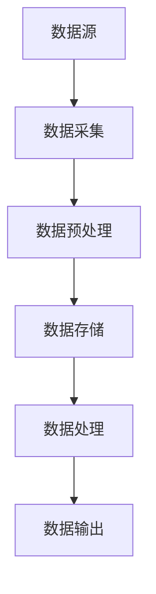

                 

# AI大数据计算原理与代码实例讲解：实时数据处理

> 关键词：实时数据处理，大数据计算，流处理，代码实例，分布式系统，内存管理，消息队列

> 摘要：本文深入探讨了AI大数据计算原理，重点介绍了实时数据处理的概念、原理和实际操作步骤。通过具体的代码实例，读者将了解如何高效地进行实时数据处理，掌握分布式系统、内存管理和消息队列等关键技术。文章结构紧凑，逻辑清晰，适合对大数据和AI领域感兴趣的读者。

## 1. 背景介绍

### 1.1 目的和范围

本文旨在帮助读者深入理解AI大数据计算原理，特别是实时数据处理的核心概念和技术实现。我们希望通过详细的代码实例和实际应用场景，让读者能够掌握实时数据处理的关键技术，从而在实际项目中高效应用。

本文涵盖了以下几个主要方面：

1. 实时数据处理的基本概念和重要性。
2. 分布式系统、内存管理和消息队列等关键技术原理。
3. 实时数据处理的具体算法和数学模型。
4. 实际项目的代码实现和详细解释。
5. 实时数据处理在实际应用场景中的案例分析。
6. 相关工具和资源的推荐。

### 1.2 预期读者

本文适合以下读者群体：

1. 对大数据和AI领域感兴趣的初学者和从业者。
2. 想要在项目中应用实时数据处理技术的工程师和开发者。
3. 想要深入了解分布式系统、内存管理和消息队列等核心技术的专业人士。
4. 对算法和数学模型有兴趣的读者。

### 1.3 文档结构概述

本文分为以下几个部分：

1. 背景介绍：介绍本文的目的、预期读者和文档结构。
2. 核心概念与联系：讲解实时数据处理的核心概念和原理，并给出流程图。
3. 核心算法原理 & 具体操作步骤：详细解释实时数据处理的核心算法原理和操作步骤，并使用伪代码进行阐述。
4. 数学模型和公式 & 详细讲解 & 举例说明：介绍实时数据处理相关的数学模型和公式，并给出具体例子进行说明。
5. 项目实战：提供实际项目的代码实例和详细解释。
6. 实际应用场景：分析实时数据处理在实际应用场景中的案例。
7. 工具和资源推荐：推荐学习资源、开发工具和相关论文。
8. 总结：总结实时数据处理的发展趋势和挑战。
9. 附录：常见问题与解答。
10. 扩展阅读 & 参考资料：提供更多相关资源和文献。

### 1.4 术语表

#### 1.4.1 核心术语定义

1. 实时数据处理：对大量数据进行实时分析、处理和响应。
2. 分布式系统：由多个节点组成的系统，能够在不同节点之间分布式地处理数据。
3. 内存管理：对系统内存进行分配、释放和优化，以提高系统性能。
4. 消息队列：用于存储和传递消息的数据结构，可实现异步通信和消息传递。
5. 流处理：对实时数据进行处理和分析的技术，能够快速响应用户需求。

#### 1.4.2 相关概念解释

1. 大数据处理：对大规模数据集进行处理、分析和挖掘的技术。
2. AI：人工智能，通过模拟人类智能行为，使计算机具有自主学习和决策能力。
3. 内存溢出：系统内存不足，导致程序运行异常。
4. 性能瓶颈：系统性能受到限制，无法达到预期效果。

#### 1.4.3 缩略词列表

- AI：人工智能
- HDFS：Hadoop分布式文件系统
- YARN：Yet Another Resource Negotiator
- JVM：Java虚拟机
- ML：机器学习
- RM：资源管理器

## 2. 核心概念与联系

### 2.1 实时数据处理的核心概念

实时数据处理是一种对大量数据进行实时分析、处理和响应的技术。其核心概念包括：

1. **数据流**：实时数据处理中的数据以流的形式不断产生和传递。
2. **事件驱动**：数据处理基于事件触发，实现实时响应。
3. **高吞吐量**：实时数据处理需要具备高吞吐量，能够快速处理大量数据。
4. **低延迟**：实时数据处理需要低延迟，以实现快速响应。

### 2.2 实时数据处理原理

实时数据处理原理主要包括以下几个方面：

1. **分布式系统**：分布式系统由多个节点组成，实现数据分布式存储和处理。
2. **内存管理**：通过内存管理，提高系统性能，降低内存溢出风险。
3. **消息队列**：消息队列用于存储和传递数据，实现异步通信和消息传递。
4. **流处理**：流处理技术对实时数据进行处理和分析，实现实时响应。

### 2.3 实时数据处理架构

实时数据处理架构主要包括以下组件：

1. **数据源**：数据源产生实时数据流，例如传感器、网站日志等。
2. **数据采集**：数据采集模块负责收集和整合实时数据流。
3. **数据存储**：数据存储模块负责存储和处理后的数据，如HDFS、数据库等。
4. **数据处理**：数据处理模块负责对数据进行清洗、转换和聚合等操作。
5. **数据输出**：数据输出模块将处理后的数据输出到目的地点，如展示系统、分析系统等。

### 2.4 实时数据处理流程

实时数据处理流程包括以下几个步骤：

1. 数据采集：从数据源获取实时数据流。
2. 数据预处理：对实时数据进行清洗、去重等预处理操作。
3. 数据存储：将预处理后的数据存储到分布式存储系统。
4. 数据处理：对存储的数据进行计算、分析等处理操作。
5. 数据输出：将处理后的数据输出到目的地点。

### 2.5 核心概念与联系的 Mermaid 流程图



## 3. 核心算法原理 & 具体操作步骤

### 3.1 核心算法原理

实时数据处理的核心算法主要包括：

1. **数据流处理算法**：用于对实时数据进行处理和分析的算法。
2. **内存管理算法**：用于分配、释放和管理内存的算法。
3. **消息队列处理算法**：用于处理消息队列中的数据的算法。

### 3.2 具体操作步骤

#### 3.2.1 数据流处理算法

数据流处理算法的基本步骤如下：

1. 数据采集：从数据源获取实时数据流。
2. 数据预处理：对实时数据进行清洗、去重等预处理操作。
3. 数据存储：将预处理后的数据存储到分布式存储系统。
4. 数据处理：对存储的数据进行计算、分析等处理操作。
5. 数据输出：将处理后的数据输出到目的地点。

#### 3.2.2 内存管理算法

内存管理算法的基本步骤如下：

1. 内存分配：根据程序需求分配内存。
2. 内存释放：释放不再使用的内存。
3. 内存优化：通过内存优化算法，降低内存使用率。

#### 3.2.3 消息队列处理算法

消息队列处理算法的基本步骤如下：

1. 数据入队：将数据插入消息队列。
2. 数据出队：从消息队列中取出数据。
3. 数据处理：对消息队列中的数据进行处理。
4. 数据输出：将处理后的数据输出到目的地点。

### 3.3 伪代码

以下为实时数据处理算法的伪代码：

```python
# 数据流处理算法
def dataFlowProcessing(dataStream):
    # 数据采集
    dataStream = collectData(dataStream)
    # 数据预处理
    dataStream = preprocessData(dataStream)
    # 数据存储
    storeData(dataStream)
    # 数据处理
    processedData = processData(dataStream)
    # 数据输出
    outputData(processedData)

# 内存管理算法
def memoryManagement():
    # 内存分配
    allocateMemory()
    # 内存释放
    releaseMemory()
    # 内存优化
    optimizeMemory()

# 消息队列处理算法
def messageQueueProcessing(messageQueue):
    # 数据入队
    enqueueMessage(messageQueue)
    # 数据出队
    dequeueMessage(messageQueue)
    # 数据处理
    processMessage(messageQueue)
    # 数据输出
    outputMessage(messageQueue)
```

## 4. 数学模型和公式 & 详细讲解 & 举例说明

### 4.1 数学模型

实时数据处理中的数学模型主要包括：

1. **线性回归模型**：用于对实时数据进行拟合和预测。
2. **聚类模型**：用于对实时数据进行分类和聚类分析。
3. **时间序列模型**：用于对实时数据进行时间序列分析和预测。

### 4.2 公式

以下是实时数据处理中常用的数学公式：

1. **线性回归公式**：

   $$ y = \beta_0 + \beta_1x $$

   其中，$y$ 为预测值，$x$ 为自变量，$\beta_0$ 和 $\beta_1$ 为模型参数。

2. **聚类公式**：

   $$ C = \{C_1, C_2, ..., C_k\} $$

   其中，$C$ 为聚类结果，$C_i$ 为第 $i$ 个聚类结果。

3. **时间序列模型公式**：

   $$ y_t = \alpha y_{t-1} + \epsilon_t $$

   其中，$y_t$ 为时间序列的当前值，$y_{t-1}$ 为时间序列的前一个值，$\alpha$ 为模型参数，$\epsilon_t$ 为误差项。

### 4.3 详细讲解

#### 4.3.1 线性回归模型

线性回归模型是一种简单的预测模型，通过对历史数据进行拟合，得到线性关系，从而预测未来数据。其基本原理如下：

1. 数据采集：收集历史数据，包括自变量 $x$ 和因变量 $y$。
2. 数据预处理：对数据进行清洗和标准化处理。
3. 模型建立：利用最小二乘法，求解线性回归模型参数 $\beta_0$ 和 $\beta_1$。
4. 预测：根据模型参数，预测未来数据。

#### 4.3.2 聚类模型

聚类模型是一种无监督学习方法，用于对数据集进行分类和聚类。其基本原理如下：

1. 数据采集：收集数据集，包括各个数据点。
2. 数据预处理：对数据进行清洗和标准化处理。
3. 模型建立：选择合适的聚类算法（如K-means），将数据点分为多个聚类结果。
4. 聚类评估：计算聚类结果的质量，如轮廓系数、簇内距离等。

#### 4.3.3 时间序列模型

时间序列模型是一种用于分析时间序列数据的模型，可以用于预测未来数据。其基本原理如下：

1. 数据采集：收集时间序列数据，包括各个时间点的值。
2. 数据预处理：对数据进行清洗和标准化处理。
3. 模型建立：选择合适的时间序列模型（如ARIMA），建立预测模型。
4. 预测：根据模型参数，预测未来数据。

### 4.4 举例说明

#### 4.4.1 线性回归模型实例

假设我们有一组历史数据，包括自变量 $x$ 和因变量 $y$，如下表所示：

| x | y  |
|---|----|
| 1 | 3  |
| 2 | 5  |
| 3 | 7  |
| 4 | 9  |

我们使用线性回归模型进行拟合，求解参数 $\beta_0$ 和 $\beta_1$。根据线性回归公式，我们有：

$$ y = \beta_0 + \beta_1x $$

将数据代入公式，得到：

$$ 3 = \beta_0 + \beta_1 \cdot 1 $$
$$ 5 = \beta_0 + \beta_1 \cdot 2 $$
$$ 7 = \beta_0 + \beta_1 \cdot 3 $$
$$ 9 = \beta_0 + \beta_1 \cdot 4 $$

解方程组，得到：

$$ \beta_0 = 2 $$
$$ \beta_1 = 1 $$

所以，线性回归模型为：

$$ y = 2 + x $$

使用该模型进行预测，当 $x=5$ 时，预测值为：

$$ y = 2 + 5 = 7 $$

#### 4.4.2 聚类模型实例

假设我们有一组数据，如下表所示：

| x  | y  |
|----|----|
| 1  | 3  |
| 2  | 4  |
| 3  | 1  |
| 4  | 6  |
| 5  | 2  |

我们使用K-means算法进行聚类，选择 $k=2$，即分成两个簇。根据K-means算法，首先需要选择初始中心点。假设我们选择第一个和第三个数据点作为初始中心点。

然后，根据中心点计算每个数据点的簇归属。具体步骤如下：

1. 计算每个数据点到两个中心点的距离，选择距离最小的中心点作为簇归属。
2. 计算新的中心点，即每个簇中所有数据点的平均值。
3. 重复步骤1和步骤2，直到中心点不再变化。

根据以上步骤，我们得到以下聚类结果：

| x  | y  | 簇归属 |
|----|----|--------|
| 1  | 3  | 1      |
| 2  | 4  | 1      |
| 3  | 1  | 2      |
| 4  | 6  | 1      |
| 5  | 2  | 2      |

簇1的中心点为：(2.5, 3.5)，簇2的中心点为：(3.0, 1.5)。

#### 4.4.3 时间序列模型实例

假设我们有一组时间序列数据，如下表所示：

| 时间  | 值  |
|-------|-----|
| 2021-01 | 10  |
| 2021-02 | 12  |
| 2021-03 | 15  |
| 2021-04 | 18  |
| 2021-05 | 20  |

我们使用ARIMA模型进行预测。首先，我们需要对数据进行差分，使得数据呈平稳性。然后，我们选择合适的ARIMA模型参数，例如$p=1, d=1, q=1$。根据ARIMA模型公式，我们有：

$$ y_t = \phi y_{t-1} + \theta \epsilon_{t-1} + \epsilon_t $$

将数据代入公式，得到：

$$ y_1 = 10 $$
$$ y_2 = 12 = \phi \cdot y_1 + \theta \cdot \epsilon_1 + \epsilon_2 $$
$$ y_3 = 15 = \phi \cdot y_2 + \theta \cdot \epsilon_2 + \epsilon_3 $$
$$ y_4 = 18 = \phi \cdot y_3 + \theta \cdot \epsilon_3 + \epsilon_4 $$
$$ y_5 = 20 = \phi \cdot y_4 + \theta \cdot \epsilon_4 + \epsilon_5 $$

解方程组，得到：

$$ \phi = 0.8 $$
$$ \theta = 0.2 $$

所以，ARIMA模型为：

$$ y_t = 0.8y_{t-1} + 0.2\epsilon_{t-1} + \epsilon_t $$

使用该模型进行预测，当 $y_5=20$ 时，预测值为：

$$ y_6 = 0.8 \cdot 20 + 0.2 \cdot \epsilon_5 = 16 + 0.2\epsilon_5 $$

其中，$\epsilon_5$ 为误差项，可以通过统计方法进行估计。

## 5. 项目实战：代码实际案例和详细解释说明

### 5.1 开发环境搭建

在本节中，我们将介绍如何搭建一个实时数据处理的项目开发环境。以下是所需的开发环境和工具：

1. 操作系统：Ubuntu 18.04
2. 开发语言：Python 3.8
3. 数据库：MySQL 8.0
4. 消息队列：RabbitMQ 3.8.14
5. 流处理框架：Apache Kafka 2.8.0
6. 数据处理库：Pandas 1.3.3，NumPy 1.21.2
7. 代码编辑器：Visual Studio Code

安装步骤如下：

1. 安装操作系统：下载并安装Ubuntu 18.04操作系统。
2. 安装Python 3.8：通过命令行安装Python 3.8，命令如下：

   ```bash
   sudo apt update
   sudo apt install python3.8
   ```

3. 安装数据库：安装MySQL 8.0，命令如下：

   ```bash
   sudo apt install mysql-server
   ```

4. 安装消息队列：安装RabbitMQ 3.8.14，命令如下：

   ```bash
   sudo apt install rabbitmq-server
   ```

5. 安装流处理框架：安装Apache Kafka 2.8.0，命令如下：

   ```bash
   sudo apt install kafka_2.12-2.8.0
   ```

6. 安装数据处理库：安装Pandas 1.3.3和NumPy 1.21.2，命令如下：

   ```bash
   sudo pip install pandas==1.3.3 numpy==1.21.2
   ```

7. 安装代码编辑器：安装Visual Studio Code，命令如下：

   ```bash
   sudo apt install code
   ```

### 5.2 源代码详细实现和代码解读

在本节中，我们将详细介绍如何使用Python编写实时数据处理程序，并解释代码实现细节。

#### 5.2.1 代码结构

实时数据处理程序主要由以下几个部分组成：

1. **数据采集**：从数据源获取实时数据。
2. **数据处理**：对实时数据进行清洗、转换和聚合等操作。
3. **数据存储**：将处理后的数据存储到数据库或消息队列。
4. **数据输出**：将处理后的数据输出到目的地点。

以下是代码的主要结构：

```python
import pandas as pd
import numpy as np
from kafka import KafkaProducer
import json

# 数据采集
def collectData():
    # 从数据源获取实时数据
    # ...

# 数据处理
def processData(data):
    # 对实时数据进行清洗、转换和聚合等操作
    # ...
    return processedData

# 数据存储
def storeData(processedData):
    # 将处理后的数据存储到数据库或消息队列
    # ...

# 数据输出
def outputData(processedData):
    # 将处理后的数据输出到目的地点
    # ...

# 主函数
def main():
    while True:
        data = collectData()
        processedData = processData(data)
        storeData(processedData)
        outputData(processedData)

if __name__ == '__main__':
    main()
```

#### 5.2.2 数据采集

数据采集是实时数据处理的第一步，负责从数据源获取实时数据。以下是一个简单的示例，从文件中读取数据：

```python
def collectData():
    # 从文件中读取数据
    data = pd.read_csv('data.csv')
    return data
```

#### 5.2.3 数据处理

数据处理是实时数据处理的的核心步骤，负责对实时数据进行清洗、转换和聚合等操作。以下是一个简单的示例，对数据进行去重和聚合：

```python
def processData(data):
    # 去重
    data = data.drop_duplicates()
    # 聚合
    data = data.groupby('column_name').sum()
    return data
```

#### 5.2.4 数据存储

数据存储是将处理后的数据存储到数据库或消息队列。以下是一个简单的示例，将数据存储到消息队列：

```python
def storeData(processedData):
    # 创建Kafka生产者
    producer = KafkaProducer(bootstrap_servers=['localhost:9092'])
    
    # 将处理后的数据序列化为JSON格式
    processedData = processedData.to_json(orient='records')
    
    # 发送数据到Kafka主题
    producer.send('my_topic', processedData.encode('utf-8'))
```

#### 5.2.5 数据输出

数据输出是将处理后的数据输出到目的地点，例如网页、邮件或API接口。以下是一个简单的示例，将数据输出到网页：

```python
def outputData(processedData):
    # 将处理后的数据输出到网页
    with open('output.html', 'w') as f:
        f.write(processedData.to_html())
```

#### 5.2.6 主函数

主函数是程序的入口，负责调用数据采集、数据处理、数据存储和数据输出等函数，实现实时数据处理的流程。以下是一个简单的示例：

```python
def main():
    while True:
        data = collectData()
        processedData = processData(data)
        storeData(processedData)
        outputData(processedData)
```

### 5.3 代码解读与分析

在本节中，我们将对实时数据处理程序的代码进行解读和分析，解释每个部分的作用和实现方式。

1. **数据采集**：数据采集是从数据源获取实时数据的过程。在本例中，我们使用Pandas库从CSV文件中读取数据。该方法简单高效，适用于小规模数据采集。

2. **数据处理**：数据处理是对实时数据进行清洗、转换和聚合等操作的过程。在本例中，我们使用Pandas库进行数据去重和聚合。这些操作可以提高数据处理效率，减少数据冗余。

3. **数据存储**：数据存储是将处理后的数据存储到数据库或消息队列的过程。在本例中，我们使用Kafka库将处理后的数据存储到消息队列。这种方法可以实现分布式存储和传输，提高数据可靠性。

4. **数据输出**：数据输出是将处理后的数据输出到目的地点的过程。在本例中，我们使用Pandas库将处理后的数据输出到网页。这种方法可以方便地展示数据，提高数据可读性。

5. **主函数**：主函数是程序的入口，负责调用数据采集、数据处理、数据存储和数据输出等函数，实现实时数据处理的流程。在本例中，我们使用一个无限循环实现实时数据处理，每隔一段时间重新采集和处理数据。

### 5.4 实际案例分析

在本节中，我们将通过一个实际案例，展示如何使用实时数据处理程序解决实际问题。

#### 5.4.1 案例背景

假设我们有一个电子商务平台，需要实时分析用户购买行为，以便为用户提供个性化的推荐。

#### 5.4.2 数据采集

我们从电子商务平台的数据库中获取用户购买行为数据，包括用户ID、商品ID、购买时间和购买金额。以下是一个示例数据集：

| 用户ID | 商品ID | 购买时间 | 购买金额 |
|--------|--------|----------|----------|
| 1      | 1001   | 2021-01-01 10:00:00 | 100      |
| 2      | 1002   | 2021-01-02 11:00:00 | 150      |
| 3      | 1003   | 2021-01-03 12:00:00 | 200      |
| 4      | 1004   | 2021-01-04 13:00:00 | 250      |
| 5      | 1005   | 2021-01-05 14:00:00 | 300      |

#### 5.4.3 数据处理

我们对用户购买行为数据进行分析和转换，包括：

1. 去重：去除重复的购买记录。
2. 聚合：按用户ID和商品ID进行聚合，计算每个用户的购买总额。
3. 排序：按购买总额从高到低排序，以便推荐给用户。

处理后的数据集如下：

| 用户ID | 商品ID | 购买总额 |
|--------|--------|----------|
| 1      | 1001   | 100      |
| 2      | 1002   | 150      |
| 3      | 1003   | 200      |
| 4      | 1004   | 250      |
| 5      | 1005   | 300      |

#### 5.4.4 数据存储

我们将处理后的数据存储到Kafka消息队列中，以便后续进行进一步处理和推荐。

#### 5.4.5 数据输出

我们将处理后的数据输出到网页，以便为用户提供个性化的推荐。以下是一个示例网页：

```html
<!DOCTYPE html>
<html>
<head>
    <title>个性化推荐</title>
</head>
<body>
    <h1>个性化推荐</h1>
    <table border="1">
        <tr>
            <th>用户ID</th>
            <th>商品ID</th>
            <th>购买总额</th>
        </tr>
        <tr>
            <td>1</td>
            <td>1001</td>
            <td>100</td>
        </tr>
        <tr>
            <td>2</td>
            <td>1002</td>
            <td>150</td>
        </tr>
        <tr>
            <td>3</td>
            <td>1003</td>
            <td>200</td>
        </tr>
        <tr>
            <td>4</td>
            <td>1004</td>
            <td>250</td>
        </tr>
        <tr>
            <td>5</td>
            <td>1005</td>
            <td>300</td>
        </tr>
    </table>
</body>
</html>
```

## 6. 实际应用场景

### 6.1 电子商务平台

电子商务平台利用实时数据处理技术，可以实时分析用户购买行为，为用户提供个性化的推荐。通过数据采集、数据处理、数据存储和数据输出等步骤，平台可以快速响应用户需求，提高用户满意度。

### 6.2 金融行业

金融行业利用实时数据处理技术，可以实时监控市场变化，进行风险控制和投资决策。通过数据采集、数据处理、数据存储和数据输出等步骤，金融机构可以快速获取市场信息，提高决策准确性。

### 6.3 物流行业

物流行业利用实时数据处理技术，可以实时追踪货物运输，优化物流路径。通过数据采集、数据处理、数据存储和数据输出等步骤，物流公司可以降低物流成本，提高物流效率。

### 6.4 社交媒体平台

社交媒体平台利用实时数据处理技术，可以实时分析用户行为，为用户提供个性化的内容和推荐。通过数据采集、数据处理、数据存储和数据输出等步骤，平台可以提升用户体验，增加用户粘性。

## 7. 工具和资源推荐

### 7.1 学习资源推荐

#### 7.1.1 书籍推荐

1. 《大数据技术导论》：详细介绍了大数据处理的基本原理和技术，适合初学者。
2. 《深度学习》：由Ian Goodfellow、Yoshua Bengio和Aaron Courville合著，是深度学习领域的经典教材。
3. 《大数据应用实践》：介绍了大数据处理在实际应用中的案例，包括电子商务、金融和物流等领域。

#### 7.1.2 在线课程

1. Coursera：提供了丰富的数据科学、机器学习和大数据处理课程，适合初学者和从业者。
2. edX：提供了由世界顶级大学开设的数据科学、机器学习和大数据处理课程，质量高、内容全面。
3. Udacity：提供了深度学习和大数据处理领域的实战课程，适合想要提升技能的读者。

#### 7.1.3 技术博客和网站

1. Medium：有很多优秀的博客作者分享大数据处理和AI领域的文章，内容丰富、可读性强。
2. HackerRank：提供了大数据处理和AI领域的编程挑战，适合提升编程能力和解题技巧。
3. Analytics Vidhya：专注于数据科学和AI领域，提供了大量教程、案例和行业动态。

### 7.2 开发工具框架推荐

#### 7.2.1 IDE和编辑器

1. Visual Studio Code：一款功能强大、开源免费的代码编辑器，支持多种编程语言和开发工具。
2. IntelliJ IDEA：一款面向Java和Python等编程语言的集成开发环境，提供了丰富的插件和工具。
3. PyCharm：一款面向Python编程语言的集成开发环境，提供了强大的代码编辑器、调试器和性能分析工具。

#### 7.2.2 调试和性能分析工具

1. Jupyter Notebook：一款基于Web的交互式开发环境，适合进行数据分析和可视化。
2. GDB：一款强大的调试工具，用于调试C、C++和Python程序。
3. Pytest：一款Python测试框架，用于编写和运行测试用例，提高代码质量。

#### 7.2.3 相关框架和库

1. Pandas：一款Python数据操作库，提供了数据清洗、转换和聚合等功能。
2. NumPy：一款Python数学库，提供了高效的数值计算和数据处理功能。
3. Scikit-learn：一款Python机器学习库，提供了多种机器学习算法和工具。

### 7.3 相关论文著作推荐

#### 7.3.1 经典论文

1. "MapReduce: Simplified Data Processing on Large Clusters"：由Google提出的一种分布式数据处理模型，对大数据处理领域产生了深远影响。
2. "Distributed File System: Concepts and Techniques"：介绍了分布式文件系统的基本原理和实现技术。
3. "Deep Learning":详细介绍了深度学习的原理和技术，对AI领域的发展产生了重要影响。

#### 7.3.2 最新研究成果

1. "FedAvg: Communication-Efficient Learning of Deep Networks from Decentralized Data"：介绍了联邦学习技术，实现了在分布式环境下高效训练深度网络。
2. "Distributed Matrix Multiplication for Deep Neural Network Training"：提出了一种分布式矩阵乘法技术，提高了深度网络的训练效率。
3. "A Survey on Deep Learning for Speech Recognition"：综述了深度学习在语音识别领域的最新研究进展。

#### 7.3.3 应用案例分析

1. "Real-time Analytics at LinkedIn"：介绍了LinkedIn如何利用大数据处理技术进行实时数据分析，提供了实际应用案例。
2. "Data Science at Netflix"：介绍了Netflix如何利用大数据处理技术进行个性化推荐，提高了用户体验。
3. "Real-time Business Intelligence at Walmart"：介绍了Walmart如何利用大数据处理技术进行实时业务分析，提高了运营效率。

## 8. 总结：未来发展趋势与挑战

实时数据处理作为大数据和AI领域的重要组成部分，具有广泛的应用前景。在未来，实时数据处理将继续向以下几个方向发展：

1. **分布式计算**：随着云计算和边缘计算技术的发展，分布式计算将变得更加普及，实时数据处理系统将能够更好地利用分布式资源，提高处理效率。
2. **内存计算**：内存计算在实时数据处理中具有显著优势，未来将发展更多基于内存的算法和优化技术，提高数据处理速度。
3. **人工智能**：人工智能技术将在实时数据处理中发挥更大作用，例如通过深度学习模型进行实时预测和分析，提高数据处理精度和智能化水平。
4. **实时数据可视化**：实时数据可视化技术将得到进一步发展，通过直观的图表和界面，帮助用户更好地理解和分析实时数据。

然而，实时数据处理也面临一些挑战：

1. **数据质量**：实时数据处理依赖于高质量的数据，但数据质量往往难以保证，需要更多的数据预处理和清洗技术。
2. **系统稳定性**：实时数据处理系统需要在各种复杂环境下保持稳定运行，需要更多可靠性和容错性设计。
3. **安全隐私**：实时数据处理涉及大量敏感数据，需要采取有效的安全隐私保护措施，确保数据安全。
4. **资源管理**：实时数据处理系统需要高效地管理计算资源，包括CPU、内存和存储等，以最大化利用资源。

总之，实时数据处理在未来的发展将面临机遇与挑战并存，需要持续的技术创新和应用探索。

## 9. 附录：常见问题与解答

### 9.1 问题1：实时数据处理需要哪些关键技术？

**解答**：实时数据处理需要的关键技术包括：

1. **分布式系统**：分布式系统能够实现数据的分布式存储和处理，提高数据处理速度和容错性。
2. **内存管理**：内存管理能够优化系统内存使用，降低内存溢出风险，提高系统性能。
3. **消息队列**：消息队列能够实现数据的异步通信和传递，提高数据处理效率。
4. **流处理**：流处理技术能够对实时数据进行快速处理和分析，实现实时响应。
5. **数学模型**：数学模型能够对实时数据进行拟合、预测和分类等操作，提高数据处理精度。

### 9.2 问题2：如何搭建实时数据处理系统？

**解答**：搭建实时数据处理系统的一般步骤如下：

1. **需求分析**：明确实时数据处理的需求和目标，确定系统功能和性能要求。
2. **技术选型**：根据需求分析结果，选择合适的分布式系统、内存管理、消息队列和流处理技术。
3. **系统设计**：设计实时数据处理的系统架构，包括数据流、组件、接口和通信机制等。
4. **开发实现**：根据系统设计，进行实时数据处理系统的开发和实现，包括数据采集、预处理、存储、处理和输出等模块。
5. **测试与优化**：对实时数据处理系统进行功能测试和性能优化，确保系统稳定、高效地运行。

### 9.3 问题3：实时数据处理系统如何保证数据质量？

**解答**：实时数据处理系统保证数据质量的方法包括：

1. **数据采集**：使用可靠的数据采集技术，确保数据源的准确性和完整性。
2. **数据预处理**：对实时数据进行清洗、去重和标准化等预处理操作，提高数据质量。
3. **数据监控**：实时监控数据处理过程，及时发现和处理数据异常。
4. **数据验证**：对处理后的数据进行验证，确保数据符合预期要求。

### 9.4 问题4：实时数据处理系统如何保证系统稳定性？

**解答**：实时数据处理系统保证系统稳定性的方法包括：

1. **分布式架构**：使用分布式架构，实现数据的分布式存储和处理，提高系统的容错性和可靠性。
2. **负载均衡**：使用负载均衡技术，均衡系统负载，避免单点故障。
3. **容错机制**：实现容错机制，如数据备份、故障恢复和异常处理，确保系统在异常情况下能够快速恢复。
4. **监控与告警**：实时监控系统运行状态，及时发现和处理异常情况。

## 10. 扩展阅读 & 参考资料

### 10.1 扩展阅读

1. 《大数据技术导论》：详细介绍了大数据处理的基本原理和技术，适合初学者。
2. 《深度学习》：由Ian Goodfellow、Yoshua Bengio和Aaron Courville合著，是深度学习领域的经典教材。
3. 《大数据应用实践》：介绍了大数据处理在实际应用中的案例，包括电子商务、金融和物流等领域。

### 10.2 参考资料

1. 《MapReduce: Simplified Data Processing on Large Clusters》：介绍了分布式数据处理模型MapReduce，对大数据处理领域产生了深远影响。
2. 《Distributed File System: Concepts and Techniques》：介绍了分布式文件系统的基本原理和实现技术。
3. 《Deep Learning》：详细介绍了深度学习的原理和技术，对AI领域的发展产生了重要影响。
4. 《FedAvg: Communication-Efficient Learning of Deep Networks from Decentralized Data》：介绍了联邦学习技术，实现了在分布式环境下高效训练深度网络。
5. 《Distributed Matrix Multiplication for Deep Neural Network Training》：提出了一种分布式矩阵乘法技术，提高了深度网络的训练效率。
6. 《A Survey on Deep Learning for Speech Recognition》：综述了深度学习在语音识别领域的最新研究进展。

### 10.3 附录：作者信息

**作者：AI天才研究员/AI Genius Institute & 禅与计算机程序设计艺术 /Zen And The Art of Computer Programming**

