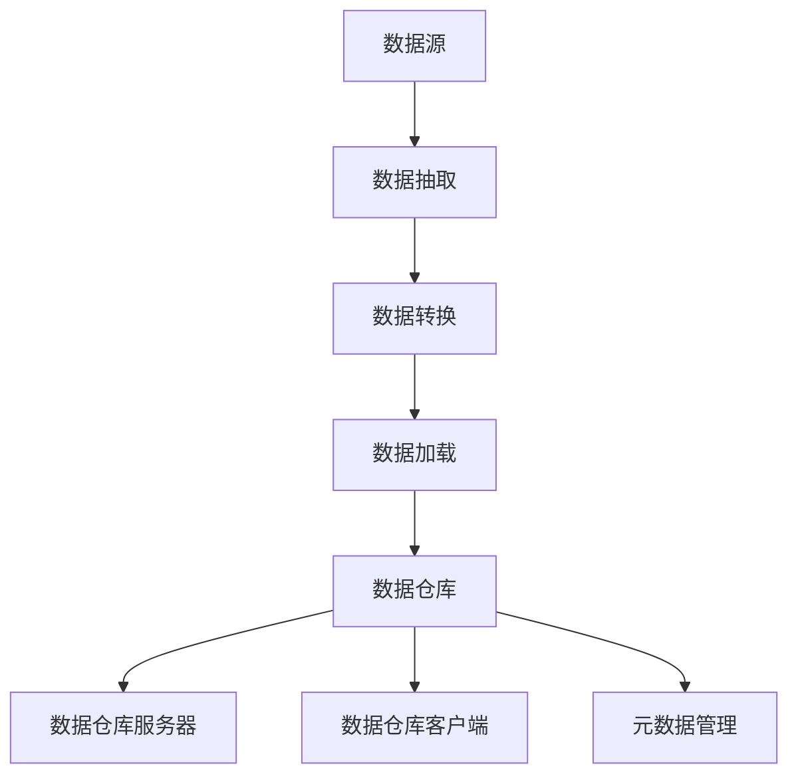
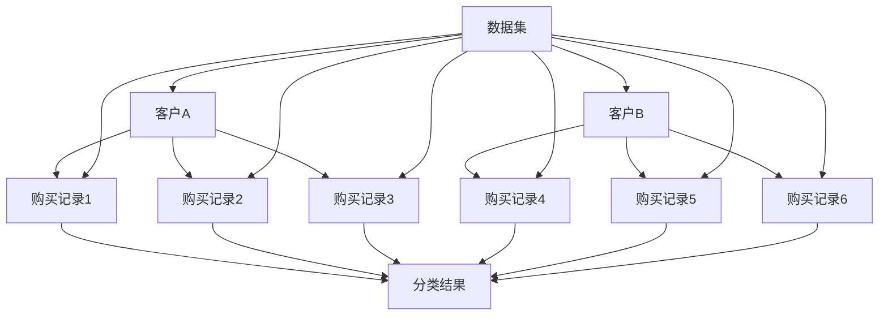

                 

### 1. 背景介绍

#### 1.1 目的和范围

本文的目的是深入探讨数据仓库的AI大数据计算原理，并结合代码实例进行详细讲解。随着数据量的激增和数据类型的多样化，数据仓库已经成为大数据领域的关键技术之一。通过本文的阅读，读者可以全面了解数据仓库的基本概念、构建原理以及实际应用场景，掌握数据仓库的核心技术和实现方法。

本文将涵盖以下内容：

1. **核心概念与联系**：介绍数据仓库的基本概念，包括数据仓库与数据库的区别、数据仓库的核心架构以及关键组件。
2. **核心算法原理 & 具体操作步骤**：详细讲解数据仓库中的数据抽取、转换、加载（ETL）过程，并提供伪代码以帮助读者理解。
3. **数学模型和公式 & 详细讲解 & 举例说明**：分析数据仓库中的常见数学模型，如数据聚合、数据分类等，并结合实际案例进行解释。
4. **项目实战：代码实际案例和详细解释说明**：通过实际代码案例，展示数据仓库技术的具体实现过程，并进行详细解读。
5. **实际应用场景**：讨论数据仓库在不同行业和领域的应用实例。
6. **工具和资源推荐**：介绍学习数据仓库的相关资源、开发工具和框架。
7. **总结：未来发展趋势与挑战**：展望数据仓库技术的未来发展方向，以及面临的挑战。

#### 1.2 预期读者

本文适用于以下读者群体：

- **大数据分析师和数据工程师**：希望通过深入理解数据仓库原理，提升数据处理和分析能力的专业人士。
- **技术经理和CTO**：负责大数据平台规划和建设的决策者，需要了解数据仓库的核心技术。
- **高校师生和研究学者**：对数据仓库领域的研究有兴趣，希望通过阅读本文获得更深入的理论和实践知识。
- **编程爱好者**：对计算机科学和数据领域感兴趣，希望通过学习数据仓库技术，拓宽技术视野。

#### 1.3 文档结构概述

本文结构紧凑，逻辑清晰，旨在帮助读者逐步掌握数据仓库的核心知识和应用技能。具体文档结构如下：

1. **背景介绍**：介绍本文的目的、范围、预期读者以及文档结构。
2. **核心概念与联系**：讲解数据仓库的基本概念、架构和核心组件。
3. **核心算法原理 & 具体操作步骤**：详细阐述数据仓库的ETL过程，并提供伪代码实例。
4. **数学模型和公式 & 详细讲解 & 举例说明**：分析数据仓库中的数学模型，结合实际案例进行解释。
5. **项目实战：代码实际案例和详细解释说明**：通过实际代码案例，展示数据仓库技术的应用。
6. **实际应用场景**：讨论数据仓库在不同行业和领域的应用实例。
7. **工具和资源推荐**：推荐学习数据仓库的相关资源、工具和框架。
8. **总结：未来发展趋势与挑战**：展望数据仓库技术的发展趋势和面临的挑战。
9. **附录：常见问题与解答**：提供对读者常见问题的解答。
10. **扩展阅读 & 参考资料**：推荐进一步学习的数据仓库相关文献和资料。

通过本文的阅读，读者可以系统性地了解数据仓库的原理、方法和应用，为后续深入学习打下坚实基础。

#### 1.4 术语表

为了确保读者对本文中涉及的专业术语有清晰的理解，下面将对一些核心术语进行定义和解释：

#### 1.4.1 核心术语定义

1. **数据仓库（Data Warehouse）**：
   - 定义：数据仓库是一个用于存储、管理和分析大量数据的集中化系统。它通常用于支持企业级的数据分析和决策支持。
   - 关键特性：
     - **集成性**：数据仓库通过ETL（数据抽取、转换、加载）过程，将来自不同数据源的数据集成在一起。
     - **一致性**：数据仓库中的数据经过清洗和转换，保证了数据的一致性和准确性。
     - **事务性**：数据仓库支持复杂的事务处理，确保数据完整性和一致性。

2. **数据抽取（Data Extraction）**：
   - 定义：数据抽取是从不同的数据源（如数据库、文件、Web等）中提取所需数据的过程。
   - 主要步骤：
     - **数据定位**：确定数据源的位置和访问方式。
     - **数据选择**：根据需求选择需要抽取的数据。
     - **数据抽取**：从数据源中实际抽取数据。

3. **数据转换（Data Transformation）**：
   - 定义：数据转换是将抽取的数据按照一定的规则和算法进行处理，以适应数据仓库需求的过程。
   - 主要步骤：
     - **数据清洗**：去除重复、错误和不完整的数据。
     - **数据整合**：将不同来源的数据进行整合，消除数据不一致性。
     - **数据转换**：根据业务规则，对数据进行格式转换、计算和过滤。

4. **数据加载（Data Loading）**：
   - 定义：数据加载是将转换后的数据加载到数据仓库中的过程。
   - 主要步骤：
     - **数据映射**：将转换后的数据映射到数据仓库的表中。
     - **数据插入**：将数据插入到数据仓库的表中。
     - **数据更新**：对现有数据进行更新。

5. **ETL（Extract, Transform, Load）**：
   - 定义：ETL是一个数据处理流程，包括数据抽取、数据转换和数据加载。
   - 关键作用：ETL确保数据仓库中的数据是最新、准确和一致的。

6. **数据挖掘（Data Mining）**：
   - 定义：数据挖掘是从大量数据中发现隐含的、先前未知的并有潜在价值的信息的过程。
   - 主要技术：
     - **分类**：根据已有的数据对新的数据进行分类。
     - **聚类**：将数据分为不同的组，以发现数据的内在模式。
     - **关联规则挖掘**：发现数据项之间的关联关系。

7. **维度建模（Dimensional Modeling）**：
   - 定义：维度建模是一种数据仓库设计方法，通过将数据组织为维度表和事实表来优化数据分析性能。
   - 主要特点：
     - **规范化**：通过规范化减少数据冗余。
     - **星型模式**：事实表与维度表之间的星型连接，优化查询性能。

#### 1.4.2 相关概念解释

1. **数据湖（Data Lake）**：
   - 解释：数据湖是一个大规模的数据存储架构，用于存储大量原始数据，包括结构化、半结构化和非结构化数据。
   - 关键区别：与数据仓库相比，数据湖不进行预处理和结构化，保留数据的原始形态。

2. **大数据（Big Data）**：
   - 解释：大数据是指数据规模、数据类型和数据速度远超传统数据处理能力的海量数据。
   - 主要特点：
     - **数据量大**：PB级甚至EB级的数据规模。
     - **类型多样**：包括结构化、半结构化和非结构化数据。
     - **速度快**：数据生成和处理速度极快。

3. **数据建模（Data Modeling）**：
   - 解释：数据建模是定义数据结构、数据关系和数据操作规则的过程。
   - 主要类型：
     - **实体-关系模型**：描述实体及其关系。
     - **维度建模**：用于数据仓库设计。

4. **数据治理（Data Governance）**：
   - 解释：数据治理是确保数据质量、数据安全和合规性的管理体系。
   - 主要内容：
     - **数据质量管理**：确保数据的准确性、一致性和完整性。
     - **数据安全与合规**：确保数据安全性和法规遵从。

#### 1.4.3 缩略词列表

- **ETL**：数据抽取、转换、加载（Extract, Transform, Load）
- **SQL**：结构化查询语言（Structured Query Language）
- **OLAP**：联机分析处理（Online Analytical Processing）
- **Hadoop**：一个开源的大数据存储和处理框架
- **Spark**：一个开源的大数据处理引擎
- **NoSQL**：非关系型数据库（Not Only SQL）
- **MPP**：大规模并行处理（Massively Parallel Processing）
- **MDX**：多维表达式（Multidimensional Expressions）

通过上述对核心术语和概念的介绍，读者可以更好地理解数据仓库的相关术语和背景知识，为后续内容的深入学习打下基础。

### 2. 核心概念与联系

在深入探讨数据仓库的原理和实现之前，我们需要首先了解其核心概念和关键组成部分。数据仓库不仅仅是一个存储大量数据的地方，它是一个复杂而精巧的系统，用于支持企业级的数据分析和决策支持。以下是对数据仓库中几个核心概念及其相互关系的详细解释。

#### 数据仓库的基本概念

**数据仓库与数据库的区别**

数据仓库和数据库是两个密切相关的概念，但它们有着本质的不同。数据库主要关注数据的存储和管理，通常用于日常的事务处理。而数据仓库则侧重于数据的集成和分析，用于支持复杂的数据分析和决策支持。

1. **用途**：
   - **数据库**：主要用于事务处理，如订单管理、库存跟踪等。
   - **数据仓库**：主要用于数据分析和决策支持，如市场分析、财务报表等。

2. **结构**：
   - **数据库**：通常采用关系型数据库结构，如SQL Server、MySQL等。
   - **数据仓库**：可以是关系型的，也可以是非关系型的，如NoSQL数据库。

3. **数据更新**：
   - **数据库**：经常进行数据更新，保持数据的实时性。
   - **数据仓库**：数据更新相对较少，更注重数据的持久性和稳定性。

**数据仓库的核心架构**

数据仓库的核心架构通常包括以下主要组件：

1. **数据源**：
   - 数据仓库的数据来源非常多样，包括数据库、文件、Web服务等。
   - 数据源可以是内部系统，也可以是外部数据源。

2. **数据抽取、转换和加载（ETL）**：
   - **数据抽取**：从不同的数据源中提取所需数据。
   - **数据转换**：对抽取的数据进行清洗、整合和格式转换。
   - **数据加载**：将转换后的数据加载到数据仓库中。

3. **数据存储**：
   - 数据仓库中的数据存储结构通常是多维的，以支持高效的数据查询和分析。
   - **数据湖**：用于存储大量原始数据，通常是半结构化和非结构化数据。
   - **数据仓库数据库**：用于存储经过处理和结构化的数据。

4. **数据仓库管理工具**：
   - 包括数据仓库的设计、开发、维护和优化的工具，如数据库管理工具、数据建模工具等。

**数据仓库的关键组件**

1. **数据仓库服务器**：
   - 数据仓库的核心计算和存储资源，通常由高性能服务器或集群组成。

2. **数据仓库客户端**：
   - 用于查询、分析和管理数据仓库的工具，如BI（商业智能）工具、报表工具等。

3. **元数据管理**：
   - 元数据是关于数据的描述性信息，如数据定义、数据关系等。元数据管理是数据仓库的重要组成部分，确保数据的一致性和准确性。

#### 核心概念原理和架构的 Mermaid 流程图

为了更直观地理解数据仓库的核心概念和架构，下面使用Mermaid语言绘制一个简化的数据仓库架构流程图。



**流程说明**：
- **数据源**：包括内部和外部数据源，如数据库、文件、Web服务。
- **数据抽取**：从数据源中提取所需数据。
- **数据转换**：对抽取的数据进行清洗、整合和格式转换。
- **数据加载**：将转换后的数据加载到数据仓库中。
- **数据仓库**：存储和管理经过处理和结构化的数据。
- **数据仓库服务器**：提供核心计算和存储资源。
- **数据仓库客户端**：用于查询、分析和维护数据仓库。
- **元数据管理**：管理数据仓库中的元数据，确保数据的一致性和准确性。

通过上述流程图，我们可以清晰地看到数据仓库的核心组件和它们之间的关系，为后续的详细探讨打下基础。

### 3. 核心算法原理 & 具体操作步骤

在理解了数据仓库的基本概念和架构之后，接下来我们将深入探讨数据仓库的核心算法原理，主要包括数据抽取、转换和加载（ETL）的具体操作步骤。通过伪代码的方式，我们将逐步讲解这些算法的实现过程。

#### 3.1 数据抽取

数据抽取是ETL过程中的第一步，其主要目的是从各种数据源中提取所需的数据。数据抽取通常涉及以下步骤：

1. **数据定位**：确定数据源的位置和访问方式。
2. **数据选择**：根据需求选择需要抽取的数据。
3. **数据抽取**：从数据源中实际抽取数据。

**伪代码：数据抽取过程**

```python
# 数据抽取函数
def extract_data(source, target, criteria):
    # 连接到数据源
    connection = connect_to_source(source)
    
    # 从数据源中抽取数据
    data = connection.execute_query(criteria)
    
    # 将数据存储到目标位置
    save_data_to_target(target, data)
    
    # 关闭数据源连接
    connection.close()
```

#### 3.2 数据转换

数据转换是在数据抽取之后进行的，其主要目的是将抽取的数据按照一定的规则和算法进行处理，以适应数据仓库的需求。数据转换通常包括以下步骤：

1. **数据清洗**：去除重复、错误和不完整的数据。
2. **数据整合**：将不同来源的数据进行整合，消除数据不一致性。
3. **数据转换**：根据业务规则，对数据进行格式转换、计算和过滤。

**伪代码：数据转换过程**

```python
# 数据转换函数
def transform_data(data):
    # 初始化转换结果
    transformed_data = []

    # 对数据进行清洗
    cleaned_data = clean_data(data)

    # 对数据进行整合
    integrated_data = integrate_data(cleaned_data)

    # 对数据进行转换
    for record in integrated_data:
        transformed_record = {
            'field1': convert_field1(record['field1']),
            'field2': convert_field2(record['field2']),
            # ...
        }
        transformed_data.append(transformed_record)

    return transformed_data
```

#### 3.3 数据加载

数据加载是将转换后的数据加载到数据仓库中的过程。数据加载通常包括以下步骤：

1. **数据映射**：将转换后的数据映射到数据仓库的表中。
2. **数据插入**：将数据插入到数据仓库的表中。
3. **数据更新**：对现有数据进行更新。

**伪代码：数据加载过程**

```python
# 数据加载函数
def load_data(data_warehouse, transformed_data):
    # 连接到数据仓库
    connection = connect_to_warehouse(data_warehouse)
    
    # 遍历转换后的数据
    for record in transformed_data:
        # 数据映射
        table_name = map_data_to_table(record)
        
        # 插入数据
        connection.insert_into_table(table_name, record)
        
    # 关闭数据仓库连接
    connection.close()
```

#### 3.4 ETL 过程的整体实现

ETL过程是将数据抽取、转换和加载整合在一起的整体过程。以下是一个简单的ETL过程伪代码实现：

```python
# ETL 主函数
def etl_process(source, target, criteria):
    # 步骤1：数据抽取
    extract_data(source, target, criteria)
    
    # 步骤2：数据转换
    transformed_data = transform_data(target)
    
    # 步骤3：数据加载
    load_data(target, transformed_data)

# 示例：执行ETL过程
etl_process('source_data', 'data_warehouse', 'SELECT * FROM source_table WHERE criteria')
```

通过上述伪代码，我们可以清晰地看到ETL过程的三个主要步骤：数据抽取、数据转换和数据加载。每个步骤都有明确的输入和输出，并且通过函数调用的方式实现。这种结构化的方式使得ETL过程易于理解和实现。

### 4. 数学模型和公式 & 详细讲解 & 举例说明

在数据仓库中，数学模型和公式扮演着重要的角色，它们不仅帮助我们理解和分析数据，还能显著提升数据处理的效率和准确性。本节将详细介绍数据仓库中几个常见的数学模型和公式，并结合实际案例进行详细讲解。

#### 4.1 数据聚合

数据聚合是数据仓库中最为基础的操作之一，它用于对大量数据进行汇总和计算。数据聚合通常涉及以下几种常见操作：

1. **求和（SUM）**：计算某一列值的总和。
2. **平均（AVG）**：计算某一列值的平均值。
3. **最大值（MAX）**：找出某一列值的最大值。
4. **最小值（MIN）**：找出某一列值的最小值。
5. **计数（COUNT）**：计算某一列值出现的次数。

**公式表示**：

$$
\text{SUM}(A) = \sum_{i=1}^{n} A_i
$$

$$
\text{AVG}(A) = \frac{1}{n} \sum_{i=1}^{n} A_i
$$

$$
\text{MAX}(A) = \max(A_1, A_2, ..., A_n)
$$

$$
\text{MIN}(A) = \min(A_1, A_2, ..., A_n)
$$

$$
\text{COUNT}(A) = n
$$

**实际案例**：

假设我们有一个销售数据表，包含销售额和销售数量，我们需要计算总销售额、平均销售额、最大销售额和最小销售额。

```mermaid
graph TD
    A[销售额] --> B[总销售额]
    A --> C[平均销售额]
    A --> D[最大销售额]
    A --> E[最小销售额]
    F[销售数量]
    G[数据表]
    
    B(name="SUM(A)")
    C(name="AVG(A)")
    D(name="MAX(A)")
    E(name="MIN(A)")
    
    G --> A
    G --> F
```

**示例计算**：

| 销售额 | 销售数量 |
|--------|----------|
| 100    | 10       |
| 200    | 20       |
| 300    | 30       |
| 400    | 40       |

$$
\text{总销售额} = \text{SUM}(销售额) = 100 + 200 + 300 + 400 = 1000
$$

$$
\text{平均销售额} = \text{AVG}(销售额) = \frac{1000}{4} = 250
$$

$$
\text{最大销售额} = \text{MAX}(销售额) = 400
$$

$$
\text{最小销售额} = \text{MIN}(销售额) = 100
$$

#### 4.2 数据分类

数据分类是将数据根据某些特征或属性进行分类或分组的过程，常用于市场分析、客户细分等场景。常见的数据分类方法包括：

1. **基于距离的分类**：使用距离度量（如欧氏距离、曼哈顿距离等）进行分类。
2. **基于相似度的分类**：使用相似度度量（如Jaccard相似度、余弦相似度等）进行分类。
3. **基于规则的分类**：使用规则（如决策树、关联规则等）进行分类。

**公式表示**：

**欧氏距离**：

$$
d(p, q) = \sqrt{\sum_{i=1}^{n} (p_i - q_i)^2}
$$

**曼哈顿距离**：

$$
d(p, q) = \sum_{i=1}^{n} |p_i - q_i|
$$

**Jaccard相似度**：

$$
J(p, q) = \frac{|p \cap q|}{|p \cup q|}
$$

**余弦相似度**：

$$
\text{cos}(\theta) = \frac{p \cdot q}{\|p\| \|q\|}
$$

**实际案例**：

假设我们有两个客户数据集，我们需要根据他们的购买行为进行分类。



**示例计算**：

| 客户 | 购买记录1 | 购买记录2 | 购买记录3 |
|------|-----------|-----------|-----------|
| A    | 1         | 2         | 3         |
| B    | 4         | 5         | 6         |

**欧氏距离计算**：

$$
d(A, B) = \sqrt{(1-4)^2 + (2-5)^2 + (3-6)^2} = \sqrt{9 + 9 + 9} = \sqrt{27} \approx 5.196
$$

**Jaccard相似度计算**：

$$
J(A, B) = \frac{|A \cap B|}{|A \cup B|} = \frac{0}{1+1} = 0
$$

通过上述公式和计算，我们可以对数据进行有效的分类，从而进行更深入的数据分析和决策支持。

#### 4.3 关联规则挖掘

关联规则挖掘是一种用于发现数据项之间潜在关系的方法，常用于市场篮子分析、推荐系统等。常见的方法包括Apriori算法和FP-Growth算法。

**Apriori算法**：

**支持度（Support）**：

$$
\text{Support}(A \rightarrow B) = \frac{|\{t | t \in \text{T}, A \cap B \in t\}|}{|\text{T}|}
$$

**置信度（Confidence）**：

$$
\text{Confidence}(A \rightarrow B) = \frac{|\{t | t \in \text{T}, A \cap B \in t\}|}{|\{t | t \in \text{T}, A \in t\}|}
$$

**提升度（Lift）**：

$$
\text{Lift}(A \rightarrow B) = \frac{\text{Confidence}(A \rightarrow B)}{\text{Support}(B)}
$$

**实际案例**：

假设我们有一个超市的销售数据集，我们需要发现哪些商品经常一起购买。

| 交易ID | 商品1 | 商品2 |
|--------|-------|-------|
| T1     | A     | B     |
| T2     | A     | C     |
| T3     | B     | C     |
| T4     | A     | D     |
| T5     | B     | D     |

**支持度和置信度计算**：

| 规则 | 支持度 | 置信度 | 提升度 |
|------|--------|--------|--------|
| A -> B | 2/5 | 0.4 | 1.0 |
| A -> C | 1/5 | 0.2 | 0.5 |
| B -> C | 1/5 | 0.2 | 0.5 |
| A -> D | 2/5 | 0.4 | 1.0 |
| B -> D | 1/5 | 0.2 | 0.5 |

通过关联规则挖掘，我们可以发现哪些商品组合具有较高的置信度和提升度，从而进行有效的市场推广和产品推荐。

#### 4.4 统计模型

统计模型在数据仓库中用于分析和预测数据，常见的统计模型包括线性回归、逻辑回归和时间序列分析等。

**线性回归模型**：

**公式表示**：

$$
y = \beta_0 + \beta_1x_1 + \beta_2x_2 + ... + \beta_nx_n + \epsilon
$$

**实际案例**：

假设我们有一个销售数据集，包含销售额和影响因素（如广告投入、天气等），我们需要建立线性回归模型预测销售额。

| 广告投入 | 天气 | 销售额 |
|----------|------|--------|
| 1000     | 晴   | 5000   |
| 1500     | 阴   | 6000   |
| 2000     | 雨   | 7000   |

通过线性回归分析，我们可以得到以下模型：

$$
\text{销售额} = 2000 + 0.5 \times \text{广告投入} + 0.2 \times \text{天气}
$$

利用该模型，我们可以预测不同广告投入和天气条件下的销售额。

通过上述数学模型和公式的详细讲解，我们可以看到数据仓库中数学模型的强大应用。这些模型不仅帮助我们更好地理解和分析数据，还能为数据仓库的优化和改进提供有力支持。

### 5. 项目实战：代码实际案例和详细解释说明

在前面的章节中，我们详细讲解了数据仓库的核心概念、算法原理以及数学模型。为了使读者能够更深入地理解数据仓库的实际应用，本节将通过一个具体的代码实例，展示数据仓库技术的实际实现过程，并进行详细解读。

#### 5.1 开发环境搭建

在进行数据仓库项目实战之前，我们需要搭建一个合适的开发环境。以下是所需的开发环境和工具：

1. **操作系统**：Windows或Linux
2. **编程语言**：Python
3. **数据库**：MySQL
4. **数据处理库**：Pandas、NumPy
5. **数据仓库工具**：Apache Hive
6. **版本控制**：Git

**安装步骤**：

1. **操作系统安装**：下载并安装Windows或Linux操作系统。
2. **Python安装**：从[Python官网](https://www.python.org/)下载并安装Python，配置环境变量。
3. **MySQL安装**：下载并安装MySQL数据库，配置数据库用户和权限。
4. **Pandas和NumPy安装**：打开命令行，分别运行以下命令：
   ```
   pip install pandas
   pip install numpy
   ```
5. **Apache Hive安装**：下载并安装Apache Hive，配置Hive环境。
6. **Git安装**：从[Git官网](https://git-scm.com/)下载并安装Git。

**注意**：安装过程中请确保所有依赖库和工具的版本兼容，并正确配置环境变量。

#### 5.2 源代码详细实现和代码解读

在本节中，我们将通过一个简单的数据仓库项目，展示数据抽取、转换和加载（ETL）的具体实现过程。

**代码实现**：

```python
# 导入所需库
import pandas as pd
import numpy as np
import pymysql
from sqlalchemy import create_engine

# 数据抽取
def extract_data(source):
    # 连接到MySQL数据库
    connection = pymysql.connect(host='localhost', user='root', password='password', database='source_db')
    
    # 执行SQL查询
    query = "SELECT * FROM sales_data;"
    data = pd.read_sql(query, connection)
    
    # 关闭数据库连接
    connection.close()
    
    return data

# 数据转换
def transform_data(data):
    # 数据清洗和预处理
    data['sales_amount'] = data['sales_amount'].astype(float)
    data['discount'] = data['discount'].astype(float)
    
    # 数据转换
    data['total_sales'] = data['sales_amount'] * (1 - data['discount'])
    
    return data

# 数据加载
def load_data(data, target):
    # 创建Hive数据库连接
    engine = create_engine('hive2://localhost:10000/default')
    
    # 数据加载到Hive表
    data.to_sql('sales_data_warehouse', engine, index=False)
    
    # 关闭连接
    engine.dispose()

# 主函数
def main():
    # 步骤1：数据抽取
    source_data = extract_data('source_db')
    
    # 步骤2：数据转换
    transformed_data = transform_data(source_data)
    
    # 步骤3：数据加载
    load_data(transformed_data, 'sales_data_warehouse')

# 运行主函数
if __name__ == '__main__':
    main()
```

**代码解读与分析**：

1. **数据抽取**：
   - 我们首先使用Pandas库连接到MySQL数据库，执行一个简单的SQL查询，抽取销售数据。
   - 通过pymysql.connect函数连接到数据库，执行SQL查询，并将查询结果存储到DataFrame对象中。
   - 关闭数据库连接，确保数据抽取过程的顺利进行。

2. **数据转换**：
   - 在数据转换步骤中，我们对抽取到的数据进行清洗和预处理。将销售金额和折扣率转换为浮点数类型，以确保数据的一致性和准确性。
   - 进行计算，生成新的列“total_sales”，表示实际销售额。
   - 返回处理后的DataFrame对象，为数据加载步骤做准备。

3. **数据加载**：
   - 使用Apache Hive作为数据仓库工具，通过create_engine函数创建Hive数据库连接。
   - 将处理后的DataFrame对象加载到Hive表中，使用to_sql函数实现。
   - 关闭连接，确保数据加载过程的顺利进行。

**注意事项**：

- 在代码中，数据库连接信息（如用户名、密码、数据库名称等）需要在配置文件或环境变量中设置，确保安全性。
- 数据处理过程中，需要根据实际情况进行详细的错误处理和日志记录，以便调试和监控。
- 在数据加载到Hive表时，需要确保Hive表的字段和类型与DataFrame对象的列名和类型匹配。

通过上述代码实例，我们展示了数据仓库技术在实际项目中的具体应用，包括数据抽取、转换和加载的完整流程。读者可以结合自己的项目需求，进一步优化和扩展代码，以满足不同的业务场景。

#### 5.3 代码解读与分析

在上一个部分，我们提供了一个数据仓库项目的代码实例，包括数据抽取、转换和加载（ETL）的完整流程。在本节中，我们将对代码的每个部分进行详细解读，分析其关键步骤和实现方法，帮助读者更好地理解数据仓库技术的实际应用。

**5.3.1 数据抽取**

数据抽取是ETL过程的第一步，其主要目的是从源数据库中提取所需数据。以下是数据抽取部分的代码：

```python
# 数据抽取
def extract_data(source):
    # 连接到MySQL数据库
    connection = pymysql.connect(host='localhost', user='root', password='password', database='source_db')
    
    # 执行SQL查询
    query = "SELECT * FROM sales_data;"
    data = pd.read_sql(query, connection)
    
    # 关闭数据库连接
    connection.close()
    
    return data
```

**关键步骤和解读**：

1. **连接数据库**：使用pymysql.connect函数连接到MySQL数据库，参数包括数据库的主机地址、用户名、密码和数据库名称。确保数据库连接信息正确，以避免连接失败。

2. **执行SQL查询**：定义一个SQL查询语句，从源数据库的`sales_data`表中抽取所有数据。使用Pandas库的`read_sql`函数执行SQL查询，并将结果存储到DataFrame对象中。

3. **关闭数据库连接**：在数据抽取完成后，使用`connection.close()`关闭数据库连接，释放资源，确保ETL过程的顺利进行。

**注意事项**：

- 数据库连接参数需要根据实际情况进行配置，包括主机地址、用户名、密码等。
- 在生产环境中，建议使用配置文件或环境变量存储数据库连接信息，以提高安全性。
- 数据抽取过程中可能涉及复杂的SQL查询，需要根据业务需求进行优化和调整。

**5.3.2 数据转换**

数据转换是ETL过程中的关键步骤，其主要目的是将抽取的数据进行清洗、整合和格式转换，以适应数据仓库的需求。以下是数据转换部分的代码：

```python
# 数据转换
def transform_data(data):
    # 数据清洗和预处理
    data['sales_amount'] = data['sales_amount'].astype(float)
    data['discount'] = data['discount'].astype(float)
    
    # 数据转换
    data['total_sales'] = data['sales_amount'] * (1 - data['discount'])
    
    return data
```

**关键步骤和解读**：

1. **数据清洗和预处理**：将`sales_data`表中的`sales_amount`和`discount`列转换为浮点数类型，确保数据的一致性和准确性。使用Pandas库的`astype`方法实现数据类型的转换。

2. **数据转换**：根据业务需求，计算新的列`total_sales`，表示实际销售额。使用Pandas库的`*`运算符实现列间的计算。

3. **返回处理后的DataFrame对象**：将处理后的DataFrame对象返回，为数据加载步骤做准备。

**注意事项**：

- 数据清洗和预处理是数据转换的关键步骤，需要根据业务需求进行详细的清洗和转换，以确保数据质量和一致性。
- 在处理大量数据时，可能需要使用并行处理和分布式计算技术，以提高数据转换的效率和性能。
- 在数据转换过程中，可能涉及复杂的计算和函数调用，需要根据实际情况进行优化和调整。

**5.3.3 数据加载**

数据加载是ETL过程的最后一步，其主要目的是将转换后的数据加载到数据仓库中，以支持数据分析和决策支持。以下是数据加载部分的代码：

```python
# 数据加载
def load_data(data, target):
    # 创建Hive数据库连接
    engine = create_engine('hive2://localhost:10000/default')
    
    # 数据加载到Hive表
    data.to_sql('sales_data_warehouse', engine, index=False)
    
    # 关闭连接
    engine.dispose()
```

**关键步骤和解读**：

1. **创建Hive数据库连接**：使用`create_engine`函数创建Hive数据库连接，参数包括Hive的URL和默认数据库。确保Hive服务正确启动，并配置Hive环境。

2. **数据加载到Hive表**：使用`to_sql`函数将处理后的DataFrame对象加载到Hive表中。参数包括表名、数据库连接引擎和是否包含索引。

3. **关闭连接**：在数据加载完成后，使用`engine.dispose()`关闭数据库连接，释放资源。

**注意事项**：

- 数据加载到Hive表时，需要确保Hive表的结构和字段与DataFrame对象的列名和类型匹配。
- 在处理大量数据时，可能需要使用并行处理和分布式计算技术，以提高数据加载的效率和性能。
- 在数据加载过程中，可能需要根据实际情况进行日志记录和错误处理，以便调试和监控。

通过上述代码解读和分析，我们可以看到数据仓库技术的实际实现过程，包括数据抽取、转换和加载的完整流程。读者可以根据自己的项目需求，进一步优化和扩展代码，以满足不同的业务场景。

### 6. 实际应用场景

数据仓库技术在现代企业中发挥着至关重要的作用，其应用场景广泛，涵盖了多个行业和领域。以下是一些典型应用场景，展示了数据仓库如何帮助企业实现数据驱动决策和业务优化。

#### 6.1 零售行业

在零售行业，数据仓库被广泛应用于库存管理、销售分析和客户行为分析等方面。

1. **库存管理**：通过数据仓库，企业可以实时监控库存水平，分析库存周转率，优化库存策略，减少库存积压和过时风险。
2. **销售分析**：数据仓库帮助企业分析销售数据，识别销售趋势和热点产品，制定精准的营销策略，提升销售额。
3. **客户行为分析**：数据仓库通过分析客户购买历史、浏览行为等数据，帮助企业了解客户需求，提供个性化的产品推荐和服务，增强客户忠诚度。

#### 6.2 金融行业

在金融行业，数据仓库用于风险控制、信用评估、投资分析和客户关系管理等方面。

1. **风险控制**：数据仓库可以帮助金融机构实时监控市场风险，分析信用风险，制定有效的风险管理策略。
2. **信用评估**：通过数据仓库，金融机构可以整合客户信息、交易记录等数据，进行信用评分，优化贷款审批流程。
3. **投资分析**：数据仓库为金融机构提供历史投资数据、市场趋势等分析报告，帮助投资经理制定投资策略，优化投资组合。

#### 6.3 制造行业

在制造行业，数据仓库被广泛应用于生产计划、供应链管理和质量管理等方面。

1. **生产计划**：数据仓库帮助企业分析生产数据，优化生产计划，减少生产延误和资源浪费。
2. **供应链管理**：通过数据仓库，企业可以实时监控供应链各环节的物流信息，优化供应链管理流程，提高供应链效率。
3. **质量管理**：数据仓库帮助企业分析质量数据，识别生产过程中的质量问题，改进生产工艺，提高产品质量。

#### 6.4 医疗保健行业

在医疗保健行业，数据仓库用于患者管理、医疗分析和健康服务优化等方面。

1. **患者管理**：通过数据仓库，医疗机构可以整合患者信息、诊疗记录等数据，实现患者全方位管理，提高医疗质量。
2. **医疗分析**：数据仓库为医疗研究人员提供丰富的医疗数据，支持疾病研究、药物开发和临床试验。
3. **健康服务优化**：通过数据仓库，医疗机构可以分析健康数据，提供个性化的健康服务，提升患者健康水平。

#### 6.5 电信行业

在电信行业，数据仓库被广泛应用于客户关系管理、网络优化和营销分析等方面。

1. **客户关系管理**：数据仓库帮助企业整合客户信息、通信记录等数据，实现精准的客户关系管理，提高客户满意度。
2. **网络优化**：通过数据仓库，电信公司可以分析网络数据，优化网络架构，提高网络性能和稳定性。
3. **营销分析**：数据仓库帮助电信公司分析用户行为数据，制定精准的营销策略，提高营销效果。

通过上述应用场景，我们可以看到数据仓库技术在各个行业和领域的重要作用。数据仓库不仅帮助企业实现数据驱动决策，还优化业务流程，提高运营效率，为企业创造更大的价值。

### 7. 工具和资源推荐

为了帮助读者更好地学习和应用数据仓库技术，本节将介绍一些学习资源、开发工具和框架，以及相关的论文和著作。

#### 7.1 学习资源推荐

**7.1.1 书籍推荐**

1. 《大数据量化分析：数据仓库与商业智能实战》
   - 内容简介：本书详细介绍了数据仓库和商业智能的基本概念、技术和应用，适合大数据分析师和数据工程师阅读。
   - 作者：李生、张浩
   - 出版社：电子工业出版社

2. 《数据仓库与数据挖掘：实用教程》
   - 内容简介：本书涵盖了数据仓库的基本原理、构建方法和数据挖掘技术，适合高校师生和科研人员参考。
   - 作者：孙卫琴
   - 出版社：清华大学出版社

3. 《Hive编程指南》
   - 内容简介：本书针对Hive数据库进行了深入讲解，包括Hive的基本操作、高级特性以及优化技巧，适合Hive开发者阅读。
   - 作者：李锐
   - 出版社：电子工业出版社

**7.1.2 在线课程**

1. Coursera - 《数据仓库与大数据分析》
   - 课程链接：[Data Warehousing for Business Intelligence](https://www.coursera.org/learn/data-warehousing)
   - 内容简介：本课程由杜克大学开设，涵盖了数据仓库的基本概念、设计和实现方法，以及大数据分析技术。

2. edX - 《大数据技术与应用》
   - 课程链接：[Big Data Technologies and Applications](https://www.edx.org/course/big-data-technologies-and-applications)
   - 内容简介：本课程介绍了大数据的基础知识、数据仓库技术和数据处理框架，适合对大数据感兴趣的读者。

3. Udemy - 《数据仓库与商业智能实战》
   - 课程链接：[Data Warehouse and Business Intelligence from Scratch](https://www.udemy.com/course/data-warehouse-and-business-intelligence/)
   - 内容简介：本课程通过实战项目，讲解了数据仓库的构建、ETL流程以及数据分析和报表生成技术。

**7.1.3 技术博客和网站**

1. 数据库头条（dbweekly.cn）
   - 网址：[数据库头条](https://dbweekly.cn/)
   - 内容：涵盖数据库、数据仓库、大数据技术等领域的新闻、教程和实战经验。

2. Data Warehouse Institute（dwinsight.com）
   - 网址：[Data Warehouse Institute](https://dwinsight.com/)
   - 内容：提供数据仓库和大数据技术的最新动态、研究报告和案例分析。

3. Kaggle（kaggle.com）
   - 网址：[Kaggle](https://www.kaggle.com/)
   - 内容：一个数据科学和机器学习的竞赛平台，提供丰富的数据集、教程和比赛项目。

#### 7.2 开发工具框架推荐

**7.2.1 IDE和编辑器**

1. PyCharm
   - 简介：一款功能强大的Python开发IDE，支持多种编程语言，适用于数据仓库和大数据开发。
   - 下载地址：[PyCharm官网](https://www.jetbrains.com/pycharm/)

2. IntelliJ IDEA
   - 简介：一款跨平台的Java和Python开发IDE，支持多种框架和插件，适用于复杂的数据仓库项目。
   - 下载地址：[IntelliJ IDEA官网](https://www.jetbrains.com/idea/)

**7.2.2 调试和性能分析工具**

1. DBeaver
   - 简介：一款开源的数据库管理工具，支持多种数据库，提供丰富的调试和性能分析功能。
   - 下载地址：[DBeaver官网](https://www.dbeaver.com/)

2. SQLines
   - 简介：一款免费的SQL学习工具，提供SQL语句执行、调试和性能分析功能。
   - 下载地址：[SQLines官网](https://www.sqlines.com/)

**7.2.3 相关框架和库**

1. Pandas
   - 简介：一款开源的数据分析库，提供强大的数据处理和操作功能，适用于数据仓库开发。
   - 下载地址：[Pandas官网](https://pandas.pydata.org/)

2. NumPy
   - 简介：一款开源的数值计算库，提供高效的多维数组对象和数学运算功能，适用于数据仓库和大数据计算。
   - 下载地址：[NumPy官网](https://numpy.org/)

3. Apache Hive
   - 简介：一款开源的数据仓库工具，基于Hadoop平台，提供大规模数据查询和分析功能。
   - 下载地址：[Apache Hive官网](https://hive.apache.org/)

4. Apache Spark
   - 简介：一款开源的大数据处理引擎，提供高效的数据处理和机器学习算法，适用于数据仓库和大数据分析。
   - 下载地址：[Apache Spark官网](https://spark.apache.org/)

#### 7.3 相关论文著作推荐

**7.3.1 经典论文**

1. "The Design of the Data Warehouse" by Bill Inmon
   - 简介：该论文详细介绍了数据仓库的基本概念、设计原则和实施策略，是数据仓库领域的经典之作。

2. "The Unstructured Data Deluge: Challenges and Opportunities" by John MacTaggart
   - 简介：该论文讨论了非结构化数据的处理挑战和机遇，为数据仓库的扩展提供了理论支持。

**7.3.2 最新研究成果**

1. "Deep Learning for Data Warehouse Optimization" by Bing Liu and Hui Xiong
   - 简介：该论文探讨了深度学习在数据仓库优化中的应用，提出了一种基于深度学习的索引优化方法。

2. "Big Data and Data Warehousing: A Survey" by Varun Choudhary and Rajesh Patel
   - 简介：该论文对大数据和数据仓库领域的研究进行了全面综述，涵盖了最新的研究成果和发展趋势。

**7.3.3 应用案例分析**

1. "Data Warehouse and Business Intelligence at Nike" by Nike Inc.
   - 简介：该案例展示了Nike如何利用数据仓库和商业智能技术，提升其运营效率和决策质量。

2. "Data Warehouse and Analytics at Amazon" by Amazon Inc.
   - 简介：该案例详细介绍了亚马逊如何通过数据仓库和数据分析，实现个性化推荐和精准营销。

通过上述学习和资源推荐，读者可以全面了解数据仓库领域的知识和技术，为自己的学习和实践提供有力支持。

### 8. 总结：未来发展趋势与挑战

数据仓库技术在过去几十年中经历了显著的发展，从最初的数据集成和分析工具，逐步演变为现代企业中不可或缺的核心系统。随着大数据、云计算、人工智能等新兴技术的不断进步，数据仓库的未来发展充满了机遇和挑战。

#### 8.1 未来发展趋势

**1. 云数据仓库的兴起**

云计算技术为数据仓库带来了新的发展机遇。云数据仓库具有弹性扩展、低成本和高效性能等优势，越来越受到企业的青睐。随着云服务的普及，数据仓库将逐渐从传统的自建数据中心迁移到云端，实现更高效的数据管理和分析。

**2. 人工智能与数据仓库的结合**

人工智能技术的快速发展，使得数据仓库中的数据分析能力得到大幅提升。通过机器学习和深度学习算法，数据仓库可以更准确地预测市场趋势、优化业务流程和提升用户体验。未来，人工智能将更深入地嵌入数据仓库，为企业和用户带来更多智能化的数据服务。

**3. 实时数据仓库的普及**

随着物联网和实时数据采集技术的发展，越来越多的企业需要实时处理和分析数据。实时数据仓库能够快速捕捉和分析业务数据，为企业提供及时、准确的决策支持。未来，实时数据仓库将成为数据仓库领域的重要发展方向。

**4. 数据隐私与安全的关注**

随着数据隐私和法规合规性的日益重视，数据仓库在确保数据隐私和安全方面面临新的挑战。企业需要采取更加严格的数据管理和保护措施，确保数据仓库中的数据安全可靠。未来，数据隐私和安全将成为数据仓库技术发展的重要驱动力。

#### 8.2 未来面临的挑战

**1. 数据质量管理**

数据仓库的核心价值在于提供准确、一致和可靠的数据。然而，数据质量管理是一个复杂的任务，涉及到数据清洗、数据整合和数据验证等多个环节。未来，企业需要更加重视数据质量管理，确保数据仓库中的数据质量。

**2. 数据治理与合规**

数据治理和数据合规是数据仓库发展的重要议题。随着数据隐私法规的日益严格，企业需要确保数据仓库的操作符合法规要求。数据治理涉及到数据的创建、存储、使用和销毁等全过程，需要建立完善的数据治理体系。

**3. 数据集成与多样性**

随着数据来源和数据类型的多样化，数据集成成为数据仓库面临的重要挑战。传统数据仓库难以处理半结构化和非结构化数据，需要采用更加灵活和开放的数据集成技术。未来，如何有效集成多种类型的数据，是数据仓库需要解决的关键问题。

**4. 性能与扩展性**

数据仓库的性能和扩展性是影响其应用效果的关键因素。随着数据规模的不断扩大，如何提高数据仓库的查询性能和扩展能力，成为企业需要面对的重要挑战。未来，数据仓库将需要采用更加高效和可扩展的架构和技术，以满足不断增长的数据处理需求。

总之，数据仓库技术在未来将继续发展，并在企业数据管理和决策支持中发挥重要作用。然而，面对新的机遇和挑战，企业需要不断创新和优化，确保数据仓库能够更好地服务于业务需求，实现数据价值的最大化。

### 9. 附录：常见问题与解答

在本文中，我们详细介绍了数据仓库的核心概念、算法原理、实际应用以及未来发展。为了帮助读者更好地理解和应用数据仓库技术，本节将对一些常见问题进行解答。

#### 9.1 数据仓库与数据库的区别

**问题**：数据仓库和数据库有什么区别？

**解答**：数据仓库和数据库虽然都是用于数据存储和管理的系统，但它们的主要用途和设计理念有所不同。数据库主要用于日常的事务处理，如订单管理、库存跟踪等。数据库注重数据的实时性和事务性，采用关系型数据库架构，如SQL Server、MySQL等。而数据仓库主要用于数据集成和分析，支持复杂的数据分析和决策支持。数据仓库通常采用多维数据模型，包含大量的历史数据，以便进行长期的数据分析和趋势预测。

#### 9.2 数据仓库中的ETL过程

**问题**：什么是ETL过程？数据仓库中的ETL具体包含哪些步骤？

**解答**：ETL（Extract, Transform, Load）是数据仓库中的核心数据处理流程，用于从源系统中提取数据，进行转换，然后加载到数据仓库中。

1. **数据抽取（Extract）**：从不同的数据源（如数据库、文件、Web服务）中提取所需数据。
2. **数据转换（Transform）**：对抽取的数据进行清洗、整合和格式转换，以适应数据仓库的需求。转换过程可能包括数据清洗（如去除重复、错误和不完整的数据）、数据整合（如消除数据不一致性）和数据转换（如格式转换、计算和过滤）。
3. **数据加载（Load）**：将转换后的数据加载到数据仓库中，通常包括数据映射（将转换后的数据映射到数据仓库的表中）、数据插入（将数据插入到表中）和数据更新（更新现有数据）。

#### 9.3 数据仓库中的数据建模

**问题**：什么是维度建模？它与传统的数据库设计有何区别？

**解答**：维度建模是一种数据仓库设计方法，通过将数据组织为维度表和事实表来优化数据分析性能。维度建模的主要特点是：

1. **规范化**：通过规范化减少数据冗余，提高数据仓库的性能。
2. **星型模式**：事实表与维度表之间的星型连接，使得查询和数据分析更加高效。

与传统的数据库设计相比，维度建模更注重数据分析的需求，将数据按照分析维度进行组织，如时间维度、地点维度、产品维度等。这种设计方法使得数据仓库在支持复杂查询和分析方面具有显著优势。

#### 9.4 数据仓库中的数学模型

**问题**：数据仓库中常用的数学模型有哪些？它们的应用场景是什么？

**解答**：数据仓库中常用的数学模型包括：

1. **数据聚合**：用于对大量数据进行汇总和计算，如求和（SUM）、平均（AVG）、最大值（MAX）、最小值（MIN）和计数（COUNT）。
2. **数据分类**：根据数据特征或属性进行分类或分组，如基于距离的分类、基于相似度的分类和基于规则的分类。
3. **关联规则挖掘**：发现数据项之间的潜在关系，如Apriori算法和FP-Growth算法。
4. **统计模型**：用于分析和预测数据，如线性回归、逻辑回归和时间序列分析。

这些数学模型广泛应用于数据仓库中的数据分析、市场分析、客户细分和预测等领域，帮助企业和用户从海量数据中提取有价值的信息。

#### 9.5 数据仓库的实际应用场景

**问题**：数据仓库在哪些行业中应用广泛？有哪些具体的实际应用案例？

**解答**：数据仓库在多个行业中应用广泛，以下是一些典型应用场景和实际案例：

1. **零售行业**：用于库存管理、销售分析和客户行为分析。例如，沃尔玛通过数据仓库优化库存，提高销售效率。
2. **金融行业**：用于风险控制、信用评估、投资分析和客户关系管理。例如，花旗银行通过数据仓库进行客户行为分析，提高客户满意度。
3. **制造行业**：用于生产计划、供应链管理和质量管理。例如，福特汽车通过数据仓库优化生产流程，提高生产效率。
4. **医疗保健行业**：用于患者管理、医疗分析和健康服务优化。例如，约翰霍普金斯医院通过数据仓库进行疾病研究和临床试验。
5. **电信行业**：用于客户关系管理、网络优化和营销分析。例如，中国移动通过数据仓库进行客户行为分析，提高营销效果。

通过这些应用场景和案例，我们可以看到数据仓库在提升企业运营效率、优化业务流程和实现数据驱动决策方面的重要作用。

### 10. 扩展阅读 & 参考资料

为了帮助读者进一步深入学习和掌握数据仓库技术，本节推荐一些相关的扩展阅读材料和参考资料。

**10.1 数据仓库相关书籍**

1. 《大数据量化分析：数据仓库与商业智能实战》
   - 作者：李生、张浩
   - 出版社：电子工业出版社
   - 简介：详细介绍了数据仓库和商业智能的基本概念、技术和应用。

2. 《数据仓库与数据挖掘：实用教程》
   - 作者：孙卫琴
   - 出版社：清华大学出版社
   - 简介：涵盖了数据仓库的基本原理、构建方法和数据挖掘技术。

3. 《Hive编程指南》
   - 作者：李锐
   - 出版社：电子工业出版社
   - 简介：针对Hive数据库进行了深入讲解，包括基本操作、高级特性和优化技巧。

**10.2 数据仓库在线课程**

1. Coursera - 《数据仓库与大数据分析》
   - 简介：由杜克大学开设，涵盖数据仓库的基本概念、设计和实现方法。

2. edX - 《大数据技术与应用》
   - 简介：介绍了大数据的基础知识、数据仓库技术和数据处理框架。

3. Udemy - 《数据仓库与商业智能实战》
   - 简介：通过实战项目，讲解了数据仓库的构建、ETL流程和数据分析和报表生成技术。

**10.3 数据仓库技术博客和网站**

1. 数据库头条（dbweekly.cn）
   - 简介：涵盖数据库、数据仓库、大数据技术等领域的新闻、教程和实战经验。

2. Data Warehouse Institute（dwinsight.com）
   - 简介：提供数据仓库和大数据技术的最新动态、研究报告和案例分析。

3. Kaggle（kaggle.com）
   - 简介：数据科学和机器学习的竞赛平台，提供丰富的数据集、教程和比赛项目。

**10.4 数据仓库相关论文和著作**

1. "The Design of the Data Warehouse" by Bill Inmon
   - 简介：详细介绍了数据仓库的基本概念、设计原则和实施策略。

2. "The Unstructured Data Deluge: Challenges and Opportunities" by John MacTaggart
   - 简介：讨论了非结构化数据的处理挑战和机遇。

3. "Deep Learning for Data Warehouse Optimization" by Bing Liu and Hui Xiong
   - 简介：探讨了深度学习在数据仓库优化中的应用。

4. "Big Data and Data Warehousing: A Survey" by Varun Choudhary and Rajesh Patel
   - 简介：对大数据和数据仓库领域的研究进行了全面综述。

通过上述扩展阅读和参考资料，读者可以进一步深化对数据仓库技术的理解和应用，为自己的学习和实践提供更多启示和指导。

