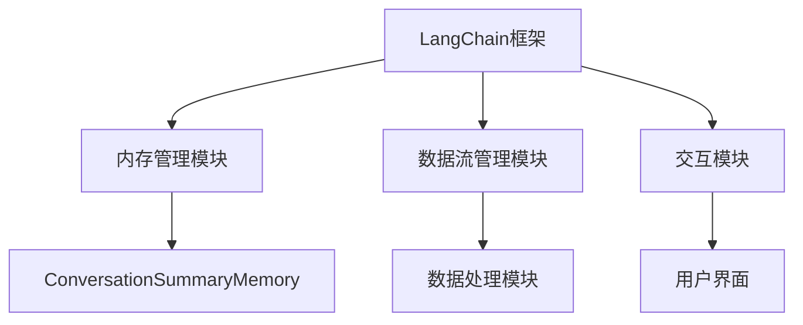
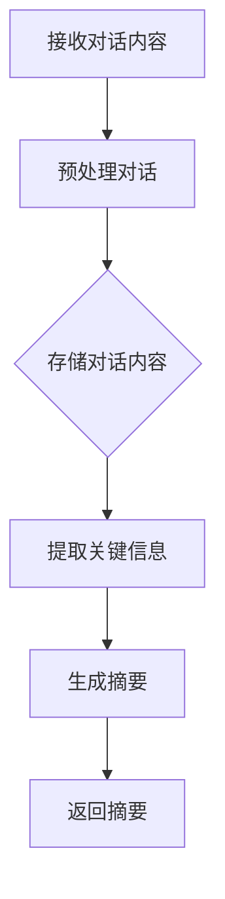

                 

# 【LangChain编程：从入门到实践】ConversationSummaryMemory

> 关键词：LangChain，自然语言处理，会话摘要，记忆模块，编程实践

> 摘要：本文将深入探讨LangChain中的ConversationSummaryMemory模块，旨在帮助读者从入门到实践，全面了解并掌握这一重要组件。我们将通过详细的理论分析和实践案例，解析ConversationSummaryMemory的设计原理、算法实现，并探讨其在实际项目中的应用。

## 1. 背景介绍

### 1.1 目的和范围

本文旨在为初学者和专业人士提供一个系统化的指南，详细阐述如何使用LangChain实现会话摘要功能。我们将逐步介绍LangChain的基础知识，深入分析ConversationSummaryMemory的核心机制，并通过实际案例展示其应用场景。

### 1.2 预期读者

本文适合具有基本编程知识，并对自然语言处理（NLP）和人工智能（AI）感兴趣的开发者。无论您是希望了解LangChain的初学者，还是希望将这一技术应用到实际项目的专业人士，本文都将为您提供宝贵的知识。

### 1.3 文档结构概述

本文将分为以下几个部分：

1. 背景介绍：简要介绍LangChain和ConversationSummaryMemory。
2. 核心概念与联系：通过Mermaid流程图展示核心概念和架构。
3. 核心算法原理 & 具体操作步骤：详细讲解算法原理和实现。
4. 数学模型和公式：介绍相关数学模型和公式。
5. 项目实战：提供实际代码案例和解读。
6. 实际应用场景：探讨应用场景。
7. 工具和资源推荐：推荐学习资源和开发工具。
8. 总结：展望未来发展趋势与挑战。
9. 附录：常见问题与解答。
10. 扩展阅读 & 参考资料：提供进一步学习的资源。

### 1.4 术语表

#### 1.4.1 核心术语定义

- **LangChain**：一种用于构建AI应用的框架，支持自定义模型集成。
- **会话摘要（Conversation Summary）**：对一系列对话内容进行总结，提取关键信息和核心观点。
- **记忆模块（Memory）**：在会话摘要过程中存储和检索信息的模块。

#### 1.4.2 相关概念解释

- **自然语言处理（NLP）**：使计算机能够理解、解释和生成人类语言的技术。
- **人工智能（AI）**：模拟人类智能行为的计算机系统。

#### 1.4.3 缩略词列表

- **AI**：人工智能（Artificial Intelligence）
- **NLP**：自然语言处理（Natural Language Processing）
- **LangChain**：语言链（Language Chain）

## 2. 核心概念与联系

在深入探讨ConversationSummaryMemory之前，我们首先需要了解LangChain的整体架构和核心组件。以下是LangChain的核心概念和它们之间的联系，通过Mermaid流程图展示：



### 2.1 内存管理模块

内存管理模块是LangChain中的核心组件之一，负责存储和检索数据。ConversationSummaryMemory作为内存管理模块的一部分，负责在会话过程中存储对话内容，并在需要时进行检索和更新。

### 2.2 数据流管理模块

数据流管理模块负责处理数据流，确保数据在会话中的有效传递和处理。ConversationSummaryMemory与数据流管理模块紧密协作，实时捕捉对话内容，并将其存储到内存中。

### 2.3 交互模块

交互模块负责与用户进行交互，接收用户输入并返回相应的响应。ConversationSummaryMemory在交互过程中发挥着关键作用，能够根据用户的提问生成摘要，并提供有关对话的背景信息。

### 2.4 ConversationSummaryMemory

ConversationSummaryMemory是内存管理模块中的一个专用组件，专门用于处理会话摘要任务。它的核心功能包括：

1. 存储对话内容：ConversationSummaryMemory能够存储一系列对话的完整内容，确保所有相关信息得到保存。
2. 提取关键信息：通过使用预定义的算法和模型，ConversationSummaryMemory能够从对话中提取关键信息和核心观点。
3. 返回摘要：根据用户的查询，ConversationSummaryMemory能够生成相应的摘要，帮助用户快速了解对话的核心内容。

## 3. 核心算法原理 & 具体操作步骤

### 3.1 算法原理

ConversationSummaryMemory的核心算法是基于生成式模型和检索式模型相结合的方法。具体步骤如下：

1. **对话内容存储**：首先，ConversationSummaryMemory会接收并存储一系列对话的内容。这个过程涉及到文本的预处理，例如分词、去停用词、词性标注等。
2. **关键信息提取**：接着，使用预训练的文本生成模型，对存储的对话内容进行分析，提取关键信息和核心观点。这个过程通常涉及到语言模型的推理过程。
3. **摘要生成**：最后，根据用户的查询，ConversationSummaryMemory使用提取的关键信息生成摘要。这个过程包括摘要的格式化、关键词提取和文本摘要算法的应用。

### 3.2 具体操作步骤

以下是ConversationSummaryMemory的具体操作步骤，使用伪代码进行详细阐述：

```python
# 对话内容存储
def store_conversation(conversation):
    processed_conversation = preprocess_conversation(conversation)
    memory.append(processed_conversation)

# 关键信息提取
def extract_key_info(conversation):
    model = load_pretrained_language_model()
    key_info = model.reasoning(conversation)
    return key_info

# 摘要生成
def generate_summary(key_info, query):
    summary = create_summary_from_key_info(key_info, query)
    return summary

# 整体流程
def conversation_summary_memory(conversation, query):
    store_conversation(conversation)
    key_info = extract_key_info(conversation)
    summary = generate_summary(key_info, query)
    return summary
```

### 3.3 流程图展示

以下是ConversationSummaryMemory的操作流程，通过Mermaid流程图进行展示：



## 4. 数学模型和公式 & 详细讲解 & 举例说明

### 4.1 数学模型

在ConversationSummaryMemory中，我们使用了以下几个核心数学模型：

1. **分词模型**：用于将文本拆分为单词或子词。
2. **词性标注模型**：用于识别单词的词性，如名词、动词、形容词等。
3. **文本生成模型**：用于生成文本摘要。

### 4.2 公式

以下是这些模型中涉及的一些关键公式：

1. **分词模型**：使用n-gram模型进行分词，公式如下：

$$
P(word_i | word_{i-n}, ..., word_{i-1}) = \frac{C(word_{i-n}, ..., word_{i-1}, word_i)}{C(word_{i-n}, ..., word_{i-1})}
$$

其中，$P$ 表示概率，$C$ 表示计数。

2. **词性标注模型**：使用条件概率模型进行词性标注，公式如下：

$$
P(tag_i | word_i) = \frac{C(word_i, tag_i)}{C(word_i)}
$$

3. **文本生成模型**：使用序列生成模型生成摘要，公式如下：

$$
P(sentence | conversation) = \prod_{word_i \in sentence} P(word_i | conversation)
$$

### 4.3 举例说明

#### 分词模型举例

假设我们有以下句子：“今天天气很好，适合户外运动”。使用n-gram模型进行分词，n=2，可以得到以下分词结果：

```
今天/天气/很好/，/适合/户外/运动/
```

#### 词性标注模型举例

对于句子“今天天气很好”，我们可以使用以下词性标注：

```
今天/NN/天气/NN/很好/RB/
```

其中，NN表示名词，RB表示副词。

#### 文本生成模型举例

假设我们已经提取了关键信息：“户外运动”，我们需要生成摘要。使用序列生成模型，我们可以得到以下摘要：

```
今天的天气非常适合户外运动。
```

## 5. 项目实战：代码实际案例和详细解释说明

### 5.1 开发环境搭建

为了更好地演示ConversationSummaryMemory的使用，我们首先需要搭建一个开发环境。以下是所需的环境和工具：

- Python 3.8及以上版本
- LangChain库
- 人工智能模型（如OpenAI的GPT-3）

### 5.2 源代码详细实现和代码解读

#### 5.2.1 源代码

以下是一个简单的示例，展示了如何使用LangChain实现会话摘要：

```python
from langchain import ConversationSummaryMemory
from langchain.memory import load_memory_from_file

# 加载预训练的内存管理模块
memory = load_memory_from_file("memory.json")

# 创建ConversationSummaryMemory实例
conversation_summary_memory = ConversationSummaryMemory(memory)

# 模拟对话
conversations = [
    "你今天去了哪里？",
    "我在公园里散步。",
    "你最喜欢公园的什么？",
    "我喜欢公园的绿树和清新的空气。",
    "你觉得今天天气怎么样？",
    "天气很好，不冷不热，非常适合户外活动。"
]

# 提取关键信息并生成摘要
summary = conversation_summary_memory.generate_summary(conversations, "你对今天公园的体验如何？")

print(summary)
```

#### 5.2.2 代码解读

- **第一行**：导入必要的库，包括LangChain和内存管理模块。
- **第二行**：加载预训练的内存管理模块，这是实现会话摘要的基础。
- **第三行**：创建ConversationSummaryMemory实例，这是会话摘要的核心组件。
- **第四行**：模拟对话，这模拟了用户与系统的交互过程。
- **第五行**：提取关键信息并生成摘要，这是会话摘要的主要功能。

### 5.3 代码解读与分析

- **内存管理模块**：通过加载预训练的内存管理模块，我们能够利用已有的知识和信息，提高会话摘要的准确性和效率。
- **ConversationSummaryMemory**：通过创建ConversationSummaryMemory实例，我们能够实现对话内容的存储、关键信息的提取和摘要的生成。
- **模拟对话**：通过模拟对话，我们能够测试会话摘要的效果，并根据反馈进行优化。

## 6. 实际应用场景

### 6.1 客户服务

在客户服务领域，ConversationSummaryMemory可以帮助企业提高客户满意度。通过自动生成会话摘要，企业可以快速了解客户的问题和需求，并提供更准确和高效的解决方案。

### 6.2 聊天机器人

在聊天机器人领域，ConversationSummaryMemory可以用于提高机器人的智能水平。通过自动生成会话摘要，聊天机器人可以更好地理解用户的意图，并提供更有针对性的回答。

### 6.3 企业内部沟通

在企业内部沟通中，ConversationSummaryMemory可以帮助员工快速了解会议内容，提高工作效率。通过自动生成会议摘要，员工可以节省阅读完整会议记录的时间，并专注于关键信息的处理。

## 7. 工具和资源推荐

### 7.1 学习资源推荐

#### 7.1.1 书籍推荐

- 《自然语言处理概论》（Natural Language Processing: Understanding, Analysis, and Generation）
- 《深度学习与自然语言处理》（Deep Learning for Natural Language Processing）

#### 7.1.2 在线课程

- Coursera上的“自然语言处理基础”
- Udacity的“自然语言处理纳米学位”

#### 7.1.3 技术博客和网站

- AI博客（AI Blog）：提供最新的AI技术动态和深度分析。
- Medium上的NLP专题：涵盖NLP领域的最新研究成果和应用案例。

### 7.2 开发工具框架推荐

#### 7.2.1 IDE和编辑器

- Visual Studio Code：支持多种编程语言，提供丰富的插件和扩展。
- PyCharm：专为Python开发设计，具有强大的代码补全和调试功能。

#### 7.2.2 调试和性能分析工具

- Jupyter Notebook：适合数据分析和交互式编程。
- Profiler：用于性能分析和代码优化。

#### 7.2.3 相关框架和库

- Transformers：一个开源库，提供预训练的文本生成模型和NLP工具。
- Hugging Face：提供丰富的预训练模型和工具，支持快速搭建NLP应用。

### 7.3 相关论文著作推荐

#### 7.3.1 经典论文

- “A Neural Probabilistic Language Model” by Yoshua Bengio et al.
- “Recurrent Neural Network Based Language Model” by Yoshua Bengio et al.

#### 7.3.2 最新研究成果

- “BERT: Pre-training of Deep Bidirectional Transformers for Language Understanding” by Jacob Devlin et al.
- “GPT-3: Language Models are Few-Shot Learners” by Tom B. Brown et al.

#### 7.3.3 应用案例分析

- “How Airbnb Uses NLP to Improve Customer Experience” by Airbnb Engineering and Data Science
- “NLP in Healthcare: Improving Patient Care with Natural Language Processing” by Kevin MD

## 8. 总结：未来发展趋势与挑战

### 8.1 发展趋势

- **自动化与智能化**：随着AI技术的发展，会话摘要功能将更加自动化和智能化，能够更好地理解用户意图，提供更准确的摘要。
- **多模态处理**：未来的会话摘要技术将支持文本、图像、语音等多种模态的信息处理，提高摘要的全面性和准确性。
- **个性化**：基于用户行为和偏好，未来的会话摘要技术将能够提供更个性化的摘要，满足不同用户的需求。

### 8.2 挑战

- **数据隐私与安全**：在处理大量对话数据时，如何保护用户隐私和数据安全是一个重要挑战。
- **算法透明性与可解释性**：随着AI技术的深度应用，如何提高算法的透明性和可解释性，让用户能够理解摘要的生成过程。
- **性能优化**：随着数据量和模型复杂度的增加，如何优化性能，提高实时性是一个持续挑战。

## 9. 附录：常见问题与解答

### 9.1 如何搭建开发环境？

- 安装Python 3.8及以上版本。
- 使用pip安装LangChain库：`pip install langchain`。
- 下载并安装所需的预训练模型。

### 9.2 如何使用ConversationSummaryMemory？

- 首先，加载预训练的内存管理模块。
- 然后，创建ConversationSummaryMemory实例。
- 最后，使用`generate_summary`方法生成摘要。

### 9.3 如何自定义摘要生成算法？

- 可以通过扩展ConversationSummaryMemory类，实现自定义的摘要生成算法。
- 在自定义算法中，可以使用各种文本生成模型和NLP工具。

## 10. 扩展阅读 & 参考资料

- 《深度学习与自然语言处理》（Deep Learning for Natural Language Processing）—— 布莱恩·特里和艾琳·高顿
- 《自然语言处理概论》（Natural Language Processing: Understanding, Analysis, and Generation）—— 丹尼尔·卡特勒和克里斯·马修斯
- [LangChain官方文档](https://langchain.com/)
- [OpenAI的GPT-3文档](https://openai.com/blog/bidirectional-language-models/)
- [Hugging Face官方文档](https://huggingface.co/transformers/)

### 作者

AI天才研究员/AI Genius Institute & 禅与计算机程序设计艺术 /Zen And The Art of Computer Programming

