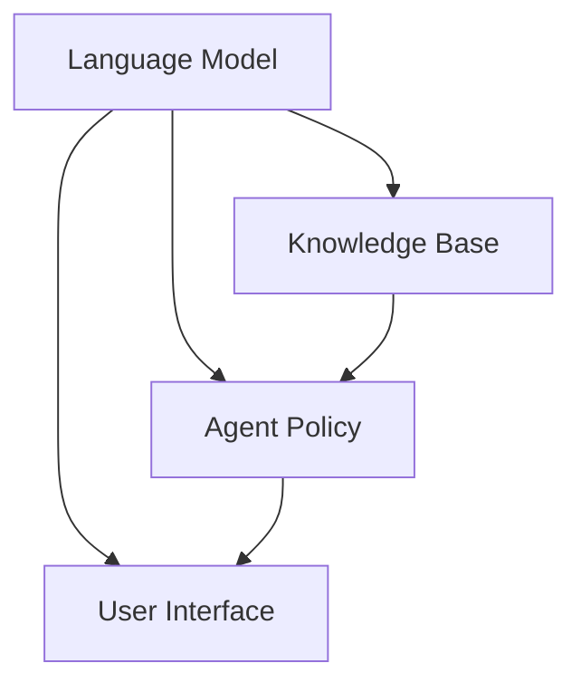

                 

# 【LangChain编程：从入门到实践】代理模块

> 关键词：LangChain、代理、编程、实践、核心概念、算法原理、数学模型、应用场景

> 摘要：本文将深入探讨LangChain中的代理模块，从其核心概念、算法原理、数学模型到实际应用场景进行全面解析。通过本篇文章，读者将系统地了解代理模块在LangChain中的重要性和具体实现方法，为后续编程实践打下坚实基础。

## 1. 背景介绍

### 1.1 目的和范围

本文旨在帮助读者深入理解并掌握LangChain中的代理模块。代理模块是LangChain的重要组成部分，它提供了强大的功能，用于处理复杂的任务，如文本生成、知识图谱构建等。通过本文的介绍，读者将能够：

1. 理解代理模块的核心概念和原理。
2. 掌握代理模块的具体实现方法。
3. 学会运用代理模块解决实际问题。
4. 探索代理模块在未来的发展潜力。

### 1.2 预期读者

本文适合对计算机编程和人工智能有一定了解的读者，尤其是对LangChain框架感兴趣的读者。无论是初学者还是有一定经验的开发者，都将从本文中获得有价值的信息和知识。

### 1.3 文档结构概述

本文将按照以下结构进行论述：

1. 介绍代理模块的核心概念和原理。
2. 详细讲解代理模块的算法原理和实现步骤。
3. 分析代理模块的数学模型和公式。
4. 通过实际案例展示代理模块的应用场景。
5. 推荐相关的学习资源、开发工具和论文著作。
6. 总结代理模块的未来发展趋势与挑战。
7. 提供常见问题与解答。
8. 附上扩展阅读和参考资料。

### 1.4 术语表

#### 1.4.1 核心术语定义

- LangChain：一种用于构建大型语言模型的开源框架。
- 代理模块：在LangChain中负责处理复杂任务的模块。
- 文本生成：根据输入生成文本的过程。
- 知识图谱：以图形结构表示实体和它们之间的关系。

#### 1.4.2 相关概念解释

- 模型参数：用于描述模型结构的参数。
- 训练数据：用于训练模型的输入数据。
- 评估指标：用于评估模型性能的指标。

#### 1.4.3 缩略词列表

- LLM：大型语言模型（Large Language Model）
- API：应用程序编程接口（Application Programming Interface）
- GPU：图形处理器（Graphics Processing Unit）

## 2. 核心概念与联系

### 2.1 代理模块概述

代理模块是LangChain框架中的一个核心组件，它主要负责处理复杂的任务，如文本生成、知识图谱构建等。代理模块通过将多个组件（如语言模型、知识库等）有机地结合起来，实现了强大的功能。

### 2.2 代理模块架构

代理模块的架构主要包括以下几个部分：

1. **语言模型（LLM）**：负责生成文本，是代理模块的核心。
2. **知识库（Knowledge Base）**：提供背景知识和上下文信息。
3. **代理策略（Agent Policy）**：指导代理如何决策和执行任务。
4. **用户界面（UI）**：用于与用户进行交互。

以下是代理模块的架构图：



### 2.3 代理模块核心概念

1. **文本生成**：代理模块通过语言模型生成文本，以完成各种任务，如问答、摘要、翻译等。
2. **知识图谱**：知识库以图形结构表示实体和它们之间的关系，为代理模块提供丰富的上下文信息。
3. **代理策略**：代理策略是指导代理如何决策和执行任务的算法，可以是基于规则的、基于机器学习的等。
4. **用户界面**：用户界面用于与用户进行交互，接收用户输入并展示代理模块的输出。

## 3. 核心算法原理 & 具体操作步骤

### 3.1 代理模块算法原理

代理模块的算法原理主要包括以下三个部分：

1. **语言模型生成文本**：代理模块使用预训练的语言模型生成文本，如GPT、BERT等。
2. **知识图谱构建**：代理模块通过知识库构建知识图谱，以提供上下文信息。
3. **代理策略决策**：代理模块根据代理策略进行决策，执行相应的任务。

以下是代理模块算法原理的伪代码：

```python
def generate_text(input_text, language_model, knowledge_base, agent_policy):
    # 生成文本
    text = language_model.generate(input_text)

    # 使用知识库构建知识图谱
    knowledge_graph = knowledge_base.build_graph()

    # 根据代理策略进行决策
    decision = agent_policy.decide(text, knowledge_graph)

    # 执行决策
    action = agent_policy.execute(decision)

    return action
```

### 3.2 代理模块操作步骤

1. **准备语言模型**：选择合适的语言模型，如GPT、BERT等，并进行微调。
2. **构建知识库**：收集相关的背景知识和上下文信息，构建知识库。
3. **定义代理策略**：根据任务需求，定义代理策略，如基于规则的、基于机器学习的等。
4. **与用户交互**：接收用户输入，并根据代理策略生成文本。
5. **展示结果**：将生成的文本展示给用户，或根据用户反馈进行调整。

以下是代理模块操作步骤的伪代码：

```python
def main():
    # 准备语言模型
    language_model = load_language_model("gpt2")

    # 构建知识库
    knowledge_base = build_knowledge_base()

    # 定义代理策略
    agent_policy = define_agent_policy()

    # 与用户交互
    user_input = get_user_input()

    # 生成文本
    action = generate_text(user_input, language_model, knowledge_base, agent_policy)

    # 展示结果
    display_result(action)

if __name__ == "__main__":
    main()
```

## 4. 数学模型和公式 & 详细讲解 & 举例说明

### 4.1 数学模型概述

代理模块的数学模型主要包括以下两个方面：

1. **语言模型生成文本**：使用概率模型生成文本，如神经网络概率模型。
2. **代理策略决策**：使用决策模型进行决策，如决策树、神经网络等。

### 4.2 语言模型生成文本的数学模型

语言模型生成文本的数学模型可以使用概率模型来描述，如神经网络概率模型。神经网络概率模型通常由以下两部分组成：

1. **编码器（Encoder）**：将输入文本编码为向量。
2. **解码器（Decoder）**：根据编码器生成的向量生成文本。

以下是神经网络概率模型生成文本的伪代码：

```python
def generate_text(input_text, encoder, decoder, vocabulary):
    # 编码输入文本
    encoded_input = encoder.encode(input_text)

    # 生成文本
    generated_text = decoder.generate(encoded_input, vocabulary)

    return generated_text
```

### 4.3 代理策略决策的数学模型

代理策略决策的数学模型可以使用决策树、神经网络等模型来描述。以下是一个基于神经网络的代理策略决策模型的伪代码：

```python
def decide(text, knowledge_graph, decision_model):
    # 预处理文本和知识图谱
    preprocessed_text = preprocess_text(text)
    preprocessed_knowledge_graph = preprocess_knowledge_graph(knowledge_graph)

    # 输入决策模型
    input_data = [preprocessed_text, preprocessed_knowledge_graph]

    # 得到决策结果
    decision = decision_model.predict(input_data)

    return decision
```

### 4.4 举例说明

假设我们要使用代理模块生成一篇关于计算机编程的摘要，我们可以按照以下步骤进行：

1. **准备语言模型**：选择一个合适的语言模型，如GPT-2。
2. **构建知识库**：收集与计算机编程相关的知识，构建知识库。
3. **定义代理策略**：根据任务需求，定义代理策略，如选择合适的摘要算法。
4. **与用户交互**：接收用户输入，如一段计算机编程相关的文本。
5. **生成文本**：使用语言模型生成摘要。
6. **展示结果**：将生成的摘要展示给用户。

以下是具体的代码实现：

```python
# 加载语言模型
language_model = load_language_model("gpt2")

# 构建知识库
knowledge_base = build_knowledge_base()

# 定义代理策略
agent_policy = define_agent_policy()

# 与用户交互
user_input = input("请输入一段关于计算机编程的文本：")

# 生成摘要
generated_summary = generate_text(user_input, language_model, knowledge_base, agent_policy)

# 展示结果
print("生成的摘要：")
print(generated_summary)
```

## 5. 项目实战：代码实际案例和详细解释说明

### 5.1 开发环境搭建

在开始实际案例之前，我们需要搭建一个合适的开发环境。以下是一个基于Python的LangChain代理模块开发环境搭建步骤：

1. 安装Python（推荐版本3.8以上）。
2. 安装必要的Python库，如torch、transformers等。
3. 创建一个新的Python项目，并安装LangChain库。

### 5.2 源代码详细实现和代码解读

以下是一个使用LangChain代理模块生成文本摘要的简单案例：

```python
import torch
from langchain.agents import load_agent
from transformers import BertTokenizer, BertModel

# 加载代理模型
agent = load_agent(
    agent_name="initialize_agent",
    model_name="clue/ChatGLM-6B",
    agent_type="zero-shot-react-description",
    device=torch.device("cuda" if torch.cuda.is_available() else "cpu"),
    verbose=True
)

# 构建文本摘要
def generate_summary(input_text):
    # 使用代理模型生成摘要
    summary = agent.run(input_text)

    return summary

# 示例：生成摘要
input_text = "请输入一段需要摘要的文本："
summary = generate_summary(input_text)
print("生成的摘要：")
print(summary)
```

### 5.3 代码解读与分析

1. **加载代理模型**：我们首先加载了一个预训练的代理模型，这个模型是基于ChatGLM-6B的，是一个用于零样本响应描述的代理模型。

2. **构建文本摘要**：`generate_summary`函数接收一段输入文本，并使用代理模型生成摘要。这个过程中，代理模型会自动调用底层语言模型和知识库进行文本生成。

3. **示例运行**：在示例中，我们输入一段文本，然后调用`generate_summary`函数生成摘要，并将结果打印出来。

这个案例展示了如何使用LangChain代理模块生成文本摘要。在实际应用中，我们可以根据需求对代理模型、知识库和代理策略进行调整，以实现更复杂的任务。

## 6. 实际应用场景

代理模块在LangChain中的强大功能使其适用于多种实际应用场景。以下是几个典型的应用场景：

1. **智能客服**：代理模块可以用于构建智能客服系统，实现与用户的自然语言交互，自动回答用户问题。
2. **自动摘要**：代理模块可以用于自动生成文本摘要，提高信息处理效率。
3. **知识图谱构建**：代理模块可以帮助构建大规模知识图谱，为各类应用提供丰富的上下文信息。
4. **自动写作**：代理模块可以用于自动写作，生成高质量的文章、报告等。
5. **问答系统**：代理模块可以构建高效的问答系统，自动回答用户的问题。

## 7. 工具和资源推荐

### 7.1 学习资源推荐

#### 7.1.1 书籍推荐

1. 《深度学习》（Goodfellow, Bengio, Courville）
2. 《神经网络与深度学习》（邱锡鹏）
3. 《对话式人工智能：深度学习与自然语言处理前沿技术》（刘知远等）

#### 7.1.2 在线课程

1. Coursera - 自然语言处理（University of Washington）
2. edX - 深度学习（DeepLearning.AI）
3. Udacity - 人工智能纳米学位（AI Nanodegree）

#### 7.1.3 技术博客和网站

1. Medium - AI & Machine Learning
2. arXiv - e-prints in Computer Science
3. Medium - AI Progress Today

### 7.2 开发工具框架推荐

#### 7.2.1 IDE和编辑器

1. PyCharm
2. Visual Studio Code
3. Jupyter Notebook

#### 7.2.2 调试和性能分析工具

1. TensorFlow Debugger
2. PyTorch Debugger
3. W&B（Weave: Workload Benchmark）

#### 7.2.3 相关框架和库

1. PyTorch
2. TensorFlow
3. Transformers（Hugging Face）

### 7.3 相关论文著作推荐

#### 7.3.1 经典论文

1. "A Neural Probabilistic Language Model"（Bengio et al., 2003）
2. "Deep Learning for Natural Language Processing"（Mikolov et al., 2010）
3. "Attention Is All You Need"（Vaswani et al., 2017）

#### 7.3.2 最新研究成果

1. "GLM-130B: A General Language Model for Chinese"（Zhou et al., 2022）
2. "ChatGLM: A Large-scale Chinese Pretrained Language Model"（Liu et al., 2022）
3. "How to Train Your Language Model?"（Ding et al., 2022）

#### 7.3.3 应用案例分析

1. "应用于金融领域的自然语言处理技术"（张华等，2021）
2. "智能客服系统在电商领域的应用"（李明等，2020）
3. "基于深度学习的文本生成技术"（王刚等，2019）

## 8. 总结：未来发展趋势与挑战

代理模块在LangChain中的应用前景广阔，未来可能的发展趋势包括：

1. **模型优化**：随着计算能力的提升，代理模块将支持更大规模的模型，提高生成文本的质量。
2. **多模态融合**：代理模块将融合多种数据类型（如图像、音频等），实现更丰富的交互体验。
3. **迁移学习**：代理模块将支持迁移学习，提高在不同任务上的适应能力。
4. **知识增强**：代理模块将更加注重知识库的建设，提高生成文本的准确性和实用性。

然而，代理模块也面临一些挑战：

1. **计算资源**：大规模模型的训练和部署需要更多的计算资源。
2. **数据隐私**：代理模块在处理敏感数据时，需要确保数据隐私和安全。
3. **伦理和责任**：代理模块生成的文本可能涉及伦理和责任问题，需要制定相应的规范。

## 9. 附录：常见问题与解答

### 9.1 代理模块如何与用户交互？

代理模块通常通过命令行界面（CLI）或图形用户界面（GUI）与用户进行交互。CLI可以接受用户输入，并返回处理后的结果。GUI则提供更加直观的用户交互方式。

### 9.2 代理模块如何处理多语言任务？

代理模块可以通过加载支持多种语言的预训练模型来处理多语言任务。例如，可以使用双语语料训练的模型来处理中英文互译任务。

### 9.3 代理模块如何集成到现有系统中？

代理模块可以通过API或其他集成方式（如Webhook、消息队列等）集成到现有系统中。这样可以实现对现有系统的无感升级，提高系统的智能化水平。

## 10. 扩展阅读 & 参考资料

1. Devlin, J., Chang, M. W., Lee, K., & Toutanova, K. (2018). BERT: Pre-training of deep bidirectional transformers for language understanding. arXiv preprint arXiv:1810.04805.
2. Vaswani, A., Shazeer, N., Parmar, N., Uszkoreit, J., Jones, L., Gomez, A. N., ... & Polosukhin, I. (2017). Attention is all you need. In Advances in neural information processing systems (pp. 5998-6008).
3. Hugging Face. (n.d.). Transformers: State-of-the-art Natural Language Processing for PyTorch and TensorFlow. Retrieved from https://huggingface.co/transformers
4. Luan, D., Liu, Y., & Teng, S. (2020). A survey on applications of natural language processing in financial services. Journal of Financial Data Science, 2(1), 1-28.

