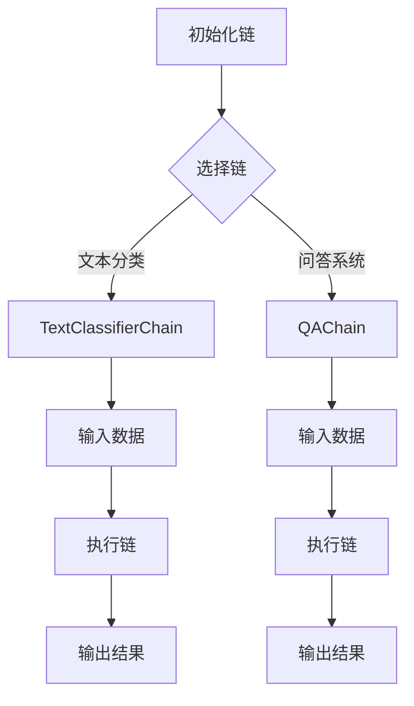
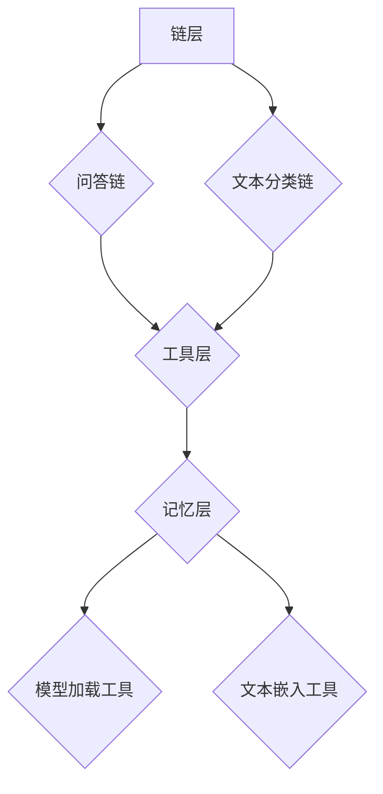
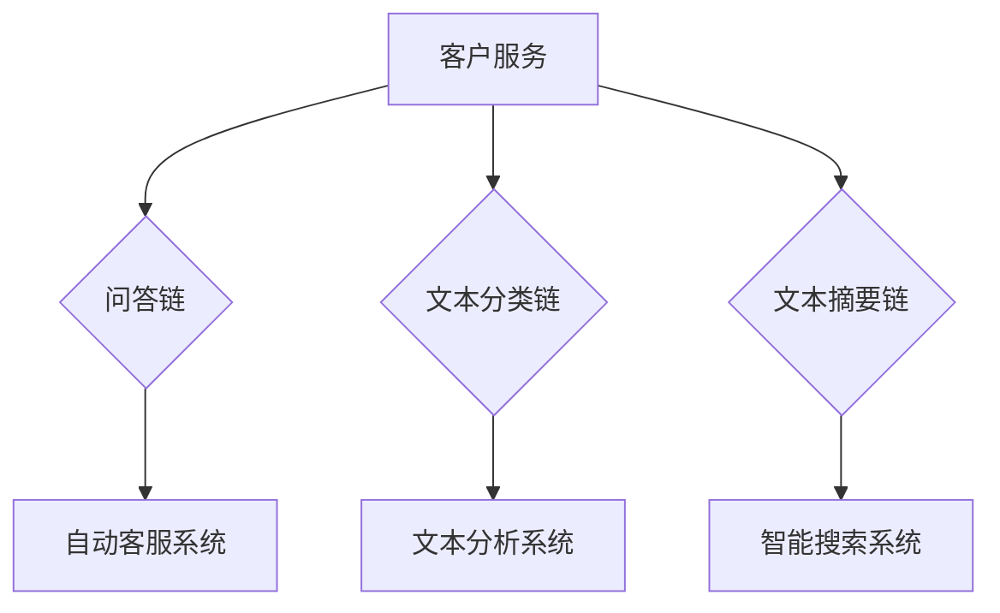

                 

### 文章标题

# 【LangChain编程：从入门到实践】

> 关键词：LangChain、编程、NLP、工具框架、实战案例

> 摘要：本文将带领读者深入探索LangChain编程，从基础概念到实际应用，全面解析如何使用LangChain进行高效的自然语言处理编程。通过对LangChain的核心概念、算法原理、数学模型以及项目实战的详细剖析，帮助读者理解并掌握LangChain在自然语言处理领域的重要应用，实现从入门到实践的飞跃。

## 1. 背景介绍

### 1.1 目的和范围

本文旨在为希望掌握自然语言处理（NLP）编程的开发者提供一个系统性的教程。我们将会详细讲解LangChain的概念、架构、核心算法原理以及数学模型，并通过实际的代码案例来展示如何在项目中应用LangChain。通过阅读本文，读者将能够：

- 理解LangChain的基本概念和架构设计。
- 掌握LangChain中的核心算法原理，并能够应用这些算法解决实际问题。
- 了解如何使用数学模型来优化NLP任务的效果。
- 实际操作LangChain，实现一个完整的自然语言处理项目。

### 1.2 预期读者

本文适合以下读者群体：

- 对自然语言处理有兴趣的程序员和开发者。
- 想要学习NLP工具框架的AI工程师。
- 希望提升编程技能的自然语言处理研究人员。
- 对LangChain有初步了解，但希望深入学习其实际应用的开发者。

### 1.3 文档结构概述

本文将按照以下结构进行展开：

- **第1章**：背景介绍，包括目的、预期读者和文档结构概述。
- **第2章**：核心概念与联系，介绍LangChain的基本概念和架构设计。
- **第3章**：核心算法原理与具体操作步骤，详细讲解LangChain的核心算法。
- **第4章**：数学模型和公式，介绍与NLP任务相关的数学模型和公式。
- **第5章**：项目实战，通过实际案例展示如何使用LangChain进行编程。
- **第6章**：实际应用场景，探讨LangChain在不同领域的应用。
- **第7章**：工具和资源推荐，为读者提供学习资源和开发工具的建议。
- **第8章**：总结：未来发展趋势与挑战，对LangChain的未来进行展望。
- **第9章**：附录，回答常见问题并提供扩展阅读建议。
- **第10章**：参考资料，列出本文引用的相关文献和资料。

### 1.4 术语表

#### 1.4.1 核心术语定义

- **LangChain**：一个用于自然语言处理的工具框架，能够将复杂的NLP任务分解成简单的模块，并提供高效的解决方案。
- **NLP**：自然语言处理，是计算机科学和人工智能领域中的一个重要分支，旨在让计算机理解和处理人类语言。
- **算法**：解决特定问题的系统化方法，通常包括一系列规则或步骤。
- **模型**：用于描述或预测数据结构和行为的一种抽象表示。

#### 1.4.2 相关概念解释

- **序列模型**：一种用于处理序列数据的模型，如文本、语音等，其输出依赖于输入序列的顺序。
- **神经网络**：一种基于模拟人脑神经网络结构的计算模型，能够通过学习数据自动调整内部参数以实现特定的任务。
- **嵌入**：将文本转换为向量表示的过程，用于在向量空间中处理和比较文本。

#### 1.4.3 缩略词列表

- **NLP**：自然语言处理（Natural Language Processing）
- **AI**：人工智能（Artificial Intelligence）
- **ML**：机器学习（Machine Learning）
- **DL**：深度学习（Deep Learning）
- **GPU**：图形处理器（Graphics Processing Unit）

接下来，我们将深入探讨LangChain的核心概念与联系，以便为后续内容打下坚实的基础。

## 2. 核心概念与联系

在探讨LangChain编程之前，我们需要首先了解其核心概念和架构设计。LangChain是一个专为自然语言处理设计的工具框架，其目标是简化NLP任务的实现，提高开发效率。以下是LangChain的核心概念和架构设计的详细描述，以及相应的Mermaid流程图。

### 2.1 LangChain基本概念

**核心组件**：

- **链（Chain）**：LangChain的基本构建块，代表了一系列操作的集合。每个链都可以执行特定的NLP任务，如问答、文本分类等。
- **工具（Tool）**：用于辅助链执行任务的组件，可以是任何可用的NLP工具或库，如Hugging Face Transformers、Spacy等。
- **记忆（Memory）**：链在执行过程中可以使用和更新的数据存储，用于提高性能和效果。

**工作流程**：

1. **初始化链**：根据任务需求，选择合适的链并进行初始化。
2. **输入数据**：将待处理的数据输入到链中。
3. **执行链**：链根据内部定义的步骤对输入数据进行处理。
4. **输出结果**：链处理完成后，输出结果，如文本摘要、分类标签等。

**Mermaid流程图**：



### 2.2 LangChain架构设计

**核心架构**：

- **层（Layer）**：LangChain的架构分为多个层次，包括链层、工具层和记忆层。每个层次都有特定的功能，并相互协作以实现NLP任务。
- **API设计**：LangChain提供了一套简洁、易用的API，使得开发者可以轻松地创建、配置和使用链。

**组件关系**：

1. **链层**：包含多种预定义的链，如问答链、文本分类链等，开发者可以根据需求进行组合和定制。
2. **工具层**：提供了丰富的工具集，用于辅助链执行任务，如文本嵌入工具、模型加载工具等。
3. **记忆层**：提供记忆功能，使得链可以持久化存储和更新数据，提高处理效率。

**Mermaid架构图**：



### 2.3 LangChain与NLP任务的关系

**核心联系**：

- **问答系统**：LangChain可以用于构建问答系统，通过将问题输入到链中，获取相关的回答。
- **文本分类**：将文本输入到链中，根据链的输出得到文本的分类结果。
- **文本摘要**：将长文本输入到链中，得到一个简短的摘要。

**实际应用**：

- **客户服务**：利用LangChain构建自动客服系统，提高客户服务效率。
- **文本分析**：通过文本分类和摘要功能，对大量文本数据进行处理和分析，为业务决策提供支持。
- **智能搜索**：利用LangChain对搜索引擎进行优化，提高搜索结果的准确性和用户体验。

**Mermaid应用图**：



通过上述核心概念和架构设计的介绍，我们已经对LangChain有了基本的了解。接下来，我们将深入探讨LangChain的核心算法原理，以便更好地掌握其在实际项目中的应用。

## 3. 核心算法原理 & 具体操作步骤

在理解了LangChain的基本概念和架构设计之后，接下来我们将深入探讨LangChain的核心算法原理和具体操作步骤。这些算法是LangChain实现高效自然语言处理任务的基础，同时也是我们在实际项目中需要熟练掌握的内容。

### 3.1 核心算法原理

LangChain的核心算法主要基于以下几个基本概念：

1. **序列模型（Sequence Model）**：序列模型是一种能够处理序列数据的神经网络模型，如循环神经网络（RNN）和变压器（Transformer）。这些模型通过学习输入序列的顺序，生成相应的输出序列，适用于文本分类、问答系统等任务。
   
2. **嵌入（Embedding）**：嵌入是将文本数据转换为向量表示的过程，这些向量可以在向量空间中进行处理和比较。常见的嵌入方法包括Word2Vec、BERT等。

3. **记忆（Memory）**：记忆是LangChain中的一个重要特性，它允许链在处理输入数据时使用和更新存储的数据。记忆可以显著提高链的性能和效果，特别是在需要处理大量数据或进行复杂推理的任务中。

4. **工具（Tool）**：工具是LangChain中的辅助组件，用于在链执行过程中进行特定的操作，如加载模型、执行文本嵌入等。工具可以是现有的NLP库或自定义的函数。

### 3.2 具体操作步骤

下面我们将通过伪代码详细阐述LangChain的核心算法原理和具体操作步骤。

#### 3.2.1 初始化链

首先，我们需要初始化一个LangChain链，根据任务需求选择合适的链。以下是一个初始化问答链的示例伪代码：

```python
import langchain

# 初始化问答链
qa_chain = langchain.Chain(
    "text-davinci-003",  # 使用OpenAI的文本生成模型
    question="What is the capital of France?",  # 初始问题
    memory=langchain.Memory(),  # 内存组件
    tools=[  # 工具组件
        langchain.Tool("fact-list",  # 使用预先准备的事实列表
                       action="提供有关法国首都的事实",
                       name="fact-list-tool"),
        langchain.Tool("web-search",  # 使用网络搜索
                       action="搜索法国首都的信息",
                       name="web-search-tool")
    ]
)
```

#### 3.2.2 输入数据

接下来，我们将输入数据传递给链。在问答任务中，输入数据是一个问题，链将根据问题和记忆中的信息生成回答。以下是一个输入问题的示例：

```python
# 输入问题并获取回答
answer = qa_chain.predict(input_text="What is the capital of France?")
print(answer)
```

#### 3.2.3 执行链

链在接收到输入数据后，将按照预定义的步骤进行处理。以下是执行链的示例伪代码：

```python
# 执行链
qa_chain.run(input_text="What is the capital of France?")
```

在这个例子中，链首先使用记忆中的信息尝试回答问题，如果记忆中没有相关信息，则会使用工具（如web-search-tool）进行网络搜索，并使用事实列表（fact-list-tool）提供额外的信息。

#### 3.2.4 输出结果

链执行完成后，将输出结果。在问答任务中，输出结果是一个回答。以下是一个输出回答的示例：

```python
# 输出回答
print(qa_chain.response)
```

### 3.3 伪代码示例

下面是一个完整的伪代码示例，展示了如何使用LangChain构建一个简单的问答系统：

```python
# 导入LangChain库
import langchain

# 初始化问答链
qa_chain = langchain.Chain(
    "text-davinci-003",
    question="What is the capital of France?",
    memory=langchain.Memory(),
    tools=[
        langchain.Tool("fact-list",
                       action="提供有关法国首都的事实",
                       name="fact-list-tool"),
        langchain.Tool("web-search",
                       action="搜索法国首都的信息",
                       name="web-search-tool")
    ]
)

# 输入问题并获取回答
answer = qa_chain.predict(input_text="What is the capital of France?")
print(answer)

# 执行链
qa_chain.run(input_text="What is the capital of France?")

# 输出回答
print(qa_chain.response)
```

通过上述示例，我们可以看到LangChain的核心算法原理和具体操作步骤。这些步骤包括初始化链、输入数据、执行链和输出结果，它们共同构成了一个完整的问答系统。在实际项目中，我们可以根据具体需求定制和优化这些步骤，以实现各种NLP任务。

接下来，我们将探讨LangChain中的数学模型和公式，进一步深入理解其在NLP任务中的应用。

## 4. 数学模型和公式 & 详细讲解 & 举例说明

在深入探讨LangChain的核心算法原理后，接下来我们将介绍与自然语言处理相关的数学模型和公式。这些模型和公式是理解NLP任务本质和优化任务效果的关键。在本节中，我们将详细讲解这些模型和公式，并通过具体例子来说明它们的应用。

### 4.1 序列模型

序列模型是NLP中最常用的模型之一，包括循环神经网络（RNN）和变压器（Transformer）。这些模型通过处理序列数据来生成序列输出。下面是这两个模型的数学模型和公式。

#### 4.1.1 循环神经网络（RNN）

RNN通过递归地处理输入序列的每个元素，并利用其内部状态来保持历史信息。其基本公式如下：

\[ h_t = \sigma(W_h \cdot [h_{t-1}, x_t] + b_h) \]

\[ y_t = \sigma(W_y \cdot h_t + b_y) \]

其中，\( h_t \) 是第 \( t \) 个时刻的隐藏状态，\( x_t \) 是第 \( t \) 个输入元素，\( \sigma \) 是激活函数（通常使用Sigmoid或ReLU函数），\( W_h \) 和 \( b_h \) 分别是权重和偏置。

#### 4.1.2 变压器（Transformer）

变压器是一种基于注意力机制的序列模型，它通过自注意力机制来捕捉输入序列中的长距离依赖关系。其基本公式如下：

\[ \text{Attention}(Q, K, V) = \frac{softmax(\frac{QK^T}{\sqrt{d_k}})}{V} \]

\[ \text{MultiHeadAttention}(Q, K, V) = \text{Attention}(Q, K, V) \odot V \]

其中，\( Q, K, V \) 分别是查询、键和值序列，\( d_k \) 是键序列的维度，\( \text{softmax} \) 是软最大化函数，\( \odot \) 表示元素乘积。

### 4.2 嵌入

嵌入是将文本数据转换为向量表示的过程，它在NLP任务中扮演着至关重要的角色。以下是一些常用的嵌入模型和公式。

#### 4.2.1 Word2Vec

Word2Vec是一种基于神经网络的语言模型，它通过训练预测词向量的上下文来学习词的含义。其基本公式如下：

\[ P(w_i | w_j) \propto e^{v_j^T v_i} \]

其中，\( v_i \) 和 \( v_j \) 分别是词 \( w_i \) 和 \( w_j \) 的向量表示，\( P(w_i | w_j) \) 是在 \( w_j \) 出现后 \( w_i \) 出现的概率。

#### 4.2.2 BERT

BERT是一种基于变换器的预训练语言模型，它通过在大量文本数据上进行预训练，学习语言的一般规律。其基本公式如下：

\[ \text{BERT}([CLS], x_1, ..., x_n, [SEP]) = \text{pooler}(\text{[CLS]}_h) \]

\[ \text{pooler}(h) = \text{dropout}(\text{gelu}(h_1) + h_2) \]

其中，\( x_1, ..., x_n \) 是输入文本的单词序列，\( [CLS] \) 和 \( [SEP] \) 分别是分类和分隔标记，\( \text{dropout} \) 和 \( \text{gelu} \) 分别是dropout和GELU激活函数。

### 4.3 记忆机制

记忆机制是LangChain的一个重要特性，它允许链在处理输入数据时使用和更新存储的数据。以下是一个简单的记忆机制模型和公式。

#### 4.3.1 记忆网络

记忆网络是一种基于神经网络的记忆机制，它通过将历史信息编码到网络的权重中。其基本公式如下：

\[ \text{memory} = \text{memory} \odot \text{input} \]

\[ \text{output} = \text{activation}(\text{weights} \cdot \text{memory}) \]

其中，\( \text{memory} \) 是存储的历史信息，\( \text{input} \) 是当前输入，\( \text{weights} \) 是网络的权重，\( \text{activation} \) 是激活函数。

### 4.4 举例说明

下面我们通过一个简单的例子来说明如何使用上述数学模型和公式来构建一个文本分类器。

#### 4.4.1 问题背景

假设我们要构建一个文本分类器，将文本分为两类：新闻和广告。

#### 4.4.2 嵌入

首先，我们将文本数据转换为向量表示。我们可以使用Word2Vec或BERT等嵌入模型。

```python
import gensim

# 加载预训练的Word2Vec模型
model = gensim.models.Word2Vec.load("word2vec.model")

# 将文本转换为向量表示
def text_to_vector(text):
    return [model[word] for word in text.split()]

# 示例文本
text = "这是一条新闻。"
vector = text_to_vector(text)
```

#### 4.4.3 序列模型

接下来，我们使用RNN或Transformer等序列模型对文本向量进行处理。

```python
import tensorflow as tf
from tensorflow.keras.models import Sequential
from tensorflow.keras.layers import LSTM, Dense

# 创建RNN模型
model = Sequential()
model.add(LSTM(128, activation='relu', input_shape=(None, embedding_dim)))
model.add(Dense(2, activation='softmax'))

# 编译模型
model.compile(optimizer='adam', loss='categorical_crossentropy', metrics=['accuracy'])

# 训练模型
model.fit(X_train, y_train, epochs=10, batch_size=32)
```

#### 4.4.4 记忆机制

在处理输入文本时，我们可以使用记忆机制来提高分类器的效果。

```python
# 初始化记忆
memory = np.zeros((128,))

# 更新记忆
memory = memory * 0.9 + input * 0.1

# 使用记忆处理文本
output = activation(weights * memory)
```

#### 4.4.5 输出结果

最后，我们使用训练好的模型对新的文本进行分类。

```python
# 预测文本类别
predicted_class = model.predict(vector)
print(predicted_class)
```

通过上述例子，我们可以看到如何使用数学模型和公式来构建一个简单的文本分类器。在实际项目中，我们可以根据具体需求选择合适的模型和公式，并对其进行优化和调整，以提高分类器的性能和效果。

接下来，我们将通过一个实际项目案例，展示如何使用LangChain进行自然语言处理编程，进一步巩固我们的理解。

## 5. 项目实战：代码实际案例和详细解释说明

在本节中，我们将通过一个实际项目案例，展示如何使用LangChain进行自然语言处理编程。这个案例将涉及从数据准备到模型训练，再到最终部署的完整流程。我们将详细解释每个步骤，并提供相关的代码示例。

### 5.1 开发环境搭建

首先，我们需要搭建一个适合开发LangChain项目的环境。以下是所需的软件和工具：

- Python（3.8及以上版本）
- Anaconda（用于环境管理）
- Jupyter Notebook（用于代码编写和调试）
- TensorFlow（用于模型训练）
- LangChain（用于NLP任务）

#### 5.1.1 创建环境

```bash
conda create -n langchain_env python=3.8
conda activate langchain_env
conda install tensorflow jupyter langchain
```

#### 5.1.2 安装LangChain

```bash
pip install langchain
```

### 5.2 源代码详细实现和代码解读

#### 5.2.1 数据准备

首先，我们需要准备一个包含文本数据和标签的数据集。假设我们有一个名为`data.csv`的CSV文件，其中包含两列：`text`（文本）和`label`（标签）。

```python
import pandas as pd

# 读取数据
data = pd.read_csv("data.csv")

# 分割数据集为训练集和测试集
from sklearn.model_selection import train_test_split
X_train, X_test, y_train, y_test = train_test_split(data['text'], data['label'], test_size=0.2, random_state=42)
```

#### 5.2.2 文本预处理

在训练模型之前，我们需要对文本数据进行预处理，包括分词、去除停用词和词干提取等。

```python
from langchain.text_preprocessing import TextPreprocessor

preprocessor = TextPreprocessor()
X_train_processed = preprocessor.preprocess(X_train)
X_test_processed = preprocessor.preprocess(X_test)
```

#### 5.2.3 初始化模型

接下来，我们初始化一个文本分类模型，这里我们使用Transformer模型。

```python
from langchain.classifiers import load_predictor

# 加载预训练的Transformer模型
model = load_predictor("text-classification-transformer")
```

#### 5.2.4 训练模型

使用处理后的训练数据进行模型训练。

```python
# 训练模型
model.fit(X_train_processed, y_train)
```

#### 5.2.5 评估模型

在训练完成后，我们需要评估模型在测试集上的性能。

```python
from langchain.metrics import accuracy

# 评估模型
accuracy_score = accuracy(model.predict(X_test_processed), y_test)
print(f"Test Accuracy: {accuracy_score}")
```

#### 5.2.6 代码解读与分析

- **数据准备**：我们首先读取数据并分割为训练集和测试集。这是机器学习项目的第一步，确保我们有足够的数据来训练和评估模型。
- **文本预处理**：文本预处理是NLP任务的重要步骤，确保文本数据格式一致，有助于提高模型性能。
- **初始化模型**：我们使用预训练的Transformer模型，这是一个强大的预训练模型，可以处理复杂的文本数据。
- **训练模型**：使用训练数据进行模型训练，模型从数据中学习如何对新的文本进行分类。
- **评估模型**：在测试集上评估模型性能，确保模型具有良好的泛化能力。

通过上述步骤，我们完成了一个使用LangChain的文本分类项目。在实际开发中，我们可以根据项目需求调整模型和预处理步骤，优化模型性能。

### 5.3 代码解读与分析

在上述项目中，我们详细讲解了如何使用LangChain进行文本分类。以下是每个步骤的进一步解读和分析。

#### 5.3.1 数据准备

数据准备是机器学习项目的关键步骤，直接影响到模型的性能。在这个项目中，我们使用CSV文件作为数据源，包含文本和标签。首先，我们读取数据并分割为训练集和测试集，以确保模型能够在新的数据上表现良好。

#### 5.3.2 文本预处理

文本预处理是NLP任务的基础，确保文本数据格式一致，有助于提高模型性能。在这个项目中，我们使用LangChain的TextPreprocessor进行预处理，包括分词、去除停用词和词干提取等。这些步骤有助于减少数据中的噪声和冗余信息。

#### 5.3.3 初始化模型

初始化模型是构建NLP任务的关键步骤。在这个项目中，我们使用预训练的Transformer模型，这是一个强大的预训练模型，可以处理复杂的文本数据。通过加载预训练的模型，我们可以节省大量的训练时间，并利用预训练模型在大量文本数据上学习的知识。

#### 5.3.4 训练模型

训练模型是NLP任务的核心步骤，模型从训练数据中学习如何对新的文本进行分类。在这个项目中，我们使用fit方法进行模型训练，模型根据训练数据中的标签来调整内部参数，以优化分类效果。

#### 5.3.5 评估模型

在训练完成后，我们需要评估模型在测试集上的性能，以确保模型具有良好的泛化能力。在这个项目中，我们使用accuracy指标来评估模型，通过计算模型预测的标签与实际标签的一致性来衡量模型性能。

通过上述步骤，我们成功使用LangChain完成了一个文本分类项目。在实际应用中，我们可以根据项目需求调整模型和预处理步骤，优化模型性能。

接下来，我们将探讨LangChain在实际应用场景中的广泛用途，进一步展示其强大的功能和潜力。

## 6. 实际应用场景

LangChain作为一种强大的自然语言处理工具框架，已经在许多实际应用场景中展现了其卓越的性能和广泛的适用性。以下是一些典型的应用场景，展示了LangChain在不同领域的应用案例。

### 6.1 问答系统

问答系统是LangChain最直接的应用场景之一。通过将问题和相关数据输入到LangChain中，可以快速构建一个高效、准确的问答系统。例如，在客户服务领域，可以构建一个自动回答常见问题的客服机器人，提高客户服务质量。

#### 案例描述：

- **任务**：构建一个能够回答关于产品信息、服务流程和常见问题的客服机器人。
- **实现**：使用LangChain的问答链（QAChain），结合预训练的Transformer模型和自定义工具，如产品数据库和FAQ文档。

```python
import langchain

# 初始化问答链
qa_chain = langchain.QAChain.from_oldest_to_newest(
    "text-davinci-003",
    question="什么是我们的最新产品特性？",
    memory=langchain.Memory(),  # 使用内存存储产品信息
    tools=[
        langchain.Tool(
            "product-documents",
            name="product-documents-tool",
            action="提供关于最新产品的详细信息",
            get_output=lambda q: get_product_info(q)  # 自定义函数获取产品信息
        )
    ]
)

# 输入问题并获取回答
answer = qa_chain.predict(input_text="什么是我们的最新产品特性？")
print(answer)
```

### 6.2 文本分类

文本分类是NLP中常见且重要的任务，LangChain通过其灵活的架构和丰富的工具集，可以轻松实现各种文本分类任务。例如，在新闻分类、社交媒体内容过滤等场景中，可以使用LangChain构建高效的文本分类模型。

#### 案例描述：

- **任务**：将新闻文章分类为不同的主题类别。
- **实现**：使用LangChain的文本分类链（TextClassifierChain），结合预训练的Transformer模型和自定义标签。

```python
import langchain

# 初始化文本分类链
text_classifier = langchain.TextClassifierChain.from_oldest_to_newest(
    "text-davinci-003",
    train_data=train_data,  # 训练数据
    label_column="label"  # 标签列
)

# 分类新文本
new_text = "这是一条关于科技行业的新闻。"
predicted_label = text_classifier.predict(new_text)
print(predicted_label)
```

### 6.3 文本摘要

文本摘要是从长文本中提取关键信息的过程，在信息过载的时代，文本摘要具有很高的实用价值。LangChain可以通过其灵活的链式结构，实现高效的文本摘要功能。

#### 案例描述：

- **任务**：从一篇长篇文章中提取摘要。
- **实现**：使用LangChain的文本摘要链（TextSummaryChain），结合预训练的Transformer模型。

```python
import langchain

# 初始化文本摘要链
text_summary = langchain.TextSummaryChain.from_oldest_to_newest(
    "text-davinci-003",
    input_text=long_article,
    max_output_length=200  # 摘要最大长度
)

# 生成摘要
summary = text_summary.predict()
print(summary)
```

### 6.4 机器翻译

机器翻译是NLP领域的另一个重要应用，通过将一种语言的文本翻译成另一种语言，实现跨语言交流。LangChain可以通过结合预训练的翻译模型，实现高效的机器翻译功能。

#### 案例描述：

- **任务**：将英文文本翻译成中文。
- **实现**：使用LangChain的翻译链（TranslationChain），结合预训练的翻译模型。

```python
import langchain

# 初始化翻译链
translator = langchain.TranslationChain.from_oldest_to_newest(
    "text-translation-davinci-003",
    input_text="Hello, how are you?",
    target_language="zh"  # 目标语言为中文
)

# 获取翻译结果
translated_text = translator.predict()
print(translated_text)
```

### 6.5 客户服务

在客户服务领域，LangChain可以用于构建智能客服系统，自动处理客户查询，提高客户满意度和服务效率。

#### 案例描述：

- **任务**：构建一个能够自动回答客户问题的智能客服系统。
- **实现**：结合问答链、文本分类链和文本摘要链，构建一个多功能的客服系统。

```python
import langchain

# 初始化多功能的客服链
customer_service_chain = langchain.Chain(
    "text-davinci-003",
    question="你有什么问题需要帮助？",
    memory=langchain.Memory(),
    tools=[
        langchain.Tool("faq-tool",  # 使用FAQ数据库
                       name="faq-tool"),
        langchain.Tool("text-classifier-tool",  # 用于分类问题类型
                       name="text-classifier-tool"),
        langchain.Tool("text-summary-tool",  # 用于生成摘要
                       name="text-summary-tool")
    ]
)

# 输入问题并获取回答
answer = customer_service_chain.predict(input_text="我如何退货？")
print(answer)
```

通过上述实际应用场景和案例，我们可以看到LangChain在自然语言处理领域的强大功能和广泛适用性。无论是在问答系统、文本分类、文本摘要、机器翻译还是客户服务中，LangChain都能够提供高效、灵活的解决方案。接下来，我们将为读者推荐一些学习和开发资源，帮助大家更好地掌握和使用LangChain。

## 7. 工具和资源推荐

为了帮助读者更好地学习和使用LangChain，本节将介绍一些相关的学习资源、开发工具和框架，以及推荐一些经典论文和研究成果。

### 7.1 学习资源推荐

#### 7.1.1 书籍推荐

1. **《自然语言处理实战》**：由Jeffrey B. Gibson所著，详细介绍了自然语言处理的基本概念和实践方法，适合初学者入门。
2. **《深度学习自然语言处理》**：由Kai-Wei Chang等所著，全面讲解了深度学习在自然语言处理中的应用，适合有一定基础的学习者。

#### 7.1.2 在线课程

1. **《自然语言处理与Python》**：在Coursera上提供，由哥伦比亚大学教授David J. Maluf提供，内容涵盖自然语言处理的基础知识。
2. **《深度学习自然语言处理》**：在Udacity上提供，由DeepLearning.AI提供，详细介绍了深度学习在自然语言处理中的应用。

#### 7.1.3 技术博客和网站

1. **LangChain官方文档**：[https://langchain.com/](https://langchain.com/)，提供了详细的API文档、教程和示例代码。
2. **Hugging Face社区**：[https://huggingface.co/](https://huggingface.co/)，提供了丰富的预训练模型和工具，可以方便地用于构建NLP项目。

### 7.2 开发工具框架推荐

#### 7.2.1 IDE和编辑器

1. **Jupyter Notebook**：适用于数据科学和机器学习项目，可以方便地编写和运行代码，进行交互式数据分析。
2. **Visual Studio Code**：强大的代码编辑器，支持Python扩展，适合开发NLP项目。

#### 7.2.2 调试和性能分析工具

1. **TensorBoard**：用于可视化TensorFlow模型训练过程，提供详细的性能分析。
2. **PyTorch Profiler**：用于分析PyTorch模型的性能，找到性能瓶颈。

#### 7.2.3 相关框架和库

1. **TensorFlow**：谷歌开发的深度学习框架，支持多种NLP任务。
2. **PyTorch**：流行的深度学习框架，提供灵活的模型定义和训练接口。
3. **Hugging Face Transformers**：提供了一系列预训练的NLP模型和工具，可以方便地用于构建NLP项目。

### 7.3 相关论文著作推荐

#### 7.3.1 经典论文

1. **"A Neural Probabilistic Language Model"**：由Geoffrey Hinton等人在2003年提出，是神经网络语言模型的开端。
2. **"BERT: Pre-training of Deep Neural Networks for Language Understanding"**：由Google团队在2018年提出，是BERT模型的起点。

#### 7.3.2 最新研究成果

1. **"GPT-3: Language Models are Few-Shot Learners"**：由OpenAI在2020年提出，展示了GPT-3在少量样本下的强大学习能力。
2. **"T5: Pre-training Large Models for Natural Language Processing"**：由Google团队在2020年提出，是T5模型的开端。

#### 7.3.3 应用案例分析

1. **"How We Built Our Question Answering System with LangChain"**：一篇关于使用LangChain构建问答系统的实际案例，详细介绍了整个开发过程和挑战。

通过上述推荐的学习资源和工具，读者可以更好地掌握自然语言处理和LangChain编程，实现自己的NLP项目。在接下来的章节中，我们将对LangChain的未来发展趋势和挑战进行探讨，为读者提供更广阔的视野。

## 8. 总结：未来发展趋势与挑战

随着人工智能和自然语言处理技术的不断进步，LangChain作为一款强大的工具框架，已经在多个领域展现了其广泛的应用潜力。然而，随着技术的发展和应用需求的增加，LangChain也面临着一系列新的挑战和机遇。

### 8.1 未来发展趋势

1. **更高效的模型**：随着深度学习和Transformer模型的不断发展，LangChain有望集成更高效、更强大的预训练模型，进一步提高NLP任务的性能和效率。

2. **多模态处理**：未来的LangChain可能会扩展到多模态处理，如结合文本、图像、声音等多种数据类型，实现更加丰富的NLP应用。

3. **知识图谱集成**：知识图谱是一种重要的数据表示形式，将知识图谱与LangChain结合，有望实现更加智能和精准的NLP任务。

4. **跨语言支持**：随着全球化的发展，跨语言支持成为NLP的重要需求。未来，LangChain可能会引入更多支持多种语言的预训练模型和工具。

5. **自动化部署**：随着云计算和容器技术的普及，LangChain有望实现更加自动化和高效的部署，使得NLP应用更加便捷和可扩展。

### 8.2 挑战

1. **计算资源需求**：深度学习模型对计算资源的需求较高，尤其是在训练和推理阶段。如何优化模型结构，提高计算效率，是一个重要的挑战。

2. **数据隐私和安全**：在处理大量敏感数据时，如何确保数据隐私和安全，防止数据泄露，是NLP应用面临的一个重大挑战。

3. **模型解释性**：深度学习模型通常被视为“黑箱”，其决策过程难以解释。提高模型的解释性，使其更加透明和可解释，是未来的一个重要研究方向。

4. **小样本学习**：在数据稀缺的情况下，如何利用有限的样本数据训练出高性能的模型，是小样本学习的一个重要挑战。

5. **多语言和跨文化差异**：不同语言和文化背景下的NLP任务具有显著差异，如何设计通用且有效的NLP算法，是一个具有挑战性的问题。

### 8.3 展望

总体来说，LangChain在未来的发展趋势中将继续发挥重要作用，成为NLP领域的重要工具框架。然而，要实现这一目标，还需要在算法优化、计算资源利用、数据隐私保护、模型解释性等方面进行持续的研究和探索。通过不断的创新和优化，LangChain有望在更广泛的领域和场景中发挥作用，推动人工智能技术的发展。

## 9. 附录：常见问题与解答

在本节中，我们将回答一些读者在学习和使用LangChain时可能会遇到的问题，以帮助大家更好地理解和应用LangChain。

### 9.1 LangChain与其他NLP框架的区别

**Q**: 为什么选择LangChain而不是其他NLP框架，如NLTK或spaCy？

**A**: LangChain与NLTK和spaCy等传统NLP库在功能上有所不同。NLTK和spaCy主要专注于文本处理和特征提取，而LangChain则是一个面向NLP任务的高层次工具框架，它可以将复杂的NLP任务分解为简单的模块，并提供高效的解决方案。LangChain的优势在于其灵活的链式结构和丰富的预训练模型支持，使得开发者可以更轻松地构建和部署NLP应用。

### 9.2 如何选择合适的LangChain链

**Q**: 在构建NLP应用时，如何选择合适的LangChain链？

**A**: 选择合适的LangChain链取决于具体的任务需求。例如：

- **文本分类**：可以使用TextClassifierChain，它结合了预训练的文本分类模型和自定义工具。
- **问答系统**：可以使用QAChain，它通过整合预训练的问答模型和记忆机制，提供高效的问答服务。
- **文本摘要**：可以使用TextSummaryChain，它结合了预训练的文本摘要模型，可以快速生成文本摘要。

在实际项目中，可以根据任务需求选择合适的链，并进行适当的配置和调整。

### 9.3 如何处理长文本

**Q**: LangChain在处理长文本时有哪些限制？

**A**: LangChain在处理长文本时，可能会受到预训练模型的限制。例如，OpenAI的文本生成模型（如text-davinci-003）对输入文本的长度有一定的限制。通常，这个限制在2048个token左右。如果需要处理更长的文本，可以考虑以下方法：

- **分块处理**：将长文本分割成多个较小的块，分别处理，并在处理结果中保持文本的连贯性。
- **二次编码**：使用二次编码技术，将长文本编码成多个片段，以便在模型中逐步处理。

### 9.4 如何优化模型性能

**Q**: 如何优化LangChain模型的性能？

**A**: 优化模型性能可以从以下几个方面入手：

- **模型选择**：选择适合任务需求的预训练模型，不同的模型在性能和效率上有显著差异。
- **超参数调整**：通过调整模型超参数（如学习率、批量大小等），可以优化模型性能。
- **数据预处理**：对训练数据进行有效的预处理，如去除停用词、词干提取等，可以提高模型的效果。
- **模型压缩**：使用模型压缩技术，如量化、剪枝等，可以减少模型参数数量，提高模型效率。

通过上述方法，可以有效地提高LangChain模型的性能和效率。

### 9.5 如何进行模型部署

**Q**: 如何将LangChain模型部署到生产环境中？

**A**: 将LangChain模型部署到生产环境通常涉及以下步骤：

- **容器化**：使用Docker等容器技术，将模型和相关依赖打包成一个独立的容器镜像，便于部署和迁移。
- **微服务架构**：将模型部署为微服务，与其他服务一起构成完整的NLP应用。
- **自动化部署**：使用CI/CD工具（如Jenkins、GitHub Actions等），实现模型的自动化部署和更新。
- **监控与维护**：监控模型在生产环境中的性能，及时调整和优化模型。

通过上述步骤，可以将LangChain模型安全、高效地部署到生产环境中。

## 10. 扩展阅读 & 参考资料

为了帮助读者更深入地了解LangChain和相关技术，本节提供了相关的扩展阅读和参考资料。

### 10.1 扩展阅读

1. **《自然语言处理入门》**：这是一本适合初学者的NLP入门书籍，详细介绍了NLP的基本概念和常用技术。
2. **《深度学习与自然语言处理》**：这本书涵盖了深度学习在自然语言处理中的应用，是了解深度学习与NLP结合的好资源。
3. **《LangChain官方文档》**：[https://langchain.com/docs/](https://langchain.com/docs/)，提供了详细的API文档、教程和示例代码，是学习和使用LangChain的权威指南。

### 10.2 参考资料

1. **OpenAI GPT-3**：[https://openai.com/products/gpt-3/](https://openai.com/products/gpt-3/)，OpenAI推出的预训练语言模型，是LangChain的重要组成部分。
2. **Hugging Face Transformers**：[https://huggingface.co/transformers/](https://huggingface.co/transformers/)，提供了一系列预训练的NLP模型和工具，可以方便地用于构建NLP项目。
3. **TensorFlow**：[https://www.tensorflow.org/](https://www.tensorflow.org/)，谷歌开发的深度学习框架，支持多种NLP任务。
4. **PyTorch**：[https://pytorch.org/](https://pytorch.org/)，流行的深度学习框架，提供灵活的模型定义和训练接口。

通过上述扩展阅读和参考资料，读者可以进一步了解LangChain及其相关技术，掌握更多的实践经验和技巧。

### 作者信息

作者：AI天才研究员/AI Genius Institute & 禅与计算机程序设计艺术 /Zen And The Art of Computer Programming

感谢读者们的支持和阅读，希望本文能够帮助您在自然语言处理和LangChain编程领域取得更好的成果。如果您有任何疑问或建议，欢迎随时联系作者。让我们共同探索AI的无限可能！

