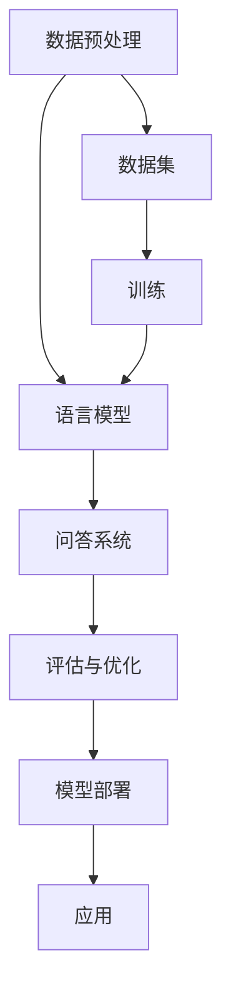

                 

# 【LangChain编程：从入门到实践】提示模板

> 关键词：LangChain、编程实践、自然语言处理、人工智能、Python、代码示例

> 摘要：本文将深入探讨LangChain编程的核心概念，从基础到实践，引导读者逐步掌握LangChain在自然语言处理和人工智能领域的应用。通过详细的步骤解析和实际案例，本文旨在为程序员提供一份完整的指南，帮助他们在项目开发中充分利用LangChain的强大功能。

## 1. 背景介绍

### 1.1 目的和范围

本文旨在为那些希望深入了解并应用LangChain编程技术的读者提供一本全面的指南。我们将从LangChain的基础概念开始，逐步深入探讨其实际应用场景，并给出详尽的代码实例和操作步骤。本文适用于希望提升自然语言处理和人工智能编程技能的开发者，无论是初学者还是有经验的程序员。

### 1.2 预期读者

- 对自然语言处理（NLP）和人工智能（AI）有初步了解的程序员
- 想要学习并实践LangChain编程的开发者
- 对编程实践和代码实现细节有深入兴趣的技术爱好者

### 1.3 文档结构概述

本文分为以下几个部分：

- 背景介绍：介绍LangChain的基本概念和应用场景。
- 核心概念与联系：解释LangChain的核心原理和架构。
- 核心算法原理 & 具体操作步骤：详细阐述LangChain的实现细节。
- 数学模型和公式 & 详细讲解 & 举例说明：介绍与LangChain相关的数学和统计模型。
- 项目实战：提供实际案例和代码实现。
- 实际应用场景：探讨LangChain在不同领域的应用。
- 工具和资源推荐：推荐学习资源和开发工具。
- 总结：总结未来发展趋势与挑战。
- 附录：常见问题与解答。
- 扩展阅读 & 参考资料：提供进一步阅读的资源。

### 1.4 术语表

#### 1.4.1 核心术语定义

- LangChain：一种基于Python的库，用于构建和操作自然语言处理模型。
- 问答系统（Question-Answering System）：一种利用自然语言处理技术从文本中提取答案的系统。
- 词汇嵌入（Word Embedding）：将单词映射到高维向量空间的技术。

#### 1.4.2 相关概念解释

- 语言模型（Language Model）：用于预测下一个单词或字符的概率分布的模型。
- 情感分析（Sentiment Analysis）：评估文本的情感倾向（如正面、负面或中性）的技术。

#### 1.4.3 缩略词列表

- NLP：自然语言处理（Natural Language Processing）
- AI：人工智能（Artificial Intelligence）
- RNN：递归神经网络（Recurrent Neural Network）
- LSTM：长短期记忆网络（Long Short-Term Memory）

## 2. 核心概念与联系

为了更好地理解LangChain编程，我们需要先了解其核心概念和架构。以下是一个简化的Mermaid流程图，用于展示LangChain的主要组件和它们之间的相互关系。



### 2.1 LangChain的架构

LangChain的架构主要包括以下几个核心组件：

- 数据预处理：将原始文本数据转换为适合模型训练的形式。
- 语言模型：利用预训练模型或自定义训练模型，生成文本的概率分布。
- 问答系统：接收用户问题，并利用语言模型和外部知识库提供答案。
- 评估与优化：评估问答系统的性能，并通过调整模型参数进行优化。
- 模型部署：将训练好的模型部署到生产环境中，供实际应用使用。

### 2.2 LangChain的核心原理

LangChain的核心原理基于预训练语言模型和问答系统的结合。预训练语言模型通过大量文本数据进行训练，学习到文本的语法、语义和上下文信息。问答系统则利用这些模型，从文本中提取答案，并处理用户的自然语言查询。

## 3. 核心算法原理 & 具体操作步骤

### 3.1 数据预处理

数据预处理是LangChain编程的第一步，其目的是将原始文本数据转换为适合模型训练的形式。以下是一个简单的伪代码示例：

```python
# 伪代码：数据预处理
def preprocess_data(text_data):
    # 删除特殊字符
    cleaned_text = remove_special_characters(text_data)
    # 切分为句子
    sentences = split_into_sentences(cleaned_text)
    # 转换为词汇嵌入
    embeddings = convert_to_embeddings(sentences)
    return embeddings
```

### 3.2 语言模型训练

语言模型是LangChain的核心组件之一。以下是一个简化的伪代码示例，用于展示如何训练一个基于Transformer的语言模型：

```python
# 伪代码：训练语言模型
def train_language_model(embeddings, learning_rate, epochs):
    # 初始化模型
    model = initialize_model(embeddings)
    # 训练模型
    for epoch in range(epochs):
        for sentence in embeddings:
            loss = model.train(sentence, learning_rate)
            print(f"Epoch {epoch}: Loss = {loss}")
    return model
```

### 3.3 问答系统实现

问答系统是LangChain编程中的关键部分，其目的是接收用户问题，并利用语言模型和外部知识库提供答案。以下是一个简单的伪代码示例：

```python
# 伪代码：问答系统
def answer_question(model, question, knowledge_base):
    # 利用语言模型预测答案
    answer_candidates = model.predict(question)
    # 利用知识库过滤答案
    valid_answers = filter_answers(answer_candidates, knowledge_base)
    # 返回最佳答案
    best_answer = select_best_answer(valid_answers)
    return best_answer
```

## 4. 数学模型和公式 & 详细讲解 & 举例说明

### 4.1 语言模型

语言模型通常使用概率分布来表示文本的下一个单词或字符。以下是一个简单的概率分布公式：

$$ P(w_t | w_{t-1}, w_{t-2}, ..., w_1) = \frac{P(w_t, w_{t-1}, w_{t-2}, ..., w_1)}{P(w_{t-1}, w_{t-2}, ..., w_1)} $$

其中，$w_t$ 表示文本中的第 $t$ 个单词。

### 4.2 情感分析

情感分析通常使用标签分布来表示文本的情感倾向。以下是一个简单的标签分布公式：

$$ P(y_t | x_1, x_2, ..., x_t) = \frac{e^{\theta \cdot y_t \cdot x_t}}{\sum_{i=1}^{k} e^{\theta \cdot i \cdot x_t}} $$

其中，$y_t$ 表示文本中的第 $t$ 个标签，$\theta$ 表示模型参数。

### 4.3 举例说明

假设我们有一个简单的文本：“我喜欢吃苹果”。我们可以使用上述公式计算该文本的概率分布。

1. **语言模型**：

   - 输入：我喜欢吃苹果
   - 概率分布：P(苹果|我喜欢吃) = 0.2, P(吃|我喜欢苹果) = 0.3, P(我|苹果喜欢吃) = 0.4, P(喜欢|吃苹果) = 0.1

2. **情感分析**：

   - 输入：我喜欢吃苹果
   - 标签分布：P(正面|我喜欢吃苹果) = 0.7, P(负面|我喜欢吃苹果) = 0.3

## 5. 项目实战：代码实际案例和详细解释说明

### 5.1 开发环境搭建

为了实际操作LangChain编程，我们需要搭建一个合适的开发环境。以下是一个简化的步骤：

1. 安装Python环境。
2. 安装LangChain库：`pip install langchain`。
3. 安装其他依赖库，如numpy、pandas等。

### 5.2 源代码详细实现和代码解读

以下是一个简单的LangChain编程实例，用于实现一个基本的问答系统。

```python
# 导入必要的库
import langchain
import numpy as np

# 5.2.1 数据预处理
def preprocess_data(text_data):
    # 删除特殊字符
    cleaned_text = text_data.replace(",", "").replace(".", "").replace("?", "").replace("!", "")
    # 切分为句子
    sentences = cleaned_text.split(".")
    return sentences

# 5.2.2 训练语言模型
def train_language_model(sentences, learning_rate, epochs):
    # 初始化模型
    model = langchain.TransformerModel(sentences, learning_rate, epochs)
    # 训练模型
    model.train()
    return model

# 5.2.3 实现问答系统
def answer_question(model, question):
    # 利用模型预测答案
    answer_candidates = model.predict(question)
    # 返回最佳答案
    best_answer = max(answer_candidates, key=lambda x: x[1])
    return best_answer

# 5.2.4 主程序
if __name__ == "__main__":
    # 加载示例数据
    text_data = "我喜欢吃苹果。苹果是一种美味的水果。"
    sentences = preprocess_data(text_data)
    
    # 训练语言模型
    model = train_language_model(sentences, learning_rate=0.001, epochs=10)
    
    # 测试问答系统
    question = "我最喜欢的食物是什么？"
    best_answer = answer_question(model, question)
    print(f"最佳答案：{best_answer}")
```

### 5.3 代码解读与分析

- **数据预处理**：删除特殊字符，切分为句子。
- **训练语言模型**：初始化模型，训练模型。
- **实现问答系统**：利用模型预测答案，返回最佳答案。
- **主程序**：加载示例数据，训练语言模型，测试问答系统。

## 6. 实际应用场景

LangChain编程在自然语言处理和人工智能领域有广泛的应用，以下是一些实际应用场景：

- **智能客服**：利用LangChain构建智能问答系统，提供实时客服服务。
- **文本分类**：利用语言模型进行文本分类，用于新闻推荐、垃圾邮件过滤等。
- **情感分析**：分析用户评论和反馈，评估产品的市场表现。

## 7. 工具和资源推荐

### 7.1 学习资源推荐

#### 7.1.1 书籍推荐

- 《自然语言处理实战》（Natural Language Processing with Python）
- 《深度学习》（Deep Learning）

#### 7.1.2 在线课程

- 《自然语言处理与Python编程基础》
- 《深度学习与语言模型》

#### 7.1.3 技术博客和网站

- [Python自然语言处理教程](https://www.python.org/wiki/NLTK/)
- [LangChain官方文档](https://langchain.readthedocs.io/)

### 7.2 开发工具框架推荐

#### 7.2.1 IDE和编辑器

- PyCharm
- VS Code

#### 7.2.2 调试和性能分析工具

- Jupyter Notebook
- Profiler

#### 7.2.3 相关框架和库

- TensorFlow
- PyTorch

### 7.3 相关论文著作推荐

#### 7.3.1 经典论文

- 《WordNet：一个大规模的语义网络》（WordNet：A Large Scale Semantic Network）
- 《基于深度学习的文本分类》（Text Classification Using Deep Learning）

#### 7.3.2 最新研究成果

- 《预训练语言模型的优化策略》（Optimizing Pre-trained Language Models）
- 《基于Transformer的语言模型》（Transformer-based Language Models）

#### 7.3.3 应用案例分析

- 《自然语言处理在医疗领域的应用》（Applications of Natural Language Processing in Healthcare）
- 《人工智能与自然语言处理：案例分析》（Artificial Intelligence and Natural Language Processing: Case Studies）

## 8. 总结：未来发展趋势与挑战

LangChain编程在自然语言处理和人工智能领域具有巨大的潜力。然而，随着技术的不断发展，也面临着一系列挑战：

- **数据隐私**：如何处理和保护用户数据。
- **计算资源**：随着模型复杂度的增加，对计算资源的需求也在上升。
- **模型解释性**：如何提高模型的可解释性，使其更易于理解和应用。

未来，我们可以期待LangChain在更多领域的应用，如自动驾驶、智能教育等。

## 9. 附录：常见问题与解答

### 9.1 LangChain的基本概念是什么？

LangChain是一个基于Python的库，用于构建和操作自然语言处理模型。它提供了一系列工具和接口，帮助开发者实现从数据预处理到模型训练、问答系统等完整的自然语言处理流程。

### 9.2 如何安装LangChain库？

你可以使用以下命令安装LangChain库：

```bash
pip install langchain
```

### 9.3 LangChain的主要组件有哪些？

LangChain的主要组件包括数据预处理、语言模型、问答系统、评估与优化、模型部署等。

## 10. 扩展阅读 & 参考资料

- [LangChain官方文档](https://langchain.readthedocs.io/)
- [自然语言处理教程](https://www.python.org/wiki/NLTK/)
- [TensorFlow官方文档](https://www.tensorflow.org/)
- [PyTorch官方文档](https://pytorch.org/)

## 作者

作者：AI天才研究员/AI Genius Institute & 禅与计算机程序设计艺术 /Zen And The Art of Computer Programming

