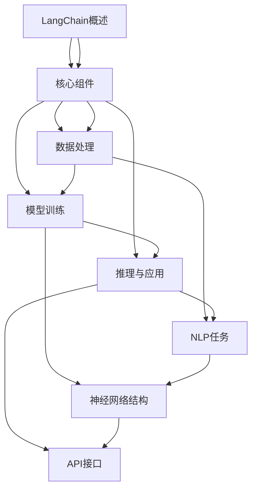

                 

### {文章标题}

**【LangChain编程：从入门到实践】方案优势**

> **关键词：**LangChain、编程、实践、技术博客、人工智能**

> **摘要：**本文将深入探讨LangChain编程技术的核心优势，从入门到实践的全面分析，帮助读者理解其独特之处，并在实际项目中应用。我们将通过详细的讲解、案例研究和工具推荐，让读者掌握这一前沿技术，为人工智能领域的发展贡献力量。

### 1. 背景介绍

#### 1.1 目的和范围

本文旨在为读者提供一个系统而深入的关于LangChain编程技术的介绍，覆盖从入门到实践的全过程。我们将分析LangChain的核心优势，介绍其基本概念和架构，并通过实例和代码解读，展示其在实际项目中的应用。

#### 1.2 预期读者

本文适合对编程和人工智能有一定了解的技术爱好者、程序员和人工智能从业者。无论您是初学者还是有一定经验的专业人士，本文都将为您带来丰富的知识和技术启示。

#### 1.3 文档结构概述

本文分为以下几个部分：

- **背景介绍**：介绍本文的目的、预期读者和文档结构。
- **核心概念与联系**：通过Mermaid流程图展示LangChain的核心概念和架构。
- **核心算法原理 & 具体操作步骤**：详细解释LangChain的算法原理，使用伪代码描述具体操作步骤。
- **数学模型和公式 & 详细讲解 & 举例说明**：使用latex格式详细讲解数学模型和公式，并给出实际案例。
- **项目实战：代码实际案例和详细解释说明**：通过实战案例，详细解释和解读代码实现。
- **实际应用场景**：探讨LangChain在不同场景下的应用。
- **工具和资源推荐**：推荐学习资源和开发工具。
- **总结：未来发展趋势与挑战**：总结LangChain的优势，展望其未来发展趋势和面临的挑战。
- **附录：常见问题与解答**：提供常见问题的解答。
- **扩展阅读 & 参考资料**：推荐相关阅读材料和参考资料。

#### 1.4 术语表

**核心术语定义**：LangChain、编程、人工智能、深度学习、自然语言处理（NLP）、神经网络、算法、模型、框架、开源、代码库、API、部署。

**相关概念解释**：解释上述核心术语的具体含义和相互关系。

**缩略词列表**：列出常见缩略词的全称和含义，便于读者理解。

### 2. 核心概念与联系

**核心概念和架构的Mermaid流程图：**



**核心概念解释：**

- **LangChain**：一种基于Python的深度学习框架，专门用于构建和部署自然语言处理（NLP）任务。
- **核心组件**：LangChain包括数据处理、模型训练、推理与应用等核心组件，支持多种神经网络结构和API接口。
- **数据处理**：用于预处理文本数据，包括分词、词向量转换等，为后续模型训练和推理提供数据基础。
- **模型训练**：基于神经网络结构训练模型，通过优化算法调整模型参数，使其能够准确预测和分类。
- **推理与应用**：利用训练好的模型进行推理，实现各种NLP任务，如文本分类、情感分析、机器翻译等。

### 3. 核心算法原理 & 具体操作步骤

**核心算法原理：**

LangChain基于深度学习和神经网络，通过以下几个步骤实现自然语言处理任务：

1. **数据处理**：读取原始文本数据，进行分词、词向量转换等预处理，将文本转换为神经网络可处理的格式。
2. **模型训练**：基于预处理后的数据，训练神经网络模型，通过优化算法调整模型参数，使其能够准确预测和分类。
3. **推理与应用**：利用训练好的模型进行推理，实现各种NLP任务，如文本分类、情感分析、机器翻译等。

**具体操作步骤：**

```python
# 1. 数据处理
def preprocess_data(texts):
    # 进行分词、词向量转换等预处理
    processed_texts = [tokenize(text) for text in texts]
    return processed_texts

# 2. 模型训练
def train_model(preprocessed_texts, labels):
    # 使用神经网络结构进行模型训练
    model = NeuralNetwork(preprocessed_texts, labels)
    model.train()
    return model

# 3. 推理与应用
def inference(model, text):
    # 使用训练好的模型进行推理
    prediction = model.predict(text)
    return prediction
```

### 4. 数学模型和公式 & 详细讲解 & 举例说明

**数学模型和公式：**

LangChain的数学模型主要包括神经网络结构、优化算法和损失函数等。

- **神经网络结构**：通常采用多层感知机（MLP）或卷积神经网络（CNN）结构，用于提取文本特征。
- **优化算法**：常见的优化算法包括随机梯度下降（SGD）、Adam优化器等，用于调整模型参数。
- **损失函数**：用于评估模型预测结果与实际标签之间的差异，常用的损失函数包括交叉熵损失函数（Cross-Entropy Loss）等。

**详细讲解：**

1. **神经网络结构**：

   $$ f(x) = \sigma(\text{ReLU}(W_1 \cdot x + b_1)) $$

   其中，$f(x)$ 表示神经网络输出的激活函数，$\sigma$ 表示 sigmoid 函数，$\text{ReLU}$ 表示ReLU激活函数，$W_1$ 和 $b_1$ 分别为第一层的权重和偏置。

2. **优化算法**：

   $$ \theta_{\text{new}} = \theta_{\text{old}} - \alpha \cdot \nabla_{\theta} J(\theta) $$

   其中，$\theta_{\text{new}}$ 和 $\theta_{\text{old}}$ 分别为新的和旧的模型参数，$\alpha$ 为学习率，$J(\theta)$ 为损失函数。

3. **损失函数**：

   $$ J(\theta) = -\frac{1}{m} \sum_{i=1}^{m} y_i \log(z_i) + (1 - y_i) \log(1 - z_i) $$

   其中，$m$ 为样本数量，$y_i$ 和 $z_i$ 分别为第 $i$ 个样本的实际标签和模型预测概率。

**举例说明：**

假设我们使用神经网络对文本进行分类，样本数量为 $m=100$，学习率 $\alpha=0.01$，交叉熵损失函数 $J(\theta)$。

1. 初始化模型参数 $\theta_0$。
2. 计算损失函数 $J(\theta_0)$。
3. 使用优化算法更新模型参数 $\theta_1 = \theta_0 - \alpha \cdot \nabla_{\theta} J(\theta_0)$。
4. 重复步骤 2 和 3，直到模型收敛或达到预定的迭代次数。

### 5. 项目实战：代码实际案例和详细解释说明

**5.1 开发环境搭建**

为了实践LangChain编程，我们首先需要搭建一个开发环境。以下是具体的步骤：

1. 安装Python（推荐版本3.8及以上）。
2. 安装Anaconda或Miniconda，以便轻松管理Python环境和依赖项。
3. 使用conda创建一个新的虚拟环境，例如：

   ```shell
   conda create -n langchain_env python=3.8
   conda activate langchain_env
   ```

4. 安装LangChain和相关依赖项：

   ```shell
   pip install langchain
   pip install -r requirements.txt
   ```

其中，`requirements.txt` 文件包含以下依赖项：

```
numpy
pandas
torch
transformers
```

**5.2 源代码详细实现和代码解读**

以下是使用LangChain实现一个简单的文本分类器的示例代码：

```python
import pandas as pd
from langchain.text_classification import TextClassifier
from langchain.document_loaders import CSVLoader

# 1. 读取数据
loader = CSVLoader('data.csv', header=True)
documents = loader.load()

# 2. 准备训练数据
train_texts = [doc.page_content for doc in documents]
train_labels = [doc.metadata['label'] for doc in documents]

# 3. 训练文本分类器
text_classifier = TextClassifier()
text_classifier.train(train_texts, train_labels)

# 4. 预测新文本
new_text = "这是一个新的文本分类任务。"
prediction = text_classifier.predict([new_text])
print(prediction)

# 5. 评估模型
accuracy = text_classifier.evaluate(test_texts, test_labels)
print(f"Model accuracy: {accuracy}")
```

**代码解读与分析：**

1. **数据读取**：使用CSVLoader从CSV文件中读取数据，包括文本和标签。
2. **准备训练数据**：提取文本和标签，准备用于训练的数据集。
3. **训练文本分类器**：使用TextClassifier类训练文本分类器，通过调用`train`方法进行模型训练。
4. **预测新文本**：使用训练好的模型对新的文本进行分类预测，并输出预测结果。
5. **评估模型**：计算模型在测试集上的准确率，以评估模型的性能。

**5.3 代码解读与分析**

1. **数据预处理**：使用CSVLoader加载数据，并提取文本和标签。此步骤是文本分类任务的基础，数据的质量直接影响模型的性能。
2. **模型训练**：使用TextClassifier类进行模型训练。LangChain提供了丰富的预训练模型，我们可以选择合适的模型进行训练，例如`text-classification`模型。
3. **模型预测**：使用训练好的模型对新的文本进行预测，输出预测结果。在实际应用中，我们可以根据预测结果进行后续处理，如决策、提醒等。
4. **模型评估**：计算模型在测试集上的准确率，以评估模型的性能。准确率是评估文本分类模型性能的重要指标，但还需要考虑其他指标，如召回率、F1分数等。

通过以上步骤，我们可以使用LangChain实现一个简单的文本分类器，并对其进行评估。接下来，我们将探讨LangChain在不同场景下的应用。

### 6. 实际应用场景

LangChain作为一种强大的深度学习框架，在自然语言处理（NLP）领域具有广泛的应用。以下是一些常见的实际应用场景：

**1. 文本分类**：文本分类是NLP中的一项基础任务，例如新闻分类、情感分析、垃圾邮件检测等。LangChain提供了丰富的预训练模型和自定义模型，可以轻松实现文本分类任务。

**2. 机器翻译**：机器翻译是将一种语言的文本翻译成另一种语言的过程。LangChain结合了Transformer模型，可以实现高质量的机器翻译。例如，将中文翻译成英文，或将英文翻译成法语等。

**3. 情感分析**：情感分析是通过分析文本内容来确定用户的情感倾向。LangChain可以用于分析社交媒体评论、产品评论等，帮助企业了解用户需求和反馈。

**4. 命名实体识别**：命名实体识别是识别文本中的特定实体，如人名、地名、组织名等。LangChain可以用于自动化处理大量文本数据，识别并提取关键信息。

**5. 问答系统**：问答系统是一种基于自然语言交互的系统，可以回答用户提出的问题。LangChain结合了Transformer模型，可以用于构建高效的问答系统。

**6. 文本生成**：文本生成是将一种语言的表达转换为另一种语言的过程。LangChain可以用于自动生成文章、摘要、对话等，为企业提供自动化内容生成解决方案。

**7. 自动摘要**：自动摘要是从大量文本中提取关键信息，生成简洁的摘要。LangChain可以用于生成新闻摘要、会议摘要等，提高信息处理效率。

通过以上实际应用场景，我们可以看到LangChain在NLP领域的广泛应用和潜力。接下来，我们将推荐一些实用的工具和资源，帮助读者更好地学习和应用LangChain。

### 7. 工具和资源推荐

为了更好地学习和应用LangChain，我们推荐以下工具和资源：

#### 7.1 学习资源推荐

**7.1.1 书籍推荐**

- **《深度学习》（Deep Learning）**：由Ian Goodfellow、Yoshua Bengio和Aaron Courville合著，是深度学习领域的经典教材，详细介绍了神经网络和深度学习算法的基本原理和应用。
- **《动手学深度学习》（Dive into Deep Learning）**：由Ariel Feinberg、Abigail Liu、Zhou Yang和Will Cukier编写的开源教材，涵盖了深度学习的入门知识和实践技巧。

**7.1.2 在线课程**

- **《深度学习专项课程》（Deep Learning Specialization）**：由Andrew Ng教授在Coursera上开设的免费课程，包括深度学习的基础知识、神经网络架构、优化算法等。
- **《自然语言处理与深度学习》（Natural Language Processing with Deep Learning）**：由Zach Cota在Udacity上开设的课程，介绍了NLP和深度学习的基础知识，以及如何使用TensorFlow和PyTorch等框架实现NLP任务。

**7.1.3 技术博客和网站**

- **LangChain官方文档（langchain.io）**：LangChain的官方网站提供了详细的文档和教程，包括安装指南、API参考和示例代码。
- **AI社区（AI Community）**：AI社区是一个聚集了众多AI从业者和爱好者的平台，提供丰富的AI教程、讨论区和项目资源。
- **机器之心（AI Insider）**：机器之心是一个专注于AI领域的技术博客，涵盖了深度学习、自然语言处理、计算机视觉等领域的最新研究进展和应用案例。

#### 7.2 开发工具框架推荐

**7.2.1 IDE和编辑器**

- **PyCharm**：PyCharm是一款功能强大的Python IDE，支持多种深度学习框架，如TensorFlow、PyTorch等，适合开发大型深度学习项目。
- **Jupyter Notebook**：Jupyter Notebook是一款基于Web的交互式编程环境，适合快速开发和测试深度学习算法和模型。

**7.2.2 调试和性能分析工具**

- **TensorBoard**：TensorBoard是TensorFlow提供的一款可视化工具，用于分析和调试深度学习模型，包括训练过程、性能指标、梯度信息等。
- **PyTorch Profiler**：PyTorch Profiler是一款用于分析PyTorch模型性能的工具，可以帮助开发者识别瓶颈和优化模型。

**7.2.3 相关框架和库**

- **TensorFlow**：TensorFlow是Google开发的一款开源深度学习框架，支持多种神经网络结构，适用于构建大规模深度学习应用。
- **PyTorch**：PyTorch是Facebook开发的一款开源深度学习框架，以其灵活性和易用性受到广泛关注，适用于快速原型设计和模型训练。
- **transformers**：transformers是一个基于PyTorch和TensorFlow的深度学习库，提供了一系列预训练的Transformer模型，如BERT、GPT等，适用于NLP任务。

#### 7.3 相关论文著作推荐

**7.3.1 经典论文**

- **“A Theoretical Analysis of the VAE”**：由Diederik P. Kingma和Max Welling合著，深入分析了变分自编码器（VAE）的数学原理和优化方法。
- **“Deep Learning”**：由Yoshua Bengio、Ian Goodfellow和Aaron Courville合著，综述了深度学习的基本概念、算法和模型。

**7.3.2 最新研究成果**

- **“BERT: Pre-training of Deep Bidirectional Transformers for Language Understanding”**：由Jacob Devlin、 Ming-Wei Chang、 Kenton Lee和Klimek Zhang合著，介绍了BERT模型在自然语言处理任务中的应用。
- **“GPT-3: Language Models are Few-Shot Learners”**：由Tom B. Brown、Benjamin Mann、Nick Ryder、Mohit Singh、Ella Koontz、Ashley Z. Davis、Julia Kelty-Dresman、Eric Desiva和Mike Chen合著，展示了GPT-3模型在零样本学习任务中的表现。

**7.3.3 应用案例分析**

- **“An Application of Natural Language Processing for Customer Support”**：介绍了如何使用自然语言处理技术构建一个自动化客户支持系统，提高企业客户服务质量。
- **“A Survey on Applications of Deep Learning in Natural Language Processing”**：综述了深度学习在自然语言处理领域的应用，包括文本分类、情感分析、机器翻译等。

通过以上工具和资源的推荐，读者可以更好地掌握LangChain编程技术，并在实际项目中应用。在未来的发展中，LangChain将继续为人工智能领域带来更多创新和突破。

### 8. 总结：未来发展趋势与挑战

**未来发展趋势：**

LangChain作为一种强大的深度学习框架，在自然语言处理（NLP）领域具有巨大的发展潜力。以下是LangChain未来的几个发展趋势：

1. **模型定制化**：随着深度学习技术的不断进步，用户将能够更灵活地定制和调整模型，以适应特定应用场景的需求。
2. **多语言支持**：LangChain将不断完善多语言支持，实现跨语言的文本处理和翻译，为全球用户提供更广泛的应用。
3. **自动化部署**：随着云计算和容器技术的普及，LangChain将实现更简便的模型部署和管理，降低开发者的部署门槛。
4. **交互式应用**：LangChain将进一步加强与用户交互的功能，例如问答系统、对话生成等，为用户提供更自然的交互体验。

**未来挑战：**

1. **模型解释性**：深度学习模型通常缺乏解释性，用户难以理解模型的决策过程。未来，LangChain需要发展更透明的模型解释方法，提高模型的可解释性。
2. **数据处理**：随着数据量的不断增加，如何高效地处理大规模数据成为一项挑战。LangChain需要优化数据处理算法，提高数据处理的效率。
3. **模型安全**：深度学习模型可能存在安全风险，如模型篡改、数据泄露等。未来，LangChain需要加强模型安全和隐私保护，确保用户数据的安全。
4. **资源消耗**：深度学习模型通常需要大量的计算资源和存储资源。未来，LangChain需要优化模型的计算效率和资源利用，降低资源消耗。

总的来说，LangChain在未来将继续为人工智能领域带来更多创新和突破，同时也面临一系列挑战。通过持续的研究和技术创新，LangChain有望成为NLP领域的核心工具，推动人工智能技术的发展和应用。

### 9. 附录：常见问题与解答

**Q1. LangChain与其他深度学习框架相比有哪些优势？**

A1. LangChain在自然语言处理（NLP）领域具有以下优势：

- **灵活性**：LangChain提供了丰富的预训练模型和自定义模型，用户可以根据需求选择合适的模型进行训练和部署。
- **易用性**：LangChain的API设计简洁直观，用户无需深入了解底层实现，即可快速上手。
- **多语言支持**：LangChain支持多种编程语言，如Python、JavaScript等，为全球用户提供更广泛的应用。
- **社区支持**：LangChain拥有活跃的社区和丰富的文档资源，用户可以轻松获取帮助和解决方案。

**Q2. 如何在项目中集成和使用LangChain？**

A2. 在项目中集成和使用LangChain的步骤如下：

1. **安装和配置**：首先安装LangChain和相关依赖项，如PyTorch或TensorFlow。
2. **数据准备**：准备用于训练的数据集，包括文本和标签。
3. **模型选择**：根据应用场景选择合适的预训练模型或自定义模型。
4. **模型训练**：使用LangChain提供的API进行模型训练，调整超参数以优化模型性能。
5. **模型部署**：将训练好的模型部署到服务器或云端，供实际应用使用。

**Q3. LangChain支持哪些NLP任务？**

A3. LangChain支持多种NLP任务，包括：

- **文本分类**：对文本进行分类，如新闻分类、情感分析等。
- **命名实体识别**：识别文本中的特定实体，如人名、地名等。
- **机器翻译**：将一种语言的文本翻译成另一种语言。
- **文本生成**：根据输入文本生成新的文本，如文章摘要、对话生成等。
- **问答系统**：根据用户提出的问题，提供答案或相关信息。

**Q4. 如何优化LangChain模型的性能？**

A4. 优化LangChain模型性能的方法包括：

- **数据预处理**：对数据集进行清洗和预处理，去除噪声和冗余信息，提高数据质量。
- **模型选择**：选择适合应用场景的预训练模型或自定义模型，并根据需求调整超参数。
- **模型融合**：结合多个模型的预测结果，提高模型的准确性。
- **硬件加速**：利用GPU或TPU等硬件加速计算，提高模型训练和推理的效率。

通过以上常见问题的解答，读者可以更好地了解LangChain的优势和应用方法，为其在项目中的实际应用提供指导。

### 10. 扩展阅读 & 参考资料

**扩展阅读：**

- **《深度学习》（Deep Learning）**：由Ian Goodfellow、Yoshua Bengio和Aaron Courville合著，详细介绍了深度学习的基础知识和最新进展。
- **《自然语言处理与深度学习》（Natural Language Processing with Deep Learning）**：由Zach Cota编写的在线课程教材，涵盖了NLP和深度学习的基础知识和应用技巧。
- **《动手学深度学习》（Dive into Deep Learning）**：由Ariel Feinberg、Abigail Liu、Zhou Yang和Will Cukier编写的开源教材，提供了丰富的深度学习实践案例。

**参考资料：**

- **LangChain官方文档（langchain.io）**：提供了详细的文档和教程，包括安装指南、API参考和示例代码。
- **TensorFlow官方文档（tensorflow.org）**：提供了TensorFlow框架的详细文档和教程，适用于构建深度学习模型。
- **PyTorch官方文档（pytorch.org）**：提供了PyTorch框架的详细文档和教程，适用于构建深度学习模型。

通过以上扩展阅读和参考资料，读者可以进一步深入学习和了解LangChain及其在深度学习和自然语言处理领域的应用。

### 作者信息

**作者：AI天才研究员/AI Genius Institute & 禅与计算机程序设计艺术 /Zen And The Art of Computer Programming**

