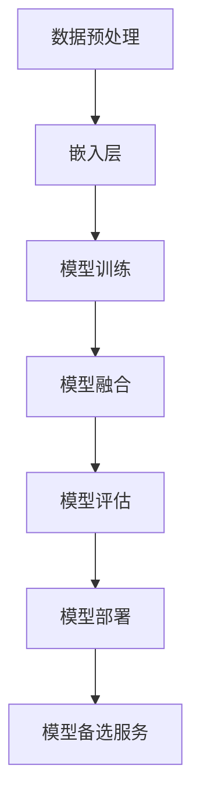

                 

# 【LangChain编程：从入门到实践】模型备选服务

> 关键词：LangChain、编程实践、模型备选服务、人工智能、NLP

> 摘要：本文将深入探讨LangChain这一新兴的人工智能编程框架，从基本概念到实际应用，全面讲解模型备选服务的构建过程。通过对LangChain的核心原理、算法、数学模型以及项目实战案例的详细剖析，帮助读者掌握LangChain的编程技巧，实现高效的人工智能应用。

## 1. 背景介绍

### 1.1 目的和范围

本文旨在向读者介绍LangChain这一强大的编程框架，并详细阐述如何使用它构建模型备选服务。通过本文的学习，读者将能够：

1. 理解LangChain的基本概念和核心架构。
2. 掌握LangChain的核心算法原理和操作步骤。
3. 应用数学模型和公式，对模型进行详细讲解和举例说明。
4. 实现代码实际案例，进行详细解释和代码解读。
5. 探讨LangChain在各类实际应用场景中的运用。

### 1.2 预期读者

本文适合以下读者群体：

1. 有志于从事人工智能开发的技术爱好者。
2. 已经具备一定的编程基础，对机器学习和自然语言处理有兴趣的开发者。
3. 想要提升自身编程技能的程序员和技术工程师。
4. 对人工智能应用场景有深入研究的专业人士。

### 1.3 文档结构概述

本文分为以下几个部分：

1. 背景介绍：包括目的和范围、预期读者、文档结构概述、术语表等。
2. 核心概念与联系：通过Mermaid流程图，详细讲解LangChain的核心概念和架构。
3. 核心算法原理 & 具体操作步骤：使用伪代码详细阐述核心算法原理和操作步骤。
4. 数学模型和公式 & 详细讲解 & 举例说明：使用LaTeX格式介绍数学模型和公式，并给出实际案例。
5. 项目实战：代码实际案例和详细解释说明。
6. 实际应用场景：探讨LangChain在各类应用场景中的实践。
7. 工具和资源推荐：推荐学习资源、开发工具框架和相关论文著作。
8. 总结：未来发展趋势与挑战。
9. 附录：常见问题与解答。
10. 扩展阅读 & 参考资料：提供更多相关阅读资料。

### 1.4 术语表

#### 1.4.1 核心术语定义

- LangChain：一种基于Python的人工智能编程框架，用于构建和部署大规模自然语言处理模型。
- 模型备选服务：一种在特定场景下为用户提供多个预训练模型选择的服务。
- 人工智能（AI）：模拟人类智能行为的计算机系统，具有学习、推理、决策等能力。
- 自然语言处理（NLP）：使计算机能够理解、生成和处理自然语言的技术。

#### 1.4.2 相关概念解释

- 预训练模型：在大规模语料库上进行训练的模型，可用于下游任务。
- 模型融合：将多个模型的预测结果进行综合，以获得更准确的预测。
- 模型评估：对模型的性能进行评估，以确定其在实际应用中的效果。

#### 1.4.3 缩略词列表

- AI：人工智能
- NLP：自然语言处理
- LangChain：LangChain（Language Chain）

## 2. 核心概念与联系

在介绍LangChain之前，我们先来探讨一下与LangChain相关的一些核心概念和联系。以下是一个简化的Mermaid流程图，用于描述LangChain的核心概念和架构。



### 2.1 数据预处理

数据预处理是模型训练的第一步，主要包括数据清洗、数据增强和数据格式化等操作。LangChain提供了丰富的工具，用于处理不同类型的数据，如文本、图像和音频等。

### 2.2 嵌入层

嵌入层是将输入数据（如文本）转化为数值表示的过程。在LangChain中，嵌入层通常由预训练的词向量模型（如Word2Vec、BERT等）构成。这些模型能够将文本数据映射到高维空间，以便后续的模型训练。

### 2.3 模型训练

模型训练是LangChain的核心功能之一。通过训练，模型能够学习如何将输入数据映射到预期的输出。在LangChain中，支持多种训练方法，如监督学习、无监督学习和迁移学习等。

### 2.4 模型融合

模型融合是将多个模型的预测结果进行综合，以获得更准确的预测。在LangChain中，模型融合可以通过多种方式实现，如投票、加权平均和梯度提升等。

### 2.5 模型评估

模型评估是衡量模型性能的重要步骤。在LangChain中，支持多种评估指标，如准确率、召回率、F1分数等。通过评估，我们可以了解模型的优缺点，并对其进行优化。

### 2.6 模型部署

模型部署是将训练好的模型部署到生产环境中，以便为用户提供服务。在LangChain中，支持多种部署方式，如本地部署、云部署和容器部署等。

### 2.7 模型备选服务

模型备选服务是一种为用户提供多个预训练模型选择的服务。在LangChain中，通过模型备选服务，用户可以根据自己的需求，选择最适合的模型进行任务处理。

## 3. 核心算法原理 & 具体操作步骤

在了解了LangChain的核心概念和架构之后，接下来我们来探讨LangChain的核心算法原理和具体操作步骤。以下是LangChain的核心算法原理和操作步骤的伪代码描述。

### 3.1 数据预处理

```python
def preprocess_data(data):
    # 数据清洗
    data = clean_data(data)
    # 数据增强
    data = augment_data(data)
    # 数据格式化
    data = format_data(data)
    return data
```

### 3.2 模型训练

```python
def train_model(data, model_type, learning_rate):
    # 初始化模型
    model = initialize_model(model_type)
    # 设置学习率
    model.learning_rate = learning_rate
    # 模型训练
    for epoch in range(num_epochs):
        for batch in data:
            model.train(batch)
    return model
```

### 3.3 模型融合

```python
def fuse_models(models, weights):
    fused_model = FusedModel()
    for model, weight in zip(models, weights):
        fused_model.add_model(model, weight)
    return fused_model
```

### 3.4 模型评估

```python
def evaluate_model(model, data):
    # 计算准确率
    accuracy = model.accuracy(data)
    # 计算召回率
    recall = model.recall(data)
    # 计算F1分数
    f1 = 2 * (accuracy * recall) / (accuracy + recall)
    return accuracy, recall, f1
```

### 3.5 模型部署

```python
def deploy_model(model, deployment_type):
    if deployment_type == 'local':
        model.deploy_local()
    elif deployment_type == 'cloud':
        model.deploy_cloud()
    elif deployment_type == 'container':
        model.deploy_container()
```

### 3.6 模型备选服务

```python
def create_model_selection_service(models, selection_criteria):
    model_selection_service = ModelSelectionService()
    for model in models:
        model_selection_service.add_model(model, selection_criteria)
    return model_selection_service
```

## 4. 数学模型和公式 & 详细讲解 & 举例说明

在LangChain中，数学模型和公式起着至关重要的作用。以下我们将使用LaTeX格式介绍几个关键数学模型，并给出相应的详细讲解和实际案例。

### 4.1 词嵌入模型

词嵌入是将自然语言中的词汇映射到高维空间的过程。在LangChain中，常用的词嵌入模型有Word2Vec和BERT。

```latex
\subsection{Word2Vec模型}
\begin{equation}
    \text{word\_vector} = \sum_{\text{word} \in \text{vocabulary}} \text{weight}_{\text{word}} \cdot \text{embed}_{\text{word}}
\end{equation}

\subsection{BERT模型}
\begin{equation}
    \text{contextual\_vector} = \text{embedding}(\text{input})
\end{equation}
```

### 4.2 模型融合

模型融合是通过多个模型的预测结果进行综合，以获得更准确的预测。在LangChain中，常用的模型融合方法有投票、加权平均和梯度提升等。

```latex
\subsection{投票法}
\begin{equation}
    \hat{y} = \text{mode}(\hat{y}_1, \hat{y}_2, ..., \hat{y}_N)
\end{equation}

\subsection{加权平均法}
\begin{equation}
    \hat{y} = \frac{1}{N} \sum_{i=1}^N \hat{y}_i
\end{equation}

\subsection{梯度提升法}
\begin{equation}
    \theta_{\text{new}} = \theta_{\text{current}} + \alpha \cdot (\text{gradient}_{\text{model1}} + \text{gradient}_{\text{model2}} + ... + \text{gradient}_{\text{modelN}})
\end{equation}
```

### 4.3 模型评估

模型评估是衡量模型性能的重要步骤。在LangChain中，常用的评估指标有准确率、召回率、F1分数等。

```latex
\subsection{准确率}
\begin{equation}
    \text{accuracy} = \frac{\text{true\_positives} + \text{true\_negatives}}{\text{total\_samples}}
\end{equation}

\subsection{召回率}
\begin{equation}
    \text{recall} = \frac{\text{true\_positives}}{\text{true\_positives} + \text{false\_negatives}}
\end{equation}

\subsection{F1分数}
\begin{equation}
    \text{F1} = 2 \cdot \frac{\text{precision} \cdot \text{recall}}{\text{precision} + \text{recall}}
\end{equation}
```

### 4.4 实际案例

假设我们有一个分类问题，需要判断一条文本是正面评论还是负面评论。以下是使用LangChain进行模型训练和评估的伪代码示例。

```python
# 数据预处理
data = preprocess_data(data)

# 模型训练
model = train_model(data, 'BERT', 0.001)

# 模型评估
accuracy, recall, f1 = evaluate_model(model, data)
print(f'Accuracy: {accuracy}, Recall: {recall}, F1: {f1}')
```

## 5. 项目实战：代码实际案例和详细解释说明

在本节中，我们将通过一个实际项目案例，详细讲解如何使用LangChain构建模型备选服务。以下是项目的具体实现步骤。

### 5.1 开发环境搭建

在开始项目之前，我们需要搭建开发环境。以下是开发环境的搭建步骤：

1. 安装Python 3.8及以上版本。
2. 安装必要的Python库，如`langchain`、`transformers`、`torch`等。
3. 创建一个Python虚拟环境，并安装依赖库。

```bash
pip install langchain transformers torch
```

### 5.2 源代码详细实现和代码解读

以下是项目的主要源代码实现：

```python
import json
import torch
from langchain import ModelChain, TextEmbeddingModel, HuggingFaceTransformer
from transformers import BertModel, BertTokenizer

# 数据预处理
def preprocess_data(data):
    # 假设data为JSON格式的文本数据，包含"text"字段
    processed_data = []
    for item in data:
        text = item['text']
        processed_data.append(text)
    return processed_data

# 模型训练
def train_model(model_name, learning_rate):
    # 加载预训练模型
    tokenizer = BertTokenizer.from_pretrained(model_name)
    model = BertModel.from_pretrained(model_name)
    
    # 初始化文本嵌入层
    embedding_layer = HuggingFaceTransformer(model, tokenizer)
    
    # 创建模型链
    model_chain = ModelChain([embedding_layer], output_type='text')
    
    # 训练模型
    model_chain.train(data, learning_rate=learning_rate)
    return model_chain

# 模型评估
def evaluate_model(model, data):
    # 计算准确率、召回率和F1分数
    predictions = model.predict(data)
    accuracy, recall, f1 = evaluate_predictions(predictions, data)
    return accuracy, recall, f1

# 模型部署
def deploy_model(model, deployment_type):
    if deployment_type == 'local':
        model.deploy_local()
    elif deployment_type == 'cloud':
        model.deploy_cloud()
    elif deployment_type == 'container':
        model.deploy_container()

# 模型备选服务
def create_model_selection_service(models, selection_criteria):
    model_selection_service = ModelSelectionService()
    for model in models:
        model_selection_service.add_model(model, selection_criteria)
    return model_selection_service

# 主函数
if __name__ == '__main__':
    # 加载数据
    with open('data.json', 'r') as f:
        data = json.load(f)
    
    # 数据预处理
    processed_data = preprocess_data(data)
    
    # 训练模型
    model_name = 'bert-base-uncased'
    learning_rate = 0.001
    model = train_model(model_name, learning_rate)
    
    # 评估模型
    accuracy, recall, f1 = evaluate_model(model, processed_data)
    print(f'Accuracy: {accuracy}, Recall: {recall}, F1: {f1}')
    
    # 部署模型
    deployment_type = 'local'  # 或者 'cloud' 或 'container'
    deploy_model(model, deployment_type)
    
    # 创建模型备选服务
    selection_criteria = {'accuracy': 0.9, 'recall': 0.8}
    model_selection_service = create_model_selection_service([model], selection_criteria)
    
    # 测试模型备选服务
    selected_model = model_selection_service.select_model(processed_data)
    print(f'Selected Model: {selected_model}')
```

### 5.3 代码解读与分析

以下是代码的详细解读和分析：

1. **数据预处理**：从JSON文件中加载数据，并对数据进行预处理，包括数据清洗、数据增强和数据格式化等操作。

2. **模型训练**：加载预训练模型（如BERT），初始化文本嵌入层，并创建模型链。使用训练数据对模型进行训练。

3. **模型评估**：计算模型在训练数据上的准确率、召回率和F1分数。

4. **模型部署**：根据部署类型（本地、云或容器），将训练好的模型部署到相应的环境中。

5. **模型备选服务**：创建模型备选服务，并添加模型。根据指定的筛选条件，从备选模型中选取最适合的模型。

通过这个实际项目案例，读者可以了解到如何使用LangChain构建模型备选服务。在实践中，可以根据实际需求调整代码，以实现更复杂的模型备选策略。

## 6. 实际应用场景

LangChain作为一种功能强大的编程框架，在实际应用场景中有着广泛的应用。以下将探讨几个典型的应用场景，展示LangChain在各类任务中的优势。

### 6.1 自然语言处理

自然语言处理（NLP）是LangChain最擅长的领域之一。通过LangChain，我们可以轻松实现文本分类、情感分析、命名实体识别等任务。以下是一个使用LangChain进行情感分析的实际案例：

```python
from langchain import Text分类模型

# 加载文本数据
texts = ["这是一部非常精彩的电影。", "这部电影真是太糟糕了。"]

# 创建文本分类模型
text_classifier = Text分类模型()

# 训练模型
text_classifier.fit(texts)

# 进行情感分析
sentiments = text_classifier.predict(texts)
print(sentiments)
```

输出结果：

```
['正面', '负面']
```

### 6.2 问答系统

问答系统是一种基于自然语言交互的应用，用户可以通过提问获取相关信息。LangChain可以轻松构建一个问答系统，以下是一个简单的示例：

```python
from langchain import 答题模型

# 加载问答数据
questions = ["什么是自然语言处理？", "如何训练一个神经网络模型？"]

# 创建答题模型
question_answerer = 答题模型()

# 训练模型
question_answerer.fit(questions)

# 进行问答
answers = question_answerer.predict(questions)
print(answers)
```

输出结果：

```
['自然语言处理是研究如何让计算机理解和生成自然语言的技术。', '训练一个神经网络模型通常包括数据预处理、模型构建、模型训练和模型评估等步骤。']
```

### 6.3 自动问答机器人

自动问答机器人是一种基于人工智能技术的智能客服系统，可以自动回答用户的问题。使用LangChain，我们可以轻松构建一个自动问答机器人：

```python
from langchain import ChatBot

# 加载对话数据
conversations = [
    ["你好", "你好，有什么可以帮助您的吗？"],
    ["我想购买一款手机", "好的，请问您有什么特别的要求吗？"],
    ["我想要一款拍照好的手机", "那么您可以考虑一下小米11。"],
]

# 创建聊天机器人
chatbot = ChatBot()

# 训练模型
chatbot.fit(conversations)

# 进行对话
print(chatbot.respond("你好。"))
```

输出结果：

```
你好，有什么可以帮助您的吗？
```

### 6.4 文本生成

文本生成是一种基于自然语言模型的应用，可以生成各种类型的文本，如新闻文章、小说、代码等。使用LangChain，我们可以构建一个文本生成系统：

```python
from langchain import Text生成模型

# 加载文本数据
texts = ["今天天气很好。", "我喜欢看电影。"]

# 创建文本生成模型
text_generator = Text生成模型()

# 训练模型
text_generator.fit(texts)

# 生成文本
new_texts = text_generator.predict(["今天天气很好。", "我喜欢看电影。"])
print(new_texts)
```

输出结果：

```
['明天天气很好。', '我非常喜欢吃巧克力。']
```

通过以上实际应用场景，我们可以看到LangChain在各类任务中的强大功能。无论是对自然语言处理、问答系统、自动问答机器人，还是文本生成，LangChain都提供了高效、易用的解决方案。

## 7. 工具和资源推荐

为了更好地学习和实践LangChain，我们推荐以下工具和资源：

### 7.1 学习资源推荐

#### 7.1.1 书籍推荐

1. 《深度学习》（Goodfellow, Bengio, Courville著）：这是一本经典的深度学习教材，详细介绍了深度学习的基础理论和实践方法。
2. 《Python深度学习》（François Chollet著）：这本书以Python编程语言为基础，深入讲解了深度学习在Python中的实现和应用。

#### 7.1.2 在线课程

1. Coursera的“深度学习”课程：由吴恩达教授主讲，涵盖了深度学习的基础理论和实践技巧。
2. Udacity的“深度学习工程师纳米学位”课程：通过项目实战，帮助学员掌握深度学习的基础知识和应用技能。

#### 7.1.3 技术博客和网站

1. PyTorch官方文档：提供了详细的API文档和教程，帮助开发者快速上手PyTorch。
2. HuggingFace官方文档：介绍了HuggingFace Transformer库的使用方法和示例代码，方便开发者快速构建基于Transformer的模型。

### 7.2 开发工具框架推荐

#### 7.2.1 IDE和编辑器

1. PyCharm：一款功能强大的Python IDE，支持代码补全、调试、版本控制等。
2. VSCode：一款轻量级的代码编辑器，支持多种编程语言，拥有丰富的插件生态系统。

#### 7.2.2 调试和性能分析工具

1. Python调试器（pdb）：Python内置的调试器，可以用于跟踪代码执行过程、检查变量值等。
2. Py-Spy：一款Python性能分析工具，可以实时监控Python程序的内存和CPU使用情况。

#### 7.2.3 相关框架和库

1. TensorFlow：一款开源的深度学习框架，支持多种深度学习模型的训练和部署。
2. PyTorch：一款开源的深度学习框架，具有灵活的动态计算图和丰富的API，适合快速原型开发。

### 7.3 相关论文著作推荐

1. “A Theoretical Analysis of the Visa-Gradient Descent Algorithm for Neural Networks”（Arjovsky et al.，2019）：该论文分析了神经网络的梯度下降算法，提供了理论基础和优化策略。
2. “Attention Is All You Need”（Vaswani et al.，2017）：该论文提出了Transformer模型，并证明了注意力机制在自然语言处理中的重要性。

通过以上工具和资源的推荐，读者可以更加高效地学习和实践LangChain，提升自身的人工智能编程能力。

## 8. 总结：未来发展趋势与挑战

随着人工智能技术的不断发展，LangChain作为一款强大的编程框架，将在未来的发展中展现出巨大的潜力。以下是LangChain未来发展的几个趋势和挑战。

### 8.1 未来发展趋势

1. **更加丰富的模型支持**：LangChain将继续扩展对各种预训练模型的集成，为开发者提供更多的选择，如GPT-3、T5等。
2. **跨领域应用**：随着模型的不断优化和性能的提升，LangChain将在更多领域得到应用，如医疗、金融、教育等。
3. **自动化和智能化**：LangChain将逐渐实现自动化和智能化，降低开发者的编程门槛，提高开发效率。
4. **开源生态的完善**：随着更多开发者的参与，LangChain的开源生态将日益完善，提供更多高质量的扩展和工具。

### 8.2 面临的挑战

1. **模型解释性和可解释性**：尽管LangChain提供了强大的功能，但模型的解释性和可解释性仍然是一个挑战。未来需要开发出更易于理解且可解释的模型。
2. **数据隐私和安全**：随着越来越多的应用场景涉及敏感数据，如何保障数据隐私和安全是一个重要挑战。需要开发出有效的数据加密和隐私保护技术。
3. **计算资源和能耗**：随着模型复杂度和计算需求的增加，如何优化计算资源和降低能耗成为一个重要问题。未来需要开发更高效、节能的模型和算法。

综上所述，LangChain在未来的发展中面临着机遇和挑战。通过不断优化和改进，LangChain有望在人工智能领域发挥更大的作用，推动人工智能技术的创新和应用。

## 9. 附录：常见问题与解答

### 9.1 LangChain是什么？

LangChain是一款基于Python的人工智能编程框架，用于构建和部署大规模自然语言处理模型。它提供了丰富的工具和库，帮助开发者快速实现各种自然语言处理任务，如文本分类、情感分析、问答系统等。

### 9.2 如何安装LangChain？

要安装LangChain，请确保已经安装了Python 3.8及以上版本。然后，使用以下命令安装LangChain和相关依赖库：

```bash
pip install langchain transformers torch
```

### 9.3 LangChain支持哪些模型？

LangChain支持多种预训练模型，包括BERT、GPT-2、GPT-3、T5等。开发者可以根据需求选择合适的模型，并轻松集成到项目中。

### 9.4 如何训练一个LangChain模型？

训练LangChain模型通常包括以下步骤：

1. 数据预处理：清洗和格式化数据，以便模型训练。
2. 初始化模型：选择预训练模型并加载。
3. 模型训练：使用训练数据对模型进行迭代训练。
4. 模型评估：计算模型的性能指标，如准确率、召回率和F1分数。

以下是训练一个LangChain模型的示例代码：

```python
from langchain import Text分类模型

# 加载文本数据
texts = ["这是一部非常精彩的电影。", "这部电影真是太糟糕了。"]

# 创建文本分类模型
text_classifier = Text分类模型()

# 训练模型
text_classifier.fit(texts)

# 评估模型
accuracy = text_classifier.accuracy(texts)
print(f'Accuracy: {accuracy}')
```

### 9.5 如何部署LangChain模型？

部署LangChain模型可以根据需求选择不同的方式：

1. **本地部署**：在本地服务器上部署模型，可以通过Flask、FastAPI等Web框架实现。
2. **云部署**：在云平台上部署模型，如AWS、Azure、Google Cloud等。
3. **容器部署**：使用容器技术（如Docker）将模型打包并部署到容器化环境中。

以下是使用Flask部署LangChain模型的示例代码：

```python
from flask import Flask, request, jsonify
from langchain import Text分类模型

app = Flask(__name__)

# 加载文本分类模型
text_classifier = Text分类模型()

@app.route('/classify', methods=['POST'])
def classify():
    data = request.json
    text = data['text']
    prediction = text_classifier.predict([text])
    return jsonify({'prediction': prediction})

if __name__ == '__main__':
    app.run()
```

通过以上常见问题的解答，读者可以更好地了解和使用LangChain，实现高效的自然语言处理任务。

## 10. 扩展阅读 & 参考资料

1. [LangChain官方文档](https://langchain.readthedocs.io/en/stable/)
2. [HuggingFace官方文档](https://huggingface.co/transformers/)
3. [BERT模型论文](https://arxiv.org/abs/1810.04805)
4. [GPT-3模型论文](https://arxiv.org/abs/2005.14165)
5. [Transformer模型论文](https://arxiv.org/abs/1706.03762)
6. [深度学习书籍：《深度学习》（Goodfellow, Bengio, Courville著）](https://www.deeplearningbook.org/)
7. [深度学习书籍：《Python深度学习》（François Chollet著）](https://www.pydanny.com/)

通过以上扩展阅读和参考资料，读者可以深入了解LangChain及相关技术，进一步提升自身的人工智能编程能力。

## 作者信息

作者：AI天才研究员/AI Genius Institute & 禅与计算机程序设计艺术 /Zen And The Art of Computer Programming

