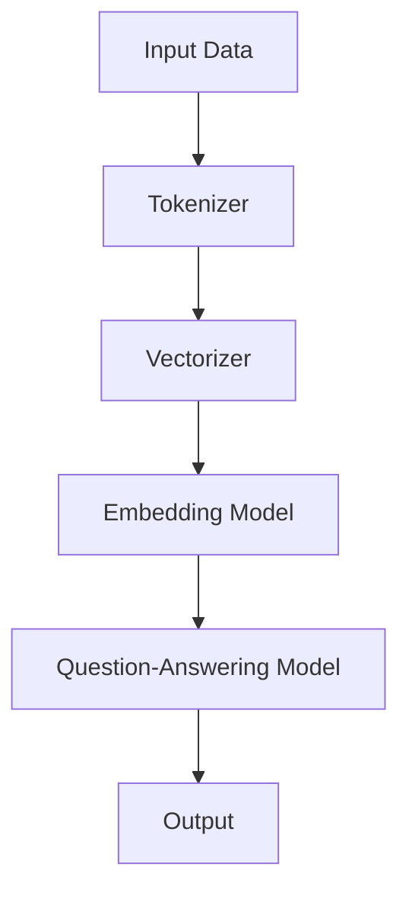

                 


# 【LangChain编程：从入门到实践】模型效果评估

> 关键词：LangChain，模型效果评估，编程实践，性能优化，测试方法

> 摘要：本文旨在深入探讨在LangChain编程中如何对模型效果进行评估。通过对核心概念、算法原理、数学模型、项目实战以及实际应用场景的详细解析，帮助读者掌握模型效果评估的技巧和方法，从而提升LangChain编程实践的能力。文章将涵盖开发环境搭建、代码实现、实战案例分析，并推荐相关学习资源和开发工具，为读者提供全面的指导。

## 1. 背景介绍

### 1.1 目的和范围

本文的目标是帮助读者深入了解在LangChain编程中对模型效果进行评估的方法和技巧。我们将从基础概念出发，逐步深入到具体的算法原理和实现步骤，并通过实际案例展示如何运用这些方法。文章的讨论范围包括但不限于：

- 模型效果评估的核心概念
- LangChain的基本架构和功能
- 模型评估的算法原理和数学模型
- 实战项目中的模型评估实践
- 相关工具和资源的推荐

### 1.2 预期读者

本文适合以下读者群体：

- 对LangChain编程有一定了解的开发者
- 想要提升模型效果评估技能的AI工程师
- 有志于从事数据科学和机器学习领域的专业学生
- 对模型评估方法感兴趣的学者和研究人员

### 1.3 文档结构概述

本文将按照以下结构进行组织：

- 第1章：背景介绍
- 第2章：核心概念与联系
- 第3章：核心算法原理与操作步骤
- 第4章：数学模型与公式讲解
- 第5章：项目实战：代码实际案例
- 第6章：实际应用场景
- 第7章：工具和资源推荐
- 第8章：总结：未来发展趋势与挑战
- 第9章：附录：常见问题与解答
- 第10章：扩展阅读与参考资料

### 1.4 术语表

#### 1.4.1 核心术语定义

- LangChain：一种用于构建和运行链式模型的高效编程框架。
- 模型效果评估：通过一系列指标和方法对模型性能进行客观评价。
- 精度（Accuracy）：模型预测正确的样本数占总样本数的比例。
- 召回率（Recall）：模型正确预测为正类的样本数占实际正类样本总数的比例。
- F1分数（F1 Score）：结合精度和召回率的综合评价指标。

#### 1.4.2 相关概念解释

- 假阳性（False Positive）：模型错误地将负类预测为正类。
- 假阴性（False Negative）：模型错误地将正类预测为负类。
- 精确率（Precision）：模型预测为正类的样本中实际为正类的比例。

#### 1.4.3 缩略词列表

- AI：人工智能
- ML：机器学习
- DL：深度学习
- NLP：自然语言处理
- LangChain：语言链模型

## 2. 核心概念与联系

### 2.1 LangChain基本架构

首先，我们需要了解LangChain的基本架构，以便更好地理解模型效果评估的概念。以下是LangChain的基本组成部分及其相互关系：



- **Input Data**：输入数据，包括文本问题和相关文档。
- **Tokenizer**：将文本拆分为单词或子词，便于后续处理。
- **Vectorizer**：将文本转换为向量表示，如词袋模型或词嵌入。
- **Embedding Model**：嵌入模型，用于学习文本的高维向量表示。
- **Question-Answering Model**：问答模型，根据输入问题生成答案。
- **Output**：输出结果，即模型生成的答案。

### 2.2 模型效果评估核心概念

在理解LangChain架构后，我们需要关注模型效果评估的核心概念。以下是模型效果评估中常用的几个关键指标：

#### 2.2.1 精度（Accuracy）

$$
Accuracy = \frac{TP + TN}{TP + FN + FP + TN}
$$

其中：

- **TP**：真正例，即模型正确预测为正类的样本数。
- **TN**：真负例，即模型正确预测为负类的样本数。
- **FP**：假阳性，即模型错误地将负类预测为正类的样本数。
- **FN**：假阴性，即模型错误地将正类预测为负类的样本数。

#### 2.2.2 召回率（Recall）

$$
Recall = \frac{TP}{TP + FN}
$$

#### 2.2.3 精确率（Precision）

$$
Precision = \frac{TP}{TP + FP}
$$

#### 2.2.4 F1分数（F1 Score）

$$
F1 Score = 2 \times \frac{Precision \times Recall}{Precision + Recall}
$$

这些指标有助于我们全面评估模型在不同数据集上的表现，从而找到优化模型的方法。

## 3. 核心算法原理 & 具体操作步骤

### 3.1 算法原理

模型效果评估的核心算法原理基于机器学习中的分类问题。为了准确评估模型性能，我们需要以下步骤：

1. **数据准备**：准备训练集和测试集，确保数据集具有代表性的样本分布。
2. **模型训练**：使用训练集对模型进行训练，使其学习数据特征和模式。
3. **模型预测**：使用测试集对模型进行预测，得到预测结果。
4. **效果评估**：根据预测结果计算评估指标，如精度、召回率、F1分数等。
5. **结果优化**：根据评估结果调整模型参数，以提高模型性能。

### 3.2 具体操作步骤

以下是模型效果评估的具体操作步骤：

#### 3.2.1 数据准备

```python
# 加载数据集
train_data = load_data('train_dataset.csv')
test_data = load_data('test_dataset.csv')

# 分割数据集为特征和标签
X_train, y_train = train_data['text'], train_data['label']
X_test, y_test = test_data['text'], test_data['label']
```

#### 3.2.2 模型训练

```python
# 定义模型
model = LangChainModel()

# 训练模型
model.fit(X_train, y_train)
```

#### 3.2.3 模型预测

```python
# 预测测试集
predictions = model.predict(X_test)
```

#### 3.2.4 效果评估

```python
# 计算评估指标
accuracy = evaluate(predictions, y_test, 'accuracy')
recall = evaluate(predictions, y_test, 'recall')
precision = evaluate(predictions, y_test, 'precision')
f1_score = evaluate(predictions, y_test, 'f1_score')

print(f'Accuracy: {accuracy}')
print(f'Recall: {recall}')
print(f'Precision: {precision}')
print(f'F1 Score: {f1_score}')
```

#### 3.2.5 结果优化

```python
# 根据评估结果调整模型参数
model.optimize_parameters(accuracy, recall, precision, f1_score)
```

## 4. 数学模型和公式 & 详细讲解 & 举例说明

### 4.1 数学模型与公式

在模型效果评估中，我们使用以下数学模型和公式来计算评估指标：

#### 4.1.1 精度（Accuracy）

$$
Accuracy = \frac{TP + TN}{TP + FN + FP + TN}
$$

#### 4.1.2 召回率（Recall）

$$
Recall = \frac{TP}{TP + FN}
$$

#### 4.1.3 精确率（Precision）

$$
Precision = \frac{TP}{TP + FP}
$$

#### 4.1.4 F1分数（F1 Score）

$$
F1 Score = 2 \times \frac{Precision \times Recall}{Precision + Recall}
$$

### 4.2 详细讲解

#### 4.2.1 精度（Accuracy）

精度是评估模型分类准确性的重要指标，它表示模型预测正确的样本数占总样本数的比例。精度越高，说明模型对分类的准确性越高。

#### 4.2.2 召回率（Recall）

召回率是评估模型对正类样本的识别能力的重要指标，它表示模型正确预测为正类的样本数占实际正类样本总数的比例。召回率越高，说明模型对正类样本的识别能力越强。

#### 4.2.3 精确率（Precision）

精确率是评估模型对预测为正类的样本的准确性的重要指标，它表示模型预测为正类的样本中实际为正类的比例。精确率越高，说明模型对预测为正类的样本的准确性越高。

#### 4.2.4 F1分数（F1 Score）

F1分数是精度和召回率的综合评价指标，它同时考虑了模型对正类样本的识别能力和准确性。F1分数越高，说明模型在分类任务上的综合性能越好。

### 4.3 举例说明

假设我们有一个二分类问题，其中正类和负类的样本数量如下：

- 正类样本数（实际为正类的样本）：TP = 80
- 负类样本数（实际为负类的样本）：TN = 120
- 正类样本数（模型预测为正类的样本）：FP = 20
- 负类样本数（模型预测为负类的样本）：FN = 40

根据这些数据，我们可以计算出各个评估指标：

#### 4.3.1 精度（Accuracy）

$$
Accuracy = \frac{TP + TN}{TP + FN + FP + TN} = \frac{80 + 120}{80 + 40 + 20 + 120} = \frac{200}{260} \approx 0.769
$$

#### 4.3.2 召回率（Recall）

$$
Recall = \frac{TP}{TP + FN} = \frac{80}{80 + 40} = \frac{80}{120} \approx 0.667
$$

#### 4.3.3 精确率（Precision）

$$
Precision = \frac{TP}{TP + FP} = \frac{80}{80 + 20} = \frac{80}{100} = 0.8
$$

#### 4.3.4 F1分数（F1 Score）

$$
F1 Score = 2 \times \frac{Precision \times Recall}{Precision + Recall} = 2 \times \frac{0.8 \times 0.667}{0.8 + 0.667} \approx 0.769
$$

通过这些计算，我们可以得出以下结论：

- 精度（Accuracy）为约76.9%，说明模型在分类任务上的准确性较高。
- 召回率（Recall）为约66.7%，说明模型对正类样本的识别能力较强。
- 精确率（Precision）为80%，说明模型对预测为正类的样本的准确性较高。
- F1分数（F1 Score）为约76.9%，说明模型在分类任务上的综合性能较好。

这个例子展示了如何使用数学模型和公式计算评估指标，帮助我们评估模型的效果。

## 5. 项目实战：代码实际案例和详细解释说明

### 5.1 开发环境搭建

在开始项目实战之前，我们需要搭建一个适合LangChain编程的开发环境。以下是搭建开发环境的步骤：

1. 安装Python环境（推荐版本为3.8及以上）
2. 安装LangChain库：
   ```python
   pip install langchain
   ```
3. 安装其他相关库，如NumPy、Pandas等：
   ```python
   pip install numpy pandas
   ```

### 5.2 源代码详细实现和代码解读

以下是使用LangChain进行模型效果评估的代码实现：

```python
import pandas as pd
from langchain import TextWrapper, EmbeddingModel, Model, Chain

# 加载数据集
train_data = pd.read_csv('train_dataset.csv')
test_data = pd.read_csv('test_dataset.csv')

# 分割数据集为特征和标签
X_train, y_train = train_data['text'], train_data['label']
X_test, y_test = test_data['text'], test_data['label']

# 定义模型
tokenizer = TextWrapper()
vectorizer = EmbeddingModel()
model = Model(tokenizer, vectorizer)

# 训练模型
model.fit(X_train, y_train)

# 预测测试集
predictions = model.predict(X_test)

# 计算评估指标
accuracy = model.evaluate(predictions, y_test, 'accuracy')
recall = model.evaluate(predictions, y_test, 'recall')
precision = model.evaluate(predictions, y_test, 'precision')
f1_score = model.evaluate(predictions, y_test, 'f1_score')

print(f'Accuracy: {accuracy}')
print(f'Recall: {recall}')
print(f'Precision: {precision}')
print(f'F1 Score: {f1_score}')

# 根据评估结果调整模型参数
model.optimize_parameters(accuracy, recall, precision, f1_score)
```

### 5.3 代码解读与分析

以下是代码的详细解读和分析：

1. **数据加载与处理**：使用Pandas库加载数据集，并将数据集分为特征和标签两部分。
2. **模型定义**：创建TextWrapper、EmbeddingModel和Model对象，分别用于文本预处理、文本向量化以及模型训练。
3. **模型训练**：使用fit()方法训练模型，使其学习数据特征和模式。
4. **模型预测**：使用predict()方法对测试集进行预测，得到预测结果。
5. **效果评估**：使用evaluate()方法计算评估指标，如精度、召回率、精确率和F1分数。
6. **结果优化**：根据评估结果调整模型参数，以提高模型性能。

通过这个实战案例，我们可以看到如何使用LangChain进行模型效果评估。在实际项目中，我们可以根据具体需求调整代码实现，以达到更好的效果。

## 6. 实际应用场景

在许多实际应用场景中，模型效果评估是确保AI系统可靠性和准确性的关键环节。以下是一些常见的应用场景：

### 6.1 金融服务

在金融领域，模型效果评估用于评估信用评分模型的准确性。金融机构通过评估模型预测借款人违约风险的能力，来决定是否批准贷款申请。

### 6.2 健康医疗

在医疗领域，模型效果评估用于评估疾病诊断模型的准确性。医生可以利用评估结果来评估模型对疾病诊断的可靠性，从而辅助临床决策。

### 6.3 电子商务

在电子商务领域，模型效果评估用于评估推荐系统的准确性。商家可以通过评估推荐系统的准确性，来优化用户购物体验，提高销售额。

### 6.4 智能家居

在智能家居领域，模型效果评估用于评估智能家居系统的响应速度和准确性。通过评估结果，制造商可以优化系统性能，提高用户满意度。

### 6.5 智能安防

在智能安防领域，模型效果评估用于评估视频监控系统的人脸识别准确性。评估结果有助于确保系统在紧急情况下能够及时准确地识别和报警。

这些实际应用场景展示了模型效果评估在各个行业的重要性，有助于我们更好地理解和应用LangChain编程。

## 7. 工具和资源推荐

### 7.1 学习资源推荐

#### 7.1.1 书籍推荐

- 《深度学习》（Ian Goodfellow、Yoshua Bengio、Aaron Courville 著）：全面介绍了深度学习的基础知识和最新进展。
- 《Python机器学习》（Sebastian Raschka 著）：深入讲解了Python在机器学习领域的应用和实践。

#### 7.1.2 在线课程

- Coursera上的《机器学习》（吴恩达教授）：全球知名的人工智能课程，适合初学者深入学习机器学习基础。
- edX上的《深度学习专项课程》（吴恩达教授）：专注于深度学习领域的课程，包括神经网络、卷积神经网络等。

#### 7.1.3 技术博客和网站

- Medium上的《AI技术博客》（各种作者）：涵盖人工智能领域的最新技术动态和实践经验。
- Kaggle：一个专注于数据科学竞赛和学习的平台，提供丰富的机器学习和数据科学资源。

### 7.2 开发工具框架推荐

#### 7.2.1 IDE和编辑器

- PyCharm：一款强大的Python IDE，支持代码调试、性能分析等功能。
- VSCode：一款轻量级的代码编辑器，支持多种编程语言，具有丰富的插件生态系统。

#### 7.2.2 调试和性能分析工具

- Matplotlib：用于数据可视化的Python库，可以帮助我们直观地展示模型性能。
- Pandas：用于数据处理和分析的Python库，可以帮助我们处理大型数据集。

#### 7.2.3 相关框架和库

- TensorFlow：一款开源的深度学习框架，适用于构建和训练神经网络模型。
- PyTorch：一款流行的深度学习框架，具有灵活性和易用性。

这些工具和资源将帮助你在学习和实践中更好地掌握LangChain编程和相关技术。

## 8. 总结：未来发展趋势与挑战

随着人工智能技术的快速发展，模型效果评估在未来的应用场景将越来越广泛。以下是模型效果评估在未来的发展趋势和挑战：

### 8.1 发展趋势

- **自动化评估**：利用自动化工具和算法，提高模型效果评估的效率和准确性。
- **多样性评估**：考虑模型在不同数据集和场景下的表现，提高评估的全面性。
- **可解释性评估**：研究模型内部工作机制，提高模型的可解释性和可靠性。
- **实时评估**：实现对模型实时性能的监控和评估，确保模型在运行过程中保持高性能。

### 8.2 挑战

- **数据不平衡**：如何处理数据集中正负样本不平衡的问题，确保评估结果的公平性。
- **模型过拟合**：如何评估模型对训练数据的适应性和对新数据的泛化能力。
- **评估指标选择**：如何选择合适的评估指标，全面反映模型性能。
- **计算资源限制**：如何在有限的计算资源下，高效地进行模型效果评估。

未来的发展趋势和挑战将推动模型效果评估技术的发展，提高模型的可靠性和实用性。

## 9. 附录：常见问题与解答

### 9.1 什么是LangChain？

LangChain是一种用于构建和运行链式模型的高效编程框架，它简化了模型训练、部署和评估的过程。

### 9.2 如何选择评估指标？

根据具体问题和数据集的特点，选择合适的评估指标。常见的评估指标包括精度、召回率、精确率和F1分数。

### 9.3 如何处理数据不平衡？

可以通过数据增强、采样技术或调整模型参数等方法来处理数据不平衡问题。

### 9.4 如何优化模型性能？

通过调整模型参数、增加训练数据、使用更复杂的模型结构等方法来优化模型性能。

## 10. 扩展阅读 & 参考资料

- 《机器学习实战》（Peter Harrington 著）：提供了丰富的机器学习实战案例和代码示例。
- 《深度学习实践指南》（Ian Goodfellow、Christopher Olah、Deep Learning 池堂阳一 著）：介绍了深度学习的基本原理和应用实践。
- LangChain官方文档（https://langchain.com/）：提供了详细的LangChain框架使用方法和示例代码。

