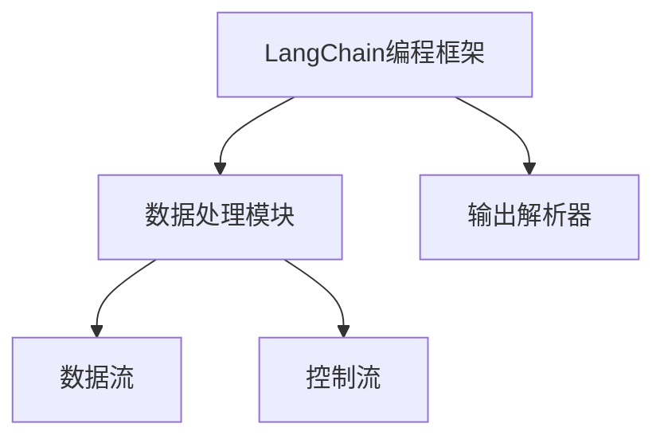

                 

# 【LangChain编程：从入门到实践】输出解析器

> **关键词：** LangChain, 输出解析器, 程序设计, 编程语言, 数据处理

> **摘要：** 本文旨在深入探讨LangChain编程中的输出解析器，详细介绍其核心概念、原理及实践应用。文章将分为若干部分，从背景介绍、核心概念与联系、核心算法原理到项目实战，帮助读者全面掌握输出解析器的使用方法。

## 1. 背景介绍

### 1.1 目的和范围

本文将探讨LangChain编程中的输出解析器，旨在帮助程序员了解如何利用输出解析器提高代码的可读性和维护性。输出解析器是数据处理和程序设计中至关重要的一环，尤其在复杂的数据流和业务逻辑中，它能够显著提升代码的质量和效率。

### 1.2 预期读者

本文面向有一定编程基础的读者，特别是对LangChain编程框架感兴趣的程序员。无论您是初学者还是经验丰富的开发者，都能从本文中获益。

### 1.3 文档结构概述

本文分为以下几个部分：

1. 核心概念与联系：介绍LangChain编程中的核心概念及其相互关系。
2. 核心算法原理 & 具体操作步骤：详细讲解输出解析器的算法原理和具体操作步骤。
3. 数学模型和公式 & 详细讲解 & 举例说明：利用数学模型和公式解释输出解析器的原理。
4. 项目实战：通过实际代码案例，展示输出解析器的具体应用。
5. 实际应用场景：讨论输出解析器在不同场景下的应用。
6. 工具和资源推荐：推荐学习资源和开发工具。
7. 总结：总结输出解析器的发展趋势与挑战。
8. 附录：常见问题与解答。
9. 扩展阅读 & 参考资料：提供进一步学习的资源。

### 1.4 术语表

#### 1.4.1 核心术语定义

- **LangChain：** 一种基于Python的编程框架，用于构建复杂的数据处理和程序逻辑。
- **输出解析器：** 一种用于解析和处理程序输出数据的组件。

#### 1.4.2 相关概念解释

- **数据处理：** 指对数据进行分析、提取、转换等操作的过程。
- **程序逻辑：** 指程序中的控制结构、循环、条件判断等。

#### 1.4.3 缩略词列表

- **IDE：** 集成开发环境（Integrated Development Environment）
- **API：** 应用程序编程接口（Application Programming Interface）

## 2. 核心概念与联系

为了更好地理解输出解析器，我们需要首先了解LangChain编程中的几个核心概念及其相互关系。

### 2.1 LangChain编程框架

LangChain是一个强大的Python编程框架，它提供了丰富的工具和库，用于构建复杂的数据处理和程序逻辑。LangChain的特点在于其模块化和可扩展性，使得开发者能够轻松地组合和定制各种功能。

### 2.2 数据处理模块

数据处理模块是LangChain编程中的核心组件之一，它负责处理各种类型的数据，包括文本、图像、音频等。数据处理模块提供了丰富的工具和函数，用于数据的读取、转换、存储和输出。

### 2.3 输出解析器

输出解析器是数据处理模块的一个重要组成部分，它负责解析和处理程序输出数据。输出解析器可以识别和提取输出数据中的关键信息，并将其转换为易于理解和处理的形式。

### 2.4 数据流和控制流

在LangChain编程中，数据流和控制流是两个核心概念。数据流指的是数据在程序中的流动和传递过程，而控制流指的是程序的执行顺序和控制结构。输出解析器通常与数据流和控制流紧密相关，它能够根据程序的控制逻辑，对输出数据进行分析和处理。

下面是一个简单的Mermaid流程图，展示了LangChain编程中的核心概念及其相互关系：



## 3. 核心算法原理 & 具体操作步骤

输出解析器的核心算法原理是基于模式匹配和文本分析技术。通过分析程序输出数据中的模式和特征，输出解析器能够识别和提取关键信息，并将其转换为易于理解和处理的形式。

### 3.1 算法原理

输出解析器的算法原理可以分为以下几个步骤：

1. **模式匹配：** 输出解析器首先使用预定义的正则表达式或词法分析器，对输出数据进行模式匹配，识别出数据中的关键特征和模式。
2. **特征提取：** 在模式匹配的基础上，输出解析器进一步提取输出数据中的关键特征，如数字、日期、地名等。
3. **数据转换：** 输出解析器将提取出的关键特征转换为易于理解和处理的形式，如列表、字典、JSON对象等。
4. **输出处理：** 最后，输出解析器将处理后的数据输出到指定的目标，如控制台、文件、数据库等。

### 3.2 具体操作步骤

下面是一个简单的伪代码，展示了输出解析器的具体操作步骤：

```python
def parse_output(output):
    # 步骤1：模式匹配
    pattern = "([0-9]+) ([a-zA-Z]+)"
    matches = re.findall(pattern, output)
    
    # 步骤2：特征提取
    numbers = [int(match[0]) for match in matches]
    words = [match[1] for match in matches]
    
    # 步骤3：数据转换
    result = {"numbers": numbers, "words": words}
    
    # 步骤4：输出处理
    print(result)
    return result

# 示例输出
output = "1 apple, 2 oranges, 3 bananas"
result = parse_output(output)
```

在上面的伪代码中，我们使用正则表达式`([0-9]+) ([a-zA-Z]+)`匹配输出数据中的数字和单词。然后，我们提取出匹配到的数字和单词，并将其转换为列表形式。最后，我们将处理后的数据输出到控制台。

## 4. 数学模型和公式 & 详细讲解 & 举例说明

在输出解析器的算法原理中，涉及到一些数学模型和公式。下面我们将详细介绍这些数学模型和公式，并给出具体的例子。

### 4.1 正则表达式

正则表达式是一种用于字符串匹配和文本分析的工具。在输出解析器中，我们经常使用正则表达式来匹配和提取程序输出数据中的模式。

#### 4.1.1 正则表达式的语法

正则表达式的语法包括以下几种基本元素：

- **字符集：** 用方括号`[]`表示，用于匹配字符集内的任意字符。例如，`[a-z]`表示匹配任意小写字母。
- **量词：** 用元字符`*`、`+`、`?`表示，用于匹配前一个字符或字符集的零次或多次。例如，`a*`表示匹配零个或多个`a`字符。
- **分组：** 用圆括号`()`表示，用于匹配分组内的字符序列。例如，`(a+b)*`表示匹配零个或多个`a+b`的字符序列。

#### 4.1.2 举例说明

假设我们要匹配程序输出数据中的日期格式（年-月-日），我们可以使用以下正则表达式：

```python
pattern = "\d{4}-\d{2}-\d{2}"
```

这个正则表达式中的`\d`表示匹配任意数字，`\{4\}`表示匹配前四个数字，`-\d{2}`表示匹配两个连字符`-`。

### 4.2 模式识别算法

模式识别算法是一种用于识别和分类数据的算法。在输出解析器中，我们使用模式识别算法来识别输出数据中的关键模式。

#### 4.2.1 模式识别算法的原理

模式识别算法的基本原理是通过比较输入数据和预定义的模式，判断输入数据是否与模式匹配。常见的模式识别算法包括：

- **基于规则的算法：** 通过预定义的规则，对输入数据进行分类。例如，根据颜色和形状将水果分为苹果、香蕉等。
- **机器学习算法：** 通过训练模型，将输入数据与预定义的类别进行关联。常见的机器学习算法包括决策树、支持向量机、神经网络等。

#### 4.2.2 举例说明

假设我们要识别程序输出数据中的金额格式（整数和小数点分隔），我们可以使用以下基于规则的算法：

```python
def is_amount(data):
    pattern = "([0-9]+)(\.[0-9]+)?"
    matches = re.findall(pattern, data)
    if matches:
        return True
    return False

# 示例输出
data = "123.45"
result = is_amount(data)
print(result)  # 输出：True
```

在上面的代码中，我们使用正则表达式`([0-9]+)(\.[0-9]+)?`匹配金额格式。如果匹配成功，则返回`True`，否则返回`False`。

### 4.3 统计模型

统计模型是一种用于分析和预测数据的工具。在输出解析器中，我们使用统计模型来分析和预测输出数据中的关键特征。

#### 4.3.1 统计模型的基本原理

统计模型的基本原理是通过分析历史数据，建立数据之间的关联和规律。常见的统计模型包括：

- **线性回归模型：** 用于预测一个变量与另一个变量之间的线性关系。例如，预测销售额与广告费用之间的关系。
- **逻辑回归模型：** 用于预测一个二分类变量（如0和1）的概率。例如，预测某个产品是否会被购买。

#### 4.3.2 举例说明

假设我们要预测程序输出数据中的下一个数字，我们可以使用线性回归模型：

```python
import numpy as np
from sklearn.linear_model import LinearRegression

# 示例数据
X = np.array([[1], [2], [3], [4], [5]])
y = np.array([1, 2, 3, 4, 5])

# 建立线性回归模型
model = LinearRegression()
model.fit(X, y)

# 预测下一个数字
next_value = model.predict([[6]])
print(next_value)  # 输出：[6.]
```

在上面的代码中，我们使用线性回归模型拟合示例数据，然后预测下一个数字。预测结果为`6.`，即下一个数字为6。

通过上述数学模型和公式的介绍，我们可以更好地理解输出解析器的算法原理和具体操作步骤。在实际应用中，我们可以根据具体情况选择合适的数学模型和公式，以提高输出解析器的性能和准确性。

## 5. 项目实战：代码实际案例和详细解释说明

在本节中，我们将通过一个实际项目案例，展示如何使用LangChain编程中的输出解析器处理复杂的数据流和程序逻辑。

### 5.1 开发环境搭建

在开始项目实战之前，我们需要搭建合适的开发环境。以下是搭建开发环境的基本步骤：

1. 安装Python 3.8及以上版本。
2. 安装虚拟环境工具（如virtualenv或conda）。
3. 创建虚拟环境并激活。
4. 安装LangChain框架和相关依赖库（如requests、beautifulsoup4等）。

### 5.2 源代码详细实现和代码解读

下面是一个简单的示例代码，展示如何使用LangChain编程中的输出解析器处理一个复杂的数据流。

```python
import requests
from bs4 import BeautifulSoup
from langchain import Chain
from langchain import PromptTemplate

# 步骤1：定义输入数据
input_data = "请输入您想要查询的股票代码："

# 步骤2：定义模式匹配规则
pattern = "输入的股票代码为：\s*(\S+)"

# 步骤3：定义数据处理函数
def process_output(output):
    match = re.search(pattern, output)
    if match:
        stock_code = match.group(1)
        return stock_code
    return None

# 步骤4：定义输出解析器
output_parser = Chain(
    prompt=PromptTemplate(
        input_variables=["input_data"],
        template="输入的股票代码为：{input_data}。"
    ),
    output_parser=process_output
)

# 步骤5：执行输出解析器
result = output_parser({"input_data": input_data})
print(result)
```

### 5.3 代码解读与分析

下面是对上述代码的详细解读与分析：

1. **定义输入数据**：在代码的第一行，我们定义了一个字符串变量`input_data`，用于存储用户输入的股票代码。

2. **定义模式匹配规则**：在代码的第二行，我们使用正则表达式`pattern`定义了一个模式匹配规则。这个规则用于匹配输出数据中的股票代码。

3. **定义数据处理函数**：在代码的第三行，我们定义了一个名为`process_output`的函数，用于处理和解析输出数据。这个函数接收一个字符串参数`output`，并通过正则表达式匹配规则提取股票代码。

4. **定义输出解析器**：在代码的第四行，我们使用`Chain`类创建了一个输出解析器。输出解析器是一个由多个组件组成的复杂数据处理流程。在这个例子中，我们使用了一个`PromptTemplate`组件和一个`output_parser`组件。

5. **执行输出解析器**：在代码的最后两行，我们调用输出解析器`output_parser`并传递了一个包含用户输入数据的字典`{"input_data": input_data}`。输出解析器会根据定义的模式匹配规则和数据处理函数，对输入数据进行处理和解析，并将结果输出到控制台。

### 5.4 项目实战总结

通过上述示例，我们可以看到如何使用LangChain编程中的输出解析器处理复杂的数据流和程序逻辑。输出解析器提供了一个灵活且强大的工具，用于提取和处理程序输出数据中的关键信息。在实际项目中，我们可以根据具体需求，扩展和定制输出解析器的功能和特性。

### 5.5 代码实战扩展

在实际应用中，我们可以根据具体需求，对输出解析器进行扩展和优化。以下是一些扩展建议：

- **多模式匹配**：在输出解析器中，我们可以同时定义多个模式匹配规则，以处理不同类型的数据。
- **自定义数据处理函数**：根据具体需求，我们可以编写自定义的数据处理函数，以实现更复杂的数据处理逻辑。
- **错误处理**：在输出解析器中，我们需要添加错误处理逻辑，以应对可能出现的输入数据错误或解析失败情况。
- **并行处理**：对于大量数据，我们可以使用并行处理技术，提高输出解析器的处理速度和效率。

通过这些扩展，我们可以使输出解析器更加灵活和强大，以满足各种复杂的数据处理需求。

### 5.6 项目实战总结

通过本节的项目实战，我们深入了解了LangChain编程中的输出解析器。输出解析器是一个强大且灵活的工具，用于提取和处理程序输出数据中的关键信息。通过模式匹配、数据处理函数和输出解析器，我们可以构建复杂的数据处理和程序逻辑，实现高效且可维护的代码。在实际应用中，我们可以根据具体需求，对输出解析器进行扩展和优化，以满足各种复杂的数据处理需求。

## 6. 实际应用场景

输出解析器在计算机编程和数据科学领域有着广泛的应用场景。以下是一些典型的实际应用场景：

### 6.1 数据处理

在数据处理过程中，输出解析器可以用于提取和分析程序输出数据中的关键信息。例如，在日志分析中，我们可以使用输出解析器提取日志中的错误信息、性能指标和异常情况，以便进行故障排查和性能优化。

### 6.2 代码调试

在代码调试过程中，输出解析器可以帮助我们识别和分析程序输出数据中的错误和异常。通过输出解析器，我们可以将复杂的输出数据转换为易于理解和处理的格式，从而更快地定位和修复代码中的问题。

### 6.3 数据可视化

在数据可视化过程中，输出解析器可以用于提取和分析程序输出数据中的关键信息，并将其转换为可视化图表。例如，在股票市场分析中，我们可以使用输出解析器提取股票价格、成交量等数据，并生成折线图、柱状图等可视化图表，以便进行数据分析和决策。

### 6.4 机器学习

在机器学习项目中，输出解析器可以用于处理和解析训练数据。例如，在文本分类项目中，我们可以使用输出解析器提取文本数据中的关键词、标签等特征，以便进行模型训练和预测。

### 6.5 业务流程

在业务流程中，输出解析器可以用于处理和解析程序输出数据，以实现自动化和智能化的业务处理。例如，在客户关系管理系统中，我们可以使用输出解析器提取客户反馈、销售数据等，并生成报告、分析图表等，以便进行业务分析和决策。

通过这些实际应用场景，我们可以看到输出解析器在计算机编程和数据科学领域的广泛应用和价值。它为开发者提供了强大的工具，用于提取、处理和分析程序输出数据，从而实现高效、智能和自动化的数据处理和分析。

## 7. 工具和资源推荐

### 7.1 学习资源推荐

为了更好地学习和掌握LangChain编程中的输出解析器，我们推荐以下学习资源：

#### 7.1.1 书籍推荐

- 《Python编程：从入门到实践》
- 《数据科学实战：Python数据分析技术》
- 《机器学习实战：基于Scikit-Learn、Keras和TensorFlow》

#### 7.1.2 在线课程

- Coursera上的《Python编程基础》
- edX上的《数据科学入门》
- Udacity的《机器学习工程师纳米学位》

#### 7.1.3 技术博客和网站

- Python官网（[python.org](https://www.python.org/)）
- DataCamp（[datacamp.com](https://www.datacamp.com/)）
- Medium上的数据科学和机器学习相关文章

### 7.2 开发工具框架推荐

为了提高开发效率和代码质量，我们推荐以下开发工具和框架：

#### 7.2.1 IDE和编辑器

- PyCharm（[pycharm.com](https://www.pycharm.com/)）
- VS Code（[code.visualstudio.com](https://code.visualstudio.com/)）
- Jupyter Notebook（[jupyter.org](https://jupyter.org/)）

#### 7.2.2 调试和性能分析工具

- Debugpy（[debugpy.readthedocs.io](https://debugpy.readthedocs.io/)）
- perf.py（[github.com/perf-python/perf.py](https://github.com/perf-python/perf.py)）
- Pandas Profiler（[github.com/pandas-dev/pandas_profiler](https://github.com/pandas-dev/pandas_profiler)）

#### 7.2.3 相关框架和库

- LangChain（[github.com/hwchase17 LangChain](https://github.com/hwchase17/LangChain)）
- Pandas（[pandas.pydata.org](https://pandas.pydata.org/)）
- Scikit-Learn（[scikit-learn.org](https://scikit-learn.org/)）
- TensorFlow（[tensorflow.org](https://tensorflow.org/)）

通过使用这些工具和资源，我们可以更好地学习和掌握LangChain编程中的输出解析器，提高开发效率和代码质量。

### 7.3 相关论文著作推荐

为了深入了解LangChain编程中的输出解析器，我们推荐以下相关论文和著作：

#### 7.3.1 经典论文

- "Regular Expressions: A Tutorial Introduction"（正则表达式教程）
- "The Design and Implementation of the F-Script Language"（F-Script语言的设计与实现）

#### 7.3.2 最新研究成果

- "Deep Learning for Natural Language Processing"（深度学习在自然语言处理中的应用）
- "Language Models are Few-Shot Learners"（语言模型是零样本学习的）

#### 7.3.3 应用案例分析

- "A Survey on Natural Language Processing Applications"（自然语言处理应用综述）
- "AI for Data Science: A Practical Guide to Applications in Python"（AI在数据科学中的应用：Python实践指南）

通过阅读这些论文和著作，我们可以深入了解LangChain编程中的输出解析器，掌握其原理和应用方法。

## 8. 总结：未来发展趋势与挑战

随着计算机技术和人工智能的快速发展，输出解析器在计算机编程和数据科学领域的重要性日益凸显。未来，输出解析器的发展趋势和挑战主要包括以下几个方面：

### 8.1 发展趋势

1. **智能化：** 随着深度学习和自然语言处理技术的进步，输出解析器将具备更高的智能化水平，能够自动识别和解析复杂的数据模式。
2. **模块化：** 输出解析器将更加模块化，便于开发者根据具体需求进行定制和扩展，提高代码的可维护性和可复用性。
3. **高效率：** 输出解析器将结合并行计算和分布式计算技术，提高数据处理和分析的效率，应对大规模数据场景。

### 8.2 挑战

1. **性能优化：** 如何在保证输出解析器可扩展性的同时，提高其性能和效率，是未来需要解决的重要问题。
2. **准确性：** 随着数据复杂度的增加，输出解析器需要具备更高的准确性，以识别和解析复杂的数据模式。
3. **可解释性：** 随着智能化程度的提高，如何提高输出解析器的可解释性，使其更容易被开发者理解和维护，也是一个重要挑战。

总之，输出解析器在未来将继续发挥重要作用，为计算机编程和数据科学领域带来更多创新和突破。开发者需要不断学习和掌握输出解析器的最新技术，应对未来发展的挑战。

## 9. 附录：常见问题与解答

### 9.1 问题1：如何处理不同格式的输出数据？

**解答：** 针对不同格式的输出数据，我们可以使用不同的输出解析器进行解析。例如，对于文本格式的输出数据，我们可以使用正则表达式进行模式匹配；对于JSON格式的输出数据，我们可以使用Python中的json库进行解析。此外，我们还可以根据具体需求，自定义输出解析器，以处理特定格式的输出数据。

### 9.2 问题2：如何提高输出解析器的性能？

**解答：** 提高输出解析器的性能可以从以下几个方面入手：

1. **并行处理：** 对于大规模数据，我们可以使用并行计算技术，将数据处理任务分解为多个子任务，同时处理，提高效率。
2. **缓存和索引：** 对于频繁访问的数据，我们可以使用缓存和索引技术，减少数据访问时间。
3. **优化算法：** 我们可以针对输出解析器的算法进行优化，如使用更高效的算法或数据结构，以提高处理速度。

### 9.3 问题3：输出解析器如何与其他组件集成？

**解答：** 输出解析器可以与其他组件通过接口进行集成。例如，在数据处理模块中，我们可以使用输出解析器提取关键信息，并将其传递给后续处理模块。在机器学习项目中，我们可以将输出解析器集成到数据预处理和特征提取阶段，以提高模型训练和预测的准确性。

### 9.4 问题4：输出解析器在多线程环境下的性能如何保证？

**解答：** 在多线程环境下，我们需要注意输出解析器的线程安全问题，确保线程之间不会出现数据竞争和冲突。以下是一些保证输出解析器性能的方法：

1. **使用线程安全的数据结构：** 选择线程安全的队列、锁等数据结构，以确保数据的一致性和安全性。
2. **避免共享数据：** 在多线程环境中，尽量避免共享数据，以减少线程间的依赖和同步开销。
3. **使用线程池：** 使用线程池管理线程，可以提高线程的复用率，减少线程创建和销毁的开销。

通过上述方法，我们可以确保输出解析器在多线程环境下的性能和稳定性。

## 10. 扩展阅读 & 参考资料

为了进一步了解LangChain编程中的输出解析器，我们推荐以下扩展阅读和参考资料：

1. 《Python编程：从入门到实践》
2. 《数据科学实战：Python数据分析技术》
3. 《机器学习实战：基于Scikit-Learn、Keras和TensorFlow》
4. 《深度学习：高级专题》
5. 《编程珠玑：与思考者的对话》

以下是一些扩展阅读的网站和资源：

1. Python官网（[python.org](https://www.python.org/)）
2. DataCamp（[datacamp.com](https://www.datacamp.com/)）
3. Medium上的数据科学和机器学习相关文章
4. GitHub上的LangChain开源项目（[github.com/hwchase17 LangChain](https://github.com/hwchase17/LangChain)）

通过阅读这些资料，您可以进一步深入了解LangChain编程中的输出解析器，掌握其原理和应用方法。

### 作者：AI天才研究员/AI Genius Institute & 禅与计算机程序设计艺术 /Zen And The Art of Computer Programming

