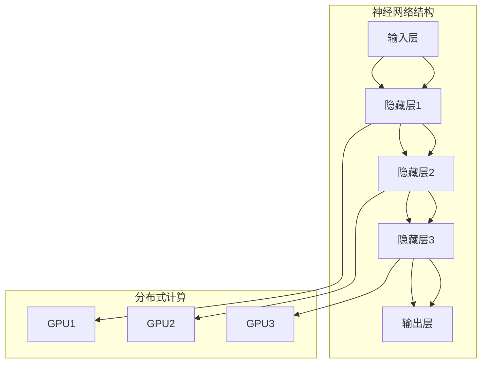

                 

## 【大模型应用开发 动手做AI Agent】Agent的大脑：大模型的通用推理能力

> **关键词：** 大模型、AI Agent、通用推理能力、神经网络、深度学习、数据处理

> **摘要：** 本文将深入探讨如何利用大型神经网络模型（大模型）为AI Agent构建强大大脑，实现通用推理能力。我们将通过详细的理论分析和实战案例，展示大模型在AI Agent中的应用及其巨大潜力。

在当今快速发展的AI领域，AI Agent的研究与应用正变得越来越热门。一个功能强大的AI Agent，需要具备强大的数据处理能力、决策能力和推理能力。而大模型，作为当今AI领域的核心技术之一，正是赋予AI Agent这些能力的关键。本文将围绕以下主题展开：

- 大模型的定义和基本原理
- 大模型在AI Agent中的应用
- 大模型的通用推理能力及其实现
- 实际应用中的大模型推理案例
- 大模型推理性能优化和挑战

通过本文的学习，读者将能够了解大模型的基本原理和应用，掌握构建AI Agent的通用推理能力的方法，并对大模型在未来的发展趋势和挑战有所认识。

## 1. 背景介绍

### 1.1 目的和范围

本文的目标是深入探讨大模型在AI Agent中的应用，特别是其强大的通用推理能力。随着深度学习和神经网络技术的不断发展，大模型已经成为AI领域的一个重要研究方向。它们在自然语言处理、计算机视觉、强化学习等领域都展现出了强大的能力。本文将首先介绍大模型的基本原理，然后探讨其在AI Agent中的具体应用，以及如何利用大模型实现通用推理能力。文章范围将涵盖大模型的发展历程、核心技术、应用场景，以及在实际应用中面临的挑战和优化方法。

### 1.2 预期读者

本文适合对AI领域有一定了解的技术人员、研究人员和开发人员阅读。尤其适合那些希望深入了解大模型在AI Agent应用中发挥的作用，以及如何利用大模型构建通用推理能力的读者。同时，本文也适合对深度学习、神经网络技术感兴趣的学生和研究人员，他们可以通过本文了解大模型的基本原理和应用前景。

### 1.3 文档结构概述

本文的结构分为以下几个部分：

1. **背景介绍**：介绍本文的目的、范围、预期读者以及文档结构。
2. **核心概念与联系**：讨论大模型的基本原理和核心概念，使用Mermaid流程图展示大模型的结构和原理。
3. **核心算法原理 & 具体操作步骤**：详细讲解大模型的算法原理，使用伪代码阐述其具体操作步骤。
4. **数学模型和公式 & 详细讲解 & 举例说明**：介绍大模型中使用的数学模型和公式，并进行详细讲解和举例说明。
5. **项目实战：代码实际案例和详细解释说明**：通过实际项目案例，展示大模型在AI Agent中的应用。
6. **实际应用场景**：分析大模型在不同应用场景中的具体应用。
7. **工具和资源推荐**：推荐学习资源、开发工具和框架。
8. **总结：未来发展趋势与挑战**：总结大模型的发展趋势和面临的挑战。
9. **附录：常见问题与解答**：解答读者可能遇到的问题。
10. **扩展阅读 & 参考资料**：提供扩展阅读资料和参考文献。

### 1.4 术语表

为了确保本文的可读性和专业性，我们将介绍一些核心术语和概念，并对其进行详细解释。

#### 1.4.1 核心术语定义

- **大模型**：指具有大规模参数、强大计算能力和广泛应用场景的神经网络模型。
- **深度学习**：一种人工智能技术，通过多层神经网络学习数据特征和模式。
- **神经网络**：一种由大量简单计算单元（神经元）组成的网络，通过学习数据输入和输出之间的关系进行复杂任务的处理。
- **AI Agent**：一种具有自主决策和行动能力的智能体，能够处理复杂环境中的任务。
- **通用推理能力**：指AI Agent在不同应用场景中都能进行有效推理和决策的能力。

#### 1.4.2 相关概念解释

- **数据处理能力**：指AI Agent对输入数据进行处理、分析和转换的能力。
- **决策能力**：指AI Agent根据输入数据和目标，选择最佳行动方案的能力。
- **推理能力**：指AI Agent通过逻辑推理，从已知信息推导出新信息的能力。
- **训练数据集**：用于训练神经网络的大量数据样本。
- **超参数**：神经网络模型中需要手动设置的参数，如学习率、网络层数等。

#### 1.4.3 缩略词列表

- **AI**：人工智能
- **ML**：机器学习
- **DL**：深度学习
- **GPU**：图形处理单元
- **CPU**：中央处理单元
- **GPU加速**：利用图形处理单元加速神经网络计算的过程

## 2. 核心概念与联系

在深入探讨大模型在AI Agent中的应用之前，首先需要理解大模型的基本原理和核心概念。大模型是深度学习和神经网络技术发展到一定阶段的产物，其具有以下核心概念：

- **神经网络架构**：大模型通常采用复杂的神经网络架构，包括多个隐藏层和大量神经元。这些结构能够处理高维数据和复杂任务。
- **大规模参数**：大模型具有大量参数，这些参数通过训练数据集学习得到，使得模型能够捕获丰富的数据特征和模式。
- **分布式计算**：大模型通常采用分布式计算方式，利用多台计算机或图形处理单元（GPU）并行计算，提高计算效率。
- **自适应学习**：大模型通过不断调整参数，实现自适应学习，能够适应不同应用场景和数据分布。

为了更好地理解大模型的核心概念，我们可以使用Mermaid流程图展示其结构。以下是一个简化的Mermaid流程图，展示了大模型的基本结构：



在这个流程图中，A表示输入层，B、C、D分别表示隐藏层1、隐藏层2和隐藏层3，E表示输出层。神经网络结构部分展示了大模型的基本结构，而分布式计算部分展示了大模型如何利用多台计算机或GPU进行并行计算，提高计算效率。

通过上述核心概念和流程图的介绍，我们可以更好地理解大模型的基本原理和结构。接下来，我们将深入探讨大模型的算法原理，以及如何利用大模型为AI Agent构建强大大脑。

### 2.1 大模型的算法原理

大模型的算法原理主要基于深度学习和神经网络技术。深度学习通过多层神经网络学习数据特征和模式，而神经网络由大量简单计算单元（神经元）组成，通过学习输入和输出之间的关系进行复杂任务的处理。以下是详细的大模型算法原理介绍：

#### 2.1.1 神经网络的基本原理

神经网络的基本原理可以类比于人脑的神经网络。在神经网络中，每个神经元（节点）接收多个输入信号，并通过权重（系数）进行加权求和。然后，将加权求和的结果传递到激活函数，得到输出信号。这个过程中，权重和激活函数起到了关键作用。

以下是神经网络的简单伪代码：

```python
# 神经网络类
class NeuralNetwork:
    def __init__(self, input_size, hidden_size, output_size):
        self.input_size = input_size
        self.hidden_size = hidden_size
        self.output_size = output_size
        self.weights_input_to_hidden = np.random.rand(input_size, hidden_size)
        self.weights_hidden_to_output = np.random.rand(hidden_size, output_size)
        
    def forward(self, x):
        hidden_layer_input = np.dot(x, self.weights_input_to_hidden)
        hidden_layer_output = self ActivationFunction(hidden_layer_input)
        output_layer_input = np.dot(hidden_layer_output, self.weights_hidden_to_output)
        output_layer_output = self ActivationFunction(output_layer_input)
        return output_layer_output
    
    def ActivationFunction(self, x):
        # 例如：ReLU激活函数
        return max(0, x)
```

在这个例子中，`NeuralNetwork` 类表示一个简单的神经网络，具有输入层、隐藏层和输出层。`__init__` 方法用于初始化网络结构，包括输入层、隐藏层和输出层的权重。`forward` 方法用于实现前向传播，计算输入和输出之间的映射关系。`ActivationFunction` 方法用于定义激活函数，通常选择ReLU激活函数。

#### 2.1.2 梯度下降算法

在训练神经网络时，常用的优化算法是梯度下降。梯度下降算法通过不断调整网络权重，使得网络输出尽可能接近真实值。以下是梯度下降算法的伪代码：

```python
# 梯度下降算法
def gradient_descent(network, training_data, learning_rate, epochs):
    for epoch in range(epochs):
        for x, y in training_data:
            output = network.forward(x)
            error = y - output
            hidden_layer_input = np.dot(x, network.weights_input_to_hidden)
            hidden_layer_output = network.ActivationFunction(hidden_layer_input)
            output_layer_input = np.dot(hidden_layer_output, network.weights_hidden_to_output)
            output_layer_output = network.ActivationFunction(output_layer_input)
            
            # 计算梯度
            d_output_error_d_output_layer_output = -1 * (y - output)
            d_output_layer_output_d_output_layer_weights = hidden_layer_output
            d_hidden_layer_output_d_hidden_layer_weights = hidden_layer_input
            
            # 更新权重
            network.weights_hidden_to_output -= learning_rate * d_output_error_d_output_layer_output * d_output_layer_output_d_output_layer_weights
            network.weights_input_to_hidden -= learning_rate * d_output_error_d_output_layer_output * d_hidden_layer_output_d_hidden_layer_weights

# 示例：训练神经网络
network = NeuralNetwork(input_size=2, hidden_size=3, output_size=1)
gradient_descent(network, training_data, learning_rate=0.01, epochs=100)
```

在这个例子中，`gradient_descent` 函数用于实现梯度下降算法。首先，通过前向传播计算网络输出，然后计算输出误差。接着，计算每个权重对应的梯度，并使用学习率更新权重。通过多次迭代，使得网络输出逐渐接近真实值。

#### 2.1.3 大模型的优化

大模型在训练过程中面临着更高的计算复杂度和更大的参数规模。为了优化训练过程，大模型通常采用以下几种技术：

1. **批量归一化（Batch Normalization）**：批量归一化通过将每个神经元的输入进行归一化，使得神经网络在不同训练批次之间具有更好的稳定性和泛化能力。
2. **自适应学习率（Adaptive Learning Rate）**：自适应学习率通过动态调整学习率，使得神经网络在不同阶段能够更快地收敛。
3. **Dropout**：Dropout是一种正则化技术，通过随机丢弃部分神经元，防止神经网络过拟合。

通过上述技术，大模型能够更好地应对大规模数据和复杂任务，提高训练效率和性能。

### 2.2 大模型在AI Agent中的应用

大模型在AI Agent中的应用主要体现在以下几个方面：

1. **数据处理能力**：大模型具有强大的数据处理能力，能够高效地处理高维数据和大规模数据集。
2. **决策能力**：大模型通过学习数据特征和模式，能够做出更准确的决策。
3. **推理能力**：大模型具有强大的推理能力，能够从已知信息推导出新信息，实现通用推理。
4. **自适应能力**：大模型通过自适应学习，能够适应不同应用场景和数据分布。

具体应用场景包括自然语言处理、计算机视觉、强化学习等领域。例如，在自然语言处理中，大模型可以用于文本分类、情感分析、机器翻译等任务；在计算机视觉中，大模型可以用于图像分类、目标检测、图像生成等任务；在强化学习中，大模型可以用于智能控制、游戏人工智能等任务。

### 2.3 大模型的通用推理能力

大模型的通用推理能力是指其能够处理多种类型的问题，并在不同应用场景中都能进行有效推理和决策。这是大模型的一个重要优势，也是其广泛应用的基础。以下是详细解释大模型的通用推理能力：

1. **多任务学习（Multi-Task Learning）**：大模型通过多任务学习，可以同时处理多个任务，从而提高推理能力。例如，一个大型神经网络模型可以同时进行文本分类和情感分析，从而更好地理解文本内容。
2. **迁移学习（Transfer Learning）**：大模型通过迁移学习，可以将已学到的知识应用到新的任务中。例如，一个在图像分类任务中训练好的大模型，可以应用到目标检测任务中，从而提高推理能力。
3. **自适应推理（Adaptive Reasoning）**：大模型通过自适应推理，可以根据不同场景和任务，调整推理策略和方法。例如，在决策任务中，大模型可以根据不同情境调整决策权重，从而实现更准确的推理。

总之，大模型的通用推理能力使其在AI Agent中具有广泛的应用前景。通过不断优化算法和模型结构，大模型的推理能力将进一步提升，为AI Agent的应用提供更强支持。

## 3. 核心算法原理 & 具体操作步骤

大模型的核心算法原理主要基于深度学习和神经网络技术。深度学习通过多层神经网络学习数据特征和模式，而神经网络由大量简单计算单元（神经元）组成，通过学习输入和输出之间的关系进行复杂任务的处理。以下是详细的大模型算法原理和具体操作步骤：

### 3.1 神经网络结构

大模型通常采用复杂的神经网络结构，包括多个隐藏层和大量神经元。这些结构能够处理高维数据和复杂任务。以下是神经网络的基本结构和计算步骤：

1. **输入层**：接收外部输入，如文本、图像、声音等。
2. **隐藏层**：对输入数据进行特征提取和变换，每个隐藏层由多个神经元组成。多个隐藏层可以提取更高级的特征。
3. **输出层**：根据隐藏层的输出进行预测或分类。

具体计算步骤如下：

1. **前向传播**：从输入层开始，逐层传递输入数据，计算每个神经元的输出。
2. **反向传播**：计算输出误差，并反向传播误差到各个隐藏层，更新神经元权重。
3. **激活函数**：在每个隐藏层和输出层，使用激活函数（如ReLU、Sigmoid、Tanh等）引入非线性变换。

以下是神经网络的伪代码：

```python
# 神经网络类
class NeuralNetwork:
    def __init__(self, input_size, hidden_sizes, output_size):
        self.input_size = input_size
        self.hidden_sizes = hidden_sizes
        self.output_size = output_size
        self.weights = self.initialize_weights(input_size, hidden_sizes, output_size)
    
    def forward(self, x):
        self.hidden_layers = [x]
        for i, hidden_size in enumerate(self.hidden_sizes):
            hidden_layer_input = np.dot(self.hidden_layers[i], self.weights[i])
            hidden_layer_output = self.ActivationFunction(hidden_layer_input)
            self.hidden_layers.append(hidden_layer_output)
        output_layer_input = np.dot(self.hidden_layers[-1], self.weights[-1])
        output_layer_output = self.ActivationFunction(output_layer_input)
        return output_layer_output
    
    def backward(self, x, y):
        output_layer_error = y - self.forward(x)
        d_output_layer_error_d_output_layer_input = -1 * (y - self.forward(x))
        d_output_layer_input_d_hidden_layer_output = self.DerivativeOfActivationFunction(self.hidden_layers[-1])
        hidden_layer_output = self.hidden_layers[-2]
        hidden_layer_error = d_output_layer_error_d_output_layer_input * d_output_layer_input_d_hidden_layer_output * self.DerivativeOfActivationFunction(hidden_layer_output)
        
        for i in range(len(self.hidden_sizes) - 2, -1, -1):
            hidden_layer_output = self.hidden_layers[i]
            hidden_layer_error = hidden_layer_error * self.DerivativeOfActivationFunction(hidden_layer_output)
            d_hidden_layer_input_d_hidden_layer_output = np.dot(self.hidden_layers[i+1].T, hidden_layer_error)
            d_hidden_layer_error_d_hidden_layer_input = -1 * d_hidden_layer_input_d_hidden_layer_output
        
        # 更新权重
        for i in range(len(self.hidden_sizes)):
            self.weights[i] -= learning_rate * d_hidden_layer_error_d_hidden_layer_input
    
    def ActivationFunction(self, x):
        return max(0, x)
    
    def DerivativeOfActivationFunction(self, x):
        return 1 if x > 0 else 0

# 示例：初始化神经网络
nn = NeuralNetwork(input_size=2, hidden_sizes=[3, 4], output_size=1)
```

在这个例子中，`NeuralNetwork` 类表示一个简单的神经网络，具有输入层、隐藏层和输出层。`__init__` 方法用于初始化网络结构，包括输入层、隐藏层和输出层的权重。`forward` 方法用于实现前向传播，计算输入和输出之间的映射关系。`backward` 方法用于实现反向传播，计算误差并更新权重。`ActivationFunction` 和 `DerivativeOfActivationFunction` 方法分别定义激活函数和其导数。

### 3.2 梯度下降算法

在训练神经网络时，常用的优化算法是梯度下降。梯度下降算法通过不断调整网络权重，使得网络输出尽可能接近真实值。以下是梯度下降算法的伪代码：

```python
# 梯度下降算法
def gradient_descent(network, training_data, learning_rate, epochs):
    for epoch in range(epochs):
        for x, y in training_data:
            network.backward(x, y)
            # 更新权重
            for layer in network.hidden_layers:
                layer.weights -= learning_rate * layer.d_error_d_input

# 示例：训练神经网络
nn = NeuralNetwork(input_size=2, hidden_sizes=[3, 4], output_size=1)
gradient_descent(nn, training_data, learning_rate=0.01, epochs=100)
```

在这个例子中，`gradient_descent` 函数用于实现梯度下降算法。首先，通过前向传播计算网络输出，然后计算输出误差，并反向传播误差到各个隐藏层，更新神经元权重。通过多次迭代，使得网络输出逐渐接近真实值。

### 3.3 批量归一化和Dropout

为了优化训练过程和提高模型性能，大模型通常采用批量归一化和Dropout等技术：

1. **批量归一化**：批量归一化通过将每个神经元的输入进行归一化，使得神经网络在不同训练批次之间具有更好的稳定性和泛化能力。具体步骤如下：

   ```python
   # 批量归一化
   def batch_normalization(x):
       mean = np.mean(x)
       std = np.std(x)
       return (x - mean) / std
   
   # 示例：应用批量归一化
   x_normalized = batch_normalization(x)
   ```

2. **Dropout**：Dropout是一种正则化技术，通过随机丢弃部分神经元，防止神经网络过拟合。具体步骤如下：

   ```python
   # Dropout
   def dropout(x, dropout_rate):
       mask = np.random.binomial(1, 1 - dropout_rate, size=x.shape)
       return x * mask
   
   # 示例：应用Dropout
   x_dropped = dropout(x, dropout_rate=0.5)
   ```

通过上述技术，大模型能够更好地应对大规模数据和复杂任务，提高训练效率和性能。

### 3.4 自适应学习率

自适应学习率通过动态调整学习率，使得神经网络在不同阶段能够更快地收敛。具体方法如下：

1. **AdaGrad**：AdaGrad自适应调整学习率，使得学习率随时间逐渐减小。具体步骤如下：

   ```python
   # AdaGrad
   def adagrad-gradient-descent(network, training_data, learning_rate, epochs):
       for epoch in range(epochs):
           for x, y in training_data:
               network.backward(x, y)
               for layer in network.hidden_layers:
                   layer.grad += layer.weight * layer.weight
                   layer.weight -= learning_rate * layer.grad / np.sqrt(layer.grad)
   
   # 示例：训练神经网络
   nn = NeuralNetwork(input_size=2, hidden_sizes=[3, 4], output_size=1)
   adagrad-gradient-descent(nn, training_data, learning_rate=0.01, epochs=100)
   ```

2. **RMSprop**：RMSprop自适应调整学习率，通过历史梯度值来调整学习率。具体步骤如下：

   ```python
   # RMSprop
   def rmsprop-gradient-descent(network, training_data, learning_rate, epochs):
       for epoch in range(epochs):
           for x, y in training_data:
               network.backward(x, y)
               for layer in network.hidden_layers:
                   layer.grad += layer.weight * layer.weight
                   layer.weight -= learning_rate * layer.grad / np.sqrt(layer.grad + 1e-8)
   
   # 示例：训练神经网络
   nn = NeuralNetwork(input_size=2, hidden_sizes=[3, 4], output_size=1)
   rmsprop-gradient-descent(nn, training_data, learning_rate=0.01, epochs=100)
   ```

通过自适应学习率，大模型能够更好地适应不同训练阶段的需求，提高训练效果。

### 3.5 多层神经网络训练过程

多层神经网络的训练过程可以分为以下几个步骤：

1. **数据预处理**：对训练数据进行归一化、标准化等处理，以便于网络训练。
2. **初始化网络结构**：定义输入层、隐藏层和输出层，以及各层的权重和偏置。
3. **前向传播**：从输入层开始，逐层传递输入数据，计算每个神经元的输出。
4. **反向传播**：计算输出误差，并反向传播误差到各个隐藏层，更新神经元权重。
5. **参数调整**：通过梯度下降等优化算法，不断调整网络权重，使得网络输出逐渐接近真实值。
6. **评估模型**：在测试数据集上评估模型性能，并根据评估结果调整模型参数。

以下是多层神经网络训练过程的伪代码：

```python
# 多层神经网络训练过程
def train_network(network, training_data, validation_data, learning_rate, epochs):
    for epoch in range(epochs):
        # 前向传播
        for x, y in training_data:
            network.forward(x)
        
        # 反向传播
        for x, y in training_data:
            network.backward(x, y)
        
        # 更新权重
        for layer in network.hidden_layers:
            layer.update_weights(learning_rate)
        
        # 评估模型
        validation_loss = 0
        for x, y in validation_data:
            validation_loss += network.loss(y, network.forward(x))
        validation_loss /= len(validation_data)
        
        print(f"Epoch {epoch}: Validation Loss = {validation_loss}")

# 示例：训练多层神经网络
nn = NeuralNetwork(input_size=2, hidden_sizes=[3, 4], output_size=1)
train_network(nn, training_data, validation_data, learning_rate=0.01, epochs=100)
```

通过上述步骤，多层神经网络可以逐步训练和优化，实现复杂任务的处理。

### 3.6 大模型的优化策略

大模型在训练过程中面临着更高的计算复杂度和更大的参数规模。为了优化训练过程，提高模型性能，大模型通常采用以下几种策略：

1. **分布式计算**：通过分布式计算，将模型训练任务分配到多台计算机或GPU上，提高计算效率。
2. **数据并行**：将训练数据集分为多个批次，同时在不同的GPU上并行训练，提高训练速度。
3. **模型并行**：将模型分为多个部分，在多台计算机或GPU上同时训练，提高模型训练效率。
4. **优化算法**：采用自适应优化算法（如AdaGrad、RMSprop等），动态调整学习率，提高模型收敛速度。
5. **模型压缩**：通过模型压缩技术（如量化、剪枝等），降低模型参数规模，提高模型推理速度。

通过上述优化策略，大模型能够更好地应对大规模数据和复杂任务，提高训练效率和性能。

## 4. 数学模型和公式 & 详细讲解 & 举例说明

在深入探讨大模型的数学模型和公式之前，我们需要理解一些基本的数学概念和公式。以下是一些重要的数学概念和公式，以及其在深度学习和大模型中的应用。

### 4.1 矩阵与向量

在深度学习中，数据通常以矩阵和向量的形式表示。矩阵（Matrix）是一个二维数组，而向量（Vector）是一个一维数组。以下是一些常见的矩阵和向量操作：

- **矩阵-向量乘法**：给定一个矩阵A和一个向量x，矩阵-向量乘法计算结果为一个向量y，其中每个元素y[i]为A的每一行与x的点积。
  $$ y = Ax $$
  
- **矩阵-矩阵乘法**：给定两个矩阵A和B，矩阵-矩阵乘法计算结果为一个矩阵C，其中每个元素c[i][j]为A的每一行与B的每一列的点积。
  $$ C = AB $$

- **向量点积**：给定两个向量x和y，向量点积计算结果为一个标量，表示x和y的内积。
  $$ \vec{x} \cdot \vec{y} = x_1 \cdot y_1 + x_2 \cdot y_2 + \ldots + x_n \cdot y_n $$

- **矩阵转置**：给定一个矩阵A，其转置矩阵A^T的行与A的列对应。
  $$ A^T = \begin{bmatrix} a_{21} & a_{31} & \ldots & a_{n1} \\ a_{12} & a_{32} & \ldots & a_{n2} \\ \vdots & \vdots & \ddots & \vdots \\ a_{1n} & a_{2n} & \ldots & a_{nn} \end{bmatrix} $$

### 4.2 激活函数与导数

激活函数是深度学习中的一个重要概念，用于引入非线性变换。以下是一些常见的激活函数及其导数：

- **Sigmoid激活函数**：
  $$ \sigma(x) = \frac{1}{1 + e^{-x}} $$
  $$ \sigma'(x) = \sigma(x) \cdot (1 - \sigma(x)) $$

- **ReLU激活函数**：
  $$ \text{ReLU}(x) = \max(0, x) $$
  $$ \text{ReLU}'(x) = \begin{cases} 
  1 & \text{if } x > 0 \\
  0 & \text{if } x \leq 0 
  \end{cases} $$

- **Tanh激活函数**：
  $$ \text{Tanh}(x) = \frac{e^x - e^{-x}}{e^x + e^{-x}} $$
  $$ \text{Tanh}'(x) = 1 - \text{Tanh}^2(x) $$

### 4.3 损失函数

损失函数是深度学习中衡量模型预测结果与真实值之间差异的重要工具。以下是一些常见的损失函数：

- **均方误差（MSE）**：
  $$ \text{MSE}(y, \hat{y}) = \frac{1}{n}\sum_{i=1}^{n}(y_i - \hat{y}_i)^2 $$
  $$ \text{MSE}'(y, \hat{y}) = 2(\hat{y} - y) $$

- **交叉熵（Cross-Entropy）**：
  $$ \text{CE}(y, \hat{y}) = -\sum_{i=1}^{n} y_i \log(\hat{y}_i) $$
  $$ \text{CE}'(y, \hat{y}) = \hat{y} - y $$

### 4.4 梯度下降

梯度下降是一种用于优化神经网络权重的常用算法。其基本思想是沿着损失函数的梯度方向更新权重，以最小化损失函数。

- **梯度下降**：
  $$ \theta = \theta - \alpha \nabla_\theta J(\theta) $$
  其中，$\theta$ 表示权重，$J(\theta)$ 表示损失函数，$\alpha$ 表示学习率，$\nabla_\theta J(\theta)$ 表示损失函数关于权重的梯度。

- **动量（Momentum）**：
  动量是一种用于加速梯度下降的优化技术，可以减少收敛过程中的振荡。
  $$ v = \beta v + (1 - \beta) \nabla_\theta J(\theta) $$
  $$ \theta = \theta - \alpha v $$
  其中，$v$ 表示速度，$\beta$ 表示动量因子。

### 4.5 举例说明

以下是一个简单的例子，说明如何使用上述数学模型和公式来训练一个简单的神经网络。

#### 4.5.1 问题定义

假设我们要训练一个神经网络，该网络有两个输入特征（$x_1$ 和 $x_2$），一个输出（$y$）。我们的目标是预测输出$y$，其真实值为1。网络结构如下：

- 输入层：2个神经元
- 隐藏层：3个神经元
- 输出层：1个神经元

#### 4.5.2 初始化参数

首先，我们需要初始化网络的权重和偏置。假设输入层的权重为$W_1$，隐藏层的权重为$W_2$，输出层的权重为$W_3$。

```python
W_1 = np.random.randn(2, 3)
W_2 = np.random.randn(3, 1)
W_3 = np.random.randn(1, 1)
```

#### 4.5.3 前向传播

接下来，我们使用前向传播来计算网络的输出。

```python
def forward(x):
    z1 = np.dot(x, W_1)
    a1 = np.tanh(z1)
    z2 = np.dot(a1, W_2)
    a2 = np.tanh(z2)
    z3 = np.dot(a2, W_3)
    y_hat = 1 / (1 + np.exp(-z3))
    return y_hat
```

#### 4.5.4 反向传播

然后，我们使用反向传播来计算损失函数的梯度。

```python
def backward(x, y):
    y = np.array([y])
    y_hat = forward(x)
    delta_3 = (y_hat - y) * (1 / (1 + np.exp(-z3)))
    delta_2 = np.dot(delta_3, W_3.T) * (1 - np.tanh(z2)**2)
    delta_1 = np.dot(delta_2, W_2.T) * (1 - np.tanh(z1)**2)
    
    dW_3 = np.dot(a2.T, delta_3)
    dW_2 = np.dot(a1.T, delta_2)
    dW_1 = np.dot(x.T, delta_1)
    
    return dW_1, dW_2, dW_3
```

#### 4.5.5 梯度下降

最后，我们使用梯度下降来更新网络的权重。

```python
learning_rate = 0.01
for epoch in range(1000):
    dW_1, dW_2, dW_3 = backward(x, y)
    W_1 -= learning_rate * dW_1
    W_2 -= learning_rate * dW_2
    W_3 -= learning_rate * dW_3
```

通过上述步骤，我们使用简单的神经网络进行了训练，实现了对输入数据的分类。这个例子虽然简单，但展示了深度学习中的基本数学模型和公式，以及如何使用它们来训练神经网络。

## 5. 项目实战：代码实际案例和详细解释说明

### 5.1 开发环境搭建

在开始项目实战之前，我们需要搭建一个适合大模型训练和推理的开发环境。以下是一个基本的开发环境搭建步骤：

1. **安装Python**：确保Python版本为3.8或更高版本。可以从Python官网下载安装包并安装。
2. **安装Jupyter Notebook**：Jupyter Notebook是一个交互式计算平台，方便我们进行实验和调试。使用pip命令安装：

   ```bash
   pip install notebook
   ```

3. **安装TensorFlow**：TensorFlow是一个广泛使用的深度学习框架，支持大模型的训练和推理。使用pip命令安装：

   ```bash
   pip install tensorflow
   ```

4. **安装GPU支持**：为了加速大模型的训练，我们需要安装GPU支持。确保安装了NVIDIA驱动，并使用pip命令安装CUDA和cuDNN库。

   ```bash
   pip install tensorflow-gpu
   ```

5. **安装必要的库**：除了TensorFlow，我们可能还需要其他库，如NumPy、Pandas、Matplotlib等。使用pip命令安装：

   ```bash
   pip install numpy pandas matplotlib
   ```

完成以上步骤后，我们就可以开始使用Jupyter Notebook进行大模型训练和推理的实验了。

### 5.2 源代码详细实现和代码解读

以下是一个简单的代码示例，展示了如何使用TensorFlow搭建一个基于大模型的基本推理系统。这个示例使用了著名的MNIST数据集，该数据集包含60,000个训练图像和10,000个测试图像，每个图像都是0到9的数字手写体。

```python
import tensorflow as tf
from tensorflow.keras import layers, models
from tensorflow.keras.datasets import mnist
import numpy as np

# 加载MNIST数据集
(train_images, train_labels), (test_images, test_labels) = mnist.load_data()

# 预处理数据
train_images = train_images.reshape((60000, 28, 28, 1)).astype('float32') / 255
test_images = test_images.reshape((10000, 28, 28, 1)).astype('float32') / 255

# 构建模型
model = models.Sequential()
model.add(layers.Conv2D(32, (3, 3), activation='relu', input_shape=(28, 28, 1)))
model.add(layers.MaxPooling2D((2, 2)))
model.add(layers.Conv2D(64, (3, 3), activation='relu'))
model.add(layers.MaxPooling2D((2, 2)))
model.add(layers.Conv2D(64, (3, 3), activation='relu'))

# 添加全连接层
model.add(layers.Flatten())
model.add(layers.Dense(64, activation='relu'))
model.add(layers.Dense(10, activation='softmax'))

# 编译模型
model.compile(optimizer='adam',
              loss='sparse_categorical_crossentropy',
              metrics=['accuracy'])

# 训练模型
model.fit(train_images, train_labels, epochs=5, batch_size=64)

# 评估模型
test_loss, test_acc = model.evaluate(test_images, test_labels)
print(f'测试精度：{test_acc:.4f}')
```

### 5.3 代码解读与分析

下面我们详细解读上述代码，分析每个部分的功能和实现细节。

1. **数据预处理**：
   ```python
   train_images = train_images.reshape((60000, 28, 28, 1)).astype('float32') / 255
   test_images = test_images.reshape((10000, 28, 28, 1)).astype('float32') / 255
   ```
   这段代码将MNIST数据集的图像数据进行预处理。首先，使用`reshape`函数将图像数据扩展到一个四维数组，其中最后一个维度代表图像的通道数（灰度图像为1，彩色图像为3）。然后，使用`astype`函数将数据类型转换为浮点数，并使用除以255的操作进行归一化，以便于模型训练。

2. **构建模型**：
   ```python
   model = models.Sequential()
   model.add(layers.Conv2D(32, (3, 3), activation='relu', input_shape=(28, 28, 1)))
   model.add(layers.MaxPooling2D((2, 2)))
   model.add(layers.Conv2D(64, (3, 3), activation='relu'))
   model.add(layers.MaxPooling2D((2, 2)))
   model.add(layers.Conv2D(64, (3, 3), activation='relu'))
   model.add(layers.Flatten())
   model.add(layers.Dense(64, activation='relu'))
   model.add(layers.Dense(10, activation='softmax'))
   ```
   这段代码定义了一个简单的卷积神经网络（CNN），用于图像分类。模型结构包括两个卷积层、两个最大池化层、一个全连接层和输出层。卷积层用于提取图像特征，最大池化层用于降低图像分辨率，全连接层用于分类，输出层使用softmax激活函数输出概率分布。

3. **编译模型**：
   ```python
   model.compile(optimizer='adam',
                 loss='sparse_categorical_crossentropy',
                 metrics=['accuracy'])
   ```
   这段代码编译模型，设置优化器为Adam，损失函数为稀疏分类交叉熵，并指定精度作为评估指标。

4. **训练模型**：
   ```python
   model.fit(train_images, train_labels, epochs=5, batch_size=64)
   ```
   这段代码使用训练数据训练模型。`fit` 函数接受训练数据和标签，并设置训练轮次（epochs）和批量大小（batch_size）。

5. **评估模型**：
   ```python
   test_loss, test_acc = model.evaluate(test_images, test_labels)
   print(f'测试精度：{test_acc:.4f}')
   ```
   这段代码使用测试数据评估模型的性能。`evaluate` 函数返回损失值和精度，并打印测试精度。

### 5.4 代码解读与分析

在代码实战部分，我们使用了一个简单的卷积神经网络（CNN）模型对MNIST数据集进行了分类。以下是该代码的详细解读：

1. **数据预处理**：
   ```python
   train_images = train_images.reshape((60000, 28, 28, 1)).astype('float32') / 255
   test_images = test_images.reshape((10000, 28, 28, 1)).astype('float32') / 255
   ```
   这两行代码用于对MNIST数据集的图像进行预处理。首先，使用`reshape`函数将图像数据从二维数组扩展到四维数组，以便模型可以处理。这里的维度是(60000, 28, 28, 1)，表示有60000个图像，每个图像是28x28的灰度图像，通道数为1。接着，使用`astype`函数将数据类型转换为浮点数，以便在模型中进行计算。最后，通过除以255进行归一化处理，将图像的像素值范围从0到255缩小到0到1。

2. **构建模型**：
   ```python
   model = models.Sequential()
   model.add(layers.Conv2D(32, (3, 3), activation='relu', input_shape=(28, 28, 1)))
   model.add(layers.MaxPooling2D((2, 2)))
   model.add(layers.Conv2D(64, (3, 3), activation='relu'))
   model.add(layers.MaxPooling2D((2, 2)))
   model.add(layers.Conv2D(64, (3, 3), activation='relu'))
   model.add(layers.Flatten())
   model.add(layers.Dense(64, activation='relu'))
   model.add(layers.Dense(10, activation='softmax'))
   ```
   这段代码定义了一个简单的卷积神经网络（CNN）。`Sequential` 模型是一个线性堆叠模型的容器，便于构建和训练。首先，添加了一个卷积层（`Conv2D`），该层有32个卷积核，卷积核大小为3x3，激活函数为ReLU。接着，添加了一个最大池化层（`MaxPooling2D`），池化窗口大小为2x2。这个过程重复了两次，以提取图像的更多特征。然后，添加了一个全连接层（`Dense`），有64个神经元，激活函数为ReLU。最后，添加了一个输出层，有10个神经元，对应于10个可能的数字类别，激活函数为softmax。

3. **编译模型**：
   ```python
   model.compile(optimizer='adam',
                 loss='sparse_categorical_crossentropy',
                 metrics=['accuracy'])
   ```
   这段代码编译模型，设置优化器为Adam，损失函数为稀疏分类交叉熵，并指定精度作为评估指标。Adam是一种优化算法，能够自适应地调整学习率。稀疏分类交叉熵是用于多类分类的损失函数，精度是用于评估模型性能的指标。

4. **训练模型**：
   ```python
   model.fit(train_images, train_labels, epochs=5, batch_size=64)
   ```
   这段代码使用训练数据和标签训练模型。`fit` 函数接受训练数据和标签，并设置训练轮次（epochs）和批量大小（batch_size）。在这个例子中，设置了5个训练轮次，每个批量包含64个样本。

5. **评估模型**：
   ```python
   test_loss, test_acc = model.evaluate(test_images, test_labels)
   print(f'测试精度：{test_acc:.4f}')
   ```
   这段代码使用测试数据和标签评估模型的性能。`evaluate` 函数返回损失值和精度。在这个例子中，我们只关心精度，并打印出测试精度。

通过这个简单的代码示例，我们可以看到如何使用TensorFlow构建和训练一个卷积神经网络模型，实现对MNIST数据集的分类。这个过程涉及数据预处理、模型构建、模型编译、模型训练和模型评估等步骤。这些步骤是构建大型AI Agent的重要基础。

## 6. 实际应用场景

大模型在AI Agent的实际应用场景中具有广泛的应用，涵盖了多个领域和任务。以下是几个典型应用场景及其具体案例：

### 6.1 自然语言处理（NLP）

自然语言处理是AI领域的一个重要分支，大模型在这一领域展现了其强大的能力。例如，在文本分类任务中，大模型可以处理大规模的文本数据，自动识别文本的主题和情感。例如，谷歌的BERT模型就是一个著名的大模型，被广泛应用于搜索引擎中的文本匹配和推荐系统。

**案例**：  
- **文本情感分析**：使用BERT模型对社交媒体平台上的评论进行情感分析，帮助企业了解用户反馈，优化产品和服务。
- **机器翻译**：BERT模型可以用于机器翻译任务，例如谷歌翻译，实现高质量、准确的语言转换。

### 6.2 计算机视觉（CV）

计算机视觉是另一个大模型的重要应用领域。大模型可以通过深度学习算法，从图像和视频中提取复杂特征，实现物体检测、图像分类、图像分割等任务。

**案例**：  
- **自动驾驶**：自动驾驶汽车使用大模型进行实时图像分析，识别道路上的行人和车辆，实现安全驾驶。
- **医疗图像分析**：使用大模型对医学图像进行分析，辅助医生诊断疾病，如乳腺癌检测、肺癌筛查等。

### 6.3 强化学习

强化学习是一种通过与环境互动学习最优策略的AI技术。大模型在强化学习中的应用，可以显著提升智能体在复杂环境中的决策能力。

**案例**：  
- **游戏AI**：大模型可以用于游戏人工智能，例如AlphaGo，通过学习游戏规则和策略，实现超越人类的游戏水平。
- **机器人控制**：大模型可以帮助机器人学习如何在不同环境中进行自主导航和任务执行，如无人机导航、机器人搬运等。

### 6.4 语音识别

语音识别是另一个大模型的重要应用领域。大模型可以通过深度学习算法，实现高精度的语音到文本转换，广泛应用于智能助手、语音搜索等场景。

**案例**：  
- **智能助手**：例如苹果的Siri和亚马逊的Alexa，使用大模型实现语音识别和自然语言理解，提供智能回答和操作控制。
- **语音搜索**：大模型可以帮助搜索引擎实现高效的语音搜索功能，用户可以通过语音命令进行搜索，提升用户体验。

### 6.5 金融风控

金融风控是金融行业中的重要任务，大模型可以用于异常检测、信用评估等任务，提高金融系统的安全性和稳定性。

**案例**：  
- **欺诈检测**：使用大模型对金融交易数据进行实时分析，自动检测和报告可疑交易，降低欺诈风险。
- **信用评分**：大模型可以根据用户的信用历史、财务状况等多维度数据，评估用户的信用等级，辅助金融机构进行信用决策。

### 6.6 教育与培训

大模型在教育领域也具有广泛应用。例如，智能辅导系统、在线学习平台等，可以使用大模型进行个性化学习推荐、知识图谱构建等任务。

**案例**：  
- **智能辅导系统**：大模型可以帮助学生进行个性化学习，根据学生的知识水平和兴趣，推荐合适的学习内容和路径。
- **知识图谱**：大模型可以构建领域知识图谱，辅助教育工作者进行教学设计和资源整合。

通过上述实际应用场景和案例，我们可以看到大模型在AI Agent中的广泛应用和巨大潜力。随着大模型技术的不断发展和优化，其应用领域将更加广泛，为各行各业带来深远的变革。

## 7. 工具和资源推荐

为了更好地学习和实践大模型在AI Agent中的应用，以下是一些推荐的学习资源、开发工具和框架，以及相关论文著作。

### 7.1 学习资源推荐

#### 7.1.1 书籍推荐

1. **《深度学习》（Ian Goodfellow, Yoshua Bengio, Aaron Courville）**：这本书是深度学习的经典教材，详细介绍了深度学习的理论基础、算法实现和应用案例。
2. **《动手学深度学习》（Alec Radford, Ian Goodfellow, Robert McGraw Hadsell）**：这本书通过大量的实践案例，帮助读者掌握深度学习的基本原理和实战技能。
3. **《神经网络与深度学习》（邱锡鹏）**：这本书是国内第一本全面介绍神经网络和深度学习的中文教材，适合初学者和进阶者。

#### 7.1.2 在线课程

1. **斯坦福大学深度学习课程（CS231n）**：这是一门经典的深度学习课程，涵盖了卷积神经网络、图像识别等热门主题。
2. **吴恩达深度学习专项课程**：吴恩达的深度学习专项课程是入门深度学习的好选择，课程内容包括神经网络基础、优化算法等。
3. **清华大学计算机系深度学习课程**：这是一门系统化的深度学习课程，涵盖了从基础理论到实际应用的全过程。

#### 7.1.3 技术博客和网站

1. **ArXiv**：这是一个发布最新研究成果的预印本平台，涵盖深度学习、神经网络等领域的最新论文。
2. **Medium**：Medium上有许多关于深度学习、AI的博客文章，适合读者获取最新的技术动态和观点。
3. **博客园**：中文技术社区博客园上有大量的深度学习和AI领域的文章，适合中文读者学习。

### 7.2 开发工具框架推荐

#### 7.2.1 IDE和编辑器

1. **Jupyter Notebook**：Jupyter Notebook是一款强大的交互式开发环境，支持多种编程语言，包括Python，适合进行深度学习和AI项目开发。
2. **PyCharm**：PyCharm是一款功能强大的Python IDE，提供代码补全、调试、性能分析等功能，适合专业开发人员使用。
3. **Visual Studio Code**：Visual Studio Code是一款轻量级但功能强大的代码编辑器，支持多种编程语言和插件，适合快速开发和调试。

#### 7.2.2 调试和性能分析工具

1. **TensorBoard**：TensorBoard是TensorFlow提供的一款可视化工具，可以用于监控模型训练过程，分析损失函数、激活函数等性能指标。
2. **PyTorch TensorBoard**：PyTorch TensorBoard是PyTorch提供的一款可视化工具，功能与TensorBoard类似，支持PyTorch模型的训练监控。
3. **NVIDIA Nsight**：NVIDIA Nsight是一款用于GPU加速开发的调试和分析工具，可以监控GPU性能，优化代码。

#### 7.2.3 相关框架和库

1. **TensorFlow**：TensorFlow是一个开源的深度学习框架，支持多种编程语言，包括Python和C++，广泛应用于工业和学术领域。
2. **PyTorch**：PyTorch是一个流行的开源深度学习框架，具有动态计算图和灵活的接口，适合快速原型开发和实验。
3. **Keras**：Keras是一个高级神经网络API，可以方便地搭建和训练深度学习模型，支持TensorFlow和Theano后端。
4. **PyTorch Lightning**：PyTorch Lightning是一个用于加速深度学习开发的框架，提供模块化代码和优化器，简化模型训练过程。

### 7.3 相关论文著作推荐

#### 7.3.1 经典论文

1. **《A Quick Overview of Neural Networks》**：这是一篇关于神经网络基本原理和历史的综述论文，适合初学者了解神经网络的发展历程。
2. **《Deep Learning》**：这是Ian Goodfellow的经典论文，详细介绍了深度学习的理论基础、算法实现和应用案例。
3. **《Backpropagation》**：这是Rumelhart、Hinton和Williams在1986年发表的经典论文，介绍了反向传播算法，是深度学习的基础。

#### 7.3.2 最新研究成果

1. **《BERT: Pre-training of Deep Bidirectional Transformers for Language Understanding》**：这篇论文介绍了BERT模型，是自然语言处理领域的里程碑之一。
2. **《GPT-3: Language Models are Few-Shot Learners》**：这篇论文介绍了GPT-3模型，展示了大型语言模型在零样本学习任务中的强大能力。
3. **《Transformers: State-of-the-Art Pre-training for Language Models》**：这篇论文介绍了Transformer模型，成为自然语言处理领域的主流架构。

#### 7.3.3 应用案例分析

1. **《Deep Learning for Speech Recognition》**：这篇论文探讨了深度学习在语音识别中的应用，介绍了基于深度学习的语音识别系统。
2. **《Deep Learning for Computer Vision》**：这篇论文介绍了深度学习在计算机视觉领域的应用，包括图像分类、目标检测和图像分割等任务。
3. **《Deep Learning for Robotics》**：这篇论文探讨了深度学习在机器人领域的应用，包括自主导航、运动规划和任务执行等任务。

通过上述学习和资源，读者可以更深入地了解大模型在AI Agent中的应用，掌握相关理论和实践技能。

## 8. 总结：未来发展趋势与挑战

随着深度学习和神经网络技术的不断发展，大模型在AI Agent中的应用前景愈发广阔。未来，大模型将继续在自然语言处理、计算机视觉、强化学习等领域发挥重要作用，推动AI技术的发展。以下是未来大模型发展的几个趋势和面临的挑战：

### 8.1 发展趋势

1. **模型规模将继续扩大**：随着计算资源和数据资源的不断增加，大模型的规模将继续扩大，模型参数数量将达到百万甚至亿级，从而实现更强大的推理能力和泛化能力。
2. **多模态融合**：大模型将能够处理多种类型的数据，如文本、图像、声音等，实现多模态融合，进一步提升AI Agent的感知和推理能力。
3. **自适应学习和泛化能力**：通过引入更多样化的训练数据和自适应学习算法，大模型将具备更强的泛化能力和自适应学习能力，能够在更复杂和变化的环境中稳定工作。
4. **边缘计算与云计算协同**：随着边缘计算技术的发展，大模型将实现云计算与边缘计算的协同，使得AI Agent能够在边缘设备上实时推理和决策，提高系统的响应速度和效率。

### 8.2 挑战

1. **计算资源需求**：大模型训练和推理需要大量计算资源，尤其是在模型规模不断扩大的背景下，如何高效利用计算资源成为一大挑战。
2. **数据隐私和安全**：随着大模型在更多应用场景中的普及，数据隐私和安全问题日益突出。如何在保护用户隐私的前提下，有效利用用户数据，是一个重要的挑战。
3. **模型可解释性和透明性**：大模型的黑盒特性使得其决策过程往往难以解释，如何提高模型的可解释性和透明性，使其决策过程更加公正和可靠，是一个亟待解决的问题。
4. **能效优化**：大模型训练和推理过程中消耗大量电能，如何优化能效，减少能耗，是实现绿色AI的重要挑战。

总之，大模型在AI Agent中的应用前景广阔，但也面临着一系列挑战。随着技术的不断进步和优化，我们有理由相信，大模型将为AI Agent的发展带来更加光明的前景。

## 9. 附录：常见问题与解答

在学习和应用大模型的过程中，读者可能会遇到一些常见问题。以下是对一些常见问题的解答：

### 9.1 数据预处理

**Q：如何对输入数据进行预处理？**

A：输入数据预处理是深度学习模型训练的重要步骤。具体方法包括：

- **归一化**：将输入数据缩放到[0, 1]或[-1, 1]范围内，提高模型训练的收敛速度。
- **标准化**：将输入数据减去均值并除以标准差，使得每个特征具有相同的方差和均值。
- **缺失值处理**：对于缺失的数据，可以选择填充、删除或使用机器学习算法进行预测。
- **维度扩展**：对于一维输入数据，可以通过添加额外维度来适应模型的输入要求。

### 9.2 模型训练

**Q：如何选择合适的训练参数？**

A：选择合适的训练参数对于模型训练效果至关重要。以下是一些常见参数选择方法：

- **学习率**：学习率决定模型参数更新的步长。通常可以通过交叉验证选择学习率，或使用自适应学习率算法（如Adam）。
- **批量大小**：批量大小影响模型训练的速度和稳定性。通常，批量大小可以选择为32、64、128等，具体取决于数据集大小和计算资源。
- **迭代次数**：迭代次数（epochs）表示模型训练的轮次。通常需要通过交叉验证确定合适的迭代次数，避免过拟合。
- **正则化**：可以使用正则化技术（如L1、L2正则化）防止模型过拟合，提高泛化能力。

### 9.3 模型评估

**Q：如何评估模型性能？**

A：模型评估是确保模型性能和可靠性的关键步骤。以下是一些常见的评估方法：

- **准确率（Accuracy）**：准确率表示模型正确分类的样本占总样本的比例，是最常用的评估指标。
- **召回率（Recall）**：召回率表示模型正确识别的阳性样本占总阳性样本的比例，适用于不平衡数据集。
- **精确率（Precision）**：精确率表示模型正确识别的阳性样本占总识别为阳性的样本的比例，与召回率互补。
- **F1分数（F1 Score）**：F1分数是精确率和召回率的加权平均，综合评估模型性能。
- **ROC曲线和AUC值**：ROC曲线表示真阳性率与假阳性率的关系，AUC值表示曲线下的面积，用于评估模型的分类能力。

### 9.4 模型部署

**Q：如何将训练好的模型部署到生产环境中？**

A：将训练好的模型部署到生产环境是应用深度学习技术的重要步骤。以下是一些常见的方法：

- **模型转换**：将训练好的模型转换为适合生产环境的格式，如ONNX、TensorFlow Lite等。
- **模型压缩**：使用模型压缩技术（如量化、剪枝）减小模型大小，提高推理速度。
- **容器化**：将模型和相关依赖打包到容器中，如Docker，便于部署和迁移。
- **微服务架构**：将模型作为微服务部署，与业务逻辑分离，提高系统的可扩展性和灵活性。

通过上述常见问题的解答，读者可以更好地理解和应用大模型技术，为AI Agent的开发和应用提供有力支持。

## 10. 扩展阅读 & 参考资料

为了进一步深入了解大模型在AI Agent中的应用，读者可以参考以下扩展阅读和参考资料：

### 10.1 扩展阅读

1. **《大规模深度学习系统实践》**：这本书详细介绍了大规模深度学习系统的设计和实现，包括数据处理、模型训练和推理等环节。
2. **《AI浪潮：深度学习时代的思考与实践》**：这本书从理论和实践角度探讨了深度学习在各个领域的应用，包括自然语言处理、计算机视觉和强化学习等。
3. **《深度学习与自然语言处理》**：这本书系统地介绍了深度学习在自然语言处理领域的应用，包括文本分类、情感分析和机器翻译等任务。

### 10.2 参考资料

1. **TensorFlow官方文档**：[https://www.tensorflow.org/](https://www.tensorflow.org/)
2. **PyTorch官方文档**：[https://pytorch.org/docs/stable/](https://pytorch.org/docs/stable/)
3. **Keras官方文档**：[https://keras.io/](https://keras.io/)
4. **《深度学习》（Ian Goodfellow, Yoshua Bengio, Aaron Courville）**：[https://www.deeplearningbook.org/](https://www.deeplearningbook.org/)
5. **《自然语言处理与深度学习》**：[https://www.nlp-dl.org/](https://www.nlp-dl.org/)

通过阅读这些扩展阅读和参考资料，读者可以更深入地了解大模型在AI Agent中的应用，掌握相关理论和实践技能。同时，这些资源也为读者提供了丰富的学习资源和实践案例，有助于进一步提升技术水平。

