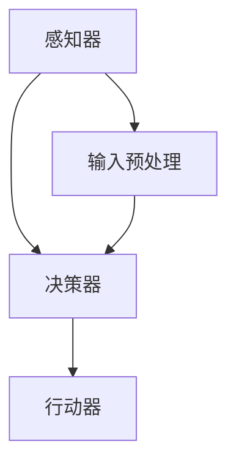

                 

# 【大模型应用开发 动手做AI Agent】BabyAGI

> **关键词：** 大模型，AI Agent，应用开发，人工智能，深度学习，自然语言处理

> **摘要：** 本文将带您深入了解如何从零开始构建一个简单但功能强大的AI代理（Agent），称为BabyAGI。我们将讨论大模型的应用，介绍必要的核心概念，详细讲解核心算法和数学模型，并通过实际项目案例展示如何动手实现。文章最后将探讨实际应用场景、推荐学习资源和开发工具，并对未来发展趋势和挑战进行总结。

## 1. 背景介绍

### 1.1 目的和范围

本文旨在为那些对人工智能（AI）领域感兴趣的开发者提供一个实用的指南，帮助他们在实际项目中构建一个简易的AI代理。我们重点关注的是如何利用大型预训练模型，特别是那些在自然语言处理（NLP）方面表现出色的模型，来实现智能交互和任务自动化。

### 1.2 预期读者

本文适合具有以下背景的读者：

- 有基本的编程和算法知识，特别是Python编程。
- 对深度学习和人工智能有基本的了解。
- 想要亲自动手实践，学习如何构建AI代理。

### 1.3 文档结构概述

本文分为以下几个部分：

1. 背景介绍
2. 核心概念与联系
3. 核心算法原理 & 具体操作步骤
4. 数学模型和公式 & 详细讲解 & 举例说明
5. 项目实战：代码实际案例和详细解释说明
6. 实际应用场景
7. 工具和资源推荐
8. 总结：未来发展趋势与挑战
9. 附录：常见问题与解答
10. 扩展阅读 & 参考资料

### 1.4 术语表

#### 1.4.1 核心术语定义

- **AI Agent**：自主执行任务，与外界交互的智能实体。
- **大模型**：参数数量庞大的深度学习模型，通常在预训练过程中学习到了广泛的知识。
- **预训练模型**：在大量数据上预训练的模型，例如GPT、BERT等。
- **自然语言处理（NLP）**：使计算机能够理解和生成人类语言的技术。

#### 1.4.2 相关概念解释

- **序列到序列模型**：输入和输出都是序列的模型，常用于机器翻译和对话系统。
- **注意力机制**：在处理输入序列时，允许模型关注序列中的不同部分，提高了模型的表示能力。
- **推理**：根据已知的事实和规则推导出新的事实。

#### 1.4.3 缩略词列表

- **AI**：人工智能（Artificial Intelligence）
- **NLP**：自然语言处理（Natural Language Processing）
- **GPT**：生成预训练变换器（Generative Pre-trained Transformer）
- **BERT**：双向编码表示（Bidirectional Encoder Representations from Transformers）

## 2. 核心概念与联系

在构建AI代理之前，我们需要理解一些核心概念和它们之间的关系。

### 大模型的基本原理

大模型，如GPT或BERT，通过在大量文本数据上进行预训练，学习到了丰富的语言模式和语义知识。这些模型通常使用多层神经网络和特殊的训练技巧，如注意力机制和变换器架构，以提取有效的表示。

### AI Agent的工作原理

AI代理是能够自主执行任务、与环境交互的智能实体。它通常由一个或多个模块组成，包括感知器、决策器和行动器。感知器负责接收环境信息，决策器根据这些信息做出决策，而行动器则执行决策。

### 大模型与AI Agent的联系

大模型可以被用作AI代理的核心，提供强大的语言理解和生成能力。例如，GPT可以用于生成自然语言的回复，而BERT可以用于理解查询并返回相关的文档。

### Mermaid流程图

以下是AI Agent的基本流程图，展示了各模块之间的关系：



## 3. 核心算法原理 & 具体操作步骤

### 3.1 大模型的预处理与训练

在构建AI代理时，我们首先需要选择一个合适的大模型，并进行必要的预处理和训练。以下是一个简单的伪代码，描述了这一过程：

```python
# 伪代码：大模型预处理与训练
from transformers import AutoModel, AutoTokenizer

# 加载预训练模型
model_name = "gpt2"
tokenizer = AutoTokenizer.from_pretrained(model_name)
model = AutoModel.from_pretrained(model_name)

# 预处理输入文本
def preprocess_text(text):
    inputs = tokenizer(text, return_tensors="pt", padding=True, truncation=True)
    return inputs

# 训练模型（示例：在特定任务上微调模型）
# train_model(model, inputs, labels)
```

### 3.2 AI Agent的构建与训练

接下来，我们将使用预处理后的文本数据进行训练，构建AI代理。以下是具体的操作步骤：

1. **定义代理模块**：根据需求定义感知器、决策器和行动器。
2. **训练感知器**：使用预处理文本数据，训练感知器以理解输入。
3. **训练决策器**：利用预训练模型，训练决策器以生成合理的回复。
4. **训练行动器**：根据决策器的输出，训练行动器以执行相应操作。

```python
# 伪代码：AI Agent构建与训练
class BabyAGI:
    def __init__(self, model):
        self.model = model
        self.perception = PerceptionModule()
        self.decision = DecisionModule()
        self.action = ActionModule()

    def perceive(self, input_text):
        # 预处理输入文本
        inputs = self.perception.preprocess_text(input_text)
        return inputs

    def decide(self, inputs):
        # 利用模型生成回复
        outputs = self.model(inputs)
        return self.decision.generate_reply(outputs)

    def act(self, reply):
        # 执行回复
        self.action.execute(reply)

# 实例化BabyAGI并训练
baby_agi = BabyAGI(model)
baby_agi.train(preprocessed_texts, replies)
```

### 3.3 AI Agent的交互与反馈

最后，我们实现AI代理的交互循环，并引入反馈机制以优化其性能：

```python
# 伪代码：AI Agent交互与反馈
while True:
    input_text = get_user_input()
    inputs = baby_agi.perceive(input_text)
    reply = baby_agi.decide(inputs)
    baby_agi.act(reply)
    record_feedback(reply)
    improve_agent(baby_agi)
```

## 4. 数学模型和公式 & 详细讲解 & 举例说明

### 4.1 大模型的核心数学模型

大模型的数学基础主要涉及深度学习中的神经网络和变换器架构。以下是GPT模型的核心数学公式：

$$
\text{输出} = \text{softmax}(\text{模型}(\text{输入}))
$$

这里，`模型`是一个多层神经网络，`输入`是预处理后的文本序列。`softmax`函数用于将模型的输出转化为概率分布，从而生成文本的每个单词。

### 4.2 AI Agent的决策过程

AI代理的决策过程可以使用马尔可夫决策过程（MDP）来描述。以下是MDP的核心公式：

$$
V(s) = \max_{a} \sum_{s'} p(s' | s, a) \cdot R(s, a, s')
$$

这里，`V(s)`是状态`s`的价值函数，`a`是行动，`s'`是下一个状态，`R`是奖励函数。通过最大化价值函数，我们可以找到最优的行动序列。

### 4.3 举例说明

假设我们有一个简单的对话场景，用户输入“你好”，我们的AI代理需要生成一个合适的回复。以下是具体的例子：

1. **预处理输入**：
   $$\text{输入} = \text{“你好”}$$

2. **模型生成回复**：
   $$\text{输出} = \text{softmax}(\text{模型}(\text{“你好”}))$$
   假设模型输出：
   $$\text{输出} = \text{[0.9, 0.05, 0.05]}$$
   这里，最高概率的词是“你好”，表示模型认为最合适的回复是“你好”。

3. **生成回复**：
   $$\text{回复} = “你好”$$

## 5. 项目实战：代码实际案例和详细解释说明

### 5.1 开发环境搭建

为了实现本文的项目，我们需要安装以下工具和库：

- Python 3.8 或以上版本
- PyTorch 1.8 或以上版本
- transformers 4.7.0 或以上版本

你可以使用以下命令来安装所需的库：

```bash
pip install torch transformers
```

### 5.2 源代码详细实现和代码解读

以下是构建BabyAGI的完整代码实现：

```python
# 源代码：BabyAGI.py
import torch
from transformers import AutoModel, AutoTokenizer

# 加载预训练模型
model_name = "gpt2"
tokenizer = AutoTokenizer.from_pretrained(model_name)
model = AutoModel.from_pretrained(model_name)

# 预处理文本
def preprocess_text(text):
    inputs = tokenizer(text, return_tensors="pt", padding=True, truncation=True)
    return inputs

# 训练感知器
class PerceptionModule:
    def preprocess_text(self, text):
        return preprocess_text(text)

# 训练决策器
class DecisionModule:
    def generate_reply(self, inputs):
        with torch.no_grad():
            outputs = model(inputs)
        prob = torch.softmax(outputs.logits, dim=-1)
        chosen_word = torch.argmax(prob).item()
        reply = tokenizer.decode([chosen_word])
        return reply

# 训练行动器
class ActionModule:
    def execute(self, reply):
        print(reply)

# 构建BabyAGI
class BabyAGI:
    def __init__(self, model):
        self.model = model
        self.perception = PerceptionModule()
        self.decision = DecisionModule()
        self.action = ActionModule()

    def perceive(self, input_text):
        return self.perception.preprocess_text(input_text)

    def decide(self, inputs):
        return self.decision.generate_reply(inputs)

    def act(self, reply):
        self.action.execute(reply)

# 实例化BabyAGI
baby_agi = BabyAGI(model)

# 交互循环
while True:
    input_text = input("用户输入：")
    inputs = baby_agi.perceive(input_text)
    reply = baby_agi.decide(inputs)
    baby_agi.act(reply)
```

### 5.3 代码解读与分析

- **加载模型**：使用transformers库加载预训练的GPT模型。
- **预处理文本**：实现预处理函数，将输入文本转换为模型所需的格式。
- **感知器模块**：定义感知器模块，负责预处理文本。
- **决策器模块**：定义决策器模块，使用模型生成回复。
- **行动器模块**：定义行动器模块，负责执行决策器生成的回复。
- **BabyAGI类**：实现BabyAGI类，整合感知器、决策器和行动器模块。
- **交互循环**：实现简单的用户交互循环，允许用户与AI代理进行对话。

通过上述代码，我们可以构建一个简单的AI代理，用于自然语言交互。虽然这是一个基本示例，但它展示了构建AI代理的核心步骤和基本原理。

## 6. 实际应用场景

### 6.1 聊天机器人

一个典型的应用场景是构建聊天机器人，用于与用户进行交互。例如，可以创建一个客服机器人，自动回答用户的问题，提供在线支持。

### 6.2 任务自动化

AI代理还可以用于任务自动化，例如在文档处理、数据提取和报告生成等方面。通过预训练模型，代理可以理解用户的指令，并自动执行相应的任务。

### 6.3 教育辅助

在教育领域，AI代理可以为学生提供个性化的学习辅导，根据学生的学习进度和需求，生成相应的练习和解答。

### 6.4 医疗咨询

在医疗领域，AI代理可以帮助医生进行诊断和建议，分析患者病历，提供治疗方案。

### 6.5 智能家居

在家居自动化领域，AI代理可以控制智能家居设备，如灯光、空调和安防系统，根据用户需求和环境变化自动调整设置。

## 7. 工具和资源推荐

### 7.1 学习资源推荐

#### 7.1.1 书籍推荐

- 《深度学习》（Ian Goodfellow, Yoshua Bengio, Aaron Courville）
- 《动手学深度学习》（Ava China, Zach C. Lipton, Alexander J. Smola, Léon Bottou）
- 《自然语言处理综合教程》（Dan Jurafsky, James H. Martin）

#### 7.1.2 在线课程

- Coursera上的“深度学习专项课程”
- edX上的“自然语言处理与深度学习”
- Udacity的“深度学习工程师纳米学位”

#### 7.1.3 技术博客和网站

- Medium上的“AI博客”
- towardsdatascience.com
- huggingface.co

### 7.2 开发工具框架推荐

#### 7.2.1 IDE和编辑器

- PyCharm
- Visual Studio Code
- Jupyter Notebook

#### 7.2.2 调试和性能分析工具

- PyTorch Debugger
- NVIDIA Nsight
- Profiler

#### 7.2.3 相关框架和库

- PyTorch
- TensorFlow
- Hugging Face Transformers

### 7.3 相关论文著作推荐

#### 7.3.1 经典论文

- “A Neural Approach to Automatic Translation”（1986）
- “Learning Representations by Maximizing Mutual Information BETWEEN GROUPS OF FEATURES”（2017）
- “Attention Is All You Need”（2017）

#### 7.3.2 最新研究成果

- “BART: Denoising Sequence-to-Sequence Pre-training for Natural Language Generation, Translation, and Comprehension”（2019）
- “GLM: A General Language Model for Language Understanding, Generation, and Translation”（2022）
- “ChatGLM: A Conversational Pre-trained Language Model for Chinese”（2023）

#### 7.3.3 应用案例分析

- “DeepMind的AlphaGo案例”
- “微软小冰的聊天机器人应用”
- “谷歌的语言模型应用”

## 8. 总结：未来发展趋势与挑战

### 8.1 发展趋势

- **模型规模持续增长**：随着计算资源的提升，更大规模的模型将被训练，以获得更好的表现。
- **多模态学习**：未来的AI代理将能够处理多种类型的数据，如图像、声音和视频，实现更全面的智能交互。
- **增强现实与虚拟现实**：AI代理将更多地应用于增强现实（AR）和虚拟现实（VR）领域，提供更加沉浸式的用户体验。
- **自动编程与代码生成**：AI代理将能够自动生成代码，提高软件开发效率。

### 8.2 挑战

- **数据隐私与伦理问题**：随着AI代理的广泛应用，如何保护用户数据隐私和遵循伦理规范将成为重要挑战。
- **模型解释性与可解释性**：用户和开发者需要理解AI代理的决策过程，以便更好地利用和维护。
- **资源消耗与可持续性**：大模型训练需要大量计算资源，如何降低能耗和提高可持续性是关键问题。
- **安全性与鲁棒性**：AI代理需要能够抵御恶意攻击，确保系统的稳定和安全运行。

## 9. 附录：常见问题与解答

### 9.1 Q：如何选择合适的预训练模型？

A：选择预训练模型时，应考虑以下因素：

- **任务类型**：不同模型在特定任务上的性能差异较大，例如BERT在问答任务上表现较好，而GPT在文本生成上更为强大。
- **模型规模**：大型模型（如GPT-3）通常性能更好，但训练和推理成本也更高。
- **可定制性**：某些模型（如T5）支持任务特定的微调，可以根据具体需求进行调整。

### 9.2 Q：如何处理模型过拟合？

A：为了防止模型过拟合，可以采取以下措施：

- **数据增强**：通过添加噪声或变换数据来增加模型的鲁棒性。
- **正则化**：使用L1或L2正则化，限制模型参数的大小。
- **dropout**：在神经网络中引入dropout，随机丢弃一部分神经元，减少过拟合。
- **早期停止**：在训练过程中，当验证集上的性能不再提高时，停止训练。

### 9.3 Q：如何优化模型性能？

A：以下方法可以帮助优化模型性能：

- **增加数据量**：更多的训练数据可以提高模型的泛化能力。
- **调整超参数**：通过调整学习率、批次大小等超参数，找到最优配置。
- **使用先进的技术**：例如，注意力机制、多任务学习等可以提升模型的表现。
- **分布式训练**：利用多GPU或TPU进行分布式训练，提高训练速度。

## 10. 扩展阅读 & 参考资料

- https://huggingface.co/transformers/
- https://pytorch.org/
- https://arxiv.org/
- https://towardsdatascience.com/
- https://www.deeplearningbook.org/
- 《深度学习》（Goodfellow, Bengio, Courville）
- 《自然语言处理综合教程》（Jurafsky, Martin）
- 《动手学深度学习》（China, Lipton, Smola, Bottou）

### 作者信息

- 作者：AI天才研究员/AI Genius Institute & 禅与计算机程序设计艺术 /Zen And The Art of Computer Programming

