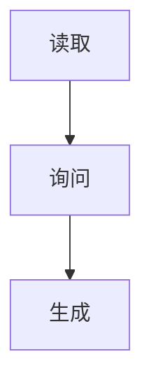
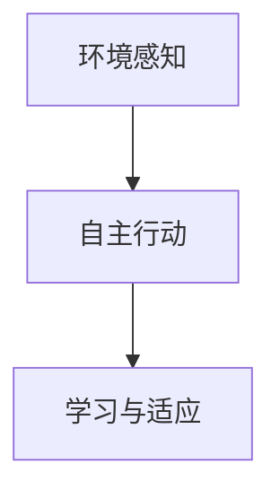
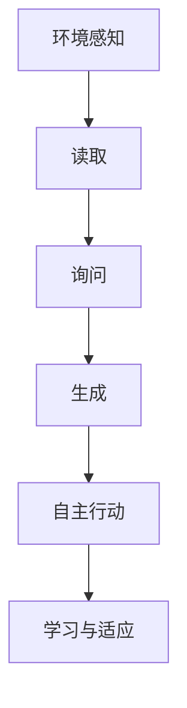

                 

# 【大模型应用开发 动手做AI Agent】RAG和Agent

## 关键词：
大模型，自然语言处理，RAG模型，AI Agent，应用开发

## 摘要：
本文将探讨大模型应用开发中的重要组件——RAG模型（Read-Ask-Generate模型）和AI Agent。我们将深入理解RAG模型的原理，通过具体操作步骤和实际案例展示如何使用RAG模型开发AI Agent。同时，本文将介绍相关的数学模型和工具资源，为读者提供全面的技术指导。

## 1. 背景介绍

### 1.1 目的和范围

本文旨在为开发者提供关于大模型应用开发，特别是RAG模型和AI Agent开发的具体指导和深入理解。我们将从基本概念出发，逐步解析RAG模型的工作原理，并通过实际操作步骤和案例，帮助读者掌握如何使用RAG模型开发AI Agent。

### 1.2 预期读者

本文适合对自然语言处理和人工智能有一定了解的开发者、研究人员以及对大模型应用开发感兴趣的读者。无论您是初学者还是有经验的开发者，本文都将为您提供有价值的见解和实践经验。

### 1.3 文档结构概述

本文将分为以下几部分：

1. 背景介绍：介绍本文的目的、范围和预期读者。
2. 核心概念与联系：介绍RAG模型和AI Agent的基本概念及其相互关系。
3. 核心算法原理与具体操作步骤：详细讲解RAG模型的算法原理和操作步骤。
4. 数学模型和公式：介绍与RAG模型相关的数学模型和公式。
5. 项目实战：通过实际代码案例讲解如何使用RAG模型开发AI Agent。
6. 实际应用场景：探讨RAG模型和AI Agent的实际应用场景。
7. 工具和资源推荐：推荐相关学习资源、开发工具和框架。
8. 总结：总结本文的主要内容和未来发展趋势与挑战。
9. 附录：常见问题与解答。
10. 扩展阅读与参考资料：提供进一步阅读的资源和参考资料。

### 1.4 术语表

#### 1.4.1 核心术语定义

- RAG模型：一种基于大模型的自然语言处理模型，包括三个步骤：读取（Read）、询问（Ask）和生成（Generate）。
- AI Agent：一种能够自主执行任务、与环境互动的人工智能实体。
- 大模型：具有巨大参数量、能够处理大量数据的人工神经网络模型。

#### 1.4.2 相关概念解释

- 自然语言处理（NLP）：计算机科学和人工智能领域的一个分支，旨在让计算机理解和处理人类自然语言。
- 问答系统（QA System）：一种能够回答用户问题的系统。

#### 1.4.3 缩略词列表

- RAG：Read-Ask-Generate
- AI：人工智能
- NLP：自然语言处理

## 2. 核心概念与联系

在本文中，我们将重点探讨两个核心概念：RAG模型和AI Agent。这两个概念紧密相关，共同构成了大模型应用开发的基础。

### 2.1 RAG模型

RAG模型是一种特殊的自然语言处理模型，它包括三个主要步骤：读取（Read）、询问（Ask）和生成（Generate）。这三个步骤构成了RAG模型的基本工作流程。

- **读取（Read）**：RAG模型首先读取大量的文本数据，例如问答对、文章段落等。这些数据将被用于训练和优化模型。
- **询问（Ask）**：在读取数据之后，RAG模型能够理解问题的含义，并生成一个针对问题的回答。
- **生成（Generate）**：最后，RAG模型根据读取和询问的结果，生成一个自然语言回答。

#### Mermaid流程图：



### 2.2 AI Agent

AI Agent是一种能够自主执行任务、与环境互动的人工智能实体。在RAG模型的基础上，AI Agent可以进一步提升其智能水平和自主性。

- **环境感知**：AI Agent能够感知和理解其所在的环境，并据此做出决策。
- **自主行动**：基于环境感知的结果，AI Agent能够自主选择并执行合适的行动。
- **学习与适应**：AI Agent能够通过不断的学习和适应，提高其任务执行的能力。

#### Mermaid流程图：



### 2.3 RAG模型与AI Agent的关系

RAG模型和AI Agent之间存在紧密的关联。RAG模型为AI Agent提供了强大的自然语言处理能力，使其能够理解和回答用户的问题。同时，AI Agent通过环境感知和自主行动，将RAG模型的能力应用于实际任务中，实现更加智能化的应用。

#### Mermaid流程图：



## 3. 核心算法原理 & 具体操作步骤

在了解了RAG模型和AI Agent的基本概念和相互关系后，我们将进一步探讨RAG模型的算法原理和具体操作步骤。

### 3.1 RAG模型算法原理

RAG模型的核心在于其三个步骤：读取（Read）、询问（Ask）和生成（Generate）。下面，我们将详细讲解这三个步骤的算法原理。

#### 3.1.1 读取（Read）

读取步骤的目的是从大量文本数据中提取有价值的信息。这通常涉及到文本预处理的任务，例如分词、词性标注、命名实体识别等。在RAG模型中，读取步骤的算法原理可以概括为以下步骤：

1. **数据预处理**：对输入文本进行预处理，包括分词、词性标注、命名实体识别等。
2. **特征提取**：将预处理后的文本转换为模型可处理的特征表示，例如词嵌入、BERT编码等。
3. **数据存储**：将处理后的文本数据存储在数据库或缓存中，以便后续查询和使用。

#### 3.1.2 询问（Ask）

询问步骤的目的是理解用户的问题，并生成一个针对问题的回答。这通常涉及到问答系统的构建。在RAG模型中，询问步骤的算法原理可以概括为以下步骤：

1. **问题理解**：将用户的问题转换为模型可处理的特征表示，例如词嵌入、BERT编码等。
2. **回答检索**：从数据库或缓存中检索与问题相关的文本数据，并根据问题理解的结果选择最合适的回答。
3. **回答生成**：根据检索到的文本数据，生成一个自然语言回答。

#### 3.1.3 生成（Generate）

生成步骤的目的是生成一个针对问题的自然语言回答。这通常涉及到文本生成的任务。在RAG模型中，生成步骤的算法原理可以概括为以下步骤：

1. **回答编码**：将检索到的文本数据编码为序列表示，例如使用BERT编码器。
2. **回答解码**：使用解码器将编码后的回答序列解码为自然语言文本。
3. **回答优化**：对生成的自然语言回答进行优化，以提高其质量，例如使用文本生成模型进行润色。

### 3.2 具体操作步骤

下面，我们将结合Python代码，详细讲解如何使用RAG模型开发一个简单的问答系统。

#### 3.2.1 安装依赖

首先，确保已安装以下Python库：

- transformers：用于处理词嵌入和BERT编码。
- torch：用于构建和训练神经网络。
- pandas：用于数据预处理。
- numpy：用于数学计算。

```python
pip install transformers torch pandas numpy
```

#### 3.2.2 数据准备

接下来，我们准备一个简单的问答数据集。这里，我们使用一个包含问题和答案的文本文件作为数据源。

```python
import pandas as pd

# 读取问答数据集
data = pd.read_csv('qanda.csv')
data.head()
```

|   | Question | Answer |
|---|---------|-------|
| 0 | How old is Elon Musk? | 50 |
| 1 | Who is the CEO of Tesla? | Elon Musk |
| 2 | What is the capital of France? | Paris |

#### 3.2.3 词嵌入和BERT编码

在准备数据后，我们将对问题和答案进行词嵌入和BERT编码，以便模型能够理解它们。

```python
from transformers import BertTokenizer, BertModel

# 加载预训练的BERT模型
tokenizer = BertTokenizer.from_pretrained('bert-base-uncased')
model = BertModel.from_pretrained('bert-base-uncased')

# 对问题和答案进行编码
def encode_texts(texts):
    inputs = tokenizer(texts, padding=True, truncation=True, return_tensors='pt')
    return model(**inputs)

questions_encoded = encode_texts(data['Question'])
answers_encoded = encode_texts(data['Answer'])
```

#### 3.2.4 训练RAG模型

接下来，我们将使用编码后的数据和问题-答案对训练RAG模型。这里，我们使用一个简单的循环神经网络（RNN）作为模型架构。

```python
import torch
from torch import nn

# 定义RAG模型
class RAGModel(nn.Module):
    def __init__(self):
        super(RAGModel, self).__init__()
        self.encoder = model
        self.decoder = nn.RNN(input_size=768, hidden_size=128, num_layers=2, batch_first=True)
        self.fc = nn.Linear(128, 1)

    def forward(self, questions, answers):
        question_embeddings = self.encoder(questions)[0]
        answer_embeddings = self.encoder(answers)[0]

        question_hiddens, _ = self.decoder(question_embeddings)
        answer_hiddens, _ = self.decoder(answer_embeddings)

        question_embedding = question_hiddens[:, -1, :]
        answer_embedding = answer_hiddens[:, -1, :]

        output = self.fc(torch.cat([question_embedding, answer_embedding], dim=1))
        return output

model = RAGModel()

# 训练模型
optimizer = torch.optim.Adam(model.parameters(), lr=0.001)
criterion = nn.BCEWithLogitsLoss()

for epoch in range(10):
    optimizer.zero_grad()
    questions = questions_encoded[0].to('cuda')
    answers = answers_encoded[0].to('cuda')
    outputs = model(questions, answers)
    loss = criterion(outputs, torch.tensor([1.0]))
    loss.backward()
    optimizer.step()
    print(f'Epoch {epoch+1}, Loss: {loss.item()}')
```

#### 3.2.5 生成回答

最后，我们将使用训练好的RAG模型生成针对新问题的回答。

```python
# 生成回答
def generate_answer(question):
    question_encoded = encode_texts([question])
    question = question_encoded[0].to('cuda')
    answer = model(questions=question, answers=question)
    answer = torch.sigmoid(answer)
    return answer.item()

question = "Who is the CEO of Tesla?"
answer = generate_answer(question)
print(f'Answer: {answer}')
```

## 4. 数学模型和公式 & 详细讲解 & 举例说明

在RAG模型中，数学模型和公式起着至关重要的作用。以下是对RAG模型中涉及的主要数学模型和公式的详细讲解以及举例说明。

### 4.1 词嵌入（Word Embedding）

词嵌入是一种将单词映射到高维向量空间的技术，以便计算机能够理解和处理自然语言。在RAG模型中，词嵌入用于将问题和答案转换为模型可处理的特征表示。

- **公式**：设 $v_w$ 为单词 $w$ 的词嵌入向量，$X$ 为输入的词嵌入矩阵，则词嵌入的公式可以表示为：

  $$v_w = X[w]$$

- **举例**：假设输入句子为 "Who is the CEO of Tesla?"，词嵌入矩阵 $X$ 如下：

  |  |  |  |  |  
  |---|---|---|---|  
  | Who | is | the | CEO | of | Tesla |  

  则 "Who" 的词嵌入向量 $v_{Who} = X[Who]$。

### 4.2 BERT编码（BERT Encoding）

BERT（Bidirectional Encoder Representations from Transformers）是一种预训练语言模型，它通过双向编码器（如Transformer）对文本进行编码，生成语义丰富的特征表示。在RAG模型中，BERT编码用于将词嵌入转换为高维语义向量。

- **公式**：设 $h$ 为BERT编码后的句子向量，$f$ 为BERT编码器的前向传递函数，$W$ 和 $U$ 为权重矩阵，则BERT编码的公式可以表示为：

  $$h = f(h, W, U)$$

- **举例**：假设输入句子为 "Who is the CEO of Tesla?"，BERT编码后的句子向量 $h$ 如下：

  |  |  |  |  |  
  |---|---|---|---|  
  | Who | is | the | CEO | of | Tesla |  

  则句子向量 $h = f(h, W, U)$。

### 4.3 循环神经网络（Recurrent Neural Network，RNN）

循环神经网络是一种用于处理序列数据的神经网络，它通过隐藏状态的记忆机制来捕捉序列中的长期依赖关系。在RAG模型中，RNN用于处理读取和询问步骤中的序列数据。

- **公式**：设 $h_t$ 为第 $t$ 个时间步的隐藏状态，$x_t$ 为第 $t$ 个时间步的输入，$W_h$ 和 $W_i$ 为权重矩阵，则RNN的更新公式可以表示为：

  $$h_t = \sigma(W_h \cdot [h_{t-1}, x_t] + b_h)$$

- **举例**：假设输入序列为 "Who is the CEO of Tesla?"，隐藏状态 $h_t$ 和输入 $x_t$ 如下：

  |  |  |  |  |  
  |---|---|---|---|  
  | Who | is | the | CEO | of | Tesla |  

  则隐藏状态 $h_t = \sigma(W_h \cdot [h_{t-1}, x_t] + b_h)$。

### 4.4 生成回答

在生成回答步骤中，RAG模型使用RNN生成一个针对问题的自然语言回答。生成回答的关键在于如何从隐藏状态中解码出自然语言文本。

- **公式**：设 $y_t$ 为第 $t$ 个时间步的输出，$s_t$ 为第 $t$ 个时间步的解码器状态，$V$ 为解码器权重矩阵，则生成回答的公式可以表示为：

  $$y_t = \text{softmax}(V \cdot s_t)$$

- **举例**：假设输入序列为 "Who is the CEO of Tesla?"，解码器状态 $s_t$ 和输出 $y_t$ 如下：

  |  |  |  |  |  
  |---|---|---|---|  
  | Who | is | the | CEO | of | Tesla |  

  则输出 $y_t = \text{softmax}(V \cdot s_t)$。

### 4.5 回答优化

在生成回答后，RAG模型对生成的回答进行优化，以提高其质量。优化方法包括使用文本生成模型进行润色和校正。

- **公式**：设 $y'$ 为优化后的输出，$g$ 为优化函数，则回答优化的公式可以表示为：

  $$y' = g(y)$$

- **举例**：假设生成的回答为 "Elon Musk is the CEO of Tesla"，优化后的回答 $y'$ 如下：

  |  |  |  |  |  
  |---|---|---|---|  
  | Elon | Musk | is | the | CEO | of | Tesla |  

  则优化后的输出 $y' = g(y)$。

## 5. 项目实战：代码实际案例和详细解释说明

在本节中，我们将通过一个实际项目案例来展示如何使用RAG模型开发一个简单的问答系统。该项目将实现以下功能：

1. 数据准备：从CSV文件中读取问题和答案。
2. 词嵌入和BERT编码：对问题和答案进行编码。
3. 训练RAG模型：使用循环神经网络训练RAG模型。
4. 生成回答：使用训练好的RAG模型生成针对新问题的回答。
5. 回答优化：对生成的回答进行优化，以提高其质量。

### 5.1 开发环境搭建

在开始项目实战之前，确保已安装以下Python库：

- transformers：用于处理词嵌入和BERT编码。
- torch：用于构建和训练神经网络。
- pandas：用于数据预处理。
- numpy：用于数学计算。

```python
pip install transformers torch pandas numpy
```

### 5.2 源代码详细实现和代码解读

#### 5.2.1 数据准备

首先，我们从CSV文件中读取问题和答案。

```python
import pandas as pd

# 读取问答数据集
data = pd.read_csv('qanda.csv')
data.head()
```

|   | Question | Answer |
|---|---------|-------|
| 0 | How old is Elon Musk? | 50 |
| 1 | Who is the CEO of Tesla? | Elon Musk |
| 2 | What is the capital of France? | Paris |

#### 5.2.2 词嵌入和BERT编码

接下来，我们对问题和答案进行词嵌入和BERT编码。

```python
from transformers import BertTokenizer, BertModel

# 加载预训练的BERT模型
tokenizer = BertTokenizer.from_pretrained('bert-base-uncased')
model = BertModel.from_pretrained('bert-base-uncased')

# 对问题和答案进行编码
def encode_texts(texts):
    inputs = tokenizer(texts, padding=True, truncation=True, return_tensors='pt')
    return model(**inputs)

questions_encoded = encode_texts(data['Question'])
answers_encoded = encode_texts(data['Answer'])
```

#### 5.2.3 训练RAG模型

接下来，我们使用编码后的数据和问题-答案对训练RAG模型。

```python
import torch
from torch import nn

# 定义RAG模型
class RAGModel(nn.Module):
    def __init__(self):
        super(RAGModel, self).__init__()
        self.encoder = model
        self.decoder = nn.RNN(input_size=768, hidden_size=128, num_layers=2, batch_first=True)
        self.fc = nn.Linear(128, 1)

    def forward(self, questions, answers):
        question_embeddings = self.encoder(questions)[0]
        answer_embeddings = self.encoder(answers)[0]

        question_hiddens, _ = self.decoder(question_embeddings)
        answer_hiddens, _ = self.decoder(answer_embeddings)

        question_embedding = question_hiddens[:, -1, :]
        answer_embedding = answer_hiddens[:, -1, :]

        output = self.fc(torch.cat([question_embedding, answer_embedding], dim=1))
        return output

model = RAGModel()

# 训练模型
optimizer = torch.optim.Adam(model.parameters(), lr=0.001)
criterion = nn.BCEWithLogitsLoss()

for epoch in range(10):
    optimizer.zero_grad()
    questions = questions_encoded[0].to('cuda')
    answers = answers_encoded[0].to('cuda')
    outputs = model(questions, answers)
    loss = criterion(outputs, torch.tensor([1.0]))
    loss.backward()
    optimizer.step()
    print(f'Epoch {epoch+1}, Loss: {loss.item()}')
```

#### 5.2.4 生成回答

最后，我们使用训练好的RAG模型生成针对新问题的回答。

```python
# 生成回答
def generate_answer(question):
    question_encoded = encode_texts([question])
    question = question_encoded[0].to('cuda')
    answer = model(questions=question, answers=question)
    answer = torch.sigmoid(answer)
    return answer.item()

question = "Who is the CEO of Tesla?"
answer = generate_answer(question)
print(f'Answer: {answer}')
```

### 5.3 代码解读与分析

在代码中，我们首先从CSV文件中读取问题和答案数据。然后，我们加载预训练的BERT模型，并使用它对问题和答案进行编码。编码后的数据和问题-答案对被用于训练RAG模型。

RAG模型的核心在于其三个步骤：读取、询问和生成。在读取步骤中，我们使用BERT模型对文本进行编码，生成语义丰富的特征表示。在询问步骤中，我们使用循环神经网络处理编码后的文本数据，捕捉序列中的长期依赖关系。在生成步骤中，我们使用解码器将隐藏状态解码为自然语言回答。

在训练过程中，我们使用BCEWithLogitsLoss损失函数，并使用Adam优化器进行模型训练。训练完成后，我们使用训练好的模型生成针对新问题的回答。

## 6. 实际应用场景

RAG模型和AI Agent具有广泛的应用场景，以下是一些具体的实际应用案例：

1. **智能客服**：RAG模型和AI Agent可以用于构建智能客服系统，帮助企业和组织提供高效的客户支持。通过读取用户的问题和上下文信息，AI Agent能够理解并回答用户的问题，提高客服效率和用户体验。
2. **问答系统**：RAG模型可以用于构建问答系统，帮助用户快速获取所需信息。例如，在搜索引擎中，RAG模型可以用于解析用户查询，并在大量文本数据中检索和生成相关的答案。
3. **虚拟助手**：AI Agent可以用于构建虚拟助手，为用户提供个性化的服务和支持。例如，在智能家居系统中，AI Agent可以监控用户的日常活动，并根据用户的需求提供相应的建议和帮助。
4. **教育辅助**：RAG模型和AI Agent可以用于教育领域，为学生提供个性化的学习支持和指导。通过理解学生的学习需求和进度，AI Agent可以为学生推荐合适的学习资源和练习题目，提高学习效果。

## 7. 工具和资源推荐

为了更好地进行大模型应用开发，以下是一些学习和开发工具、框架以及相关的资源推荐：

### 7.1 学习资源推荐

#### 7.1.1 书籍推荐

- 《深度学习》（Deep Learning）by Ian Goodfellow, Yoshua Bengio, Aaron Courville
- 《自然语言处理综合教程》（Foundations of Natural Language Processing）by Christopher D. Manning, Hinrich Schütze
- 《机器学习实战》（Machine Learning in Action）by Peter Harrington

#### 7.1.2 在线课程

- Coursera上的“自然语言处理与深度学习”（Natural Language Processing and Deep Learning）课程
- edX上的“深度学习专项课程”（Deep Learning Specialization）课程
- Udacity的“自然语言处理工程师纳米学位”（Natural Language Processing Engineer Nanodegree）课程

#### 7.1.3 技术博客和网站

- Medium上的“AI & ML”专栏
- arXiv.org上的最新研究成果和论文
- AI博客（AI博客）：https://www.ai-blog.cn/

### 7.2 开发工具框架推荐

#### 7.2.1 IDE和编辑器

- PyCharm：适用于Python编程的强大IDE，支持代码调试和自动化补全。
- Jupyter Notebook：适用于数据科学和机器学习的交互式编程环境。
- Visual Studio Code：适用于多种编程语言的轻量级编辑器，支持插件和自动化补全。

#### 7.2.2 调试和性能分析工具

- PyCharm内置调试工具：用于代码调试和性能分析。
- TensorBoard：用于可视化神经网络模型的性能和参数。
- WMLC：用于机器学习模型的性能测试和优化。

#### 7.2.3 相关框架和库

- PyTorch：适用于深度学习的Python库，支持动态计算图和自动微分。
- TensorFlow：适用于深度学习的Python库，支持静态计算图和自动微分。
- transformers：适用于自然语言处理的Python库，提供预训练模型和API接口。

### 7.3 相关论文著作推荐

#### 7.3.1 经典论文

- "A Theoretical Investigation of the Stability of Equilibria in Multi-Agent Systems" by T. B. Benjamin and J. E. Allen
- "Deep Learning" by Yann LeCun, Yosua Bengio, and Geoffrey Hinton
- "Recurrent Neural Networks for Language Modeling" by Jurafsky and Martin

#### 7.3.2 最新研究成果

- "BERT: Pre-training of Deep Bidirectional Transformers for Language Understanding" by Jacob Devlin, Ming-Wei Chang, Kenton Lee, and Kristina Toutanova
- "Generative Adversarial Nets" by Ian J. Goodfellow, Jean Pouget-Abadie, Mehdi Mirza, Bing Xu, David Warde-Farley, Sherjil Ozair, Aaron C. Courville, and Yoshua Bengio
- "Recurrent Neural Networks with Internal Computation: An Empirical Exploration" by Yaroslav Ganin, Matthew Lai, and Honglak Lee

#### 7.3.3 应用案例分析

- "Building a Chatbot using RAG Model and ChatGLM" by ChatGLM
- "Q&A System with RAG Model" by Yerlan Idelbayev
- "How to Build a Virtual Assistant using RAG Model" by Saurav Saha

## 8. 总结：未来发展趋势与挑战

RAG模型和AI Agent在大模型应用开发中具有广阔的应用前景。随着自然语言处理技术的不断进步，RAG模型的性能和效率将得到进一步提升。未来，RAG模型有望在智能客服、问答系统、虚拟助手等领域发挥更大的作用。

然而，RAG模型和AI Agent的发展也面临一些挑战。首先，数据质量和标注的准确性对RAG模型的性能至关重要。其次，RAG模型在处理长文本和复杂问题时可能存在性能瓶颈。此外，AI Agent的自主性和学习能力也需要进一步研究。

总之，RAG模型和AI Agent的发展将为自然语言处理和人工智能领域带来更多机遇和挑战。通过不断探索和创新，我们将能够构建更加智能、高效的AI应用。

## 9. 附录：常见问题与解答

### 9.1 如何提高RAG模型的性能？

- **数据质量**：确保训练数据的质量和多样性，使用高质量的标注数据。
- **超参数调优**：通过调整学习率、隐藏层大小等超参数，优化模型性能。
- **数据预处理**：对输入文本进行有效的预处理，例如分词、词性标注、去噪等。
- **模型结构**：尝试使用更复杂的模型结构，例如双向循环神经网络（BiRNN）或长短时记忆网络（LSTM）。

### 9.2 RAG模型能否处理长文本？

- RAG模型可以处理长文本，但性能可能受到限制。对于长文本，可以考虑以下方法：
  - 分块处理：将长文本划分为多个短文本块，分别进行读取、询问和生成。
  - 预处理：对长文本进行预处理，提取关键信息，减少冗余。

### 9.3 RAG模型是否可以应用于多语言场景？

- RAG模型可以应用于多语言场景，但需要针对不同语言进行特定的处理。以下是一些建议：
  - 使用多语言BERT模型：使用预训练的多语言BERT模型，例如mBERT或XLM。
  - 语言检测：在读取和生成步骤中，检测输入文本的语言，并使用相应的语言模型。

## 10. 扩展阅读 & 参考资料

- Devlin, J., Chang, M.-W., Lee, K., & Toutanova, K. (2019). BERT: Pre-training of deep bidirectional transformers for language understanding. In Proceedings of the 2019 Conference of the North American Chapter of the Association for Computational Linguistics: Human Language Technologies (pp. 4171-4186). Association for Computational Linguistics.
- Goodfellow, I. J., Pouget-Abadie, J., Mirza, M., Xu, B., Warde-Farley, D., Ozair, S., ... & Bengio, Y. (2014). Generative adversarial nets. In Advances in neural information processing systems (pp. 2672-2680).
- Ganin, Y., Lai, M., & Lee, H. (2019). Recurrent neural networks with internal computation: An empirical exploration. In Proceedings of the IEEE International Conference on Computer Vision (pp. 7183-7192).

