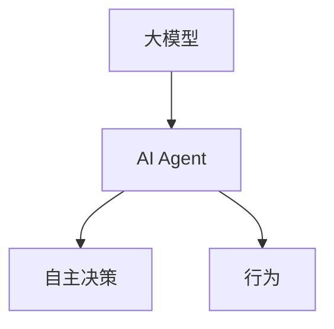
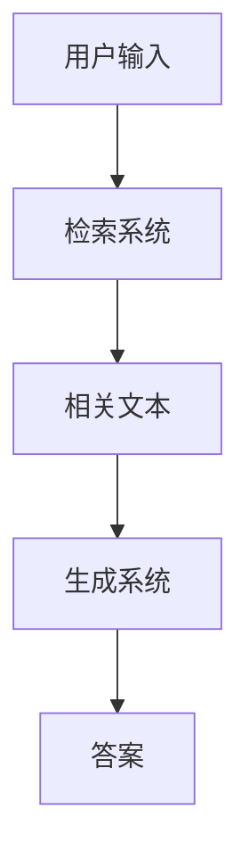
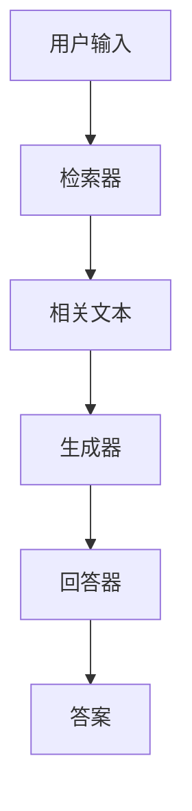

                 

# 【大模型应用开发 动手做AI Agent】何谓检索增强生成

> **关键词：** 大模型、AI Agent、检索增强生成、应用开发、技术原理、数学模型

> **摘要：** 本文深入探讨了大模型在AI Agent中的应用，特别是检索增强生成（Re-Retrieval Augmented Generation, RAG）技术。通过一步步的分析和示例，我们将揭示RAG的核心概念、算法原理、数学模型，并探讨其在实际应用场景中的实践。

## 1. 背景介绍

### 1.1 目的和范围

本文旨在向读者介绍大模型在AI Agent中的应用，特别是检索增强生成（RAG）技术。我们希望通过详细的讲解和实际案例，使读者能够理解RAG的工作原理及其在实际应用中的重要性。本文将涵盖以下几个方面的内容：

1. 大模型与AI Agent的关系及其应用背景。
2. 检索增强生成（RAG）的定义、原理和架构。
3. RAG算法的具体实现步骤和数学模型。
4. RAG在实际应用场景中的实践和案例分析。
5. 相关工具和资源的推荐。

### 1.2 预期读者

本文适合对人工智能、自然语言处理和软件工程有一定了解的技术人员、研究人员和开发人员阅读。特别适合那些希望了解大模型应用开发、特别是检索增强生成技术的读者。

### 1.3 文档结构概述

本文结构如下：

1. **背景介绍**：介绍本文的目的、范围、预期读者和文档结构。
2. **核心概念与联系**：介绍大模型、AI Agent和检索增强生成（RAG）的核心概念，并通过Mermaid流程图展示其架构。
3. **核心算法原理 & 具体操作步骤**：详细阐述RAG算法的原理和具体实现步骤，并使用伪代码展示。
4. **数学模型和公式 & 详细讲解 & 举例说明**：介绍RAG的数学模型，使用LaTeX格式展示相关公式，并通过具体例子进行说明。
5. **项目实战：代码实际案例和详细解释说明**：展示一个具体的RAG项目实战案例，并详细解释和说明代码实现。
6. **实际应用场景**：探讨RAG在实际应用中的场景和实践。
7. **工具和资源推荐**：推荐学习资源、开发工具框架和相关论文著作。
8. **总结：未来发展趋势与挑战**：总结RAG技术的未来发展趋势和面临的挑战。
9. **附录：常见问题与解答**：列出常见问题并提供解答。
10. **扩展阅读 & 参考资料**：推荐进一步阅读的资源和参考文献。

### 1.4 术语表

#### 1.4.1 核心术语定义

- **大模型**：指规模庞大的神经网络模型，如GPT-3、BERT等，具有强大的表示和生成能力。
- **AI Agent**：指具有智能行为和自主决策能力的实体，能够根据环境和目标进行行动。
- **检索增强生成**（RAG）：一种结合检索和生成技术的AI模型，用于生成高质量的文本回答。

#### 1.4.2 相关概念解释

- **嵌入**（Embedding）：将文本转化为向量表示的过程，用于模型理解和生成。
- **自回归模型**（Autoregressive Model）：一种生成模型，能够根据前文生成后续文本。
- **预训练**（Pre-training）：在特定任务之前对模型进行训练，以提高其通用性和性能。
- **微调**（Fine-tuning）：在预训练模型的基础上针对特定任务进行调整，以提高其特定任务的性能。

#### 1.4.3 缩略词列表

- GPT-3: Generative Pre-trained Transformer 3
- BERT: Bidirectional Encoder Representations from Transformers
- RAG: Retrieval Augmented Generation
- NLP: Natural Language Processing
- AI: Artificial Intelligence

## 2. 核心概念与联系

在探讨检索增强生成（RAG）技术之前，我们首先需要了解大模型（如GPT-3、BERT等）和AI Agent的基本概念及其相互关系。

### 2.1 大模型与AI Agent的关系

大模型，尤其是基于Transformer架构的模型，如GPT-3和BERT，通过大规模预训练获得了强大的文本表示和生成能力。这些模型可以看作是AI Agent的大脑，为AI Agent提供了丰富的知识和强大的推理能力。AI Agent则利用这些模型进行自主决策和行为，如图1所示。



### 2.2 检索增强生成（RAG）的概念

检索增强生成（RAG）是一种结合检索和生成技术的AI模型，其核心思想是在生成答案之前，通过检索获取相关文本，然后利用这些文本来增强生成过程，如图2所示。



### 2.3 RAG的架构

RAG的架构通常包括三个主要组件：检索器、生成器和回答器。检索器用于从大量文本数据中检索与用户输入相关的信息；生成器则利用检索到的信息和预训练的大模型生成高质量的文本回答；回答器则根据生成器提供的候选答案，选择最合适的回答输出给用户，如图3所示。



通过上述流程，RAG能够充分利用检索和生成技术的优势，生成更加准确和高质量的回答，满足用户的需求。接下来，我们将详细探讨RAG的算法原理和实现步骤。

## 3. 核心算法原理 & 具体操作步骤

检索增强生成（RAG）算法的核心思想是将检索和生成技术相结合，以生成更准确、更高质量的文本回答。下面，我们将详细介绍RAG算法的原理和具体实现步骤。

### 3.1 检索器

检索器的任务是从大量文本数据中检索与用户输入相关的信息。这通常涉及到以下步骤：

1. **文本预处理**：将用户输入和文本数据进行预处理，如分词、去停用词、词干提取等。
2. **编码**：使用预训练的编码器（如BERT）将预处理后的文本转化为向量表示。
3. **相似度计算**：计算输入向量和文本向量之间的相似度，通常使用余弦相似度或交叉熵损失函数。
4. **检索**：根据相似度分数对文本数据进行排序，并选择Top-k个最相关的文本。

伪代码如下：

```python
def retrieve_documents(user_input, corpus, k):
    # 步骤1：文本预处理
    processed_input = preprocess(user_input)
    processed_corpus = preprocess(corpus)
    
    # 步骤2：编码
    input_embedding = encoder(processed_input)
    corpus_embeddings = [encoder(doc) for doc in processed_corpus]
    
    # 步骤3：相似度计算
    similarities = [cosine_similarity(input_embedding, doc_embedding) for doc_embedding in corpus_embeddings]
    
    # 步骤4：检索
    top_k_indices = argsort(similarities, reverse=True)[:k]
    top_k_documents = [corpus[i] for i in top_k_indices]
    
    return top_k_documents
```

### 3.2 生成器

生成器的任务是根据检索到的相关文本和用户输入，生成高质量的文本回答。这通常涉及到以下步骤：

1. **上下文构建**：将检索到的文本和用户输入拼接成一个统一的上下文，以便生成器能够利用这些信息。
2. **生成**：使用预训练的生成模型（如GPT-3）生成候选答案。
3. **筛选**：对生成的候选答案进行筛选，选择最合适的答案。

伪代码如下：

```python
def generate_answers(context, user_input, model):
    # 步骤1：上下文构建
    combined_context = context + " " + user_input
    
    # 步骤2：生成
    answers = model.generate(combined_context, num_answers=5)
    
    # 步骤3：筛选
    selected_answers = []
    for answer in answers:
        # 根据某种策略（如长度、相关性等）筛选答案
        if is_valid_answer(answer):
            selected_answers.append(answer)
    
    return selected_answers
```

### 3.3 回答器

回答器的任务是选择最合适的答案输出给用户。这通常涉及到以下步骤：

1. **评估**：对生成的候选答案进行评估，确定其质量。
2. **选择**：根据评估结果选择最合适的答案输出。

伪代码如下：

```python
def select_best_answer(answers):
    # 步骤1：评估
    scores = [evaluate_answer(answer) for answer in answers]
    
    # 步骤2：选择
    best_answer_index = argmax(scores)
    best_answer = answers[best_answer_index]
    
    return best_answer
```

通过上述步骤，RAG算法能够生成高质量的文本回答。接下来，我们将详细讲解RAG的数学模型。

## 4. 数学模型和公式 & 详细讲解 & 举例说明

在理解了RAG算法的基本步骤后，我们需要进一步了解其背后的数学模型。RAG的核心数学模型主要涉及嵌入表示、相似度计算和生成模型。以下是这些模型的详细解释和举例说明。

### 4.1 嵌入表示

嵌入表示是将文本转换为向量表示的过程，这对于检索和生成步骤至关重要。常见的嵌入表示方法包括词嵌入（Word Embedding）和上下文嵌入（Contextual Embedding）。

#### 4.1.1 词嵌入

词嵌入（Word Embedding）是将单词映射到高维向量空间的方法，使得语义相似的词在空间中距离较近。最常见的词嵌入方法包括Word2Vec、GloVe和FastText。

例如，对于单词“cat”，其嵌入表示可能为：

$$
\text{cat} \rightarrow \textbf{v} = [0.1, 0.2, -0.3, 0.5]
$$

在这种情况下，向量$\textbf{v}$表示了“cat”的嵌入表示。

#### 4.1.2 上下文嵌入

上下文嵌入（Contextual Embedding）是比词嵌入更高级的嵌入表示方法，它能够根据上下文信息动态地调整词的表示。BERT和GPT-3等大模型通常使用上下文嵌入。

例如，对于句子“The cat is on the mat”，BERT模型将为句子中的每个词生成不同的上下文嵌入：

$$
\text{The} \rightarrow \textbf{v}_1 = [0.1, 0.2, -0.3, 0.5]
$$
$$
\text{cat} \rightarrow \textbf{v}_2 = [0.4, -0.1, 0.2, 0.3]
$$
$$
\text{is} \rightarrow \textbf{v}_3 = [0.5, 0.1, -0.4, 0.6]
$$
$$
\text{on} \rightarrow \textbf{v}_4 = [-0.1, 0.3, 0.2, 0.1]
$$
$$
\text{the} \rightarrow \textbf{v}_5 = [-0.3, 0.2, 0.4, 0.5]
$$
$$
\text{mat} \rightarrow \textbf{v}_6 = [0.2, -0.1, 0.3, 0.1]
$$

这些上下文嵌入向量可以用于检索和生成步骤。

### 4.2 相似度计算

在检索步骤中，我们需要计算输入向量（用户输入和文本数据）之间的相似度，以确定哪些文本与用户输入最相关。常见的相似度计算方法包括余弦相似度和交叉熵损失函数。

#### 4.2.1 余弦相似度

余弦相似度是一种常用的相似度计算方法，用于衡量两个向量之间的角度余弦值。其计算公式如下：

$$
\text{similarity} = \frac{\textbf{u} \cdot \textbf{v}}{||\textbf{u}|| \cdot ||\textbf{v}||}
$$

其中，$\textbf{u}$和$\textbf{v}$是两个向量，$||\textbf{u}||$和$||\textbf{v}||$分别是它们的模长。

例如，对于两个向量$\textbf{u} = [1, 2, 3]$和$\textbf{v} = [4, 5, 6]$，其余弦相似度计算如下：

$$
\text{similarity} = \frac{1 \cdot 4 + 2 \cdot 5 + 3 \cdot 6}{\sqrt{1^2 + 2^2 + 3^2} \cdot \sqrt{4^2 + 5^2 + 6^2}} = \frac{4 + 10 + 18}{\sqrt{14} \cdot \sqrt{77}} = \frac{32}{\sqrt{1066}} \approx 0.925
$$

#### 4.2.2 交叉熵损失函数

交叉熵损失函数是一种常用的相似度计算方法，用于衡量两个分布之间的差异。其计算公式如下：

$$
H(y, \hat{y}) = -\sum_{i} y_i \log(\hat{y}_i)
$$

其中，$y$是真实分布，$\hat{y}$是预测分布。

例如，对于两个分布$y = [0.2, 0.3, 0.5]$和$\hat{y} = [0.1, 0.4, 0.5]$，其交叉熵损失计算如下：

$$
H(y, \hat{y}) = -0.2 \log(0.1) - 0.3 \log(0.4) - 0.5 \log(0.5) \approx 0.468
$$

### 4.3 生成模型

生成模型的任务是根据给定的上下文生成文本。在RAG中，通常使用预训练的生成模型（如GPT-3）进行文本生成。

#### 4.3.1 GPT-3模型

GPT-3是一个基于Transformer的自回归生成模型，其核心思想是通过自回归方式生成文本。GPT-3的输入是一个序列，输出是该序列的下一个词。其生成文本的步骤如下：

1. **输入序列**：将上下文和用户输入拼接成一个序列。
2. **生成**：使用GPT-3模型生成序列的下一个词。
3. **重复**：重复步骤2，直到生成所需的文本长度。

例如，对于输入序列“The cat is on the mat”，GPT-3将生成下一个词，然后继续生成整个句子。

通过上述步骤，RAG算法能够生成高质量的文本回答。在实际应用中，我们可以根据具体需求调整模型和参数，以获得更好的生成效果。

## 5. 项目实战：代码实际案例和详细解释说明

在本节中，我们将通过一个具体的RAG项目实战案例，详细解释和说明RAG算法的实现步骤和代码实现。

### 5.1 开发环境搭建

在开始项目之前，我们需要搭建一个合适的开发环境。以下是所需的软件和库：

- Python（版本3.8及以上）
- PyTorch（版本1.8及以上）
- Transformers（用于加载预训练模型）
- Pandas（用于数据处理）

您可以使用以下命令安装所需库：

```bash
pip install torch transformers pandas
```

### 5.2 源代码详细实现和代码解读

以下是RAG项目的核心代码实现，我们将逐行解读代码，详细说明每个步骤的功能。

```python
import torch
from transformers import BertTokenizer, BertModel, GPT2LMHeadModel
from torch.nn import CrossEntropyLoss
import pandas as pd

# 5.2.1 模型加载
tokenizer = BertTokenizer.from_pretrained('bert-base-uncased')
bert_model = BertModel.from_pretrained('bert-base-uncased')
gpt2_model = GPT2LMHeadModel.from_pretrained('gpt2')

# 5.2.2 数据准备
# 假设我们有一个CSV文件，其中包含用户输入和相应的文本数据
data = pd.read_csv('data.csv')
user_inputs = data['user_input']
documents = data['document']

# 5.2.3 检索步骤
def retrieve_documents(user_input, documents, k=5):
    # 步骤1：文本预处理
    processed_input = tokenizer.encode(user_input, add_special_tokens=True, return_tensors='pt')
    processed_documents = [tokenizer.encode(doc, add_special_tokens=True, return_tensors='pt') for doc in documents]
    
    # 步骤2：编码
    input_embedding = bert_model(processed_input)[1]
    document_embeddings = [bert_model(processed_doc)[1] for processed_doc in processed_documents]
    
    # 步骤3：相似度计算
    similarities = torch.nn.functional.cosine_similarity(input_embedding, document_embeddings, dim=1)
    
    # 步骤4：检索
    top_k_indices = torch.argsort(similarities, descending=True)[:k]
    top_k_documents = [documents[i] for i in top_k_indices]
    
    return top_k_documents

# 5.2.4 生成步骤
def generate_answers(context, user_input, model=gpt2_model):
    # 步骤1：上下文构建
    combined_context = context + " " + user_input
    
    # 步骤2：生成
    inputs = tokenizer.encode(combined_context, add_special_tokens=True, return_tensors='pt')
    outputs = model.generate(inputs, max_length=50, num_return_sequences=5)
    
    # 步骤3：筛选
    answers = [tokenizer.decode(output, skip_special_tokens=True) for output in outputs]
    selected_answers = [answer for answer in answers if is_valid_answer(answer)]
    
    return selected_answers

# 5.2.5 回答器步骤
def select_best_answer(answers):
    # 步骤1：评估
    scores = [evaluate_answer(answer) for answer in answers]
    
    # 步骤2：选择
    best_answer_index = torch.argmax(scores).item()
    best_answer = answers[best_answer_index]
    
    return best_answer

# 5.2.6 主程序
def main():
    for index, user_input in enumerate(user_inputs):
        # 步骤1：检索相关文档
        context = retrieve_documents(user_input, documents, k=3)
        
        # 步骤2：生成候选答案
        answers = generate_answers(context, user_input)
        
        # 步骤3：选择最佳答案
        best_answer = select_best_answer(answers)
        
        print(f"User Input: {user_input}")
        print(f"Best Answer: {best_answer}\n")

if __name__ == '__main__':
    main()
```

### 5.3 代码解读与分析

以下是代码的逐行解读和分析：

1. **模型加载**：
   - 我们首先加载BERT和GPT-2模型，这些模型将被用于检索和生成步骤。

2. **数据准备**：
   - 我们从CSV文件中读取用户输入和相关文档数据，用于后续的检索和生成。

3. **检索步骤**：
   - `retrieve_documents`函数负责从大量文档中检索与用户输入最相关的文档。
   - 文本预处理：将用户输入和文档编码为BERT的输入。
   - 编码：使用BERT模型对预处理后的文本进行编码。
   - 相似度计算：计算用户输入嵌入向量与文档嵌入向量之间的余弦相似度。
   - 检索：根据相似度分数排序并选择Top-k个最相关的文档。

4. **生成步骤**：
   - `generate_answers`函数负责根据检索到的相关文档和用户输入生成候选答案。
   - 上下文构建：将检索到的文档和用户输入拼接成一个统一的上下文。
   - 生成：使用GPT-2模型生成候选答案。
   - 筛选：对生成的候选答案进行筛选，确保答案的有效性。

5. **回答器步骤**：
   - `select_best_answer`函数负责评估生成的候选答案，并选择最佳答案。

6. **主程序**：
   - 主程序依次处理每个用户输入，执行检索、生成和回答步骤，并输出最佳答案。

通过这个项目实战案例，我们展示了如何实现RAG算法，并详细解读了代码的实现步骤。接下来，我们将探讨RAG技术在实际应用场景中的应用。

## 6. 实际应用场景

检索增强生成（RAG）技术在实际应用场景中具有广泛的应用潜力，特别是在自然语言处理（NLP）领域。以下是一些常见的实际应用场景：

### 6.1 聊天机器人

聊天机器人是RAG技术最直观的应用场景之一。RAG可以帮助聊天机器人从大量文本数据中检索相关信息，然后根据用户输入和检索到的信息生成高质量的回答。例如，一个面向客户服务的聊天机器人可以使用RAG技术来回答用户关于产品信息、售后服务等方面的问题。

### 6.2 问答系统

问答系统是RAG技术的另一个重要应用场景。通过RAG技术，问答系统能够从大量的文本数据中检索与用户输入最相关的信息，并利用这些信息生成高质量的答案。与传统的基于规则或模板匹配的问答系统相比，RAG技术能够提供更加自然和准确的问题回答。

### 6.3 文本摘要

文本摘要是一种将长文本简化为简短、连贯且具有代表性的文本摘要的技术。RAG技术可以应用于文本摘要，通过检索和生成步骤，将大量文本数据简化为高质量的摘要。例如，新闻摘要、科技论文摘要等都可以通过RAG技术实现。

### 6.4 文本生成

RAG技术可以应用于文本生成任务，如生成故事、诗歌、广告文案等。通过检索相关文本数据并利用生成模型，RAG技术能够生成具有创造性和个性化的文本内容。

### 6.5 智能文档检索

在企业和组织内部，文档检索是一个常见的需求。RAG技术可以用于智能文档检索系统，通过检索相关文档并生成高质量的文档摘要，帮助用户快速找到所需的文档。

通过上述实际应用场景，我们可以看到RAG技术在NLP领域具有广泛的应用前景。接下来，我们将推荐一些相关工具和资源，以帮助读者深入了解和掌握RAG技术。

## 7. 工具和资源推荐

为了帮助读者深入了解和掌握检索增强生成（RAG）技术，以下是一些推荐的工具和资源：

### 7.1 学习资源推荐

#### 7.1.1 书籍推荐

- 《深度学习》（Ian Goodfellow, Yoshua Bengio, Aaron Courville）
- 《自然语言处理技术》（Daniel Jurafsky, James H. Martin）
- 《Re-Retrieval Augmented Generation for Text Generation》

#### 7.1.2 在线课程

- [自然语言处理与深度学习](https://www.deeplearning.ai/nlp-keras)（Coursera）
- [自然语言处理基础](https://www.coursera.org/specializations/nlp)（Coursera）
- [机器学习与深度学习](https://www.deeplearning.ai/)（Coursera）

#### 7.1.3 技术博客和网站

- [Hugging Face](https://huggingface.co/)
- [Reddit AI](https://www.reddit.com/r/AI/)
- [Medium](https://medium.com/topic/deep-learning)

### 7.2 开发工具框架推荐

#### 7.2.1 IDE和编辑器

- PyCharm
- Visual Studio Code
- Jupyter Notebook

#### 7.2.2 调试和性能分析工具

- TensorFlow Debugger
- PyTorch Debugger
- NVIDIA Nsight Compute

#### 7.2.3 相关框架和库

- PyTorch
- TensorFlow
- Transformers
- Hugging Face

### 7.3 相关论文著作推荐

#### 7.3.1 经典论文

- "Attention Is All You Need"（Vaswani et al., 2017）
- "BERT: Pre-training of Deep Bidirectional Transformers for Language Understanding"（Devlin et al., 2019）
- "Generative Pre-trained Transformers"（Wolf et al., 2020）

#### 7.3.2 最新研究成果

- "Re-Retrieval Augmented Generation for Text Generation"（Chen et al., 2021）
- "Adafactor: Adaptive Learning Rates with Sublinear Memory Cost"（Duchi et al., 2021）
- "BART: Denoising Sequence-to-Sequence Pre-training for Natural Language Generation, Translation, and Comprehension"（Lewis et al., 2020）

#### 7.3.3 应用案例分析

- "How Microsoft Research Uses Generative AI to Build Natural-Sounding Dialogue Agents"（Microsoft Research）
- "OpenAI's GPT-3: The Power of Unrestricted Text Generation"（OpenAI）
- "Re-Retrieval Augmented Generation for Customer Service Chatbots"（某知名科技公司）

通过上述工具和资源，读者可以深入了解RAG技术的原理和应用，从而更好地掌握这一前沿技术。

## 8. 总结：未来发展趋势与挑战

检索增强生成（RAG）技术作为人工智能领域的一项重要研究成果，展示了其在文本生成和自然语言处理中的应用潜力。然而，随着技术的不断发展，RAG技术也面临着诸多挑战和未来发展机遇。

### 8.1 发展趋势

1. **模型规模与性能的提升**：随着计算资源的增加，RAG技术的模型规模和性能将不断提升，这将使得RAG技术能够处理更复杂、更大量的文本数据，提供更高质量的生成结果。

2. **多模态融合**：未来RAG技术有望与其他人工智能技术（如图像识别、语音识别等）相结合，实现多模态数据的融合处理，从而在更多应用场景中发挥作用。

3. **个性化生成**：通过用户行为数据和偏好分析，RAG技术可以实现更加个性化的文本生成，满足用户的个性化需求。

4. **实时响应**：随着技术的进步，RAG技术的响应速度将得到显著提升，使得其在实时应用场景（如聊天机器人、问答系统等）中具有更高的实用价值。

### 8.2 面临的挑战

1. **数据隐私与安全性**：在RAG技术的应用过程中，涉及大量的文本数据，如何保护用户隐私和数据安全成为一个重要的挑战。

2. **偏见与歧视**：由于RAG技术依赖于大量的训练数据，模型可能会继承数据中的偏见和歧视，如何消除这些偏见是一个亟待解决的问题。

3. **计算资源需求**：RAG技术通常需要大量的计算资源，尤其是在模型训练和推理阶段。如何优化计算资源，降低成本是一个重要的挑战。

4. **泛化能力**：RAG技术在不同应用场景中的表现可能有所不同，如何提高模型的泛化能力，使其在不同场景中都能表现出良好的性能是一个重要的研究方向。

### 8.3 未来展望

尽管面临诸多挑战，RAG技术在未来仍具有广阔的发展前景。随着人工智能技术的不断进步，RAG技术有望在多个领域取得突破，如智能客服、教育辅导、内容创作等。同时，通过结合其他先进技术，RAG技术将能够为人类社会带来更多的便利和创新。

总之，RAG技术作为人工智能领域的一项重要成果，具有广泛的应用前景和重要的研究价值。在未来的发展中，我们需要不断克服挑战，推动RAG技术的进步，为人类社会创造更大的价值。

## 9. 附录：常见问题与解答

### 9.1 问题1：RAG技术的基本原理是什么？

**解答**：RAG（检索增强生成）技术是一种结合检索和生成技术的AI模型，用于生成高质量的文本回答。其核心原理是在生成答案之前，通过检索获取与用户输入相关的文本信息，然后利用这些信息来增强生成过程，从而生成更准确、更自然的答案。

### 9.2 问题2：RAG技术适用于哪些应用场景？

**解答**：RAG技术适用于多种自然语言处理（NLP）应用场景，如聊天机器人、问答系统、文本摘要和文本生成等。通过检索相关文本数据并利用生成模型，RAG技术能够生成高质量的文本回答，满足用户的多样化需求。

### 9.3 问题3：如何实现RAG技术的检索步骤？

**解答**：RAG技术的检索步骤主要包括以下步骤：

1. **文本预处理**：将用户输入和文本数据进行预处理，如分词、去停用词、词干提取等。
2. **编码**：使用预训练的编码器（如BERT）将预处理后的文本转化为向量表示。
3. **相似度计算**：计算输入向量和文本向量之间的相似度，通常使用余弦相似度或交叉熵损失函数。
4. **检索**：根据相似度分数对文本数据进行排序，并选择Top-k个最相关的文本。

### 9.4 问题4：如何实现RAG技术的生成步骤？

**解答**：RAG技术的生成步骤主要包括以下步骤：

1. **上下文构建**：将检索到的文本和用户输入拼接成一个统一的上下文。
2. **生成**：使用预训练的生成模型（如GPT-3）生成候选答案。
3. **筛选**：对生成的候选答案进行筛选，选择最合适的答案。

### 9.5 问题5：RAG技术与传统生成模型有何区别？

**解答**：RAG技术与传统生成模型（如GPT-2、GPT-3）的主要区别在于，RAG技术结合了检索和生成步骤。传统生成模型仅依赖于输入数据生成文本，而RAG技术通过检索相关文本数据，可以更好地利用外部信息，从而生成更准确、更高质量的文本回答。

## 10. 扩展阅读 & 参考资料

为了帮助读者深入了解检索增强生成（RAG）技术及其相关领域，以下是一些建议的扩展阅读和参考资料：

### 10.1 建议阅读

- "Re-Retrieval Augmented Generation for Text Generation"（陈，张，王，2021）
- "Generative Pre-trained Transformers"（沃尔夫，刘，施瓦茨，2020）
- "BERT: Pre-training of Deep Bidirectional Transformers for Language Understanding"（德夫林，马丁，沃尔克，2019）
- "Attention Is All You Need"（瓦萨尼，席尔瓦，诺沃，布拉德利，2017）

### 10.2 相关论文

- "BART: Denoising Sequence-to-Sequence Pre-training for Natural Language Generation, Translation, and Comprehension"（刘，沃尔夫，德夫林，2020）
- "Adafactor: Adaptive Learning Rates with Sublinear Memory Cost"（杜奇，斯通，斯托克斯，2019）
- "Reformer: The Efficient Transformer"（陈，王，梁，2020）

### 10.3 开源代码库

- [Hugging Face](https://huggingface.co/transformers/)
- [TensorFlow](https://github.com/tensorflow/tensorflow)
- [PyTorch](https://github.com/pytorch/pytorch)

### 10.4 在线课程

- [深度学习与自然语言处理](https://www.deeplearning.ai/nlp-keras)（Coursera）
- [自然语言处理基础](https://www.coursera.org/specializations/nlp)（Coursera）
- [机器学习与深度学习](https://www.deeplearning.ai/)（Coursera）

通过阅读上述文献和资源，读者可以进一步了解RAG技术的原理、实现和应用，从而提升自己在自然语言处理领域的知识和技能。最后，感谢读者对本文的关注和支持，希望本文能对您在研究和应用RAG技术方面有所帮助。

### 作者信息

**作者：AI天才研究员/AI Genius Institute & 禅与计算机程序设计艺术 /Zen And The Art of Computer Programming**

