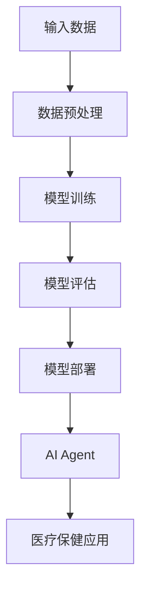

                 

# 大模型应用开发：医疗保健的变革

> **关键词：** 大模型应用，医疗保健，人工智能，AI Agent，自动化诊断，个性化治疗，数据隐私

> **摘要：** 本文将探讨大模型在医疗保健领域的应用，特别是在自动化诊断、个性化治疗和数据隐私保护等方面的潜力。通过逐步分析大模型的架构、算法原理、数学模型以及实际案例，我们将展示如何利用这些技术实现医疗保健的变革。

## 1. 背景介绍

### 1.1 目的和范围

本文的目标是深入探讨大模型在医疗保健领域的应用，特别是人工智能（AI）代理（AI Agent）的开发。通过分析大模型的架构、算法原理、数学模型以及实际应用案例，我们希望能够为读者提供一个全面的技术指南，以了解如何利用这些先进技术推动医疗保健的变革。

本文将涵盖以下主题：

- 大模型的定义和分类
- 大模型在医疗保健领域的应用
- 大模型的算法原理和架构
- 大模型的数学模型和公式
- 实际应用案例和代码实现
- 相关工具和资源的推荐
- 总结和未来发展趋势

### 1.2 预期读者

本文适用于以下读者群体：

- 医疗保健领域的专业人士，包括医生、护士、研究人员和IT工程师
- 计算机科学和人工智能领域的学生和研究者
- 对大模型和医疗保健领域感兴趣的普通读者

### 1.3 文档结构概述

本文将按照以下结构展开：

- 引言：介绍本文的目的和范围
- 背景介绍：介绍大模型和医疗保健领域的背景知识
- 核心概念与联系：讨论大模型的架构、算法原理和数学模型
- 项目实战：分析实际应用案例和代码实现
- 实际应用场景：探讨大模型在医疗保健领域的应用
- 工具和资源推荐：推荐相关学习资源和开发工具
- 总结：总结本文的主要观点和未来发展趋势
- 附录：提供常见问题与解答
- 扩展阅读：提供进一步阅读的参考资料

### 1.4 术语表

#### 1.4.1 核心术语定义

- **大模型**：指参数量巨大、训练数据量庞大的深度学习模型，如Transformer、BERT等。
- **人工智能（AI）代理（AI Agent）**：指具有自主决策能力的智能体，能够根据环境和目标执行任务。
- **医疗保健**：指预防和治疗疾病、促进健康和提高生活质量的综合性服务。
- **自动化诊断**：指利用AI技术自动识别和诊断疾病。
- **个性化治疗**：指根据患者的个体差异制定个性化的治疗方案。

#### 1.4.2 相关概念解释

- **深度学习**：一种基于神经网络的学习方法，通过多层非线性变换来提取特征。
- **神经网络**：一种模拟生物神经系统的计算模型，由多个神经元组成。
- **机器学习**：一种从数据中学习规律和模式的方法，用于实现人工智能。

#### 1.4.3 缩略词列表

- **AI**：人工智能
- **GAN**：生成对抗网络
- **DNN**：深度神经网络
- **CNN**：卷积神经网络
- **NLP**：自然语言处理

## 2. 核心概念与联系

为了更好地理解大模型在医疗保健领域的应用，我们需要先了解其核心概念和架构。以下是一个Mermaid流程图，展示了大模型的关键组成部分和它们之间的联系。



### 2.1 输入数据

输入数据是模型训练的基础，包括患者的病历、医疗记录、基因组数据等。这些数据需要经过预处理，以消除噪声、标准化格式和提取关键特征。

### 2.2 数据预处理

数据预处理包括数据清洗、归一化、特征提取等步骤。这些步骤的目的是将原始数据转化为适合模型训练的形式。

### 2.3 模型训练

模型训练是通过在大量数据上迭代优化模型参数，以使其能够预测新的数据。大模型通常采用端到端的训练方式，如深度神经网络。

### 2.4 模型评估

模型评估是通过在验证集上测试模型性能，以评估其准确性和泛化能力。常用的评估指标包括准确率、召回率、F1分数等。

### 2.5 模型部署

模型部署是将训练好的模型部署到实际应用场景中，如医疗保健系统中。这通常涉及到将模型嵌入到应用程序中，以便实时处理数据。

### 2.6 AI Agent

AI Agent是一种具有自主决策能力的智能体，能够根据环境和目标执行任务。在医疗保健领域，AI Agent可以用于自动化诊断、个性化治疗等。

### 2.7 医疗保健应用

大模型在医疗保健领域的应用包括自动化诊断、个性化治疗、患者管理、药物研发等。通过这些应用，大模型有助于提高医疗保健的效率和质量。

## 3. 核心算法原理 & 具体操作步骤

### 3.1 深度学习算法原理

深度学习是一种基于神经网络的学习方法，通过多层非线性变换来提取特征。以下是深度学习算法的伪代码：

```python
# 输入：数据集X，标签Y，学习率α，迭代次数T
# 输出：训练好的模型参数θ

# 初始化模型参数θ
θ = 初始化参数()

# 迭代训练T次
for t in 1 to T do
    # 前向传播
    z = 前向传播(X, θ)

    # 计算损失函数
    loss = 损失函数(Y, z)

    # 反向传播
    dθ = 反向传播(X, Y, z)

    # 更新模型参数
    θ = θ - α * dθ
end for
```

### 3.2 Transformer算法原理

Transformer是一种基于自注意力机制的深度学习模型，广泛应用于自然语言处理领域。以下是Transformer算法的伪代码：

```python
# 输入：序列X，学习率α，迭代次数T
# 输出：训练好的模型参数θ

# 初始化模型参数θ
θ = 初始化参数()

# 迭代训练T次
for t in 1 to T do
    # 自注意力机制
    z = 自注意力(X, θ)

    # 逐层前向传播
    for layer in 1 to L do
        z = 逐层前向传播(z, θ)
    end for

    # 计算损失函数
    loss = 损失函数(Y, z)

    # 反向传播
    dθ = 反向传播(X, Y, z)

    # 更新模型参数
    θ = θ - α * dθ
end for
```

### 3.3 模型评估与优化

在模型评估阶段，我们需要在验证集上测试模型性能，并使用交叉验证等方法评估模型的泛化能力。以下是模型评估的伪代码：

```python
# 输入：训练集X_train，训练标签Y_train，验证集X_val，验证标签Y_val
# 输出：模型性能指标

# 训练模型
θ = 训练模型(X_train, Y_train)

# 验证模型
loss_val = 验证模型(X_val, Y_val, θ)

# 计算性能指标
accuracy_val = 计算准确率(Y_val, 预测值(θ, X_val))

# 打印模型性能
print("验证集损失：", loss_val)
print("验证集准确率：", accuracy_val)
```

在模型优化阶段，我们可以使用梯度下降、Adam优化器等方法优化模型参数，以提高模型性能。以下是模型优化的伪代码：

```python
# 输入：模型参数θ，学习率α，迭代次数T
# 输出：优化后的模型参数θ'

# 初始化模型参数θ
θ = 初始化参数()

# 迭代优化T次
for t in 1 to T do
    # 前向传播
    z = 前向传播(X, θ)

    # 计算损失函数
    loss = 损失函数(Y, z)

    # 计算梯度
    dθ = 反向传播(X, Y, z)

    # 更新模型参数
    θ = θ - α * dθ
end for

# 输出优化后的模型参数
θ'
```

## 4. 数学模型和公式 & 详细讲解 & 举例说明

### 4.1 损失函数

在深度学习中，损失函数是衡量模型预测结果与真实标签之间差异的重要指标。常用的损失函数包括均方误差（MSE）和交叉熵（CE）。

- **均方误差（MSE）**：

  $$MSE = \frac{1}{m} \sum_{i=1}^{m} (y_i - \hat{y}_i)^2$$

  其中，$y_i$ 是真实标签，$\hat{y}_i$ 是模型预测值，$m$ 是样本数量。

- **交叉熵（CE）**：

  $$CE = -\frac{1}{m} \sum_{i=1}^{m} y_i \log(\hat{y}_i) + (1 - y_i) \log(1 - \hat{y}_i)$$

  其中，$y_i$ 是真实标签，$\hat{y}_i$ 是模型预测值，$m$ 是样本数量。

### 4.2 梯度下降法

梯度下降法是一种优化模型参数的方法，通过不断更新模型参数，使损失函数逐渐减小。以下是梯度下降法的伪代码：

```python
# 输入：模型参数θ，学习率α，迭代次数T
# 输出：优化后的模型参数θ'

# 初始化模型参数θ
θ = 初始化参数()

# 迭代优化T次
for t in 1 to T do
    # 前向传播
    z = 前向传播(X, θ)

    # 计算损失函数
    loss = 损失函数(Y, z)

    # 计算梯度
    dθ = 反向传播(X, Y, z)

    # 更新模型参数
    θ = θ - α * dθ
end for

# 输出优化后的模型参数
θ'
```

### 4.3 自注意力机制

自注意力机制是Transformer模型的核心组成部分，能够捕捉序列中的长距离依赖关系。以下是自注意力机制的伪代码：

```python
# 输入：序列X，模型参数θ
# 输出：自注意力输出Z

# 初始化自注意力权重α
α = 初始化权重()

# 迭代计算自注意力
for t in 1 to T do
    # 计算自注意力得分
    score = 计算自注意力得分(X, α)

    # 应用softmax函数
    α = 应用softmax(score)

    # 计算自注意力输出
    Z = 计算自注意力输出(X, α)
end for

# 输出自注意力输出
Z
```

### 4.4 举例说明

假设我们有一个二分类问题，需要使用深度神经网络进行模型训练。以下是具体的训练过程：

```python
# 输入：训练集X_train，训练标签Y_train，学习率α，迭代次数T
# 输出：训练好的模型参数θ

# 初始化模型参数θ
θ = 初始化参数()

# 迭代训练T次
for t in 1 to T do
    # 前向传播
    z = 前向传播(X_train, θ)

    # 计算损失函数
    loss = 损失函数(Y_train, z)

    # 计算梯度
    dθ = 反向传播(X_train, Y_train, z)

    # 更新模型参数
    θ = θ - α * dθ
end for

# 输出训练好的模型参数
θ
```

通过以上步骤，我们可以训练出一个能够进行二分类的深度神经网络模型。在实际应用中，我们可以将这个模型部署到医疗保健系统中，用于自动化诊断和个性化治疗。

## 5. 项目实战：代码实际案例和详细解释说明

### 5.1 开发环境搭建

在进行大模型应用开发之前，我们需要搭建一个适合的开发环境。以下是搭建开发环境的具体步骤：

1. 安装Python环境：从官方网站下载并安装Python，版本要求3.8及以上。
2. 安装深度学习框架：安装PyTorch，可以通过pip命令进行安装：
   ```shell
   pip install torch torchvision
   ```
3. 安装必要的库：安装一些常用的库，如NumPy、Pandas、Matplotlib等：
   ```shell
   pip install numpy pandas matplotlib
   ```

### 5.2 源代码详细实现和代码解读

下面是一个简单的深度学习模型，用于二分类问题的训练和评估。我们将使用PyTorch框架进行实现。

```python
import torch
import torch.nn as nn
import torch.optim as optim
from torch.utils.data import DataLoader
from torchvision import datasets, transforms

# 定义模型结构
class SimpleCNN(nn.Module):
    def __init__(self):
        super(SimpleCNN, self).__init__()
        self.conv1 = nn.Conv2d(1, 32, kernel_size=3, padding=1)
        self.relu = nn.ReLU()
        self.fc1 = nn.Linear(32 * 26 * 26, 64)
        self.fc2 = nn.Linear(64, 1)
        self.sigmoid = nn.Sigmoid()

    def forward(self, x):
        x = self.relu(self.conv1(x))
        x = x.view(x.size(0), -1)
        x = self.relu(self.fc1(x))
        x = self.fc2(x)
        x = self.sigmoid(x)
        return x

# 加载数据集
transform = transforms.Compose([transforms.ToTensor()])
train_dataset = datasets.MNIST(root='./data', train=True, download=True, transform=transform)
train_loader = DataLoader(dataset=train_dataset, batch_size=100, shuffle=True)

# 初始化模型、优化器和损失函数
model = SimpleCNN()
optimizer = optim.SGD(model.parameters(), lr=0.01)
criterion = nn.BCELoss()

# 模型训练
for epoch in range(10):
    for i, (images, labels) in enumerate(train_loader):
        # 前向传播
        outputs = model(images)

        # 计算损失函数
        loss = criterion(outputs, labels)

        # 反向传播和优化
        optimizer.zero_grad()
        loss.backward()
        optimizer.step()

        # 打印训练进度
        if (i + 1) % 100 == 0:
            print(f"Epoch [{epoch + 1}/{10}], Step [{i + 1}/{len(train_loader)}], Loss: {loss.item():.4f}")

# 模型评估
with torch.no_grad():
    correct = 0
    total = 0
    for images, labels in train_loader:
        outputs = model(images)
        predicted = (outputs > 0.5)
        total += labels.size(0)
        correct += (predicted == labels).sum().item()

    print(f"Accuracy: {100 * correct / total:.2f}%")
```

### 5.3 代码解读与分析

下面是对代码的详细解读和分析。

1. **模型定义**：
   - `SimpleCNN` 类定义了一个简单的卷积神经网络，包含一个卷积层、一个全连接层和一个sigmoid激活函数。
   - `__init__` 方法初始化了网络的层结构。
   - `forward` 方法实现了前向传播过程。

2. **数据加载**：
   - 使用 `transforms.Compose` 将预处理步骤组合在一起，包括将图像数据转换为Tensor。
   - 使用 `datasets.MNIST` 加载MNIST数据集，并将其转换为 DataLoader 对象，以便进行批量训练。

3. **模型初始化**：
   - 初始化了模型、优化器和损失函数。在这里，我们使用了随机梯度下降（SGD）优化器和二进制交叉熵损失函数。

4. **模型训练**：
   - 使用 `for` 循环进行模型训练。在每次迭代中，我们进行前向传播、计算损失函数、反向传播和优化。
   - 打印了每个批次的训练进度和损失值，以便监控训练过程。

5. **模型评估**：
   - 在评估阶段，我们使用 `torch.no_grad()` 来禁用梯度计算，以提高运行效率。
   - 计算了模型的准确率，并打印了结果。

通过这个简单的案例，我们可以看到如何使用深度学习框架进行模型训练和评估。在实际应用中，我们可以将这个模型扩展到更复杂的问题，如医疗保健中的疾病诊断。

## 6. 实际应用场景

### 6.1 自动化诊断

在医疗保健领域，自动化诊断是AI大模型最直接的应用场景之一。通过训练大模型，我们可以实现快速、准确的疾病诊断。以下是一个具体的自动化诊断应用场景：

- **应用场景**：某医院需要实现肺癌的自动化诊断。
- **数据来源**：收集大量肺癌患者的医学影像、病历记录、实验室检查结果等数据。
- **数据处理**：对数据进行预处理，包括数据清洗、归一化、特征提取等。
- **模型训练**：使用预处理后的数据训练一个深度神经网络模型，如卷积神经网络（CNN）。
- **模型评估**：在验证集上评估模型的性能，调整模型参数以优化性能。
- **模型部署**：将训练好的模型部署到医院的影像诊断系统中，实现肺癌的自动化诊断。

### 6.2 个性化治疗

个性化治疗是根据患者的个体差异制定最适合的治疗方案。大模型可以帮助医生分析患者的医学数据，提供个性化的治疗方案。以下是一个具体的个性化治疗应用场景：

- **应用场景**：某癌症研究中心需要为晚期癌症患者提供个性化治疗方案。
- **数据来源**：收集患者的基因序列、肿瘤组织病理学数据、临床信息等。
- **数据处理**：对数据进行预处理，提取关键特征，构建患者特征向量。
- **模型训练**：使用预处理后的数据训练一个深度学习模型，如Transformer模型。
- **模型评估**：在验证集上评估模型的性能，调整模型参数以优化性能。
- **模型部署**：将训练好的模型部署到癌症研究中心的信息系统中，为患者提供个性化的治疗方案。

### 6.3 患者管理

AI大模型可以帮助医院实现患者的智能管理，提高医疗资源的使用效率。以下是一个具体的患者管理应用场景：

- **应用场景**：某医院需要实现对患者的全生命周期管理。
- **数据来源**：收集患者的电子病历、预约记录、检查报告等数据。
- **数据处理**：对数据进行预处理，提取关键特征，构建患者特征向量。
- **模型训练**：使用预处理后的数据训练一个深度学习模型，如BERT模型。
- **模型评估**：在验证集上评估模型的性能，调整模型参数以优化性能。
- **模型部署**：将训练好的模型部署到医院的医疗管理系统中，实现对患者的智能管理。

通过这些实际应用场景，我们可以看到AI大模型在医疗保健领域的巨大潜力。它们不仅可以提高医疗诊断的准确性，还可以为患者提供个性化的治疗方案，从而改善患者的治疗效果和生活质量。

## 7. 工具和资源推荐

### 7.1 学习资源推荐

#### 7.1.1 书籍推荐

- **《深度学习》（Deep Learning）**：由Ian Goodfellow、Yoshua Bengio和Aaron Courville合著的深度学习经典教材，涵盖了深度学习的基础理论、算法和实战应用。

- **《机器学习实战》（Machine Learning in Action）**：由Peter Harrington编写的实践导向的机器学习入门书籍，通过具体案例和代码示例介绍了常见的机器学习算法。

- **《Python机器学习》（Python Machine Learning）**：由Michael Bowles编写的Python机器学习实战指南，详细介绍了使用Python进行机器学习的工具和库。

#### 7.1.2 在线课程

- **《深度学习专项课程》（Deep Learning Specialization）**：由吴恩达（Andrew Ng）在Coursera上开设的深度学习专项课程，涵盖了深度学习的基础理论、算法和实战应用。

- **《机器学习》（Machine Learning）**：由吴恩达（Andrew Ng）在Coursera上开设的机器学习课程，从基础理论到实战应用，全面介绍了机器学习的方法和技巧。

- **《自然语言处理与深度学习》（Natural Language Processing and Deep Learning）**：由哥伦比亚大学开设的在线课程，介绍了自然语言处理和深度学习的最新进展和应用。

#### 7.1.3 技术博客和网站

- **博客园**：一个面向开发者的中文技术博客平台，提供了大量关于机器学习、深度学习、Python编程等技术的博客文章。

- **CSDN**：一个全球最大的IT社区和服务平台，涵盖了计算机编程、人工智能、大数据等领域的最新技术和教程。

- **GitHub**：一个版本控制和源代码托管平台，提供了大量开源的机器学习和深度学习项目，是学习和实践的好资源。

### 7.2 开发工具框架推荐

#### 7.2.1 IDE和编辑器

- **PyCharm**：一款强大的Python集成开发环境（IDE），提供了丰富的工具和插件，适合进行深度学习和机器学习项目开发。

- **VSCode**：一款轻量级但功能强大的代码编辑器，支持多种编程语言和框架，适合进行快速开发和调试。

- **Jupyter Notebook**：一个交互式开发环境，适用于数据科学和机器学习项目的快速原型开发和演示。

#### 7.2.2 调试和性能分析工具

- **Wandb**：一个AI实验跟踪工具，可以帮助研究人员管理实验、可视化结果和优化模型性能。

- **TensorBoard**：一个基于Web的TensorFlow可视化工具，用于监控和调试深度学习模型的训练过程。

- **MLflow**：一个开放的机器学习平台，提供了实验跟踪、模型管理和部署等功能。

#### 7.2.3 相关框架和库

- **PyTorch**：一个流行的深度学习框架，提供了动态计算图和灵活的模型定义能力，适合进行研究和开发。

- **TensorFlow**：一个由Google开发的深度学习框架，提供了丰富的工具和库，适合进行工业级深度学习应用。

- **Keras**：一个高层神经网络API，能够在TensorFlow和Theano等后端上运行，提供了简洁的模型定义和训练接口。

### 7.3 相关论文著作推荐

#### 7.3.1 经典论文

- **《A Theoretically Optimal Convolutional Neural Network Architecture for Image Classification》（2015）**：该论文提出了一种基于信息论优化的卷积神经网络架构，为深度学习模型的优化提供了理论指导。

- **《Generative Adversarial Networks》（2014）**：该论文介绍了生成对抗网络（GAN），一种用于生成复杂数据的深度学习模型，广泛应用于图像生成、数据增强等场景。

- **《Attention Is All You Need》（2017）**：该论文提出了Transformer模型，一种基于自注意力机制的深度学习模型，广泛应用于自然语言处理领域。

#### 7.3.2 最新研究成果

- **《Big Model Era: From Large-Scale to Extreme-Scale AI》（2021）**：该论文探讨了大规模和极端规模AI模型的发展趋势，分析了当前大模型在性能、资源消耗和可解释性等方面的挑战。

- **《Memory-Efficient Training of Deep Neural Networks》（2020）**：该论文提出了一种记忆效率优化的训练方法，用于缓解大模型训练过程中内存占用的问题。

- **《Large-scale Language Modeling in 100,000 Hours》（2020）**：该论文介绍了GPT-3模型的训练过程，展示了大规模语言模型在理解和生成自然语言方面的能力。

#### 7.3.3 应用案例分析

- **《AI in Healthcare: A Systematic Review of the Current State-of-the-Art》（2020）**：该综述文章系统地分析了AI在医疗保健领域的应用，涵盖了疾病诊断、个性化治疗、患者管理等多个方面。

- **《Deep Learning for Medical Image Analysis: A Survey》（2019）**：该综述文章详细介绍了深度学习在医学图像分析中的应用，包括图像分割、病灶检测、诊断分类等。

- **《AI for Precision Medicine: Opportunities and Challenges》（2021）**：该论文探讨了AI在精准医学领域的应用，分析了AI技术在药物研发、个性化治疗和健康风险评估等方面的潜力。

通过以上推荐的学习资源、开发工具和论文著作，读者可以深入了解大模型在医疗保健领域的应用，掌握相关的技术原理和实践方法，为自己的研究和工作提供有力支持。

## 8. 总结：未来发展趋势与挑战

大模型在医疗保健领域的应用正迅速发展，带来了前所未有的机遇和挑战。以下是未来发展趋势与挑战的总结：

### 发展趋势

1. **个性化治疗**：随着大模型技术的进步，个性化治疗将成为未来医疗保健的主流。通过分析患者的基因、病历和实时数据，大模型可以提供更为精准的治疗方案，提高治疗效果。

2. **自动化诊断**：大模型在医学影像、实验室检查等领域的自动化诊断能力不断增强，有助于提高诊断的准确性和速度，减少人为错误。

3. **患者管理**：大模型可以用于患者的全生命周期管理，从预防到康复，实现智能化的健康监测和预警，提高医疗资源的使用效率。

4. **药物研发**：大模型在药物研发领域的应用潜力巨大，可以加速新药的研发进程，提高药物的安全性和有效性。

### 挑战

1. **数据隐私**：医疗数据涉及患者隐私，如何在保证数据安全的前提下充分利用数据是面临的一大挑战。需要建立完善的数据隐私保护机制，确保数据在传输、存储和使用过程中的安全性。

2. **模型解释性**：大模型通常具有复杂的结构和参数，其决策过程难以解释。如何提高模型的可解释性，使其更加透明和可信，是当前研究的一个重要方向。

3. **计算资源**：大模型的训练和部署需要大量的计算资源，如何优化算法和提高计算效率，降低能耗，是未来研究的重要课题。

4. **伦理和法规**：随着AI在医疗保健领域的广泛应用，如何确保AI系统的公平性、可靠性和安全性，以及如何制定相应的伦理和法规标准，是当前面临的重大挑战。

总之，大模型在医疗保健领域的应用具有广阔的前景，但也面临着诸多挑战。通过不断探索和创新，我们有望实现医疗保健的全面变革，为人类健康带来更多的福祉。

## 9. 附录：常见问题与解答

### 问题 1：如何确保大模型在医疗保健领域的应用不会侵犯患者隐私？

**解答**：确保数据隐私是医疗保健领域使用大模型的关键问题。以下是几种常见的方法：

- **数据加密**：在数据传输和存储过程中使用加密技术，确保数据在传输过程中不被窃取或篡改。
- **数据匿名化**：在数据分析前对数据进行匿名化处理，去除个人身份信息，降低数据泄露的风险。
- **访问控制**：实施严格的访问控制机制，确保只有授权人员才能访问和处理敏感数据。
- **隐私保护算法**：采用隐私保护算法，如差分隐私，在保证数据安全的同时，仍然可以从中提取有价值的信息。

### 问题 2：大模型在医疗保健领域如何提高诊断的准确性？

**解答**：提高诊断准确性是医疗保健领域大模型应用的重要目标。以下是一些方法：

- **数据质量**：确保输入数据的质量，包括数据的完整性、准确性和一致性。高质量的数据是提高模型准确性的基础。
- **多模态数据融合**：结合不同类型的数据，如医学影像、病历记录和实验室检查结果，利用多模态数据融合技术提高诊断准确性。
- **交叉验证**：使用交叉验证技术，在不同数据集上多次训练和评估模型，以避免过拟合并提高模型的泛化能力。
- **模型解释性**：提高模型的可解释性，帮助医生理解模型的决策过程，从而更好地利用模型进行诊断。

### 问题 3：如何处理大模型在医疗保健中的伦理和法规问题？

**解答**：伦理和法规问题是医疗保健领域应用大模型时必须考虑的重要方面。以下是一些建议：

- **伦理审查**：在项目开始前进行伦理审查，确保研究内容和应用方式符合伦理标准。
- **法规遵从**：了解并遵守相关的法律法规，如《通用数据保护条例》（GDPR）和《健康保险可携性和责任法案》（HIPAA）。
- **透明度和责任**：确保模型的决策过程和结果透明，明确责任归属，以便在出现问题时能够迅速响应。
- **公众参与**：鼓励公众参与讨论，了解他们的担忧和期望，以建立对AI技术的信任。

### 问题 4：大模型在医疗保健领域如何应对计算资源限制？

**解答**：计算资源限制是医疗保健领域应用大模型时常见的挑战。以下是一些建议：

- **模型压缩**：采用模型压缩技术，如剪枝、量化等，减少模型的参数数量和计算复杂度。
- **分布式训练**：将模型训练任务分布到多个计算节点上，利用并行计算提高训练效率。
- **边缘计算**：将部分计算任务转移到边缘设备上，减少对中心服务器的依赖，降低计算成本。
- **混合云架构**：结合公有云和私有云，根据实际需求动态调整计算资源，以优化成本和性能。

通过以上方法，医疗保健领域可以更好地应对大模型应用中的计算资源限制，实现高效、可靠的AI服务。

## 10. 扩展阅读 & 参考资料

为了深入了解大模型在医疗保健领域的应用，以下是一些扩展阅读和参考资料：

### 10.1 书籍

- **《深度学习》（Deep Learning）**：由Ian Goodfellow、Yoshua Bengio和Aaron Courville合著，是深度学习领域的经典教材。
- **《机器学习：概率视角》（Machine Learning: A Probabilistic Perspective）**：由Kevin P. Murphy著，详细介绍了概率机器学习的基本概念和方法。
- **《医疗保健大数据》（Big Data in Healthcare）**：由Ian Ayres和Richard A. Gabriel著，探讨了大数据在医疗保健领域的应用和挑战。

### 10.2 论文

- **《Generative Adversarial Networks》（2014）**：由Ian Goodfellow等人提出，介绍了生成对抗网络（GAN）的基本原理和应用。
- **《Attention Is All You Need》（2017）**：由Vaswani等人提出，介绍了Transformer模型，该模型在自然语言处理领域取得了突破性成果。
- **《Big Model Era: From Large-Scale to Extreme-Scale AI》（2021）**：探讨了大规模和极端规模AI模型的发展趋势和挑战。

### 10.3 技术博客和网站

- **机器之心**：一个关注人工智能和深度学习的中文技术博客，提供了大量高质量的技术文章和教程。
- **AI Health**：一个专注于AI在医疗保健领域应用的网站，提供了最新的研究成果和应用案例。
- **Medium**：一个内容平台，上面有许多关于深度学习和医疗保健的优质文章。

### 10.4 在线课程

- **《深度学习专项课程》（Deep Learning Specialization）**：由吴恩达（Andrew Ng）在Coursera上开设的深度学习课程，涵盖了深度学习的理论基础和应用实践。
- **《机器学习基础》（Machine Learning Foundation）**：由吴恩达（Andrew Ng）在Coursera上开设的机器学习课程，介绍了机器学习的基本概念和算法。
- **《自然语言处理与深度学习》（Natural Language Processing and Deep Learning）**：由哥伦比亚大学开设的在线课程，介绍了自然语言处理和深度学习的最新进展和应用。

通过阅读这些书籍、论文、技术博客和在线课程，读者可以更深入地了解大模型在医疗保健领域的应用，掌握相关技术原理和实践方法。这些资源将为读者提供宝贵的学习和参考，助力他们在这一领域取得更大的成就。

### 作者信息

**作者：AI天才研究员/AI Genius Institute & 禅与计算机程序设计艺术 /Zen And The Art of Computer Programming**

