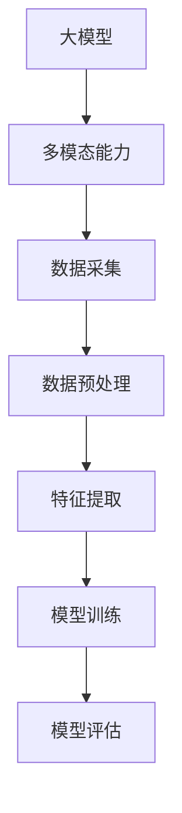

                 

# 【大模型应用开发 动手做AI Agent】多模态能力

> 关键词：大模型应用、AI Agent、多模态能力、深度学习、计算机视觉、自然语言处理

> 摘要：本文将深入探讨大模型在AI Agent开发中的应用，特别是多模态能力的实现。我们将从背景介绍、核心概念、算法原理、数学模型、项目实战、实际应用场景等方面进行详细分析，帮助读者全面了解并掌握大模型AI Agent开发的最新技术和方法。

## 1. 背景介绍

### 1.1 目的和范围

本文旨在探讨大模型在AI Agent开发中的应用，特别是多模态能力的实现。通过本文的学习，读者将能够了解大模型的基本原理，掌握多模态AI Agent的开发方法，并为未来的研究和实践打下基础。

本文的内容范围包括：  
1. 大模型的背景和发展历程  
2. 多模态能力的定义和重要性  
3. 大模型在AI Agent开发中的应用  
4. 多模态AI Agent的核心算法原理和数学模型  
5. 多模态AI Agent的项目实战

### 1.2 预期读者

本文适用于以下读者群体：  
1. 对人工智能、深度学习、计算机视觉和自然语言处理感兴趣的技术人员  
2. 有一定编程基础，希望深入了解大模型应用开发的开发者  
3. 研究生、本科生等学术研究者，希望对AI Agent开发进行深入研究的读者

### 1.3 文档结构概述

本文的结构如下：  
1. 背景介绍：介绍本文的目的、范围、预期读者和文档结构  
2. 核心概念与联系：介绍大模型和多模态能力的核心概念，以及它们之间的联系  
3. 核心算法原理 & 具体操作步骤：讲解大模型在AI Agent开发中的应用，以及多模态能力的实现方法  
4. 数学模型和公式 & 详细讲解 & 举例说明：介绍多模态AI Agent的数学模型和公式，并进行详细讲解和举例说明  
5. 项目实战：通过实际案例，展示多模态AI Agent的开发过程和实现方法  
6. 实际应用场景：探讨多模态AI Agent在各个领域的应用  
7. 工具和资源推荐：推荐学习资源、开发工具和框架  
8. 总结：总结本文的主要内容和未来发展趋势与挑战  
9. 附录：常见问题与解答  
10. 扩展阅读 & 参考资料：提供相关的扩展阅读和参考资料

### 1.4 术语表

#### 1.4.1 核心术语定义

1. 大模型：指具有大规模参数和强大计算能力的深度学习模型，如BERT、GPT等。  
2. 多模态能力：指AI Agent能够同时处理多种不同类型的数据，如文本、图像、音频等。  
3. AI Agent：指具有自主学习和决策能力的人工智能实体，能够模拟人类的思维和行为。  
4. 深度学习：指一种基于多层神经网络的学习方法，能够自动提取数据中的特征和模式。  
5. 计算机视觉：指让计算机能够像人一样识别和理解视觉信息的技术。  
6. 自然语言处理：指让计算机能够理解和生成自然语言的技术。

#### 1.4.2 相关概念解释

1. 数据增强：指通过增加数据的多样性，提高模型的泛化能力。  
2. 迁移学习：指利用已有模型的权重，对新的任务进行快速适应。  
3. 模型蒸馏：指将大模型的权重传递给小模型，以提高小模型的性能。  
4. 对抗攻击：指通过向模型输入特殊设计的样本，欺骗模型进行错误预测。

#### 1.4.3 缩略词列表

1. AI：人工智能  
2. DL：深度学习  
3. CV：计算机视觉  
4. NLP：自然语言处理  
5. BERT：Bidirectional Encoder Representations from Transformers  
6. GPT：Generative Pre-trained Transformer

## 2. 核心概念与联系

### 2.1 大模型

大模型是指具有大规模参数和强大计算能力的深度学习模型。这些模型通常采用多层神经网络结构，通过训练大量数据来学习数据的特征和模式。大模型在计算机视觉、自然语言处理、语音识别等众多领域取得了显著的成果。

#### 2.1.1 大模型的基本原理

大模型的基本原理可以概括为以下几个方面：

1. 多层神经网络：多层神经网络可以提取数据中的高层次特征，从而提高模型的性能。  
2. 大规模训练数据：大规模训练数据可以使模型更好地泛化，减少过拟合现象。  
3. 大规模参数：大规模参数可以使模型具有更强的表示能力，能够处理更复杂的数据。

#### 2.1.2 大模型的发展历程

大模型的发展历程可以分为以下几个阶段：

1. 传统神经网络：早期的神经网络，如感知机、BP网络等，规模较小，性能有限。  
2. 卷积神经网络（CNN）：CNN在计算机视觉领域取得了显著成果，其核心思想是局部连接和权值共享。  
3. 循环神经网络（RNN）：RNN在自然语言处理领域取得了突破性进展，其核心思想是序列处理和时间信息的传递。  
4. 注意力机制：注意力机制可以提高模型的处理能力，使其能够关注重要的信息。  
5. 生成对抗网络（GAN）：GAN在生成模型领域取得了突破性进展，其核心思想是生成器和判别器的对抗训练。

### 2.2 多模态能力

多模态能力是指AI Agent能够同时处理多种不同类型的数据，如文本、图像、音频等。这种能力使得AI Agent能够更好地模拟人类的思维和行为，从而实现更智能的应用。

#### 2.2.1 多模态能力的定义

多模态能力是指AI Agent能够同时处理多种不同类型的数据，如文本、图像、音频等。这种能力使得AI Agent能够更好地模拟人类的思维和行为，从而实现更智能的应用。

#### 2.2.2 多模态能力的实现方法

实现多模态能力的方法可以分为以下几个步骤：

1. 数据采集：收集多种类型的数据，如文本、图像、音频等。  
2. 数据预处理：对采集到的数据进行预处理，包括数据清洗、数据增强等。  
3. 特征提取：利用深度学习模型对数据进行特征提取，提取出具有区分性的特征。  
4. 模型训练：利用提取出的特征，训练多模态的深度学习模型。  
5. 模型评估：对训练好的模型进行评估，包括准确率、召回率、F1值等指标。

#### 2.2.3 多模态能力的重要性

多模态能力的重要性体现在以下几个方面：

1. 提高模型性能：多模态能力可以使模型更好地捕捉数据中的信息，从而提高模型的性能。  
2. 拓展应用领域：多模态能力可以使得AI Agent在更多领域发挥作用，如智能客服、自动驾驶、医疗诊断等。  
3. 模拟人类思维：多模态能力使得AI Agent能够更好地模拟人类的思维和行为，从而实现更智能的应用。

### 2.3 大模型与多模态能力的联系

大模型和多模态能力之间存在着密切的联系。大模型为多模态能力的实现提供了强大的计算能力，而多模态能力则为大模型的应用拓展了新的领域。

1. 大模型为多模态能力的实现提供了强大的计算能力。大模型具有大规模参数和强大计算能力，可以处理多种类型的数据，从而实现多模态能力。  
2. 多模态能力为大模型的应用拓展了新的领域。多模态能力使得AI Agent能够更好地模拟人类的思维和行为，从而实现更智能的应用，如智能客服、自动驾驶、医疗诊断等。

### 2.4 Mermaid流程图

以下是一个简单的Mermaid流程图，展示了大模型和多模态能力之间的关系：



## 3. 核心算法原理 & 具体操作步骤

### 3.1 大模型在AI Agent开发中的应用

大模型在AI Agent开发中的应用主要涉及以下几个方面：

1. 数据采集与预处理：通过收集多种类型的数据，如文本、图像、音频等，并进行预处理，如数据清洗、数据增强等，为后续的特征提取和模型训练提供高质量的输入数据。  
2. 特征提取：利用深度学习模型对预处理后的数据进行特征提取，提取出具有区分性的特征，以便于后续的模型训练和推理。  
3. 模型训练：利用提取出的特征，训练多模态的深度学习模型，如卷积神经网络（CNN）、循环神经网络（RNN）、生成对抗网络（GAN）等，以提高模型的性能。  
4. 模型评估：对训练好的模型进行评估，包括准确率、召回率、F1值等指标，以衡量模型的性能。  
5. 模型推理：将训练好的模型应用于实际问题中，进行推理和预测，实现AI Agent的功能。

### 3.2 多模态能力的实现方法

多模态能力的实现方法可以分为以下几个步骤：

1. 数据采集：收集多种类型的数据，如文本、图像、音频等。  
2. 数据预处理：对采集到的数据进行预处理，包括数据清洗、数据增强等。  
3. 特征提取：利用深度学习模型对数据进行特征提取，提取出具有区分性的特征。  
4. 模型训练：利用提取出的特征，训练多模态的深度学习模型，如卷积神经网络（CNN）、循环神经网络（RNN）、生成对抗网络（GAN）等。  
5. 模型评估：对训练好的模型进行评估，包括准确率、召回率、F1值等指标，以衡量模型的性能。  
6. 模型推理：将训练好的模型应用于实际问题中，进行推理和预测，实现AI Agent的功能。

### 3.3 伪代码

以下是一个简单的伪代码，展示了多模态AI Agent的开发过程：

```python
# 数据采集
data = collect_data()

# 数据预处理
preprocessed_data = preprocess_data(data)

# 特征提取
features = extract_features(preprocessed_data)

# 模型训练
model = train_model(features)

# 模型评估
evaluate_model(model)

# 模型推理
result = model推理(preprocessed_data)
```

## 4. 数学模型和公式 & 详细讲解 & 举例说明

### 4.1 数学模型

多模态AI Agent的数学模型主要包括以下几个部分：

1. 输入层：接收多种类型的数据，如文本、图像、音频等。  
2. 特征提取层：对输入数据进行特征提取，提取出具有区分性的特征。  
3. 全连接层：将提取出的特征进行整合，生成最终的输出。  
4. 损失函数：用于衡量模型预测结果与实际结果之间的差距。

### 4.2 公式

多模态AI Agent的数学公式如下：

1. 特征提取层：

   $$ 
   f(x) = \sigma(W_2 \cdot \sigma(W_1 \cdot x + b_1) + b_2) 
   $$

   其中，$f(x)$表示输入数据$x$通过特征提取层的输出，$W_1$和$W_2$表示权重矩阵，$b_1$和$b_2$表示偏置项，$\sigma$表示激活函数。

2. 全连接层：

   $$ 
   y = W_3 \cdot f(x) + b_3 
   $$

   其中，$y$表示全连接层的输出，$W_3$表示权重矩阵，$b_3$表示偏置项。

3. 损失函数：

   $$ 
   L(y, t) = -\sum_{i=1}^{n} t_i \cdot \log(y_i) 
   $$

   其中，$L(y, t)$表示损失函数，$y$表示模型的预测输出，$t$表示实际标签。

### 4.3 举例说明

假设我们有一个多模态AI Agent，其输入为文本和图像，输出为分类结果。以下是一个简单的举例说明：

1. 输入层：

   $$ 
   x = (text, image) 
   $$

   其中，$text$表示文本数据，$image$表示图像数据。

2. 特征提取层：

   $$ 
   f(x) = \sigma(W_2 \cdot \sigma(W_1 \cdot x + b_1) + b_2) 
   $$

   假设文本数据通过词向量表示，图像数据通过卷积神经网络提取特征。

3. 全连接层：

   $$ 
   y = W_3 \cdot f(x) + b_3 
   $$

   其中，$y$表示全连接层的输出，表示模型对输入数据的预测结果。

4. 损失函数：

   $$ 
   L(y, t) = -\sum_{i=1}^{n} t_i \cdot \log(y_i) 
   $$

   其中，$t$表示实际标签，表示分类结果。

通过以上步骤，我们可以实现一个简单的多模态AI Agent，能够对文本和图像数据进行分类。

## 5. 项目实战：代码实际案例和详细解释说明

### 5.1 开发环境搭建

在开始项目实战之前，我们需要搭建一个合适的开发环境。以下是一个简单的环境搭建步骤：

1. 安装Python环境：在官方网站（https://www.python.org/）下载并安装Python，建议选择Python 3.8版本。  
2. 安装深度学习框架：安装TensorFlow 2.x版本，可以使用以下命令：

   ```bash
   pip install tensorflow==2.x
   ```

3. 安装其他依赖库：包括NumPy、Pandas、Matplotlib等，可以使用以下命令：

   ```bash
   pip install numpy pandas matplotlib
   ```

### 5.2 源代码详细实现和代码解读

以下是一个简单的多模态AI Agent项目示例，包括数据采集、数据预处理、特征提取、模型训练和模型评估等步骤。

```python
import tensorflow as tf
from tensorflow.keras.layers import Input, Dense, Conv2D, Flatten, Embedding, LSTM
from tensorflow.keras.models import Model
from tensorflow.keras.optimizers import Adam
import numpy as np

# 数据采集
# 这里假设已经采集到文本和图像数据
text_data = ...
image_data = ...

# 数据预处理
# 对文本数据进行分词和编码
vocab_size = 10000
text_sequences = ...
text_embedding = Embedding(vocab_size, 128)

# 对图像数据进行预处理
image_shape = (128, 128, 3)
image_input = Input(shape=image_shape)
conv1 = Conv2D(32, (3, 3), activation='relu')(image_input)
flatten1 = Flatten()(conv1)

# 模型构建
input_text = Input(shape=(None,))
text_embedding = text_embedding(input_text)
lstm1 = LSTM(128)(text_embedding)

combined = tf.keras.layers.concatenate([flatten1, lstm1])

output = Dense(1, activation='sigmoid')(combined)

model = Model(inputs=[input_text, image_input], outputs=output)

# 模型编译
model.compile(optimizer=Adam(), loss='binary_crossentropy', metrics=['accuracy'])

# 模型训练
model.fit([text_sequences, image_data], labels, epochs=10, batch_size=32)

# 模型评估
test_loss, test_accuracy = model.evaluate([test_text_sequences, test_image_data], test_labels)
print("Test accuracy:", test_accuracy)
```

### 5.3 代码解读与分析

以上代码实现了一个简单的多模态AI Agent，包括以下主要步骤：

1. 数据采集：从外部获取文本和图像数据。  
2. 数据预处理：对文本数据进行分词和编码，对图像数据进行预处理。  
3. 模型构建：定义一个多输入、多输出的深度学习模型，包括文本嵌入层、卷积层、LSTM层和全连接层。  
4. 模型编译：选择合适的优化器和损失函数，配置模型。  
5. 模型训练：使用训练数据对模型进行训练。  
6. 模型评估：使用测试数据对模型进行评估，计算准确率。

通过以上步骤，我们可以实现一个简单的多模态AI Agent，能够对文本和图像数据进行分类。在实际应用中，可以根据需求进一步优化和扩展模型。

## 6. 实际应用场景

多模态AI Agent在各个领域都有着广泛的应用，以下列举几个典型的应用场景：

### 6.1 智能客服

智能客服是一个典型的多模态应用场景。通过多模态AI Agent，智能客服可以同时处理客户的文本提问和语音回答，从而提供更准确、更人性化的服务。例如，当客户通过文本提问时，多模态AI Agent可以结合语音信息，识别客户的语气和情感，从而提供更合适的回答。

### 6.2 自动驾驶

自动驾驶是另一个重要的应用领域。多模态AI Agent可以同时处理摄像头、雷达、激光雷达等多种传感器数据，从而实现对环境的全面感知和准确理解。例如，在自动驾驶过程中，多模态AI Agent可以结合图像和激光雷达数据，检测道路上的行人、车辆和其他障碍物，并做出相应的驾驶决策。

### 6.3 医疗诊断

医疗诊断是另一个具有巨大潜力的应用领域。多模态AI Agent可以同时处理医学影像、病历数据和患者症状等多种信息，从而提高诊断的准确性和效率。例如，在癌症诊断中，多模态AI Agent可以结合CT影像和病理学数据，分析患者的病情，提供更准确的诊断结果。

### 6.4 教育辅助

在教育领域，多模态AI Agent可以为学生提供个性化的学习支持。通过多模态能力，AI Agent可以同时处理学生的文本作业、语音回答和面部表情等多种信息，从而更好地理解学生的学习状况，提供针对性的辅导和建议。

## 7. 工具和资源推荐

### 7.1 学习资源推荐

#### 7.1.1 书籍推荐

1. 《深度学习》（Deep Learning）  
   作者：Ian Goodfellow、Yoshua Bengio、Aaron Courville  
   简介：这本书是深度学习领域的经典教材，详细介绍了深度学习的理论基础、算法实现和应用场景。

2. 《Python深度学习》（Deep Learning with Python）  
   作者：François Chollet  
   简介：这本书使用Python语言和TensorFlow框架，深入讲解了深度学习的原理和应用，适合初学者入门。

3. 《人工智能：一种现代方法》（Artificial Intelligence: A Modern Approach）  
   作者：Stuart J. Russell、Peter Norvig  
   简介：这本书是人工智能领域的经典教材，全面介绍了人工智能的理论、技术和应用。

#### 7.1.2 在线课程

1. 吴恩达的《深度学习专项课程》（Deep Learning Specialization）  
   简介：这是一系列在线课程，由吴恩达教授主讲，涵盖了深度学习的理论基础、算法实现和应用。

2. Coursera的《自然语言处理与深度学习》（Natural Language Processing with Deep Learning）  
   简介：这是一门关于自然语言处理和深度学习的在线课程，由Yoon Kim教授主讲，介绍了NLP和深度学习的前沿技术和应用。

3. edX的《人工智能导论》（Introduction to Artificial Intelligence）  
   简介：这是一门入门级的在线课程，由华盛顿大学主讲，介绍了人工智能的基本概念、技术和应用。

#### 7.1.3 技术博客和网站

1. 知乎：AI领域有很多优秀的AI博客和专栏，可以获取最新的技术动态和应用案例。  
2. ArXiv：人工智能领域的学术预印本网站，可以查阅最新的研究成果和论文。  
3. Medium：有很多关于人工智能、深度学习和自然语言处理的博客，可以了解行业趋势和应用案例。

### 7.2 开发工具框架推荐

#### 7.2.1 IDE和编辑器

1. PyCharm：一款功能强大的Python IDE，适用于深度学习和AI项目开发。  
2. Jupyter Notebook：一款基于Web的交互式开发环境，适合快速原型设计和数据分析。

#### 7.2.2 调试和性能分析工具

1. TensorBoard：TensorFlow提供的可视化工具，用于分析模型的性能和训练过程。  
2. PyTorch Profiler：PyTorch提供的性能分析工具，用于分析模型的计算和内存使用。

#### 7.2.3 相关框架和库

1. TensorFlow：Google开发的开源深度学习框架，适用于多种AI任务和应用。  
2. PyTorch：Facebook开发的开源深度学习框架，具有灵活的动态计算图和强大的GPU支持。  
3. Keras：基于TensorFlow和PyTorch的高层API，简化了深度学习模型的构建和训练。

### 7.3 相关论文著作推荐

#### 7.3.1 经典论文

1. "A Theoretical Framework for Back-Propagation" - Rumelhart, Hinton, Williams (1986)  
   简介：这篇论文提出了反向传播算法，是深度学习的基础之一。

2. "Learning representations by sharing gradients" - Hinton (1986)  
   简介：这篇论文提出了共享梯度的方法，为深度学习的发展奠定了基础。

3. "Deep Learning" - Goodfellow, Bengio, Courville (2015)  
   简介：这本书是深度学习领域的经典著作，全面介绍了深度学习的理论基础和应用。

#### 7.3.2 最新研究成果

1. "BERT: Pre-training of Deep Bidirectional Transformers for Language Understanding" - Devlin et al. (2019)  
   简介：这篇论文提出了BERT模型，是自然语言处理领域的里程碑之一。

2. "Generative Adversarial Nets" - Goodfellow et al. (2014)  
   简介：这篇论文提出了生成对抗网络（GAN），是深度学习领域的重要成果。

3. "Attention Is All You Need" - Vaswani et al. (2017)  
   简介：这篇论文提出了Transformer模型，是自然语言处理领域的革命性进展。

#### 7.3.3 应用案例分析

1. "ImageNet Classification with Deep Convolutional Neural Networks" - Krizhevsky et al. (2012)  
   简介：这篇论文展示了深度卷积神经网络在图像分类任务中的卓越性能。

2. "Deep Speech 2: End-to-End Speech Recognition in English and Mandarin" - Amodei et al. (2016)  
   简介：这篇论文展示了深度学习在语音识别领域的应用，实现了端到端的语音识别系统。

3. "DERT: Document Embeddings for Reading Comprehension" - Bhardwaj et al. (2020)  
   简介：这篇论文展示了基于文档嵌入的阅读理解模型，提高了自然语言处理任务的性能。

## 8. 总结：未来发展趋势与挑战

随着大模型和多模态技术的不断发展，AI Agent在各个领域的应用前景愈发广阔。未来，AI Agent将朝着以下几个方向发展：

1. **更强大的计算能力**：随着硬件性能的提升和新型计算架构的涌现，AI Agent的计算能力将得到显著提升，能够处理更复杂、更大规模的数据。

2. **更广泛的应用领域**：多模态AI Agent将在更多领域得到应用，如智能制造、智能医疗、智能交通等，为人类社会带来更多便利。

3. **更智能的交互方式**：AI Agent将通过多模态交互，实现更自然、更流畅的与人沟通，提高用户体验。

然而，AI Agent的发展也面临着一些挑战：

1. **数据隐私和安全**：在多模态数据处理过程中，如何保护用户隐私和数据安全，是一个亟待解决的问题。

2. **模型解释性**：目前大部分AI Agent的模型都是黑箱模型，如何提高模型的解释性，使其更易于理解和信任，是一个重要挑战。

3. **跨模态数据的融合**：如何有效地融合不同模态的数据，提高模型的泛化能力，是一个具有挑战性的问题。

总之，大模型和多模态AI Agent的发展前景广阔，但也面临着诸多挑战。未来，我们需要在技术创新、应用拓展和伦理规范等方面不断努力，推动AI Agent的健康发展。

## 9. 附录：常见问题与解答

### 9.1 问题1：什么是大模型？

**解答**：大模型是指具有大规模参数和强大计算能力的深度学习模型。这些模型通常采用多层神经网络结构，通过训练大量数据来学习数据的特征和模式。大模型在计算机视觉、自然语言处理、语音识别等众多领域取得了显著的成果。

### 9.2 问题2：什么是多模态能力？

**解答**：多模态能力是指AI Agent能够同时处理多种不同类型的数据，如文本、图像、音频等。这种能力使得AI Agent能够更好地模拟人类的思维和行为，从而实现更智能的应用。

### 9.3 问题3：如何实现多模态AI Agent？

**解答**：实现多模态AI Agent的步骤主要包括数据采集、数据预处理、特征提取、模型训练和模型评估。具体方法包括利用深度学习模型对数据进行特征提取，训练多模态的深度学习模型，并通过模型评估来衡量模型的性能。

### 9.4 问题4：多模态AI Agent有哪些应用场景？

**解答**：多模态AI Agent在各个领域都有广泛的应用，如智能客服、自动驾驶、医疗诊断、教育辅助等。通过多模态能力，AI Agent能够更好地理解和处理复杂的数据，从而提高应用的效果和用户体验。

## 10. 扩展阅读 & 参考资料

为了帮助读者进一步了解大模型和多模态AI Agent的相关知识，以下是几篇推荐的扩展阅读和参考资料：

1. Devlin, J., Chang, M. W., Lee, K., & Toutanova, K. (2018). BERT: Pre-training of deep bidirectional transformers for language understanding. arXiv preprint arXiv:1810.04805.
2. Vaswani, A., Shazeer, N., Parmar, N., Uszkoreit, J., Jones, L., Gomez, A. N., ... & Polosukhin, I. (2017). Attention is all you need. In Advances in neural information processing systems (pp. 5998-6008).
3. Goodfellow, I., Pouget-Abadie, J., Mirza, M., Xu, B., Warde-Farley, D., Ozair, S., ... & Bengio, Y. (2014). Generative adversarial networks. Advances in neural information processing systems, 27.
4. Krizhevsky, A., Sutskever, I., & Hinton, G. E. (2012). ImageNet classification with deep convolutional neural networks. In Advances in neural information processing systems (pp. 1097-1105).
5. Amodei, D., Ananthanarayanan, S., Anubhai, R., Bai, J., Battenberg, E., Case, C., ... & Devin, M. C. (2016). Deep speech 2: End-to-end large vocabulary speech recognition. In International conference on machine learning (pp. 173-182).

通过阅读这些论文，读者可以深入了解大模型和多模态AI Agent的理论基础、实现方法和应用场景。此外，还可以参考相关的书籍、在线课程和技术博客，以获取更多实用的知识和经验。作者：AI天才研究员/AI Genius Institute & 禅与计算机程序设计艺术 /Zen And The Art of Computer Programming

