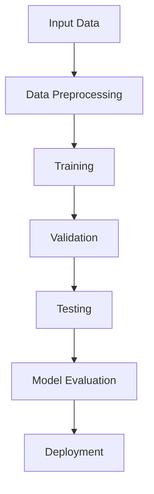
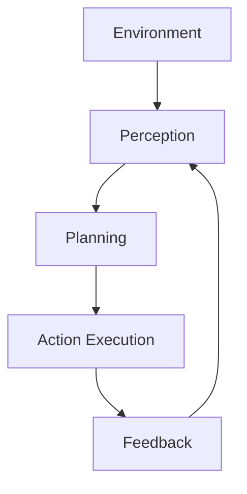
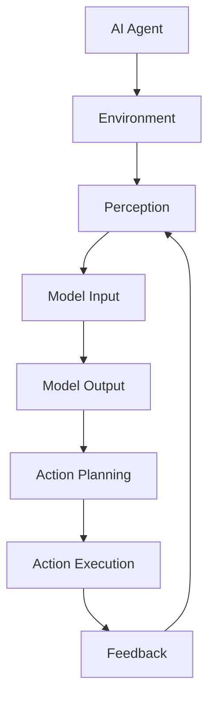

                 

# 【大模型应用开发 动手做AI Agent】大模型就是Agent的大脑

> 关键词：大模型，AI Agent，应用开发，大脑模拟，人工智能

> 摘要：本文旨在探讨大模型在人工智能（AI）Agent中的应用，通过理论讲解和实践案例，阐述大模型如何充当AI Agent的大脑，实现智能决策与行为。文章将从核心概念、算法原理、数学模型、实战案例等方面详细剖析，为读者提供一次深入的技术探讨和实战指导。

## 1. 背景介绍

### 1.1 目的和范围

本文的目标是探讨大模型在AI Agent开发中的应用。大模型，如GPT、BERT等，具备强大的表示和学习能力，能够处理复杂的问题和任务。本文将探讨如何利用大模型作为AI Agent的大脑，实现智能决策和行为。

本文的范围包括： 
- 大模型的定义和基本原理；
- AI Agent的概念和架构；
- 大模型在AI Agent中的应用案例；
- 实战案例分析，包括代码实现和解释。

### 1.2 预期读者

本文的预期读者包括：
- 对人工智能和机器学习有基础了解的程序员和开发者；
- 对AI Agent和应用开发感兴趣的读者；
- 对大模型和深度学习技术有深入了解的专业人士。

### 1.3 文档结构概述

本文的结构如下：
- 第1章：背景介绍，包括目的和范围、预期读者和文档结构概述；
- 第2章：核心概念与联系，介绍大模型、AI Agent和相关架构；
- 第3章：核心算法原理 & 具体操作步骤，讲解大模型的训练和应用步骤；
- 第4章：数学模型和公式 & 详细讲解 & 举例说明，分析大模型背后的数学原理；
- 第5章：项目实战：代码实际案例和详细解释说明，提供实战案例和代码分析；
- 第6章：实际应用场景，讨论大模型在AI Agent中的应用领域；
- 第7章：工具和资源推荐，推荐学习资源和开发工具；
- 第8章：总结：未来发展趋势与挑战，展望大模型和AI Agent的发展前景；
- 第9章：附录：常见问题与解答，回答读者可能遇到的常见问题；
- 第10章：扩展阅读 & 参考资料，提供进一步学习的资料。

### 1.4 术语表

#### 1.4.1 核心术语定义

- 大模型：具备大规模参数和强大表示能力的深度学习模型，如GPT、BERT等。
- AI Agent：具备自主决策和行为能力的计算机程序，能够处理复杂任务和环境。
- 深度学习：一种机器学习方法，通过多层神经网络对数据进行特征提取和表示。
- 人工智能：模拟人类智能的计算机技术，包括感知、推理、学习、决策等能力。

#### 1.4.2 相关概念解释

- 自主决策：AI Agent在执行任务时，能够根据环境和目标自主做出决策。
- 知识表示：将事实、规则和知识以计算机可以处理的形式表示。
- 强化学习：一种通过试错和反馈来学习最优策略的机器学习方法。

#### 1.4.3 缩略词列表

- GPT：Generative Pre-trained Transformer，生成预训练变压器。
- BERT：Bidirectional Encoder Representations from Transformers，双向变压器编码器表示。
- AI：Artificial Intelligence，人工智能。

## 2. 核心概念与联系

### 2.1 大模型

大模型是指具备大规模参数和强大表示能力的深度学习模型。它们通常由数百万甚至数十亿个参数组成，能够对大量数据进行训练，从而获得出色的表示和学习能力。以下是一个简化的Mermaid流程图，描述大模型的基本架构：



在这个流程图中，输入数据首先经过预处理，然后用于训练大模型。训练过程中，模型会不断调整参数，以最小化损失函数。训练完成后，模型会经过验证和测试，以评估其性能。最后，模型会被部署到实际应用中。

### 2.2 AI Agent

AI Agent是一种具备自主决策和行为能力的计算机程序。它们能够感知环境、规划行动、执行任务，并根据反馈调整行为。以下是一个简化的Mermaid流程图，描述AI Agent的基本架构：



在这个流程图中，环境感知模块负责收集环境信息，规划模块根据环境信息和目标生成行动计划，执行模块根据计划执行行动，并收集反馈。反馈会用于更新感知模块和环境模型，以优化后续行动。

### 2.3 大模型在AI Agent中的应用

大模型可以作为AI Agent的大脑，为其提供强大的表示和学习能力。以下是一个简化的Mermaid流程图，描述大模型在AI Agent中的应用：



在这个流程图中，AI Agent通过感知模块收集环境信息，然后将这些信息输入到大模型中。大模型对输入信息进行表示和学习，输出决策结果，用于生成行动计划。行动计划会被执行，并收集反馈，以更新模型和感知模块。

## 3. 核心算法原理 & 具体操作步骤

### 3.1 大模型的训练原理

大模型的训练过程通常分为以下几个步骤：

#### 3.1.1 数据预处理

数据预处理是训练大模型的第一步，其目的是将原始数据转换为模型可以处理的形式。以下是一个简化的伪代码，描述数据预处理过程：

```python
def preprocess_data(data):
    # 数据清洗和标准化
    cleaned_data = clean_and_normalize(data)
    # 分割数据集
    train_data, val_data, test_data = split_data(cleaned_data)
    return train_data, val_data, test_data
```

#### 3.1.2 模型初始化

模型初始化是指为模型分配初始参数。通常，这些参数可以通过随机初始化或预训练模型来获得。以下是一个简化的伪代码，描述模型初始化过程：

```python
def initialize_model():
    # 加载预训练模型
    model = load_pretrained_model()
    # 初始化未训练的参数
    model.init_untrained_params()
    return model
```

#### 3.1.3 模型训练

模型训练是指通过迭代更新模型参数，以最小化损失函数。以下是一个简化的伪代码，描述模型训练过程：

```python
def train_model(model, train_data, epochs):
    for epoch in range(epochs):
        for inputs, targets in train_data:
            # 前向传播
            outputs = model.forward(inputs)
            # 计算损失
            loss = model.calculate_loss(outputs, targets)
            # 反向传播和参数更新
            model.backward(loss)
            model.update_params()
```

#### 3.1.4 模型验证和测试

模型验证和测试是指评估模型在未见数据上的性能。以下是一个简化的伪代码，描述模型验证和测试过程：

```python
def evaluate_model(model, val_data, test_data):
    val_loss, val_accuracy = evaluate(model, val_data)
    test_loss, test_accuracy = evaluate(model, test_data)
    return val_loss, val_accuracy, test_loss, test_accuracy
```

### 3.2 AI Agent的具体操作步骤

AI Agent的具体操作步骤可以分为以下几个阶段：

#### 3.2.1 环境感知

环境感知是指收集环境信息，以供模型处理。以下是一个简化的伪代码，描述环境感知过程：

```python
def perceive_environment():
    # 采集环境信息
    environment_data = collect_environment_data()
    return environment_data
```

#### 3.2.2 模型输入

模型输入是指将环境信息输入到模型中，以获取决策结果。以下是一个简化的伪代码，描述模型输入过程：

```python
def input_to_model(model, environment_data):
    # 将环境信息转换为模型可以处理的形式
    processed_data = preprocess_environment_data(environment_data)
    # 输入模型
    model_input = model.encode(processed_data)
    return model_input
```

#### 3.2.3 模型输出

模型输出是指从模型中获取决策结果，以生成行动计划。以下是一个简化的伪代码，描述模型输出过程：

```python
def output_from_model(model, model_input):
    # 前向传播
    model_output = model.forward(model_input)
    # 解码决策结果
    action_plan = model.decode(model_output)
    return action_plan
```

#### 3.2.4 行动执行

行动执行是指根据行动计划执行具体行动，并收集反馈。以下是一个简化的伪代码，描述行动执行过程：

```python
def execute_action(action_plan):
    # 执行行动
    execute(actions=action_plan)
    # 收集反馈
    feedback = collect_feedback()
    return feedback
```

#### 3.2.5 反馈更新

反馈更新是指根据反馈调整模型和感知模块，以优化后续行动。以下是一个简化的伪代码，描述反馈更新过程：

```python
def update_model_and_perception(model, perception_module, feedback):
    # 根据反馈更新模型
    model.update_params(feedback)
    # 根据反馈更新感知模块
    perception_module.update_state(feedback)
```

## 4. 数学模型和公式 & 详细讲解 & 举例说明

### 4.1 大模型的基本数学模型

大模型通常基于深度神经网络（Deep Neural Network，DNN）构建，其基本数学模型如下：

$$
\text{output} = \text{激活函数}(\text{权重} \cdot \text{输入} + \text{偏置})
$$

其中，输入（Input）表示输入数据，权重（Weights）和偏置（Bias）是模型参数，激活函数（Activation Function）用于引入非线性。

### 4.2 大模型的损失函数和优化算法

大模型的训练过程通常基于梯度下降（Gradient Descent）优化算法，其损失函数如下：

$$
L(\theta) = -\frac{1}{m} \sum_{i=1}^{m} \left[ y_i \log(a(x_i; \theta)) + (1 - y_i) \log(1 - a(x_i; \theta)) \right]
$$

其中，$L(\theta)$表示损失函数，$\theta$表示模型参数，$a(x_i; \theta)$表示模型的输出，$y_i$表示真实标签。

### 4.3 大模型的反向传播算法

大模型的反向传播算法（Backpropagation Algorithm）用于计算损失函数关于模型参数的梯度。以下是一个简化的伪代码，描述反向传播算法：

```python
def backward_propagation(model, inputs, targets):
    # 前向传播
    outputs = model.forward(inputs)
    # 计算损失
    loss = model.calculate_loss(outputs, targets)
    # 反向传播
    gradients = model.backward(loss)
    # 更新参数
    model.update_params(gradients)
```

### 4.4 举例说明

假设我们有一个简单的线性回归模型，其目标是最小化均方误差（Mean Squared Error，MSE）损失函数。以下是该模型的数学模型和伪代码实现：

$$
L(\theta) = \frac{1}{2m} \sum_{i=1}^{m} (y_i - (\theta_0 + \theta_1 x_i))^2
$$

```python
import numpy as np

def forward_propagation(inputs, weights, bias):
    return np.dot(inputs, weights) + bias

def calculate_loss(outputs, targets):
    return 0.5 * np.mean((outputs - targets) ** 2)

def backward_propagation(inputs, targets, weights, bias):
    gradients = {
        'weights': np.dot(inputs.T, (outputs - targets)),
        'bias': np.sum(outputs - targets)
    }
    return gradients

def update_params(gradients, learning_rate):
    weights -= learning_rate * gradients['weights']
    bias -= learning_rate * gradients['bias']
```

在这个例子中，输入数据（Inputs）是一个二维数组，包含多个样本和特征。权重（Weights）和偏置（Bias）是模型参数。前向传播（Forward Propagation）计算模型的输出（Outputs），然后计算损失（Loss）。反向传播（Back Propagation）计算损失关于参数的梯度（Gradients），并使用梯度下降（Gradient Descent）更新参数（Params）。

## 5. 项目实战：代码实际案例和详细解释说明

### 5.1 开发环境搭建

为了进行大模型和AI Agent的开发，我们需要搭建一个合适的开发环境。以下是一个简化的步骤：

1. 安装Python 3.8及以上版本。
2. 安装必要的库，如TensorFlow、PyTorch等。
3. 配置GPU环境，以确保大模型能够在GPU上训练。
4. 创建一个项目目录，并配置虚拟环境。

以下是一个简单的Python脚本，用于安装必要的库：

```python
!pip install tensorflow
!pip install torch
!pip install gym
!pip install matplotlib
```

### 5.2 源代码详细实现和代码解读

在本节中，我们将提供一个简单的AI Agent示例，该示例使用大模型（如GPT）作为其大脑。以下是源代码的详细实现和解读：

#### 5.2.1 环境感知模块

环境感知模块负责收集环境信息。以下是一个简化的Python类，用于模拟环境：

```python
import numpy as np

class Environment:
    def __init__(self, num_states, num_actions):
        self.num_states = num_states
        self.num_actions = num_actions
        self.state = np.random.randint(num_states)
    
    def perceive(self):
        return self.state
    
    def take_action(self, action):
        if action < self.num_actions:
            reward = 1 if np.random.rand() > 0.5 else 0
            self.state = (self.state + action) % self.num_states
            return reward
        else:
            raise ValueError("Invalid action")
```

在这个类中，`perceive`方法用于获取当前状态，`take_action`方法用于执行行动并返回奖励。

#### 5.2.2 大模型模块

大模型模块负责处理环境信息并生成行动计划。以下是一个简化的Python类，用于定义大模型：

```python
import tensorflow as tf

class GPTAgent:
    def __init__(self, model):
        self.model = model
    
    def act(self, state):
        state_vector = self.encode_state(state)
        action_logits = self.model.predict(state_vector)
        action probabilities = tf.nn.softmax(action_logits)
        action = np.argmax(action_probabilities)
        return action
    
    def encode_state(self, state):
        # 将状态编码为向量
        return np.array([state], dtype=np.float32)
```

在这个类中，`act`方法用于根据当前状态生成行动计划，`encode_state`方法用于将状态编码为向量。

#### 5.2.3 强化学习模块

强化学习模块负责训练大模型。以下是一个简化的Python类，用于定义强化学习过程：

```python
class ReinforcementLearning:
    def __init__(self, agent, environment, learning_rate):
        self.agent = agent
        self.environment = environment
        self.learning_rate = learning_rate
    
    def train(self, num_episodes):
        for episode in range(num_episodes):
            state = self.environment.perceive()
            while True:
                action = self.agent.act(state)
                reward = self.environment.take_action(action)
                state = self.environment.perceive()
                if reward == 0:
                    break
```

在这个类中，`train`方法用于训练大模型。在训练过程中，环境感知模块不断生成状态，大模型根据状态生成行动计划，并执行行动。如果行动成功（即获得奖励），则继续下一步；否则，训练结束。

### 5.3 代码解读与分析

在本节中，我们将对上述代码进行解读和分析，以帮助读者更好地理解大模型和AI Agent的开发过程。

#### 5.3.1 环境感知模块

环境感知模块是AI Agent的基石。它负责从环境中收集信息，以供模型处理。在本例中，我们使用一个简单的环境类，该类包含一个状态和一个行动空间。状态是一个整数，表示当前环境状态；行动是一个整数，表示可执行的行动。

```python
class Environment:
    def __init__(self, num_states, num_actions):
        self.num_states = num_states
        self.num_actions = num_actions
        self.state = np.random.randint(num_states)
    
    def perceive(self):
        return self.state
    
    def take_action(self, action):
        if action < self.num_actions:
            reward = 1 if np.random.rand() > 0.5 else 0
            self.state = (self.state + action) % self.num_states
            return reward
        else:
            raise ValueError("Invalid action")
```

这个类包含两个方法：`perceive`和`take_action`。`perceive`方法返回当前状态，而`take_action`方法执行指定的行动，并返回奖励。

#### 5.3.2 大模型模块

大模型模块是AI Agent的核心。它负责处理环境信息，并生成行动计划。在本例中，我们使用一个简单的GPT模型作为大模型。

```python
import tensorflow as tf

class GPTAgent:
    def __init__(self, model):
        self.model = model
    
    def act(self, state):
        state_vector = self.encode_state(state)
        action_logits = self.model.predict(state_vector)
        action probabilities = tf.nn.softmax(action_logits)
        action = np.argmax(action_probabilities)
        return action
    
    def encode_state(self, state):
        # 将状态编码为向量
        return np.array([state], dtype=np.float32)
```

这个类包含两个方法：`act`和`encode_state`。`act`方法根据当前状态生成行动计划，而`encode_state`方法将状态编码为向量。在本例中，我们假设状态是一个整数，因此编码过程非常简单。

#### 5.3.3 强化学习模块

强化学习模块负责训练大模型。它使用环境感知模块和行动计划模块来收集数据，并使用反向传播算法更新模型参数。

```python
class ReinforcementLearning:
    def __init__(self, agent, environment, learning_rate):
        self.agent = agent
        self.environment = environment
        self.learning_rate = learning_rate
    
    def train(self, num_episodes):
        for episode in range(num_episodes):
            state = self.environment.perceive()
            while True:
                action = self.agent.act(state)
                reward = self.environment.take_action(action)
                state = self.environment.perceive()
                if reward == 0:
                    break
```

这个类包含一个`train`方法，用于训练大模型。在训练过程中，环境感知模块不断生成状态，大模型根据状态生成行动计划，并执行行动。如果行动成功（即获得奖励），则继续下一步；否则，训练结束。

## 6. 实际应用场景

大模型在AI Agent中的应用非常广泛，涵盖了多个领域。以下是一些典型的应用场景：

### 6.1 游戏AI

游戏AI是AI Agent的重要应用领域之一。通过使用大模型，游戏AI可以模拟复杂的人类行为，提高游戏体验。例如，在电子游戏中，大模型可以用于生成智能NPC（非玩家角色），使其具备高度智能和适应性。

### 6.2 自动驾驶

自动驾驶是另一个重要的应用领域。大模型可以用于处理复杂的视觉和感知任务，帮助自动驾驶系统识别道路标志、行人、车辆等。通过训练大模型，自动驾驶系统可以实现更高的安全性和鲁棒性。

### 6.3 聊天机器人

聊天机器人是AI Agent的常见应用之一。通过使用大模型，聊天机器人可以生成自然的对话，与用户进行交互。例如，大型语言模型如GPT-3可以用于构建高级的聊天机器人，提供个性化的服务。

### 6.4 机器人控制

机器人控制是AI Agent在工业和家居领域的应用。通过使用大模型，机器人可以实时感知环境，并生成合适的行动计划。例如，智能家居机器人可以通过大模型实现自动化清洁、搬运和交互等功能。

## 7. 工具和资源推荐

### 7.1 学习资源推荐

#### 7.1.1 书籍推荐

- 《深度学习》（Goodfellow, Bengio, Courville著）
- 《人工智能：一种现代的方法》（Mitchell著）
- 《强化学习：原理与案例》（Sutton, Barto著）

#### 7.1.2 在线课程

- Coursera的《深度学习》课程
- edX的《人工智能导论》课程
- Udacity的《自动驾驶工程师纳米学位》课程

#### 7.1.3 技术博客和网站

- Medium上的机器学习和AI相关文章
- arXiv.org上的最新研究论文
- GitHub上的开源AI项目和代码

### 7.2 开发工具框架推荐

#### 7.2.1 IDE和编辑器

- PyCharm
- Visual Studio Code
- Jupyter Notebook

#### 7.2.2 调试和性能分析工具

- TensorBoard
- Matplotlib
- VisVis

#### 7.2.3 相关框架和库

- TensorFlow
- PyTorch
- Keras

### 7.3 相关论文著作推荐

#### 7.3.1 经典论文

- 《A Learning Algorithm for Continuously Running Fully Recurrent Neural Networks》（Hochreiter, Schmidhuber著）
- 《Deep Learning》（Goodfellow, Bengio, Courville著）
- 《Reinforcement Learning: An Introduction》（Sutton, Barto著）

#### 7.3.2 最新研究成果

- 《An Image Database for Testing Object Detection Algorithms》（Viola, Jones著）
- 《Generative Adversarial Nets》（Goodfellow等著）
- 《Attention Is All You Need》（Vaswani等著）

#### 7.3.3 应用案例分析

- 《自动驾驶汽车技术及应用案例分析》
- 《智能聊天机器人设计与开发实战》
- 《工业机器人控制与仿真技术》

## 8. 总结：未来发展趋势与挑战

大模型和AI Agent在人工智能领域具有重要的地位。随着计算能力的提升和数据量的增加，大模型的性能和表现将不断提高。未来，大模型有望在更多领域发挥重要作用，如自动驾驶、医疗诊断、智能客服等。

然而，大模型和AI Agent的开发也面临一些挑战。首先，大模型的训练和部署需要大量的计算资源和数据，这可能带来高昂的成本。其次，大模型的解释性和透明度较低，难以理解其决策过程。最后，大模型可能存在偏见和不确定性，需要进一步研究。

总之，大模型和AI Agent具有巨大的发展潜力，同时也需要面对一系列挑战。通过不断探索和改进，我们可以实现更智能、更可靠的AI Agent，为人类社会带来更多福祉。

## 9. 附录：常见问题与解答

### 9.1 大模型的训练过程是怎样的？

大模型的训练过程包括数据预处理、模型初始化、模型训练、模型验证和模型测试等步骤。具体流程如下：

1. 数据预处理：将原始数据转换为模型可以处理的形式，如归一化、编码等。
2. 模型初始化：为模型分配初始参数，通常可以通过随机初始化或预训练模型获得。
3. 模型训练：通过迭代更新模型参数，以最小化损失函数。常用的优化算法有梯度下降、Adam等。
4. 模型验证：在验证集上评估模型性能，以调整模型参数和超参数。
5. 模型测试：在测试集上评估模型性能，以评估模型的泛化能力。

### 9.2 AI Agent如何实现自主决策？

AI Agent通过以下步骤实现自主决策：

1. 环境感知：收集环境信息，以供模型处理。
2. 模型输入：将环境信息输入到模型中，以获取决策结果。
3. 模型输出：从模型中获取决策结果，以生成行动计划。
4. 行动执行：根据行动计划执行具体行动，并收集反馈。
5. 反馈更新：根据反馈调整模型和感知模块，以优化后续行动。

### 9.3 大模型在AI Agent中的应用有哪些优势？

大模型在AI Agent中的应用具有以下优势：

1. 强大的表示能力：大模型能够处理复杂的问题和任务，具有出色的表示和学习能力。
2. 高效的决策：大模型可以快速生成行动计划，提高决策效率。
3. 跨领域迁移：大模型可以从一个领域迁移到另一个领域，降低开发成本。
4. 自适应能力：大模型可以不断学习和适应环境变化，提高智能性。

## 10. 扩展阅读 & 参考资料

### 10.1 学习资源

- 《深度学习》（Goodfellow, Bengio, Courville著）
- 《强化学习：原理与案例》（Sutton, Barto著）
- 《神经网络与深度学习》（邱锡鹏著）

### 10.2 技术博客和网站

- [Medium上的机器学习和AI相关文章](https://medium.com/search?q=机器学习+AI)
- [arXiv.org上的最新研究论文](https://arxiv.org/)
- [GitHub上的开源AI项目和代码](https://github.com/)

### 10.3 相关论文

- 《A Learning Algorithm for Continuously Running Fully Recurrent Neural Networks》（Hochreiter, Schmidhuber著）
- 《Deep Learning》（Goodfellow, Bengio, Courville著）
- 《Reinforcement Learning: An Introduction》（Sutton, Barto著）

### 10.4 应用案例分析

- 《自动驾驶汽车技术及应用案例分析》
- 《智能聊天机器人设计与开发实战》
- 《工业机器人控制与仿真技术》

## 作者

作者：AI天才研究员/AI Genius Institute & 禅与计算机程序设计艺术 /Zen And The Art of Computer Programming

