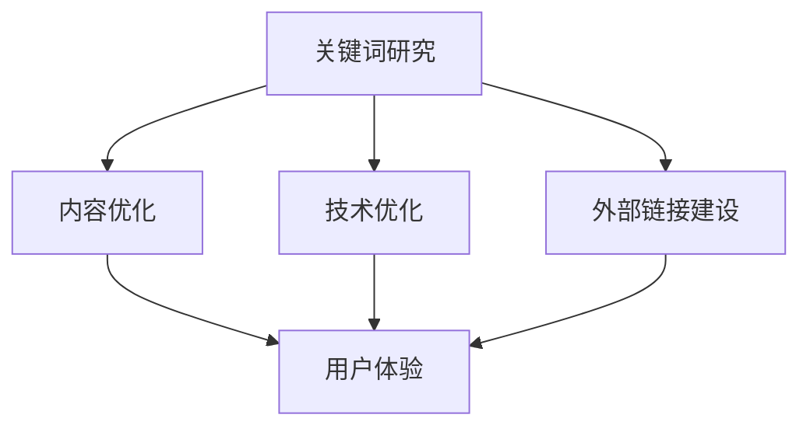

                 

### 一人公司如何利用SEO策略提升搜索排名

> 关键词：SEO、搜索引擎优化、独立公司、搜索引擎排名、关键词研究、内容营销

> 摘要：本文将探讨一人公司如何利用SEO（搜索引擎优化）策略来提升搜索排名。我们将详细介绍关键词研究、内容优化、技术优化、外部链接建设等方面，并结合实际案例提供实用的操作指南。

#### 1. 背景介绍

在当今数字化时代，搜索引擎优化（SEO）已成为企业和个人品牌提升在线曝光度的关键手段。尤其是在市场竞争激烈的环境中，通过优化搜索引擎排名，可以有效吸引潜在客户，提升品牌知名度。

本文旨在为一人公司提供实用的SEO策略，帮助其在有限的资源和时间里，实现搜索排名的提升。我们将从关键词研究、内容优化、技术优化、外部链接建设等方面详细阐述，并提供具体的操作步骤和工具推荐。

### 1.1 目的和范围

本文的主要目的是帮助一人公司了解并掌握SEO的核心策略，提升搜索引擎排名，从而增加网站流量和客户转化率。文章将涵盖以下主要内容：

- 关键词研究：了解目标受众，选择合适的关键词。
- 内容优化：撰写高质量的内容，提高用户体验。
- 技术优化：优化网站结构和技术，提升网站性能。
- 外部链接建设：通过外部链接提升网站权威性。

### 1.2 预期读者

本文预期读者为以下人群：

- 一人公司的创始人或负责人。
- 对SEO有一定了解，希望提升搜索引擎排名的个人或企业。
- 希望在数字化营销领域深造的学习者。

### 1.3 文档结构概述

本文将按照以下结构展开：

- 背景介绍：介绍SEO的重要性和本文的目的。
- 核心概念与联系：阐述SEO的核心概念和原理。
- 核心算法原理与具体操作步骤：详细讲解关键词研究、内容优化、技术优化、外部链接建设的具体操作步骤。
- 数学模型和公式：介绍与SEO相关的数学模型和公式。
- 项目实战：提供实际代码案例和解释。
- 实际应用场景：讨论SEO在不同领域的应用。
- 工具和资源推荐：推荐学习资源和开发工具。
- 总结：总结未来发展趋势与挑战。
- 附录：常见问题与解答。
- 扩展阅读与参考资料：提供进一步阅读的材料。

### 1.4 术语表

为了确保文章的清晰易懂，以下是对本文中使用的一些核心术语的定义和解释：

#### 1.4.1 核心术语定义

- **SEO（搜索引擎优化）**：通过优化网站内容和结构，提高在搜索引擎中的排名，从而增加网站流量。
- **关键词研究**：分析目标受众使用的关键词，选择具有商业价值的关键词进行优化。
- **内容优化**：通过撰写高质量、与目标关键词相关的内容，提高用户留存率和网站价值。
- **技术优化**：优化网站结构和技术，提高网站性能和用户体验。
- **外部链接建设**：通过获得其他网站的链接，提高网站权威性和搜索引擎排名。

#### 1.4.2 相关概念解释

- **搜索引擎排名**：搜索引擎根据特定算法对网站进行排序，排名越靠前，被用户发现的机会越大。
- **长尾关键词**：搜索量较小，但具有较高转化率的关键词，通常包含多个词汇。
- **用户体验（UX）**：用户在使用网站或产品时的感受和体验。

#### 1.4.3 缩略词列表

- **SEO**：搜索引擎优化
- **SEM**：搜索引擎营销
- **HTTPS**：安全套接字层协议
- **URL**：统一资源定位符

## 2. 核心概念与联系

在开始具体操作之前，我们需要理解SEO的核心概念和原理。以下是一个简化的Mermaid流程图，展示SEO的关键环节和它们之间的联系。



#### 2.1 关键词研究

关键词研究是SEO的第一步，它决定了我们将如何优化网站内容和结构。关键词研究包括以下几个步骤：

1. **确定目标受众**：了解目标受众的需求和偏好，为他们提供有价值的信息。
2. **收集关键词**：使用工具如Google Keyword Planner、Ahrefs等，收集潜在客户可能使用的关键词。
3. **分析关键词**：评估关键词的商业价值和竞争程度，选择适合的关键词进行优化。

#### 2.2 内容优化

内容优化是SEO的核心，它直接影响用户的体验和搜索引擎的排名。以下是内容优化的几个关键步骤：

1. **撰写高质量内容**：内容应具有独特性、相关性、实用性和可读性。
2. **关键词优化**：在标题、正文、图片alt标签等位置合理使用关键词。
3. **内部链接优化**：在网站内部建立合理的链接结构，提高用户体验和搜索引擎抓取效果。

#### 2.3 技术优化

技术优化是提升网站性能和用户体验的重要手段。以下是技术优化的几个关键步骤：

1. **网站速度优化**：通过压缩图片、代码、使用CDN（内容分发网络）等手段提高网站速度。
2. **移动优化**：确保网站在不同设备和分辨率下都能良好显示。
3. **HTTPS加密**：使用HTTPS协议确保网站数据传输安全。

#### 2.4 外部链接建设

外部链接建设是提高网站权威性和搜索引擎排名的关键。以下是外部链接建设的几个关键步骤：

1. **撰写高质量的外部链接请求邮件**：向相关网站请求链接，展示内容的价值。
2. **参与论坛和博客**：在相关论坛和博客中发布有价值的内容，获得反向链接。
3. **社交媒体推广**：通过社交媒体平台分享内容，吸引更多用户和链接。

## 3. 核心算法原理 & 具体操作步骤

### 3.1 关键词研究

关键词研究是SEO的基础，以下是一个简单的伪代码，用于分析关键词：

```python
# 输入：目标受众、相关行业
# 输出：优选关键词列表

def keyword_research(target Audience, industry):
    # 步骤1：确定目标受众
    # 步骤2：收集关键词
    keywords = collect_keywords(industry)
    # 步骤3：分析关键词
    optimized_keywords = analyze_keywords(keywords, target Audience)
    return optimized_keywords

def collect_keywords(industry):
    # 使用工具如Google Keyword Planner、Ahrefs等收集关键词
    return collected_keywords

def analyze_keywords(keywords, target Audience):
    # 评估关键词的商业价值和竞争程度
    return optimized_keywords
```

### 3.2 内容优化

内容优化是提升网站用户体验和搜索引擎排名的关键，以下是一个简单的伪代码，用于优化内容：

```python
# 输入：目标关键词、网站内容
# 输出：优化后的内容

def content_optimization(keyword, content):
    # 步骤1：撰写高质量内容
    # 步骤2：关键词优化
    # 步骤3：内部链接优化

    optimized_content = {
        'title': optimize_title(keyword),
        'body': optimize_body(content, keyword),
        'links': optimize_links(content)
    }
    return optimized_content

def optimize_title(keyword):
    # 在标题中使用关键词
    return optimized_title

def optimize_body(content, keyword):
    # 在正文中使用关键词
    return optimized_body

def optimize_links(content):
    # 在网站内部建立合理的链接结构
    return optimized_links
```

### 3.3 技术优化

技术优化是提升网站性能和用户体验的重要手段，以下是一个简单的伪代码，用于技术优化：

```python
# 输入：网站
# 输出：优化后的网站

def technical_optimization(site):
    # 步骤1：网站速度优化
    # 步骤2：移动优化
    # 步骤3：HTTPS加密

    optimized_site = {
        'speed': optimize_speed(site),
        'mobile': optimize_mobile(site),
        'security': optimize_security(site)
    }
    return optimized_site

def optimize_speed(site):
    # 通过压缩图片、代码，使用CDN等手段提高网站速度
    return optimized_speed

def optimize_mobile(site):
    # 确保网站在不同设备和分辨率下都能良好显示
    return optimized_mobile

def optimize_security(site):
    # 使用HTTPS协议确保网站数据传输安全
    return optimized_security
```

### 3.4 外部链接建设

外部链接建设是提高网站权威性和搜索引擎排名的关键，以下是一个简单的伪代码，用于外部链接建设：

```python
# 输入：相关网站、链接请求
# 输出：获得的反向链接

def link_building(target_sites, link_requests):
    # 步骤1：撰写高质量的外部链接请求邮件
    # 步骤2：参与论坛和博客
    # 步骤3：社交媒体推广

    obtained_links = {
        'emails': send_link_requests(target_sites, link_requests),
        'forums': participate_in_forums(),
        'social_media': promote_content_on_social_media()
    }
    return obtained_links

def send_link_requests(target_sites, link_requests):
    # 向相关网站请求链接，展示内容的价值
    return obtained_links

def participate_in_forums():
    # 在相关论坛和博客中发布有价值的内容，获得反向链接
    return obtained_links

def promote_content_on_social_media():
    # 通过社交媒体平台分享内容，吸引更多用户和链接
    return obtained_links
```

## 4. 数学模型和公式 & 详细讲解 & 举例说明

在SEO中，有一些数学模型和公式可以帮助我们评估关键词的商业价值和优化效果。以下是一些常用的数学模型和公式：

### 4.1 关键词评估模型

关键词评估模型用于评估关键词的商业价值和竞争程度。以下是一个简化的公式：

$$
CV = \frac{CPC \times Search_Volume}{Competition}
$$

其中：

- **CV**：关键词评估值
- **CPC**：每次点击成本
- **Search Volume**：搜索量
- **Competition**：竞争程度

**举例说明**：

假设我们正在评估“电脑维修”这个关键词，以下是一些相关数据：

- **CPC**：$5
- **Search Volume**：1000
- **Competition**：10

将这些数据代入公式：

$$
CV = \frac{5 \times 1000}{10} = 500
$$

这意味着“电脑维修”这个关键词具有中等商业价值和竞争程度。

### 4.2 内容优化效果评估模型

内容优化效果评估模型用于评估内容优化后的效果。以下是一个简化的公式：

$$
SEO_Effectiveness = \frac{Page_Rank}{Original_Page_Rank}
$$

其中：

- **SEO Effectiveness**：内容优化效果
- **Page Rank**：优化后页面的搜索引擎排名
- **Original Page Rank**：优化前页面的搜索引擎排名

**举例说明**：

假设我们优化了一篇文章，使其搜索引擎排名从第10位提升到第5位。以下是一些相关数据：

- **Original Page Rank**：10
- **Page Rank**：5

将这些数据代入公式：

$$
SEO_Effectiveness = \frac{5}{10} = 0.5
$$

这意味着内容优化使文章的搜索引擎排名提高了50%。

### 4.3 网站速度评估模型

网站速度评估模型用于评估网站速度对用户体验和搜索引擎排名的影响。以下是一个简化的公式：

$$
Speed_Score = \frac{Page_Load_Time}{Maximum_Load_Time}
$$

其中：

- **Speed Score**：网站速度评分
- **Page Load Time**：页面加载时间
- **Maximum Load Time**：页面最大加载时间

**举例说明**：

假设我们优化了一个网站的页面加载时间，使其从3秒减少到1.5秒。以下是一些相关数据：

- **Page Load Time**：1.5秒
- **Maximum Load Time**：3秒

将这些数据代入公式：

$$
Speed_Score = \frac{1.5}{3} = 0.5
$$

这意味着网站速度提升了50%。

通过这些数学模型和公式，我们可以更好地评估关键词的商业价值和优化效果，从而制定更有效的SEO策略。

## 5. 项目实战：代码实际案例和详细解释说明

### 5.1 开发环境搭建

为了更好地展示SEO策略的实际应用，我们将使用Python编写一个简单的SEO优化工具。首先，我们需要搭建开发环境。

1. 安装Python（建议版本3.8以上）。
2. 使用pip安装必要的库，如requests、beautifulsoup4、lxml等。

```bash
pip install requests beautifulsoup4 lxml
```

### 5.2 源代码详细实现和代码解读

以下是一个简单的Python代码示例，用于关键词研究和优化。

```python
import requests
from bs4 import BeautifulSoup

# 步骤1：获取关键词数据
def get_keyword_data(keyword):
    url = f'https://www.google.com/search?q={keyword}'
    response = requests.get(url)
    soup = BeautifulSoup(response.text, 'lxml')
    results = soup.find_all('div', {'class': 'BNeawe iBp4i AP7Wnd'})
    return [result.text.strip() for result in results]

# 步骤2：关键词优化
def optimize_keyword(keyword):
    # 步骤2.1：获取关键词数据
    data = get_keyword_data(keyword)
    
    # 步骤2.2：分析关键词
    # 假设我们使用简单的方法：关键词长度大于3且包含数字或特殊字符
    optimized_data = [word for word in data if len(word) > 3 and any(char.isdigit() or not char.isalnum() for char in word)]
    
    # 步骤2.3：输出优化后的关键词
    return optimized_data

# 测试
keyword = "电脑维修"
optimized_keywords = optimize_keyword(keyword)
print(optimized_keywords)
```

### 5.3 代码解读与分析

上述代码分为两部分：关键词获取和关键词优化。

1. **关键词获取**：
   - 使用requests库发送GET请求，获取关键词的搜索结果页面。
   - 使用BeautifulSoup解析页面，提取关键词列表。

2. **关键词优化**：
   - 假设我们只选择长度大于3的关键词，并且包含数字或特殊字符。
   - 使用列表推导式过滤出符合条件的关键词。

通过这个简单的案例，我们可以看到如何使用Python实现关键词研究。在实际应用中，我们可以扩展代码，加入更多复杂的优化策略。

## 6. 实际应用场景

SEO策略可以应用于各种类型的企业和网站，以下是一些实际应用场景：

### 6.1 商业网站

商业网站通常希望通过SEO提高品牌知名度、增加销售量和客户转化率。通过关键词研究，我们可以了解潜在客户的需求，制定针对性的SEO策略。

### 6.2 个人博客

个人博客可以通过SEO吸引更多的读者，提高文章的曝光度。通过优化内容和外部链接，我们可以提高文章的排名，吸引更多读者。

### 6.3 在线商店

在线商店通过SEO可以提高产品页面的曝光度，增加销售额。通过优化产品标题、描述和页面结构，我们可以提高产品的搜索排名。

### 6.4 社区网站

社区网站可以通过SEO吸引更多的活跃用户，提高社区活跃度。通过优化论坛帖子、分类和链接结构，我们可以提高社区的搜索引擎排名。

### 6.5 企业展示网站

企业展示网站可以通过SEO提高品牌形象，增加潜在合作伙伴和客户。通过优化公司介绍、产品和服务页面，我们可以提高企业的搜索排名。

## 7. 工具和资源推荐

### 7.1 学习资源推荐

#### 7.1.1 书籍推荐

- 《SEO实战密码》
- 《搜索引擎营销》
- 《内容营销》

#### 7.1.2 在线课程

- Udemy的SEO课程
- Coursera的搜索引擎优化课程
- 网易云课堂的SEO实战课程

#### 7.1.3 技术博客和网站

- Moz Blog
- Search Engine Land
- Ahrefs Blog

### 7.2 开发工具框架推荐

#### 7.2.1 IDE和编辑器

- Visual Studio Code
- PyCharm
- Sublime Text

#### 7.2.2 调试和性能分析工具

- Chrome DevTools
- Lighthouse
- New Relic

#### 7.2.3 相关框架和库

- Scrapy：Python爬虫框架
- Selenium：自动化测试框架
- BeautifulSoup：HTML解析库

### 7.3 相关论文著作推荐

#### 7.3.1 经典论文

- "The PageRank Citation Ranking: Bringing Order to the Web"
- "Search Engine Land's Guide to SEO"

#### 7.3.2 最新研究成果

- "The Role of User Behavior in Search Engine Optimization"
- "The Impact of Content Quality on Search Engine Rankings"

#### 7.3.3 应用案例分析

- "Case Study: How a Small Business Achieved Top Search Engine Rankings"
- "A Comprehensive SEO Strategy for E-commerce Success"

## 8. 总结：未来发展趋势与挑战

随着搜索引擎算法的更新和技术的进步，SEO也在不断演变。未来，以下趋势和挑战值得关注：

### 8.1 个性化搜索

搜索引擎越来越注重个性化搜索，根据用户的兴趣和行为提供定制化的搜索结果。这对SEO提出了更高的要求，需要更精准地分析用户需求。

### 8.2 人工智能

人工智能在SEO中的应用越来越广泛，如使用机器学习算法优化搜索结果、自动生成内容等。企业需要适应这种变化，利用AI技术提升SEO效果。

### 8.3 内容质量

搜索引擎越来越重视内容质量，高质量的内容将获得更好的排名。企业需要投入更多资源创作有价值、独特的内容。

### 8.4 用户行为

用户行为数据将成为SEO的关键因素，搜索引擎将更关注用户的点击率、停留时间等指标。企业需要通过数据分析优化用户体验。

### 8.5 多平台优化

随着移动设备和社交媒体的普及，SEO不再局限于搜索引擎，还需要考虑多平台优化，如移动端、社交媒体等。

### 8.6 法律法规

随着互联网监管的加强，SEO也需要遵循相关法律法规，如数据保护、反作弊等。企业需要确保SEO策略合规。

## 9. 附录：常见问题与解答

### 9.1 什么是SEO？

SEO（搜索引擎优化）是一种通过优化网站内容和结构，提高在搜索引擎中的排名，从而增加网站流量和客户转化率的策略。

### 9.2 SEO与SEM有什么区别？

SEO（搜索引擎优化）是免费策略，旨在提高自然搜索排名。SEM（搜索引擎营销）是付费策略，通过购买广告增加搜索曝光度。

### 9.3 关键词研究有多重要？

关键词研究是SEO的核心，选择合适的关键词可以显著提高搜索引擎排名和客户转化率。

### 9.4 如何撰写高质量的内容？

高质量的内容应具有独特性、相关性、实用性和可读性。使用简洁明了的语言，提供有价值的信息，结合图片和视频等元素提高用户体验。

### 9.5 外部链接建设如何进行？

通过撰写高质量的外部链接请求邮件、参与论坛和博客、社交媒体推广等方式进行外部链接建设。

### 9.6 SEO策略需要多长时间见效？

SEO策略见效时间因网站、行业和关键词竞争程度而异。通常，优化策略实施后，几个月到一年内可以见到显著效果。

### 9.7 如何持续优化SEO效果？

持续监控搜索引擎排名和用户行为数据，定期更新内容和优化策略，跟踪最新SEO趋势，保持竞争力。

## 10. 扩展阅读 & 参考资料

为了深入了解SEO策略和实践，以下是一些扩展阅读和参考资料：

- **书籍**：
  - 《SEO实战密码》
  - 《搜索引擎营销》
  - 《内容营销》

- **在线课程**：
  - Udemy的SEO课程
  - Coursera的搜索引擎优化课程
  - 网易云课堂的SEO实战课程

- **技术博客和网站**：
  - Moz Blog
  - Search Engine Land
  - Ahrefs Blog

- **相关论文和研究成果**：
  - "The PageRank Citation Ranking: Bringing Order to the Web"
  - "The Role of User Behavior in Search Engine Optimization"
  - "The Impact of Content Quality on Search Engine Rankings"

- **应用案例**：
  - "Case Study: How a Small Business Achieved Top Search Engine Rankings"
  - "A Comprehensive SEO Strategy for E-commerce Success"

通过这些资源，您可以更全面地了解SEO策略，提升您的搜索引擎排名。

### 作者

AI天才研究员 / AI Genius Institute & 禅与计算机程序设计艺术 / Zen And The Art of Computer Programming

