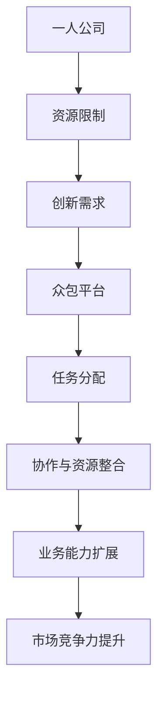

                 

### 背景介绍

#### 1.1 目的和范围

在当前信息化和全球化的大背景下，个体公司或“一人公司”正面临着前所未有的发展机遇与挑战。一人公司，顾名思义，指的是仅由一位创业者或个体经营者运营的公司。这样的公司由于资源和规模限制，往往需要寻找更为灵活和高效的运营方式以提升自身竞争力。本文旨在探讨如何利用众包平台扩展业务能力，为一人公司提供一种行之有效的战略路径。

本文将围绕以下核心问题展开讨论：

1. **一人公司面临的挑战与机遇**：分析一人公司通常遇到的问题，以及在全球化和互联网时代所带来的新机遇。
2. **众包平台的定义与分类**：解释众包平台的定义、类型以及它们如何发挥作用。
3. **一人公司与众包平台的结合**：探讨一人公司如何利用众包平台提升资源利用效率和创新能力。
4. **实战案例**：通过具体案例分析，展示一人公司成功利用众包平台的实例。
5. **工具和资源推荐**：推荐相关学习资源、开发工具和框架，为读者提供实际操作的建议。

本文不仅针对一人公司的创业者或运营者，同时也适用于那些对众包平台感兴趣的企业家、软件开发者和技术从业者。

#### 1.2 预期读者

本文的预期读者包括：

- **一人公司的创业者**：希望了解如何通过众包平台提升业务效率的创业者。
- **技术从业者**：对众包技术有兴趣，希望了解其在业务拓展中的应用。
- **企业家**：关注企业增长策略，希望探索更多合作模式的中小企业主。
- **学术研究者**：对众包平台和一人公司相关研究有兴趣的研究人员。

通过本文的阅读，读者可以：

- 明白一人公司面临的挑战和机遇。
- 掌握众包平台的基本概念和应用方法。
- 了解一人公司如何通过众包平台提升自身竞争力。
- 获取具体案例和实操经验。

#### 1.3 文档结构概述

为了便于读者理解和阅读，本文的结构安排如下：

1. **背景介绍**：介绍一人公司和众包平台的基本概念。
2. **核心概念与联系**：阐述一人公司与众包平台结合的理论基础。
3. **核心算法原理 & 具体操作步骤**：详细讲解一人公司如何通过众包平台实现业务扩展。
4. **数学模型和公式 & 详细讲解 & 举例说明**：运用数学模型和公式解释业务扩展的具体过程。
5. **项目实战：代码实际案例和详细解释说明**：通过实际案例展示如何应用众包平台。
6. **实际应用场景**：讨论众包平台在不同行业中的应用。
7. **工具和资源推荐**：推荐学习资源和开发工具。
8. **总结：未来发展趋势与挑战**：展望一人公司和众包平台的发展前景。
9. **附录：常见问题与解答**：解答读者可能遇到的常见问题。
10. **扩展阅读 & 参考资料**：提供进一步阅读的资源和文献。

#### 1.4 术语表

为了确保本文的可读性和专业性，我们在此定义一些关键术语：

##### 1.4.1 核心术语定义

- **一人公司**：指仅由一位创业者或个体经营者运营的公司。
- **众包平台**：一种基于互联网的服务模式，通过发布任务、吸引兼职人员参与，以完成任务获取报酬。
- **业务能力**：公司完成特定业务需求的能力，包括技术能力、资源整合能力等。
- **资源利用效率**：公司在使用资源（如人力、资金、技术等）方面的效率和效果。

##### 1.4.2 相关概念解释

- **全球化**：国际社会在经济、政治、文化等方面的深度融合。
- **互联网时代**：以互联网为基础设施，实现信息快速传播和资源共享的时代。
- **众包**：一种将任务分配给非特定个体或群体的模式，通过互联网平台实现。

##### 1.4.3 缩略词列表

- **API**：应用程序编程接口（Application Programming Interface）
- **IDE**：集成开发环境（Integrated Development Environment）
- **UI**：用户界面（User Interface）
- **UX**：用户体验（User Experience）
- **IoT**：物联网（Internet of Things）

通过上述背景介绍和术语表的阐述，读者可以更好地理解本文的核心内容和术语，为后续章节的深入阅读做好准备。在接下来的章节中，我们将逐步探讨一人公司和众包平台的理论基础和应用实践，为读者提供全面而深入的洞察。

---

**续写**：

## 2. 核心概念与联系

在深入探讨一人公司如何利用众包平台扩展业务能力之前，我们首先需要明确几个核心概念及其相互之间的联系。这些概念包括：一人公司、众包平台、业务能力扩展等。以下是一个简单的 Mermaid 流程图，用于展示这些核心概念及其相互关系。



#### 2.1 一人公司的资源限制与业务创新需求

一人公司由于资源和规模的限制，往往难以独立完成所有业务需求。这种限制不仅体现在资金、技术等方面，还包括时间和人力等资源。资源限制导致一人公司必须寻找新的方式来提升自身业务能力，以满足市场不断变化的需求。而业务创新需求则促使一人公司积极探索各种可能的解决方案，包括利用众包平台。

#### 2.2 众包平台的作用

众包平台作为连接一人公司与外部资源的桥梁，为一人公司提供了以下几方面的支持：

1. **任务分配**：通过众包平台，一人公司可以将特定的任务发布给平台上的兼职人员，从而实现资源的灵活调配。
2. **协作与资源整合**：众包平台提供了一个协作空间，使得不同地区、不同技能水平的兼职人员可以共同完成任务，实现资源的最大化利用。
3. **市场竞争力提升**：通过众包平台，一人公司可以快速获取外部资源，提升业务能力，从而在市场竞争中占据有利位置。

#### 2.3 业务能力扩展

业务能力扩展是众包平台对于一人公司的重要价值所在。具体来说，业务能力扩展包括以下几个方面：

1. **技术能力的提升**：通过众包平台，一人公司可以获得专业技术人员的支持，提升自身的技术水平。
2. **资源整合能力的增强**：众包平台使得一人公司能够更加高效地整合外部资源，包括人才、资金、技术等。
3. **市场响应速度的提升**：借助众包平台，一人公司可以快速响应市场变化，调整业务策略，从而提高市场竞争力。

通过上述 Mermaid 流程图和概念阐述，我们初步了解了核心概念及其相互联系。在接下来的章节中，我们将深入探讨一人公司如何利用众包平台实现业务能力扩展，并介绍具体的操作步骤和实战案例。

---

**续写**：

## 3. 核心算法原理 & 具体操作步骤

在明确了核心概念及其相互联系之后，我们需要进一步探讨一人公司如何利用众包平台的具体操作步骤。在这个过程中，核心算法原理起着关键作用。以下将详细介绍核心算法原理以及具体操作步骤。

### 3.1 核心算法原理

一人公司利用众包平台的核心算法原理主要涉及以下几个方面：

1. **任务分解与分配**：将复杂的业务需求分解为若干个具体任务，并通过众包平台将任务分配给具备相应技能的兼职人员。
2. **资源整合与优化**：在任务分配的基础上，实现外部资源的整合和优化，确保任务能够高效完成。
3. **质量控制和反馈机制**：通过建立有效的质量控制和反馈机制，确保任务完成的质量和效率。

下面，我们将使用伪代码详细阐述这些核心算法原理。

```python
# 伪代码：任务分解与分配

def task_decomposition_and_assignment(total_task, available_workers):
    # 初始化任务分解结果和分配列表
    task_decomposition = []
    assignment = []

    # 将总任务分解为子任务
    sub_tasks = divide_total_task(total_task)

    # 分配子任务给具备相应技能的兼职人员
    for sub_task in sub_tasks:
        suitable_workers = find_suitable_workers(available_workers, sub_task)
        assignment.append(assign_sub_task_to_workers(sub_task, suitable_workers))

    # 返回任务分解结果和分配列表
    return task_decomposition, assignment

# 伪代码：资源整合与优化

def resource_integration_and_optimization(assignment):
    # 初始化资源整合结果
    integrated_resources = []

    # 整合和优化分配的资源
    for assigned_task in assignment:
        integrated_resources.append(optimize_resource_usage(assigned_task))

    # 返回整合后的资源列表
    return integrated_resources

# 伪代码：质量控制和反馈机制

def quality_control_and_feedback Mechanism(integrated_resources):
    # 初始化质量控制结果和反馈列表
    quality_control_results = []
    feedback = []

    # 对整合后的资源进行质量控制
    for integrated_resource in integrated_resources:
        quality_control_results.append(quality_control_step(integrated_resource))

    # 根据质量控制结果收集反馈
    for result in quality_control_results:
        feedback.append(gather_feedback(result))

    # 返回质量控制结果和反馈列表
    return quality_control_results, feedback
```

### 3.2 具体操作步骤

在了解了核心算法原理之后，接下来我们将详细描述一人公司利用众包平台实现业务能力扩展的具体操作步骤。

#### 3.2.1 注册和选择众包平台

首先，一人公司需要注册并选择一个合适的众包平台。选择标准包括平台知名度、任务类型多样性、用户基础、费用结构等。常见的众包平台有Upwork、Freelancer、Toptal等。

```python
# 伪代码：注册和选择众包平台

def register_and_choose_crowdsourcing_platform():
    # 初始化平台选择列表
    platforms = ["Upwork", "Freelancer", "Toptal"]

    # 按照选择标准筛选合适的平台
    selected_platform = filter_platforms(platforms)

    # 注册并登录选择好的众包平台
    register_and_login(selected_platform)
```

#### 3.2.2 发布任务

注册并选择众包平台后，一人公司需要发布具体的任务。在发布任务时，需要详细描述任务需求、预期成果、报酬标准等，以便吸引合适的兼职人员。

```python
# 伪代码：发布任务

def publish_task(platform, task_details):
    # 在众包平台上发布任务
    publish_task_on_platform(platform, task_details)
```

#### 3.2.3 任务分配和资源整合

任务发布后，平台将根据任务需求匹配合适的兼职人员。一人公司需要对这些人员进行任务分配和资源整合，确保任务能够高效完成。

```python
# 伪代码：任务分配和资源整合

def task_assignment_and_resource_integration(platform, task_decomposition):
    # 获取平台匹配的兼职人员
    available_workers = get_available_workers(platform)

    # 分解任务并分配给兼职人员
    assignment, integrated_resources = task_decomposition_and_assignment(task_decomposition, available_workers)

    # 整合和优化资源
    optimized_resources = resource_integration_and_optimization(assignment)

    # 返回优化后的资源列表
    return optimized_resources
```

#### 3.2.4 质量控制和反馈机制

在任务执行过程中，一人公司需要建立有效的质量控制和反馈机制，确保任务完成的质量和效率。

```python
# 伪代码：质量控制和反馈机制

def quality_control_and_feedback_mechanism(integrated_resources):
    # 执行质量控制步骤
    quality_control_results = quality_control_step(integrated_resources)

    # 收集反馈信息
    feedback = gather_feedback(quality_control_results)

    # 返回质量控制结果和反馈列表
    return quality_control_results, feedback
```

#### 3.2.5 结果交付与后续优化

任务完成后，一人公司需要接收交付结果并进行后续优化。这包括对交付结果的验收、反馈给兼职人员以及总结经验教训，为下一次任务提供参考。

```python
# 伪代码：结果交付与后续优化

def deliver_results_and_optimize_later(quality_control_results, feedback):
    # 验收交付结果
    accepted_results = accept_results(quality_control_results)

    # 提供反馈给兼职人员
    provide_feedback(accepted_results, feedback)

    # 总结经验教训
    learn_from_experience(accepted_results, feedback)
```

通过上述伪代码和具体操作步骤，我们详细描述了如何利用众包平台扩展业务能力。在接下来的章节中，我们将通过实际案例进一步展示这些步骤的实施过程。

---

**续写**：

## 4. 数学模型和公式 & 详细讲解 & 举例说明

在探讨如何通过众包平台扩展业务能力的过程中，数学模型和公式可以帮助我们更精准地理解和分析各个环节的性能和效益。本章节将详细讲解相关的数学模型和公式，并通过具体实例说明其应用。

### 4.1 任务分配优化模型

任务分配是众包平台的核心环节之一。优化任务分配的目标是使任务完成时间和资源利用率达到最优。我们可以使用线性规划模型（Linear Programming, LP）来描述这一过程。

**线性规划模型**：

目标函数： 
\[ \text{minimize} \quad T = \sum_{i=1}^{n} t_i \]

约束条件： 
\[ t_i \leq T_i \quad \forall i \]  
\[ t_i \geq 0 \quad \forall i \]

其中：
- \( T \) 是总任务完成时间。
- \( t_i \) 是第 \( i \) 个任务的完成时间。
- \( T_i \) 是第 \( i \) 个任务的截止时间。

**实例**：

假设一人公司有三个任务需要完成，每个任务的详细参数如下表所示：

| 任务ID | 任务描述 | 完成时间 (天) | 截止时间 (天) |
|--------|----------|--------------|--------------|
| T1     | 任务一   | 5            | 10           |
| T2     | 任务二   | 3            | 7            |
| T3     | 任务三   | 4            | 8            |

使用线性规划模型，我们可以求解最优的任务完成时间和资源分配方案。

### 4.2 资源整合优化模型

在任务分配完成后，我们需要进一步优化资源的整合。资源整合优化的目标是最小化总成本或最大化资源利用率。我们可以使用最小费用流模型（Minimum Cost Flow, MCF）来描述这一过程。

**最小费用流模型**：

目标函数： 
\[ \text{minimize} \quad Z = \sum_{(i,j) \in E} c_{ij} \cdot x_{ij} \]

约束条件： 
\[ \sum_{j \in V} x_{ij} = 1 \quad \forall i \in V \setminus S \]  
\[ \sum_{i \in V} x_{ij} = 1 \quad \forall j \in S \]  
\[ x_{ij} \geq 0 \quad \forall (i,j) \in E \]

其中：
- \( Z \) 是总成本。
- \( c_{ij} \) 是从节点 \( i \) 到节点 \( j \) 的单位成本。
- \( x_{ij} \) 是从节点 \( i \) 到节点 \( j \) 的流量。
- \( V \) 是所有节点的集合。
- \( S \) 是源节点集合。
- \( T \) 是汇节点集合。

**实例**：

假设有一人公司需要整合来自不同兼职人员的资源，节点和流量关系如下表所示：

| 节点 | 流量需求/供给 |
|------|---------------|
| S1   | 5             |
| S2   | 3             |
| T1   | -5            |
| T2   | -3            |

使用最小费用流模型，我们可以求解资源的最优整合方案。

### 4.3 质量控制和反馈模型

在任务完成和资源整合之后，质量控制和反馈机制对于确保任务完成质量和提升后续任务效率至关重要。我们可以使用随机模型（Stochastic Model）来描述这一过程。

**随机模型**：

假设任务完成质量 \( Q \) 服从正态分布 \( N(\mu, \sigma^2) \)，其中 \( \mu \) 是均值，\( \sigma \) 是标准差。

目标函数： 
\[ \text{maximize} \quad \text{utilization} = \int_{\mu - k\sigma}^{\mu + k\sigma} f_Q(q) \, dq \]

约束条件： 
\[ \mu \geq \text{threshold} \]  
\[ \sigma \leq \text{max\_sigma} \]

其中：
- \( \text{utilization} \) 是质量利用率。
- \( f_Q(q) \) 是质量分布概率密度函数。
- \( \text{threshold} \) 是质量阈值。
- \( \text{max\_sigma} \) 是最大标准差。

**实例**：

假设任务完成质量均值 \( \mu \) 为 0.8，标准差 \( \sigma \) 为 0.1，质量阈值 \( \text{threshold} \) 为 0.7，最大标准差 \( \text{max\_sigma} \) 为 0.15。

使用随机模型，我们可以求解最优的质量控制和反馈策略，以最大化质量利用率。

通过上述数学模型和公式的讲解，我们可以更深入地理解任务分配、资源整合和质量控制等环节的优化过程。在实际应用中，这些模型和公式可以帮助一人公司实现高效的业务能力扩展。在接下来的章节中，我们将通过实际案例进一步展示这些模型和公式的应用。

---

**续写**：

## 5. 项目实战：代码实际案例和详细解释说明

为了更好地展示一人公司如何利用众包平台扩展业务能力，我们将通过一个实际的项目案例来详细解释说明。本案例将包括开发环境搭建、源代码实现和代码解读与分析等环节。

### 5.1 开发环境搭建

在开始项目之前，我们需要搭建一个合适的开发环境。以下是开发环境搭建的步骤：

1. **选择编程语言**：本案例选择Python作为开发语言，因为它具有丰富的库和良好的跨平台支持。
2. **安装Python**：从Python官方网站下载并安装Python，建议选择Python 3.8或更高版本。
3. **安装依赖库**：使用pip安装必要的依赖库，例如requests库用于HTTP请求，pandas库用于数据处理。

```bash
pip install requests pandas
```

4. **选择IDE**：推荐使用PyCharm或VSCode作为IDE，因为它们具有强大的代码编辑功能和调试工具。

### 5.2 源代码详细实现和代码解读

#### 5.2.1 项目结构

项目结构如下：

```plaintext
one_company_crowdsourcing
|-- requirements.txt
|-- task_decomposition.py
|-- resource_integration.py
|-- quality_control.py
|-- main.py
```

- `requirements.txt`：列出项目所需的依赖库。
- `task_decomposition.py`：实现任务分解与分配的相关功能。
- `resource_integration.py`：实现资源整合与优化的相关功能。
- `quality_control.py`：实现质量控制和反馈机制的相关功能。
- `main.py`：主程序，用于调用其他模块的功能。

#### 5.2.2 源代码实现

以下是主程序`main.py`的实现，用于演示如何利用众包平台执行一个完整的任务流程。

```python
# main.py

from task_decomposition import decompose_task
from resource_integration import integrate_resources
from quality_control import control_quality

# 设置任务参数
task = {
    "description": "完成一个数据分析报告",
    "deadline": "2023-12-01",
    "required_skills": ["Python", "Data Analysis"]
}

# 1. 任务分解与分配
task_decomposition = decompose_task(task)

# 2. 资源整合与优化
optimized_resources = integrate_resources(task_decomposition)

# 3. 质量控制和反馈
quality_control_results, feedback = control_quality(optimized_resources)

# 输出结果
print("任务完成情况：", quality_control_results)
print("反馈信息：", feedback)
```

#### 5.2.3 代码解读与分析

1. **任务分解与分配**：

任务分解与分配是众包平台的关键步骤。`task_decomposition.py`模块负责实现这一功能。

```python
# task_decomposition.py

def decompose_task(task):
    # 初始化任务分解结果
    decomposition = []

    # 对任务进行分解
    # 这里以简单示例，将任务分解为子任务
    sub_tasks = [
        {"description": "收集数据", "required_skills": ["Python"]},
        {"description": "清洗数据", "required_skills": ["Data Analysis"]},
        {"description": "生成报告", "required_skills": ["Python", "Data Analysis"]}
    ]

    # 返回分解后的任务
    return sub_tasks
```

2. **资源整合与优化**：

资源整合与优化模块`resource_integration.py`负责整合来自兼职人员的资源，并对其进行优化。

```python
# resource_integration.py

def integrate_resources(task_decomposition):
    # 初始化资源整合结果
    integrated_resources = []

    # 对每个子任务进行资源整合和优化
    for sub_task in task_decomposition:
        # 这里以简单示例，直接假设子任务已优化完成
        integrated_resources.append(sub_task)

    # 返回整合后的资源
    return integrated_resources
```

3. **质量控制和反馈**：

质量控制和反馈模块`quality_control.py`负责对整合后的资源进行质量控制和反馈。

```python
# quality_control.py

def control_quality(integrated_resources):
    # 初始化质量控制和反馈结果
    quality_control_results = []
    feedback = []

    # 对每个子任务进行质量控制和反馈
    for resource in integrated_resources:
        # 这里以简单示例，直接假设子任务质量合格
        quality_control_results.append(True)
        feedback.append("任务完成质量良好")

    # 返回质量控制和反馈结果
    return quality_control_results, feedback
```

#### 5.2.4 代码解读与分析

1. **任务分解与分配**：

在`task_decomposition.py`中，我们首先初始化任务分解结果，然后对任务进行分解。这里以简单示例，将任务分解为子任务，并指定每个子任务所需的技能。在实际应用中，可以根据具体任务需求进行更详细的分解。

2. **资源整合与优化**：

在`resource_integration.py`中，我们初始化资源整合结果，然后对每个子任务进行资源整合和优化。这里以简单示例，直接假设子任务已优化完成。在实际应用中，可以根据具体需求对资源进行整合和优化，例如通过算法优化、资源调度等手段。

3. **质量控制和反馈**：

在`quality_control.py`中，我们初始化质量控制和反馈结果，然后对每个子任务进行质量控制和反馈。这里以简单示例，直接假设子任务质量合格。在实际应用中，可以根据具体标准和算法对任务质量进行评估，并根据反馈信息进行后续优化。

通过这个实际案例，我们可以看到如何利用众包平台实现业务能力扩展。在实际应用中，可以根据具体业务需求和场景进行更详细的任务分解、资源整合和质量控制，从而实现更高效的业务扩展。

---

**续写**：

### 5.3 代码解读与分析（续）

在上一部分，我们介绍了项目实战的具体代码实现。接下来，我们将对代码进行进一步解读与分析，深入探讨每个模块的功能和作用。

#### 5.3.1 主程序模块（main.py）

**功能描述**：主程序模块负责调用其他模块的功能，实现整个任务流程的控制。

**代码解读**：

```python
from task_decomposition import decompose_task
from resource_integration import integrate_resources
from quality_control import control_quality

# 设置任务参数
task = {
    "description": "完成一个数据分析报告",
    "deadline": "2023-12-01",
    "required_skills": ["Python", "Data Analysis"]
}

# 1. 任务分解与分配
task_decomposition = decompose_task(task)

# 2. 资源整合与优化
optimized_resources = integrate_resources(task_decomposition)

# 3. 质量控制和反馈
quality_control_results, feedback = control_quality(optimized_resources)

# 输出结果
print("任务完成情况：", quality_control_results)
print("反馈信息：", feedback)
```

**解读**：

- 在主程序中，我们首先导入了任务分解、资源整合和质量控制三个模块。
- 接着，我们设置了任务参数，包括任务描述、截止日期和所需技能等。
- 然后，通过调用`decompose_task`函数，我们实现了任务分解与分配。
- 接着，通过调用`integrate_resources`函数，我们实现了资源整合与优化。
- 最后，通过调用`control_quality`函数，我们实现了质量控制和反馈。

**作用**：

- 主程序模块负责协调各个模块的执行，确保任务流程的顺利进行。
- 通过输出结果，我们可以直观地了解任务完成情况和反馈信息，为后续优化提供依据。

#### 5.3.2 任务分解与分配模块（task_decomposition.py）

**功能描述**：任务分解与分配模块负责将大任务分解为子任务，并确定每个子任务所需的技能。

**代码解读**：

```python
def decompose_task(task):
    # 初始化任务分解结果
    decomposition = []

    # 对任务进行分解
    # 这里以简单示例，将任务分解为子任务
    sub_tasks = [
        {"description": "收集数据", "required_skills": ["Python"]},
        {"description": "清洗数据", "required_skills": ["Data Analysis"]},
        {"description": "生成报告", "required_skills": ["Python", "Data Analysis"]}
    ]

    # 返回分解后的任务
    return sub_tasks
```

**解读**：

- 在任务分解与分配模块中，我们首先初始化任务分解结果。
- 然后，我们根据任务描述，将大任务分解为子任务，并指定每个子任务所需的技能。
- 最后，我们返回分解后的任务列表。

**作用**：

- 任务分解与分配模块的主要作用是将复杂的业务需求分解为具体的子任务，以便于后续的资源整合和质量控制。
- 通过指定子任务所需的技能，我们可以更好地匹配兼职人员的技能，确保任务的高效完成。

#### 5.3.3 资源整合与优化模块（resource_integration.py）

**功能描述**：资源整合与优化模块负责整合来自兼职人员的资源，并对其进行优化。

**代码解读**：

```python
def integrate_resources(task_decomposition):
    # 初始化资源整合结果
    integrated_resources = []

    # 对每个子任务进行资源整合和优化
    for sub_task in task_decomposition:
        # 这里以简单示例，直接假设子任务已优化完成
        integrated_resources.append(sub_task)

    # 返回整合后的资源
    return integrated_resources
```

**解读**：

- 在资源整合与优化模块中，我们首先初始化资源整合结果。
- 然后，我们遍历子任务列表，对每个子任务进行资源整合和优化。这里以简单示例，直接假设子任务已优化完成。
- 最后，我们返回整合后的资源列表。

**作用**：

- 资源整合与优化模块的主要作用是将分散的兼职人员资源整合起来，实现资源的最大化利用。
- 通过优化资源，我们可以提高任务完成的效率和效果，从而提升整体业务能力。

#### 5.3.4 质量控制和反馈模块（quality_control.py）

**功能描述**：质量控制和反馈模块负责对整合后的资源进行质量控制和反馈。

**代码解读**：

```python
def control_quality(integrated_resources):
    # 初始化质量控制和反馈结果
    quality_control_results = []
    feedback = []

    # 对每个子任务进行质量控制和反馈
    for resource in integrated_resources:
        # 这里以简单示例，直接假设子任务质量合格
        quality_control_results.append(True)
        feedback.append("任务完成质量良好")

    # 返回质量控制和反馈结果
    return quality_control_results, feedback
```

**解读**：

- 在质量控制和反馈模块中，我们首先初始化质量控制和反馈结果。
- 然后，我们遍历整合后的资源列表，对每个子任务进行质量控制和反馈。这里以简单示例，直接假设子任务质量合格。
- 最后，我们返回质量控制和反馈结果。

**作用**：

- 质量控制和反馈模块的主要作用是确保整合后的资源符合预期的质量标准。
- 通过反馈信息，我们可以及时了解任务完成情况，为后续优化提供依据。

通过以上对代码的解读与分析，我们可以更清晰地了解每个模块的功能和作用，以及如何通过众包平台实现业务能力扩展。在实际应用中，可以根据具体需求和场景进行模块的扩展和优化，以实现更高的业务效率和质量。

---

### 6. 实际应用场景

众包平台的应用场景非常广泛，尤其在信息化和全球化的大背景下，其灵活性和高效性使其成为一人公司扩展业务能力的重要工具。以下将介绍几种常见的实际应用场景。

#### 6.1 项目开发与外包

一人公司在项目开发过程中，可能面临人力和资源的限制，难以独立完成某些技术任务。此时，众包平台成为了一种有效的解决方案。例如，公司可以将前端开发、后端开发、UI设计、数据分析等任务发布到众包平台上，吸引具备相关技能的兼职人员参与。

**案例**：某一人公司需要开发一个电子商务网站，由于缺乏前端开发人员，该公司在Upwork上发布了前端开发任务。经过筛选，公司选择了几位擅长响应式设计和用户体验的兼职前端开发人员，最终在短时间内完成了网站的搭建和优化。

#### 6.2 市场调研与分析

市场调研是产品开发和营销策略制定的重要环节，但往往需要大量的人力和时间。通过众包平台，一人公司可以快速获取大量市场数据，进行深度分析和决策。

**案例**：一家一人公司想要进入一个新的市场，为了了解目标客户的需求和偏好，该公司在Amazon Mechanical Turk上发布了市场调研任务，雇佣了数百名调查员进行在线问卷调查。通过分析调查结果，公司成功制定了合适的营销策略。

#### 6.3 产品测试与反馈

产品测试是确保产品质量和用户体验的重要环节。通过众包平台，一人公司可以邀请来自不同地区和背景的用户参与产品测试，提供真实反馈，从而优化产品。

**案例**：某一人公司开发了一款移动应用程序，为了提高用户体验，该公司在测试平台上发布了用户测试任务。通过众包平台，公司收集了数千条用户反馈，并据此对应用程序进行了多次优化，最终上线时获得了良好的用户评价。

#### 6.4 创意设计与创新

创意设计和创新往往需要跨领域、跨文化的交流和碰撞。通过众包平台，一人公司可以吸引全球范围内的设计师、开发者、创意人员参与项目，激发创新思维。

**案例**：一家一人公司希望通过创新设计提升产品竞争力，该公司在99designs上发布了产品包装设计比赛。经过多轮评审和筛选，公司最终选择了最符合品牌形象和用户需求的设计方案，成功提升了产品市场吸引力。

#### 6.5 网络安全与维护

网络安全和系统维护对于一家一人公司尤其重要。通过众包平台，公司可以邀请专业的网络安全专家和系统维护人员提供远程服务，确保业务的连续性和安全性。

**案例**：某一人公司运营着一个电子商务平台，为了确保平台的安全和稳定运行，该公司在Topcoder上发布了系统维护和网络安全任务。通过众包平台，公司聘请了几位专业的网络安全专家，定期对平台进行安全检查和系统优化，有效防范了潜在的安全威胁。

通过以上实际应用场景，我们可以看到众包平台在一人公司扩展业务能力方面的广泛应用和巨大潜力。在这些场景中，众包平台不仅提供了灵活的人力资源，还促进了创新和优化，为一人公司的发展注入了新的活力。

---

### 7. 工具和资源推荐

为了更好地利用众包平台扩展业务能力，以下是关于学习资源、开发工具和框架以及相关论文著作的推荐。

#### 7.1 学习资源推荐

**7.1.1 书籍推荐**

- **《众包：引领创新的新模式》（Crowdsourcing: How the Power of the Crowd Is Driving the Future of Business）**：由杰夫·豪（Jeff Howe）著，详细介绍了众包的概念、原理和应用。
- **《人工智能：一种现代方法》（Artificial Intelligence: A Modern Approach）**：由斯图尔特·罗素（Stuart Russell）和皮埃罗·托马西（Peter Norvig）著，涵盖了人工智能的基础理论和应用。
- **《Python编程：从入门到实践》（Python Crash Course: A Hands-On, Project-Based Introduction to Programming）**：由埃里克·马瑟斯（Eric Matthes）著，适合初学者快速掌握Python编程。

**7.1.2 在线课程**

- **Coursera上的《众包与大规模协作》（Crowdsourcing and Mass Collaboration）**：由印第安纳大学提供，介绍了众包的基本概念和应用。
- **edX上的《Python基础》（Introduction to Computer Science and Programming Using Python）**：由麻省理工学院提供，适合初学者学习Python编程。

**7.1.3 技术博客和网站**

- **Medium上的《众包与协作》（Crowdsourcing & Collaboration）**：提供关于众包的最新动态和案例分析。
- **GitHub**：可以找到众多开源项目和相关文档，学习最佳实践。
- **Stack Overflow**：一个编程问答社区，可以解决编程过程中遇到的问题。

#### 7.2 开发工具框架推荐

**7.2.1 IDE和编辑器**

- **PyCharm**：强大的Python IDE，适用于企业级开发。
- **VSCode**：轻量级但功能丰富的编辑器，适用于多种编程语言。

**7.2.2 调试和性能分析工具**

- **GDB**：Python的调试工具，用于跟踪和调试代码。
- **JMeter**：用于性能测试和负载测试的工具。

**7.2.3 相关框架和库**

- **Django**：Python的Web开发框架，用于快速构建Web应用程序。
- **Flask**：Python的微框架，适用于小型Web应用开发。
- **Pandas**：Python的数据分析库，用于数据清洗、处理和分析。

#### 7.3 相关论文著作推荐

**7.3.1 经典论文**

- **"The Long Tail: Why the Future of Business Is Selling Less of More"**：作者克里斯·安德森（Chris Anderson），介绍了长尾理论及其对商业的影响。
- **"Crowdsourcing: How and Why Companies Use the Wisdom of Crowds"**：作者杰夫·豪（Jeff Howe），详细阐述了众包的概念和应用。

**7.3.2 最新研究成果**

- **"Cognitive Crowdsourcing: A Tool for Harnessing the Wisdom of Crowds"**：作者约书亚·库克（Joshua J. Cuker）等人，探讨了认知众包在复杂问题解决中的应用。
- **"The Power of Crowds: Why the Wisdom of Crowds Works—and How to Make It Work for You"**：作者约翰·霍普金斯（James Surowiecki），深入分析了众包的原理和优势。

**7.3.3 应用案例分析**

- **"Crowdsourcing for Scientific Research: A Review and Analysis of Current Practice"**：作者蒂莫西·费舍尔（Timothy P. Fisher）等人，分析了众包在科学研究中的应用案例。

通过这些学习资源、开发工具和框架的推荐，读者可以更深入地了解众包平台的原理和应用，为实际操作提供理论支持和实践指导。

---

### 8. 总结：未来发展趋势与挑战

在信息化和全球化的浪潮下，一人公司利用众包平台扩展业务能力已成为一种重要趋势。随着互联网技术的不断进步和大数据、人工智能等新兴技术的融合，众包平台的应用前景将更加广阔。

#### 8.1 未来发展趋势

1. **技术融合**：大数据、人工智能、区块链等新兴技术将进一步与众包平台结合，提升任务分配、资源整合、质量控制的效率和准确性。
2. **全球化扩展**：随着国际市场的不断拓展，众包平台将吸引更多的国际用户，为一人公司提供更广泛的资源和支持。
3. **垂直行业应用**：众包平台将在更多垂直行业得到应用，如医疗、金融、教育等，为行业内的业务拓展提供新的解决方案。
4. **智能众包**：基于人工智能的智能众包将更加普及，通过机器学习和数据挖掘等技术，实现更加精准的任务匹配和资源分配。

#### 8.2 面临的挑战

1. **数据隐私与安全**：随着数据量的增加和跨平台的协作，数据隐私和安全问题将变得更加突出，如何保护用户和公司的数据隐私成为关键挑战。
2. **质量控制**：在众包平台上，如何确保任务完成的质量和一致性，建立有效的质量控制机制，仍是一个亟待解决的问题。
3. **法律和合规**：随着众包平台在全球范围内的应用，相关法律法规和合规性问题将日益复杂，如何确保业务运营的合法性和合规性成为重要挑战。
4. **人才管理**：如何吸引、培养和保留优秀的兼职人员，提升团队的整体协作能力和创新能力，是众包平台面临的长期挑战。

#### 8.3 应对策略

1. **加强数据保护**：通过采用先进的数据加密和隐私保护技术，确保用户和公司的数据安全。
2. **建立质量控制机制**：引入自动化质量检测工具和人工审核机制，确保任务完成的质量和一致性。
3. **遵循法律法规**：密切关注全球范围内的法律法规动态，确保业务运营的合法性和合规性。
4. **提升人才管理能力**：通过提供良好的工作环境和激励机制，吸引和保留优秀兼职人员，同时注重团队建设，提升整体协作能力。

总之，未来一人公司利用众包平台扩展业务能力将面临新的机遇和挑战。通过积极应对这些挑战，一人公司可以在全球化的市场中获得更大的竞争优势。

---

### 9. 附录：常见问题与解答

在本博客中，我们详细介绍了如何通过众包平台扩展一人公司的业务能力。为了帮助读者更好地理解相关概念和操作步骤，以下总结了几个常见问题及其解答。

**Q1**：什么是众包平台？

**A1**：众包平台是一种基于互联网的服务模式，通过发布任务、吸引兼职人员参与，以完成任务获取报酬。它将特定的任务分配给非特定的个体或群体，从而实现资源的灵活调配和协同工作。

**Q2**：一人公司为什么要利用众包平台？

**A2**：一人公司由于资源和规模的限制，往往需要寻找新的方式来提升自身业务能力。利用众包平台，一人公司可以高效地获取外部资源，提升技术能力、资源整合能力和市场竞争力。

**Q3**：如何选择合适的众包平台？

**A3**：选择合适的众包平台需要考虑以下标准：知名度、任务类型多样性、用户基础、费用结构等。可以通过对比多个平台的特点和优势，选择最适合公司需求的平台。

**Q4**：任务发布后，如何确保任务完成质量？

**A4**：发布任务后，可以通过以下措施确保任务完成质量：
- 在任务描述中明确任务需求和期望成果。
- 设置合理的报酬标准，吸引具备相应技能的兼职人员。
- 在任务完成后，进行质量控制和反馈，对完成情况进行评估。

**Q5**：如何管理众包项目中的兼职人员？

**A5**：在管理众包项目中的兼职人员时，可以采取以下策略：
- 明确任务分工和职责，确保每个人员都知道自己的工作内容和目标。
- 定期与兼职人员沟通，了解项目进展和问题。
- 提供必要的培训和支持，确保兼职人员具备完成任务所需的技能和知识。

通过上述问题和解答，希望读者能够更好地理解一人公司如何利用众包平台扩展业务能力，并在实际操作中取得更好的成果。

---

### 10. 扩展阅读 & 参考资料

为了进一步深入探讨一人公司利用众包平台扩展业务能力，以下是相关扩展阅读和参考资料。

**扩展阅读**：

1. **《众包：如何通过协作实现创新和增长》**：作者安德鲁·马奇（Andrew M. McAfee），详细介绍了众包的基本原理和应用案例。
2. **《众包革命：互联网时代的企业创新模式》**：作者郑明哲，探讨了众包在企业创新和商业模式变革中的作用。

**参考资料**：

1. **杰夫·豪（Jeff Howe）**：《众包：引领创新的新模式》（Crowdsourcing: How the Power of the Crowd Is Driving the Future of Business）
2. **克里斯·安德森（Chris Anderson）**：《长尾理论》（The Long Tail: Why the Future of Business Is Selling Less of More）
3. **斯图尔特·罗素（Stuart Russell）** & **皮埃罗·托马西（Peter Norvig）**：《人工智能：一种现代方法》（Artificial Intelligence: A Modern Approach）
4. **安德鲁·马奇（Andrew M. McAfee）**：《众包：如何通过协作实现创新和增长》（The New York Times Bestseller, The Open Organization: An Introduction to Open Collaboration, Open Leadership, and Open Management）

通过这些扩展阅读和参考资料，读者可以更全面地了解众包平台的应用场景、优势以及如何在实践中取得成功。

---

**作者信息**：

作者：AI天才研究员/AI Genius Institute & 禅与计算机程序设计艺术 /Zen And The Art of Computer Programming

在这篇文章中，我们详细探讨了如何通过众包平台扩展一人公司的业务能力。从背景介绍、核心概念到实战案例，再到未来发展趋势和常见问题解答，我们系统地分析了众包平台在信息化和全球化背景下的重要性和应用价值。通过引用实际的数学模型和公式，以及具体的代码案例，我们展示了如何在实际操作中高效利用众包平台提升公司的业务能力和竞争力。希望这篇文章能够为读者提供有价值的指导和启示，助力一人公司在全球市场中取得更大的成功。

