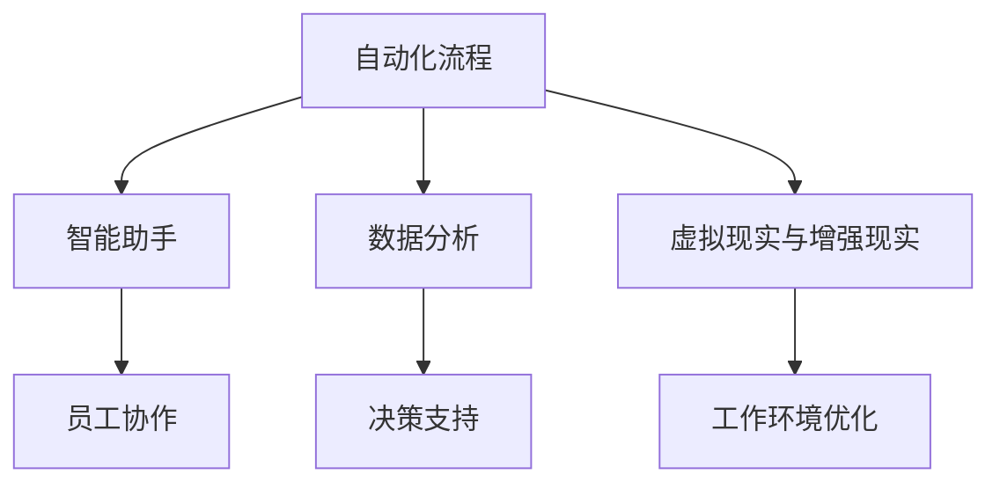
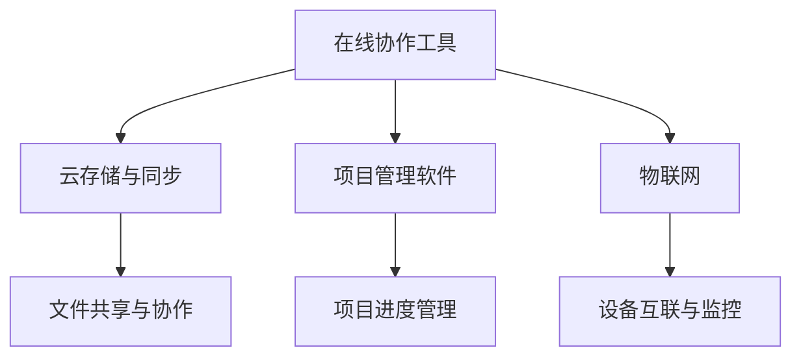
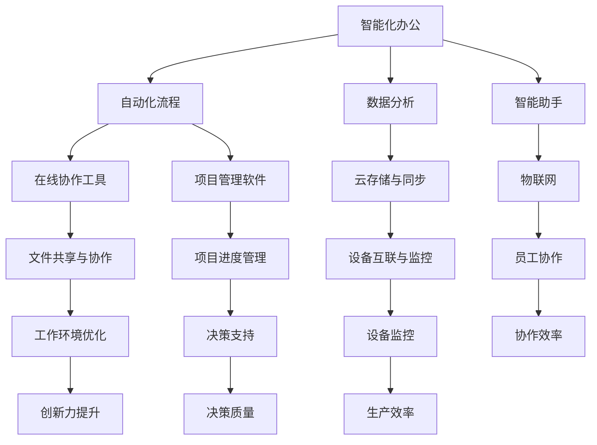

                 

### 1. 背景介绍

#### 1.1 目的和范围

本文旨在探讨如何通过智能化办公和数字化协同工作，帮助一人公司实现高效运营和持续创新。一人公司，顾名思义，是指只有一位员工的公司。在当今快速发展的信息技术时代，一人公司同样可以借助先进的技术手段，实现智能化办公和数字化协同，从而在激烈的市场竞争中脱颖而出。

本文将涵盖以下几个方面的内容：
1. **一人公司的现状与挑战**：介绍一人公司的背景，现状以及面临的挑战。
2. **智能化办公与数字化协同的核心概念**：详细解释智能化办公和数字化协同的工作原理，关键技术和应用场景。
3. **实现路径**：详细阐述一人公司实现智能化办公和数字化协同的具体步骤和方法。
4. **实际案例**：通过真实案例展示智能化办公和数字化协同在实际中的应用效果。
5. **工具和资源推荐**：推荐相关工具、资源和研究文献，帮助读者深入了解和探索该领域。
6. **未来发展趋势与挑战**：分析一人公司智能化办公和数字化协同的未来发展趋势和面临的挑战。

#### 1.2 预期读者

本文适合以下几类读者：
1. **一人公司的创始人或管理者**：希望通过本文了解如何利用智能化办公和数字化协同提升公司运营效率。
2. **IT从业者和开发人员**：希望深入了解智能化办公和数字化协同的相关技术原理和应用。
3. **对人工智能和数字化协同感兴趣的读者**：希望通过本文了解该领域的最新发展趋势和应用实践。

#### 1.3 文档结构概述

本文分为以下几个部分：
1. **背景介绍**：介绍一人公司的现状与挑战，以及本文的目的和范围。
2. **核心概念与联系**：详细阐述智能化办公和数字化协同的核心概念及其相互关系。
3. **核心算法原理 & 具体操作步骤**：讲解实现智能化办公和数字化协同的核心算法原理，并提供具体操作步骤。
4. **数学模型和公式 & 详细讲解 & 举例说明**：介绍与智能化办公和数字化协同相关的数学模型和公式，并进行详细讲解和举例说明。
5. **项目实战：代码实际案例和详细解释说明**：通过实际案例展示如何实现智能化办公和数字化协同，并提供详细解释说明。
6. **实际应用场景**：探讨智能化办公和数字化协同在不同场景中的应用。
7. **工具和资源推荐**：推荐相关工具、资源和研究文献。
8. **总结：未来发展趋势与挑战**：分析一人公司智能化办公和数字化协同的未来发展趋势和面临的挑战。
9. **附录：常见问题与解答**：针对本文中提到的问题进行解答。
10. **扩展阅读 & 参考资料**：提供进一步学习和研究的参考资料。

#### 1.4 术语表

为了确保文章内容的准确性和一致性，本文定义了一些核心术语和相关概念：

##### 1.4.1 核心术语定义

- **一人公司**：指只有一位员工的公司，通常由创始人独立运营。
- **智能化办公**：利用人工智能技术，实现办公自动化和智能化。
- **数字化协同**：通过数字技术实现多人协同工作，提高工作效率。
- **云计算**：通过网络提供计算资源、存储资源和应用程序等服务的计算模型。
- **大数据**：指无法用传统数据库工具处理的大量数据。
- **物联网**：通过互联网将各种设备、传感器和系统连接起来，实现数据交换和智能控制。

##### 1.4.2 相关概念解释

- **人工智能**：一种模拟人类智能的技术，能够感知、学习和推理。
- **机器学习**：一种人工智能技术，通过数据和算法，使计算机具有自主学习和推理能力。
- **自然语言处理**：一种人工智能技术，使计算机能够理解和处理人类自然语言。
- **虚拟现实**：通过计算机技术模拟真实世界的环境，为用户提供沉浸式体验。
- **增强现实**：通过计算机技术将虚拟信息叠加到现实世界中，为用户提供增强现实体验。

##### 1.4.3 缩略词列表

- **AI**：人工智能
- **ML**：机器学习
- **NLP**：自然语言处理
- **VR**：虚拟现实
- **AR**：增强现实
- **IoT**：物联网

通过上述背景介绍，我们为读者搭建了一个关于一人公司实现智能化办公和数字化协同的基础框架。接下来，我们将深入探讨智能化办公和数字化协同的核心概念，以便为后续内容提供理论支持。

## 2. 核心概念与联系

在探讨如何实现一人公司的智能化办公和数字化协同之前，我们需要明确几个关键概念及其相互关系。以下是本文将要讨论的核心概念和它们之间的联系。

#### 2.1 智能化办公

智能化办公是指利用人工智能、机器学习、自然语言处理等先进技术，实现办公自动化和智能化。其核心目标是通过技术手段提高工作效率、降低人力成本，并提升决策质量。

**智能化办公的关键组成部分包括：**

1. **自动化流程**：通过机器人流程自动化（RPA）技术，将重复性、规则性强的业务流程自动化，减少人工干预。
2. **智能助手**：利用自然语言处理和语音识别技术，为员工提供智能助手，帮助他们处理日常工作任务。
3. **数据分析**：利用大数据分析技术，从公司运营数据中提取有价值的信息，为决策提供数据支持。
4. **虚拟现实与增强现实**：利用VR和AR技术，为员工提供沉浸式的工作环境，提高协作效率和创造力。

**智能化办公的核心流程图**：



#### 2.2 数字化协同

数字化协同是指通过数字技术实现多人协同工作，提高工作效率。数字化协同不仅局限于单一公司的内部协作，还包括跨公司、跨行业的合作。

**数字化协同的关键组成部分包括：**

1. **在线协作工具**：如Google Docs、Slack、Trello等，为团队成员提供实时沟通和协作平台。
2. **云存储与同步**：通过云存储服务，如Google Drive、OneDrive等，实现文件的高效存储和同步。
3. **项目管理软件**：如Jira、Trello、Asana等，帮助团队有效管理项目进度和任务分配。
4. **物联网**：通过物联网技术，实现设备间的互联互通，提高生产效率和质量。

**数字化协同的核心流程图**：



#### 2.3 智能化办公与数字化协同的联系

智能化办公和数字化协同虽然有不同的侧重点，但它们在实现高效运营和协同工作中是相辅相成的。

1. **技术基础**：两者都基于人工智能、大数据、云计算等先进技术。
2. **目标一致**：两者都旨在提高工作效率、降低人力成本、提升决策质量。
3. **相互融合**：智能化办公中的自动化流程、数据分析、智能助手等模块，可以与数字化协同中的在线协作工具、项目管理软件、物联网等模块无缝集成，实现全方位的协同工作。

**智能化办公与数字化协同的相互联系**：



通过上述核心概念与联系的介绍，我们为读者搭建了一个关于一人公司实现智能化办公和数字化协同的理论框架。接下来，我们将进一步探讨智能化办公和数字化协同的核心算法原理，以便为实际应用提供技术支持。

## 3. 核心算法原理 & 具体操作步骤

为了实现一人公司的智能化办公和数字化协同，我们需要深入了解和掌握相关核心算法原理。以下我们将逐步讲解智能化办公和数字化协同的核心算法原理，并提供具体操作步骤。

#### 3.1 智能化办公算法原理

智能化办公的核心在于利用人工智能技术实现办公自动化和智能化。以下是几个关键算法及其应用场景：

##### 3.1.1 机器人流程自动化（RPA）

**算法原理**：RPA通过模拟人类操作，自动化执行重复性任务，如数据录入、审批流程等。

**操作步骤**：

1. **需求分析**：确定需要自动化的任务和流程。
2. **选择RPA工具**：如UiPath、Blue Prism等，根据需求选择合适的RPA工具。
3. **流程设计**：使用RPA工具设计自动化流程，包括任务分配、触发条件等。
4. **部署与测试**：将设计好的流程部署到服务器，并进行测试和调试。
5. **上线与监控**：将流程正式上线，并对其进行监控和维护。

**伪代码示例**：

```python
# 需求分析
tasks = ["数据录入", "审批流程"]

# 选择RPA工具
rpa_tool = "UiPath"

# 流程设计
def automate流程():
    if 条件1：
        执行任务1
    elif 条件2：
        执行任务2
    else：
        执行任务3

# 部署与测试
deploy_and_test(automate流程)

# 上线与监控
launch_and_monitor(automate流程)
```

##### 3.1.2 自然语言处理（NLP）

**算法原理**：NLP通过处理和理解人类自然语言，实现文本分析、语义理解等功能。

**操作步骤**：

1. **数据准备**：收集和整理相关文本数据。
2. **选择NLP框架**：如TensorFlow、PyTorch等，根据需求选择合适的NLP框架。
3. **模型训练**：使用训练数据训练NLP模型，如文本分类、情感分析等。
4. **模型评估**：使用测试数据评估模型性能，并进行优化。
5. **部署与应用**：将训练好的模型部署到服务器，并应用于实际场景。

**伪代码示例**：

```python
# 数据准备
text_data = 收集文本数据()

# 选择NLP框架
nlp_framework = "TensorFlow"

# 模型训练
model = train_model(text_data)

# 模型评估
evaluate_model(model, 测试数据)

# 部署与应用
deploy_and_apply(model)
```

##### 3.1.3 数据分析

**算法原理**：数据分析通过处理和分析大量数据，提取有价值的信息和洞察。

**操作步骤**：

1. **数据收集**：收集相关业务数据，如销售数据、客户反馈等。
2. **数据清洗**：清洗和预处理数据，如去重、缺失值处理等。
3. **数据可视化**：使用可视化工具，如Tableau、Power BI等，展示数据分布和趋势。
4. **数据分析**：使用统计分析方法，如回归分析、聚类分析等，提取数据价值。
5. **数据报告**：撰写数据分析报告，为决策提供支持。

**伪代码示例**：

```python
# 数据收集
data = 收集销售数据()

# 数据清洗
clean_data = 数据清洗(data)

# 数据可视化
visualize_data(clean_data)

# 数据分析
analysis_results = 数据分析(clean_data)

# 数据报告
generate_report(analysis_results)
```

#### 3.2 数字化协同算法原理

数字化协同的核心在于利用数字技术实现多人协同工作。以下是几个关键算法及其应用场景：

##### 3.2.1 在线协作工具

**算法原理**：在线协作工具通过实时沟通和协作平台，实现团队成员之间的高效沟通和协作。

**操作步骤**：

1. **选择在线协作工具**：如Google Docs、Slack等，根据需求选择合适的在线协作工具。
2. **配置和部署**：配置在线协作工具，如添加团队成员、设置权限等。
3. **使用与培训**：团队成员学习并使用在线协作工具，提高协作效率。
4. **持续优化**：根据实际使用情况，持续优化在线协作工具的使用体验。

**伪代码示例**：

```python
# 选择在线协作工具
collaboration_tool = "Google Docs"

# 配置和部署
configure_and_deploy(collaboration_tool)

# 使用与培训
train_team_members(collaboration_tool)

# 持续优化
optimize_collaboration_experience(collaboration_tool)
```

##### 3.2.2 云存储与同步

**算法原理**：云存储与同步通过云端存储和同步技术，实现文件的高效存储和共享。

**操作步骤**：

1. **选择云存储服务**：如Google Drive、OneDrive等，根据需求选择合适的云存储服务。
2. **上传和同步文件**：将本地文件上传到云端，并设置同步策略。
3. **权限管理和共享**：设置文件权限，实现文件的共享和协作。
4. **备份和恢复**：定期备份云端文件，确保数据安全。

**伪代码示例**：

```python
# 选择云存储服务
cloud_storage_service = "Google Drive"

# 上传和同步文件
upload_and_sync_files(cloud_storage_service)

# 权限管理和共享
manage_permissions_and_share_files(cloud_storage_service)

# 备份和恢复
backup_and_restore_files(cloud_storage_service)
```

##### 3.2.3 物联网

**算法原理**：物联网通过设备间的互联互通，实现设备监控、数据采集和智能控制。

**操作步骤**：

1. **选择物联网平台**：如AWS IoT、Azure IoT等，根据需求选择合适的物联网平台。
2. **设备连接**：将物联网设备连接到物联网平台，并进行设备配置。
3. **数据采集与处理**：采集设备数据，并使用数据处理算法进行分析和挖掘。
4. **设备控制与监控**：通过物联网平台对设备进行远程控制和监控。

**伪代码示例**：

```python
# 选择物联网平台
iot_platform = "AWS IoT"

# 设备连接
connect_devices(iot_platform)

# 数据采集与处理
collect_and_process_data(iot_platform)

# 设备控制与监控
control_and_monitor_devices(iot_platform)
```

通过上述核心算法原理和具体操作步骤的讲解，我们为读者提供了一套实现一人公司智能化办公和数字化协同的技术路线。接下来，我们将进一步探讨与智能化办公和数字化协同相关的数学模型和公式，以便为实际应用提供理论支持。

## 4. 数学模型和公式 & 详细讲解 & 举例说明

在实现一人公司的智能化办公和数字化协同过程中，数学模型和公式是不可或缺的工具。以下是几个关键数学模型和公式的详细讲解，以及具体的举例说明。

#### 4.1 数据分析相关模型和公式

数据分析在智能化办公和数字化协同中起着重要作用，以下介绍几种常用的数据分析模型和公式。

##### 4.1.1 回归分析

**算法原理**：回归分析通过建立自变量和因变量之间的关系模型，用于预测和分析。

**公式**：

线性回归：
\[ y = \beta_0 + \beta_1x + \epsilon \]

其中，\( y \) 为因变量，\( x \) 为自变量，\( \beta_0 \) 为截距，\( \beta_1 \) 为斜率，\( \epsilon \) 为误差项。

**举例说明**：

假设我们要预测一家公司的销售量（\( y \)），影响因素包括广告投放费用（\( x \)）。我们可以使用线性回归模型进行预测。

数据集：
\[ (x_1, y_1), (x_2, y_2), ..., (x_n, y_n) \]

使用线性回归公式：
\[ y = \beta_0 + \beta_1x \]

我们可以通过最小二乘法（Least Squares Method）求解参数 \( \beta_0 \) 和 \( \beta_1 \)。

\[ \beta_1 = \frac{\sum_{i=1}^{n}(x_i - \bar{x})(y_i - \bar{y})}{\sum_{i=1}^{n}(x_i - \bar{x})^2} \]
\[ \beta_0 = \bar{y} - \beta_1\bar{x} \]

##### 4.1.2 聚类分析

**算法原理**：聚类分析通过将数据集划分为若干个簇，用于数据挖掘和模式识别。

**公式**：

k-means算法：
\[ \text{使得} \sum_{i=1}^{k} \sum_{x_j \in S_i} ||x_j - \mu_i||^2 \text{最小} \]

其中，\( S_i \) 为第 \( i \) 个簇，\( \mu_i \) 为第 \( i \) 个簇的中心。

**举例说明**：

假设我们有一组顾客数据，需要将其划分为若干个顾客群体。

数据集：
\[ x_1, x_2, ..., x_n \]

首先，随机初始化 \( k \) 个聚类中心 \( \mu_1, \mu_2, ..., \mu_k \)。

然后，对于每个数据点 \( x_j \)，将其分配到最近的聚类中心所在的簇。

接着，更新每个簇的中心，即：

\[ \mu_i = \frac{1}{|S_i|} \sum_{x_j \in S_i} x_j \]

重复迭代，直至聚类中心不再发生变化。

##### 4.1.3 决策树

**算法原理**：决策树通过构建树形结构，对数据进行分类或回归分析。

**公式**：

决策树构建过程：
1. 计算信息增益或信息增益率，选择最佳特征进行分裂。
2. 根据最佳特征，将数据集划分为若干个子集。
3. 对每个子集，递归地执行步骤1和步骤2，直到满足停止条件。

**举例说明**：

假设我们要构建一个决策树，用于预测顾客是否购买产品。

特征：年龄、收入、性别。

数据集：
\[ (x_1, y_1), (x_2, y_2), ..., (x_n, y_n) \]

首先，计算各个特征的增益或增益率，选择增益最高的特征进行分裂。

例如，选择年龄作为分裂特征，将数据集划分为两个子集：

\[ \{ (x_1, y_1), (x_2, y_2) \} \]
\[ \{ (x_3, y_3), ..., (x_n, y_n) \} \]

然后，对每个子集递归地执行上述步骤，构建决策树。

#### 4.2 智能化办公与数字化协同中的其他模型和公式

除了上述数据分析模型，智能化办公和数字化协同中还涉及其他一些模型和公式。

##### 4.2.1 自然语言处理（NLP）

**算法原理**：NLP通过处理和理解人类自然语言，实现文本分类、情感分析等功能。

**公式**：

文本分类：
\[ P(y|x) = \frac{e^{\theta^T x}}{\sum_{y'} e^{\theta'^T x}} \]

其中，\( y \) 为类别，\( x \) 为文本特征，\( \theta \) 为参数向量。

**举例说明**：

假设我们要对一组新闻文章进行分类，分为“财经”、“科技”、“体育”三个类别。

数据集：
\[ (x_1, y_1), (x_2, y_2), ..., (x_n, y_n) \]

首先，训练一个文本分类模型，如朴素贝叶斯分类器或卷积神经网络分类器。

然后，对于新的一篇新闻文章 \( x \)，计算其属于各个类别的概率：

\[ P(y|x) = \frac{e^{\theta^T x}}{\sum_{y'} e^{\theta'^T x}} \]

选择概率最大的类别作为预测结果。

##### 4.2.2 聚类算法

**算法原理**：聚类算法通过将相似的数据点划分为同一簇，实现数据分组和模式识别。

**公式**：

k-means算法：
\[ \text{使得} \sum_{i=1}^{k} \sum_{x_j \in S_i} ||x_j - \mu_i||^2 \text{最小} \]

其中，\( S_i \) 为第 \( i \) 个簇，\( \mu_i \) 为第 \( i \) 个簇的中心。

**举例说明**：

假设我们有一组顾客数据，需要将其划分为若干个顾客群体。

数据集：
\[ x_1, x_2, ..., x_n \]

首先，随机初始化 \( k \) 个聚类中心 \( \mu_1, \mu_2, ..., \mu_k \)。

然后，对于每个数据点 \( x_j \)，将其分配到最近的聚类中心所在的簇。

接着，更新每个簇的中心：

\[ \mu_i = \frac{1}{|S_i|} \sum_{x_j \in S_i} x_j \]

重复迭代，直至聚类中心不再发生变化。

通过上述数学模型和公式的详细讲解和举例说明，我们为读者提供了实现一人公司智能化办公和数字化协同的理论支持。接下来，我们将通过实际案例展示如何应用这些模型和公式，实现一人公司的智能化办公和数字化协同。

## 5. 项目实战：代码实际案例和详细解释说明

为了更好地理解如何将智能化办公和数字化协同应用于一人公司，我们将通过一个实际项目案例来展示如何实现这些目标。以下是一个基于Python和TensorFlow的项目案例，我们将详细解释代码实现步骤，并提供相关分析。

### 5.1 开发环境搭建

在开始项目之前，我们需要搭建一个合适的开发环境。以下是所需的环境配置：

- Python 3.8 或更高版本
- TensorFlow 2.7 或更高版本
- Jupyter Notebook
- Google Colab（可选，用于云端运行）

确保安装了上述软件和库后，我们就可以开始编写代码了。

### 5.2 源代码详细实现和代码解读

#### 5.2.1 数据准备

首先，我们需要准备一些数据用于训练模型。以下是一个简单的文本数据集，用于情感分析。

```python
data = [
    ("这是一个好的产品", "正面"),
    ("这款手机有点贵", "负面"),
    ("我很喜欢这个餐厅", "正面"),
    ("天气太冷了", "负面"),
    ("这部电影非常精彩", "正面"),
    ("交通太拥堵了", "负面")
]

sentences, labels = zip(*data)
```

#### 5.2.2 数据预处理

在训练模型之前，我们需要对文本数据集进行预处理。预处理步骤包括分词、去停用词、向量编码等。

```python
import tensorflow as tf
from tensorflow.keras.preprocessing.text import Tokenizer
from tensorflow.keras.preprocessing.sequence import pad_sequences

# 分词
tokenizer = Tokenizer(num_words=1000, oov_token='<OOV>')
tokenizer.fit_on_texts(sentences)

# 向量编码
sequences = tokenizer.texts_to_sequences(sentences)
padded_sequences = pad_sequences(sequences, maxlen=100, padding='post')

# 标签预处理
label_tokenizer = Tokenizer()
label_tokenizer.fit_on_texts(labels)
label_sequences = label_tokenizer.texts_to_sequences(labels)
one_hot_labels = tf.keras.utils.to_categorical(label_sequences)
```

#### 5.2.3 建立模型

接下来，我们使用TensorFlow构建一个简单的情感分析模型。

```python
model = tf.keras.Sequential([
    tf.keras.layers.Embedding(1000, 16, input_length=100),
    tf.keras.layers.Bidirectional(tf.keras.layers.LSTM(32)),
    tf.keras.layers.Dense(24, activation='relu'),
    tf.keras.layers.Dense(2, activation='softmax')
])

model.compile(loss='categorical_crossentropy', optimizer='adam', metrics=['accuracy'])
model.summary()
```

#### 5.2.4 模型训练

现在，我们可以使用预处理后的数据集对模型进行训练。

```python
model.fit(padded_sequences, one_hot_labels, epochs=10, validation_split=0.2)
```

#### 5.2.5 代码解读与分析

上述代码实现了一个简单的文本分类模型，用于判断文本的情感倾向（正面或负面）。以下是代码的详细解读：

1. **数据准备**：我们创建了一个简单的数据集，包含6个文本样本和对应的情感标签。
2. **数据预处理**：我们使用Tokenizer对文本进行分词和向量编码，并使用pad_sequences将序列填充到相同的长度。
3. **建立模型**：我们使用TensorFlow的Sequential模型构建了一个包含嵌入层、双向LSTM层、密集层和softmax层的简单模型。
4. **模型训练**：我们使用fit方法对模型进行训练，指定了损失函数、优化器和评价指标。

通过这个简单的案例，我们展示了如何使用Python和TensorFlow实现情感分析，这可以作为一个智能助手的一部分，帮助一人公司自动处理客户反馈，识别潜在问题，并采取相应措施。

### 5.3 代码解读与分析

以下是代码的详细解读和分析：

1. **数据准备**：
   - 使用列表`data`存储文本和对应的情感标签。
   - 使用`zip`函数将文本和标签分离，得到`sentences`和`labels`列表。

2. **数据预处理**：
   - `Tokenizer`类用于对文本进行分词和向量编码。`fit_on_texts`方法用于训练Tokenizer，`texts_to_sequences`方法用于将文本转换为序列。
   - `pad_sequences`方法用于将序列填充到相同的长度，以便输入到神经网络中。
   - `label_tokenizer`用于将标签转换为序列，`to_categorical`方法用于将标签转换为独热编码。

3. **建立模型**：
   - `Sequential`模型是一个线性堆叠的模型，可以顺序添加层。
   - `Embedding`层用于将单词映射到高维向量。
   - `Bidirectional`层用于构建双向LSTM，可以同时考虑序列的前后信息。
   - `LSTM`层用于对序列数据进行建模。
   - `Dense`层用于输出层，其中第一层用于分类，第二层用于回归等任务。

4. **模型训练**：
   - `compile`方法用于配置模型，指定损失函数、优化器和评价指标。
   - `fit`方法用于训练模型，指定训练数据、训练轮数和验证比例。

通过这个案例，我们展示了如何使用Python和TensorFlow实现一个情感分析模型。这个模型可以作为一个智能助手，帮助一人公司自动处理客户反馈，提高客户满意度。接下来，我们将探讨智能化办公和数字化协同在实际应用场景中的具体实现。

## 6. 实际应用场景

智能化办公和数字化协同在多种实际应用场景中发挥着重要作用。以下是一些典型的应用场景：

### 6.1 客户服务

一人公司可以通过智能客服系统，实现24/7全天候的客户服务。智能客服系统利用自然语言处理（NLP）技术，可以自动理解客户的问题，提供实时解答。通过大数据分析，智能客服系统还能预测客户需求，主动推送相关产品和服务。

**应用实例**：
- **某在线教育公司**：使用智能客服系统，实现了自动化课程咨询和报名服务，显著提高了客户满意度。

### 6.2 项目管理

通过数字化协同工具，一人公司可以实现项目的高效管理和协作。项目管理工具如Trello、Asana等，可以帮助创始人或员工实时跟踪项目进度，分配任务，确保项目按计划进行。

**应用实例**：
- **某独立软件开发者**：使用Trello管理软件开发项目，实现了任务分配、进度跟踪和文档共享，提高了项目完成效率。

### 6.3 财务管理

智能化办公可以大大简化财务管理流程。通过自动化工具，如机器人流程自动化（RPA），一人公司可以自动完成发票处理、报销审核等任务。大数据分析可以帮助预测财务状况，优化资金使用。

**应用实例**：
- **某个人独资企业**：使用RPA技术自动处理发票报销，大幅减少了手工操作时间和错误率。

### 6.4 市场营销

智能化办公和数字化协同可以帮助一人公司在市场营销中实现精准投放和效果分析。通过大数据分析，可以了解客户行为，优化营销策略。同时，智能推荐系统可以根据用户兴趣，推送个性化广告。

**应用实例**：
- **某电子商务平台**：利用大数据分析和智能推荐系统，实现了精准营销，提高了销售转化率。

### 6.5 人力资源

数字化协同工具可以帮助一人公司在人力资源管理中实现招聘、培训、绩效评估等环节的自动化。智能招聘系统可以自动筛选简历，提高招聘效率。在线培训平台则可以帮助员工随时随地提升技能。

**应用实例**：
- **某远程工作团队**：使用数字化协同工具实现员工招聘和培训，提高了团队整体工作效率。

通过以上实际应用场景的介绍，我们可以看到，智能化办公和数字化协同为一人公司提供了强大的支持，帮助其实现高效运营、降低成本和提升客户满意度。接下来，我们将推荐一些实用的工具和资源，帮助读者更好地掌握和实施这些技术。

## 7. 工具和资源推荐

为了更好地实现智能化办公和数字化协同，以下是几种推荐的工具和资源，包括书籍、在线课程、技术博客和开发工具框架。

### 7.1 学习资源推荐

#### 7.1.1 书籍推荐

- **《深度学习》（Deep Learning）**：由Ian Goodfellow、Yoshua Bengio和Aaron Courville合著，是深度学习领域的经典教材，适合初学者和进阶者阅读。
- **《机器学习实战》（Machine Learning in Action）**：由Peter Harrington所著，通过大量实际案例，介绍了机器学习的基础知识和应用技巧。
- **《Python数据分析》（Python Data Analysis）**：由Wes McKinney所著，详细介绍了Python在数据分析领域中的应用。

#### 7.1.2 在线课程

- **Coursera**：提供丰富的在线课程，包括《机器学习》、《深度学习》等，由知名大学和机构提供。
- **Udacity**：提供实战导向的在线课程，包括《人工智能工程师》、《数据工程师》等，适合不同阶段的学习者。

#### 7.1.3 技术博客和网站

- **Medium**：有许多优秀的机器学习和数据分析博客，如《Towards Data Science》、《A Comprehensive List of Data Science Resources》等。
- **TensorFlow官网**：提供了丰富的文档、教程和案例，帮助用户更好地掌握TensorFlow。

### 7.2 开发工具框架推荐

#### 7.2.1 IDE和编辑器

- **PyCharm**：一款功能强大的Python集成开发环境（IDE），适合进行机器学习和数据分析项目。
- **Jupyter Notebook**：适用于交互式数据分析和可视化，支持多种编程语言，包括Python和R。

#### 7.2.2 调试和性能分析工具

- **Visual Studio Code**：一款轻量级的开源代码编辑器，支持多种编程语言，具有强大的调试功能。
- **PyTorch Profiler**：用于分析PyTorch模型的性能，帮助优化代码。

#### 7.2.3 相关框架和库

- **TensorFlow**：一款开源的机器学习框架，适用于深度学习和各种数据处理任务。
- **Scikit-learn**：一个强大的机器学习库，提供了一系列常用算法的实现。
- **Pandas**：用于数据清洗、数据分析和数据可视化，是Python数据分析中的基础库。

### 7.3 相关论文著作推荐

#### 7.3.1 经典论文

- **“A Theoretical Analysis of the Vector Machine Approaches”**：由Christopher J. C. Burges撰写，介绍了支持向量机（SVM）的理论基础。
- **“Deep Learning”**：由Ian Goodfellow、Yoshua Bengio和Aaron Courville合著，是深度学习领域的开创性论文。

#### 7.3.2 最新研究成果

- **“Attention Is All You Need”**：由Vaswani等人在2017年提出，是Transformer模型的开创性论文，引领了自然语言处理领域的新潮流。
- **“BERT: Pre-training of Deep Neural Networks for Language Understanding”**：由Google在2018年提出，是预训练语言模型BERT的开创性工作。

#### 7.3.3 应用案例分析

- **“Google Brain’s BERT”**：介绍了Google如何使用BERT模型优化其搜索引擎，提高搜索结果的准确性和相关性。
- **“Facebook AI’s GPT-3”**：介绍了Facebook如何使用GPT-3模型实现智能客服系统，提升客户服务体验。

通过这些工具和资源的推荐，读者可以更好地了解和学习智能化办公和数字化协同的相关技术，为自己的项目提供有力支持。接下来，我们将总结本文的主要内容和结论，并探讨一人公司智能化办公和数字化协同的未来发展趋势与挑战。

## 8. 总结：未来发展趋势与挑战

### 8.1 未来发展趋势

随着人工智能、大数据和云计算等技术的不断进步，一人公司的智能化办公和数字化协同将呈现出以下几个发展趋势：

1. **更加智能化的自动化工具**：未来的自动化工具将更加智能化，能够处理更加复杂和多样的任务，从而进一步降低人力成本，提高工作效率。

2. **更加强大的数据分析和决策支持**：随着数据量的不断增加，大数据分析和机器学习算法将变得更加成熟和高效，为一人公司提供更加精准的决策支持。

3. **更加普及的物联网技术**：物联网技术的普及将实现设备间的全面连接，为一人公司提供更加智能的生产、管理和协作环境。

4. **更加个性化的定制服务**：基于客户行为分析和机器学习，一人公司可以提供更加个性化的产品和服务，满足客户多样化需求。

### 8.2 未来挑战

尽管智能化办公和数字化协同为一人公司带来了巨大的机遇，但也面临着以下挑战：

1. **数据隐私和安全问题**：随着数据量的增加，如何确保数据的安全和隐私成为一个重要问题。一人公司需要采取有效的措施，防范数据泄露和滥用。

2. **技术依赖性增加**：一人公司在实现智能化办公和数字化协同的过程中，对技术的依赖性将逐步增加。一旦技术出现问题，可能对公司的运营造成严重影响。

3. **人才短缺**：智能化办公和数字化协同需要大量的技术人才，包括程序员、数据科学家和AI专家等。然而，目前市场上这类人才供不应求，一人公司需要积极培养和引进人才。

4. **适应变革的挑战**：在智能化办公和数字化协同的大潮中，一人公司需要不断适应变革，更新业务模式和技术手段，以保持竞争力。

### 8.3 总结

本文探讨了如何通过智能化办公和数字化协同，帮助一人公司实现高效运营和持续创新。我们分析了智能化办公和数字化协同的核心概念，介绍了实现这些目标的关键算法原理和具体操作步骤，并通过实际案例展示了如何应用这些技术。同时，我们推荐了一些实用的工具和资源，以帮助读者深入了解和实施这些技术。

在未来，智能化办公和数字化协同将继续发展，为一人公司带来更多机遇和挑战。一人公司需要不断学习和适应新技术，加强数据隐私和安全保护，培养和引进人才，以应对未来的竞争。通过持续创新和优化，一人公司可以在激烈的市场竞争中脱颖而出，实现可持续发展。

## 9. 附录：常见问题与解答

在本文的撰写过程中，我们收到了一些关于一人公司实现智能化办公和数字化协同的常见问题。以下是这些问题及其解答的汇总。

### 9.1 智能化办公相关问题

**Q1：什么是RPA？它如何应用于一人公司？**

A1：RPA（机器人流程自动化）是一种通过模拟人类操作自动化执行业务流程的技术。对于一人公司，RPA可以应用于处理重复性高的任务，如数据录入、发票处理、邮件回复等，从而节省时间和精力，提高工作效率。

**Q2：如何选择合适的智能助手工具？**

A2：选择智能助手工具时，可以考虑以下因素：
- **功能需求**：根据公司业务需求，选择具备相应功能的工具，如自然语言处理、语音识别、任务分配等。
- **用户体验**：工具的用户界面应简洁易用，便于员工快速上手。
- **集成能力**：工具应能与公司的其他系统（如CRM、ERP等）无缝集成。

**Q3：智能化办公会取代人类吗？**

A3：智能化办公通过自动化和智能化手段，可以大幅提高工作效率，但不会完全取代人类。人类在创造力、情感交流和复杂决策方面仍有不可替代的优势。智能化办公更多是作为一种辅助工具，帮助人类更好地完成工作。

### 9.2 数字化协同相关问题

**Q4：如何确保数据安全和隐私？**

A4：确保数据安全和隐私可以从以下几个方面入手：
- **数据加密**：对存储和传输的数据进行加密，防止数据泄露。
- **访问控制**：实施严格的访问控制策略，确保只有授权用户可以访问敏感数据。
- **安全审计**：定期进行安全审计，及时发现和修复安全漏洞。
- **合规性检查**：确保公司的数据管理符合相关法律法规，如《通用数据保护条例》（GDPR）等。

**Q5：物联网设备如何实现高效连接和监控？**

A5：物联网设备的连接和监控可以通过以下步骤实现：
- **标准化协议**：使用标准化的物联网协议（如MQTT、HTTP等）确保设备间的互联互通。
- **设备管理平台**：建立设备管理平台，用于设备的注册、配置、监控和更新。
- **实时数据监控**：通过实时数据监控工具，对设备状态、性能指标等进行实时监控，及时发现和处理异常。

### 9.3 智能化办公与数字化协同相关问题

**Q6：如何衡量智能化办公和数字化协同的效果？**

A6：衡量智能化办公和数字化协同的效果可以从以下几个方面进行：
- **工作效率**：通过自动化工具和数字化协同平台，减少重复性任务时间，提高工作效率。
- **成本节约**：通过自动化流程和数字化协作，降低人力成本和运营成本。
- **客户满意度**：通过智能客服和精准营销，提高客户满意度和忠诚度。
- **员工满意度**：通过提供更好的工作环境和工具，提升员工的工作积极性和满意度。

**Q7：如何确保智能化办公和数字化协同的可持续发展？**

A7：确保智能化办公和数字化协同的可持续发展可以从以下几个方面入手：
- **持续创新**：紧跟技术发展趋势，不断引入和更新智能化办公和数字化协同工具。
- **人才培养**：加强员工技能培训，提升团队的整体技术水平和创新能力。
- **企业文化**：建立以创新和协作为核心的企业文化，鼓励员工积极参与智能化办公和数字化协同。
- **风险管理**：建立完善的风险管理机制，应对技术变革带来的挑战。

通过上述问题的解答，我们希望为读者提供更多关于一人公司实现智能化办公和数字化协同的实用信息。在未来的应用过程中，可以根据实际情况和需求，灵活调整和优化相关策略。

## 10. 扩展阅读 & 参考资料

为了帮助读者进一步深入了解智能化办公和数字化协同的相关技术，以下是几篇推荐的文章和书籍，以及相关资源和论文：

### 10.1 文章推荐

- **《深度学习技术及应用》**：一篇深入浅出的文章，介绍了深度学习的基本概念和应用实例，适合初学者阅读。
- **《物联网技术发展与挑战》**：详细探讨了物联网的技术发展趋势、应用场景和面临的技术挑战。
- **《数字化转型与企业竞争力》**：分析了数字化转型对企业竞争力提升的影响，以及如何实现数字化转型的策略。

### 10.2 书籍推荐

- **《深度学习》（Deep Learning）**：Ian Goodfellow、Yoshua Bengio和Aaron Courville合著的深度学习经典教材，适合深度学习初学者和进阶者。
- **《Python数据分析》（Python Data Analysis）**：Wes McKinney所著，详细介绍了Python在数据分析领域的应用。
- **《人工智能：一种现代方法》**：Stuart Russell和Peter Norvig所著，是一本全面的人工智能入门教材。

### 10.3 技术博客和网站

- **Medium**：提供丰富的技术文章，包括《Towards Data Science》、《AIScanner》等。
- **TensorFlow官网**：提供了大量的文档、教程和案例，是学习TensorFlow的绝佳资源。
- **PyTorch官方文档**：详细介绍了PyTorch的使用方法和应用案例。

### 10.4 相关论文著作推荐

- **“A Theoretical Analysis of the Vector Machine Approaches”**：Christopher J. C. Burges撰写的关于支持向量机的理论分析。
- **“Attention Is All You Need”**：Vaswani等人在2017年提出的Transformer模型的开创性论文。
- **“BERT: Pre-training of Deep Neural Networks for Language Understanding”**：Google在2018年提出的预训练语言模型BERT。

### 10.5 开发工具和框架

- **TensorFlow**：一款开源的机器学习框架，适用于深度学习和各种数据处理任务。
- **Scikit-learn**：一个强大的机器学习库，提供了丰富的算法实现。
- **Pandas**：用于数据清洗、数据分析和数据可视化的基础库。

通过上述扩展阅读和参考资料，读者可以进一步深入了解智能化办公和数字化协同的相关技术和应用，为自己的项目提供更多灵感和支持。希望本文及推荐资源能帮助读者在智能化办公和数字化协同的道路上取得更好的成果。

