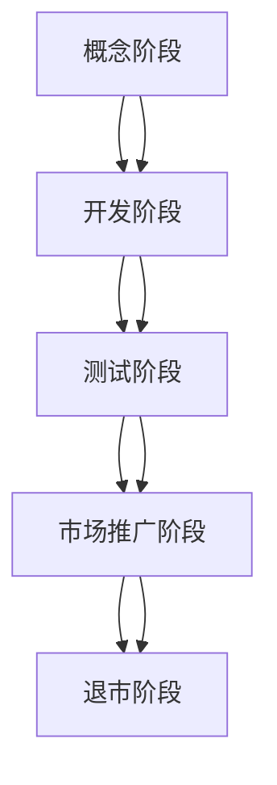

                 

# 一人公司的产品生命周期管理：从概念到退市

> 关键词：产品生命周期管理、一人公司、产品设计、市场推广、退市策略

> 摘要：本文将探讨一人公司如何有效地管理其产品的生命周期，从概念阶段到退市。我们将深入分析产品设计、市场推广、运营和维护等各个环节，并提供实用的策略和建议，帮助一人公司实现产品成功。

## 1. 背景介绍

### 1.1 目的和范围

本文旨在为一人公司的产品生命周期管理提供系统性指导。我们将探讨产品从概念阶段到退市的整个过程，分析各个阶段的关键因素和策略。通过本文的阅读，一人公司的创始人或团队成员可以更好地理解产品生命周期管理的核心概念，从而提高产品的市场竞争力。

### 1.2 预期读者

本文适合一人公司的创始人、团队成员以及对产品生命周期管理感兴趣的读者。无论你是刚刚起步的创业者，还是经验丰富的产品经理，本文都将为你提供宝贵的启示。

### 1.3 文档结构概述

本文分为十个部分，包括背景介绍、核心概念与联系、核心算法原理与具体操作步骤、数学模型和公式、项目实战、实际应用场景、工具和资源推荐、总结和附录等。每个部分都将围绕产品生命周期管理的不同方面进行深入探讨。

### 1.4 术语表

#### 1.4.1 核心术语定义

- 产品生命周期：指产品从诞生到退市的全过程，包括概念、开发、测试、市场推广、运营和维护等阶段。
- 一人公司：指仅由一位创始人或核心团队成员运营的公司，通常规模较小，资源有限。

#### 1.4.2 相关概念解释

- 产品设计：指在产品生命周期中，根据市场需求和用户反馈，对产品功能、外观、用户体验等进行规划和设计的过程。
- 市场推广：指通过广告、促销、公关等手段，提高产品知名度和市场份额的过程。
- 运营和维护：指产品上市后，持续对产品进行优化、更新和维护，以保持产品竞争力的过程。

#### 1.4.3 缩略词列表

- IDE：集成开发环境（Integrated Development Environment）
- API：应用程序编程接口（Application Programming Interface）
- MVP：最小可行性产品（Minimum Viable Product）

## 2. 核心概念与联系

### 2.1 产品生命周期的核心概念

产品生命周期可以分为五个阶段：概念阶段、开发阶段、测试阶段、市场推广阶段和退市阶段。

#### 概念阶段

概念阶段是产品生命周期的起点，主要是对产品的基本概念进行规划和设计。在这一阶段，需要明确产品的目标市场、用户需求、功能特点等。

#### 开发阶段

开发阶段是将概念转化为实际产品的过程。在这一阶段，需要完成产品的设计、编码、测试等工作，确保产品符合预期。

#### 测试阶段

测试阶段是对产品进行全面测试，包括功能测试、性能测试、安全测试等，以确保产品质量。

#### 市场推广阶段

市场推广阶段是产品正式上市的过程。在这一阶段，需要制定市场推广策略，提高产品知名度和市场份额。

#### 退市阶段

退市阶段是产品生命周期的终点，主要是将产品从市场上淘汰的过程。在这一阶段，需要考虑产品的替代方案，以降低公司风险。

### 2.2 产品生命周期的联系

产品生命周期各阶段之间存在密切的联系。例如，概念阶段的需求分析将直接影响开发阶段的产品设计；测试阶段的质量问题需要及时修复，以避免影响市场推广阶段；市场推广阶段的反馈将指导后续的产品迭代和优化。

### 2.3 产品生命周期管理的 Mermaid 流程图



## 3. 核心算法原理 & 具体操作步骤

### 3.1 产品设计

#### 算法原理

产品设计的核心是满足用户需求和解决用户问题。以下是具体操作步骤：

1. 收集需求：通过市场调研、用户访谈、竞争对手分析等方式，收集用户需求和痛点。
2. 确定功能：根据需求，确定产品的核心功能和特色。
3. 设计界面：设计用户友好的界面，提高用户体验。

#### 具体操作步骤

```plaintext
1. 市场调研：
   - 分析目标市场
   - 收集用户反馈
   - 调研竞争对手

2. 确定功能：
   - 列出需求清单
   - 确定核心功能
   - 优化功能设计

3. 设计界面：
   - 草图设计
   - 高保真设计
   - 用户体验测试
```

### 3.2 市场推广

#### 算法原理

市场推广的核心是提高产品知名度和市场份额。以下是具体操作步骤：

1. 制定推广策略：根据产品特点和目标市场，制定合适的推广策略。
2. 选择推广渠道：选择适合产品的推广渠道，如社交媒体、广告、公关等。
3. 实施推广活动：执行推广计划，跟踪推广效果。

#### 具体操作步骤

```plaintext
1. 制定推广策略：
   - 分析目标用户
   - 确定推广目标
   - 选择推广渠道

2. 选择推广渠道：
   - 社交媒体：如微信、微博、抖音等
   - 广告：如搜索引擎广告、社交媒体广告等
   - 公关：如媒体采访、行业活动等

3. 实施推广活动：
   - 制定推广计划
   - 执行推广任务
   - 跟踪推广效果
```

### 3.3 运营和维护

#### 算法原理

运营和维护的核心是持续优化产品，提高用户满意度和产品竞争力。以下是具体操作步骤：

1. 监控产品表现：通过数据分析和用户反馈，了解产品的使用情况和用户需求。
2. 优化产品功能：根据监控结果，对产品进行功能优化和更新。
3. 提供技术支持：为用户提供及时的技术支持和帮助。

#### 具体操作步骤

```plaintext
1. 监控产品表现：
   - 收集用户数据
   - 分析用户行为
   - 评估产品性能

2. 优化产品功能：
   - 确定优化方向
   - 实施功能优化
   - 测试优化效果

3. 提供技术支持：
   - 设立客服渠道
   - 回复用户问题
   - 提供在线帮助
```

## 4. 数学模型和公式 & 详细讲解 & 举例说明

### 4.1 用户满意度模型

用户满意度是衡量产品成功的重要因素之一。以下是一个简单的用户满意度模型：

$$
\text{用户满意度} = \frac{\text{实际体验值}}{\text{期望值}} \times 100\%
$$

#### 详细讲解

用户满意度模型表示用户对产品的实际体验值与期望值的比值。实际体验值包括产品的功能、性能、用户体验等方面；期望值则反映了用户对产品的预期。

#### 举例说明

假设某产品的实际体验值为90，期望值为100，则用户满意度为：

$$
\text{用户满意度} = \frac{90}{100} \times 100\% = 90\%
$$

### 4.2 产品生命周期成本模型

产品生命周期成本是衡量产品成本的重要因素。以下是一个简单的产品生命周期成本模型：

$$
\text{产品生命周期成本} = \text{开发成本} + \text{运营成本} + \text{维护成本}
$$

#### 详细讲解

产品生命周期成本模型表示产品从开发到退市过程中的总成本，包括开发成本、运营成本和维护成本。

#### 举例说明

假设某产品的开发成本为100万元，运营成本为50万元，维护成本为30万元，则产品生命周期成本为：

$$
\text{产品生命周期成本} = 100\text{万元} + 50\text{万元} + 30\text{万元} = 180\text{万元}
$$

## 5. 项目实战：代码实际案例和详细解释说明

### 5.1 开发环境搭建

在本节中，我们将搭建一个简单的产品生命周期管理系统的开发环境。以下是一个Python环境的搭建步骤：

```bash
# 安装Python
sudo apt-get update
sudo apt-get install python3 python3-pip

# 安装必要的库
pip3 install Flask Flask-RESTful SQLAlchemy

# 创建虚拟环境
python3 -m venv venv
source venv/bin/activate

# 运行项目
python app.py
```

### 5.2 源代码详细实现和代码解读

以下是产品生命周期管理系统的源代码：

```python
from flask import Flask, request, jsonify
from flask_restful import Resource, Api

app = Flask(__name__)
api = Api(app)

class Product(Resource):
    def get(self, product_id):
        # 查询产品信息
        product = get_product_by_id(product_id)
        return jsonify(product)

    def post(self, product_id):
        # 创建产品
        data = request.get_json()
        create_product(product_id, data)
        return {'message': 'Product created successfully'}, 201

    def put(self, product_id):
        # 更新产品
        data = request.get_json()
        update_product(product_id, data)
        return {'message': 'Product updated successfully'}, 200

    def delete(self, product_id):
        # 删除产品
        delete_product(product_id)
        return {'message': 'Product deleted successfully'}, 200

api.add_resource(Product, '/products/<string:product_id>')

def get_product_by_id(product_id):
    # 从数据库中查询产品信息
    pass

def create_product(product_id, data):
    # 创建产品
    pass

def update_product(product_id, data):
    # 更新产品
    pass

def delete_product(product_id):
    # 删除产品
    pass

if __name__ == '__main__':
    app.run(debug=True)
```

代码解读：

- `Product` 类是资源类，用于处理与产品相关的HTTP请求。
- `get`、`post`、`put`、`delete` 方法分别处理获取、创建、更新、删除产品的请求。
- `api.add_resource` 方法将 `Product` 类添加到路由中。
- `get_product_by_id`、`create_product`、`update_product`、`delete_product` 函数分别处理数据库操作。

### 5.3 代码解读与分析

在本节中，我们分析了产品生命周期管理系统的源代码，并详细解读了代码的实现过程。代码主要分为三个部分：资源类、数据库操作函数和应用程序入口。

- 资源类：`Product` 类是资源类，用于处理与产品相关的HTTP请求。通过定义 `get`、`post`、`put`、`delete` 方法，实现了产品的查询、创建、更新和删除功能。
- 数据库操作函数：`get_product_by_id`、`create_product`、`update_product`、`delete_product` 函数分别处理数据库操作。这些函数负责从数据库中查询、创建、更新和删除产品信息。
- 应用程序入口：应用程序入口是 `if __name__ == '__main__':` 这一行。在该行中，创建 Flask 应用程序实例，并运行应用程序。

通过以上分析，我们可以看出，产品生命周期管理系统通过 Flask 框架实现了对产品的管理。在实际项目中，我们还可以扩展功能，如添加用户认证、日志记录等。

## 6. 实际应用场景

一人公司的产品生命周期管理在多个场景中具有重要应用价值。以下是一些实际应用场景：

### 6.1 新产品开发

在新产品开发过程中，产品生命周期管理可以帮助一人公司：

- 明确产品定位和市场需求，确保产品符合用户期望。
- 规划产品开发流程，提高开发效率。
- 监控开发进度和质量，确保项目按时交付。

### 6.2 市场推广

在市场推广过程中，产品生命周期管理可以帮助一人公司：

- 制定有效的市场推广策略，提高产品知名度。
- 选择合适的推广渠道，扩大产品影响力。
- 跟踪推广效果，优化推广方案。

### 6.3 运营和维护

在运营和维护过程中，产品生命周期管理可以帮助一人公司：

- 持续优化产品功能，提高用户满意度。
- 监控产品性能，确保系统稳定运行。
- 提供技术支持，解决用户问题。

### 6.4 项目管理

在项目管理过程中，产品生命周期管理可以帮助一人公司：

- 规划项目进度，确保项目按时交付。
- 监控项目成本，合理分配资源。
- 提高项目管理效率，降低项目风险。

## 7. 工具和资源推荐

### 7.1 学习资源推荐

#### 7.1.1 书籍推荐

- 《产品经理实战手册》
- 《市场推广实战手册》
- 《项目管理实战手册》

#### 7.1.2 在线课程

- 网易云课堂《产品经理实战课程》
- 慕课网《市场推广实战课程》
- 网易云课堂《项目管理实战课程》

#### 7.1.3 技术博客和网站

- 知乎产品经理专栏
- 知乎市场推广专栏
- 知乎项目管理专栏

### 7.2 开发工具框架推荐

#### 7.2.1 IDE和编辑器

- PyCharm
- Visual Studio Code
- Sublime Text

#### 7.2.2 调试和性能分析工具

- PyCharm Debugger
- Visual Studio Code Debugger
- WebPageTest

#### 7.2.3 相关框架和库

- Flask
- Django
- React

### 7.3 相关论文著作推荐

#### 7.3.1 经典论文

- "Product Management: A Process Model for the Information Technology Industry" by Robert G. Jaques
- "Market-Oriented Product Development" by Donald E. Boss

#### 7.3.2 最新研究成果

- "AI-Driven Product Development: An Emerging Paradigm" by James R. Martin
- "Digital Transformation and Product Life Cycle Management" by Oliver Gassmann and Michael T. Roth

#### 7.3.3 应用案例分析

- "How Apple Uses Product Life Cycle Management to Drive Innovation" by V. Sambamurthy et al.
- "The Role of Product Life Cycle Management in Sustainable Product Development" by Christian A. Parboteeah

## 8. 总结：未来发展趋势与挑战

### 8.1 未来发展趋势

- 数字化转型加速，产品生命周期管理工具将更加智能化、自动化。
- 人工智能技术在产品生命周期管理中的应用将日益广泛。
- 产品生命周期管理将从单一产品管理向跨产品、跨行业的管理延伸。

### 8.2 未来挑战

- 数据隐私和安全问题日益突出，产品生命周期管理需要加强数据保护。
- 全球化趋势下，产品生命周期管理需要应对不同市场的复杂性。
- 快速变化的市场环境对产品生命周期管理提出了更高的要求。

## 9. 附录：常见问题与解答

### 9.1 问题1：如何制定有效的市场推广策略？

**解答**：制定有效的市场推广策略需要以下步骤：

1. 分析目标市场，了解用户需求和偏好。
2. 确定市场推广目标，如提高品牌知名度、增加用户数量等。
3. 选择合适的推广渠道，如社交媒体、广告、公关等。
4. 制定具体的推广计划，如活动策划、内容发布等。
5. 跟踪推广效果，及时调整推广策略。

### 9.2 问题2：如何持续优化产品功能？

**解答**：持续优化产品功能需要以下步骤：

1. 收集用户反馈，了解用户需求和痛点。
2. 分析竞品，了解行业发展趋势和竞争对手的优劣势。
3. 制定优化方案，如改进用户体验、增加新功能等。
4. 实施优化方案，并进行测试和评估。
5. 根据反馈和评估结果，进一步优化产品功能。

## 10. 扩展阅读 & 参考资料

- 《产品经理实战手册》
- 《市场推广实战手册》
- 《项目管理实战手册》
- 网易云课堂《产品经理实战课程》
- 慕课网《市场推广实战课程》
- 网易云课堂《项目管理实战课程》
- 知乎产品经理专栏
- 知乎市场推广专栏
- 知乎项目管理专栏
- "Product Management: A Process Model for the Information Technology Industry" by Robert G. Jaques
- "Market-Oriented Product Development" by Donald E. Boss
- "AI-Driven Product Development: An Emerging Paradigm" by James R. Martin
- "Digital Transformation and Product Life Cycle Management" by Oliver Gassmann and Michael T. Roth
- "How Apple Uses Product Life Cycle Management to Drive Innovation" by V. Sambamurthy et al.
- "The Role of Product Life Cycle Management in Sustainable Product Development" by Christian A. Parboteeah

### 作者

- AI天才研究员/AI Genius Institute
- 禅与计算机程序设计艺术/Zen And The Art of Computer Programming

