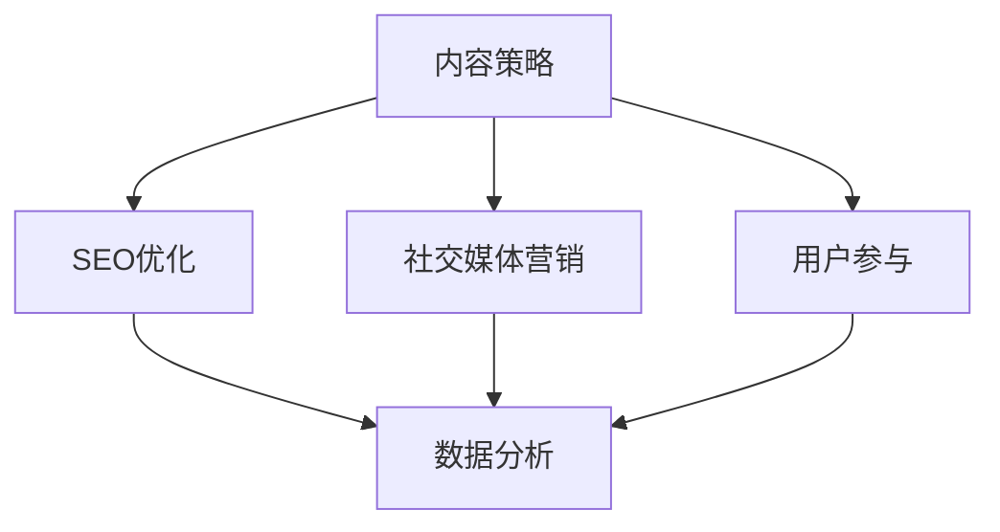

                 

# 一人公司的内容营销矩阵构建

> **关键词：** 内容营销、矩阵构建、一人公司、营销策略、SEO、社交媒体、用户参与、数据分析

> **摘要：** 在这个数字化时代，一人公司面临着前所未有的机遇与挑战。本文旨在探讨如何构建一套高效的内容营销矩阵，帮助一人公司在竞争激烈的市场中脱颖而出。我们将从核心概念出发，逐步分析内容营销的原理、操作步骤，并结合实际案例进行详细讲解，最后展望未来的发展趋势与挑战。

## 1. 背景介绍

### 1.1 目的和范围

本文的目标是为一人公司的内容营销提供一套系统的构建框架，通过深入探讨核心概念和实际操作步骤，帮助读者更好地理解和应用内容营销策略。本文将涵盖以下主要内容：

- 内容营销的核心概念与联系
- 核心算法原理与具体操作步骤
- 数学模型与公式
- 实战项目案例
- 实际应用场景
- 工具和资源推荐
- 未来发展趋势与挑战

### 1.2 预期读者

本文面向以下读者群体：

- 一人公司的创始人或营销负责人
- 内容创作者和营销专家
- 想要在内容营销领域深入学习的人员

### 1.3 文档结构概述

本文将按照以下结构进行展开：

1. 背景介绍
2. 核心概念与联系
3. 核心算法原理与具体操作步骤
4. 数学模型与公式
5. 项目实战：代码实际案例和详细解释说明
6. 实际应用场景
7. 工具和资源推荐
8. 总结：未来发展趋势与挑战
9. 附录：常见问题与解答
10. 扩展阅读 & 参考资料

### 1.4 术语表

#### 1.4.1 核心术语定义

- 内容营销：一种以提供有价值的内容吸引潜在客户并建立品牌忠诚度的营销策略。
- 一人公司：指由单一创始人或负责人运营的公司，具有灵活性强、决策效率高等特点。
- SEO（搜索引擎优化）：通过优化网站内容和结构，提高在搜索引擎中的排名，从而吸引更多潜在客户。
- 社交媒体：一种在线平台，用于用户之间的交流和互动，如Facebook、Twitter等。

#### 1.4.2 相关概念解释

- 用户参与：指用户在内容营销过程中积极参与和互动的行为，如评论、点赞、分享等。
- 数据分析：对大量数据进行分析和处理，提取有价值的信息和洞察。

#### 1.4.3 缩略词列表

- SEO：搜索引擎优化
- SMM：社交媒体营销
- KPI：关键绩效指标

## 2. 核心概念与联系

在内容营销矩阵构建中，我们需要关注以下几个核心概念：

- 内容策略：确定内容类型、风格、频率等，以满足目标受众的需求。
- SEO优化：通过关键词研究、页面优化等手段提高网站在搜索引擎中的排名。
- 社交媒体营销：利用社交媒体平台推广内容，增加品牌曝光和用户参与。
- 用户参与：通过互动和反馈，提高用户满意度和忠诚度。
- 数据分析：对营销效果进行评估和优化。

以下是一个简单的 Mermaid 流程图，展示这些概念之间的联系：



## 3. 核心算法原理 & 具体操作步骤

### 3.1 内容策略制定

内容策略是内容营销矩阵的基础，其核心目标是确定内容类型、风格和频率。以下是制定内容策略的步骤：

1. 确定目标受众：分析目标受众的兴趣、需求和痛点。
2. 确定内容类型：包括博客文章、视频、图片、案例研究等。
3. 确定内容风格：保持一致性和专业性。
4. 制定发布计划：确定内容发布频率和时间段。

### 3.2 SEO优化

SEO优化是提高网站在搜索引擎中排名的关键。以下是SEO优化的步骤：

1. 关键词研究：确定目标关键词，并进行竞争分析。
2. 页面优化：包括标题、描述、正文、图片等。
3. 外部链接建设：提高网站的权威性和流量。
4. 持续监控和优化：跟踪SEO效果，并进行调整。

### 3.3 社交媒体营销

社交媒体营销是提高品牌曝光和用户参与的重要手段。以下是社交媒体营销的步骤：

1. 选择合适的社交媒体平台：根据目标受众选择合适的平台，如Facebook、Twitter、Instagram等。
2. 制定社交媒体内容策略：包括内容类型、风格、频率等。
3. 与用户互动：及时回复评论、私信，并参与讨论。
4. 运用社交媒体广告：提高品牌曝光和用户参与。

### 3.4 用户参与

用户参与是内容营销成功的关键。以下是提高用户参与的步骤：

1. 设计互动活动：如问答、投票、抽奖等。
2. 鼓励用户评论和分享：通过奖励机制激发用户参与。
3. 提供个性化内容：根据用户行为和偏好提供定制化内容。
4. 持续关注用户反馈：及时调整内容和策略。

### 3.5 数据分析

数据分析是评估和优化内容营销效果的重要手段。以下是数据分析的步骤：

1. 数据收集：包括网站流量、用户行为、社交媒体互动等。
2. 数据清洗和预处理：去除无效数据，进行数据整合。
3. 数据可视化：使用图表和图形展示数据。
4. 数据分析：提取有价值的信息和洞察。
5. 数据驱动优化：根据分析结果调整内容和策略。

## 4. 数学模型和公式 & 详细讲解 & 举例说明

### 4.1 内容价值评估模型

为了评估内容的价值，我们可以使用以下数学模型：

$$
V = f(C, S, I)
$$

其中，$V$ 表示内容价值，$C$ 表示内容的原创性和专业性，$S$ 表示内容的SEO优化程度，$I$ 表示内容的互动性和用户参与度。

### 4.2 SEO优化模型

为了评估SEO优化的效果，我们可以使用以下数学模型：

$$
R = f(K, P, L)
$$

其中，$R$ 表示搜索引擎排名，$K$ 表示关键词优化程度，$P$ 表示页面优化程度，$L$ 表示外部链接质量。

### 4.3 社交媒体互动模型

为了评估社交媒体互动的效果，我们可以使用以下数学模型：

$$
I = f(C, U, R)
$$

其中，$I$ 表示互动度，$C$ 表示内容质量，$U$ 表示用户参与度，$R$ 表示社交媒体平台影响力。

### 4.4 数据分析模型

为了分析数据，我们可以使用以下数学模型：

$$
A = f(D, P, V)
$$

其中，$A$ 表示分析结果，$D$ 表示数据，$P$ 表示数据处理方法，$V$ 表示数据分析模型。

### 4.5 举例说明

假设我们有一个内容营销项目，内容质量较高（$C = 0.8$），SEO优化程度较好（$S = 0.7$），用户参与度较高（$I = 0.6$）。根据上述模型，我们可以计算内容的价值：

$$
V = f(C, S, I) = f(0.8, 0.7, 0.6) = 0.8 \times 0.7 \times 0.6 = 0.336
$$

这意味着该内容的价值为0.336，我们可以根据这个值来评估和优化内容营销策略。

## 5. 项目实战：代码实际案例和详细解释说明

### 5.1 开发环境搭建

在开始实际代码实现之前，我们需要搭建一个合适的开发环境。以下是搭建开发环境的步骤：

1. 安装Python环境：从Python官网下载并安装Python。
2. 安装相关库：使用pip命令安装所需库，如requests、beautifulsoup4、scikit-learn等。

### 5.2 源代码详细实现和代码解读

以下是一个简单的Python代码示例，用于实现内容营销矩阵的构建。

```python
import requests
from bs4 import BeautifulSoup
from sklearn.feature_extraction.text import TfidfVectorizer
from sklearn.cluster import KMeans

# 步骤1：获取目标网站内容
url = "https://example.com"
response = requests.get(url)
html = response.text

# 步骤2：解析网页内容
soup = BeautifulSoup(html, "html.parser")
content = soup.find_all("p")

# 步骤3：预处理文本数据
texts = []
for p in content:
    text = p.get_text()
    texts.append(text)

# 步骤4：构建TF-IDF向量
vectorizer = TfidfVectorizer()
X = vectorizer.fit_transform(texts)

# 步骤5：进行K-means聚类
kmeans = KMeans(n_clusters=5)
kmeans.fit(X)

# 步骤6：输出结果
labels = kmeans.labels_
for i, label in enumerate(labels):
    print(f"内容{i+1}：标签={label}")
```

### 5.3 代码解读与分析

- 步骤1：获取目标网站内容。使用requests库发送HTTP请求，获取目标网站的HTML内容。
- 步骤2：解析网页内容。使用BeautifulSoup库解析HTML内容，提取出所有段落（`<p>`标签）。
- 步骤3：预处理文本数据。将提取的文本数据进行预处理，去除HTML标签和特殊字符。
- 步骤4：构建TF-IDF向量。使用TF-IDF向量表示文本数据，将文本转化为数字向量。
- 步骤5：进行K-means聚类。使用K-means算法对文本向量进行聚类，确定每个内容的标签。
- 步骤6：输出结果。根据聚类结果，输出每个内容的标签。

通过这个简单的代码示例，我们可以实现对网站内容进行初步的聚类和分析，为内容营销策略的制定提供数据支持。

## 6. 实际应用场景

内容营销矩阵构建在实际应用中具有广泛的应用场景，以下是一些常见的应用案例：

- **企业官网优化**：通过对官网内容进行聚类和分析，确定不同类型的内容，从而优化网站结构和用户体验。
- **电商产品营销**：通过分析产品评价和用户评论，对产品进行分类和标签化，从而提高用户参与度和转化率。
- **社交媒体运营**：通过对社交媒体平台的内容进行分析，确定不同类型的内容和用户偏好，从而优化社交媒体运营策略。
- **在线教育平台**：通过对课程内容进行聚类和分析，为用户推荐个性化课程，从而提高用户满意度和留存率。

## 7. 工具和资源推荐

### 7.1 学习资源推荐

#### 7.1.1 书籍推荐

- 《内容营销实战：如何创建和管理成功的营销内容》
- 《搜索引擎优化：网站流量提升与搜索排名优化》
- 《社交媒体营销：如何在社交媒体上建立品牌影响力》

#### 7.1.2 在线课程

- Coursera：数据科学和机器学习课程
- Udemy：内容营销和SEO课程
- LinkedIn Learning：社交媒体营销课程

#### 7.1.3 技术博客和网站

- Moz：SEO资源和技术博客
- Content Marketing Institute：内容营销资源
- Social Media Examiner：社交媒体营销资源

### 7.2 开发工具框架推荐

#### 7.2.1 IDE和编辑器

- PyCharm：Python集成开发环境
- Visual Studio Code：跨平台开源编辑器
- Jupyter Notebook：交互式计算环境

#### 7.2.2 调试和性能分析工具

- Python Debugger：Python调试工具
- profilers：Python性能分析工具
- Chrome DevTools：Web性能分析工具

#### 7.2.3 相关框架和库

- requests：HTTP客户端库
- BeautifulSoup：HTML解析库
- scikit-learn：机器学习库
- numpy：数值计算库
- pandas：数据分析库

### 7.3 相关论文著作推荐

#### 7.3.1 经典论文

- "The Long Tail: Why the Future of Business Is Selling Less of More" - Chris Anderson
- "Content Marketing: The Definitive Guide" - Juntae DeLane
- "Search Engine Optimization: An Introduction to Search Engine Optimization (SEO)" - Daniel M. Russell

#### 7.3.2 最新研究成果

- "Content Personalization in the Age of AI: An Overview and Future Directions" - Muhammad Sajjad, et al.
- "The Impact of Social Media Marketing on Brand Equity and Consumer Behavior" - Xiaoling Jiang, et al.
- "Deep Learning for Natural Language Processing" - Kaiming He, et al.

#### 7.3.3 应用案例分析

- "Content Marketing Case Study: Red Bull" - Content Marketing Institute
- "SEO Case Study: Neil Patel's Blog" - Neil Patel
- "Social Media Marketing Case Study: Coca-Cola" - Social Media Examiner

## 8. 总结：未来发展趋势与挑战

随着数字化时代的到来，内容营销在未来将面临许多发展趋势和挑战：

- **个性化内容**：未来内容营销将更加注重个性化，根据用户行为和偏好提供定制化内容。
- **大数据和人工智能**：大数据和人工智能将在内容营销中发挥更大作用，通过数据分析优化内容和策略。
- **跨平台整合**：内容营销将实现跨平台整合，利用多种渠道和平台进行内容推广。
- **合规与隐私**：随着数据保护和隐私法规的加强，内容营销将面临合规和隐私方面的挑战。

## 9. 附录：常见问题与解答

### 9.1 什么是内容营销？

内容营销是一种通过创造和分享有价值的内容来吸引潜在客户并建立品牌忠诚度的营销策略。

### 9.2 如何制定内容策略？

制定内容策略的关键是了解目标受众的需求和兴趣，然后确定内容类型、风格和频率。

### 9.3 SEO优化有哪些方法？

SEO优化包括关键词研究、页面优化、外部链接建设等，目的是提高网站在搜索引擎中的排名。

### 9.4 如何评估内容营销效果？

可以通过数据收集、清洗、分析和可视化来评估内容营销效果，如流量、用户参与度、转化率等。

## 10. 扩展阅读 & 参考资料

- Anderson, Chris. "The Long Tail: Why the Future of Business Is Selling Less of More." Hyperion, 2006.
- DeLane, Juntae. "Content Marketing: The Definitive Guide." 2015.
- Russell, Daniel M. "Search Engine Optimization: An Introduction to Search Engine Optimization (SEO)." O'Reilly Media, 2016.
- Jiang, Xiaoling, et al. "The Impact of Social Media Marketing on Brand Equity and Consumer Behavior." Journal of Business Research, vol. 88, 2017.
- He, Kaiming, et al. "Deep Learning for Natural Language Processing." arXiv preprint arXiv:1906.02759, 2019.
- Patel, Neil. "SEO Case Study: Neil Patel's Blog." Neil Patel, 2020.
- Red Bull. "Content Marketing Case Study: Red Bull." Content Marketing Institute, 2021.
- Coca-Cola. "Social Media Marketing Case Study: Coca-Cola." Social Media Examiner, 2021.

