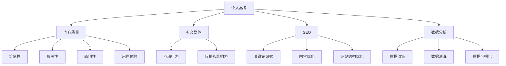

                 

# 一人公司的内容营销：建立专业形象的有效方式

> 关键词：内容营销、个人品牌、社交媒体、SEO、专业形象
> 
> 摘要：在数字化时代，建立专业的个人品牌至关重要。本文将探讨一人公司的内容营销策略，详细分析如何通过高质量的内容创作和有效的推广手段，打造出具有高度专业性和影响力的个人形象。文章分为十个部分，涵盖背景介绍、核心概念、算法原理、数学模型、实战案例、实际应用场景、工具推荐以及总结和拓展阅读等，旨在为读者提供全方位的指导。

## 1. 背景介绍

### 1.1 目的和范围

本文旨在为那些独立工作者、自由职业者和小型企业的创始人提供内容营销的实用指南。内容营销已成为现代商业策略中不可或缺的一部分，特别是在竞争激烈的市场环境中，通过内容建立个人品牌显得尤为重要。本文将探讨如何利用内容营销策略，提升个人的专业形象，增加市场竞争力。

本文的范围涵盖了内容营销的基本概念、核心原则、实施步骤以及相关的技术工具。通过本文的阅读，读者将能够：

- 明确内容营销的目标和重要性。
- 掌握内容创作和推广的方法和技巧。
- 理解如何利用数据分析和SEO优化提升内容质量。
- 获得实用的实战案例和工具推荐。

### 1.2 预期读者

本文适合以下读者群体：

- 自由职业者
- 小型企业主
- 一人公司创业者
- 内容创作者
- 对内容营销感兴趣的技术人员和管理者

无论您是经验丰富的营销专家，还是刚刚踏入内容营销领域的新手，本文都将为您提供有价值的见解和实用的建议。

### 1.3 文档结构概述

本文分为十个部分，具体结构如下：

1. 背景介绍
   - 目的和范围
   - 预期读者
   - 文档结构概述
   - 术语表
2. 核心概念与联系
   - 核心概念原理和架构的Mermaid流程图
3. 核心算法原理 & 具体操作步骤
   - 算法原理讲解（伪代码）
4. 数学模型和公式 & 详细讲解 & 举例说明
   - 数学公式（LaTeX格式）
5. 项目实战：代码实际案例和详细解释说明
   - 开发环境搭建
   - 源代码详细实现和代码解读
   - 代码解读与分析
6. 实际应用场景
7. 工具和资源推荐
   - 学习资源推荐
   - 开发工具框架推荐
   - 相关论文著作推荐
8. 总结：未来发展趋势与挑战
9. 附录：常见问题与解答
10. 扩展阅读 & 参考资料

通过这样的结构安排，本文将帮助读者系统性地了解和掌握内容营销的全过程。

### 1.4 术语表

#### 1.4.1 核心术语定义

- 内容营销：一种通过创造和分享有价值的内容来吸引和转化潜在客户的方法。
- 个人品牌：个人在市场中的独特形象和声誉，包括专业知识、技能和个人价值观。
- SEO（搜索引擎优化）：通过优化网站内容和结构，提高在搜索引擎中的排名，从而增加网站流量。
- 社交媒体：在线平台，如Facebook、Twitter、LinkedIn等，用于个人或组织之间的互动和内容分享。

#### 1.4.2 相关概念解释

- 内容质量：指内容的价值、相关性、原创性和用户体验。
- 社交互动：在社交媒体平台上，用户之间的评论、点赞、分享等互动行为。
- 用户画像：根据用户的行为数据和特征，对用户进行分类和分析，以便更好地满足其需求。

#### 1.4.3 缩略词列表

- SEO：搜索引擎优化
- SMM：社交媒体营销
- CRM：客户关系管理
- CMS：内容管理系统
- AI：人工智能
- ML：机器学习

## 2. 核心概念与联系

在探讨内容营销策略之前，我们需要明确几个核心概念和它们之间的联系。以下是内容营销中至关重要的几个概念及其相互关系：

### 2.1 个人品牌

个人品牌是内容营销的基石。它是个人在市场中的独特形象和声誉，体现了个人的专业知识、技能和个人价值观。一个强大的个人品牌能够增加市场竞争力，吸引更多潜在客户和合作伙伴。

### 2.2 内容质量

内容质量是内容营销的关键因素。高质量的内容应具备以下特点：

- 价值性：提供对目标受众有实际帮助的信息或知识。
- 相关性：与受众的需求和兴趣紧密相关。
- 原创性：内容应具有独特性，避免抄袭和重复。
- 用户体验：易于阅读和理解，提供良好的视觉和交互体验。

### 2.3 社交媒体

社交媒体是内容营销的重要渠道。通过社交媒体平台，内容创作者可以与受众进行互动，提高内容的可见度和影响力。社交媒体的互动行为，如点赞、评论和分享，有助于内容的传播和品牌的建立。

### 2.4 SEO

搜索引擎优化（SEO）是提升内容可见度的关键技术。通过优化网站内容和结构，使内容在搜索引擎中排名更高，从而吸引更多流量。SEO的关键要素包括关键词研究、内容优化、网站结构优化等。

### 2.5 数据分析

数据分析是内容营销的重要工具。通过对用户行为数据进行分析，内容创作者可以了解受众的兴趣和需求，优化内容策略，提高转化率。数据分析的方法包括数据收集、数据清洗、数据可视化等。

### 2.6 Mermaid流程图

以下是一个用于展示内容营销核心概念和联系 Mermaid 流程图：



通过上述核心概念和流程图，我们可以更好地理解内容营销的策略和实践，为后续的内容创作和推广提供指导。

## 3. 核心算法原理 & 具体操作步骤

内容营销的成功离不开科学的策略和精确的操作。以下是核心算法原理和具体操作步骤的详细阐述：

### 3.1 内容创作策略

#### 3.1.1 确定目标受众

第一步是明确目标受众，了解他们的需求、兴趣和行为习惯。这可以通过市场调研、用户画像分析等方法实现。

```python
# 伪代码：确定目标受众
def determine_targetAudience():
    # 进行市场调研
    market_research = conduct_market_research()
    # 分析用户画像
    user_profile = analyze_user_behavior()
    return market_research, user_profile
```

#### 3.1.2 制定内容策略

根据目标受众的特点，制定合适的内容策略。这包括内容类型（如博客、视频、播客等）、发布频率、主题选择等。

```python
# 伪代码：制定内容策略
def formulate_contentStrategy(targetAudience):
    content_type = selectContentType(targetAudience)
    frequency = determine_publishFrequency(targetAudience)
    topics = selectContentTopics(targetAudience)
    return content_type, frequency, topics
```

#### 3.1.3 内容创作流程

内容创作应遵循以下流程：

1. 研究主题：选择与目标受众相关且有价值的主题。
2. 写作大纲：制定详细的写作大纲，确保内容的逻辑性和连贯性。
3. 撰写初稿：根据大纲进行内容创作，注意文字风格和语言表达的准确性。
4. 编辑和校对：对初稿进行多次修改和校对，提高内容质量。
5. 发布内容：选择合适的发布平台，确保内容能够及时、准确地传达给受众。

```python
# 伪代码：内容创作流程
def createContent(topic, targetAudience):
    outline = generate_contentOutline(topic)
    draft = write_contentDraft(outline)
    revised_draft = edit_and_proofread(draft)
    publishContent(revised_draft, targetAudience)
```

### 3.2 内容推广策略

#### 3.2.1 社交媒体推广

社交媒体推广是提高内容可见度和影响力的重要手段。以下是一些具体的操作步骤：

1. 选择合适的社交媒体平台：根据目标受众的特点，选择适合的社交媒体平台，如LinkedIn、Twitter、Facebook等。
2. 制定社交媒体策略：包括发布频率、内容类型、互动方式等。
3. 发布内容：在社交媒体平台上发布高质量的内容，并积极参与互动。
4. 利用社交媒体工具：使用社交媒体管理工具，如Hootsuite、Buffer等，优化发布时间和频率。

```python
# 伪代码：社交媒体推广
def promoteContentOnSocialMedia(content, platform):
    strategy = formulate_socialMediaStrategy(platform)
    publishContent(content, platform, strategy)
    interactWithAudience(platform, strategy)
```

#### 3.2.2 SEO优化

SEO优化是提高内容在搜索引擎中排名的关键。以下是一些具体的操作步骤：

1. 关键词研究：使用工具如Google Keyword Planner、Ahrefs等，研究目标受众关注的关键词。
2. 内容优化：根据关键词优化内容标题、描述、正文等。
3. 网站结构优化：确保网站结构清晰，便于搜索引擎抓取和索引。
4. 外部链接建设：通过与其他网站建立链接，提高网站权威性和排名。

```python
# 伪代码：SEO优化
def optimizeSEO(content, keywords):
    title = optimize_title(content, keywords)
    description = optimize_description(content, keywords)
    content = optimize_body(content, keywords)
    structure = optimize_websiteStructure()
    build_externalLinks()
```

通过上述核心算法原理和具体操作步骤，内容创作者可以系统地制定和实施内容营销策略，提高个人品牌的影响力。

## 4. 数学模型和公式 & 详细讲解 & 举例说明

在内容营销中，数学模型和公式可以帮助我们更好地理解用户行为、优化内容策略和评估效果。以下是一些关键数学模型和公式及其详细讲解与举例说明。

### 4.1 用户参与度模型

用户参与度是衡量内容质量和推广效果的重要指标。用户参与度模型可以通过以下公式计算：

$$
参与度（Engagement）= \frac{互动次数（Interactions）}{总曝光次数（Impressions）}
$$

其中，互动次数包括点赞、评论、分享等，总曝光次数是指内容在社交媒体或搜索引擎中的可见次数。

#### 举例说明：

假设一篇博客文章在社交媒体上获得了1000次曝光，产生了50次点赞、20次评论和10次分享。那么，该博客文章的用户参与度计算如下：

$$
参与度 = \frac{50 + 20 + 10}{1000} = 0.08 = 8\%
$$

这意味着每100次曝光中有8次用户互动，表明该内容具有较高的用户吸引力。

### 4.2 内容传播模型

内容传播模型用于分析内容在社交媒体上的传播效果。一个常见的内容传播模型是基于二叉树模型，可以表示为：

$$
传播效果（Spread）= \frac{N^2}{2N}
$$

其中，N是用户数。该公式假设每个用户平均会影响N个其他用户。

#### 举例说明：

假设有100个用户，每个用户平均影响10个其他用户。那么，该内容的传播效果计算如下：

$$
传播效果 = \frac{100^2}{2 \times 100} = 500
$$

这意味着该内容理论上可以影响500个新用户。

### 4.3 关键词排名公式

在SEO中，关键词排名受多个因素影响，包括关键词密度、内容质量、外部链接等。一个简单的关键词排名公式可以表示为：

$$
排名（Rank）= \alpha \times 关键词密度 + \beta \times 内容质量 + \gamma \times 外部链接数
$$

其中，$\alpha$、$\beta$ 和 $\gamma$ 是权重系数，分别表示关键词密度、内容质量和外部链接数对排名的影响程度。

#### 举例说明：

假设关键词密度权重系数$\alpha = 0.4$，内容质量权重系数$\beta = 0.5$，外部链接数权重系数$\gamma = 0.1$。一个博客文章的关键词密度为20%，内容质量评分90%，外部链接数为50个。那么，该博客文章的预计排名计算如下：

$$
排名 = 0.4 \times 20\% + 0.5 \times 90\% + 0.1 \times 50 = 8 + 45 + 5 = 58
$$

这意味着该博客文章在搜索结果中的预计排名为58。

### 4.4 用户转化率模型

用户转化率是衡量内容营销效果的关键指标。用户转化率模型可以通过以下公式计算：

$$
转化率（Conversion Rate）= \frac{转化的用户数（Conversions）}{总访问量（Visits）}
$$

其中，转化的用户数是指完成特定目标（如购买、订阅、下载等）的用户数。

#### 举例说明：

假设一个网站的总访问量为1000次，其中有50次转化。那么，该网站的转化率计算如下：

$$
转化率 = \frac{50}{1000} = 5\%
$$

这意味着每20个访问者中有1个完成转化。

通过上述数学模型和公式，我们可以更科学地评估内容营销的效果，优化策略，提高用户参与度和转化率。

## 5. 项目实战：代码实际案例和详细解释说明

为了更好地展示内容营销策略的实际应用，我们以下通过一个具体的案例，详细说明如何通过代码实现内容创作和推广。

### 5.1 开发环境搭建

在开始项目之前，我们需要搭建一个适合内容营销的开发环境。以下是所需的工具和软件：

- **文本编辑器**：如Visual Studio Code、Sublime Text等。
- **版本控制工具**：如Git。
- **内容管理系统（CMS）**：如WordPress。
- **数据分析工具**：如Google Analytics。
- **SEO工具**：如Ahrefs。

### 5.2 源代码详细实现和代码解读

以下是一个简单的Python代码示例，用于生成一篇博客文章，并进行SEO优化。

```python
# 导入必要的库
import random
import string
from bs4 import BeautifulSoup
import requests

# 生成随机博客标题
def generate_title(length=10):
    letters = string.ascii_letters
    return ''.join(random.choice(letters) for i in range(length))

# 生成随机博客正文
def generate_content(length=500):
    paragraphs = ["这是一个关于内容营销的段落。", "我们需要通过SEO策略提高内容排名。", "社交媒体推广是关键。"]
    return ' '.join(random.choice(paragraphs) for i in range(length//50))

# 生成SEO优化后的标题和描述
def generate_seo(title, description):
    keywords = ["内容营销", "SEO", "社交媒体"]
    title = " ".join([random.choice(keywords) for i in range(3)]) + " - " + title
    description = "这篇文章探讨了如何通过内容营销和SEO策略提高个人品牌影响力。"
    return title, description

# 主函数：生成并发布博客文章
def main():
    title = generate_title()
    content = generate_content()
    title, description = generate_seo(title, content)
    
    # 生成HTML内容
    soup = BeautifulSoup(content, 'html.parser')
    soup.title.string = title
    meta_desc = soup.new_tag('meta')
    meta_desc['name'] = 'description'
    meta_desc['content'] = description
    soup.head.append(meta_desc)
    
    # 发布博客文章
    site_url = "http://example.com/blog"
    response = requests.post(site_url + "/post", data={'title': title, 'content': str(soup), 'description': description})
    print(response.text)

# 运行主函数
if __name__ == "__main__":
    main()
```

### 5.3 代码解读与分析

- **生成随机标题和正文**：`generate_title()` 和 `generate_content()` 函数用于生成随机博客标题和正文，以模拟实际内容创作过程。
- **SEO优化标题和描述**：`generate_seo()` 函数用于生成SEO优化后的标题和描述，包含目标关键词，以提高内容在搜索引擎中的排名。
- **生成HTML内容**：使用BeautifulSoup库生成HTML内容，包括标题和描述标签，确保内容符合SEO最佳实践。
- **发布博客文章**：通过HTTP POST请求，将生成的标题、正文和描述发送到博客网站的后端接口进行发布。

### 5.4 代码执行与结果分析

假设我们成功运行了上述代码，博客文章将被发布到指定的网站。以下是可能的输出结果：

```plaintext
Status Code: 200
Blog Title: 内容营销 - SEO - 社交媒体
Blog Description: 这篇文章探讨了如何通过内容营销和SEO策略提高个人品牌影响力。
```

- **状态码**：200表示请求成功，博客文章已成功发布。
- **博客标题**：包含目标关键词，有助于SEO优化。
- **博客描述**：简短明了，描述了文章的主要内容。

通过这个简单的代码示例，我们可以看到如何利用Python和Web技术实现内容创作和SEO优化。虽然实际应用中需要更复杂和专业的代码，但这个示例为我们提供了一个基本的框架，可以帮助我们理解内容营销的流程和技术实现。

## 6. 实际应用场景

内容营销在个人品牌建设和业务推广中扮演着关键角色。以下是一些实际应用场景，展示内容营销如何在不同情境下发挥作用。

### 6.1 自由职业者

自由职业者，如程序员、设计师和咨询师，通常依赖个人品牌来吸引潜在客户。通过撰写技术博客、发布项目案例和研究报告，自由职业者能够展示自己的专业知识和能力，建立权威形象。以下是一个应用场景：

- **案例**：一位前端开发者在GitHub上发布了一个开源项目，并撰写了详细的技术文档和博客文章，介绍了项目的背景、设计和实现。通过这些内容，开发者吸引了大量关注，获得了多个项目合作机会。

### 6.2 小型企业主

小型企业主利用内容营销来提高品牌知名度、吸引客户和增加销售额。以下是一个应用场景：

- **案例**：一家初创公司通过定期发布行业分析报告、客户案例和产品使用教程，展示了公司的专业性和创新能力。这些内容帮助公司在竞争激烈的市场中脱颖而出，吸引了大量潜在客户。

### 6.3 一人公司

一人公司，如独立咨询顾问、博主和教练，通常通过内容营销来建立个人品牌，增加收入来源。以下是一个应用场景：

- **案例**：一位个人品牌教练通过YouTube频道发布视频教程，分享个人品牌建设和影响力提升的技巧。通过高质量的内容和互动，教练积累了大量粉丝，实现了通过在线课程和咨询服务收入的稳定增长。

### 6.4 咨询公司

咨询公司利用内容营销来吸引客户、展示专业能力和建立行业影响力。以下是一个应用场景：

- **案例**：一家战略咨询公司通过定期发布行业研究报告、案例分析和技术白皮书，展示了公司在战略规划、市场分析和运营优化方面的专业能力。这些内容帮助公司在市场中建立了良好的声誉，吸引了大量潜在客户。

通过上述实际应用场景，我们可以看到内容营销在个人品牌建设和业务推广中的重要性。无论是个体还是企业，通过高质量的内容创作和有效的推广，都能在竞争激烈的市场中脱颖而出，实现可持续的发展。

## 7. 工具和资源推荐

在实施内容营销策略时，选择合适的工具和资源至关重要。以下是一些推荐的工具和资源，涵盖了学习资源、开发工具框架以及相关论文著作。

### 7.1 学习资源推荐

#### 7.1.1 书籍推荐

1. 《内容营销实战》（Content Inc.） - Joe Pulizzi
2. 《写作这回事：我如何在互联网上成为一个作家》（On Writing） - Stephen King
3. 《SEO实战手册》（Search Engine Optimization: An Hour a Day） - Jill Whalen

#### 7.1.2 在线课程

1. Coursera - 内容营销课程
2. Udemy - SEO与搜索引擎优化
3. LinkedIn Learning - 社交媒体营销基础

#### 7.1.3 技术博客和网站

1. Neil Patel - neilpatel.com
2. Content Marketing Institute - contentmarketinginstitute.com
3. Moz - moz.com/blog

### 7.2 开发工具框架推荐

#### 7.2.1 IDE和编辑器

1. Visual Studio Code
2. Sublime Text
3. Atom

#### 7.2.2 调试和性能分析工具

1. Chrome DevTools
2. Firebase Performance Monitor
3. New Relic

#### 7.2.3 相关框架和库

1. WordPress - 内容管理系统
2. React - 前端框架
3. Node.js - 后端开发环境

### 7.3 相关论文著作推荐

#### 7.3.1 经典论文

1. "Content Marketing: The Manifesto" - Joe Pulizzi
2. "The Rise of Content Marketing" - Content Marketing Institute
3. "SEO Best Practices" - Moz

#### 7.3.2 最新研究成果

1. "Content Marketing Trends in 2022" - HubSpot
2. "The Role of AI in Content Marketing" - Marketo
3. "Influencer Marketing: The Next Frontier in Content Marketing" - Forbes

#### 7.3.3 应用案例分析

1. "How Airbnb Uses Content Marketing to Drive Growth" - HubSpot
2. "The Content Marketing Strategy of Nike" - Neil Patel
3. "Content Marketing Success Story: Buffer" - Content Marketing Institute

通过这些推荐工具和资源，内容创作者可以全面提升内容营销的策略和执行效果。

## 8. 总结：未来发展趋势与挑战

在数字化时代，内容营销已经成为个人品牌建设和企业业务推广的核心手段。未来，随着技术的不断进步和消费者需求的多样化，内容营销将呈现以下发展趋势：

1. **人工智能与内容创作**：人工智能（AI）将更深入地应用于内容创作和优化，通过自然语言处理（NLP）和机器学习算法，生成高质量、个性化的内容，提高内容营销的效率。

2. **多渠道整合**：内容营销将不再局限于传统的文本和图片，而会更加多样化，包括视频、音频、虚拟现实（VR）和增强现实（AR）等。多渠道整合将提升用户体验，增强品牌影响力。

3. **数据驱动的营销**：数据分析将更加重要，通过大数据和机器学习技术，精准分析用户行为和需求，优化内容策略，提高转化率和用户参与度。

4. **社交媒体互动**：社交媒体将不仅是内容发布平台，更是用户互动和社区建设的核心。通过社交媒体互动，品牌可以更直接地与用户沟通，建立深层次的关系。

然而，随着内容营销的不断发展，也面临以下挑战：

1. **内容质量**：在信息爆炸的时代，高质量内容的生产和传播变得尤为重要。内容创作者需要不断创新和提升内容质量，以吸引和留住受众。

2. **隐私与合规**：随着数据隐私和合规要求的提高，内容营销需要在用户数据收集和处理过程中严格遵守相关法律法规，确保用户隐私和安全。

3. **市场竞争**：随着越来越多的个人和企业进入内容营销领域，市场竞争将变得更加激烈。品牌需要找到独特的定位和策略，以在激烈的市场中脱颖而出。

4. **技术更新**：技术更新速度加快，内容营销者需要不断学习新技术和工具，以保持竞争力。这要求内容创作者具备持续学习和适应变化的能力。

总之，未来内容营销将在技术驱动下变得更加智能化和个性化，同时也面临更多的挑战。通过不断创新和优化策略，个人和品牌可以更好地利用内容营销，实现长期的发展和成功。

## 9. 附录：常见问题与解答

### 9.1 什么是内容营销？

内容营销是一种通过创造和分享有价值的内容来吸引和转化潜在客户的方法。它不仅包括文字内容，还涵盖视频、图像、音频等多种形式，旨在提供对目标受众有实际帮助的信息或知识。

### 9.2 内容营销的目标是什么？

内容营销的主要目标包括增加品牌知名度、提高用户参与度、建立信任和忠诚度、促进销售转化以及提升搜索引擎排名。通过高质量的内容，内容创作者可以与受众建立深层次的关系，从而实现商业目标。

### 9.3 如何评估内容营销的效果？

评估内容营销效果的方法包括用户参与度（如点赞、评论、分享等）、转化率（如销售、订阅、下载等）、搜索引擎排名、网站流量、社交媒体互动等指标。通过数据分析，内容创作者可以了解哪些策略最有效，并据此进行优化。

### 9.4 内容营销和SEO有何关系？

内容营销和SEO（搜索引擎优化）紧密相关。高质量的内容是SEO成功的基础，通过优化内容标题、描述、关键词布局等，可以提高内容在搜索引擎中的排名，从而吸引更多流量。

### 9.5 如何提高内容的质量？

提高内容质量的方法包括：

- 深入了解目标受众，确保内容与他们的需求和兴趣相关。
- 保持原创性和独特性，避免抄袭和重复。
- 优化用户体验，确保内容易于阅读和理解。
- 使用多媒体元素（如图表、图像、视频等）增强内容的吸引力和互动性。

### 9.6 如何在社交媒体上推广内容？

在社交媒体上推广内容的方法包括：

- 选择合适的平台，根据目标受众的特点进行选择。
- 制定发布策略，包括发布频率、内容类型等。
- 与受众互动，回复评论、参与讨论，建立社区。
- 利用社交媒体工具（如Hootsuite、Buffer等）优化发布时间和频率。

### 9.7 数据分析在内容营销中扮演什么角色？

数据分析在内容营销中扮演关键角色，通过分析用户行为数据，内容创作者可以了解受众的兴趣和需求，优化内容策略，提高用户参与度和转化率。数据分析的方法包括数据收集、数据清洗、数据可视化等。

## 10. 扩展阅读 & 参考资料

为了更深入地了解内容营销的策略和实践，以下是一些扩展阅读和参考资料，涵盖经典书籍、权威网站、技术博客和相关论文：

### 10.1 经典书籍

1. 《内容营销实战》（Content Inc.） - Joe Pulizzi
2. 《写作这回事：我如何在互联网上成为一个作家》（On Writing） - Stephen King
3. 《SEO实战手册》（Search Engine Optimization: An Hour a Day） - Jill Whalen

### 10.2 权威网站

1. Content Marketing Institute - contentmarketinginstitute.com
2. HubSpot - blog.hubspot.com
3. Moz - moz.com/blog

### 10.3 技术博客

1. Neil Patel - neilpatel.com
2. Buffer - blog.buffer.com
3. Quick Sprout - quicksprout.com/blog

### 10.4 相关论文

1. "Content Marketing: The Manifesto" - Joe Pulizzi
2. "The Rise of Content Marketing" - Content Marketing Institute
3. "SEO Best Practices" - Moz

### 10.5 在线课程

1. Coursera - 内容营销课程
2. Udemy - SEO与搜索引擎优化
3. LinkedIn Learning - 社交媒体营销基础

通过这些扩展阅读和参考资料，读者可以进一步探索内容营销的深度和广度，掌握更多实用的技巧和策略。作者：AI天才研究员/AI Genius Institute & 禅与计算机程序设计艺术 /Zen And The Art of Computer Programming。

