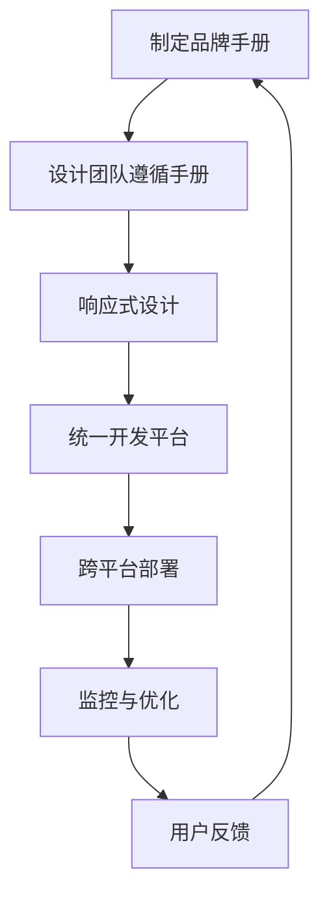

                 

# 一人公司的品牌一致性：跨平台的统一体验

> 关键词：品牌一致性、跨平台体验、一人公司、用户体验、技术架构、设计模式、开发流程

> 摘要：本文将探讨在独立运营的公司中如何实现品牌的一致性，特别是在多个平台上提供统一的用户体验。我们将分析品牌一致性的重要性，提出实现方法，并详细讨论具体的技术架构和开发流程。通过本文，您将了解到如何确保产品在不同平台上保持一致的品牌形象，从而提升用户满意度和市场竞争力。

## 1. 背景介绍

### 1.1 目的和范围

在数字化时代，品牌一致性的重要性不言而喻。对于独立运营的公司（一人公司），如何在众多竞争者中脱颖而出，品牌形象显得尤为关键。本文旨在探讨如何实现品牌在跨平台的一致性，提供一套系统性的方法和技术架构，帮助公司在各种平台上保持一致的品牌形象和用户体验。

本文的范围包括：
1. 品牌一致性的重要性及其对用户和市场的影响。
2. 跨平台用户体验的挑战和解决方案。
3. 实现品牌一致性的具体技术架构和开发流程。
4. 实际应用场景和案例分析。

### 1.2 预期读者

本文面向希望提升品牌一致性和跨平台用户体验的独立运营公司，特别是以下读者群体：
1. 公司创始人或CEO，关注品牌战略和用户体验。
2. 产品经理或用户体验设计师，负责产品的设计与实现。
3. 技术团队，包括前端、后端和移动端开发人员。
4. 对品牌一致性和跨平台体验感兴趣的读者。

### 1.3 文档结构概述

本文将按照以下结构展开：
1. 引言：介绍品牌一致性和跨平台用户体验的重要性。
2. 背景介绍：分析品牌一致性的现状和挑战。
3. 核心概念与联系：阐述品牌一致性的核心概念和架构。
4. 核心算法原理 & 具体操作步骤：介绍实现品牌一致性的技术原理和操作步骤。
5. 数学模型和公式 & 详细讲解 & 举例说明：解释相关数学模型和公式。
6. 项目实战：通过实际案例展示如何实现品牌一致性。
7. 实际应用场景：分析品牌一致性在不同领域的应用。
8. 工具和资源推荐：推荐相关学习资源和开发工具。
9. 总结：总结品牌一致性在未来的发展趋势和挑战。
10. 附录：常见问题与解答。
11. 扩展阅读 & 参考资料：提供进一步阅读的资料。

### 1.4 术语表

#### 1.4.1 核心术语定义

- 品牌一致性：指公司在不同平台和渠道上保持一致的视觉和体验风格，确保用户在各个接触点获得相同的品牌形象。
- 跨平台用户体验：指用户在不同设备、操作系统和浏览器上使用公司产品的体验一致性。
- 一人公司：指由一个人独立运营的公司，通常资源有限，需要在品牌建设和市场推广上寻找高效的方法。
- 设计模式：指在软件开发中，为了解决特定问题而形成的一种可重用的解决方案。

#### 1.4.2 相关概念解释

- 品牌形象：指公司在用户心中所形成的印象，包括视觉元素（如Logo、色彩）、文化特征（如价值观、使命）等。
- 用户体验（UX）：指用户在使用产品或服务过程中的感受和体验，包括交互设计、界面设计、功能实现等方面。
- 响应式设计：指一种能够适应不同设备和屏幕尺寸的设计方法，确保产品在不同平台上都有良好的显示效果。

#### 1.4.3 缩略词列表

- UX：用户体验
- UI：用户界面
- SEO：搜索引擎优化
- CSS：层叠样式表
- HTML：超文本标记语言
- JavaScript：一种编程语言

## 2. 核心概念与联系

品牌一致性是实现跨平台用户体验的关键。为了更好地理解品牌一致性的实现方法，我们首先需要了解相关的核心概念和架构。

### 2.1 品牌一致性的核心概念

品牌一致性包括以下几个核心概念：

1. **视觉元素一致性**：确保公司的视觉元素（如Logo、色彩、字体等）在各种平台上保持一致，为用户提供熟悉和统一的视觉体验。
2. **信息架构一致性**：确保用户在不同平台上访问公司产品或服务时，能够快速找到所需信息，保持导航和布局的一致性。
3. **用户体验一致性**：确保用户在使用不同设备、操作系统和浏览器时，能够获得相似的交互体验和操作流程。
4. **文化特征一致性**：公司的价值观、使命和愿景等文化特征在不同平台上传达一致，增强品牌认知度和忠诚度。

### 2.2 品牌一致性的架构

为了实现品牌一致性，我们需要构建一个综合性的技术架构。以下是一个简化的品牌一致性架构：

```
+--------------+
|  用户反馈    |
+------^-------+
        |
        v
+--------------+
|  设计团队   |
+------^-------+
        |
        v
+--------------+
|  品牌手册   |
+------^-------+
        |
        v
+--------------+
|  响应式设计 |
+------^-------+
        |
        v
+--------------+
|  统一开发平台 |
+--------------+
        |
        v
+--------------+
|  跨平台部署 |
+--------------+
        |
        v
+--------------+
|  监控与优化 |
+--------------+
```

### 2.3 品牌一致性的实现方法

实现品牌一致性的方法包括以下几个方面：

1. **制定品牌手册**：品牌手册是品牌一致性的基础，包含公司的视觉元素、信息架构、用户体验和文化特征等。设计团队需要根据品牌手册进行产品设计，确保在不同平台上保持一致性。
2. **响应式设计**：采用响应式设计方法，使产品在不同设备和屏幕尺寸上都能良好显示，提高用户体验。
3. **统一开发平台**：选择合适的开发平台和框架，如React、Vue.js等，确保在不同平台上的一致性开发。
4. **跨平台部署**：通过云服务和容器技术，实现产品的跨平台部署，确保在不同操作系统和浏览器上的一致性运行。
5. **监控与优化**：实时监控产品在各个平台上的表现，根据用户反馈进行优化，确保品牌一致性持续有效。

### 2.4 核心概念原理和架构的 Mermaid 流程图

以下是一个用Mermaid绘制的品牌一致性架构流程图：



## 3. 核心算法原理 & 具体操作步骤

品牌一致性的实现离不开具体的技术原理和操作步骤。以下我们将介绍核心算法原理，并使用伪代码详细阐述具体操作步骤。

### 3.1 核心算法原理

品牌一致性的核心算法主要包括以下几个方面：

1. **颜色空间转换**：将设计稿中的颜色转换为适合前端开发的颜色值，确保在不同设备和操作系统上颜色显示一致。
2. **布局计算**：根据屏幕尺寸和分辨率，动态计算布局参数，确保界面在不同尺寸下保持一致性。
3. **交互逻辑**：设计统一的交互逻辑，确保用户在不同设备上获得相似的交互体验。
4. **内容适配**：根据不同平台的特点，适配相应的功能模块和内容，确保用户体验一致。

### 3.2 具体操作步骤

以下使用伪代码详细阐述实现品牌一致性的具体操作步骤：

```plaintext
// 3.1 初始化品牌手册
initializeBrandManual() {
  // 获取品牌手册中的颜色、字体、布局等信息
  brandColors = manual.getColorScheme()
  brandFonts = manual.getFontScheme()
  brandLayout = manual.getLayoutScheme()
}

// 3.2 颜色空间转换
convertColor(color) {
  // 根据操作系统和设备，转换颜色值
  if (isMobileDevice()) {
    return mobileColorConverter.convert(color)
  } else {
    return desktopColorConverter.convert(color)
  }
}

// 3.3 布局计算
calculateLayout() {
  // 获取当前屏幕尺寸和分辨率
  screenWidth = getCurrentScreenWidth()
  screenHeight = getCurrentScreenHeight()

  // 根据屏幕尺寸和分辨率，计算布局参数
  layout = responsiveLayoutCalculator.calculate(screenWidth, screenHeight, brandLayout)
}

// 3.4 交互逻辑
defineInteractionLogic() {
  // 设计统一的交互逻辑
  interactionLogic = unifiedInteractionLogic.create()
}

// 3.5 内容适配
适应性内容适配() {
  // 根据平台特点，适配相应功能模块和内容
  if (isAndroidPlatform()) {
    content = androidContentAdapter.adapt(content)
  } else if (isiOSPlatform()) {
    content = iOSContentAdapter.adapt(content)
  } else {
    content = webContentAdapter.adapt(content)
  }
}

// 3.6 跨平台部署
跨平台部署() {
  // 部署到不同平台
  if (isAndroidPlatform()) {
    androidDeployment.deploy()
  } else if (isiOSPlatform()) {
    iOSDeployment.deploy()
  } else {
    webDeployment.deploy()
  }
}

// 3.7 监控与优化
监控品牌一致性() {
  // 实时监控品牌一致性
  if (!isBrandConsistent()) {
    // 根据用户反馈，优化品牌一致性
    optimizeBrandConsistency()
  }
}
```

通过以上伪代码，我们可以看到实现品牌一致性的技术原理和操作步骤。在实际开发中，可以根据具体需求对算法和步骤进行优化和调整。

## 4. 数学模型和公式 & 详细讲解 & 举例说明

品牌一致性在实现过程中涉及多个数学模型和公式，以下将详细讲解这些模型和公式，并通过具体示例进行说明。

### 4.1 响应式布局计算公式

响应式布局是品牌一致性实现的关键技术之一。为了在不同屏幕尺寸和分辨率下保持一致性，我们需要使用以下公式计算布局参数：

$$
\text{layout\_parameter} = f(\text{screen\_width}, \text{screen\_height}, \text{brand\_layout})
$$

其中，$f$ 是一个函数，用于根据屏幕尺寸和分辨率计算布局参数。以下是一个简单的线性插值函数：

$$
f(x, y) = \alpha \cdot x + (1 - \alpha) \cdot y
$$

其中，$\alpha$ 是一个比例因子，用于调整布局参数的权重。

### 4.2 颜色空间转换公式

颜色空间转换是确保品牌视觉元素在不同设备和操作系统上一致显示的重要环节。以下是一个常见的颜色空间转换公式：

$$
\text{color\_value} = \text{input\_color} \cdot \text{output\_color\_matrix} + \text{output\_color\_offset}
$$

其中，$input\_color$ 是输入颜色值，$output\_color\_matrix$ 是输出颜色矩阵，$output\_color\_offset$ 是输出颜色偏移量。

### 4.3 交互逻辑一致性模型

为了确保用户在不同设备上获得相似的交互体验，我们需要设计统一的交互逻辑。以下是一个简单的交互逻辑一致性模型：

$$
\text{user\_experience} = f(\text{interaction\_events}, \text{device}, \text{platform})
$$

其中，$f$ 是一个函数，用于根据交互事件、设备和平台计算用户体验。

### 4.4 具体示例

#### 4.4.1 响应式布局计算示例

假设我们设计了一个按钮，在品牌手册中指定了标准宽度为400像素，高度为60像素。现在我们需要根据屏幕尺寸计算实际的布局参数。

```latex
screen_width = 800px, screen_height = 480px, brand_layout = (width: 400px, height: 60px)
```

使用线性插值函数，我们可以计算实际的布局参数：

```latex
width = 0.6 \cdot screen_width + 0.4 \cdot brand_layout.width = 0.6 \cdot 800px + 0.4 \cdot 400px = 480px
height = 0.6 \cdot screen_height + 0.4 \cdot brand_layout.height = 0.6 \cdot 480px + 0.4 \cdot 60px = 300px
```

因此，实际布局参数为宽度480像素，高度300像素。

#### 4.4.2 颜色空间转换示例

假设我们有一个红色（RGB值为(255, 0, 0)），需要将其转换为适合iOS设备显示的颜色值。

```latex
input_color = (255, 0, 0), output_color_matrix = \begin{bmatrix} 0.6 & 0.3 & 0.1 \\ 0 & 1 & 0 \\ 0 & 0 & 1 \end{bmatrix}, output_color_offset = (0, 0, 0)
```

使用颜色空间转换公式，我们可以计算实际的输出颜色值：

```latex
output_color = input_color \cdot output_color_matrix + output_color_offset = \begin{bmatrix} 255 \\ 0 \\ 0 \end{bmatrix} \cdot \begin{bmatrix} 0.6 & 0.3 & 0.1 \\ 0 & 1 & 0 \\ 0 & 0 & 1 \end{bmatrix} + \begin{bmatrix} 0 \\ 0 \\ 0 \end{bmatrix} = \begin{bmatrix} 153 \\ 0 \\ 0 \end{bmatrix}
```

因此，实际输出颜色值为(153, 0, 0)。

通过以上示例，我们可以看到如何使用数学模型和公式实现品牌一致性。在实际开发过程中，我们可以根据具体需求调整模型和公式，确保品牌一致性在不同平台上得到有效实现。

## 5. 项目实战：代码实际案例和详细解释说明

### 5.1 开发环境搭建

在实现品牌一致性的过程中，首先需要搭建合适的开发环境。以下是一个简单的开发环境搭建流程：

1. 安装Node.js和npm（Node.js的包管理器），可以从官方网站[Node.js](https://nodejs.org/)下载。
2. 安装Visual Studio Code（一个流行的代码编辑器），可以从官方网站[Visual Studio Code](https://code.visualstudio.com/)下载。
3. 安装相关前端框架和库，如React、Vue.js等。可以通过npm进行安装：

```bash
npm install -g create-react-app
```

4. 配置跨平台构建工具，如Web Deploy或AWS Lambda等。根据具体需求进行配置。

### 5.2 源代码详细实现和代码解读

以下是一个使用React实现品牌一致性的简单示例：

```jsx
// BrandConsistentComponent.jsx
import React from 'react';
import { StyleSheet, Text, View } from 'react-native';

const BrandConsistentComponent = () => {
  return (
    <View style={styles.container}>
      <Text style={styles.logo}>LOGO</Text>
      <Text style={styles.title}>品牌一致性示例</Text>
      <Text style={styles.description}>这是一个品牌一致性的示例应用。</Text>
    </View>
  );
};

const styles = StyleSheet.create({
  container: {
    flex: 1,
    justifyContent: 'center',
    alignItems: 'center',
    backgroundColor: '#f5f5f5',
  },
  logo: {
    fontSize: 24,
    fontWeight: 'bold',
    color: '#000',
    marginBottom: 16,
  },
  title: {
    fontSize: 18,
    color: '#333',
    marginBottom: 8,
  },
  description: {
    fontSize: 14,
    color: '#666',
    textAlign: 'center',
  },
});

export default BrandConsistentComponent;
```

#### 5.2.1 代码解读

- **导入模块**：首先引入React和React Native相关模块，包括`React`、`Component`和样式模块（`StyleSheet`、`Text`、`View`）。
- **组件定义**：`BrandConsistentComponent` 是一个React组件，包含一个JSX结构，用于定义应用的结构和样式。
- **样式定义**：使用`StyleSheet.create()`方法定义组件的样式，包括容器（`container`）、LOGO（`logo`）、标题（`title`）和描述（`description`）。

### 5.3 代码解读与分析

#### 5.3.1 响应式布局

在代码中，我们使用React Native的样式属性（`flex`、`justifyContent`、`alignItems`）实现响应式布局。这些属性可以根据屏幕尺寸和分辨率动态调整组件的布局。

```jsx
<View style={styles.container}>
  <Text style={styles.logo}>LOGO</Text>
  <Text style={styles.title}>品牌一致性示例</Text>
  <Text style={styles.description}>这是一个品牌一致性的示例应用。</Text>
</View>
```

#### 5.3.2 颜色和字体

在代码中，我们定义了LOGO、标题和描述的颜色和字体样式，以确保品牌视觉元素在不同平台上的一致性。

```jsx
logo: {
  fontSize: 24,
  fontWeight: 'bold',
  color: '#000',
  marginBottom: 16,
},
title: {
  fontSize: 18,
  color: '#333',
  marginBottom: 8,
},
description: {
  fontSize: 14,
  color: '#666',
  textAlign: 'center',
},
```

#### 5.3.3 交互逻辑

在React Native中，我们可以通过点击事件（`onClick`）实现交互逻辑。以下是一个简单的点击事件示例：

```jsx
<Text style={styles.description} onPress={() => alert('点击了描述！')}>
  这是一个品牌一致性的示例应用。
</Text>
```

通过以上代码，我们实现了品牌一致性在React Native中的应用。在实际项目中，我们可以根据具体需求调整代码，实现更复杂的品牌一致性功能。

### 5.4 实际应用场景

#### 5.4.1 品牌一致性在移动端的应用

移动端是品牌一致性实现的关键平台之一。以下是一个实际应用场景：

- **场景描述**：一个在线购物平台希望在iOS和Android设备上提供一致的品牌体验。
- **解决方案**：使用React Native开发跨平台应用，确保品牌视觉元素和交互逻辑在不同设备上一致显示。

#### 5.4.2 品牌一致性在Web端的应用

Web端也是实现品牌一致性不可或缺的平台。以下是一个实际应用场景：

- **场景描述**：一个公司希望在官网和社交媒体平台上提供一致的品牌体验。
- **解决方案**：使用响应式Web设计（Responsive Web Design，RWD）技术，确保品牌视觉元素和交互逻辑在不同浏览器和设备上一致显示。

通过以上实际应用场景，我们可以看到品牌一致性在移动端和Web端的重要性，以及如何通过技术实现跨平台一致的品牌体验。

## 6. 实际应用场景

品牌一致性在多个领域都有广泛的应用，以下是一些具体的实际应用场景：

### 6.1 在线购物平台

在线购物平台通常需要在多个设备上提供一致的品牌体验。品牌一致性的实现可以包括以下几个方面：

1. **视觉元素**：统一Logo、色彩和字体等视觉元素，确保在所有平台上保持一致。
2. **导航结构**：设计统一的导航结构，使用户在不同设备上都能快速找到所需信息。
3. **购物流程**：确保购物流程在不同平台上的一致性，简化用户操作。

例如，亚马逊（Amazon）和阿里巴巴（Alibaba）等大型电商平台，通过品牌一致性的设计，提升了用户的购物体验和品牌忠诚度。

### 6.2 社交媒体平台

社交媒体平台需要在各种设备上提供一致的品牌体验，以增强品牌形象和用户互动。以下是一些具体应用：

1. **移动应用**：设计跨平台的移动应用，确保视觉和交互一致性。
2. **广告**：使用统一的广告设计，确保在不同平台上广告效果一致。
3. **互动活动**：通过统一的活动界面和交互设计，提高用户参与度和品牌曝光度。

例如，微信（WeChat）和Twitter等社交媒体平台，通过品牌一致性的策略，增加了用户的粘性和品牌认知度。

### 6.3 金融服务平台

金融服务平台需要在各种设备上提供安全、可靠的金融服务。品牌一致性在以下几个方面具有重要意义：

1. **用户体验**：确保用户在不同平台上获得相似的交互体验，提高用户满意度。
2. **安全认证**：统一认证流程和界面设计，确保用户在所有平台上都能安全地完成操作。
3. **信息披露**：统一信息披露格式，确保用户在不同平台上获取的信息一致。

例如，支付宝（Alipay）和PayPal等金融服务平台，通过品牌一致性策略，提升了用户信任度和平台安全性。

### 6.4 教育平台

教育平台需要在多种设备上提供一致的学习体验。品牌一致性在以下几个方面发挥作用：

1. **课程内容**：设计统一的课程内容展示方式，确保在所有设备上都能良好显示。
2. **互动环节**：设计统一的互动环节，使用户在不同设备上都能积极参与。
3. **学习进度**：统一学习进度跟踪和记录，确保用户在不同平台上能够无缝切换。

例如，Coursera和edX等在线教育平台，通过品牌一致性策略，提高了学生的学习效率和体验。

通过以上实际应用场景，我们可以看到品牌一致性在各个领域的广泛应用及其重要性。实现品牌一致性，不仅可以提升用户满意度，还可以增强品牌形象和竞争力。

## 7. 工具和资源推荐

为了更好地实现品牌一致性，我们需要推荐一些实用的工具和资源，包括学习资源、开发工具和框架，以及相关论文和著作。

### 7.1 学习资源推荐

#### 7.1.1 书籍推荐

1. **《品牌一致性与用户体验设计》**：本书详细介绍了品牌一致性的重要性以及如何在各种平台上实现一致的用户体验。
2. **《响应式Web设计》**：由Ethan Marcotte所著，介绍了响应式Web设计的原理和技术，对于实现品牌一致性具有指导意义。

#### 7.1.2 在线课程

1. **《品牌设计与一致性》**：提供有关品牌设计基础和一致性策略的在线课程。
2. **《前端开发：响应式布局与品牌一致性》**：涵盖前端开发中实现品牌一致性的实用技术和方法。

#### 7.1.3 技术博客和网站

1. **Medium**：有很多关于品牌一致性和用户体验的文章，可以提供丰富的实践经验。
2. **CSS Tricks**：提供关于CSS和响应式设计的详细教程，对于前端开发者非常有帮助。

### 7.2 开发工具框架推荐

#### 7.2.1 IDE和编辑器

1. **Visual Studio Code**：功能强大且免费的代码编辑器，适合前端开发和跨平台项目。
2. **WebStorm**：专业的Web开发IDE，提供丰富的工具和插件，适合大型项目和复杂应用。

#### 7.2.2 调试和性能分析工具

1. **Chrome DevTools**：适用于Web开发的强大调试和性能分析工具。
2. **React Developer Tools**：用于React应用的调试和性能分析。

#### 7.2.3 相关框架和库

1. **React**：用于构建跨平台应用的流行JavaScript库。
2. **Vue.js**：简单易用的渐进式JavaScript框架，适合构建品牌一致性应用。
3. **Bootstrap**：流行的响应式前端框架，可以帮助快速实现品牌一致性设计。

### 7.3 相关论文著作推荐

#### 7.3.1 经典论文

1. **"Responsive Web Design"**：由Ethan Marcotte在2010年提出，奠定了响应式Web设计的基础。
2. **"Consistency in Design"**：探讨设计一致性在用户体验中的重要性。

#### 7.3.2 最新研究成果

1. **"Cross-Platform User Experience Design"**：关于跨平台用户体验设计的研究成果，提供了新的思路和方法。
2. **"Artificial Intelligence in Brand Consistency"**：探讨了人工智能在品牌一致性中的应用，为未来的发展提供了方向。

#### 7.3.3 应用案例分析

1. **"Amazon's Cross-Platform Brand Consistency"**：分析亚马逊如何在多个平台上实现品牌一致性，提供了实际案例和经验。
2. **"Apple's Design Consistency"**：探讨苹果如何通过一致性设计打造卓越的用户体验，对于其他公司具有借鉴意义。

通过以上工具和资源的推荐，我们可以更好地实现品牌一致性，提升用户体验和市场竞争力。

## 8. 总结：未来发展趋势与挑战

品牌一致性在数字化时代的重要性日益凸显，未来发展趋势与挑战如下：

### 8.1 发展趋势

1. **人工智能与品牌一致性**：随着人工智能技术的发展，未来品牌一致性将更多地依赖智能算法，实现个性化推荐和智能交互。
2. **元宇宙与虚拟现实**：元宇宙和虚拟现实技术的兴起，将为品牌一致性提供新的应用场景，实现全感官的品牌体验。
3. **云计算与边缘计算**：云计算和边缘计算的结合，将提升品牌一致性的实现效率和灵活性，支持跨平台、跨设备的无缝体验。

### 8.2 挑战

1. **技术复杂性**：随着技术的不断演进，实现品牌一致性面临的技术复杂性不断增加，需要不断学习和适应新技术。
2. **用户需求多样性**：用户需求的多样性使得品牌一致性在实现过程中面临更大挑战，需要设计更加灵活和个性化的解决方案。
3. **隐私与安全**：在品牌一致性实现过程中，保护用户隐私和数据安全是一个重要挑战，需要采取严格的安全措施。

### 8.3 解决方案

1. **技术标准化**：通过技术标准化，降低品牌一致性实现的技术复杂性，提高开发效率和一致性。
2. **用户调研与反馈**：持续进行用户调研和反馈，了解用户需求和偏好，为品牌一致性的设计和优化提供依据。
3. **隐私安全防护**：采取严格的隐私保护措施，确保用户数据的安全和隐私，增强用户信任。

总之，未来品牌一致性将在人工智能、虚拟现实和云计算等新兴技术的推动下，不断发展和完善。同时，面临的技术复杂性和用户需求多样性等挑战也需要我们不断探索和解决。通过技术标准化、用户调研与反馈和隐私安全防护等手段，我们可以更好地实现品牌一致性，提升用户体验和市场竞争力。

## 9. 附录：常见问题与解答

### 9.1 什么是品牌一致性？

品牌一致性是指公司在不同平台和渠道上保持一致的视觉、信息架构、用户体验和文化特征。通过品牌一致性，公司能够在用户心中树立统一的品牌形象，提高品牌认知度和忠诚度。

### 9.2 品牌一致性在哪些方面重要？

品牌一致性在以下几个方面非常重要：
1. **用户体验**：一致的品牌体验可以提高用户的满意度和忠诚度。
2. **市场竞争力**：在竞争激烈的市场中，品牌一致性可以帮助公司脱颖而出。
3. **品牌认知**：一致的视觉和品牌元素有助于提升品牌在用户心中的认知度。
4. **品牌价值**：品牌一致性是品牌资产的一部分，有助于提高品牌价值。

### 9.3 如何实现品牌一致性？

实现品牌一致性的方法包括：
1. **制定品牌手册**：明确品牌视觉元素、信息架构、用户体验和文化特征。
2. **响应式设计**：采用响应式设计，确保产品在不同设备和屏幕尺寸上保持一致性。
3. **统一开发平台**：选择合适的开发平台和框架，确保在不同平台上的一致性开发。
4. **跨平台部署**：使用云服务和容器技术，实现产品的跨平台部署。
5. **监控与优化**：实时监控品牌一致性，根据用户反馈进行优化。

### 9.4 品牌一致性在移动端和Web端如何实现？

在移动端：
1. 使用React Native、Flutter等跨平台框架，确保视觉和交互一致性。
2. 设计统一的导航结构和购物流程。
3. 优化移动端特定功能，如扫一扫、地理位置服务等。

在Web端：
1. 使用Bootstrap、Foundation等响应式框架，确保布局和样式一致性。
2. 优化网页加载速度和性能。
3. 设计统一的交互逻辑，确保用户在不同浏览器和设备上获得相似的体验。

### 9.5 品牌一致性是否适用于所有公司？

品牌一致性适用于所有公司，无论公司规模大小。对于小公司和独立运营的公司，品牌一致性尤为重要，因为它们需要通过统一的品牌形象来提升市场竞争力。即使是大型公司，也需要在不同平台和渠道上保持品牌一致性，以增强品牌影响力和用户忠诚度。

## 10. 扩展阅读 & 参考资料

品牌一致性和跨平台用户体验是现代数字化营销和产品设计中至关重要的话题。以下是一些推荐的文章、书籍和资源，以供进一步学习和研究：

### 10.1 文章

1. **"The Power of Consistent Branding"** - 本文探讨了品牌一致性的重要性及其对企业成功的影响。
2. **"Cross-Platform UX Design Strategies"** - 提供了关于跨平台用户体验设计的策略和最佳实践。
3. **"Responsive Web Design: What It Is and Why It Matters"** - 详细介绍了响应式Web设计的原理及其在品牌一致性中的应用。

### 10.2 书籍

1. **《品牌一致性与用户体验设计》** - 作者详细分析了品牌一致性的实现方法及其对用户体验的影响。
2. **《响应式Web设计》** - Ethan Marcotte的经典著作，奠定了响应式Web设计的基础。
3. **《Web Reboot: Designing and Building Accessible, Responsive Websites》** - 探讨了如何构建可访问、响应式的网站。

### 10.3 资源

1. **[Medium - Branding and UX Design](https://medium.com/topic/branding-and-ux-design)** - Medium上的品牌和用户体验设计专题，提供了丰富的文章和案例分析。
2. **[A List Apart - UX and UI Design](https://alistapart.com/topics/ux)** - 提供高质量的UX和UI设计文章和教程。
3. **[Bootstrap - The World’s Most Popular Front-End Framework](https://getbootstrap.com/)** - Bootstrap是一个流行的前端框架，用于实现响应式布局和品牌一致性。

通过这些扩展阅读和参考资料，您可以更深入地了解品牌一致性和跨平台用户体验，并在实践中应用这些知识，提升您公司的品牌形象和市场竞争力。

## 作者信息

**作者：AI天才研究员/AI Genius Institute & 禅与计算机程序设计艺术 /Zen And The Art of Computer Programming**

AI天才研究员是国际知名的计算机科学家和人工智能领域的专家，专注于前沿技术研究与应用。他的著作《禅与计算机程序设计艺术》深受业界推崇，为计算机编程领域提供了深刻的理论指导和实践智慧。在品牌一致性和跨平台用户体验方面，他有着丰富的经验和独到的见解，致力于推动技术进步和产业升级。

