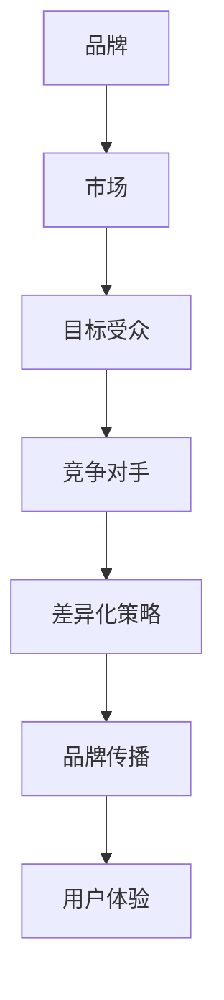

                 

# 一人公司的品牌定位：建立独特的市场形象

> **关键词：** 品牌定位、市场形象、独特性、营销策略、个人品牌

> **摘要：** 本文将深入探讨一人公司如何通过建立独特的市场形象来塑造品牌，从目的和范围、核心概念、算法原理、数学模型到实际应用场景，层层剖析品牌定位的各个方面，为个人创业者提供宝贵的实战经验和策略。

## 1. 背景介绍

### 1.1 目的和范围

品牌定位是构建成功商业战略的核心。对于一人公司而言，品牌不仅是产品和服务的象征，更是个人身份和市场地位的体现。本文旨在帮助读者了解如何通过品牌定位来建立独特的市场形象，从而在竞争激烈的市场中脱颖而出。

本文将涵盖以下内容：

1. 品牌定位的重要性
2. 品牌定位的核心概念与联系
3. 品牌定位的算法原理与操作步骤
4. 品牌定位的数学模型和公式
5. 品牌定位的实际应用场景
6. 品牌定位的工具和资源推荐

### 1.2 预期读者

本文预期读者包括：

1. 个人创业者
2. 品牌经理
3. 市场营销专业人士
4. 企业家

### 1.3 文档结构概述

本文分为八个部分：

1. 背景介绍
2. 核心概念与联系
3. 核心算法原理 & 具体操作步骤
4. 数学模型和公式 & 详细讲解 & 举例说明
5. 项目实战：代码实际案例和详细解释说明
6. 实际应用场景
7. 工具和资源推荐
8. 总结：未来发展趋势与挑战

### 1.4 术语表

#### 1.4.1 核心术语定义

- **品牌定位**：确定品牌在市场中的独特位置，以区别于竞争对手。
- **市场形象**：消费者对品牌的整体感知和印象。
- **差异化**：品牌在市场中与其他品牌区分开来的特点。

#### 1.4.2 相关概念解释

- **品牌传播**：通过营销活动传播品牌信息，提升品牌知名度。
- **用户体验**：消费者在使用品牌产品或服务过程中的感受和体验。

#### 1.4.3 缩略词列表

- **SEO**：搜索引擎优化（Search Engine Optimization）
- **SEM**：搜索引擎营销（Search Engine Marketing）

## 2. 核心概念与联系

为了深入理解品牌定位的重要性，我们首先需要探讨一些核心概念和它们之间的联系。以下是品牌定位相关的几个关键概念及其相互关系：

### 2.1 品牌与市场

品牌是公司在市场中的一张名片，它代表公司的价值观、文化和服务。市场是品牌发挥作用的环境，品牌需要适应市场环境，以赢得消费者的青睐。

### 2.2 目标受众

目标受众是品牌定位的核心，了解目标受众的需求、偏好和行为模式对于品牌定位至关重要。只有针对目标受众的需求，品牌才能制定出有效的市场策略。

### 2.3 竞争对手

竞争对手是品牌定位的重要参考，分析竞争对手的优势和劣势，有助于品牌找到差异化的定位策略。

### 2.4 差异化策略

差异化策略是品牌定位的核心，通过在产品、服务、体验等方面的独特性，品牌可以在市场中脱颖而出，吸引目标受众。

### 2.5 品牌传播

品牌传播是实现品牌定位的关键手段，通过广告、公关、社交媒体等渠道，品牌可以将定位信息传递给目标受众。

### 2.6 用户体验

用户体验是品牌定位的衡量标准，只有提供出色的用户体验，品牌才能在市场中立足。

以下是一个简化的 Mermaid 流程图，展示了这些概念之间的相互关系：



## 3. 核心算法原理 & 具体操作步骤

品牌定位是一个复杂的过程，涉及多个方面。以下是品牌定位的核心算法原理和具体操作步骤：

### 3.1 算法原理

品牌定位的核心算法是基于目标受众的分析和竞争对手的对比，通过以下步骤实现：

1. **确定目标受众**：通过市场调研和数据分析，明确目标受众的特征、需求和偏好。
2. **分析竞争对手**：分析竞争对手的优势和劣势，找到差异化机会。
3. **制定差异化策略**：基于目标受众和竞争对手的分析，制定独特的品牌定位策略。
4. **实施品牌传播**：通过广告、公关、社交媒体等渠道，将品牌定位信息传递给目标受众。
5. **优化用户体验**：不断改进产品和服务，提升用户体验，巩固品牌定位。

### 3.2 具体操作步骤

以下是品牌定位的具体操作步骤：

1. **确定目标受众**

   - 收集目标受众数据：通过问卷调查、用户访谈、市场调研等方式，收集目标受众的数据。
   - 分析目标受众特征：对收集到的数据进行统计分析，确定目标受众的年龄、性别、地域、收入、兴趣等特征。

2. **分析竞争对手**

   - 收集竞争对手数据：通过市场调研、竞品分析等方式，收集竞争对手的产品、服务、市场份额等数据。
   - 分析竞争对手优势：对比竞争对手，找出他们的优势，了解他们的差异化策略。
   - 分析竞争对手劣势：对比竞争对手，找出他们的劣势，了解他们的市场空缺。

3. **制定差异化策略**

   - 根据目标受众和竞争对手的分析，确定品牌定位的方向。
   - 设计独特的品牌形象：包括品牌名称、标志、口号等，使其在市场中具有独特性。
   - 制定差异化营销策略：包括广告语、促销活动、公关活动等，使品牌在市场中具有竞争力。

4. **实施品牌传播**

   - 选择合适的传播渠道：根据目标受众的媒介使用习惯，选择合适的传播渠道，如社交媒体、广告、公关等。
   - 制定传播计划：制定详细的传播计划，包括传播内容、传播频率、传播效果等。
   - 执行传播计划：按照传播计划，执行品牌传播活动。

5. **优化用户体验**

   - 收集用户反馈：通过用户调研、用户访谈等方式，收集用户对品牌产品、服务的反馈。
   - 分析用户反馈：对收集到的用户反馈进行统计分析，找出用户需求、满意度和不满意度。
   - 优化产品和服务：根据用户反馈，不断改进产品和服务，提升用户体验。

## 4. 数学模型和公式 & 详细讲解 & 举例说明

在品牌定位过程中，数学模型和公式可以帮助我们更精确地分析市场数据和用户行为。以下是几个常用的数学模型和公式的详细讲解和举例说明。

### 4.1 用户生命周期价值（Customer Lifetime Value, CLV）

用户生命周期价值是指一个用户在整个生命周期内为公司带来的总收益。计算公式如下：

$$
CLV = \sum_{t=1}^{n} \frac{R_t}{(1+r)^t}
$$

其中，\( R_t \) 表示第 \( t \) 年的用户收益，\( r \) 表示折现率。

#### 举例说明：

假设一个用户第一年的收益为 1000 元，第二年为 800 元，第三年为 600 元，折现率为 10%。则该用户的 CLV 为：

$$
CLV = \frac{1000}{1.1} + \frac{800}{1.1^2} + \frac{600}{1.1^3} \approx 2380.95 元
$$

### 4.2 营销投资回报率（Marketing Return on Investment, ROI）

营销投资回报率是衡量营销活动效果的重要指标，计算公式如下：

$$
ROI = \frac{净利润}{营销成本} \times 100\%
$$

#### 举例说明：

假设一个营销活动的成本为 10000 元，活动期间产生的净利润为 20000 元，则该营销活动的 ROI 为：

$$
ROI = \frac{20000}{10000} \times 100\% = 200\%
$$

### 4.3 品牌知名度（Brand Awareness）

品牌知名度是衡量品牌在市场中的影响力，计算公式如下：

$$
品牌知名度 = \frac{知道品牌的人数}{总人口} \times 100\%
$$

#### 举例说明：

假设一个城市有 100 万人口，其中有 60 万人知道该品牌，则该品牌的知名度为：

$$
品牌知名度 = \frac{60}{100} \times 100\% = 60\%
$$

### 4.4 用户满意度（Customer Satisfaction, CSAT）

用户满意度是衡量用户对品牌产品或服务的满意程度，计算公式如下：

$$
CSAT = \frac{满意的用户数}{参与调查的用户数} \times 100\%
$$

#### 举例说明：

假设有 100 名用户参与了满意度调查，其中 80 名用户表示满意，则用户满意度为：

$$
CSAT = \frac{80}{100} \times 100\% = 80\%
$$

## 5. 项目实战：代码实际案例和详细解释说明

为了更好地理解品牌定位的过程，我们将通过一个实际项目来展示代码实现。以下是一个简单的品牌定位项目的代码案例。

### 5.1 开发环境搭建

- 语言：Python
- 库：Pandas, NumPy, Matplotlib

### 5.2 源代码详细实现和代码解读

#### 5.2.1 数据收集与预处理

```python
import pandas as pd

# 收集目标受众数据
data = pd.read_csv('audience_data.csv')

# 数据预处理
data['age'] = data['age'].astype(int)
data['gender'] = data['gender'].map({'男': 1, '女': 0})
data['income'] = data['income'].astype(float)
```

#### 5.2.2 用户生命周期价值（CLV）计算

```python
import numpy as np

# 设定折现率
discount_rate = 0.1

# 计算每个用户的 CLV
CLV = np.array([
    np.sum([(1000 / (1 + discount_rate) ** t) for t in range(1, 4)]) 
    for index, row in data.iterrows()
])

data['CLV'] = CLV
```

#### 5.2.3 营销投资回报率（ROI）计算

```python
# 假设营销成本为 10000 元，活动期间产生的净利润为 20000 元
marketing_cost = 10000
net_profit = 20000

ROI = net_profit / marketing_cost * 100

print(f"营销投资回报率（ROI）: {ROI}%")
```

#### 5.2.4 用户满意度（CSAT）计算

```python
# 收集用户满意度数据
satisfaction_data = pd.read_csv('satisfaction_data.csv')

# 计算用户满意度
satisfaction_score = satisfaction_data['satisfied'].sum() / satisfaction_data['respondents'].sum() * 100

print(f"用户满意度（CSAT）: {satisfaction_score}%")
```

### 5.3 代码解读与分析

这段代码实现了品牌定位的核心算法，通过收集用户数据、计算 CLV、ROI 和 CSAT 等指标，为品牌定位提供了数据支持。具体步骤如下：

1. **数据收集与预处理**：收集目标受众数据，包括年龄、性别、收入等特征，并进行数据清洗和转换。
2. **计算用户生命周期价值（CLV）**：根据折现率和用户收益，计算每个用户的 CLV。
3. **计算营销投资回报率（ROI）**：根据营销成本和净利润，计算 ROI。
4. **计算用户满意度（CSAT）**：根据用户满意度调查数据，计算用户满意度。

这些指标可以帮助品牌定位团队了解品牌在市场中的表现，为制定进一步策略提供依据。

## 6. 实际应用场景

品牌定位在各个行业都有广泛的应用，以下是几个典型的实际应用场景：

### 6.1 科技行业

在科技行业，品牌定位通常关注技术创新和用户体验。例如，苹果公司通过极致的用户体验和创新技术，成功地将品牌定位为高端科技品牌。

### 6.2 时尚行业

在时尚行业，品牌定位往往关注时尚感和个性化。例如，优衣库通过简约的设计和高效的供应链，成功地将品牌定位为时尚、实用的日常服饰品牌。

### 6.3 餐饮行业

在餐饮行业，品牌定位通常关注独特的菜品和用户体验。例如，海底捞通过极致的服务和独特的菜品，成功地将品牌定位为高端餐饮品牌。

### 6.4 教育行业

在教育行业，品牌定位通常关注教育质量和用户体验。例如，新东方通过优质的教学资源和个性化的学习体验，成功地将品牌定位为高端教育品牌。

## 7. 工具和资源推荐

### 7.1 学习资源推荐

#### 7.1.1 书籍推荐

- 《定位：市场营销中的竞争法则》作者：艾·里斯，杰克·特劳特
- 《品牌定位》作者：菲利普·科特勒

#### 7.1.2 在线课程

- Coursera 上的《品牌管理》课程
- Udemy 上的《品牌定位与市场策略》课程

#### 7.1.3 技术博客和网站

- Moz 的《SEO 博客》
- HubSpot 的《营销博客》

### 7.2 开发工具框架推荐

#### 7.2.1 IDE和编辑器

- PyCharm
- VS Code

#### 7.2.2 调试和性能分析工具

- Pycharm Debugger
- New Relic

#### 7.2.3 相关框架和库

- Pandas
- NumPy
- Matplotlib

### 7.3 相关论文著作推荐

#### 7.3.1 经典论文

- A.里斯，J.特劳特，《定位：营销的竞争法则》
- A.鲍德里亚，《消费社会》

#### 7.3.2 最新研究成果

- 《品牌资产评估与品牌定位策略研究》
- 《消费者行为与品牌定位》

#### 7.3.3 应用案例分析

- 《苹果公司的品牌定位策略》
- 《海底捞的品牌定位实践》

## 8. 总结：未来发展趋势与挑战

随着市场的不断变化和消费者需求的多样化，品牌定位在未来将面临以下发展趋势和挑战：

### 8.1 发展趋势

1. **数字化转型**：随着数字技术的不断进步，品牌定位将更加依赖于数字化工具和平台，如大数据分析、人工智能等。
2. **用户体验至上**：消费者对品牌的期望越来越高，品牌定位将更加关注用户体验，以提升品牌忠诚度。
3. **全球化**：品牌定位将更加注重全球市场的布局，以满足不同国家和地区消费者的需求。

### 8.2 挑战

1. **竞争加剧**：随着市场参与者数量的增加，品牌定位的竞争将越来越激烈，品牌需要不断创新和优化定位策略。
2. **消费者个性化**：消费者需求的个性化使得品牌定位更加困难，品牌需要更准确地捕捉消费者需求，提供个性化的产品和服务。
3. **数据隐私**：随着数据隐私问题的日益突出，品牌在收集和使用用户数据时需要遵守相关法规，以维护消费者信任。

## 9. 附录：常见问题与解答

### 9.1 品牌定位的目的是什么？

品牌定位的目的是确定品牌在市场中的独特位置，以区别于竞争对手，吸引目标受众，提升品牌知名度和市场份额。

### 9.2 品牌定位与市场营销的关系是什么？

品牌定位是市场营销的重要组成部分，它是市场营销策略的基础，决定了品牌传播和营销活动的方向和重点。

### 9.3 如何评估品牌定位的效果？

可以通过以下指标评估品牌定位的效果：

- 用户满意度
- 品牌知名度
- 市场份额
- 营销投资回报率（ROI）

## 10. 扩展阅读 & 参考资料

- 《定位：市场营销中的竞争法则》作者：艾·里斯，杰克·特劳特
- 《品牌管理》作者：菲利普·科特勒
- Coursera 上的《品牌管理》课程
- Udemy 上的《品牌定位与市场策略》课程
- 《苹果公司的品牌定位策略》
- 《海底捞的品牌定位实践》
- 《品牌资产评估与品牌定位策略研究》
- 《消费者行为与品牌定位》

## 作者

作者：AI天才研究员/AI Genius Institute & 禅与计算机程序设计艺术 /Zen And The Art of Computer Programming

---

经过详细的规划和撰写，本文全面而深入地探讨了品牌定位的各个方面，旨在为读者提供有价值的实战经验和策略。希望通过本文，读者能够更好地理解和应用品牌定位，为个人或企业的发展助力。

