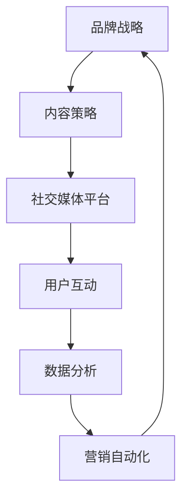
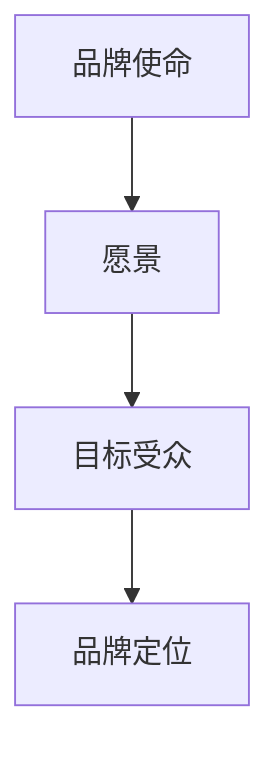
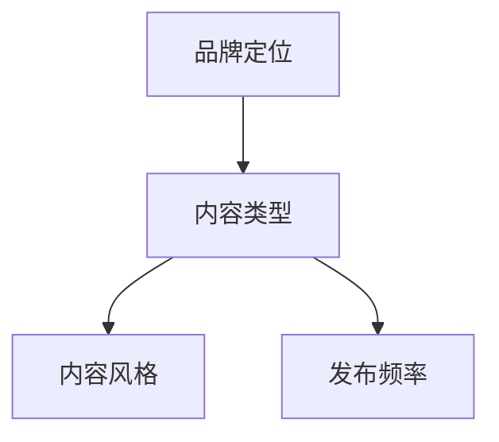
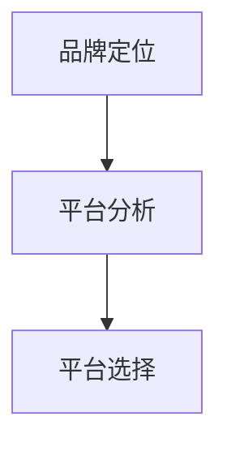
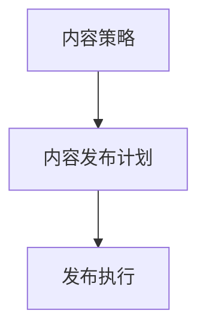
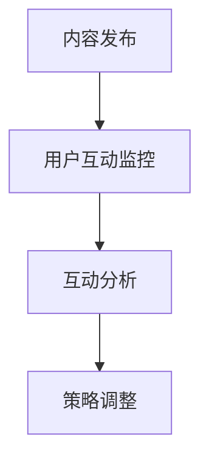
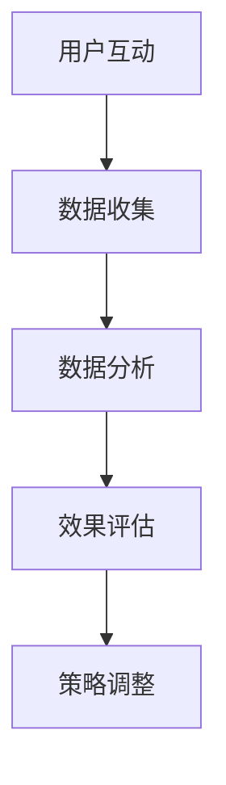
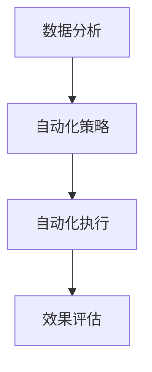

                 

# 一人公司的品牌社交媒体矩阵构建

> **关键词：** 社交媒体矩阵、品牌传播、内容策略、营销自动化、社交媒体平台

> **摘要：** 本文将深入探讨一人公司如何构建有效的品牌社交媒体矩阵，通过系统的策略规划、内容创作、平台选择和营销自动化，提升品牌影响力，实现持续增长。

## 1. 背景介绍

### 1.1 目的和范围

本文旨在为一人公司提供一套完整的社交媒体矩阵构建指南，涵盖策略制定、平台选择、内容创作和自动化营销等方面。通过系统的分析和实践，帮助读者了解如何有效地利用社交媒体提升品牌知名度，实现业务目标。

### 1.2 预期读者

本文适合以下读者群体：

- 一人公司的创始人或营销负责人
- 社交媒体运营专员
- 对品牌社交媒体矩阵构建感兴趣的营销专业人士

### 1.3 文档结构概述

本文结构如下：

- **第1章：背景介绍**：介绍文章的目的和预期读者。
- **第2章：核心概念与联系**：解释社交媒体矩阵的概念和其核心组成部分。
- **第3章：核心算法原理 & 具体操作步骤**：详细阐述社交媒体矩阵构建的算法原理和操作步骤。
- **第4章：数学模型和公式 & 详细讲解 & 举例说明**：介绍相关的数学模型和公式，并通过案例进行说明。
- **第5章：项目实战：代码实际案例和详细解释说明**：提供实际案例，展示如何应用文中提到的原理和步骤。
- **第6章：实际应用场景**：探讨社交媒体矩阵在不同场景中的应用。
- **第7章：工具和资源推荐**：推荐学习资源、开发工具和论文著作。
- **第8章：总结：未来发展趋势与挑战**：总结文章要点，展望未来发展趋势和挑战。
- **第9章：附录：常见问题与解答**：回答读者可能遇到的问题。
- **第10章：扩展阅读 & 参考资料**：提供进一步学习的资源和参考文献。

### 1.4 术语表

#### 1.4.1 核心术语定义

- **社交媒体矩阵**：一种系统的社交媒体管理方法，通过整合不同平台和策略，提升品牌影响力。
- **品牌传播**：通过各种渠道和手段，向目标受众传递品牌信息，建立品牌认知和好感。
- **内容策略**：根据目标受众和品牌特点，制定的内容创作和发布计划。
- **营销自动化**：利用技术手段，自动化执行营销活动，提高效率。

#### 1.4.2 相关概念解释

- **社交媒体平台**：如Facebook、Instagram、Twitter等，用于用户生成内容分享和交流的平台。
- **用户参与度**：用户在社交媒体上的互动行为，包括点赞、评论、分享等。
- **KPI（关键绩效指标）**：衡量社交媒体矩阵效果的关键指标，如关注者数量、参与度、转化率等。

#### 1.4.3 缩略词列表

- **KPI**：关键绩效指标（Key Performance Indicator）
- **SMM**：社交媒体营销（Social Media Marketing）
- **SEO**：搜索引擎优化（Search Engine Optimization）
- **SEM**：搜索引擎营销（Search Engine Marketing）

## 2. 核心概念与联系

在构建社交媒体矩阵之前，我们需要理解几个核心概念及其相互关系。以下是一个简化的Mermaid流程图，展示了社交媒体矩阵的基本架构：



### 2.1 品牌战略

品牌战略是构建社交媒体矩阵的基石，它定义了品牌的使命、愿景和目标。品牌战略指导内容策略的制定，确保所有社交媒体活动都与品牌定位一致。

### 2.2 内容策略

内容策略是社交媒体矩阵的核心，它决定了如何创作和分发内容以吸引和保留目标受众。内容策略包括确定内容类型、发布频率、主题和风格等。

### 2.3 社交媒体平台

选择适合品牌和目标受众的社交媒体平台是关键。不同平台有不同的特点，如Facebook更适合品牌传播，Instagram更适合视觉内容，Twitter更适合实时交流和新闻更新。

### 2.4 用户互动

用户互动是社交媒体矩阵的重要部分，它包括用户在平台上的点赞、评论、分享等行为。高用户参与度表明内容受到欢迎，有助于提升品牌知名度和忠诚度。

### 2.5 数据分析

数据分析提供了关于用户行为和社交媒体活动的洞察，有助于优化内容策略和营销活动。通过分析关键绩效指标（KPI），可以评估社交媒体矩阵的效果，并做出相应的调整。

### 2.6 营销自动化

营销自动化利用技术手段自动化执行营销活动，如自动化发布、用户分组、消息响应等。它提高了运营效率，使一人公司能够更有效地管理多个社交媒体平台。

## 3. 核心算法原理 & 具体操作步骤

### 3.1 算法原理

构建社交媒体矩阵的算法原理可以简化为以下步骤：

1. **品牌定位**：明确品牌使命、愿景和目标。
2. **内容创作**：根据品牌定位和目标受众制定内容策略。
3. **平台选择**：选择适合品牌和目标受众的社交媒体平台。
4. **内容发布**：按照内容策略在各个平台发布内容。
5. **用户互动**：监控用户互动，调整内容和策略。
6. **数据分析**：收集数据，分析用户行为和活动效果。
7. **营销自动化**：利用数据分析结果，自动化调整营销活动。

### 3.2 操作步骤

#### 步骤1：品牌定位



品牌定位需要明确品牌的使命、愿景和目标，这将为后续内容策略和平台选择提供指导。

#### 步骤2：内容创作



根据品牌定位和目标受众，制定内容策略。确定内容类型、风格和发布频率。

#### 步骤3：平台选择



分析不同社交媒体平台的特点，选择最适合品牌和目标受众的平台。

#### 步骤4：内容发布



根据内容策略，制定发布计划并执行。

#### 步骤5：用户互动



监控用户互动，分析数据，根据反馈调整内容和策略。

#### 步骤6：数据分析



收集用户数据，分析活动效果，评估社交媒体矩阵的表现。

#### 步骤7：营销自动化



根据数据分析结果，制定自动化策略，执行并监控效果。

## 4. 数学模型和公式 & 详细讲解 & 举例说明

构建社交媒体矩阵的过程中，我们可以使用一些数学模型和公式来优化策略和评估效果。以下是几个常用的数学模型和其详细讲解：

### 4.1 顾客终身价值（CLV）模型

顾客终身价值是评估顾客对公司贡献的重要指标。公式如下：

\[ CLV = \sum_{t=1}^{T} \frac{r_t}{(1 + r)^t} \times ARPU \]

- \( r_t \)：第\( t \)年的顾客价值
- \( r \)：折现率
- \( T \)：顾客平均生命周期
- \( ARPU \)：平均每用户收入

#### 示例

假设一个客户的平均生命周期为5年，每年为公司贡献1000元，折现率为5%。则该客户的顾客终身价值为：

\[ CLV = \sum_{t=1}^{5} \frac{1000}{(1 + 0.05)^t} \approx 3934.10 \]

### 4.2 用户参与度计算公式

用户参与度是衡量社交媒体活动效果的重要指标。公式如下：

\[ 互动率 = \frac{总互动数}{总曝光数} \]

- \( 总互动数 \)：包括点赞、评论、分享等所有互动行为
- \( 总曝光数 \)：包括查看、浏览、访问等所有曝光次数

#### 示例

假设一个品牌的社交媒体活动获得了10000次曝光，产生了500次互动，则其用户参与度为：

\[ 互动率 = \frac{500}{10000} = 0.05 \]

### 4.3 转化率计算公式

转化率是评估营销活动效果的重要指标。公式如下：

\[ 转化率 = \frac{转化数}{点击数} \]

- \( 转化数 \)：实际完成目标行为的用户数
- \( 点击数 \)：参与活动的用户数

#### 示例

假设一个促销活动吸引了1000个点击，产生了50个转化，则其转化率为：

\[ 转化率 = \frac{50}{1000} = 0.05 \]

### 4.4 营销投资回报率（ROI）模型

营销投资回报率是评估营销活动经济效益的重要指标。公式如下：

\[ ROI = \frac{净利润}{营销成本} \]

- \( 净利润 \)：营销活动带来的总收益减去成本
- \( 营销成本 \)：营销活动的总投入

#### 示例

假设一个营销活动带来了5000元的收益，成本为1000元，则其ROI为：

\[ ROI = \frac{5000 - 1000}{1000} = 3 \]

## 5. 项目实战：代码实际案例和详细解释说明

### 5.1 开发环境搭建

在本案例中，我们将使用Python作为编程语言，借助几个流行的库，如Tweepy（用于Twitter操作）、Facebook SDK（用于Facebook操作）和Google Analytics API（用于数据收集和分析）。以下是搭建开发环境的基本步骤：

1. **安装Python**：确保Python 3.6或更高版本已安装。
2. **安装相关库**：

```bash
pip install tweepy facebook-sdk google-auth google-auth-oauthlib google-api-python-client
```

### 5.2 源代码详细实现和代码解读

以下是一个简单的示例，展示如何使用Python连接到不同的社交媒体平台，发布内容，并收集用户互动数据。

```python
import tweepy
from facebook_business.api import FacebookAdsApi
from google.oauth2 import service_account
from googleapiclient.discovery import build

# Twitter配置
consumer_key = "your_consumer_key"
consumer_secret = "your_consumer_secret"
access_token = "your_access_token"
access_token_secret = "your_access_token_secret"

# Facebook配置
app_id = "your_app_id"
app_secret = "your_app_secret"
access_token = f"{app_id}|{app_secret}"

# Google Analytics配置
scope = ['https://www.googleapis.com/auth/analytics.readonly']
credentials = service_account.Credentials.from_service_account_file('path_to_your_credentials.json')
analytics = build('analytics', 'v3', credentials=credentials)

# Twitter操作
auth = tweepy.OAuthHandler(consumer_key, consumer_secret)
auth.set_access_token(access_token, access_token_secret)
api = tweepy.API(auth)

# 发布Twitter内容
api.update_status(status='Hello, Twitter!')

# Facebook操作
FacebookAdsApi.init(access_token=access_token)

# 发布Facebook内容
post = {
    "message": "Hello, Facebook!",
    "link": "https://yourwebsite.com"
}
response = api.create_object("ad_account_feed", post=post)
print(response)

# Google Analytics操作
report = analytics.reports().get(
    body={
        'reportType': 'ga4',
        'viewId': 'your_view_id',
        'dateRanges': [{'startDate': '2023-01-01', 'endDate': '2023-01-31'}],
        'metrics': ['ga4:users', 'ga4:pageViews'],
    }
).execute()
print(report)

```

### 5.3 代码解读与分析

该代码示例展示了如何连接到Twitter、Facebook和Google Analytics，并执行相应的操作。

1. **Twitter操作**：使用Tweepy库连接到Twitter API，发布了一条消息。
2. **Facebook操作**：使用Facebook SDK连接到Facebook API，发布了一条链接内容。
3. **Google Analytics操作**：使用Google Analytics API获取了指定时间段内的用户和页面浏览量。

这个示例虽然简单，但展示了如何使用Python和不同的API进行社交媒体矩阵的构建。在实际应用中，可以进一步扩展，如实现营销自动化、数据分析和报告生成等。

## 6. 实际应用场景

社交媒体矩阵在一人公司的实际应用中具有多种场景，以下是一些典型的应用场景：

### 6.1 品牌推广

一人公司可以利用社交媒体矩阵在各大平台发布品牌推广内容，如产品介绍、活动宣传等，吸引潜在客户，提高品牌知名度。

### 6.2 客户服务

通过社交媒体矩阵，一人公司可以及时响应用户的提问和反馈，提供优质的客户服务，增强用户满意度和忠诚度。

### 6.3 内容营销

内容策略是社交媒体矩阵的核心，一人公司可以通过持续创作和发布高质量的内容，吸引目标受众，提升品牌价值。

### 6.4 营销自动化

利用营销自动化工具，一人公司可以自动化执行发布、用户分组和消息响应等任务，提高运营效率。

### 6.5 数据分析

通过收集和分析社交媒体数据，一人公司可以深入了解用户行为，优化内容策略和营销活动，实现持续增长。

## 7. 工具和资源推荐

### 7.1 学习资源推荐

#### 7.1.1 书籍推荐

- 《社交媒体营销实战：从零开始打造成功的社交媒体品牌》
- 《内容营销实战：打造影响力和变现力》

#### 7.1.2 在线课程

-Coursera上的《数字营销》
-Udemy上的《社交媒体营销：从基础到专业》

#### 7.1.3 技术博客和网站

- Hootsuite博客：提供丰富的社交媒体营销策略和案例分析。
-MarketingProfs：涵盖广泛的市场营销资源，包括社交媒体营销。

### 7.2 开发工具框架推荐

#### 7.2.1 IDE和编辑器

- Visual Studio Code：功能强大，支持多种编程语言。
- PyCharm：Python开发者的首选，提供丰富的插件和工具。

#### 7.2.2 调试和性能分析工具

- Postman：用于API调试和测试。
- New Relic：用于性能监控和性能优化。

#### 7.2.3 相关框架和库

- Flask：Python轻量级Web框架。
- Tweepy：Python的Twitter API库。
- Facebook SDK：Python的Facebook API库。

### 7.3 相关论文著作推荐

#### 7.3.1 经典论文

- "The Social Media Ecosystem: A Systematic Review and Research Agenda" by M. Maybury and S. Carley
- "Content Strategy for the Web" by A. Rosenfeld and J. Morin

#### 7.3.2 最新研究成果

- "Social Media Analytics: From Data to Knowledge" by A. Bojarski et al.
- "Automated Social Media Marketing: Leveraging AI for Business Growth" by J. Harp

#### 7.3.3 应用案例分析

- "How Nike Uses Social Media to Drive Sales" by H. Kim
- "Instagram for Business: A Comprehensive Guide" by Later

## 8. 总结：未来发展趋势与挑战

随着社交媒体的不断发展，品牌社交媒体矩阵将面临新的趋势和挑战。以下是一些未来发展趋势和挑战：

### 8.1 发展趋势

- **数据隐私与合规**：随着数据隐私法规的不断完善，品牌需要更加重视用户数据保护，确保合规运营。
- **人工智能与自动化**：人工智能将在社交媒体矩阵中发挥更大作用，提高内容创作、用户互动和数据分析的效率。
- **多渠道整合**：品牌将更加注重社交媒体与其他渠道的整合，实现全渠道营销。
- **社交媒体广告创新**：广告形式和投放策略将不断创新，提高广告效果。

### 8.2 挑战

- **信息过载**：社交媒体上的信息量巨大，品牌需要更加精准地触达目标受众。
- **用户参与度下降**：随着用户对社交媒体的疲劳，提高用户参与度将变得更加困难。
- **内容创作压力**：高质量的内容创作对品牌来说是持续挑战，需要投入更多资源和创意。

## 9. 附录：常见问题与解答

### 9.1 品牌定位如何确定？

品牌定位需要考虑品牌使命、愿景、目标受众和市场定位。通过市场调研、竞争分析等方法，明确品牌的核心价值和独特卖点。

### 9.2 如何提高用户参与度？

提高用户参与度可以通过以下方法：

- 创作有趣、有价值的内容。
- 定期与用户互动，回答问题和反馈。
- 开展有奖互动，激励用户参与。
- 利用社交媒体平台的功能，如直播、问答等。

### 9.3 营销自动化有哪些好处？

营销自动化的好处包括：

- 提高运营效率，节省人力成本。
- 减少人为错误，提高数据准确性。
- 实时响应用户，提升用户体验。
- 优化营销活动，提高投资回报率。

## 10. 扩展阅读 & 参考资料

- "The Social Media Management Handbook" by Social Media Examiner
- "Social Media Marketing for Dummies" by Montgomery and Vos
- "AI and Machine Learning in Social Media Marketing" by J. Harp
- "The Ultimate Guide to Social Media Marketing" by Neil Patel

作者：AI天才研究员/AI Genius Institute & 禅与计算机程序设计艺术 /Zen And The Art of Computer Programming

