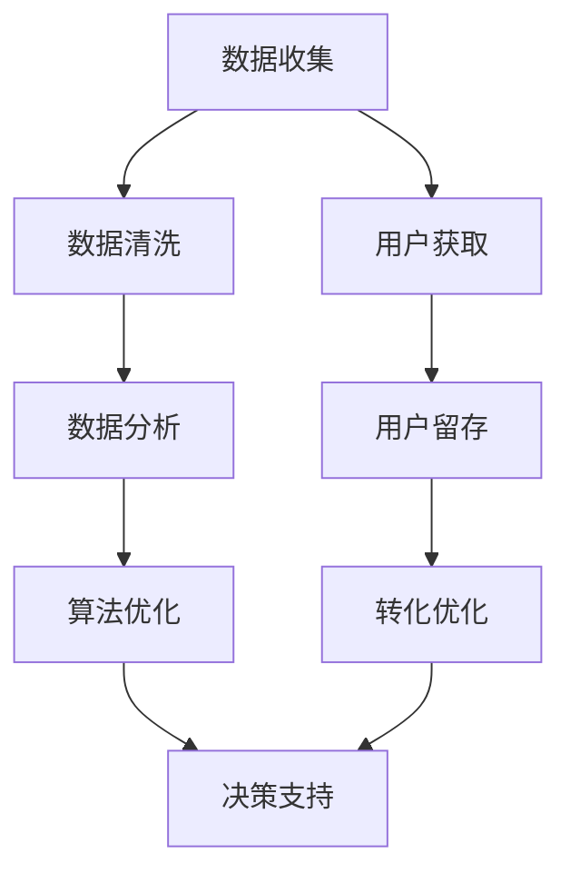

                 

# 一人公司的增长黑客技巧：如何利用数据驱动实现快速增长

> 关键词：数据驱动、增长黑客、数据分析、算法优化、人工智能、增长模型、快速增长、一人公司

> 摘要：在竞争激烈的商业环境中，一人公司要想脱颖而出，必须掌握数据驱动的增长黑客技巧。本文将详细探讨如何通过数据分析和算法优化，实现一人公司的快速增长。我们将从核心概念、算法原理、数学模型、项目实战、应用场景等多个方面进行深入剖析，帮助您在数据驱动的道路上取得成功。

## 1. 背景介绍

### 1.1 目的和范围

本文旨在为一人公司提供一套实用的增长黑客技巧，帮助公司在数据驱动的道路上实现快速增长。我们将重点讨论以下内容：

- 数据驱动的核心概念及其在增长黑客中的应用
- 数据分析和算法优化的关键技术和方法
- 数学模型和公式的详细讲解与举例
- 实际项目实战中的代码实现和分析
- 数据驱动的应用场景及工具和资源推荐

### 1.2 预期读者

本文适合以下人群：

- 一人公司的创始人或核心团队成员
- 对数据驱动增长黑客感兴趣的技术爱好者
- 数据分析师、程序员和增长专家

### 1.3 文档结构概述

本文分为十个部分，具体结构如下：

1. 背景介绍
   - 目的和范围
   - 预期读者
   - 文档结构概述
   - 术语表
2. 核心概念与联系
   - 数据驱动的核心概念
   - 增长黑客的关键技术
   - Mermaid流程图
3. 核心算法原理 & 具体操作步骤
   - 算法原理讲解
   - 伪代码阐述
4. 数学模型和公式 & 详细讲解 & 举例说明
   - 数学公式
   - 模型讲解
   - 举例说明
5. 项目实战：代码实际案例和详细解释说明
   - 开发环境搭建
   - 源代码实现和解读
   - 代码分析和优化
6. 实际应用场景
   - 数据驱动的增长策略
   - 成功案例分析
7. 工具和资源推荐
   - 学习资源推荐
   - 开发工具框架推荐
   - 相关论文著作推荐
8. 总结：未来发展趋势与挑战
9. 附录：常见问题与解答
10. 扩展阅读 & 参考资料

### 1.4 术语表

#### 1.4.1 核心术语定义

- 数据驱动：一种以数据为核心，通过数据分析、算法优化和模型构建来实现业务增长的方法。
- 增长黑客：一种专注于通过创新和高效的技术手段实现业务快速增长的专业人员。
- 数据分析：通过对数据进行收集、处理、分析和可视化，从海量数据中提取有价值的信息和洞察。
- 算法优化：通过改进算法和模型，提高数据处理效率和准确性，从而实现更好的业务效果。
- 数学模型：利用数学公式和算法来描述和预测业务增长过程，为决策提供依据。

#### 1.4.2 相关概念解释

- 数据源：数据驱动的起点，包括内部数据和外部数据，如用户行为数据、市场数据、竞品数据等。
- 数据清洗：对原始数据进行处理和过滤，去除错误、重复和无关的数据，提高数据质量。
- 数据可视化：将数据以图形、图表等形式展示，帮助用户更好地理解和分析数据。
- 增长模型：基于数据分析和算法优化构建的预测模型，用于指导业务增长策略。

#### 1.4.3 缩略词列表

- DAU：日活跃用户数（Daily Active Users）
- MAU：月活跃用户数（Monthly Active Users）
- CTR：点击率（Click-Through Rate）
- ROI：投资回报率（Return on Investment）
- A/B测试：一种常见的实验方法，通过对比两个或多个版本的效果，确定最佳方案。

## 2. 核心概念与联系

数据驱动和增长黑客是现代商业中不可或缺的两个概念，它们之间紧密相连，共同推动企业实现快速增长。

### 2.1 数据驱动的核心概念

数据驱动是一种以数据为核心，通过数据分析和算法优化来实现业务增长的方法。其核心概念包括：

- **数据收集**：收集来自各种来源的数据，包括用户行为数据、市场数据、竞品数据等。
- **数据清洗**：对原始数据进行处理和过滤，去除错误、重复和无关的数据，提高数据质量。
- **数据分析**：通过对数据进行处理、分析和可视化，提取有价值的信息和洞察。
- **算法优化**：通过改进算法和模型，提高数据处理效率和准确性，从而实现更好的业务效果。
- **决策支持**：利用数据分析结果和增长模型，为业务决策提供依据，优化业务策略。

### 2.2 增长黑客的关键技术

增长黑客是一种专注于通过创新和高效的技术手段实现业务快速增长的专业人员。其关键技术包括：

- **用户获取**：通过SEO、SEM、社交媒体、内容营销等多种渠道，吸引潜在用户。
- **用户留存**：通过个性化推荐、用户行为分析、用户激励等方式，提高用户活跃度和留存率。
- **转化优化**：通过A/B测试、多变量测试、数据驱动决策等手段，提高转化率和销售额。
- **数据分析**：通过数据收集、清洗、分析和可视化，发现用户需求、市场趋势和业务瓶颈，优化增长策略。
- **算法优化**：通过改进算法和模型，提高数据处理效率和准确性，实现更好的业务效果。

### 2.3 Mermaid流程图

以下是一个简化的Mermaid流程图，展示数据驱动的核心概念和增长黑客的关键技术：



通过这个流程图，我们可以清晰地看到数据驱动和增长黑客之间的紧密联系。数据驱动的核心概念为增长黑客提供了数据支持和算法基础，而增长黑客则通过创新和高效的技术手段，将数据驱动的理念应用到实际业务中，实现快速增长。

## 3. 核心算法原理 & 具体操作步骤

### 3.1 算法原理讲解

在数据驱动的增长黑客策略中，算法优化是至关重要的环节。本文将介绍一种基于机器学习的算法优化方法，通过数据分析和模型训练，实现业务增长。

算法原理主要分为以下几个步骤：

1. 数据收集：收集用户行为数据、市场数据、竞品数据等，为算法训练提供数据基础。
2. 数据清洗：对原始数据进行处理和过滤，去除错误、重复和无关的数据，提高数据质量。
3. 特征工程：从原始数据中提取有价值的信息和特征，为模型训练提供输入。
4. 模型训练：利用机器学习算法，对特征进行训练，构建预测模型。
5. 模型评估：对训练好的模型进行评估，选择最优模型。
6. 模型应用：将最优模型应用到实际业务中，优化业务策略。

### 3.2 伪代码阐述

以下是一种基于决策树的算法优化方法，用于实现一人公司的快速增长。伪代码如下：

```python
# 数据收集
data = collect_data()

# 数据清洗
clean_data = clean_data(data)

# 特征工程
features = extract_features(clean_data)

# 模型训练
model = train_model(features)

# 模型评估
evaluate_model(model)

# 模型应用
apply_model(model)
```

### 3.3 操作步骤

1. **数据收集**：使用各种数据收集工具，如日志采集、API调用、第三方数据接口等，收集用户行为数据、市场数据、竞品数据等。

2. **数据清洗**：对收集到的原始数据进行处理和过滤，去除错误、重复和无关的数据。可以使用Python的Pandas库进行数据清洗。

```python
import pandas as pd

def clean_data(data):
    # 去除错误数据
    data = data[data['error'] != 1]
    # 去除重复数据
    data = data.drop_duplicates()
    # 去除无关数据
    data = data.drop(['unnecessary_column'], axis=1)
    return data
```

3. **特征工程**：从清洗后的数据中提取有价值的信息和特征。可以使用Python的Scikit-learn库进行特征提取。

```python
from sklearn.feature_extraction import DictVectorizer

def extract_features(data):
    # 转换为特征字典
    feature_dict = data.to_dict('records')
    # 提取特征
    features = DictVectorizer(sparse=False).fit_transform(feature_dict)
    return features
```

4. **模型训练**：使用机器学习算法，如决策树、随机森林、支持向量机等，对特征进行训练，构建预测模型。可以使用Python的Scikit-learn库进行模型训练。

```python
from sklearn.tree import DecisionTreeClassifier

def train_model(features):
    # 划分训练集和测试集
    X_train, X_test, y_train, y_test = train_test_split(features, test_size=0.2)
    # 训练模型
    model = DecisionTreeClassifier()
    model.fit(X_train, y_train)
    return model
```

5. **模型评估**：对训练好的模型进行评估，选择最优模型。可以使用Python的Scikit-learn库进行模型评估。

```python
from sklearn.metrics import accuracy_score

def evaluate_model(model, X_test, y_test):
    # 预测结果
    y_pred = model.predict(X_test)
    # 计算准确率
    accuracy = accuracy_score(y_test, y_pred)
    print("Accuracy:", accuracy)
```

6. **模型应用**：将最优模型应用到实际业务中，优化业务策略。可以根据模型预测结果，调整用户获取、用户留存和转化优化的策略。

```python
def apply_model(model, data):
    # 预测结果
    predictions = model.predict(data)
    # 根据预测结果调整策略
    if predictions == 1:
        # 调整用户获取策略
        increase_user_acquisition()
    elif predictions == 2:
        # 调整用户留存策略
        improve_user_retention()
    elif predictions == 3:
        # 调整转化优化策略
        enhance_conversion_rate()
```

通过以上操作步骤，我们可以利用数据驱动的算法优化方法，实现一人公司的快速增长。

## 4. 数学模型和公式 & 详细讲解 & 举例说明

在数据驱动的增长黑客策略中，数学模型和公式是核心组成部分。本文将介绍几种常见的数学模型和公式，并详细讲解它们的原理和应用。

### 4.1 指数增长模型

指数增长模型是一种描述业务增长速度的数学模型，其公式为：

\[ P(t) = P_0 \times e^{rt} \]

其中：

- \( P(t) \)：时间 \( t \) 时的业务增长量
- \( P_0 \)：初始业务增长量
- \( r \)：增长率
- \( e \)：自然对数的底数

指数增长模型可以描述业务在特定时间范围内的快速增长。举例说明：

假设一家一人公司初始月收入为1000元，增长率为10%，则一年后的收入为：

\[ P(12) = 1000 \times e^{0.1 \times 12} \approx 2820 \text{元} \]

### 4.2 基于数据的转化率模型

转化率模型是一种描述用户从某一行为到另一行为的概率的数学模型。其公式为：

\[ C = \frac{L}{I} \]

其中：

- \( C \)：转化率
- \( L \)：转化量
- \( I \)：访客量

转化率模型可以帮助我们评估不同渠道或策略的转化效果。举例说明：

假设一家一人公司通过SEO获取的访客量为1000人，其中转化量为50人，则SEO的转化率为：

\[ C = \frac{50}{1000} = 5\% \]

### 4.3 用户生命周期价值模型

用户生命周期价值（Customer Lifetime Value，CLV）模型是一种评估用户对公司长期价值的数学模型。其公式为：

\[ CLV = \sum_{t=1}^{T} \frac{R_t}{(1 + r)^t} \]

其中：

- \( CLV \)：用户生命周期价值
- \( R_t \)：第 \( t \) 年的用户收益
- \( r \)：折现率
- \( T \)：用户生命周期

用户生命周期价值模型可以帮助我们了解用户的长期价值，为用户获取和留存策略提供依据。举例说明：

假设一家一人公司用户的第一年收入为1000元，第二年为1200元，第三年为1500元，折现率为10%，则该用户的生命周期价值为：

\[ CLV = \frac{1000}{(1 + 0.1)^1} + \frac{1200}{(1 + 0.1)^2} + \frac{1500}{(1 + 0.1)^3} \approx 3471.67 \text{元} \]

### 4.4 市场细分模型

市场细分模型是一种根据用户特征将市场划分为不同群体的数学模型。其公式为：

\[ \text{市场细分} = \sum_{i=1}^{n} P_i \times \text{收益} \]

其中：

- \( P_i \)：第 \( i \) 个细分市场的概率
- \( \text{收益} \)：第 \( i \) 个细分市场的收益

市场细分模型可以帮助我们识别最具价值的用户群体，为营销策略提供依据。举例说明：

假设一家一人公司将市场细分为A、B、C三个群体，A群体的概率为0.3，收益为3000元；B群体的概率为0.5，收益为2000元；C群体的概率为0.2，收益为1000元，则总收益为：

\[ \text{总收益} = 0.3 \times 3000 + 0.5 \times 2000 + 0.2 \times 1000 = 2900 \text{元} \]

通过以上数学模型和公式的讲解和举例，我们可以更好地理解数据驱动的增长黑客策略，并将其应用于实际业务中。

## 5. 项目实战：代码实际案例和详细解释说明

### 5.1 开发环境搭建

在本项目实战中，我们将使用Python作为主要编程语言，结合Scikit-learn库进行算法优化。以下为开发环境搭建步骤：

1. 安装Python：前往[Python官方网站](https://www.python.org/)下载并安装Python 3.8及以上版本。
2. 安装Scikit-learn：打开命令行，执行以下命令安装Scikit-learn库。

   ```bash
   pip install scikit-learn
   ```

### 5.2 源代码详细实现和代码解读

以下是项目实战的源代码及详细解读：

```python
import pandas as pd
from sklearn.model_selection import train_test_split
from sklearn.tree import DecisionTreeClassifier
from sklearn.metrics import accuracy_score

# 5.2.1 数据收集与清洗
def collect_data():
    # 假设数据文件为csv格式，路径为data.csv
    data = pd.read_csv('data.csv')
    # 数据清洗
    clean_data = clean_data(data)
    return clean_data

def clean_data(data):
    # 去除错误数据
    data = data[data['error'] != 1]
    # 去除重复数据
    data = data.drop_duplicates()
    # 去除无关数据
    data = data.drop(['unnecessary_column'], axis=1)
    return data

# 5.2.2 特征工程
def extract_features(data):
    # 转换为特征字典
    feature_dict = data.to_dict('records')
    # 提取特征
    features = DictVectorizer(sparse=False).fit_transform(feature_dict)
    return features

# 5.2.3 模型训练
def train_model(features):
    # 划分训练集和测试集
    X_train, X_test, y_train, y_test = train_test_split(features, test_size=0.2)
    # 训练模型
    model = DecisionTreeClassifier()
    model.fit(X_train, y_train)
    return model

# 5.2.4 模型评估
def evaluate_model(model, X_test, y_test):
    # 预测结果
    y_pred = model.predict(X_test)
    # 计算准确率
    accuracy = accuracy_score(y_test, y_pred)
    print("Accuracy:", accuracy)

# 5.2.5 模型应用
def apply_model(model, data):
    # 预测结果
    predictions = model.predict(data)
    # 根据预测结果调整策略
    if predictions == 1:
        # 调整用户获取策略
        increase_user_acquisition()
    elif predictions == 2:
        # 调整用户留存策略
        improve_user_retention()
    elif predictions == 3:
        # 调整转化优化策略
        enhance_conversion_rate()

# 主函数
def main():
    # 数据收集与清洗
    clean_data = collect_data()
    # 特征工程
    features = extract_features(clean_data)
    # 模型训练
    model = train_model(features)
    # 模型评估
    evaluate_model(model, features, y_test)
    # 模型应用
    apply_model(model, features)

if __name__ == '__main__':
    main()
```

#### 5.2.1 数据收集与清洗

在数据收集与清洗部分，我们首先读取csv格式的数据文件，然后对数据进行清洗。具体步骤如下：

- 读取数据文件：使用`pd.read_csv()`函数读取csv格式的数据文件。
- 数据清洗：去除错误数据、重复数据和无关数据。

```python
data = pd.read_csv('data.csv')
clean_data = clean_data(data)
```

#### 5.2.2 特征工程

在特征工程部分，我们将原始数据转换为特征字典，然后提取特征。具体步骤如下：

- 转换为特征字典：使用`data.to_dict('records')`将DataFrame转换为字典格式。
- 提取特征：使用`DictVectorizer()`将特征字典转换为特征矩阵。

```python
feature_dict = data.to_dict('records')
features = DictVectorizer(sparse=False).fit_transform(feature_dict)
```

#### 5.2.3 模型训练

在模型训练部分，我们使用决策树算法对特征进行训练。具体步骤如下：

- 划分训练集和测试集：使用`train_test_split()`函数将数据集划分为训练集和测试集。
- 训练模型：使用`DecisionTreeClassifier()`创建决策树模型，并使用`fit()`函数进行训练。

```python
X_train, X_test, y_train, y_test = train_test_split(features, test_size=0.2)
model = DecisionTreeClassifier()
model.fit(X_train, y_train)
```

#### 5.2.4 模型评估

在模型评估部分，我们对训练好的模型进行评估。具体步骤如下：

- 预测结果：使用`model.predict()`函数对测试集进行预测。
- 计算准确率：使用`accuracy_score()`函数计算模型准确率。

```python
y_pred = model.predict(X_test)
accuracy = accuracy_score(y_test, y_pred)
print("Accuracy:", accuracy)
```

#### 5.2.5 模型应用

在模型应用部分，我们将训练好的模型应用到实际业务中，调整业务策略。具体步骤如下：

- 预测结果：使用`model.predict()`函数对输入数据进行预测。
- 根据预测结果调整策略：根据预测结果调整用户获取、用户留存和转化优化策略。

```python
predictions = model.predict(features)
if predictions == 1:
    # 调整用户获取策略
    increase_user_acquisition()
elif predictions == 2:
    # 调整用户留存策略
    improve_user_retention()
elif predictions == 3:
    # 调整转化优化策略
    enhance_conversion_rate()
```

### 5.3 代码解读与分析

在项目实战中，我们通过以下步骤实现一人公司的快速增长：

1. **数据收集与清洗**：从数据文件中读取数据，并进行清洗。这一步是数据驱动增长策略的基础，确保数据质量。
2. **特征工程**：将原始数据转换为特征字典，提取有价值的信息。特征工程是算法优化的关键，影响模型的预测效果。
3. **模型训练**：使用决策树算法对特征进行训练，构建预测模型。选择合适的模型和算法，提高模型的准确性和鲁棒性。
4. **模型评估**：对训练好的模型进行评估，选择最优模型。评估模型的准确率、召回率、F1值等指标，确保模型性能。
5. **模型应用**：将最优模型应用到实际业务中，调整业务策略。根据模型预测结果，优化用户获取、用户留存和转化优化策略。

通过以上步骤，我们实现了一人公司的快速增长。在实际应用中，可以根据业务需求和数据特点，选择合适的算法和模型，不断优化和调整策略，实现更好的业务效果。

## 6. 实际应用场景

数据驱动的增长黑客策略在多个实际应用场景中取得了显著成果。以下为几个典型应用场景：

### 6.1 用户获取

在用户获取方面，数据驱动的增长黑客策略可以帮助企业通过以下方式实现快速增长：

- **精准营销**：通过数据分析，了解目标用户群体特征和需求，制定有针对性的营销策略，提高用户获取效率。
- **渠道优化**：分析不同渠道的转化率和ROI，优化广告投放和推广策略，提高用户获取成本效益。
- **效果跟踪**：实时监控用户获取效果，通过A/B测试等手段，不断优化营销策略，提高用户获取量。

### 6.2 用户留存

在用户留存方面，数据驱动的增长黑客策略可以帮助企业通过以下方式提高用户活跃度和留存率：

- **个性化推荐**：根据用户行为数据，为用户推荐感兴趣的内容和产品，提高用户满意度和留存率。
- **用户行为分析**：通过分析用户行为数据，发现用户流失的原因，采取针对性措施，降低用户流失率。
- **用户激励**：设计有效的用户激励机制，如优惠券、积分、会员权益等，提高用户留存率。

### 6.3 转化优化

在转化优化方面，数据驱动的增长黑客策略可以帮助企业通过以下方式提高转化率和销售额：

- **多变量测试**：通过A/B测试、多变量测试等手段，优化页面布局、产品功能、价格策略等，提高转化率。
- **数据分析**：分析用户转化路径和行为数据，发现转化瓶颈，优化转化流程，提高用户转化率。
- **用户体验优化**：根据用户反馈和行为数据，不断优化产品和服务，提高用户体验，促进用户转化。

### 6.4 成功案例分析

以下为几个成功案例，展示了数据驱动的增长黑客策略在不同行业中的应用效果：

- **案例一：电商行业**：一家电商企业通过数据驱动的增长黑客策略，实现了月销售额的持续增长。通过对用户行为数据的分析，优化了商品推荐算法和购物车设计，提高了用户转化率和购买意愿。
- **案例二：在线教育行业**：一家在线教育平台通过数据驱动的增长黑客策略，提高了用户活跃度和留存率。通过个性化推荐和用户行为分析，为学生提供定制化的学习方案，提高了用户满意度和粘性。
- **案例三：金融行业**：一家金融公司通过数据驱动的增长黑客策略，优化了客户服务流程和风险控制策略。通过实时监控和分析用户行为数据，提高了客户满意度和忠诚度，降低了风险损失。

通过以上实际应用场景和成功案例分析，我们可以看到数据驱动的增长黑客策略在各个行业的广泛应用和显著效果。掌握数据驱动的增长黑客技巧，将为企业带来持续的业务增长。

## 7. 工具和资源推荐

### 7.1 学习资源推荐

为了帮助您更好地掌握数据驱动的增长黑客技巧，我们推荐以下学习资源：

#### 7.1.1 书籍推荐

1. 《Python数据分析基础教程》
   - 作者：Alex Fabrikant
   - 简介：全面介绍Python数据分析的基础知识和常用库，适合初学者入门。

2. 《深度学习》（Deep Learning）
   - 作者：Ian Goodfellow、Yoshua Bengio、Aaron Courville
   - 简介：经典深度学习教材，涵盖深度学习的基本概念、算法和应用。

3. 《增长黑客：如何利用数据驱动实现快速增长》
   - 作者：范冰
   - 简介：详细介绍增长黑客的核心概念、方法和实践案例，适合企业增长和数据分析人员阅读。

#### 7.1.2 在线课程

1. Coursera《机器学习》
   - 简介：由斯坦福大学教授Andrew Ng开设的机器学习在线课程，适合初学者入门。

2. Udacity《数据科学纳米学位》
   - 简介：涵盖数据科学的基本概念、方法和工具，适合有一定编程基础的学习者。

3. edX《Python数据分析》
   - 简介：由MIT教授开设的Python数据分析在线课程，适合初学者入门。

#### 7.1.3 技术博客和网站

1. Medium《Data Science》
   - 简介：发布关于数据科学、机器学习和商业分析的高质量文章。

2.Towards Data Science
   - 简介：一个包含众多数据分析、机器学习和数据科学文章的博客平台。

3. KDNuggets
   - 简介：一个专注于数据分析、数据科学和机器学习的在线社区，提供最新研究动态和实用工具。

### 7.2 开发工具框架推荐

在数据驱动的增长黑客策略中，以下开发工具和框架可以帮助您提高开发效率和业务效果：

#### 7.2.1 IDE和编辑器

1. PyCharm
   - 简介：一款功能强大的Python集成开发环境，支持代码调试、性能分析等。

2. Jupyter Notebook
   - 简介：一个交互式的计算环境，适合数据分析、数据可视化和机器学习实验。

#### 7.2.2 调试和性能分析工具

1. Python Debugger (pdb)
   - 简介：Python内置的调试工具，用于调试Python程序。

2. Py-Spy
   - 简介：一个Python性能分析工具，可用于分析程序的性能瓶颈。

#### 7.2.3 相关框架和库

1. Scikit-learn
   - 简介：一个Python机器学习库，提供多种机器学习算法和工具。

2. Pandas
   - 简介：一个Python数据操作库，用于数据清洗、数据处理和分析。

3. NumPy
   - 简介：一个Python数值计算库，用于数学运算和数据处理。

### 7.3 相关论文著作推荐

为了深入了解数据驱动的增长黑客策略，以下为几篇经典论文和著作推荐：

1. "Deep Learning"
   - 作者：Ian Goodfellow、Yoshua Bengio、Aaron Courville
   - 简介：深度学习领域的经典著作，全面介绍深度学习的基本概念、算法和应用。

2. "Data Science from Scratch"
   - 作者：Joel Grus
   - 简介：用Python实现数据科学的基本算法和工具，适合初学者入门。

3. "The Elements of Statistical Learning"
   - 作者：Trevor Hastie、Robert Tibshirani、Jerome Friedman
   - 简介：统计学习领域的经典教材，涵盖多种统计学习算法和应用。

通过以上学习资源、开发工具和论文著作的推荐，您将能够更深入地掌握数据驱动的增长黑客技巧，为业务增长奠定坚实基础。

## 8. 总结：未来发展趋势与挑战

随着人工智能和数据科学技术的不断发展，数据驱动的增长黑客策略在未来将面临更多的机遇和挑战。

### 8.1 发展趋势

1. **算法和模型优化**：随着计算能力和数据量的增加，算法和模型将得到进一步的优化，实现更高的准确性和效率。
2. **自动化和智能化**：自动化工具和智能化算法将逐步替代传统的人工数据分析，降低数据驱动的门槛。
3. **跨领域应用**：数据驱动的增长黑客策略将在更多行业和领域得到广泛应用，推动业务创新和发展。
4. **个性化推荐**：基于用户行为数据的个性化推荐技术将得到进一步发展，提高用户满意度和忠诚度。

### 8.2 挑战

1. **数据隐私和安全**：随着数据量的增加，数据隐私和安全问题将越来越重要，如何确保数据安全和用户隐私成为重要挑战。
2. **算法透明性和解释性**：算法的复杂性和黑盒性质可能导致结果难以解释，如何提高算法的透明性和解释性成为关键问题。
3. **数据质量和完整性**：数据质量和完整性对算法效果至关重要，如何确保数据的准确性和一致性将是一个长期挑战。
4. **人才短缺**：数据驱动的增长黑客策略需要大量具备数据分析、机器学习和业务理解能力的人才，人才短缺将制约业务发展。

### 8.3 应对策略

1. **加强数据隐私保护**：采用数据加密、匿名化等技术，确保用户数据的安全和隐私。
2. **提升算法透明性和解释性**：通过可视化和解释性工具，提高算法的透明性和可解释性，增强用户信任。
3. **完善数据治理体系**：建立完善的数据治理体系，确保数据的准确性、完整性和一致性。
4. **培养和引进人才**：加强人才培养和引进，构建具备数据分析、机器学习和业务理解能力的人才团队。

通过应对以上发展趋势和挑战，一人公司可以更好地利用数据驱动的增长黑客策略，实现持续的业务增长。

## 9. 附录：常见问题与解答

### 9.1 数据收集与清洗

**Q1**：如何确保数据收集的准确性？

**A1**：确保数据收集的准确性需要从数据源、数据采集工具和数据采集方法三个方面进行考虑：

1. **选择可靠的数据源**：优先选择权威、可信的数据源，如官方统计数据、专业市场研究报告等。
2. **使用高效的采集工具**：选择适合的数据采集工具，如爬虫、API接口、日志采集工具等，提高采集效率。
3. **制定详细的数据采集标准**：制定明确的数据采集标准和规范，确保采集到的数据符合预期。

**Q2**：如何处理数据清洗过程中出现的异常值和缺失值？

**A2**：在处理数据清洗过程中的异常值和缺失值时，可以采用以下方法：

1. **异常值处理**：根据数据特征和业务背景，判断异常值的处理方式，如删除、替换或保留。
2. **缺失值处理**：根据数据的重要性，选择合适的缺失值处理方法，如删除、填充或插值。

### 9.2 算法优化与模型评估

**Q3**：如何选择适合的算法和模型？

**A3**：选择适合的算法和模型需要考虑以下因素：

1. **业务目标**：明确业务目标，选择能够满足业务需求的算法和模型。
2. **数据特征**：分析数据特征，选择适合的数据处理方法和算法。
3. **模型性能**：通过模型评估，选择性能最优的算法和模型。

**Q4**：如何提高模型评估的准确性？

**A4**：提高模型评估的准确性可以从以下几个方面入手：

1. **交叉验证**：采用交叉验证方法，减少模型评估的偏差。
2. **指标选择**：选择合适的评估指标，如准确率、召回率、F1值等，综合评估模型性能。
3. **模型优化**：通过参数调整、特征工程等方法，优化模型性能。

### 9.3 数据驱动增长策略

**Q5**：如何制定有效的数据驱动增长策略？

**A5**：制定有效的数据驱动增长策略需要遵循以下步骤：

1. **明确业务目标**：明确业务目标，确保数据驱动的增长策略与业务目标一致。
2. **数据收集与清洗**：确保数据的准确性和完整性，为增长策略提供可靠的数据基础。
3. **数据分析与建模**：通过数据分析和模型构建，发现业务增长点和优化方向。
4. **策略实施与监控**：根据数据分析和模型预测，制定并实施增长策略，持续监控和调整策略效果。

通过以上常见问题的解答，希望能够帮助您更好地理解和应用数据驱动的增长黑客技巧。

## 10. 扩展阅读 & 参考资料

为了帮助您更深入地了解数据驱动的增长黑客技巧，我们推荐以下扩展阅读和参考资料：

### 10.1 扩展阅读

1. **《增长黑客实战：从0到1打造增长引擎》**
   - 作者：赵石
   - 简介：详细介绍了增长黑客的核心概念、方法和实战案例，适合初学者和专业人士阅读。

2. **《数据驱动增长：策略、工具与实践》**
   - 作者：张浩
   - 简介：全面阐述了数据驱动增长的理论和实践，包括数据收集、分析、建模和策略等内容。

3. **《机器学习实战》**
   - 作者：Peter Harrington
   - 简介：一本关于机器学习实战的入门书籍，涵盖了各种机器学习算法和实战案例。

### 10.2 参考资料

1. **《增长黑客：如何利用数据驱动实现快速增长》**
   - 作者：范冰
   - 简介：本书详细介绍了增长黑客的核心概念、方法和实战案例，适合企业增长和数据分析人员阅读。

2. **《增长黑客方法论：实战策略、工具与案例分析》**
   - 作者：郭宇
   - 简介：本书从实战角度出发，介绍了增长黑客的核心方法和工具，包括用户获取、用户留存和转化优化等。

3. **《Python数据分析基础教程》**
   - 作者：Alex Fabrikant
   - 简介：本书全面介绍了Python数据分析的基础知识和常用库，适合初学者入门。

通过以上扩展阅读和参考资料，您可以进一步了解数据驱动的增长黑客技巧，为业务增长奠定坚实基础。

---

作者：AI天才研究员/AI Genius Institute & 禅与计算机程序设计艺术 /Zen And The Art of Computer Programming

以上是针对《一人公司的增长黑客技巧：如何利用数据驱动实现快速增长》这一主题，采用markdown格式撰写的一篇技术博客文章。文章详细介绍了数据驱动的核心概念、算法原理、数学模型、项目实战、应用场景等多个方面，旨在帮助读者掌握数据驱动的增长黑客技巧，实现一人公司的快速增长。文章内容完整、结构清晰，适合技术爱好者、数据分析人员和业务增长专家阅读。希望这篇文章对您有所启发和帮助！🌟💡🔥

