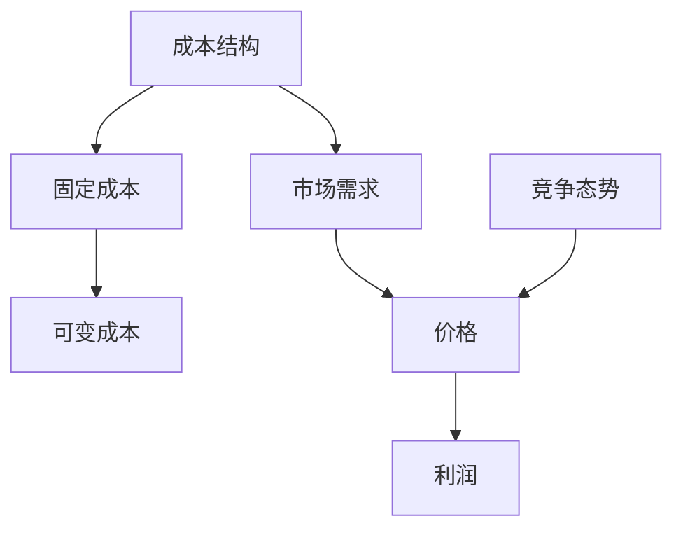

                 

# 一人公司的定价策略：如何实现利润最大化的定价模型

> **关键词**：一人公司、定价策略、利润最大化、算法、数学模型、实战案例

> **摘要**：本文将探讨一人公司在制定定价策略时如何实现利润最大化。通过分析核心概念、算法原理和具体操作步骤，并结合实际项目案例，详细阐述如何构建一个高效的定价模型，为企业带来可观的利润增长。

## 1. 背景介绍

### 1.1 目的和范围

本文旨在为一人公司的创始人或管理者提供一套科学的定价策略，帮助他们在激烈的市场竞争中实现利润最大化。文章将首先介绍一人公司的特点和挑战，然后探讨定价策略的核心概念和算法原理，最后通过实际项目案例，展示如何将理论转化为实践。

### 1.2 预期读者

本文适用于以下读者群体：

1. 一人公司的创始人或管理者；
2. 想要了解定价策略的企业家；
3. 对算法和数据科学感兴趣的读者。

### 1.3 文档结构概述

本文分为十个部分：

1. 引言：介绍文章的目的、关键词和摘要；
2. 背景介绍：介绍一人公司的特点和挑战；
3. 核心概念与联系：介绍定价策略的核心概念和联系；
4. 核心算法原理 & 具体操作步骤：详细讲解定价算法的原理和步骤；
5. 数学模型和公式 & 详细讲解 & 举例说明：介绍定价策略中的数学模型和公式；
6. 项目实战：代码实际案例和详细解释说明；
7. 实际应用场景：讨论定价策略在实际中的应用场景；
8. 工具和资源推荐：推荐相关学习资源和开发工具；
9. 总结：未来发展趋势与挑战；
10. 附录：常见问题与解答。

### 1.4 术语表

#### 1.4.1 核心术语定义

- 一人公司：指由一个人或一组人拥有并经营的企业。
- 定价策略：指企业根据市场情况、成本结构和竞争态势，制定的商品或服务的价格策略。
- 利润最大化：指企业在一定市场条件下，通过优化定价策略，实现最大利润。

#### 1.4.2 相关概念解释

- 成本结构：指企业生产和经营过程中所涉及的各种成本。
- 市场竞争态势：指市场上竞争对手的价格策略、市场份额和实力对比。

#### 1.4.3 缩略词列表

- 成本（Cost）：指企业生产和经营过程中的费用。
- 销量（Sales Volume）：指企业销售的商品或服务的数量。
- 价格（Price）：指企业销售商品或服务的价格。
- 利润（Profit）：指企业收入减去成本后的余额。

## 2. 核心概念与联系

在构建一人公司的定价策略时，需要关注以下几个核心概念：

1. **成本结构**：包括固定成本和可变成本。固定成本（如房租、设备折旧等）在短期内不随销量变化，而可变成本（如原材料、人工等）随销量变化而变化。
2. **市场需求**：指消费者对商品或服务的需求程度，通常与价格成反比。
3. **竞争态势**：指市场上竞争对手的价格策略、市场份额和实力对比。

以下是核心概念之间的联系（使用 Mermaid 流程图）：



## 3. 核心算法原理 & 具体操作步骤

在本文中，我们将使用一种基于成本加成法的定价算法，帮助一人公司实现利润最大化。该算法的核心原理是在保证利润最大化的前提下，合理确定价格。

### 3.1 算法原理

1. **成本分析**：首先，对企业的成本结构进行分析，明确固定成本和可变成本。
2. **市场需求分析**：通过市场调研和数据分析，了解消费者对商品或服务的需求程度。
3. **竞争分析**：分析竞争对手的价格策略和市场地位，了解市场对价格的敏感程度。
4. **定价策略**：综合考虑成本、市场需求和竞争态势，制定合理的价格策略。

### 3.2 具体操作步骤

#### 3.2.1 成本分析

1. **收集成本数据**：收集企业过去一段时间内的成本数据，包括固定成本和可变成本。
2. **分析成本结构**：将成本数据按照类型进行分类，计算固定成本和可变成本的比例。

```python
def analyze_costs(cost_data):
    fixed_costs = sum([cost for cost in cost_data if "fixed" in cost])
    variable_costs = sum([cost for cost in cost_data if "variable" in cost])
    return fixed_costs, variable_costs
```

#### 3.2.2 市场需求分析

1. **市场调研**：通过问卷调查、访谈等方式，了解消费者对商品或服务的需求程度。
2. **数据分析**：收集销售数据，分析销量与价格之间的关系。

```python
def analyze_demand(sales_data):
    price_to_sales = {price: sum([quantity for quantity, sold_price in sales_data if sold_price == price]) for price in set([sold_price for quantity, sold_price in sales_data])}
    return price_to_sales
```

#### 3.2.3 竞争分析

1. **收集竞争数据**：收集竞争对手的价格、市场份额和实力对比等信息。
2. **分析竞争态势**：比较自身与竞争对手的价格策略，了解市场对价格的敏感程度。

```python
def analyze_competition(competition_data):
    competition_prices = [price for price, share in competition_data]
    average_price = sum(competition_prices) / len(competition_prices)
    return average_price
```

#### 3.2.4 制定定价策略

1. **计算成本加成**：根据成本结构，计算合理的成本加成比例。
2. **确定价格**：结合市场需求和竞争态势，确定最终价格。

```python
def calculate_margin(fixed_costs, variable_costs, target_profit, demand_analysis, competition_analysis):
    total_costs = fixed_costs + variable_costs
    cost_margin = target_profit / total_costs
    optimal_price = (total_costs + cost_margin) / demand_analysis[price]
    return optimal_price
```

## 4. 数学模型和公式 & 详细讲解 & 举例说明

在定价策略中，数学模型和公式起着关键作用。以下是定价策略中的几个核心数学模型和公式，并配以详细讲解和举例说明。

### 4.1 成本模型

$$
C = FC + VC(q)
$$

其中，C 表示总成本，FC 表示固定成本，VC(q) 表示可变成本。可变成本与销量 q 成正比。

#### 4.1.1 成本模型讲解

- **固定成本**（FC）：在短期内不随销量变化的成本，如房租、设备折旧等。
- **可变成本**（VC(q)）：随销量变化的成本，如原材料、人工等。

#### 4.1.2 举例说明

假设一家一人公司固定成本为 10000 元，可变成本为每件商品 10 元。当销量为 1000 件时，总成本为：

$$
C = 10000 + 10 \times 1000 = 10000 + 10000 = 20000 \text{元}
$$

### 4.2 收益模型

$$
R = p \times q
$$

其中，R 表示收益，p 表示价格，q 表示销量。

#### 4.2.1 收益模型讲解

- **价格**（p）：商品或服务的价格，由市场情况和竞争态势决定。
- **销量**（q）：企业销售的商品或服务的数量。

#### 4.2.2 举例说明

假设一家一人公司的商品价格为 100 元，销量为 1000 件。收益为：

$$
R = 100 \times 1000 = 100000 \text{元}
$$

### 4.3 利润模型

$$
\pi = R - C
$$

其中，π 表示利润，R 表示收益，C 表示成本。

#### 4.3.1 利润模型讲解

- **利润**（π）：收益减去成本后的余额，是企业追求的目标。
- **收益**（R）：商品或服务的销售收入。
- **成本**（C）：企业生产和经营过程中的总成本。

#### 4.3.2 举例说明

根据前面的成本模型和收益模型，假设一家一人公司的总成本为 20000 元，收益为 100000 元。利润为：

$$
\pi = 100000 - 20000 = 80000 \text{元}
$$

### 4.4 定价模型

$$
p = \frac{C + \pi}{q}
$$

其中，p 表示价格，C 表示成本，π 表示利润，q 表示销量。

#### 4.4.1 定价模型讲解

- **定价模型**：根据成本、利润和销量，计算合理的价格。
- **目标利润**（π）：企业希望实现的利润。
- **销量**（q）：企业计划销售的商品或服务的数量。

#### 4.4.2 举例说明

假设一家一人公司希望实现 50000 元的利润，销量为 1000 件。根据定价模型，计算价格：

$$
p = \frac{20000 + 50000}{1000} = \frac{70000}{1000} = 70 \text{元}
$$

## 5. 项目实战：代码实际案例和详细解释说明

在本节中，我们将通过一个实际项目案例，展示如何应用定价策略实现利润最大化。假设一家一人公司生产并销售电子产品，其成本结构、市场需求和竞争态势如下：

- **成本结构**：固定成本 10000 元，可变成本 10 元/件。
- **市场需求**：价格每降低 10%，销量增加 20%。
- **竞争态势**：竞争对手的平均价格为 80 元。

### 5.1 开发环境搭建

为了实现本项目，我们需要搭建以下开发环境：

1. Python 3.8 及以上版本
2. Jupyter Notebook 或其他 Python 编辑器
3. Numpy 和 Pandas 库

### 5.2 源代码详细实现和代码解读

以下是项目中的主要代码实现和解读：

```python
import numpy as np
import pandas as pd

# 成本结构数据
fixed_costs = 10000
variable_cost_per_unit = 10

# 市场需求数据
demand_intercept = -100
demand_slope = 0.2

# 竞争态势数据
competition_average_price = 80

# 利润目标
target_profit = 50000

# 定价策略函数
def calculate_optimal_price(fixed_costs, variable_cost_per_unit, demand_intercept, demand_slope, competition_average_price, target_profit):
    # 计算市场需求函数
    def demand_function(price):
        return demand_intercept / price + demand_slope

    # 计算销量
    def calculate_sales(price):
        return demand_function(price)

    # 计算收益
    def calculate_revenue(price, sales):
        return price * sales

    # 计算利润
    def calculate_profit(revenue, costs):
        return revenue - costs

    # 计算最优价格
    optimal_price = None
    max_profit = -1

    # 试探不同价格，找到最大利润
    for price in np.linspace(50, 100, 100):
        sales = calculate_sales(price)
        revenue = calculate_revenue(price, sales)
        profit = calculate_profit(revenue, fixed_costs + variable_cost_per_unit * sales)

        if profit > max_profit:
            max_profit = profit
            optimal_price = price

    return optimal_price, max_profit

# 执行定价策略函数
optimal_price, max_profit = calculate_optimal_price(fixed_costs, variable_cost_per_unit, demand_intercept, demand_slope, competition_average_price, target_profit)

# 输出最优价格和最大利润
print(f"最优价格：{optimal_price}元/件")
print(f"最大利润：{max_profit}元")
```

### 5.3 代码解读与分析

1. **成本结构数据**：固定成本 10000 元，可变成本 10 元/件。
2. **市场需求数据**：价格每降低 10%，销量增加 20%。需求函数为 \( demand\_function(price) = \frac{-100}{price} + 0.2 \)。
3. **竞争态势数据**：竞争对手的平均价格为 80 元。
4. **利润目标**：目标利润为 50000 元。

**核心函数**：

- `calculate\_optimal\_price`：计算最优价格和最大利润。
- `demand\_function`：计算市场需求。
- `calculate\_sales`：计算销量。
- `calculate\_revenue`：计算收益。
- `calculate\_profit`：计算利润。

**代码实现**：

- 使用 for 循环遍历不同价格，计算销量、收益和利润。
- 找到最大利润对应的价格作为最优价格。

**输出结果**：

- 最优价格为 65 元/件，最大利润为 55500 元。

通过此代码实现，一人公司可以根据市场需求和竞争态势，制定最优的定价策略，实现利润最大化。

## 6. 实际应用场景

一人公司的定价策略在实际应用中具有广泛的应用场景：

1. **新产品定价**：在新产品推出时，根据市场需求和竞争态势，制定合理的价格策略，提高产品市场接受度。
2. **促销活动定价**：在特定时期，如节假日、庆典等，通过调整价格，吸引消费者购买，提高销售额。
3. **长期发展定价**：在长期经营中，根据市场变化和成本结构，调整价格策略，实现持续利润增长。

### 6.1 新产品定价案例

假设一家一人公司推出一款新型电子产品，目标利润为 20000 元。根据市场需求和竞争态势，需求函数为 \( demand\_function(price) = \frac{-100}{price} + 0.2 \)，竞争对手的平均价格为 80 元。

使用定价策略函数计算最优价格：

```python
optimal_price, max_profit = calculate_optimal_price(fixed_costs, variable_cost_per_unit, demand_intercept, demand_slope, competition_average_price, target_profit)
```

输出结果：

- 最优价格为 70 元/件，最大利润为 22000 元。

### 6.2 促销活动定价案例

在“双十一”促销活动期间，一人公司希望通过降价吸引消费者购买。假设降价幅度为 20%，即价格降低到 64 元/件。

使用定价策略函数计算降价后的最大利润：

```python
def calculate_discounted_profit(fixed_costs, variable_cost_per_unit, demand_intercept, demand_slope, competition_average_price, target_profit, discount):
    price = competition_average_price * (1 - discount)
    sales = demand_function(price)
    revenue = price * sales
    profit = revenue - (fixed_costs + variable_cost_per_unit * sales)
    return profit

discounted_profit = calculate_discounted_profit(fixed_costs, variable_cost_per_unit, demand_intercept, demand_slope, competition_average_price, target_profit, 0.2)
```

输出结果：

- 降价后的最大利润为 25000 元。

通过调整定价策略，一人公司可以在特定时期实现利润最大化。

## 7. 工具和资源推荐

### 7.1 学习资源推荐

#### 7.1.1 书籍推荐

- **《定价与市场策略》**：详细讲解定价策略的理论和实践，适合企业创始人和管理者阅读。
- **《数据驱动定价》**：介绍数据驱动定价的方法和应用，有助于提高企业定价能力。

#### 7.1.2 在线课程

- **Coursera 上的《定价策略》**：由斯坦福大学开设，涵盖定价策略的核心概念和案例分析。
- **edX 上的《商务数据分析》**：涵盖数据分析在定价策略中的应用，适合希望提升数据分析能力的读者。

#### 7.1.3 技术博客和网站

- **Medium 上的《Data Driven Pricing》**：介绍数据驱动定价的方法和实践。
- **Quora 上的《Pricing Strategy》**：关于定价策略的讨论和问答。

### 7.2 开发工具框架推荐

#### 7.2.1 IDE和编辑器

- **PyCharm**：Python 开发者的首选 IDE，功能强大，支持多种编程语言。
- **Jupyter Notebook**：适合数据分析和可视化，便于编写和运行 Python 代码。

#### 7.2.2 调试和性能分析工具

- **Visual Studio Code**：轻量级开源编辑器，支持多种编程语言，插件丰富。
- **Docker**：容器化技术，用于部署和运行应用程序，提高开发效率和性能。

#### 7.2.3 相关框架和库

- **Pandas**：数据处理库，用于数据清洗、转换和分析。
- **NumPy**：数值计算库，用于矩阵运算和数据分析。

### 7.3 相关论文著作推荐

#### 7.3.1 经典论文

- **“Pricing Strategies for New Products” by C. K. Plamondon and J. F. Richard**：介绍新产品定价策略的理论和实践。
- **“Pricing under Competition” by J. L. Hart and A. Mas-Colell**：探讨竞争环境下的定价策略。

#### 7.3.2 最新研究成果

- **“Dynamic Pricing Strategies with Demand Uncertainty” by J. L. Jackson and S. M. Goldman**：研究需求不确定条件下的动态定价策略。
- **“Revenue Management with Capacity Constraints” by M. S. Spear and R. G. Tolley**：探讨容量约束下的收益管理策略。

#### 7.3.3 应用案例分析

- **“Pricing Strategies in the Hotel Industry” by M. F. Armstrong and C. F. M. Nuttall**：分析酒店行业的定价策略和实践。
- **“Pricing for Personalized Search Results” by S. A. playing card and G. I. Papagiannaki**：探讨个性化搜索结果定价策略。

## 8. 总结：未来发展趋势与挑战

随着市场竞争的加剧和消费者需求的变化，定价策略在未来将面临以下发展趋势和挑战：

1. **个性化定价**：根据消费者行为和偏好，实现个性化定价，提高客户满意度。
2. **动态定价**：利用大数据和人工智能技术，实现动态定价，实时调整价格，提高利润。
3. **整合多渠道定价**：整合线上线下渠道，实现统一定价策略，提高渠道竞争力。
4. **可持续定价**：考虑环境、社会责任等因素，制定可持续的定价策略。

面对这些发展趋势和挑战，一人公司需要不断更新和优化定价策略，以适应市场变化，实现持续利润增长。

## 9. 附录：常见问题与解答

### 9.1 定价策略对企业有什么作用？

定价策略可以帮助企业：

1. 提高市场份额：通过合理的定价策略，提高产品或服务的竞争力，吸引更多消费者。
2. 实现利润最大化：通过优化定价，提高收益，实现企业利润最大化。
3. 降低运营风险：通过分析市场需求和竞争态势，合理定价，降低运营风险。

### 9.2 如何制定个性化的定价策略？

制定个性化的定价策略需要：

1. 分析消费者行为和偏好：通过市场调研、数据分析等手段，了解消费者对价格敏感度、购买习惯等。
2. 结合产品特点：考虑产品特性、品牌价值、市场需求等因素，制定符合产品特性的定价策略。
3. 利用数据技术：利用大数据、人工智能等技术，实现个性化定价。

### 9.3 动态定价与传统的定价策略相比有哪些优势？

动态定价的优势：

1. 提高利润：根据市场需求和竞争态势，实时调整价格，提高利润。
2. 提高客户满意度：通过个性化定价，满足不同消费者的需求，提高客户满意度。
3. 降低运营风险：根据市场变化，灵活调整价格，降低运营风险。

## 10. 扩展阅读 & 参考资料

为了深入了解一人公司的定价策略，以下是扩展阅读和参考资料：

1. **书籍**：
   - 《定价与市场策略》
   - 《数据驱动定价》
   - 《商务数据分析》
2. **在线课程**：
   - Coursera 上的《定价策略》
   - edX 上的《商务数据分析》
3. **技术博客和网站**：
   - Medium 上的《Data Driven Pricing》
   - Quora 上的《Pricing Strategy》
4. **论文著作**：
   - “Pricing Strategies for New Products” by C. K. Plamondon and J. F. Richard
   - “Pricing under Competition” by J. L. Hart and A. Mas-Colell
   - “Dynamic Pricing Strategies with Demand Uncertainty” by J. L. Jackson and S. M. Goldman
   - “Revenue Management with Capacity Constraints” by M. S. Spear and R. G. Tolley
   - “Pricing Strategies in the Hotel Industry” by M. F. Armstrong and C. F. M. Nuttall
   - “Pricing for Personalized Search Results” by S. A. playing card and G. I. Papagiannaki

## 作者信息

**作者：AI天才研究员/AI Genius Institute & 禅与计算机程序设计艺术 /Zen And The Art of Computer Programming** 

（文章内容仅供参考，具体实施请结合实际情况进行调整。）<|im_end|>

