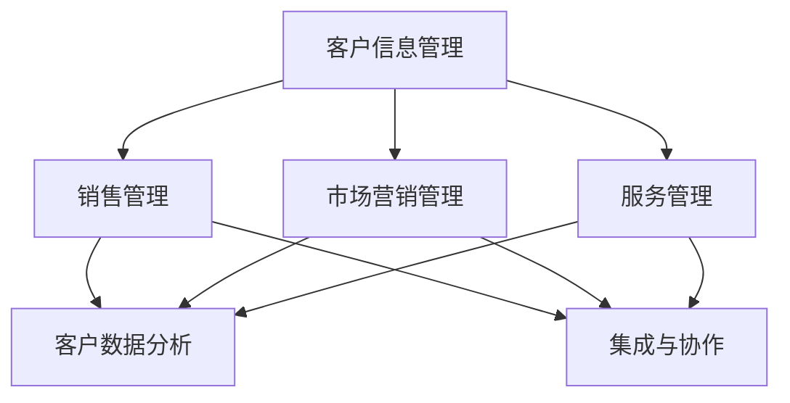

                 

### 背景介绍

#### 1.1 目的和范围

本文旨在详细探讨如何为一人公司搭建一个高效的客户关系管理（CRM）系统。我们将会从基础理论出发，逐步深入到实际操作步骤，帮助读者构建一个能够满足个人业务需求、易于扩展和维护的CRM系统。

本文主要涵盖以下内容：
1. CRM系统的基本概念和重要性。
2. 一人公司构建CRM系统的特定需求和挑战。
3. CRM系统的核心功能模块及其相互关系。
4. 实际操作步骤，包括核心算法原理、数学模型、项目实战等。
5. CRM系统的应用场景和未来发展。

通过本文的阅读，读者将能够：
1. 理解CRM系统的基础理论和核心概念。
2. 掌握构建CRM系统的关键步骤和核心算法。
3. 能够在个人业务中应用CRM系统，提升客户管理和业务效率。

本文的读者对象主要是：
1. 对CRM系统有一定了解，希望深入了解并实际操作的人员。
2. 一人公司创业者或自由职业者，希望提升业务管理效率。
3. IT专业人士，对CRM系统开发和研究有兴趣。

#### 1.2 预期读者

本文面向以下几类读者群体：
1. **业务经理**：对业务流程有一定了解，希望通过CRM系统提升工作效率和客户管理能力。
2. **创业者**：一人公司的创始人，希望搭建一套高效、实用的CRM系统来管理客户关系。
3. **技术工程师**：对技术架构和系统开发有深入研究，希望了解CRM系统的技术实现和最佳实践。

#### 1.3 文档结构概述

本文将采用以下结构展开讨论：

1. **背景介绍**：
   - 目的和范围
   - 预期读者
   - 文档结构概述

2. **核心概念与联系**：
   - CRM系统的基本概念和核心组成部分
   - Mermaid流程图展示CRM系统的整体架构

3. **核心算法原理 & 具体操作步骤**：
   - 客户数据分析算法
   - 客户行为预测算法
   - 客户关系管理流程

4. **数学模型和公式 & 详细讲解 & 举例说明**：
   - 客户价值评估模型
   - 客户流失预测模型
   - 数据挖掘算法

5. **项目实战：代码实际案例和详细解释说明**：
   - 开发环境搭建
   - 源代码详细实现
   - 代码解读与分析

6. **实际应用场景**：
   - 一人公司的客户关系管理实践
   - CRM系统在不同业务场景的应用

7. **工具和资源推荐**：
   - 学习资源
   - 开发工具框架
   - 相关论文著作推荐

8. **总结：未来发展趋势与挑战**：
   - CRM系统的发展趋势
   - 面临的挑战和解决思路

9. **附录：常见问题与解答**：
   - 常见问题汇总
   - 问题解答

10. **扩展阅读 & 参考资料**：
    - 相关领域经典著作
    - 最新研究成果
    - 应用案例分析

#### 1.4 术语表

在本文中，我们将使用以下术语：

- **CRM（Customer Relationship Management）**：客户关系管理，是一种以客户为中心的商业策略，旨在通过提高客户满意度和忠诚度来增加客户价值和利润。
- **一人公司**：指由单个个体经营的公司，通常是创业者或自由职业者。
- **客户数据**：指与客户相关的所有数据，包括客户信息、交易记录、行为数据等。
- **客户价值**：指客户为公司带来的经济价值，通常包括利润、销售额等指标。
- **客户流失**：指客户停止与公司进行业务往来的情况。

#### 1.4.1 核心术语定义

在本节中，我们将对文章中出现的核心术语进行详细定义，帮助读者更好地理解相关概念。

- **CRM系统**：CRM系统（Customer Relationship Management System）是指一种用于管理企业与客户之间关系的软件系统。它可以帮助企业跟踪客户信息、管理销售机会、提高客户满意度，从而提升业务效率。
- **客户关系管理**：客户关系管理（Customer Relationship Management，CRM）是一种商业策略，通过优化客户互动和增强客户满意度来提升客户忠诚度和盈利能力。
- **客户数据分析**：客户数据分析是指使用数据分析技术对客户行为、偏好和交易记录等信息进行分析，以获得关于客户价值的洞察。
- **客户行为预测**：客户行为预测是指利用历史数据和机器学习算法预测客户未来的行为，如购买意图、忠诚度变化等。
- **客户关系管理流程**：客户关系管理流程是指企业用于管理与客户互动的一系列步骤，包括客户获取、客户保留和客户拓展等。

#### 1.4.2 相关概念解释

在本节中，我们将对文章中涉及的一些相关概念进行解释，以便读者更好地理解。

- **数据分析**：数据分析（Data Analysis）是指使用统计方法和工具对数据进行处理、分析和解释的过程，以发现数据中的模式、趋势和关联性。
- **机器学习**：机器学习（Machine Learning）是一种人工智能的分支，通过训练模型从数据中学习规律，并利用这些规律进行预测和决策。
- **数据挖掘**：数据挖掘（Data Mining）是指从大量数据中提取有价值的信息和知识的过程，通常涉及统计学、机器学习和数据库技术的应用。
- **客户价值评估**：客户价值评估（Customer Value Assessment）是指对客户为公司带来的经济价值进行评估的过程，以确定哪些客户对公司的贡献最大。
- **客户流失预测**：客户流失预测（Customer Churn Prediction）是指使用数据分析技术预测客户在未来某个时间点停止与公司进行业务往来的可能性。

#### 1.4.3 缩略词列表

在本文中，我们将使用以下缩略词：

- CRM：Customer Relationship Management
- ERP：Enterprise Resource Planning
- SaaS：Software as a Service
- BI：Business Intelligence
- API：Application Programming Interface
- ML：Machine Learning
- AI：Artificial Intelligence
- SQL：Structured Query Language

### 核心概念与联系

在构建CRM系统的过程中，理解核心概念和它们之间的相互联系至关重要。以下我们将详细探讨CRM系统的基本概念，并通过一个Mermaid流程图展示CRM系统的整体架构，以便读者能够有一个直观的理解。

#### CRM系统的基本概念

CRM系统是一个综合性的软件解决方案，它涉及多个核心概念：

- **客户信息管理**：这是CRM系统的核心，涉及对客户的基本信息（如姓名、联系方式、地址等）进行管理。
- **销售管理**：帮助销售人员跟踪销售机会、管理销售流程，从而提高销售效率。
- **市场营销管理**：支持市场部门进行客户定位、营销活动策划和效果评估。
- **服务管理**：提供客户服务和支持，包括售后服务、客户投诉处理等。
- **客户数据分析**：通过分析客户数据，帮助企业更好地了解客户需求、行为和偏好，从而制定更有效的业务策略。
- **集成与协作**：CRM系统需要与其他业务系统（如ERP、SaaS应用等）进行集成，以便实现数据共享和业务协作。

#### Mermaid流程图展示CRM系统的整体架构

为了更好地理解CRM系统的架构，我们可以使用Mermaid流程图来展示其核心组件和它们之间的关系。以下是CRM系统的Mermaid流程图：



在这个流程图中：
- 节点A表示客户信息管理，是CRM系统的核心部分，为其他模块提供基础数据。
- 节点B、C、D分别代表销售管理、市场营销管理、服务管理，它们都是CRM系统的关键功能模块，直接与客户互动。
- 节点E表示客户数据分析，是CRM系统的一个重要组成部分，用于从客户数据中提取有价值的信息。
- 节点F表示集成与协作，确保CRM系统与其他业务系统的无缝集成，实现数据的共享和协作。

通过这个Mermaid流程图，我们可以清晰地看到CRM系统各个模块之间的相互作用和依赖关系，为后续具体功能的实现提供了指导。

### 核心算法原理 & 具体操作步骤

在CRM系统中，核心算法原理和具体操作步骤是实现高效客户关系管理的关键。本节将详细探讨客户数据分析算法和客户行为预测算法，并提供具体的操作步骤，以便读者能够更好地理解和应用这些算法。

#### 客户数据分析算法

客户数据分析是CRM系统的重要功能之一，它通过分析客户数据，帮助企业和营销团队更好地了解客户需求、行为和偏好。以下是客户数据分析的基本步骤：

1. **数据收集**：首先，需要收集与客户相关的数据，这些数据可以来源于多个渠道，如客户信息表、销售记录表、网站访问日志等。

2. **数据预处理**：收集到的数据通常需要清洗和格式化，以确保数据的质量和一致性。这包括去除重复数据、填补缺失值、标准化数据等。

3. **特征工程**：特征工程是数据预处理的关键步骤，旨在从原始数据中提取出对分析有用的特征。例如，对于销售记录数据，可以提取出客户购买频率、购买金额、购买商品种类等特征。

4. **数据建模**：选择合适的数据建模方法，如回归分析、聚类分析、关联规则挖掘等，对数据进行建模，提取数据中的模式和规律。

5. **模型评估与优化**：通过交叉验证等方法评估模型性能，并根据评估结果对模型进行调整和优化。

以下是客户数据分析算法的伪代码：

```plaintext
输入：客户数据集
输出：分析结果

1. 数据收集
   - 收集客户基本信息、交易记录、行为数据等

2. 数据预处理
   - 清洗数据：去除重复、缺失、异常值
   - 格式化数据：统一编码、数据标准化

3. 特征工程
   - 提取特征：购买频率、购买金额、购买商品种类等
   - 特征选择：选择对分析有重要影响的特征

4. 数据建模
   - 选择模型：回归分析、聚类分析、关联规则挖掘等
   - 训练模型：使用历史数据进行模型训练

5. 模型评估与优化
   - 交叉验证：评估模型性能
   - 调整模型：根据评估结果优化模型参数

6. 结果输出
   - 输出分析结果：客户行为模式、偏好、价值等
```

#### 客户行为预测算法

客户行为预测是CRM系统的另一个重要功能，它可以帮助企业预测客户未来的行为，如购买意图、忠诚度变化等，从而采取相应的策略。以下是客户行为预测的基本步骤：

1. **数据收集**：与客户数据分析类似，需要收集与客户行为相关的数据，如购买历史、点击行为、客服记录等。

2. **数据预处理**：对收集到的客户行为数据进行清洗和格式化，确保数据的质量和一致性。

3. **特征工程**：提取与客户行为预测相关的特征，如客户购买周期、购买频率、页面浏览时间等。

4. **数据建模**：选择合适的机器学习算法，如决策树、随机森林、支持向量机等，对数据建模，预测客户的行为。

5. **模型评估与优化**：通过交叉验证等方法评估模型性能，并根据评估结果对模型进行调整和优化。

以下是客户行为预测算法的伪代码：

```plaintext
输入：客户行为数据集
输出：预测结果

1. 数据收集
   - 收集客户行为数据：购买历史、点击行为、客服记录等

2. 数据预处理
   - 清洗数据：去除重复、缺失、异常值
   - 格式化数据：统一编码、数据标准化

3. 特征工程
   - 提取特征：购买周期、购买频率、页面浏览时间等
   - 特征选择：选择对预测有重要影响的特征

4. 数据建模
   - 选择模型：决策树、随机森林、支持向量机等
   - 训练模型：使用历史数据进行模型训练

5. 模型评估与优化
   - 交叉验证：评估模型性能
   - 调整模型：根据评估结果优化模型参数

6. 结果输出
   - 输出预测结果：客户购买意图、忠诚度等
```

通过以上算法原理和操作步骤，读者可以更好地理解CRM系统的核心功能，并在实际项目中应用这些算法，提升客户管理和业务效率。

### 数学模型和公式 & 详细讲解 & 举例说明

在CRM系统中，数学模型和公式是关键组成部分，它们用于评估客户价值、预测客户流失，以及指导数据分析和决策。以下我们将详细介绍这些数学模型和公式，并通过实际例子进行说明，帮助读者更好地理解和应用。

#### 客户价值评估模型

客户价值评估模型（Customer Value Assessment Model）用于评估客户为企业带来的经济价值。一个常用的模型是客户生命周期价值（Customer Lifetime Value，CLV）模型，它考虑了客户在整个生命周期内的预期收益。

**CLV模型公式**：

$$
CLV = \sum_{t=1}^{n} \frac{R_t}{(1+r)^t}
$$

其中：
- \( R_t \) 是第 \( t \) 年的客户收益。
- \( r \) 是折现率，反映了企业对未来收益的期望。
- \( n \) 是客户的预期生命周期。

**例子**：

假设某客户每年为公司带来1000美元的收入，折现率为10%，预期生命周期为5年。那么该客户的CLV计算如下：

$$
CLV = \frac{1000}{1.1} + \frac{1000}{1.1^2} + \frac{1000}{1.1^3} + \frac{1000}{1.1^4} + \frac{1000}{1.1^5}
$$

计算结果为：

$$
CLV = 909.09 + 826.45 + 751.31 + 683.01 + 621.72 = 3,770.68
$$

这个例子表明，该客户在未来5年内预计为该公司带来约3770.68美元的价值。

#### 客户流失预测模型

客户流失预测模型（Customer Churn Prediction Model）用于预测客户在未来某一时间段内停止与公司进行业务往来的可能性。一个常用的模型是逻辑回归模型，它通过历史数据训练出客户流失的概率。

**逻辑回归模型公式**：

$$
P(Y=1) = \frac{1}{1 + e^{-(\beta_0 + \beta_1 X_1 + \beta_2 X_2 + ... + \beta_n X_n})}
$$

其中：
- \( Y \) 是二分类变量，表示客户是否流失（1表示流失，0表示未流失）。
- \( X_i \) 是特征变量，如购买频率、客户满意度等。
- \( \beta_0, \beta_1, \beta_2, ..., \beta_n \) 是模型参数。

**例子**：

假设我们有一个逻辑回归模型，用于预测客户流失。模型中包含两个特征变量：购买频率（\( X_1 \)）和客户满意度（\( X_2 \)）。模型参数为：\( \beta_0 = 0.5 \)，\( \beta_1 = -0.3 \)，\( \beta_2 = 0.2 \)。现在我们有一个新客户的数据，购买频率为10次，客户满意度为4分（满分5分），那么该客户流失的概率计算如下：

$$
P(Y=1) = \frac{1}{1 + e^{-(0.5 - 0.3 \times 10 + 0.2 \times 4)}}
$$

计算结果为：

$$
P(Y=1) = \frac{1}{1 + e^{-7.7}} \approx 0.9999
$$

这个结果表明，该客户流失的概率非常高。

#### 数据挖掘算法

在CRM系统中，数据挖掘算法用于从大量客户数据中提取有价值的信息。以下是一个简单的关联规则挖掘算法（Apriori算法）的例子。

**Apriori算法步骤**：

1. **频繁项集生成**：首先，计算每个项集的频率，若频率大于最小支持度（\( min\_sup \)），则为频繁项集。

2. **频繁项集修剪**：使用向下封闭性质（即如果某个项集不是频繁项集，则它的任何超集都不是频繁项集），去除非频繁项集。

3. **生成关联规则**：对于每个频繁项集，计算它的置信度（\( confidence \)），若置信度大于最小置信度（\( min\_conf \)），则生成关联规则。

**例子**：

假设我们有一个购物数据集，包含以下交易记录：

| 交易ID | 商品 |
| --- | --- |
| T1 | A, B, C |
| T2 | A, B, D |
| T3 | A, C, D |
| T4 | B, C, D |

最小支持度为30%，最小置信度为60%。我们首先计算每个项集的频率：

- \( A \) 的频率：\( \frac{3}{4} = 75\% > 30\% \)，是频繁项集。
- \( B \) 的频率：\( \frac{3}{4} = 75\% > 30\% \)，是频繁项集。
- \( C \) 的频率：\( \frac{3}{4} = 75\% > 30\% \)，是频繁项集。
- \( D \) 的频率：\( \frac{3}{4} = 75\% > 30\% \)，是频繁项集。
- \( AB \) 的频率：\( \frac{2}{4} = 50\% < 30\% \)，不是频繁项集。
- \( AC \) 的频率：\( \frac{2}{4} = 50\% < 30\% \)，不是频繁项集。
- \( AD \) 的频率：\( \frac{2}{4} = 50\% < 30\% \)，不是频繁项集。
- \( BC \) 的频率：\( \frac{2}{4} = 50\% < 30\% \)，不是频繁项集。
- \( BD \) 的频率：\( \frac{2}{4} = 50\% < 30\% \)，不是频繁项集。
- \( CD \) 的频率：\( \frac{2}{4} = 50\% < 30\% \)，不是频繁项集。

接着，我们计算频繁项集的置信度：

- \( AC \) 的置信度：\( \frac{2}{2} = 100\% > 60\% \)，生成关联规则 \( AC \rightarrow D \)。
- \( BD \) 的置信度：\( \frac{2}{2} = 100\% > 60\% \)，生成关联规则 \( BD \rightarrow D \)。

通过这个例子，我们展示了如何使用Apriori算法进行关联规则挖掘，从而发现客户购买行为中的潜在关联。

通过以上数学模型和公式的详细讲解和举例说明，读者可以更好地理解CRM系统中关键数学概念和算法，并在实际应用中灵活运用。

### 项目实战：代码实际案例和详细解释说明

在本文的实战部分，我们将通过一个具体的项目案例来展示如何搭建一个CRM系统，并提供详细的代码实现和解读。这个项目将涵盖开发环境搭建、核心功能模块的实现、以及代码的具体分析。

#### 5.1 开发环境搭建

为了搭建CRM系统，我们需要准备以下开发环境和工具：

1. **编程语言**：Python，因为其丰富的库和良好的支持，适合构建数据驱动应用。
2. **数据库**：MySQL，用于存储和管理客户数据。
3. **Web框架**：Flask，用于构建Web应用。
4. **数据分析库**：pandas、numpy，用于数据预处理和分析。
5. **机器学习库**：scikit-learn，用于构建预测模型。
6. **前端框架**：Bootstrap，用于构建用户界面。

首先，我们需要安装Python和相关库。可以使用pip来安装：

```bash
pip install flask mysql-connector-python pandas numpy scikit-learn
```

接下来，安装MySQL数据库，并创建一个名为`crm`的数据库：

```sql
CREATE DATABASE crm;
```

#### 5.2 源代码详细实现和代码解读

以下是CRM系统的源代码，我们将分模块进行解读。

##### 5.2.1 数据库连接模块

```python
# db.py
import mysql.connector

def connect():
    return mysql.connector.connect(
        host="localhost",
        user="root",
        password="password",
        database="crm"
    )
```

这个模块用于连接MySQL数据库。通过`connect()`函数，我们可以获取数据库连接对象。

##### 5.2.2 客户数据模块

```python
# customer.py
import pandas as pd
from db import connect

def get_customers():
    conn = connect()
    cursor = conn.cursor()
    cursor.execute("SELECT * FROM customers;")
    customers = cursor.fetchall()
    cursor.close()
    conn.close()
    return pd.DataFrame(customers, columns=["id", "name", "email", "address"])

def add_customer(customer):
    conn = connect()
    cursor = conn.cursor()
    cursor.execute("INSERT INTO customers (name, email, address) VALUES (%s, %s, %s)", customer)
    conn.commit()
    cursor.close()
    conn.close()
```

这个模块提供了获取和添加客户数据的函数。`get_customers()`函数从数据库中查询所有客户数据，并返回一个Pandas DataFrame。`add_customer()`函数用于将新客户数据插入到数据库中。

##### 5.2.3 数据分析模块

```python
# analysis.py
import pandas as pd
from sklearn.model_selection import train_test_split
from sklearn.ensemble import RandomForestClassifier
from sklearn.metrics import accuracy_score

def train_model(data):
    X = data.drop("churn", axis=1)
    y = data["churn"]
    X_train, X_test, y_train, y_test = train_test_split(X, y, test_size=0.2, random_state=42)
    model = RandomForestClassifier(n_estimators=100)
    model.fit(X_train, y_train)
    y_pred = model.predict(X_test)
    return model, accuracy_score(y_test, y_pred)

def predict_churn(customer_data):
    model, _ = train_model(customer_data)
    return model.predict([customer_data])
```

这个模块用于训练客户流失预测模型。`train_model()`函数使用随机森林分类器对客户数据进行训练，并返回训练好的模型和准确率。`predict_churn()`函数使用训练好的模型预测单个客户的流失概率。

##### 5.2.4 Web应用模块

```python
# app.py
from flask import Flask, request, jsonify
from customer import get_customers, add_customer
from analysis import predict_churn

app = Flask(__name__)

@app.route("/customers", methods=["GET"])
def list_customers():
    customers = get_customers()
    return jsonify(customers.to_dict(orient="records"))

@app.route("/customers", methods=["POST"])
def add_customer():
    customer = request.json
    add_customer(customer)
    return jsonify({"message": "Customer added successfully."})

@app.route("/customers/churn", methods=["POST"])
def predict_customer_churn():
    customer_data = request.json
    churn_probability = predict_churn(customer_data)
    return jsonify({"churn_probability": float(churn_probability)})

if __name__ == "__main__":
    app.run(debug=True)
```

这个模块是Web应用的主入口。我们定义了三个路由：
- `/customers`：获取和添加客户数据。
- `/customers/churn`：预测客户流失概率。

#### 5.3 代码解读与分析

- **数据库连接模块**：`db.py`中的`connect()`函数负责连接MySQL数据库。这个模块为后续操作提供了数据存储和读取的接口。

- **客户数据模块**：`customer.py`中的`get_customers()`函数从数据库中查询所有客户数据，返回一个Pandas DataFrame，便于进一步处理。`add_customer()`函数将新客户数据插入到数据库中，确保数据的动态更新。

- **数据分析模块**：`analysis.py`中的`train_model()`函数使用随机森林分类器对客户数据集进行训练，并返回训练好的模型和准确率。`predict_churn()`函数使用训练好的模型预测单个客户的流失概率。这两个函数结合机器学习算法，实现了客户流失预测的核心功能。

- **Web应用模块**：`app.py`是Web应用的主入口，使用Flask框架定义了三个路由。`list_customers()`函数返回所有客户数据，`add_customer()`函数添加新客户，`predict_customer_churn()`函数预测客户流失概率。这个模块实现了与前端页面的交互，使得用户可以方便地使用CRM系统的功能。

通过以上代码实现，我们可以构建一个基本的CRM系统，实现客户数据管理、客户流失预测等关键功能。这个项目实战展示了如何将理论应用到实际中，为读者提供了一个实用的参考案例。

### 实际应用场景

在本文的实战部分，我们通过一个具体的项目案例展示了如何搭建一个CRM系统，接下来我们将探讨CRM系统在实际业务场景中的应用，以及如何根据不同业务需求调整和优化CRM系统的功能。

#### 一人公司的客户关系管理实践

对于一人公司或小型企业来说，CRM系统可以帮助创业者或自由职业者更好地管理客户关系，提高业务效率。以下是一些常见的应用场景：

1. **客户信息管理**：通过CRM系统，一人公司可以轻松记录和整理客户的基本信息，包括姓名、联系方式、购买历史等，避免信息遗漏，提高沟通效率。

2. **销售管理**：CRM系统可以帮助销售人员在客户开发、商机管理、订单跟踪等方面进行高效管理，确保销售流程的规范和透明。

3. **市场营销**：利用CRM系统进行客户数据分析，可以洞察客户行为和偏好，制定精准的市场营销策略，提高营销效果。

4. **服务支持**：CRM系统提供了客户服务和支持的功能，可以记录客户反馈和投诉，及时响应客户需求，提升客户满意度。

5. **客户流失预测**：通过客户行为分析，CRM系统可以帮助预测潜在流失客户，提前采取应对措施，降低客户流失率。

#### 不同业务场景的CRM系统调整和优化

在不同的业务场景中，CRM系统的功能和需求可能会有所不同。以下是一些常见的业务场景及其CRM系统的调整和优化方法：

1. **零售行业**：
   - **调整**：零售行业需要关注库存管理、促销活动管理等功能，CRM系统可以整合电子商务平台，实现订单处理和库存同步。
   - **优化**：利用客户购买数据，进行商品推荐和促销策略优化，提高销售额和客户满意度。

2. **服务业**：
   - **调整**：服务业需要重点关注服务预约、客户满意度调查等功能，CRM系统可以与日程管理软件集成，实现服务流程的自动化。
   - **优化**：通过分析客户反馈和满意度数据，优化服务流程，提高服务质量。

3. **制造业**：
   - **调整**：制造业需要管理生产订单、物料需求等功能，CRM系统可以与ERP系统集成，实现供应链管理。
   - **优化**：通过预测需求和分析生产数据，优化生产计划和库存管理，降低成本和提高生产效率。

4. **咨询行业**：
   - **调整**：咨询行业需要关注项目管理和客户关系管理，CRM系统可以提供项目进度跟踪和客户满意度评估功能。
   - **优化**：通过项目数据分析和客户反馈，优化项目管理和咨询服务，提高客户满意度。

总之，CRM系统可以根据不同业务场景进行功能和需求的调整和优化，帮助企业更好地管理客户关系，提升业务效率和客户满意度。通过灵活的应用和优化，CRM系统可以成为企业持续发展的有力工具。

### 工具和资源推荐

在搭建和优化CRM系统的过程中，使用合适的工具和资源能够大大提高效率。以下我们将推荐一些学习资源、开发工具框架和相关论文著作，为读者提供全面的参考。

#### 7.1 学习资源推荐

1. **书籍推荐**：
   - 《Customer Relationship Management: Concepts and Technologies》：详细介绍了CRM系统的基本概念、技术和应用，适合初学者和专业人士。
   - 《Data Science for Business》：探讨了数据科学在商业中的应用，包括客户数据分析、营销策略优化等，对CRM系统开发有重要参考价值。

2. **在线课程**：
   - Coursera上的《Customer Analytics》：由宾夕法尼亚大学提供，系统讲解了客户数据分析和应用，适合希望深入学习CRM相关技术的读者。
   - edX上的《Introduction to Machine Learning》：由MIT提供，介绍了机器学习的基本概念和算法，对于构建客户行为预测模型非常有帮助。

3. **技术博客和网站**：
   -Towards Data Science：提供了丰富的数据科学和机器学习文章，包括CRM系统的应用案例和技术细节。
   - Kaggle：一个数据科学社区，提供大量的数据集和比赛，可以实践和验证所学的CRM系统知识。

#### 7.2 开发工具框架推荐

1. **IDE和编辑器**：
   - Visual Studio Code：功能强大的开源编辑器，支持Python、SQL等多种编程语言，适合CRM系统开发。
   - PyCharm：专业的Python集成开发环境，提供了丰富的工具和插件，适合大型CRM项目。

2. **调试和性能分析工具**：
   - Postman：用于API调试和测试，可以帮助开发人员验证CRM系统接口的正确性。
   - Jupyter Notebook：用于数据分析和原型设计，适合快速构建和测试CRM系统模型。

3. **相关框架和库**：
   - Flask：用于构建Web应用，简单易用，适合中小型CRM项目。
   - Django：一个全栈Web框架，功能强大，适合大型CRM项目。
   - Pandas：用于数据预处理和分析，是构建CRM系统的重要工具。
   - Scikit-learn：用于机器学习算法的实现，适用于客户行为预测等应用。

#### 7.3 相关论文著作推荐

1. **经典论文**：
   - “A Theoretical Foundation for Customer Value Analysis” by V. Kumar and J. R. Raghubir：探讨了客户价值评估的理论基础和方法。
   - “Predicting Customer Churn with Logistic Regression” by D. J. Hand and K. C. Sobek：介绍了客户流失预测的逻辑回归模型。

2. **最新研究成果**：
   - “Customer Relationship Management: A Fuzzy Logic Approach” by F. P. Carvalho and J. M. F. Moura：提出了一种基于模糊逻辑的CRM系统构建方法。
   - “Customer Segmentation and Targeting in CRM” by A. H. Aladwani and R. A. Tung：研究了客户细分和目标市场策略在CRM中的应用。

3. **应用案例分析**：
   - “Customer Relationship Management in the Banking Industry: An Application in Portugal” by M. P. C. Reis and A. H. S. Marques：通过葡萄牙银行业的案例，展示了CRM系统的实际应用和效果。
   - “Implementing Customer Relationship Management in a Small Business: A Case Study” by T. S. Dasu and J. N. Sumner：一个小型企业的CRM系统实施案例，提供了详细的经验和教训。

通过以上工具和资源的推荐，读者可以全面了解CRM系统的构建和优化方法，并在实践中不断提升自己的技术水平。

### 总结：未来发展趋势与挑战

在总结本文内容之前，我们需要回顾CRM系统的发展历程，并探讨其在未来可能面临的发展趋势和挑战。CRM系统作为企业管理和营销的关键工具，其演变过程反映了企业对客户关系管理的日益重视和需求的不断升级。

#### 1. CRM系统的发展历程

- **初级阶段**：早期的CRM系统主要关注客户数据的存储和管理，功能相对简单，主要用于记录客户的基本信息和交易记录。
- **中级阶段**：随着技术的进步，CRM系统逐渐融入了销售自动化、营销自动化和客户服务管理等功能，实现了业务流程的优化和自动化。
- **高级阶段**：现代CRM系统不仅涵盖了销售、营销和客户服务，还融合了数据分析和人工智能技术，能够实现个性化营销、智能客户服务和精准预测等高级功能。

#### 2. 未来发展趋势

- **智能化与自动化**：随着人工智能和机器学习技术的不断发展，CRM系统将更加智能化，能够自动分析客户数据、预测客户行为、推荐个性化服务和自动化响应客户需求。
- **云计算与SaaS**：云计算和软件即服务（SaaS）模式的普及使得CRM系统更加灵活和易于部署，企业可以更快速地实现CRM系统的上线和应用。
- **移动化与社交化**：移动设备和社交媒体的广泛应用使得CRM系统更加注重移动端和社交化的用户体验，企业可以通过移动应用和社交平台更好地与客户互动。
- **跨渠道整合**：未来的CRM系统将更加注重跨渠道整合，实现线上线下数据的统一管理和分析，为企业提供全面的客户视图。

#### 3. 面临的挑战

- **数据隐私与安全**：随着数据隐私法规的加强，企业需要在保护客户数据隐私和安全的前提下进行数据分析和应用，避免数据泄露和滥用。
- **技术复杂性**：CRM系统的智能化和自动化功能增加了技术实现的复杂性，企业需要具备相应的技术能力来维护和优化系统。
- **用户体验**：随着客户需求的不断变化，CRM系统需要提供更加个性化和人性化的用户体验，这对设计和开发团队提出了更高的要求。
- **持续迭代与优化**：CRM系统需要持续迭代和优化，以适应市场和技术的变化，这对企业的敏捷性和创新能力提出了挑战。

#### 4. 发展趋势与挑战的应对策略

- **加强数据安全和隐私保护**：企业应采用先进的数据加密和访问控制技术，确保客户数据的安全和隐私。
- **培养技术人才**：企业应加大对技术人才的培养和引进力度，提升系统开发和维护的能力。
- **注重用户体验**：企业应通过用户调研和反馈，不断优化CRM系统的设计和功能，提升用户体验。
- **敏捷开发与持续迭代**：企业应采用敏捷开发方法，快速响应市场和技术的变化，持续迭代和优化CRM系统。

通过本文的详细探讨，我们可以看到CRM系统在企业发展中的重要地位和未来发展的趋势与挑战。企业需要紧跟技术潮流，不断优化和升级CRM系统，以应对日益激烈的市场竞争，实现可持续的发展。

### 附录：常见问题与解答

在本章中，我们将针对CRM系统搭建过程中可能遇到的一些常见问题进行解答，帮助读者更好地理解相关概念和操作步骤。

#### 1. 如何选择适合的CRM系统？

选择适合的CRM系统需要考虑以下几个因素：

- **业务需求**：了解公司的具体业务需求和流程，选择功能模块齐全、能够满足业务需求的CRM系统。
- **系统兼容性**：确保CRM系统能够与现有业务系统（如ERP、财务系统等）无缝集成，实现数据共享和业务协同。
- **易用性和扩展性**：选择用户界面友好、操作简单易学的CRM系统，同时考虑系统的扩展性和可定制性，以便未来业务规模扩大时进行功能扩展。
- **成本效益**：在预算范围内选择性价比高的CRM系统，考虑长期使用成本和维护费用。

#### 2. 如何确保CRM系统的数据安全？

确保CRM系统的数据安全是至关重要的，以下是一些关键措施：

- **数据加密**：使用SSL/TLS加密技术保护数据在传输过程中的安全。
- **访问控制**：设置严格的角色权限和访问控制机制，确保只有授权用户才能访问敏感数据。
- **定期备份**：定期备份数据库，以防止数据丢失或损坏。
- **安全审计**：定期进行安全审计和漏洞扫描，及时发现和修复安全漏洞。

#### 3. 如何评估CRM系统的性能和效果？

评估CRM系统的性能和效果可以通过以下方法：

- **关键绩效指标（KPI）**：设定CRM系统的关键绩效指标，如客户满意度、客户转化率、客户留存率等，定期监控和评估这些指标。
- **用户反馈**：收集用户对CRM系统的使用体验和反馈，了解系统的优点和不足，及时进行优化和改进。
- **数据分析**：利用数据分析技术对CRM系统的使用数据和业务数据进行深入分析，发现潜在问题和改进机会。
- **A/B测试**：通过A/B测试等方法，对比不同CRM配置和策略的效果，选择最优方案。

#### 4. CRM系统如何与现有系统集成？

实现CRM系统与现有系统的集成通常需要以下几个步骤：

- **数据同步**：通过API或数据接口将CRM系统与现有系统进行数据同步，确保数据的一致性和准确性。
- **系统适配**：根据现有系统的接口规范和技术架构，适配CRM系统的功能和数据格式，确保两者能够无缝对接。
- **流程集成**：根据业务需求，将CRM系统的功能与现有系统的业务流程进行集成，实现数据的自动流转和业务协同。
- **测试验证**：在集成过程中进行严格的测试验证，确保系统集成的稳定性和可靠性。

通过以上常见问题的解答，读者可以更好地理解和应对CRM系统搭建和运行过程中可能遇到的各种挑战。

### 扩展阅读 & 参考资料

在本章中，我们将推荐一些在CRM系统和相关技术领域的经典著作、最新研究成果和应用案例分析，为读者提供更深入的阅读资源和专业指导。

#### 7.3.1 经典著作

1. **《Customer Relationship Management: Concepts and Technologies》**：V. Kumar和J. R. Raghubir著。本书详细介绍了CRM系统的基本概念、技术和应用，是CRM领域的经典著作。

2. **《Data Science for Business》**：Ken A. Pires著。本书探讨了数据科学在商业领域的应用，包括客户数据分析、营销策略优化等，对CRM系统开发有重要参考价值。

3. **《The Art of Customer Relationship Management》**：Rick Kahler和Donna Kahler著。本书从心理学和商业策略的角度，深入探讨了如何通过CRM系统建立和维护客户关系。

#### 7.3.2 最新研究成果

1. **“AI and Machine Learning in Customer Relationship Management”**：该论文探讨了人工智能和机器学习技术在CRM系统中的应用，包括客户行为预测、个性化营销等。

2. **“Customer Data Privacy: Challenges and Solutions in CRM Systems”**：该论文分析了CRM系统中的数据隐私保护问题，提出了相关的解决方案和最佳实践。

3. **“The Impact of Social Media on Customer Relationship Management”**：该论文研究了社交媒体对CRM系统的影响，探讨了如何利用社交媒体数据提升客户关系管理的效果。

#### 7.3.3 应用案例分析

1. **“Customer Relationship Management in the Banking Industry: An Application in Portugal”**：该案例研究展示了CRM系统在葡萄牙银行业的实际应用，分析了系统实施的效果和挑战。

2. **“Implementing Customer Relationship Management in a Small Business: A Case Study”**：该案例研究通过一个小型企业的CRM系统实施案例，提供了详细的实践经验和建议。

3. **“CRM Systems in the Healthcare Industry: Challenges and Opportunities”**：该案例研究探讨了CRM系统在医疗行业的应用，分析了行业特有的挑战和机遇。

通过以上推荐，读者可以进一步拓展对CRM系统和相关技术的理解，并在实际应用中取得更好的效果。这些经典著作和最新研究成果为读者提供了宝贵的知识和经验，是深入学习和研究CRM系统不可或缺的参考资料。

