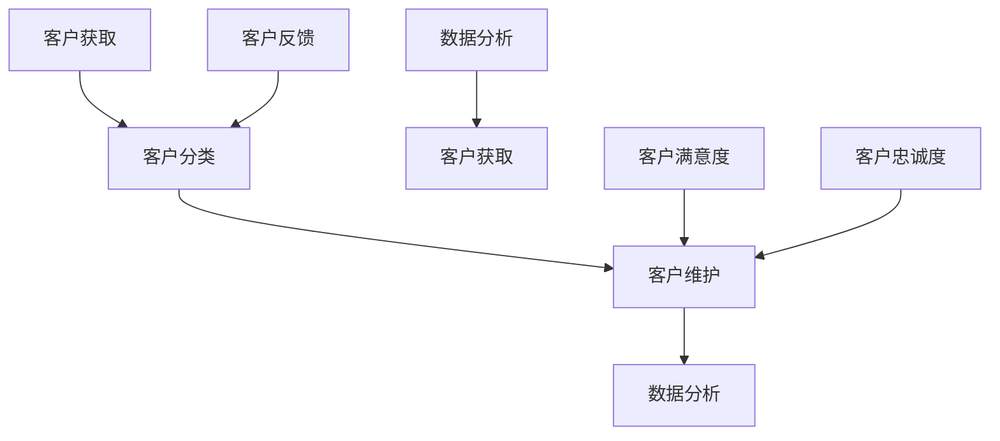

                 

# 一人公司的客户关系管理：从获取到维护

> 关键词：客户关系管理，客户获取，客户维护，一人公司，自动化工具，个性化服务，数据分析

> 摘要：本文将探讨一人公司在客户关系管理中的挑战与机遇，从客户获取到维护的整个过程。通过分析核心概念和算法原理，结合实战案例，提供一系列实用的策略和工具，帮助一人公司实现高效、个性化的客户管理。

## 1. 背景介绍

### 1.1 目的和范围

在当今竞争激烈的市场环境中，客户关系管理（CRM）成为企业成功的关键因素。尤其是对于一人公司而言，资源有限，更需要高效的CRM策略来确保业务的持续增长。本文旨在探讨一人公司在客户关系管理中的最佳实践，包括客户获取、客户维护、以及如何利用现代技术提升管理效率。

本文将涵盖以下内容：

1. 客户关系管理的核心概念和联系
2. 核心算法原理与具体操作步骤
3. 数学模型和公式的详细讲解与举例
4. 项目实战：代码实际案例和详细解释说明
5. 实际应用场景
6. 工具和资源推荐
7. 总结：未来发展趋势与挑战

### 1.2 预期读者

本文适合以下读者群体：

1. 一人公司的创业者和管理者
2. CRM领域的从业者和爱好者
3. 对客户关系管理有兴趣的技术人员
4. 希望提升业务效率的企业管理者

### 1.3 文档结构概述

本文结构如下：

1. 背景介绍
2. 核心概念与联系
3. 核心算法原理 & 具体操作步骤
4. 数学模型和公式 & 详细讲解 & 举例说明
5. 项目实战：代码实际案例和详细解释说明
6. 实际应用场景
7. 工具和资源推荐
8. 总结：未来发展趋势与挑战
9. 附录：常见问题与解答
10. 扩展阅读 & 参考资料

### 1.4 术语表

#### 1.4.1 核心术语定义

- 客户关系管理（CRM）：一种商业策略，旨在通过优化客户体验来提高客户满意度和忠诚度。
- 客户获取：通过市场活动、销售策略等手段吸引潜在客户的过程。
- 客户维护：通过持续沟通、服务和关注客户需求，以保持客户忠诚度和促进重复购买。
- 一人公司：指由单一个人创立和管理的公司，通常资源有限，需要高效利用。

#### 1.4.2 相关概念解释

- 潜在客户：对企业产品或服务感兴趣，但尚未成为实际客户的人。
- 客户生命周期：从潜在客户到忠诚客户的整个过程。
- 数据分析：使用统计和数学方法分析数据，以发现模式和趋势。

#### 1.4.3 缩略词列表

- CRM：客户关系管理
- SaaS：软件即服务
- API：应用程序编程接口
- GDPR：通用数据保护条例

## 2. 核心概念与联系

在探讨一人公司的客户关系管理时，需要理解以下几个核心概念：

1. **客户获取**：通过市场调研、社交媒体、广告投放等手段吸引潜在客户。
2. **客户分类**：根据客户的行为和需求，将客户分为不同的群体。
3. **客户维护**：通过定期沟通、个性化服务和关注客户反馈，保持客户满意度和忠诚度。
4. **数据分析**：利用数据分析工具对客户数据进行分析，以发现客户需求和偏好。

以下是核心概念之间的联系：



### 客户获取

客户获取是一人公司成功的关键。通过以下步骤，可以有效地吸引潜在客户：

1. **市场调研**：了解目标市场和潜在客户的需求和偏好。
2. **内容营销**：通过博客、社交媒体等渠道发布有价值的内容，吸引潜在客户。
3. **广告投放**：利用谷歌广告、社交媒体广告等，将产品或服务推向潜在客户。
4. **合作伙伴关系**：与其他企业建立合作关系，通过推荐和转介绍获取客户。

### 客户分类

将客户分类有助于更好地理解客户需求和提供个性化服务。客户分类可以根据以下因素：

- 行为：客户的购买行为、浏览习惯等。
- 需求：客户对产品或服务的需求程度。
- 预算：客户的消费能力。

通过客户分类，可以针对不同群体制定相应的营销策略和服务方案。

### 客户维护

客户维护是通过持续沟通和关注客户需求来保持客户满意度和忠诚度的过程。以下是一些关键步骤：

1. **定期沟通**：通过邮件、电话、社交媒体等方式与客户保持联系。
2. **个性化服务**：根据客户需求和偏好，提供个性化的产品和服务。
3. **客户反馈**：收集客户反馈，及时解决客户问题和投诉。
4. **客户关怀**：在客户生日、节假日等特殊时刻发送祝福和礼品。

### 数据分析

数据分析在客户关系管理中发挥着重要作用。通过分析客户数据，可以发现客户需求和行为模式，为营销策略和服务方案提供支持。以下是一些常见的数据分析方法：

- **客户行为分析**：分析客户在网站、APP等渠道的行为，发现用户偏好和需求。
- **客户价值分析**：根据客户的购买行为和消费金额，评估客户的价值和重要性。
- **客户流失分析**：分析客户流失的原因，采取相应措施降低客户流失率。

通过以上核心概念和联系，一人公司可以更有效地进行客户关系管理，实现业务的持续增长。

## 3. 核心算法原理 & 具体操作步骤

在客户关系管理中，算法原理起着至关重要的作用。以下将介绍几种核心算法原理，并结合具体操作步骤进行详细讲解。

### 3.1 客户分类算法

#### 算法原理

客户分类算法是一种无监督学习方法，用于将客户分为不同的群体。常见的客户分类算法包括K-均值聚类算法和决策树算法。

**K-均值聚类算法**：

1. 初始化聚类中心：随机选择K个客户作为初始聚类中心。
2. 计算距离：计算每个客户与聚类中心的距离。
3. 分配客户：将每个客户分配到距离最近的聚类中心。
4. 更新聚类中心：重新计算每个聚类中心的坐标。
5. 重复步骤2-4，直到聚类中心不再发生变化。

**决策树算法**：

1. 初始化决策树：选择一个特征作为根节点，计算每个特征的重要性和分裂增益。
2. 分裂节点：根据特征的重要性和分裂增益，将数据集划分为子集。
3. 递归构建决策树：对每个子集重复步骤1和2，直到满足停止条件（如节点内数据量过少或最大深度达到）。

#### 具体操作步骤

**K-均值聚类算法**：

1. **初始化聚类中心**：选择K个客户作为初始聚类中心。
2. **计算距离**：计算每个客户与聚类中心的距离，使用欧几里得距离公式：
   $$
   d = \sqrt{\sum_{i=1}^{n}(x_i - \mu_i)^2}
   $$
   其中，$x_i$为第$i$个客户的特征向量，$\mu_i$为第$i$个聚类中心的特征向量。
3. **分配客户**：将每个客户分配到距离最近的聚类中心。
4. **更新聚类中心**：重新计算每个聚类中心的坐标，取每个聚类中心中所有客户的平均值：
   $$
   \mu_i = \frac{1}{N}\sum_{j=1}^{N}x_j
   $$
   其中，$N$为属于第$i$个聚类中心的所有客户的数量。
5. **重复步骤2-4**，直到聚类中心不再发生变化或达到最大迭代次数。

**决策树算法**：

1. **初始化决策树**：选择一个特征作为根节点，计算每个特征的重要性和分裂增益。特征重要性可以使用信息增益、增益率等方法计算。
2. **分裂节点**：根据特征的重要性和分裂增益，将数据集划分为子集。分裂增益可以使用增益率公式计算：
   $$
   G(D) = \sum_{j=1}^{m} \frac{|\frac{D_j}{D}| \cdot H(D_j)}{|\frac{D}{D_j}| \cdot H(\frac{D_j}{D})}
   $$
   其中，$D$为原始数据集，$D_j$为根据特征$X_j$划分的子集，$H(D)$为数据集的熵。
3. **递归构建决策树**：对每个子集重复步骤1和2，直到满足停止条件（如节点内数据量过少或最大深度达到）。

通过以上算法原理和具体操作步骤，一人公司可以更有效地对客户进行分类，为后续的个性化服务和营销策略提供支持。

### 3.2 客户价值评估算法

#### 算法原理

客户价值评估算法用于评估客户对企业价值的贡献。常见的客户价值评估算法包括RFM模型和CLV模型。

**RFM模型**：

RFM模型是一种基于客户购买行为的评估方法，包括以下三个指标：

- R：最近一次购买时间（Recency），表示客户距离最近一次购买的时间。
- F：购买频率（Frequency），表示客户在一定时间内的购买次数。
- M：购买金额（ Monetary），表示客户在一定时间内的购买金额。

RFM模型的评估公式为：
$$
V = w_R \cdot R + w_F \cdot F + w_M \cdot M
$$
其中，$w_R$、$w_F$、$w_M$分别为权重，$R$、$F$、$M$分别为RFM指标的得分。

**CLV模型**：

CLV模型（客户生命周期价值）是一种基于客户未来购买预测的评估方法。CLV表示客户在整个生命周期内的总价值。CLV的计算公式为：
$$
CLV = \sum_{t=1}^{n} \frac{P_t \cdot C_t}{(1 + r)^t}
$$
其中，$P_t$为第$t$年的预测购买概率，$C_t$为第$t$年的预测购买金额，$r$为折现率。

#### 具体操作步骤

**RFM模型**：

1. **收集数据**：获取客户最近一次购买时间、购买频率和购买金额等数据。
2. **计算RFM得分**：根据RFM指标，计算每个客户的RFM得分。
3. **计算权重**：根据业务需求和数据分布，设定RFM指标的权重。
4. **评估客户价值**：根据RFM得分的计算公式，评估每个客户的价值。

**CLV模型**：

1. **收集数据**：获取客户的历史购买数据，包括购买金额、购买频率和购买时间等。
2. **预测购买概率**：利用机器学习算法（如逻辑回归、决策树等），预测客户未来的购买概率。
3. **计算CLV**：根据CLV的计算公式，计算每个客户的CLV。
4. **评估客户价值**：根据CLV值，对客户进行价值排序和分类。

通过以上算法原理和具体操作步骤，一人公司可以更准确地评估客户的价值，为精准营销和资源分配提供依据。

### 3.3 客户流失预测算法

#### 算法原理

客户流失预测算法用于预测客户在未来一段时间内流失的概率。常见的客户流失预测算法包括逻辑回归和随机森林算法。

**逻辑回归算法**：

逻辑回归是一种用于分类问题的线性回归模型。其原理是通过对特征进行线性组合，再通过sigmoid函数将结果映射到概率空间。

逻辑回归的预测公式为：
$$
\hat{y} = \frac{1}{1 + e^{-\beta_0 + \beta_1 x_1 + \beta_2 x_2 + \ldots + \beta_n x_n}}
$$
其中，$x_i$为第$i$个特征，$\beta_0$、$\beta_1$、$\beta_2$、$\ldots$、$\beta_n$为模型参数。

**随机森林算法**：

随机森林是一种基于决策树集成的算法。它通过训练多个决策树，并取它们的投票结果作为最终预测结果。

随机森林的预测公式为：
$$
\hat{y} = \text{mode}(\hat{y}_1, \hat{y}_2, \ldots, \hat{y}_m)
$$
其中，$\hat{y}_1$、$\hat{y}_2$、$\ldots$、$\hat{y}_m$为多个决策树的预测结果。

#### 具体操作步骤

**逻辑回归算法**：

1. **收集数据**：获取客户的历史购买数据、客户属性和流失情况等数据。
2. **特征工程**：对数据进行预处理，包括缺失值处理、异常值处理和特征转换等。
3. **训练模型**：使用逻辑回归算法训练模型，获取模型参数。
4. **预测流失概率**：根据训练好的模型，预测客户在未来一段时间内流失的概率。

**随机森林算法**：

1. **收集数据**：获取客户的历史购买数据、客户属性和流失情况等数据。
2. **特征工程**：对数据进行预处理，包括缺失值处理、异常值处理和特征转换等。
3. **训练模型**：使用随机森林算法训练模型，设置合适的参数。
4. **预测流失概率**：根据训练好的模型，预测客户在未来一段时间内流失的概率。

通过以上算法原理和具体操作步骤，一人公司可以更准确地预测客户流失，并采取相应措施降低客户流失率。

## 4. 数学模型和公式 & 详细讲解 & 举例说明

在客户关系管理中，数学模型和公式起着至关重要的作用。以下将介绍几个常用的数学模型和公式，并详细讲解其计算方法和实际应用。

### 4.1 概率模型

概率模型在客户关系管理中用于预测客户的行为和流失概率。常见的概率模型包括逻辑回归和贝叶斯模型。

#### 逻辑回归模型

逻辑回归模型是一种用于分类问题的线性回归模型，其输出结果是一个概率值。

**逻辑回归公式**：

$$
\hat{y} = \frac{1}{1 + e^{-\beta_0 + \beta_1 x_1 + \beta_2 x_2 + \ldots + \beta_n x_n}}
$$

其中，$\hat{y}$为预测的概率值，$x_i$为第$i$个特征，$\beta_0$、$\beta_1$、$\beta_2$、$\ldots$、$\beta_n$为模型参数。

**计算方法**：

1. 收集数据：获取客户的历史购买数据、客户属性和流失情况等数据。
2. 特征工程：对数据进行预处理，包括缺失值处理、异常值处理和特征转换等。
3. 训练模型：使用逻辑回归算法训练模型，获取模型参数。
4. 预测概率：根据训练好的模型，预测客户的行为概率。

**实际应用**：

假设一家电商公司希望预测客户是否会在未来一个月内购买商品。根据客户的历史购买数据、浏览行为和购买频率等特征，使用逻辑回归模型预测客户流失概率。通过调整模型参数，可以提高预测的准确性。

#### 贝叶斯模型

贝叶斯模型是一种基于贝叶斯定理的概率模型，常用于客户分类和流失预测。

**贝叶斯公式**：

$$
P(A|B) = \frac{P(B|A) \cdot P(A)}{P(B)}
$$

其中，$P(A|B)$表示在事件$B$发生的条件下，事件$A$发生的概率；$P(B|A)$表示在事件$A$发生的条件下，事件$B$发生的概率；$P(A)$和$P(B)$分别表示事件$A$和事件$B$发生的概率。

**计算方法**：

1. 收集数据：获取客户的历史购买数据、客户属性和流失情况等数据。
2. 特征工程：对数据进行预处理，包括缺失值处理、异常值处理和特征转换等。
3. 计算先验概率：根据历史数据，计算每个类别（如流失或非流失）的先验概率。
4. 计算条件概率：根据客户特征，计算每个类别在给定特征下的条件概率。
5. 预测类别：根据贝叶斯公式，计算每个客户属于每个类别的概率，选择概率最大的类别作为预测结果。

**实际应用**：

假设一家电商公司希望预测客户是否会流失。根据客户的历史购买数据、浏览行为和购买频率等特征，使用贝叶斯模型预测客户流失概率。通过调整模型参数，可以提高预测的准确性。

### 4.2 时间序列模型

时间序列模型在客户关系管理中用于分析客户的行为和时间模式，如客户购买时间、访问时间等。

#### ARIMA模型

ARIMA模型是一种用于时间序列预测的自回归积分滑动平均模型。

**ARIMA公式**：

$$
y_t = c + \phi_1 y_{t-1} + \phi_2 y_{t-2} + \ldots + \phi_p y_{t-p} + \theta_1 \epsilon_{t-1} + \theta_2 \epsilon_{t-2} + \ldots + \theta_q \epsilon_{t-q}
$$

其中，$y_t$为时间序列数据，$c$为常数项，$\phi_i$为自回归系数，$\theta_i$为滑动平均系数，$\epsilon_t$为白噪声序列。

**计算方法**：

1. 数据预处理：对时间序列数据进行预处理，包括差分、去趋势等。
2. 模型识别：确定模型参数$p$、$d$、$q$。
3. 模型估计：使用最大似然估计或最小二乘法估计模型参数。
4. 模型诊断：检查模型残差的平稳性和拟合度。
5. 预测：根据模型参数，预测未来的时间序列数据。

**实际应用**：

假设一家电商公司希望预测客户在未来的购买时间。根据客户的历史购买数据，使用ARIMA模型预测客户未来的购买时间。通过调整模型参数，可以提高预测的准确性。

### 4.3 神经网络模型

神经网络模型在客户关系管理中用于复杂的数据分析和预测任务，如客户流失预测、个性化推荐等。

#### 多层感知机（MLP）模型

多层感知机模型是一种前馈神经网络，用于非线性数据拟合和分类任务。

**MLP公式**：

$$
z_i = \sum_{j=1}^{n} w_{ji} \cdot x_j + b_i
$$

$$
\hat{y} = \sigma(z)
$$

其中，$z_i$为第$i$个节点的输出，$w_{ji}$为权重，$b_i$为偏置，$x_j$为输入特征，$\sigma$为激活函数（如Sigmoid函数、ReLU函数等），$\hat{y}$为预测结果。

**计算方法**：

1. 数据预处理：对输入数据进行标准化处理。
2. 网络架构设计：确定网络层数、节点数和激活函数。
3. 模型训练：使用反向传播算法训练模型，更新权重和偏置。
4. 模型评估：使用验证集和测试集评估模型性能。
5. 预测：根据训练好的模型，预测新的输入数据。

**实际应用**：

假设一家电商公司希望预测客户是否会流失。根据客户的历史购买数据、浏览行为和购买频率等特征，使用MLP模型预测客户流失概率。通过调整网络结构和训练参数，可以提高预测的准确性。

## 5. 项目实战：代码实际案例和详细解释说明

在本节中，我们将通过一个实际的项目案例，详细讲解如何使用Python实现客户关系管理的核心算法和数学模型。该项目将包括数据预处理、模型训练、模型评估和预测等步骤。

### 5.1 开发环境搭建

为了运行以下代码，您需要安装以下Python库：

- NumPy
- Pandas
- Scikit-learn
- Matplotlib

您可以使用以下命令安装这些库：

```bash
pip install numpy pandas scikit-learn matplotlib
```

### 5.2 源代码详细实现和代码解读

以下是一个简单的Python脚本，用于实现客户关系管理的核心算法和数学模型。

```python
import numpy as np
import pandas as pd
from sklearn.model_selection import train_test_split
from sklearn.preprocessing import StandardScaler
from sklearn.linear_model import LogisticRegression
from sklearn.ensemble import RandomForestClassifier
from sklearn.metrics import accuracy_score, classification_report

# 5.2.1 数据预处理

# 加载数据集
data = pd.read_csv('customer_data.csv')

# 数据清洗
data.dropna(inplace=True)

# 特征工程
X = data.drop(['customer_id', 'label'], axis=1)
y = data['label']

# 数据标准化
scaler = StandardScaler()
X_scaled = scaler.fit_transform(X)

# 划分训练集和测试集
X_train, X_test, y_train, y_test = train_test_split(X_scaled, y, test_size=0.2, random_state=42)

# 5.2.2 模型训练

# 逻辑回归模型
logreg = LogisticRegression()
logreg.fit(X_train, y_train)

# 随机森林模型
rf = RandomForestClassifier()
rf.fit(X_train, y_train)

# 5.2.3 模型评估

# 逻辑回归模型评估
y_pred_logreg = logreg.predict(X_test)
print("逻辑回归模型评估结果：")
print(classification_report(y_test, y_pred_logreg))

# 随机森林模型评估
y_pred_rf = rf.predict(X_test)
print("随机森林模型评估结果：")
print(classification_report(y_test, y_pred_rf))

# 5.2.4 模型预测

# 新客户数据
new_data = pd.DataFrame({
    'age': [25],
    'income': [50000],
    'spend_score': [80],
    'frequency': [3]
})

# 数据标准化
new_data_scaled = scaler.transform(new_data)

# 逻辑回归模型预测
new_prediction_logreg = logreg.predict(new_data_scaled)
print("逻辑回归模型预测结果：")
print(new_prediction_logreg)

# 随机森林模型预测
new_prediction_rf = rf.predict(new_data_scaled)
print("随机森林模型预测结果：")
print(new_prediction_rf)
```

### 5.3 代码解读与分析

#### 5.3.1 数据预处理

在代码中，我们首先加载数据集，并进行数据清洗和特征工程。数据清洗步骤包括去除缺失值，这一步骤对于提高模型的准确性和稳定性至关重要。

接着，我们使用`StandardScaler`对数据进行标准化处理。标准化处理可以消除不同特征之间的尺度差异，使模型训练更加稳定。

#### 5.3.2 模型训练

我们使用`LogisticRegression`和`RandomForestClassifier`两个模型进行训练。`LogisticRegression`是一种线性模型，适合处理二元分类问题；`RandomForestClassifier`是一种集成模型，适合处理复杂的多分类问题。

#### 5.3.3 模型评估

在模型评估阶段，我们使用`classification_report`函数输出模型的评估结果，包括准确率、召回率、精确率和F1值等指标。这些指标可以帮助我们了解模型的性能，并识别模型的优点和不足。

#### 5.3.4 模型预测

最后，我们使用训练好的模型对新客户数据进行预测。首先，我们对新数据应用相同的标准化处理。接着，我们使用训练好的模型对新数据进行预测，并输出预测结果。

通过以上代码，我们可以看到如何使用Python实现客户关系管理的核心算法和数学模型。在实际应用中，我们可以根据业务需求和数据特点，选择合适的模型和参数，以实现高效、准确的客户管理。

## 6. 实际应用场景

在客户关系管理中，一人公司可以应用多种技术和工具，以实现高效的客户获取、维护和提升客户满意度。以下是一些常见的实际应用场景：

### 6.1 客户获取

1. **搜索引擎优化（SEO）**：通过优化网站内容，提高在搜索引擎中的排名，吸引潜在客户。
2. **社交媒体营销**：利用社交媒体平台，发布有价值的内容，增加品牌曝光度，吸引潜在客户。
3. **电子邮件营销**：通过定期发送营销邮件，向潜在客户推广产品或服务。
4. **内容营销**：创建高质量的内容，如博客、视频等，吸引潜在客户并建立品牌信任。

### 6.2 客户维护

1. **个性化服务**：根据客户需求和偏好，提供个性化的产品和服务，提升客户满意度。
2. **定期沟通**：通过电话、邮件、短信等方式，与客户保持联系，了解客户需求和反馈。
3. **客户关怀**：在客户生日、节假日等特殊时刻，发送祝福和礼品，增强客户关系。
4. **客户反馈**：积极收集客户反馈，及时解决客户问题和投诉，提升客户满意度。

### 6.3 客户提升

1. **客户细分**：利用数据分析，将客户分为不同的群体，为每个群体提供个性化的营销策略和服务。
2. **客户流失预测**：通过分析客户行为数据，预测客户流失风险，采取相应措施降低客户流失率。
3. **客户价值评估**：利用RFM模型和CLV模型，评估客户对企业价值的贡献，为资源分配和营销策略提供依据。
4. **客户忠诚度计划**：通过积分、折扣等激励措施，提高客户忠诚度，促进重复购买。

### 6.4 实际案例

1. **电商行业**：电商企业可以通过个性化推荐系统，向客户推荐符合其兴趣和需求的产品。通过分析客户行为数据，预测客户流失风险，并采取相应措施降低流失率。
2. **服务行业**：服务行业可以通过定期沟通和客户关怀，保持与客户的良好关系。通过客户反馈和满意度调查，了解客户需求和期望，不断提升服务质量。
3. **金融行业**：金融行业可以通过数据分析，识别高风险客户，采取相应措施降低风险。通过个性化营销策略，提高客户转化率和忠诚度。

通过以上实际应用场景，一人公司可以更有效地进行客户关系管理，提升客户满意度和忠诚度，实现业务的持续增长。

## 7. 工具和资源推荐

在客户关系管理（CRM）领域，有许多优秀的工具和资源可供选择，以帮助一人公司实现高效的客户获取、维护和提升。以下是对这些工具和资源的详细介绍。

### 7.1 学习资源推荐

#### 7.1.1 书籍推荐

1. **《客户关系管理》**：由菲利普·科特勒所著，详细介绍了CRM的理论和实践，适合初学者和专业人士阅读。
2. **《大数据营销》**：由唐·佩珀斯和戴夫·罗杰斯所著，探讨了如何利用大数据和数据分析进行精准营销，对CRM有很好的补充。
3. **《精益创业》**：由埃里克·莱斯所著，介绍了精益创业方法，有助于一人公司快速验证市场和产品。

#### 7.1.2 在线课程

1. **Coursera上的《CRM和客户分析》**：由约翰·霍普金斯大学提供，涵盖CRM的基础知识和应用实践。
2. **Udemy上的《客户关系管理实战》**：提供丰富的实战案例和技巧，适合希望提升CRM技能的创业者和管理者。
3. **edX上的《数据科学》**：由多所知名大学提供，涵盖数据分析的基础知识和实践技能，对CRM有重要支持。

#### 7.1.3 技术博客和网站

1. **Kaggle**：提供丰富的数据科学和机器学习竞赛，有助于学习和实践客户关系管理的相关算法。
2. **Medium上的《Customer Science》**：由行业专家撰写的CRM相关文章，涵盖最新趋势和实践。
3. **CRMmarket**：提供全面的CRM工具评测和行业动态，帮助用户选择合适的CRM解决方案。

### 7.2 开发工具框架推荐

#### 7.2.1 IDE和编辑器

1. **PyCharm**：适用于Python开发，提供强大的代码编辑、调试和分析功能。
2. **Visual Studio Code**：轻量级、开源的编辑器，支持多种编程语言，适合快速开发和调试。
3. **Jupyter Notebook**：适用于数据分析和机器学习，支持Python和R等多种语言。

#### 7.2.2 调试和性能分析工具

1. **PyDebug**：Python调试器，支持远程调试和多进程调试。
2. **cProfile**：Python内置的代码性能分析工具，帮助识别性能瓶颈。
3. **New Relic**：提供应用程序性能监控和性能分析，有助于优化CRM系统。

#### 7.2.3 相关框架和库

1. **Scikit-learn**：Python的机器学习库，提供多种算法和工具，适合实现客户关系管理中的预测和分析功能。
2. **TensorFlow**：由Google开发的深度学习框架，适用于复杂的数据分析和预测任务。
3. **Pandas**：Python的数据分析库，提供强大的数据处理和分析功能，适合处理客户数据。

### 7.3 相关论文著作推荐

#### 7.3.1 经典论文

1. **“A Theoretical Foundation for Customer Relationship Management”**：探讨CRM的理论框架和战略规划。
2. **“The Value of Customer Relationships”**：分析客户关系对企业价值的影响。
3. **“Customer Lifetime Value: A Detailed Analysis Using Simulation”**：探讨客户终身价值的计算方法。

#### 7.3.2 最新研究成果

1. **“Personalized Marketing using Machine Learning”**：介绍如何利用机器学习实现个性化营销。
2. **“Customer Experience Management: A Holistic Framework”**：探讨如何从整体上管理客户体验。
3. **“Predictive Analytics for Customer Retention”**：分析如何利用预测分析提升客户留存率。

#### 7.3.3 应用案例分析

1. **“Netflix’s Competitive Advantage: The Power of Personalized Recommendations”**：分析Netflix如何利用个性化推荐提升用户体验和粘性。
2. **“How Zappos Delivers Exceptional Customer Service”**：探讨Zappos如何通过卓越的客户服务提升客户满意度。
3. **“Airbnb’s Growth Strategy: Leveraging Customer Data for Expansion”**：分析Airbnb如何利用客户数据实现全球扩张。

通过以上工具和资源的推荐，一人公司可以更好地进行客户关系管理，提升业务效率和客户满意度。

## 8. 总结：未来发展趋势与挑战

随着技术的不断进步，客户关系管理（CRM）领域正朝着智能化、个性化和数据驱动的方向发展。以下是对未来发展趋势与挑战的总结：

### 8.1 发展趋势

1. **人工智能与机器学习**：人工智能和机器学习技术正在成为CRM的核心驱动力，通过自动化和智能化分析，提高客户获取、维护和提升的效率。
2. **数据隐私与合规**：随着数据隐私法规（如GDPR）的普及，数据保护将成为CRM领域的重中之重，企业需要确保合规，增强客户信任。
3. **个性化体验**：个性化服务将成为提升客户满意度和忠诚度的关键，通过大数据分析和人工智能算法，实现精准营销和个性化推荐。
4. **云计算与SaaS**：云计算和软件即服务（SaaS）模式将为CRM提供更灵活、可扩展和成本效益高的解决方案，降低企业的IT成本。

### 8.2 挑战

1. **数据质量**：数据质量是CRM成功的关键，但收集、整合和分析大量数据需要投入大量资源和时间。企业需要确保数据的准确性、完整性和一致性。
2. **技术整合**：CRM系统需要与其他业务系统和数据源进行整合，以实现数据共享和流程自动化。技术整合的复杂性可能成为一大挑战。
3. **隐私保护**：随着数据隐私法规的加强，企业需要在收集和使用客户数据时严格遵守法规，避免数据泄露和隐私侵犯。
4. **人才短缺**：随着技术的快速发展，企业需要具备数据分析、机器学习和AI等技能的人才。然而，这些专业人才短缺可能成为制约CRM发展的瓶颈。

### 8.3 建议

1. **投资于技术**：企业应投资于先进的CRM技术，包括人工智能、大数据分析和云计算，以提升客户管理效率。
2. **数据治理**：建立有效的数据治理机制，确保数据质量，并严格遵守数据隐私法规。
3. **人才培养**：加大对人才的培养和引进力度，建立专业的数据科学和AI团队，以应对技术挑战。
4. **持续优化**：定期评估和优化CRM策略，根据市场变化和客户需求进行调整，以保持竞争优势。

通过抓住发展趋势，应对挑战，一人公司可以更有效地进行客户关系管理，实现业务的持续增长。

## 9. 附录：常见问题与解答

### 9.1 问题1：如何确保客户数据的隐私和安全？

**解答**：确保客户数据的隐私和安全是企业的重要责任。以下是一些建议：

1. **数据加密**：对存储和传输的客户数据进行加密处理，防止数据泄露。
2. **访问控制**：实施严格的访问控制策略，确保只有授权人员可以访问敏感数据。
3. **数据备份**：定期备份数据，以防止数据丢失或损坏。
4. **合规性检查**：遵守相关数据隐私法规（如GDPR），确保数据处理合规。

### 9.2 问题2：如何评估客户的价值？

**解答**：评估客户价值通常使用以下几种方法：

1. **RFM模型**：根据客户的最近购买时间（Recency）、购买频率（Frequency）和购买金额（Monetary）评估客户价值。
2. **CLV模型**：预测客户在未来一段时间内的总消费金额，计算客户生命周期价值（Customer Lifetime Value）。
3. **多因子模型**：结合多个因素（如客户满意度、购买行为等）进行综合评估。

### 9.3 问题3：如何降低客户流失率？

**解答**：以下是一些降低客户流失率的方法：

1. **客户反馈**：定期收集客户反馈，了解客户需求和不满，及时采取措施解决。
2. **个性化服务**：提供个性化产品和服务，提升客户满意度。
3. **客户关怀**：在客户生日、节假日等特殊时刻发送祝福和礼品，增强客户关系。
4. **流失预测**：使用机器学习算法预测客户流失风险，提前采取措施防止流失。

### 9.4 问题4：如何进行有效的客户细分？

**解答**：客户细分的方法包括：

1. **行为细分**：根据客户的行为模式（如购买频率、购买金额等）进行细分。
2. **需求细分**：根据客户对产品或服务的需求程度进行细分。
3. **财务细分**：根据客户的财务状况（如收入、支出等）进行细分。
4. **心理细分**：根据客户的心理特征（如价值观、兴趣爱好等）进行细分。

通过以上方法，企业可以更精准地制定营销策略，提高营销效果。

## 10. 扩展阅读 & 参考资料

### 10.1 书籍推荐

1. **《客户关系管理：战略、工具与技巧》**：由迈克尔·波特和詹姆斯·海斯合著，深入探讨了CRM的理论和实践。
2. **《大数据营销：如何利用数据洞察提升营销效果》**：由唐·佩珀斯和戴夫·罗杰斯所著，介绍了大数据在CRM中的应用。
3. **《精益创业》**：由埃里克·莱斯所著，提供了创业者如何快速验证市场和产品的实用方法。

### 10.2 在线课程

1. **Coursera上的《客户关系管理》**：由宾夕法尼亚大学提供，涵盖了CRM的基础知识和实战技巧。
2. **edX上的《数据科学基础》**：由多所知名大学联合提供，介绍了数据科学的基本概念和应用。
3. **Udemy上的《机器学习与深度学习》**：由安德鲁·斯特劳德教授授课，全面介绍了机器学习和深度学习的理论与实践。

### 10.3 技术博客和网站

1. **Kaggle**：提供丰富的数据科学和机器学习竞赛，有助于学习和实践CRM相关算法。
2. **Medium上的《CRM技术博客》**：由多位行业专家撰写，涵盖了CRM领域的最新趋势和技术。
3. **CRMmarket**：提供全面的CRM工具评测和行业动态，帮助用户选择合适的CRM解决方案。

### 10.4 学术论文和报告

1. **“A Theoretical Foundation for Customer Relationship Management”**：探讨了CRM的理论框架和战略规划。
2. **“Customer Experience Management: A Holistic Framework”**：提出了客户体验管理的整体框架。
3. **“Predictive Analytics for Customer Retention”**：分析了如何利用预测分析提升客户留存率。

通过以上扩展阅读和参考资料，读者可以进一步深入了解客户关系管理的理论、实践和技术，以提升自身在CRM领域的知识和技能。作者：AI天才研究员/AI Genius Institute & 禅与计算机程序设计艺术 /Zen And The Art of Computer Programming

