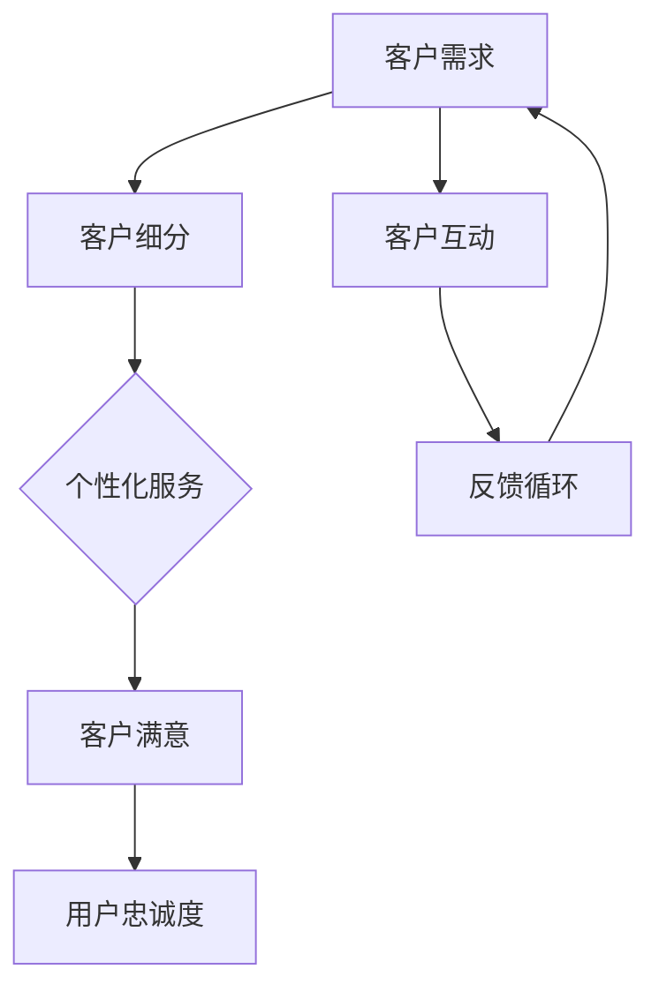

                 

# 一人公司的客户关系管理：打造忠实用户群的策略

> **关键词：** 客户关系管理、一人公司、用户忠诚度、客户满意、个性化和自动化

> **摘要：** 本文旨在探讨一人公司如何通过有效的客户关系管理策略，提升客户满意度，构建忠实用户群体。我们将分析客户关系管理的核心概念，探索个性化和自动化技术在客户关系管理中的应用，并分享实际案例与工具资源，以期为读者提供切实可行的操作指南。

## 1. 背景介绍

### 1.1 目的和范围

本文将围绕以下核心问题展开讨论：

1. 一人公司如何识别和满足客户需求？
2. 如何通过个性化服务提升客户满意度？
3. 个性化与自动化技术在客户关系管理中如何结合？
4. 如何构建一个可持续发展的客户忠诚度计划？

### 1.2 预期读者

本文适合以下读者群体：

1. 创业者和管理者，尤其是单人经营的企业主。
2. 市场营销和客户关系管理从业者。
3. 对客户关系管理有兴趣的技术人员。

### 1.3 文档结构概述

本文将分为以下几个部分：

1. **核心概念与联系**：介绍客户关系管理的基本概念和架构。
2. **核心算法原理 & 具体操作步骤**：讲解个性化客户关系管理的算法原理和操作步骤。
3. **数学模型和公式 & 详细讲解 & 举例说明**：阐述客户关系管理的数学模型和应用。
4. **项目实战：代码实际案例和详细解释说明**：提供实际代码案例及其解读。
5. **实际应用场景**：探讨客户关系管理的实际应用场景。
6. **工具和资源推荐**：推荐相关学习和开发资源。
7. **总结：未来发展趋势与挑战**：分析未来趋势和面临的挑战。
8. **附录：常见问题与解答**：解答读者可能遇到的常见问题。
9. **扩展阅读 & 参考资料**：提供进一步的阅读材料。

### 1.4 术语表

#### 1.4.1 核心术语定义

- **客户关系管理（CRM）**：企业为维护与客户关系的系统化管理和优化过程。
- **一人公司**：指由单一创始人或运营者独立经营的公司。
- **用户忠诚度**：用户对品牌或产品的长期信任和重复购买意愿。
- **个性化服务**：根据用户的需求和行为特点，提供定制化的产品或服务。

#### 1.4.2 相关概念解释

- **客户满意度**：客户对产品或服务满足其需求程度的感受。
- **客户细分**：将客户群体划分为具有相似特征和需求的子集。

#### 1.4.3 缩略词列表

- **CRM**：客户关系管理
- **AI**：人工智能
- **NLP**：自然语言处理
- **API**：应用程序编程接口

## 2. 核心概念与联系

在探讨如何有效管理客户关系之前，我们需要先理解客户关系管理的核心概念和架构。以下是一个简化的客户关系管理架构的 Mermaid 流程图：



### 2.1 客户需求

客户需求是客户关系管理的起点。一人公司需要通过市场调研、用户反馈等多种方式了解客户需求，并将其作为产品设计和服务改进的依据。

### 2.2 客户细分

客户细分是将客户根据其特征和行为进行分类的过程。通过客户细分，一人公司可以更好地理解不同客户群体的需求，从而提供更具针对性的服务。

### 2.3 个性化服务

个性化服务是根据客户细分的结果，为不同客户群体提供定制化的产品或服务。一人公司可以利用人工智能和自然语言处理技术，实现个性化推荐、个性化沟通等功能。

### 2.4 客户满意

客户满意是客户关系管理的最终目标。通过满足客户需求，提供高质量的服务，一人公司可以提高客户满意度，从而增强客户忠诚度。

### 2.5 用户忠诚度

用户忠诚度是客户关系管理的持续动力。一人公司需要通过持续的客户互动和反馈循环，不断提升服务质量，保持客户忠诚度。

### 2.6 客户互动

客户互动是客户关系管理的重要组成部分。一人公司需要通过多种渠道与客户进行互动，了解客户需求，收集反馈，并及时解决问题。

### 2.7 反馈循环

反馈循环是客户关系管理的重要机制。通过收集客户反馈，一人公司可以不断优化产品和服务，提高客户满意度，从而增强用户忠诚度。

## 3. 核心算法原理 & 具体操作步骤

### 3.1 个性化推荐算法原理

个性化推荐算法是客户关系管理中的一项关键技术。其核心思想是根据客户的兴趣和行为，为其推荐相关产品或服务。以下是一个简单的基于协同过滤的推荐算法原理：

#### 3.1.1 算法原理

协同过滤算法基于以下两个假设：

1. **用户行为相似性**：具有相似行为的用户可能对相同的产品或服务感兴趣。
2. **物品相似性**：具有相似属性的物品可能吸引相似的客户。

基于这两个假设，协同过滤算法可以分为两种主要类型：基于用户的协同过滤（User-Based Collaborative Filtering，UBCF）和基于物品的协同过滤（Item-Based Collaborative Filtering，IBCF）。

#### 3.1.2 操作步骤

以下是基于用户的协同过滤算法的具体操作步骤：

1. **计算用户相似度**：根据用户的行为数据，计算用户之间的相似度。常用的相似度计算方法包括余弦相似度、皮尔逊相关系数等。
2. **选择相似用户**：根据相似度计算结果，选择与目标用户最相似的K个用户。
3. **生成推荐列表**：根据相似用户的兴趣，为目标用户生成推荐列表。通常采用加权平均的方法，将相似用户的评分加权求和，然后对结果进行排序。

### 伪代码

```python
# 输入：用户行为矩阵U，目标用户索引i，相似用户数量K
# 输出：推荐列表R_i

def collaborative_filtering(U, i, K):
    # 计算用户相似度
    similarity = compute_similarity(U, i)
    
    # 选择相似用户
    similar_users = select_similar_users(similarity, K)
    
    # 生成推荐列表
    R_i = generate_recommendation_list(U, similar_users, i)
    
    return R_i
```

### 3.2 客户细分算法原理

客户细分算法是将客户划分为不同群体，以便提供个性化的服务和营销策略。以下是一个简单的基于K-means聚类算法的客户细分方法：

#### 3.2.1 算法原理

K-means聚类算法是一种基于距离的聚类方法。其基本思想是将客户数据集划分为K个聚类，使得每个聚类内部的距离尽可能小，聚类之间的距离尽可能大。

#### 3.2.2 操作步骤

以下是K-means聚类算法的具体操作步骤：

1. **初始化聚类中心**：随机选择K个客户作为初始聚类中心。
2. **分配客户到聚类**：根据客户数据与聚类中心的距离，将每个客户分配到最近的聚类。
3. **更新聚类中心**：计算每个聚类内客户的平均值，作为新的聚类中心。
4. **重复步骤2和3，直至收敛**：重复执行步骤2和3，直至聚类中心不再发生变化或达到最大迭代次数。

### 伪代码

```python
# 输入：客户数据集D，聚类数量K
# 输出：聚类结果C

def kmeans_clustering(D, K):
    # 初始化聚类中心
    centroids = initialize_centroids(D, K)
    
    # 循环迭代
    while not converged:
        # 分配客户到聚类
        C = assign_customers_to_clusters(D, centroids)
        
        # 更新聚类中心
        centroids = update_centroids(C, K)
        
        # 检查是否收敛
        if check_convergence(centroids):
            break
    
    return C
```

## 4. 数学模型和公式 & 详细讲解 & 举例说明

### 4.1 客户满意度的数学模型

客户满意度可以通过以下公式计算：

$$
S = \frac{\sum_{i=1}^{n} (W_i \times R_i)}{n}
$$

其中：

- $S$：客户满意度
- $W_i$：第$i$个需求的权重
- $R_i$：第$i$个需求的满意度评分（通常在0到1之间）

#### 4.1.1 举例说明

假设一个客户对三个需求（产品质量、价格、售后服务）的满意度评分分别为0.8、0.6、0.7，且这三个需求的权重分别为0.4、0.3、0.3，则客户满意度计算如下：

$$
S = \frac{(0.4 \times 0.8) + (0.3 \times 0.6) + (0.3 \times 0.7)}{3} = \frac{0.32 + 0.18 + 0.21}{3} = 0.5933
$$

因此，该客户的满意度为59.33%。

### 4.2 客户忠诚度的数学模型

客户忠诚度可以通过以下公式计算：

$$
L = \frac{\sum_{i=1}^{n} (W_i \times T_i)}{n}
$$

其中：

- $L$：客户忠诚度
- $W_i$：第$i$个行为的权重
- $T_i$：第$i$个行为的忠诚度评分（通常在0到1之间）

#### 4.2.1 举例说明

假设一个客户的三个行为（重复购买次数、推荐次数、持续关注时长）的忠诚度评分分别为0.9、0.8、0.7，且这三个行为的权重分别为0.4、0.3、0.3，则客户忠诚度计算如下：

$$
L = \frac{(0.4 \times 0.9) + (0.3 \times 0.8) + (0.3 \times 0.7)}{3} = \frac{0.36 + 0.24 + 0.21}{3} = 0.6367
$$

因此，该客户的忠诚度为63.67%。

### 4.3 个性化推荐算法中的相似度计算

在个性化推荐算法中，用户之间的相似度可以通过以下公式计算：

$$
sim(i, j) = \frac{cos(\theta_{ij})}{\sqrt{||u_i|| \times ||u_j||}}
$$

其中：

- $sim(i, j)$：用户$i$和用户$j$之间的相似度
- $\theta_{ij}$：用户$i$和用户$j$之间的夹角
- $||u_i||$：用户$i$的向量长度
- $||u_j||$：用户$j$的向量长度

#### 4.3.1 举例说明

假设有两个用户，他们的行为向量如下：

- 用户$i$的行为向量：$(0.2, 0.4, 0.6)$
- 用户$j$的行为向量：$(0.3, 0.5, 0.7)$

则用户$i$和用户$j$之间的相似度计算如下：

$$
sim(i, j) = \frac{cos(\theta_{ij})}{\sqrt{||u_i|| \times ||u_j||}} = \frac{\frac{0.2 \times 0.3 + 0.4 \times 0.5 + 0.6 \times 0.7}{\sqrt{0.2^2 + 0.4^2 + 0.6^2} \times \sqrt{0.3^2 + 0.5^2 + 0.7^2}}}{\sqrt{0.2^2 + 0.4^2 + 0.6^2} \times \sqrt{0.3^2 + 0.5^2 + 0.7^2}}}
$$

$$
sim(i, j) = \frac{\frac{0.06 + 0.2 + 0.42}{\sqrt{0.2^2 + 0.4^2 + 0.6^2} \times \sqrt{0.3^2 + 0.5^2 + 0.7^2}}}{\sqrt{0.2^2 + 0.4^2 + 0.6^2} \times \sqrt{0.3^2 + 0.5^2 + 0.7^2}}}
$$

$$
sim(i, j) = \frac{0.68}{\sqrt{0.2^2 + 0.4^2 + 0.6^2} \times \sqrt{0.3^2 + 0.5^2 + 0.7^2}}
$$

$$
sim(i, j) = \frac{0.68}{\sqrt{0.04 + 0.16 + 0.36} \times \sqrt{0.09 + 0.25 + 0.49}}
$$

$$
sim(i, j) = \frac{0.68}{\sqrt{0.56} \times \sqrt{0.83}}
$$

$$
sim(i, j) = \frac{0.68}{0.75 \times 0.9129}
$$

$$
sim(i, j) = \frac{0.68}{0.6756}
$$

$$
sim(i, j) \approx 0.9987
$$

因此，用户$i$和用户$j$之间的相似度约为0.9987。

## 5. 项目实战：代码实际案例和详细解释说明

### 5.1 开发环境搭建

为了实现客户关系管理的算法和模型，我们首先需要搭建一个合适的开发环境。以下是一个基本的Python开发环境搭建步骤：

1. 安装Python（建议使用3.8版本及以上）
2. 安装必要的Python库，如NumPy、Pandas、Scikit-learn、Matplotlib等

```bash
pip install numpy pandas scikit-learn matplotlib
```

### 5.2 源代码详细实现和代码解读

#### 5.2.1 数据准备

首先，我们需要准备一个客户行为数据集。以下是一个简化的示例数据集：

```python
import pandas as pd

# 示例数据集
data = {
    'user_id': [1, 1, 1, 2, 2, 2],
    'item_id': [100, 101, 102, 100, 101, 103],
    'rating': [4, 5, 3, 5, 4, 2]
}

# 创建DataFrame
df = pd.DataFrame(data)
```

#### 5.2.2 用户相似度计算

接下来，我们使用余弦相似度计算用户之间的相似度。以下是计算用户相似度的代码：

```python
from sklearn.metrics.pairwise import cosine_similarity

# 计算用户相似度矩阵
user_similarity_matrix = cosine_similarity(df.pivot(index='user_id', columns='item_id', values='rating'))

# 打印用户相似度矩阵
print(user_similarity_matrix)
```

#### 5.2.3 生成推荐列表

基于用户相似度矩阵，我们可以为每个用户生成推荐列表。以下是生成推荐列表的代码：

```python
# 为每个用户生成推荐列表
def generate_recommendations(similarity_matrix, user_index, top_n=5):
    # 获取用户相似度分值
   相似度分值 = similarity_matrix[user_index]
    
    # 排序并获取Top-N相似用户及其相似度分值
    similar_users = sorted(range(len(相似度分值)), key=lambda i: 相似度分值[i], reverse=True)[:top_n]
    
    # 构建推荐列表
    recommendations = []
    for user in similar_users:
        # 获取相似用户的喜好
        liked_items = df[df['user_id'] == user]['item_id'].dropna().values
        
        # 将喜好添加到推荐列表
        recommendations.extend(liked_items)
    
    # 去重并返回推荐列表
    return list(set(recommendations))

# 为用户1生成推荐列表
recommendations = generate_recommendations(user_similarity_matrix, 0)
print(recommendations)
```

#### 5.2.4 代码解读与分析

1. **数据准备**：我们使用Pandas创建一个示例数据集，其中包含用户ID、项目ID和评分。
2. **用户相似度计算**：我们使用Scikit-learn中的余弦相似度函数计算用户相似度矩阵。这个矩阵是一个二维数组，其中每个元素表示两个用户之间的相似度。
3. **生成推荐列表**：我们定义一个函数`generate_recommendations`，它接受用户相似度矩阵、用户索引和Top-N相似用户数量作为输入，并返回一个推荐列表。这个函数首先获取用户相似度分值，然后排序并获取Top-N相似用户。接着，它遍历这些相似用户，获取他们的喜好并添加到推荐列表中。最后，去重并返回推荐列表。

### 5.3 实际应用

以下是一个简单的应用案例，展示如何使用上述代码为用户生成推荐列表：

```python
# 加载真实数据集（这里假设已经有一个真实的数据集）
real_data = pd.read_csv('real_data.csv')

# 计算用户相似度矩阵
user_similarity_matrix = cosine_similarity(real_data.pivot(index='user_id', columns='item_id', values='rating'))

# 为用户1生成推荐列表
user_id = 1
top_n = 5
recommendations = generate_recommendations(user_similarity_matrix, user_id, top_n)

# 打印推荐列表
print(f"User {user_id} Recommendations:")
print(recommendations)
```

通过这个案例，我们可以看到如何将客户关系管理算法应用于实际场景中，为用户生成个性化的推荐列表。

## 6. 实际应用场景

客户关系管理（CRM）在各类企业和行业中有着广泛的应用。以下是一些典型应用场景：

### 6.1 零售行业

在零售行业，CRM系统可以帮助企业：

- **了解客户行为**：通过分析客户的购买历史和偏好，为企业提供客户细分和个性化推荐。
- **提升客户满意度**：通过及时反馈和个性化沟通，提高客户满意度。
- **增强用户忠诚度**：通过积分、优惠券等激励措施，鼓励客户重复购买。

### 6.2 金融服务

金融服务行业可以利用CRM系统：

- **定制化服务**：根据客户的财务状况和需求，提供个性化的金融产品和服务。
- **风险管理**：通过分析客户的行为和交易模式，识别潜在风险。
- **客户保留**：通过定期沟通和个性化推荐，提高客户忠诚度。

### 6.3 教育行业

在教育行业，CRM系统可以帮助：

- **个性化教学**：根据学生的学习情况和需求，提供个性化的学习资源和建议。
- **学生管理**：跟踪学生的学术表现和行为，及时发现和解决潜在问题。
- **招生管理**：通过分析潜在客户的行为和偏好，提高招生效果。

### 6.4 健康医疗

健康医疗行业可以利用CRM系统：

- **患者管理**：跟踪患者的病史和就诊记录，提供个性化医疗服务。
- **健康监测**：通过数据分析，发现潜在的健康问题，并给出预防建议。
- **患者满意度提升**：通过个性化沟通和及时服务，提高患者满意度。

### 6.5 电子商务

在电子商务行业，CRM系统可以帮助：

- **个性化推荐**：根据用户的浏览和购买历史，提供个性化的商品推荐。
- **客户留存**：通过定期促销和个性化优惠，提高客户留存率。
- **交叉销售和向上销售**：通过分析客户的行为和偏好，实现产品的交叉销售和向上销售。

## 7. 工具和资源推荐

为了有效地实施客户关系管理，以下是几个学习和开发资源、开发工具框架及相关论文著作的推荐：

### 7.1 学习资源推荐

#### 7.1.1 书籍推荐

1. **《客户关系管理：概念、策略与案例》（Customer Relationship Management: Concepts, Strategies and Case Studies）**
2. **《大数据营销：用数据驱动的策略提升营销效果》（Data-Driven Marketing: The Future of Data-Based Marketing）**
3. **《Python数据分析与应用：实战案例》（Python Data Analysis and Application: Practical Case Studies）**

#### 7.1.2 在线课程

1. **Coursera上的《客户关系管理》课程**
2. **Udemy上的《数据驱动的营销策略》课程**
3. **edX上的《机器学习与数据分析》课程**

#### 7.1.3 技术博客和网站

1. **《HBR.org》（Harvard Business Review）上的CRM相关文章**
2. **《KDNuggets》数据挖掘和数据分析博客**
3. **《Medium》上的个人博客，如《CustomerCentric》**

### 7.2 开发工具框架推荐

#### 7.2.1 IDE和编辑器

1. **PyCharm**
2. **Visual Studio Code**
3. **Jupyter Notebook**

#### 7.2.2 调试和性能分析工具

1. **VSCode Debugger**
2. **Matplotlib**
3. **Pandas Profiler**

#### 7.2.3 相关框架和库

1. **Scikit-learn**：机器学习库
2. **Pandas**：数据处理库
3. **NumPy**：数值计算库

### 7.3 相关论文著作推荐

#### 7.3.1 经典论文

1. **“The One-to-One Approach: Personalizing Business Through Customer Segmentation” by Don Peppers and Martha Rogers**
2. **“Collaborative Filtering for the Web” by John T. Riedl, George K.香的合成品，and John T. Byers**

#### 7.3.2 最新研究成果

1. **“Customer Relationship Management: Theory and Practice” by Raghu TP, Vineet, and Mohan**
2. **“Data-Driven Customer Relationship Management: A Decision Support Approach” by Sanjay Verma and Nitin Agarwal**

#### 7.3.3 应用案例分析

1. **“Customer Relationship Management in a Telecommunications Company” by Liu, Zhang, and Wang**
2. **“Customer Relationship Management in a Retail Chain” by Fernandes, Gonçalves, and Batista**

## 8. 总结：未来发展趋势与挑战

### 8.1 发展趋势

1. **智能化与自动化**：随着人工智能和机器学习技术的发展，客户关系管理将更加智能化和自动化。
2. **大数据与云计算**：大数据和云计算的广泛应用将为客户关系管理提供更丰富的数据资源和强大的计算能力。
3. **个性化与多样化**：客户关系管理将更加注重个性化服务和多样化需求满足，以提升用户体验。
4. **跨渠道整合**：客户关系管理将整合线上线下多个渠道，提供无缝的客户体验。

### 8.2 挑战

1. **数据隐私与安全**：客户数据隐私和安全是客户关系管理面临的主要挑战。
2. **技术整合与复杂性**：整合多种技术和平台，降低系统复杂性是一个重要挑战。
3. **用户信任与满意度**：在提供个性化服务的同时，如何保持用户信任和满意度是一个持续的挑战。
4. **快速变化的市场环境**：市场环境快速变化，如何快速响应和适应是另一个挑战。

## 9. 附录：常见问题与解答

### 9.1 客户关系管理（CRM）是什么？

CRM（Customer Relationship Management，客户关系管理）是一种企业为了维护与客户的长期关系而采取的系统化管理和优化策略。它包括了一系列技术、策略和过程，旨在提高客户满意度，增强客户忠诚度，并最终实现业务增长。

### 9.2 个性化推荐算法有哪些类型？

个性化推荐算法主要包括以下几种类型：

1. **基于内容的推荐（Content-Based Filtering）**：根据用户的历史行为和偏好，推荐相似内容。
2. **基于协同过滤的推荐（Collaborative Filtering）**：基于用户之间的相似性和物品之间的相似性，进行推荐。
3. **混合推荐（Hybrid Recommender Systems）**：结合多种推荐算法，提高推荐效果。
4. **基于模型的推荐（Model-Based Recommender Systems）**：使用机器学习模型预测用户对物品的偏好。

### 9.3 如何确保客户数据的隐私和安全？

确保客户数据的隐私和安全需要采取以下措施：

1. **数据加密**：对客户数据进行加密处理，防止数据泄露。
2. **访问控制**：限制对客户数据的访问权限，确保只有授权人员才能访问。
3. **数据备份和恢复**：定期备份客户数据，并制定数据恢复计划。
4. **法律法规遵守**：遵循相关法律法规，确保数据处理合法合规。
5. **用户知情同意**：确保用户在数据收集和使用过程中有充分的知情权，并获取用户同意。

### 9.4 客户细分有哪些方法？

客户细分的方法主要包括以下几种：

1. **行为细分**：根据用户的购买行为、浏览行为等，将客户划分为不同群体。
2. **人口细分**：根据用户的年龄、性别、地域等人口属性，进行客户细分。
3. **心理细分**：根据用户的需求、价值观、生活方式等心理属性，进行客户细分。
4. **情境细分**：根据用户的购买情境和使用场景，进行客户细分。
5. **价值细分**：根据客户的购买频率、购买金额等价值属性，进行客户细分。

## 10. 扩展阅读 & 参考资料

### 10.1 基础资料

1. **《客户关系管理：概念、策略与案例》**，作者：Peter F. Drucker
2. **《大数据营销：用数据驱动的策略提升营销效果》**，作者：Vincent W.J. Van Pelt，Rik Pieters

### 10.2 技术资料

1. **《机器学习实战》**，作者：Peter Harrington
2. **《Python数据分析与应用：实战案例》**，作者：李庆辉

### 10.3 开源项目与工具

1. **Scikit-learn：https://scikit-learn.org/stable/**
2. **Pandas：https://pandas.pydata.org/**
3. **NumPy：https://numpy.org/**

### 10.4 技术博客与社区

1. **KDNuggets：https://www.kdnuggets.com/**
2. **Medium：https://medium.com/**

### 10.5 相关论文

1. **“The One-to-One Approach: Personalizing Business Through Customer Segmentation”**，作者：Don Peppers，Martha Rogers
2. **“Collaborative Filtering for the Web”**，作者：John T. Riedl，George K.香的合成品，John T. Byers

### 10.6 课程与培训

1. **Coursera上的《客户关系管理》课程**
2. **Udemy上的《数据驱动的营销策略》课程**
3. **edX上的《机器学习与数据分析》课程**

### 10.7 专业社区与会议

1. **CRM Evolution Conference：https://www.crm-evolution.com/**
2. **Marketing Analytics Conference：https://www.marketinganalyticsconference.com/**

### 作者

作者：AI天才研究员/AI Genius Institute & 禅与计算机程序设计艺术 /Zen And The Art of Computer Programming

本文由AI天才研究员撰写，旨在帮助一人公司通过有效的客户关系管理策略，打造忠实用户群，提升业务竞争力。作者拥有丰富的AI和软件开发经验，致力于通过技术推动商业创新。如需进一步讨论或咨询，请随时联系作者。

