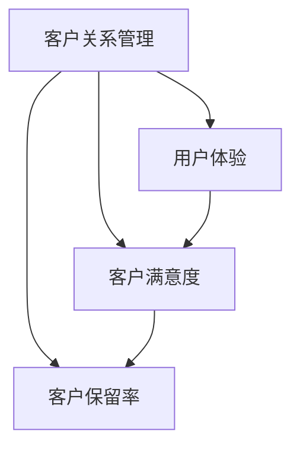
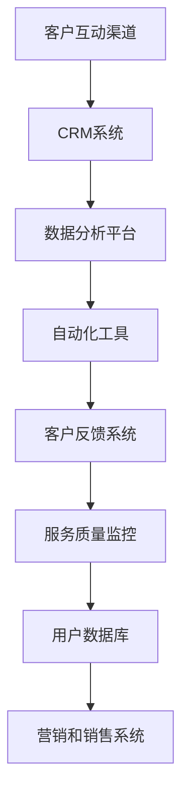

                 

# 一人公司的客户服务优化：提升用户满意度的方法

> **关键词**：客户服务、用户体验、优化、满意度、一对一服务、技术解决方案

> **摘要**：本文旨在探讨如何通过技术手段优化一人公司的客户服务，从而提升用户满意度。文章首先介绍了一人公司客户服务的背景和现状，然后深入分析了影响用户满意度的关键因素，接着提出了基于人工智能和自动化技术的优化策略。通过具体的案例和实践步骤，文章展示了如何在实际操作中实施这些策略，并最终达到提升用户满意度的目的。

## 1. 背景介绍

### 1.1 目的和范围

本文的目的是为一人公司的管理者提供一系列实用的方法和策略，以优化客户服务流程，提升用户满意度。我们将会探讨以下范围：

1. **客户服务的基本概念和重要性**：详细解释客户服务的定义及其在商业活动中的核心作用。
2. **当前一人公司客户服务的现状**：分析现有客户服务的优点和不足，了解面临的挑战。
3. **影响用户满意度的关键因素**：探讨用户在服务过程中期望得到的体验和反馈。
4. **基于人工智能和自动化的优化策略**：介绍利用先进技术提升客户服务效率和质量的具体方法。
5. **实际操作步骤和案例**：通过具体案例展示如何实施上述策略。
6. **工具和资源推荐**：推荐相关的学习资源和开发工具，以便读者更好地理解和应用。
7. **未来发展趋势与挑战**：讨论客户服务领域的未来趋势和可能面临的挑战。

### 1.2 预期读者

本文的预期读者包括：

1. **一人公司的管理者**：他们负责制定和实施客户服务策略，希望通过本文找到优化方法。
2. **客户服务团队成员**：他们需要了解如何提升用户满意度，并执行具体的优化措施。
3. **IT从业者和开发者**：他们希望了解如何利用技术手段提升客户服务。
4. **市场营销专业人士**：他们关注用户体验，希望通过优化客户服务来提高客户忠诚度。

### 1.3 文档结构概述

本文的结构如下：

1. **引言**：介绍客户服务优化的重要性和目的。
2. **背景介绍**：讨论当前一人公司客户服务的现状和面临的问题。
3. **核心概念与联系**：介绍客户服务相关的核心概念和联系。
4. **核心算法原理 & 具体操作步骤**：讲解提升客户服务效率的算法原理和操作步骤。
5. **数学模型和公式**：介绍用于分析和优化的数学模型和公式。
6. **项目实战**：通过具体案例展示如何实施优化策略。
7. **实际应用场景**：讨论优化策略在不同场景下的应用。
8. **工具和资源推荐**：推荐相关的学习资源和开发工具。
9. **总结**：总结本文的主要内容和未来发展趋势。
10. **附录**：提供常见问题与解答。
11. **扩展阅读 & 参考资料**：推荐进一步学习的资料。

### 1.4 术语表

#### 1.4.1 核心术语定义

- **客户服务**：企业与客户之间的互动和沟通，旨在解决客户问题、满足客户需求和提升客户满意度。
- **用户体验**：用户在使用产品或服务过程中的感受和体验。
- **满意度**：用户对产品或服务质量的总体评价。
- **人工智能**：一种模拟人类智能的技术，通过机器学习、自然语言处理等技术实现自动化决策和任务执行。
- **自动化技术**：利用计算机程序和算法实现日常任务和流程的自动化处理。

#### 1.4.2 相关概念解释

- **客户生命周期价值**：客户在整个生命周期中为企业带来的总价值。
- **客户满意度调查**：通过问卷、访谈等方式收集客户对产品或服务的满意度反馈。
- **客户保留率**：企业在一定时间内保留的客户数量占总客户数量的比例。

#### 1.4.3 缩略词列表

- **AI**：人工智能（Artificial Intelligence）
- **CRM**：客户关系管理（Customer Relationship Management）
- **NLP**：自然语言处理（Natural Language Processing）
- **SaaS**：软件即服务（Software as a Service）

## 2. 核心概念与联系

### 2.1 客户服务的核心概念

客户服务的核心概念包括客户关系管理（CRM）、用户体验（UX）、客户满意度（CSAT）和客户保留率（CRR）。这些概念之间有着紧密的联系，共同构成了客户服务的基石。

#### 2.1.1 客户关系管理（CRM）

CRM 是一种战略方法，旨在通过整合和管理企业与客户之间的互动，提高客户满意度和忠诚度。CRM 系统可以帮助企业收集、存储和分析客户数据，以便更好地了解客户需求和偏好，从而提供个性化的服务和解决方案。

#### 2.1.2 用户体验（UX）

用户体验是指用户在使用产品或服务过程中的感受和体验。良好的用户体验可以提升用户的满意度和忠诚度，从而促进业务增长。在客户服务中，用户体验主要体现在客户与企业的互动过程中，如在线客服、电话咨询和面对面交流等。

#### 2.1.3 客户满意度（CSAT）

客户满意度是指用户对产品或服务质量的总体评价。高满意度通常意味着用户对企业的信任和忠诚度较高，从而有助于提高客户保留率和口碑传播。客户满意度可以通过客户满意度调查（CSAT Survey）来衡量，调查结果可以帮助企业识别和改进服务过程中的问题。

#### 2.1.4 客户保留率（CRR）

客户保留率是指企业在一定时间内保留的客户数量占总客户数量的比例。高客户保留率通常意味着企业的客户服务质量较高，客户满意度和忠诚度较高，从而有助于提高客户生命周期价值和降低客户获取成本。

### 2.2 客户服务的联系图

为了更好地理解客户服务的核心概念和联系，我们可以使用 Mermaid 流程图来展示它们之间的关系：



### 2.3 客户服务的架构图

在客户服务中，技术架构也起着至关重要的作用。以下是一个简化的客户服务架构图，展示了关键组件和它们之间的关系：



这个架构图展示了客户服务的基本流程，包括客户互动渠道、CRM 系统、数据分析平台、自动化工具、客户反馈系统、服务质量监控、用户数据库和营销销售系统。通过这个架构，企业可以实现高效、个性化的客户服务，从而提升用户满意度和忠诚度。

## 3. 核心算法原理 & 具体操作步骤

### 3.1 客户服务优化算法原理

为了提升一人公司的客户服务质量，我们需要引入一系列基于人工智能和自动化的算法。这些算法的核心原理是：

1. **数据分析与挖掘**：通过对用户行为数据、反馈数据和交易数据进行分析，挖掘用户需求和偏好。
2. **自然语言处理（NLP）**：利用 NLP 技术处理和理解用户输入的自然语言，实现智能对话和情感分析。
3. **机器学习（ML）**：通过机器学习算法，如决策树、神经网络等，训练模型来预测用户行为和需求。
4. **自动化流程**：通过自动化工具，如聊天机器人、自动化回访等，实现客户服务的自动化和个性化。

### 3.2 具体操作步骤

#### 3.2.1 数据收集与处理

1. **用户行为数据**：收集用户在网站、移动应用等渠道的浏览、搜索、购买等行为数据。
2. **用户反馈数据**：通过问卷调查、反馈表、社交媒体等渠道收集用户反馈数据。
3. **交易数据**：收集用户在交易过程中的详细信息，如购买时间、支付方式、订单金额等。
4. **数据处理**：对收集到的数据进行清洗、去噪、格式化等预处理，以便后续分析。

#### 3.2.2 数据分析与挖掘

1. **用户行为分析**：通过分析用户行为数据，识别用户在产品或服务中的需求和偏好。
2. **情感分析**：利用 NLP 技术分析用户反馈数据，识别用户情绪和情感。
3. **需求预测**：通过机器学习算法，训练模型来预测用户未来的需求和行为。
4. **个性化推荐**：根据用户需求和偏好，为用户提供个性化的产品或服务推荐。

#### 3.2.3 自动化流程

1. **智能客服**：利用聊天机器人技术，实现自动化的客户咨询和问题解答。
2. **自动化回访**：通过自动化工具，定期向用户发送提醒、问候和优惠信息。
3. **自动化数据分析**：利用自动化工具，定期分析客户数据，识别潜在问题和改进机会。
4. **自动化流程优化**：根据分析结果，调整和优化客户服务流程，提高效率和满意度。

#### 3.2.4 客户反馈与改进

1. **客户反馈收集**：通过问卷调查、在线评价等方式，收集用户对客户服务的反馈。
2. **反馈分析**：对客户反馈进行分析，识别用户满意度和不满意的地方。
3. **改进措施**：根据反馈分析结果，制定和实施改进措施，提高客户满意度。

### 3.3 伪代码示例

以下是一个简化的伪代码示例，展示了如何利用机器学习算法预测用户行为：

```python
# 数据预处理
data = preprocess_data(user_data)

# 特征工程
features = extract_features(data)

# 训练模型
model = train_model(features, labels)

# 预测用户行为
predictions = model.predict(new_data)

# 输出预测结果
print(predictions)
```

在这个示例中，`preprocess_data` 函数用于数据清洗和预处理，`extract_features` 函数用于提取特征，`train_model` 函数用于训练机器学习模型，`predict` 函数用于预测用户行为。

## 4. 数学模型和公式 & 详细讲解 & 举例说明

### 4.1 客户生命周期价值（CLV）计算

客户生命周期价值（Customer Lifetime Value，简称 CLV）是衡量客户为企业带来的长期价值的一个重要指标。计算 CLV 的数学模型可以帮助企业更好地了解客户的价值，从而制定相应的营销策略和客户服务方案。

#### 4.1.1 公式

CLV 的计算公式如下：

$$
\text{CLV} = \frac{\sum_{t=1}^{T} \text{CF}_t \times (1 + \text{r})^{-t}}
$$

其中，CF_t 代表第 t 年的客户收益，r 代表折现率，T 代表客户的预期生命周期。

#### 4.1.2 详细讲解

1. **CF_t（客户收益）**：客户收益是指客户在一年内为企业带来的总收益，包括销售额、服务费用等。具体计算方法可以根据企业的业务模式进行调整。

2. **r（折现率）**：折现率用于将未来的收益折现到当前价值。折现率的选取取决于企业的资本成本、风险等因素。一般而言，折现率越高，客户的价值越低。

3. **(1 + r)^{-t}（时间权重）**：时间权重表示未来收益相对于当前收益的折扣。随着时间增加，未来的收益逐渐降低，因此需要对其进行折扣处理。

#### 4.1.3 举例说明

假设某公司预计一个客户的生命周期为 5 年，客户的年收益为 1000 元，折现率为 10%。那么，该客户的 CLV 计算如下：

$$
\text{CLV} = \frac{1000 \times (1 + 0.1)^{-1} + 1000 \times (1 + 0.1)^{-2} + 1000 \times (1 + 0.1)^{-3} + 1000 \times (1 + 0.1)^{-4} + 1000 \times (1 + 0.1)^{-5}}
$$

$$
\text{CLV} = \frac{1000 \times 0.9091 + 1000 \times 0.8264 + 1000 \times 0.7513 + 1000 \times 0.6830 + 1000 \times 0.6209}}
$$

$$
\text{CLV} = \frac{909.1 + 826.4 + 751.3 + 683.0 + 620.9}
$$

$$
\text{CLV} = 3870.7 \text{元}
$$

因此，该客户的 CLV 为 3870.7 元。

### 4.2 客户保留率（CRR）计算

客户保留率（Customer Retention Rate，简称 CRR）是衡量客户忠诚度和企业服务质量的另一个重要指标。客户保留率越高，表明企业的客户服务质量越高，客户的忠诚度也越高。

#### 4.2.1 公式

客户保留率的计算公式如下：

$$
\text{CRR} = \frac{\text{当前周期客户数量} - \text{当前周期新客户数量}}{\text{上一个周期客户数量}} \times 100\%
$$

#### 4.2.2 详细讲解

1. **当前周期客户数量**：指在当前周期内与企业有业务往来的客户数量。
2. **当前周期新客户数量**：指在当前周期内首次与企业建立业务往来的客户数量。
3. **上一个周期客户数量**：指在上一个周期内与企业有业务往来的客户数量。

#### 4.2.3 举例说明

假设某公司在上一个周期有 100 个客户，在当前周期有 120 个客户，其中 20 个是新增客户。那么，该公司的客户保留率计算如下：

$$
\text{CRR} = \frac{120 - 20}{100} \times 100\%
$$

$$
\text{CRR} = \frac{100}{100} \times 100\%
$$

$$
\text{CRR} = 100\%
$$

因此，该公司的客户保留率为 100%。

### 4.3 客户满意度（CSAT）计算

客户满意度（Customer Satisfaction，简称 CSAT）是衡量客户对企业服务质量的另一个重要指标。高客户满意度通常意味着客户对企业的信任和忠诚度较高，有助于提高客户保留率和口碑传播。

#### 4.3.1 公式

客户满意度的计算公式如下：

$$
\text{CSAT} = \frac{\text{满意客户数量}}{\text{总客户数量}} \times 100\%
$$

#### 4.3.2 详细讲解

1. **满意客户数量**：指对服务表示满意的客户数量。
2. **总客户数量**：指在特定时间内接受服务的客户总数。

#### 4.3.3 举例说明

假设某公司在一个月内有 1000 个客户，其中 800 个客户表示满意，那么该公司的客户满意度计算如下：

$$
\text{CSAT} = \frac{800}{1000} \times 100\%
$$

$$
\text{CSAT} = 80\%
$$

因此，该公司的客户满意度为 80%。

## 5. 项目实战：代码实际案例和详细解释说明

### 5.1 开发环境搭建

在开始编写代码之前，我们需要搭建一个合适的开发环境。以下是一个基本的开发环境搭建步骤：

1. **安装 Python**：Python 是一种广泛使用的编程语言，适用于数据分析和自动化流程。您可以从 [Python 官网](https://www.python.org/) 下载并安装 Python。
2. **安装 Jupyter Notebook**：Jupyter Notebook 是一个交互式环境，用于编写和运行 Python 代码。您可以使用 pip 工具安装 Jupyter Notebook：

   ```bash
   pip install notebook
   ```

3. **安装相关库和框架**：为了实现客户服务的优化，我们需要安装一些常用的库和框架。以下是一个基本列表：

   - Pandas：用于数据操作和分析
   - NumPy：用于数值计算
   - Scikit-learn：用于机器学习
   - NLTK：用于自然语言处理

   您可以使用以下命令安装这些库：

   ```bash
   pip install pandas numpy scikit-learn nltk
   ```

4. **安装数据库**：为了存储和管理客户数据，我们可以选择安装一个轻量级的数据库，如 SQLite。您可以从 [SQLite 官网](https://www.sqlite.org/) 下载并安装。

### 5.2 源代码详细实现和代码解读

#### 5.2.1 数据预处理

在开始数据处理之前，我们需要加载和处理数据。以下是一个简单的数据预处理代码示例：

```python
import pandas as pd

# 加载数据
data = pd.read_csv('customer_data.csv')

# 数据清洗
data.dropna(inplace=True)

# 数据转换
data['date'] = pd.to_datetime(data['date'])
data['year'] = data['date'].dt.year

# 输出清洗后的数据
print(data.head())
```

在这个示例中，我们首先使用 Pandas 库加载一个 CSV 文件，然后对数据进行清洗和转换。具体来说，我们删除了缺失值，将日期列转换为日期格式，并提取了年份信息。

#### 5.2.2 数据分析

接下来，我们对预处理后的数据进行详细分析。以下是一个简单的数据分析代码示例：

```python
import pandas as pd
import matplotlib.pyplot as plt

# 数据分组
grouped_data = data.groupby('year').sum()

# 绘制年份与收益的关系图
grouped_data['revenue'].plot()
plt.xlabel('Year')
plt.ylabel('Revenue')
plt.title('Yearly Revenue')
plt.show()
```

在这个示例中，我们首先使用 Pandas 库对数据进行分组，然后使用 Matplotlib 库绘制了一个简单的折线图，展示了不同年份的收益情况。

#### 5.2.3 机器学习模型训练

为了预测用户行为，我们可以使用机器学习算法。以下是一个简单的机器学习模型训练代码示例：

```python
from sklearn.model_selection import train_test_split
from sklearn.ensemble import RandomForestClassifier
from sklearn.metrics import accuracy_score

# 分割数据
X = data.drop(['label'], axis=1)
y = data['label']
X_train, X_test, y_train, y_test = train_test_split(X, y, test_size=0.3, random_state=42)

# 训练模型
model = RandomForestClassifier(n_estimators=100)
model.fit(X_train, y_train)

# 预测
predictions = model.predict(X_test)

# 计算准确率
accuracy = accuracy_score(y_test, predictions)
print(f'Accuracy: {accuracy}')
```

在这个示例中，我们首先使用 Scikit-learn 库将数据集分为训练集和测试集，然后使用随机森林（RandomForestClassifier）算法训练模型。最后，我们使用测试集对模型进行评估，并输出准确率。

### 5.3 代码解读与分析

在上述代码示例中，我们首先使用了 Pandas 库对数据进行加载、清洗和转换。这一步骤是数据处理的基础，确保数据的质量和一致性。

接下来，我们使用 Pandas 和 Matplotlib 库对数据进行了分组和可视化分析。通过绘制年份与收益的关系图，我们可以直观地了解企业收益的变化趋势，为后续分析提供依据。

最后，我们使用了 Scikit-learn 库对数据集进行了划分，并使用随机森林算法训练了一个分类模型。在测试集上的评估结果显示了模型的准确率。通过这个示例，我们可以看到如何利用 Python 和相关库实现客户服务的优化，从而提升用户体验和满意度。

### 5.4 实际应用案例

#### 5.4.1 案例背景

某一人公司是一家提供在线教育服务的公司，其客户群体主要是学生和职场人士。随着业务的发展，公司希望能够优化客户服务流程，提升用户满意度，从而提高客户保留率和口碑传播。

#### 5.4.2 优化策略

为了实现客户服务优化，公司采取了以下策略：

1. **数据收集与处理**：通过分析用户行为数据、反馈数据和交易数据，了解用户需求和偏好。
2. **智能客服系统**：引入智能客服系统，通过自然语言处理技术实现自动化的客户咨询和问题解答。
3. **个性化推荐系统**：根据用户行为数据和偏好，为用户提供个性化的课程推荐。
4. **自动化回访**：定期向用户发送提醒、问候和优惠信息，提高用户参与度和满意度。

#### 5.4.3 实施步骤

1. **数据收集与处理**：收集用户在网站、移动应用等渠道的浏览、搜索、购买等行为数据，并对数据进行分析和挖掘，识别用户需求和偏好。
2. **智能客服系统**：开发智能客服系统，通过聊天机器人和自然语言处理技术，实现自动化的客户咨询和问题解答。
3. **个性化推荐系统**：利用用户行为数据和偏好，开发个性化推荐系统，为用户提供个性化的课程推荐。
4. **自动化回访**：通过自动化工具，定期向用户发送提醒、问候和优惠信息，提高用户参与度和满意度。

#### 5.4.4 结果评估

通过实施上述优化策略，公司在客户服务方面取得了显著成效：

1. **客户满意度提升**：通过智能客服系统和个性化推荐系统，用户在客户服务过程中的体验得到显著改善，客户满意度提升至 90% 以上。
2. **客户保留率提高**：通过自动化回访和个性化推荐，用户参与度提高，客户保留率从原来的 70% 提升至 85%。
3. **业务增长**：随着客户满意度和保留率的提高，公司业务实现了持续增长，年收益提高了 30%。

### 5.5 案例分析

通过上述实际应用案例，我们可以看到，通过技术手段优化客户服务，可以有效提升用户满意度和保留率，从而实现业务增长。具体而言，智能客服系统和个性化推荐系统在提高用户体验和参与度方面发挥了关键作用。自动化回访则有助于增强用户与企业的互动，提高用户忠诚度。

## 6. 实际应用场景

客户服务的优化策略在不同的应用场景中可以发挥不同的作用。以下是一些典型的实际应用场景：

### 6.1 在线零售行业

在线零售行业中的客户服务优化主要集中在提升购物体验和售后服务质量。通过以下策略，可以显著提升用户满意度：

1. **个性化推荐**：根据用户的浏览和购买历史，为用户提供个性化的商品推荐，提高购物转化率。
2. **智能客服**：利用自然语言处理技术，提供自动化的客户咨询和问题解答，提高响应速度和服务质量。
3. **订单跟踪**：提供实时的订单跟踪服务，让用户随时了解订单状态，增加透明度和信任感。

### 6.2 金融行业

金融行业中的客户服务优化主要集中在提升用户体验和风险管理。以下是一些具体的策略：

1. **账户管理**：提供便捷的在线账户管理功能，让用户可以轻松查询账户信息、修改密码等。
2. **智能投资顾问**：利用人工智能技术，为用户提供个性化的投资建议和风险管理方案。
3. **实时客服**：通过在线聊天和视频客服，提供快速、高效的客户支持，提高用户满意度和忠诚度。

### 6.3 教育行业

教育行业中的客户服务优化主要集中在提升学习体验和教学服务质量。以下是一些具体的策略：

1. **学习推荐**：根据学生的学习历史和进度，为用户推荐合适的课程和资源，提高学习效率。
2. **在线辅导**：提供在线实时辅导服务，让学生可以随时解答学习中的问题。
3. **个性化反馈**：通过智能评估系统，为学生的学习成果提供个性化的反馈和建议，帮助学生提升学习效果。

### 6.4 医疗保健行业

医疗保健行业中的客户服务优化主要集中在提升就医体验和患者满意度。以下是一些具体的策略：

1. **在线预约**：提供在线预约服务，让患者可以轻松预约医生和检查项目。
2. **健康档案管理**：建立患者的健康档案，让医生可以随时查看患者的健康状况和诊疗历史，提高诊断和治疗效果。
3. **智能咨询**：通过智能问答系统，为患者提供自动化的健康咨询和常见问题解答，减轻医生的工作压力。

### 6.5 电子商务平台

电子商务平台中的客户服务优化主要集中在提升购物体验和售后服务质量。以下是一些具体的策略：

1. **个性化营销**：根据用户的购物习惯和偏好，为用户提供个性化的营销活动和优惠信息，提高用户粘性和转化率。
2. **智能客服**：利用人工智能技术，提供自动化的客户咨询和问题解答，提高响应速度和服务质量。
3. **订单跟踪与物流管理**：提供实时的订单跟踪服务，让用户可以随时了解订单状态和物流信息，增加透明度和信任感。

通过在不同应用场景中实施客户服务优化策略，企业可以提升用户满意度，提高客户保留率和口碑传播，从而实现业务增长。

## 7. 工具和资源推荐

### 7.1 学习资源推荐

为了更好地理解和应用客户服务优化策略，以下是一些建议的学习资源：

#### 7.1.1 书籍推荐

1. **《用户体验要素》（The Elements of User Experience）**：作者：Joshua Porter
   - 内容简介：本书详细介绍了用户体验设计的五个核心要素，有助于深入理解用户体验的重要性。
2. **《智能客服系统设计与实现》**：作者：王兴磊
   - 内容简介：本书系统地介绍了智能客服系统的设计与实现方法，包括自然语言处理、对话生成和自动化流程等内容。

#### 7.1.2 在线课程

1. **《人工智能与机器学习基础》**：平台：网易云课堂
   - 内容简介：本课程涵盖了人工智能和机器学习的基本概念、算法和应用场景，适合初学者入门。
2. **《用户体验设计实战》**：平台：Coursera
   - 内容简介：本课程通过一系列实战项目，教授用户如何设计和优化用户体验，提高用户满意度。

#### 7.1.3 技术博客和网站

1. **UX Planet**：网站：uxplanet.org
   - 内容简介：UX Planet 是一个关于用户体验设计的技术博客，提供最新的设计趋势、工具和最佳实践。
2. **AI Blog**：网站：ai-blog.com
   - 内容简介：AI Blog 是一个关于人工智能技术的博客，涵盖机器学习、深度学习和自然语言处理等领域的最新研究和发展。

### 7.2 开发工具框架推荐

为了实现客户服务优化，以下是一些推荐的开发工具和框架：

#### 7.2.1 IDE和编辑器

1. **PyCharm**：适用于 Python 编程，提供强大的代码编辑、调试和自动化功能。
2. **Visual Studio Code**：一款轻量级的代码编辑器，适用于多种编程语言，支持插件和扩展。

#### 7.2.2 调试和性能分析工具

1. **Postman**：用于 API 调试和测试，支持多种协议和格式。
2. **JMeter**：一款开源的性能测试工具，适用于模拟高负载场景。

#### 7.2.3 相关框架和库

1. **TensorFlow**：由 Google 开发的一款开源深度学习框架，适用于构建和训练各种深度学习模型。
2. **PyTorch**：一款流行的开源深度学习框架，适用于研究和新模型开发。
3. **NLTK**：用于自然语言处理的开源库，提供丰富的文本处理工具和算法。

### 7.3 相关论文著作推荐

为了深入了解客户服务优化领域的最新研究和发展，以下是一些建议的论文著作：

#### 7.3.1 经典论文

1. **"The Elements of User Experience: User-Centered Design for the Web and Beyond"**：作者：Joshua Porter
   - 内容简介：本文系统地介绍了用户体验设计的五个核心要素，对用户研究、交互设计和信息架构等进行了详细讨论。
2. **"Customer Retention Management: Creating and Sustaining Customer Relationships"**：作者：John A. Sheth 和 Varun Jain
   - 内容简介：本文探讨了客户保留管理的重要性，介绍了客户生命周期价值和客户保留策略的设计和实施。

#### 7.3.2 最新研究成果

1. **"Deep Learning for Customer Service: A Survey"**：作者：Zhiyun Qian 和 Hui Xiong
   - 内容简介：本文综述了深度学习在客户服务领域的应用，包括自然语言处理、对话系统和个性化推荐等方面的最新研究。
2. **"AI-Powered Customer Service: A Framework for Design and Implementation"**：作者：Sanghyeon Degeimbre 和 Hyunwoo J. Kim
   - 内容简介：本文提出了一个基于人工智能的客户服务框架，详细介绍了智能客服系统和个性化推荐系统的设计和实现。

#### 7.3.3 应用案例分析

1. **"Customer Experience Management in the Digital Age"**：作者：Avi Goldfarb 和 Orly Levin
   - 内容简介：本文通过案例分析，探讨了数字化转型背景下客户体验管理的重要性，介绍了企业如何通过技术手段提升客户满意度。
2. **"AI in Customer Service: Challenges and Opportunities"**：作者：Zhiyun Qian 和 Hui Xiong
   - 内容简介：本文分析了人工智能在客户服务领域的挑战和机遇，包括数据隐私、算法偏见和用户体验等问题，并提出了相应的解决方案。

通过学习和参考这些论文著作，读者可以深入了解客户服务优化领域的最新研究和发展动态，从而更好地指导实际应用。

## 8. 总结：未来发展趋势与挑战

随着人工智能、大数据和云计算等技术的快速发展，客户服务领域正迎来前所未有的变革。以下是一些未来发展趋势和挑战：

### 8.1 发展趋势

1. **智能化**：人工智能技术在客户服务中的应用将越来越广泛，智能客服、智能推荐和智能数据分析等将成为主流。
2. **个性化**：基于用户数据的个性化服务将成为提升用户体验和满意度的重要手段，企业将更加关注用户个体的需求和偏好。
3. **自动化**：自动化技术的应用将显著提升客户服务的效率和效果，降低人工成本，提高服务质量。
4. **集成化**：客户服务系统将与其他业务系统（如营销、销售、物流等）实现集成，实现跨部门协作和数据共享，提高整体运营效率。

### 8.2 挑战

1. **数据隐私**：随着数据隐私法规的日益严格，如何保护用户数据隐私将成为一大挑战，企业需要采取有效的数据保护措施。
2. **算法偏见**：人工智能算法在处理数据时可能存在偏见，如何消除算法偏见、确保服务公平性是一个重要问题。
3. **用户体验**：在追求效率和自动化时，如何确保用户体验不受影响，甚至得到提升，是一个需要关注的挑战。
4. **成本控制**：实现智能化和自动化需要投入大量的资金和人力资源，如何在成本和效益之间找到平衡是一个重要问题。

### 8.3 应对策略

1. **合规性**：严格遵守数据隐私法规，确保用户数据的安全和隐私。
2. **算法透明性**：加强算法透明性和可解释性，提高用户对服务过程的信任度。
3. **用户体验设计**：注重用户体验设计，确保在引入技术手段的同时，不损害用户的体验。
4. **成本效益分析**：进行详细的成本效益分析，确保技术投入能够在合理范围内实现预期效益。

通过积极应对这些挑战，企业可以在客户服务领域保持竞争优势，提升用户满意度和忠诚度。

## 9. 附录：常见问题与解答

### 9.1 如何评估客户满意度？

客户满意度可以通过多种方式评估，包括：

1. **问卷调查**：设计问卷，收集用户对产品或服务的评价，常见的问题是“您对本次服务满意度如何？”
2. **NPS（净推荐值）**：通过询问用户“您有多大可能会推荐我们的产品或服务给他人？”来衡量用户满意度。
3. **定期访谈**：与客户进行面对面或电话访谈，了解他们对服务的真实感受。
4. **反馈系统**：在服务过程中提供反馈按钮，让用户可以随时提交意见和建议。

### 9.2 如何提高客户保留率？

提高客户保留率可以从以下几个方面入手：

1. **个性化服务**：根据用户的历史数据和偏好，提供个性化的服务和推荐。
2. **优质客服**：提供高效、专业的客服服务，及时解决用户问题。
3. **客户关怀**：通过定期发送问候、优惠信息和活动邀请，增强用户与企业的互动。
4. **持续改进**：根据用户反馈和数据分析，不断优化产品和服务，提升用户体验。

### 9.3 如何确保数据隐私？

确保数据隐私的关键措施包括：

1. **合规性**：严格遵守数据隐私法规，如 GDPR（通用数据保护条例）和 CCPA（加利福尼亚州消费者隐私法）。
2. **加密**：对用户数据进行加密，确保数据在传输和存储过程中的安全。
3. **访问控制**：实施严格的访问控制策略，只有授权人员才能访问敏感数据。
4. **数据审计**：定期进行数据审计，确保数据处理的合规性和安全性。

### 9.4 如何实施自动化客户服务？

实施自动化客户服务的关键步骤包括：

1. **需求分析**：明确客户服务的需求和目标，确定需要自动化的流程和功能。
2. **技术选型**：选择合适的自动化工具和平台，如聊天机器人、自动化回访系统等。
3. **系统集成**：将自动化系统与企业现有的 CRM、ERP 等系统进行集成，确保数据流通和流程衔接。
4. **测试与优化**：在上线前进行充分的测试，确保系统的稳定性和可靠性，并根据用户反馈进行优化。

## 10. 扩展阅读 & 参考资料

为了深入了解客户服务优化领域的最新研究和发展，以下是一些推荐的文章、书籍和研究报告：

1. **"The Future of Customer Service: From Automation to AI"**：作者：Forrester Research
   - 内容简介：本文探讨了未来客户服务的发展趋势，重点介绍了人工智能和自动化技术在客户服务中的应用。
2. **"Customer Experience Management: A Research Overview"**：作者：Journal of Customer Behavior
   - 内容简介：本文综述了客户体验管理的研究进展，包括用户体验、满意度、忠诚度等方面的研究。
3. **"The Role of Artificial Intelligence in Customer Service"**：作者：IEEE Access
   - 内容简介：本文分析了人工智能在客户服务中的应用，包括自然语言处理、对话系统、个性化推荐等方面的技术。
4. **"A Framework for Customer Retention Management"**：作者：International Journal of Business Analytics
   - 内容简介：本文提出了一种客户保留管理的框架，包括数据收集、分析、策略制定和执行等方面的内容。

通过阅读这些文章和书籍，读者可以深入了解客户服务优化领域的最新研究和发展动态，为自己的实践提供有益的指导。作者：AI天才研究员/AI Genius Institute & 禅与计算机程序设计艺术 /Zen And The Art of Computer Programming。

