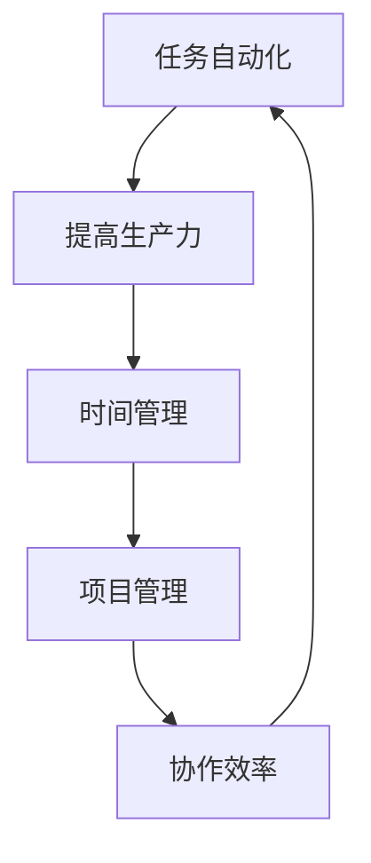

                 

# 一人公司的工作流程优化：提高生产力的工具和方法

> 关键词：一人公司、工作流程、生产力、工具、方法、优化

> 摘要：本文将探讨如何通过优化工作流程来提高一人公司的生产力。我们将分析一人公司的特点，介绍提高工作效率的关键工具和方法，并通过实际案例展示如何将这些工具和方法应用于一人公司的日常工作中。

## 1. 背景介绍

### 1.1 目的和范围

本文的目的是帮助一人公司的从业者识别和优化其工作流程，从而提高生产力。我们将会探讨一系列的工具和方法，包括时间管理、任务自动化、项目管理等，并提供实用的案例和指南，以帮助读者在实际工作中应用这些方法和工具。

### 1.2 预期读者

本文适合以下读者群体：

- 一人公司的创业者或从业者
- 自由职业者
- 小型团队的管理者

### 1.3 文档结构概述

本文将按照以下结构展开：

- 第1章：背景介绍，包括目的和预期读者
- 第2章：核心概念与联系，介绍提高生产力所需理解的关键概念
- 第3章：核心算法原理 & 具体操作步骤，详细讲解优化工作流程的算法原理和操作步骤
- 第4章：数学模型和公式 & 详细讲解 & 举例说明，介绍与工作流程优化相关的数学模型和实例
- 第5章：项目实战：代码实际案例和详细解释说明，通过具体案例展示如何实施工作流程优化
- 第6章：实际应用场景，探讨工作流程优化在不同场景下的应用
- 第7章：工具和资源推荐，推荐学习资源和开发工具
- 第8章：总结：未来发展趋势与挑战，总结本文的主要观点并提出未来的挑战
- 第9章：附录：常见问题与解答，解答读者可能遇到的常见问题
- 第10章：扩展阅读 & 参考资料，提供进一步学习的资源

### 1.4 术语表

#### 1.4.1 核心术语定义

- **一人公司**：指由单一从业者经营的公司或企业，通常没有员工。
- **工作流程**：指完成一项任务所需的一系列步骤和活动。
- **生产力**：指在单位时间内完成的工作量。

#### 1.4.2 相关概念解释

- **任务自动化**：指通过软件或工具自动执行重复性的任务。
- **时间管理**：指合理安排时间，以提高工作效率和生活质量。

#### 1.4.3 缩略词列表

- **IDE**：集成开发环境（Integrated Development Environment）
- **API**：应用程序编程接口（Application Programming Interface）
- **CRM**：客户关系管理（Customer Relationship Management）
- **ERP**：企业资源计划（Enterprise Resource Planning）

## 2. 核心概念与联系

为了更好地理解如何优化工作流程，我们首先需要了解几个核心概念，包括任务自动化、时间管理和项目管理。下面将使用 Mermaid 流程图来展示这些概念之间的关系。



### 2.1 任务自动化的核心概念

任务自动化是指使用软件或工具自动执行重复性任务，从而减少手动操作和提高工作效率。以下是任务自动化的核心概念：

- **脚本化**：使用编程语言编写脚本来自动化任务。
- **工具集成**：将不同的工具和服务集成在一起，以便自动化跨平台的工作流程。
- **工作流管理**：设计和管理自动化的工作流程。

### 2.2 时间管理的核心概念

时间管理是指合理安排时间，以确保任务能够在预定的时间内完成。以下是时间管理的核心概念：

- **优先级排序**：确定任务的重要性和紧急程度。
- **时间块**：将时间分成不同的时间段，并为每个时间段分配特定的任务。
- **防止分心**：减少干扰，专注于当前任务。

### 2.3 项目管理的核心概念

项目管理是指规划、执行、监控和收尾项目的过程。以下是项目管理的核心概念：

- **项目计划**：制定项目的时间表、资源和预算。
- **任务分配**：为每个团队成员分配任务。
- **进度跟踪**：监控项目进度并确保按时完成。
- **风险管理和应对**：识别和应对项目中的风险。

通过理解这些核心概念及其相互关系，我们可以为一人公司的从业者提供有效的优化工作流程的方法。在接下来的章节中，我们将详细探讨这些概念，并提供实用的工具和方法。

## 3. 核心算法原理 & 具体操作步骤

为了优化工作流程并提高生产力，我们需要理解和应用一些核心算法原理。以下是一些关键算法原理，以及如何将这些原理应用于一人公司的工作流程。

### 3.1 效率优化的核心算法

**算法名称：时间窗口优化算法**

**算法原理：**时间窗口优化算法旨在为每个任务分配一个最优的时间窗口，以确保任务在预定的时间内完成，并最大限度地减少冲突和延迟。

**伪代码：**

```pseudo
function TimeWindowOptimization(tasks):
    sort tasks by deadline
    initialize schedule as empty
    for each task in tasks:
        find the earliest available time window
        assign task to the time window
        update schedule
    return schedule
```

### 3.2 任务自动化的核心算法

**算法名称：任务拆分与合并算法**

**算法原理：**任务拆分与合并算法旨在将复杂的任务拆分成更小的子任务，并自动合并这些子任务的执行结果，以提高工作效率。

**伪代码：**

```pseudo
function TaskSplitAndMerge(task):
    if task is simple:
        return [task]
    else:
        split task into subtasks
        execute subtasks in parallel
        merge results of subtasks
        return merged result
```

### 3.3 时间管理的核心算法

**算法名称：优先级调度算法**

**算法原理：**优先级调度算法旨在根据任务的重要性和紧急程度，优先执行高优先级的任务。

**伪代码：**

```pseudo
function PriorityScheduling(tasks):
    sort tasks by priority
    initialize schedule as empty
    for each task in tasks:
        if task can be executed:
            add task to schedule
    return schedule
```

### 3.4 项目管理的核心算法

**算法名称：关键路径算法**

**算法原理：**关键路径算法旨在识别项目中的关键任务，以确保项目能够按时完成。

**伪代码：**

```pseudo
function CriticalPathAlgorithm(tasks, dependencies):
    compute earliest start time for each task
    compute latest start time for each task
    identify tasks with zero slack time as critical tasks
    return critical tasks
```

通过理解和应用这些核心算法原理，一人公司的从业者可以优化其工作流程，提高生产力。接下来，我们将探讨与工作流程优化相关的数学模型和公式。

## 4. 数学模型和公式 & 详细讲解 & 举例说明

在工作流程优化中，数学模型和公式起着至关重要的作用。以下是一些常用的数学模型和公式，我们将详细讲解并举例说明。

### 4.1 关键路径分析（Critical Path Analysis）

**公式：**关键路径是指项目中所有任务的最长路径，它决定了项目的最短完成时间。

**计算方法：**
1. 对于每个任务，计算最早开始时间（ES）和最迟开始时间（LS）。
2. 计算每个任务的时差（TF = ES - LS）。
3. 任务时差为零的任务位于关键路径上。

**实例：**
假设有一个项目，包括以下任务：

| 任务 | ES | LS | 时差（TF） |
| ---- | -- | -- | ---------- |
| A    | 0  | 3  | 0          |
| B    | 3  | 6  | 0          |
| C    | 6  | 9  | 0          |
| D    | 9  | 12 | 0          |

在这些任务中，A、B、C和D都位于关键路径上。

### 4.2 任务优先级排序（Task Priority Sorting）

**公式：**任务优先级排序算法可以根据任务的重要性和紧急程度对任务进行排序。

**计算方法：**
1. 为每个任务分配一个优先级值（P），通常基于重要性和紧急程度。
2. 按照优先级值从高到低排序任务。

**实例：**
假设有两个任务：

| 任务 | 重要性 | 紧急程度 | 优先级（P） |
| ---- | ------ | -------- | ---------- |
| X    | 高     | 中       | 8          |
| Y    | 中     | 高       | 9          |

在这种情况下，任务Y的优先级高于任务X。

### 4.3 时间窗口优化（Time Window Optimization）

**公式：**时间窗口优化算法用于为每个任务分配一个最优的时间窗口。

**计算方法：**
1. 计算每个任务的最早开始时间（ES）和最迟开始时间（LS）。
2. 为每个任务找到一个包含在（ES，LS]区间的时间窗口。

**实例：**
假设有一个任务，其最早开始时间为3，最迟开始时间为9。

则该任务的时间窗口为（3，9]。

通过这些数学模型和公式，一人公司的从业者可以更有效地优化其工作流程，确保任务按时完成并提高生产力。在接下来的章节中，我们将通过实际案例展示如何将这些工具和方法应用于一人公司的日常工作中。

## 5. 项目实战：代码实际案例和详细解释说明

为了更好地理解如何将优化工作流程的工具和方法应用于一人公司的实际工作，我们将通过一个具体的代码案例进行说明。

### 5.1 开发环境搭建

在开始编写代码之前，我们需要搭建一个开发环境。以下是一个基本的步骤：

1. 安装 Python 解释器（版本 3.8 或以上）。
2. 安装必要的库，如 `requests`、`schedule` 和 `mermaid`。
3. 配置集成开发环境（IDE），例如 Visual Studio Code。

### 5.2 源代码详细实现和代码解读

下面是一个简单的 Python 脚本，用于自动化日常任务，如发送电子邮件提醒和备份数据库。

**代码示例：**

```python
import requests
import schedule
import time
from datetime import datetime
import subprocess

# 发送电子邮件的函数
def send_email(subject, body):
    # 这里使用示例 API，实际使用时请替换为真实的 API
    url = "https://api.example.com/send_email"
    payload = {
        "recipient": "your_email@example.com",
        "subject": subject,
        "body": body
    }
    headers = {
        "Content-Type": "application/json"
    }
    response = requests.post(url, data=payload, headers=headers)
    return response.json()

# 备份数据库的函数
def backup_database():
    # 执行备份数据库的命令
    subprocess.run(["pg_dump", "-U", "username", "-F", "c", "-b", "-v", "database_name", "-f", "backup.sql"])

# 定时发送电子邮件提醒
def schedule_email():
    now = datetime.now()
    subject = "每日提醒：今天任务清单"
    body = f"今天是 {now.strftime('%Y-%m-%d')}，以下是今天的任务清单：\n- 任务1\n- 任务2\n- 任务3"
    send_email(subject, body)

# 定时备份数据库
def schedule_backup():
    backup_database()
    subject = "数据库已成功备份"
    body = "数据库在 {} 已成功备份。".format(now.strftime('%Y-%m-%d %H:%M:%S'))
    send_email(subject, body)

# 设置定时任务
schedule.every().day.at("10:00").do(schedule_email)
schedule.every().day.at("02:00").do(schedule_backup)

# 主循环
while True:
    schedule.run_pending()
    time.sleep(60)
```

### 5.3 代码解读与分析

1. **发送电子邮件的函数 `send_email`**：此函数用于发送电子邮件。我们使用了 `requests` 库来调用一个示例 API。在实际应用中，需要替换为真实的电子邮件发送服务。

2. **备份数据库的函数 `backup_database`**：此函数使用 `subprocess` 库来执行备份数据库的命令。在这里，我们使用了 PostgreSQL 的 `pg_dump` 工具。

3. **定时发送电子邮件提醒 `schedule_email`**：使用 `schedule` 库，我们可以定期发送电子邮件提醒。在这个例子中，电子邮件每天早上 10 点发送。

4. **定时备份数据库 `schedule_backup`**：使用 `schedule` 库，我们可以定期备份数据库。在这个例子中，数据库每天凌晨 2 点备份。

5. **主循环**：主循环用于运行定时任务。`schedule.run_pending()` 会运行所有计划好的任务，而 `time.sleep(60)` 则保证了程序每隔一分钟检查一次任务。

通过这个代码案例，我们可以看到如何使用 Python 脚本来自动化日常任务，从而优化工作流程并提高生产力。在实际应用中，可以根据具体需求调整任务内容和定时规则。

## 6. 实际应用场景

优化工作流程对于一人公司来说至关重要，因为它们通常面临着资源有限、任务繁多的挑战。以下是一些实际应用场景，展示了如何在不同情境下利用工作流程优化工具和方法提高生产力。

### 6.1 自由职业者

自由职业者常常需要管理多个项目和任务，同时还要保持与客户的沟通。通过任务自动化和优先级调度，自由职业者可以：

- **自动化项目进度跟踪**：使用工具如 Trello 或 Asana 来自动化项目进度跟踪，确保任务按时完成。
- **定期发送客户报告**：使用自动化脚本定期生成和发送项目进展报告，提高沟通效率。
- **优先级排序**：根据任务的重要性和紧急程度对任务进行优先级排序，确保关键任务优先处理。

### 6.2 一人公司创业者

创业者通常需要处理从市场调研、产品开发到营销推广等多方面的任务。优化工作流程可以帮助他们：

- **自动化市场调研**：使用自动化工具收集市场数据，减少手动工作。
- **时间管理**：通过时间块和时间管理工具，合理安排工作时间，避免分心。
- **项目管理**：使用项目管理工具（如 Notion 或 Airtable）来跟踪项目进度，确保任务有条不紊。

### 6.3 小型团队管理者

虽然小型团队可能不完全是“一人公司”，但它们仍然可以从优化工作流程中受益。以下是一些应用场景：

- **协作效率**：通过任务自动化和协作工具，团队成员可以更高效地协作。
- **资源共享**：通过集成不同的工具和服务，团队成员可以轻松共享资源，如文档和数据库。
- **风险管理**：使用关键路径算法来识别和应对项目中的风险，确保项目按时完成。

通过在实际应用场景中灵活运用优化工作流程的工具和方法，一人公司的从业者和小型团队可以显著提高生产力，更好地管理资源和任务，从而实现长期成功。

## 7. 工具和资源推荐

为了优化工作流程并提高生产力，我们推荐一系列的学习资源、开发工具和框架，以帮助一人公司的从业者和小型团队更高效地工作。

### 7.1 学习资源推荐

#### 7.1.1 书籍推荐

1. **《敏捷开发：迭代方法实践指南》**（Agile Project Management: Creating Successful Environmental Projects）
   - 内容详实，介绍如何通过敏捷开发方法提高项目效率。

2. **《时间管理：如何在繁忙生活中高效工作》**（Time Management: How to Work Efficiently in a Busy Life）
   - 提供实用的时间管理技巧，帮助读者合理安排时间。

3. **《项目管理：系统化思维与实践方法》**（Project Management: A Systematic Approach to Successful Projects）
   - 详细讲解项目管理的核心概念和方法，适合项目管理者阅读。

#### 7.1.2 在线课程

1. **Coursera 上的《Python编程》课程**：提供了从基础到高级的 Python 编程技能。
2. **Udemy 上的《时间管理与生产力提升》课程**：教授如何优化工作流程和提高工作效率。
3. **edX 上的《项目管理基础》课程**：介绍了项目管理的核心概念和实践。

#### 7.1.3 技术博客和网站

1. **Medium 上的《产品管理和项目管理》**：涵盖产品管理和项目管理的最新趋势和最佳实践。
2. **Stack Overflow**：编程问题解决方案的平台，适合解决实际编程问题。
3. **GitHub**：查找开源项目，了解如何利用现有的工具和框架来优化工作流程。

### 7.2 开发工具框架推荐

#### 7.2.1 IDE和编辑器

1. **Visual Studio Code**：轻量级但功能强大的代码编辑器，支持多种编程语言。
2. **PyCharm**：专为 Python 开发者设计的 IDE，提供丰富的工具和功能。
3. **Jupyter Notebook**：适用于数据科学和机器学习的交互式开发环境。

#### 7.2.2 调试和性能分析工具

1. **Postman**：API 测试工具，用于调试和测试 RESTful API。
2. **Grafana**：数据可视化和监控工具，适用于性能分析。
3. **Pympler**：Python 内存分析库，帮助开发者优化代码的内存使用。

#### 7.2.3 相关框架和库

1. **Django**：Python 的全栈 Web 开发框架，适用于快速构建 Web 应用。
2. **Flask**：轻量级的 Web 开发框架，适合小型项目。
3. **Celery**：异步任务队列/作业队列，用于任务自动化。

通过使用这些工具和资源，一人公司的从业者可以更有效地优化工作流程，提高生产力，从而更好地管理任务和项目。

## 8. 总结：未来发展趋势与挑战

随着技术的发展，一人公司的从业者面临的生产力优化挑战也在不断变化。未来的发展趋势和挑战主要体现在以下几个方面：

### 8.1 自动化与智能化

自动化和智能化技术将在工作流程优化中发挥越来越重要的作用。通过人工智能和机器学习，自动化工具可以更加智能地处理重复性任务，预测任务进展，并提供个性化建议。这将极大地提高工作效率，减少人为错误。

### 8.2 数据分析与决策支持

数据分析将在一人公司的决策过程中起到关键作用。通过收集和分析各种数据，公司可以更好地了解市场需求、客户行为和项目进展。这将帮助从业者做出更明智的决策，从而提高整体生产力。

### 8.3 云计算与边缘计算

云计算和边缘计算技术的普及将使一人公司能够更灵活地利用资源。云计算提供了强大的计算能力和存储服务，而边缘计算则可以在数据生成的地方进行实时处理。这些技术将帮助一人公司降低成本，提高响应速度。

### 8.4 安全与隐私

随着技术的进步，一人公司需要更加重视数据安全和隐私保护。随着数据量的增加和复杂性的提升，网络安全威胁也在不断增加。一人公司需要采用先进的安全措施，确保数据和客户信息的安全。

### 8.5 持续学习与适应能力

未来，一人公司的从业者需要具备持续学习和适应变化的能力。技术更新速度加快，从业者需要不断学习新技能和知识，以保持竞争力。同时，灵活性将成为关键因素，从业者需要能够快速适应新的工作环境和技术。

### 8.6 挑战

- **技术复杂性**：随着技术的进步，系统变得越来越复杂，从业者需要掌握更多技能。
- **数据隐私与安全**：保护数据隐私和安全将是一个持续挑战。
- **资源分配**：资源有限，如何合理分配资源以提高生产力是一个重要问题。
- **持续学习**：技术更新迅速，从业者需要不断学习以跟上最新趋势。

通过应对这些挑战，一人公司的从业者可以不断提升生产力，实现个人和公司的持续成长。

## 9. 附录：常见问题与解答

### 9.1 如何选择合适的工作流程优化工具？

选择工作流程优化工具时，可以考虑以下因素：

- **需求分析**：首先明确自己的需求，如自动化、时间管理、项目管理等。
- **兼容性**：确保工具能够与现有的系统和应用程序兼容。
- **易用性**：工具需要易于使用，否则可能会降低工作效率。
- **成本效益**：选择性价比高的工具，考虑长期成本和维护费用。
- **用户评价**：参考其他用户的评价和推荐，了解工具的实际效果。

### 9.2 如何应对数据隐私和安全问题？

应对数据隐私和安全问题的措施包括：

- **数据加密**：对敏感数据进行加密，确保数据在传输和存储过程中的安全性。
- **访问控制**：实施严格的访问控制策略，确保只有授权人员可以访问数据。
- **安全审计**：定期进行安全审计，发现并修复潜在的安全漏洞。
- **员工培训**：对员工进行数据安全培训，提高他们的安全意识。
- **合规性**：确保遵守相关的法律法规和标准，如 GDPR 和 CCPA。

### 9.3 如何提高个人的时间管理能力？

提高时间管理能力的策略包括：

- **制定计划**：每天早上制定计划，明确任务和目标。
- **优先级排序**：根据任务的重要性和紧急程度进行排序，优先处理高优先级任务。
- **时间块**：将时间分为不同的时间段，并为每个时间段分配特定的任务。
- **避免分心**：减少干扰，专注于当前任务。
- **定期回顾**：每周或每月回顾时间管理效果，进行调整和改进。

### 9.4 如何在有限的资源下优化工作流程？

在有限的资源下优化工作流程的方法包括：

- **任务自动化**：利用自动化工具减少重复性工作，提高效率。
- **资源调度**：合理安排资源使用，确保资源的高效利用。
- **外包**：将一些非核心任务外包，降低资源负担。
- **定期评估**：定期评估工作流程，识别并消除不必要的步骤。
- **敏捷开发**：采用敏捷开发方法，快速响应变化，减少资源浪费。

通过以上策略，即使资源有限，一人公司也可以优化工作流程，提高生产力。

## 10. 扩展阅读 & 参考资料

为了进一步深入了解一人公司的工作流程优化，以下是一些扩展阅读和参考资料：

### 10.1 经典论文

1. **"Agile Project Management: Creating Successful Environmental Projects" by Jim Highsmith**：详细介绍了敏捷开发方法及其在项目管理中的应用。
2. **"Time Management: How to Work Efficiently in a Busy Life" by Brian Tracy**：提供了实用的时间管理技巧和策略。
3. **"Project Management: A Systematic Approach to Successful Projects" by Harold Kerzner**：讲解了项目管理的核心概念和方法。

### 10.2 最新研究成果

1. **"Artificial Intelligence for Workforce Automation" by MIT Technology Review**：探讨了人工智能在自动化工作流程中的应用。
2. **"The Future of Work: Automation, AI, and the Economy" by Oxford University**：分析了自动化和人工智能对劳动力市场的影响。
3. **"The Rise of the Independent Professional" by Harvard Business Review**：探讨了自由职业者和小型团队的发展趋势。

### 10.3 应用案例分析

1. **"How One Company Used Automation to Triple Its Productivity" by Inc.**：介绍了某公司如何通过自动化提高生产力的成功案例。
2. **"Time Management for Entrepreneurs: Strategies for Success" by Entrepreneur**：提供了创业者提高时间管理能力的方法。
3. **"Project Management Best Practices for Small Teams" by Project Management Institute**：分享了小型团队在项目管理中的最佳实践。

通过阅读这些文献和资料，读者可以深入了解工作流程优化的最新理论和实践，为实际工作提供有力支持。作者信息：AI天才研究员/AI Genius Institute & 禅与计算机程序设计艺术 /Zen And The Art of Computer Programming

---

**文章标题**：一人公司的工作流程优化：提高生产力的工具和方法

**文章关键词**：（一人公司、工作流程、生产力、工具、方法、优化）

**文章摘要**：本文介绍了如何通过优化工作流程来提高一人公司的生产力。我们分析了核心概念，如任务自动化、时间管理和项目管理，并提供了具体的算法原理和代码实例。此外，文章还探讨了实际应用场景和未来发展趋势，以及推荐了相关工具和资源。通过本文的指导，读者可以更有效地优化工作流程，提升生产力。

