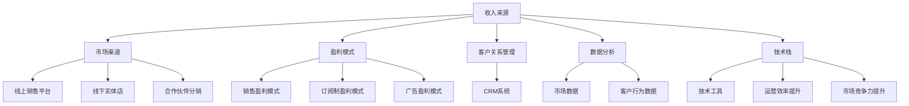

                 

### 1. 背景介绍

#### 1.1 目的和范围

本文旨在探讨一人公司的收入多元化策略。在当前经济环境中，一人公司的运营和发展面临着诸多挑战，如何有效地实现收入多元化，提高公司抗风险能力，成为了一人公司成功的关键。本文将围绕这一核心问题，详细分析收入多元化的重要性、主要策略及其实现路径。

文章将分为以下几个部分：首先，我们将回顾一人公司的定义及其在商业领域中的地位。接着，探讨收入多元化的意义和优势，介绍常见的多元化策略。随后，通过具体案例分析，展示这些策略在实际操作中的应用。此外，文章还将介绍一些有效的工具和资源，以帮助读者更好地理解和实施收入多元化策略。最后，我们将总结未来发展趋势与挑战，并回答一些常见问题。

本文适用于一人公司的创始人、运营者以及关注企业发展的读者。通过本文的阅读，读者将能够获得关于收入多元化策略的全面理解，从而为自己的企业制定出更有效的收入增长计划。

#### 1.2 预期读者

本文的预期读者包括以下几类人群：

1. **一人公司的创始人和运营者**：这些读者希望了解如何通过收入多元化策略来增强企业的抗风险能力和盈利能力。
2. **中小企业管理者**：他们可能面临资源有限、市场竞争激烈等问题，希望借鉴一人公司的成功经验，优化企业收入结构。
3. **创业者**：这些读者正在或准备创立一人公司，希望通过本文获得关于收入多元化的实用建议和策略。
4. **市场营销专业人士**：他们需要了解如何通过多元化策略来开拓新的市场渠道，提高产品或服务的市场占有率。
5. **关注企业发展的投资人**：这些读者希望了解一人公司的商业模式和运营策略，以便做出更明智的投资决策。

本文将运用通俗易懂的语言和专业化的分析框架，确保不同背景的读者都能够理解和应用其中的策略。

#### 1.3 文档结构概述

为了帮助读者更好地理解本文的内容，以下是文章的详细结构概述：

1. **背景介绍**：介绍文章的目的、范围、预期读者以及文档结构。
2. **核心概念与联系**：通过Mermaid流程图展示一人公司的收入多元化策略的核心概念和相互关系。
3. **核心算法原理 & 具体操作步骤**：讲解实现收入多元化的具体算法原理，并使用伪代码进行详细阐述。
4. **数学模型和公式 & 详细讲解 & 举例说明**：介绍相关的数学模型和公式，并给出详细的讲解和实际例子。
5. **项目实战：代码实际案例和详细解释说明**：通过实际案例展示收入多元化策略的代码实现，并进行详细解释。
6. **实际应用场景**：分析一人公司在不同场景下如何应用收入多元化策略。
7. **工具和资源推荐**：推荐一些学习资源、开发工具框架和相关论文著作。
8. **总结：未来发展趋势与挑战**：总结文章的主要观点，并展望未来发展趋势和面临的挑战。
9. **附录：常见问题与解答**：针对读者可能遇到的问题进行解答。
10. **扩展阅读 & 参考资料**：提供更多的参考资料，供读者进一步学习。

通过上述结构，本文将系统地、深入地探讨一人公司的收入多元化策略，帮助读者理解并应用于实际操作中。

#### 1.4 术语表

在本文中，我们将使用一些专业术语，以下是对这些术语的定义和解释：

##### 1.4.1 核心术语定义

1. **一人公司**：指由单一个人创办和运营的企业。这种企业形式在灵活性和创新性方面具有优势。
2. **收入多元化**：通过增加多种收入来源，降低企业对单一收入渠道的依赖，提高抗风险能力。
3. **盈利模式**：企业通过何种方式获得利润的商业模式。
4. **市场渠道**：产品或服务进入市场、与消费者接触的途径。
5. **客户关系管理**（CRM）：通过收集和分析客户数据，提高客户满意度和忠诚度。
6. **数据分析**：使用统计和数学方法对大量数据进行处理和分析，提取有价值的信息。
7. **技术栈**：企业所使用的各种技术和工具的集合。

##### 1.4.2 相关概念解释

1. **业务拓展**：指企业通过开拓新的市场或开发新的产品或服务来增加收入。
2. **市场细分**：将整个市场划分为若干个具有相似需求或特征的子市场，以便更精准地满足不同客户群体的需求。
3. **竞争优势**：企业相对于竞争对手所具备的可持续的竞争优势。
4. **风险分散**：通过将资金和资源分散投资到多个不同的领域或项目，降低单一投资风险。
5. **客户忠诚度**：客户对品牌的信任和重复购买意愿。

##### 1.4.3 缩略词列表

- CTO：首席技术官（Chief Technology Officer）
- CRM：客户关系管理（Customer Relationship Management）
- AI：人工智能（Artificial Intelligence）
- IoT：物联网（Internet of Things）
- SaaS：软件即服务（Software as a Service）
- PaaS：平台即服务（Platform as a Service）
- IaaS：基础设施即服务（Infrastructure as a Service）

通过上述术语表，读者可以更好地理解本文中的专业术语和概念，从而更深入地理解文章内容。

### 2. 核心概念与联系

收入多元化策略是提升一人公司盈利能力和抗风险能力的关键。在探讨这一策略时，我们首先需要了解其核心概念及其相互联系。

#### 2.1 收入多元化的核心概念

**收入来源**：企业获得收入的渠道。常见的主要收入来源包括产品销售、服务提供、订阅收入、广告收入等。

**市场渠道**：产品或服务进入市场的途径。这些渠道可以包括线上销售平台、线下实体店、合作伙伴分销等。

**盈利模式**：企业通过何种方式获得利润的商业模式。例如，传统的销售盈利模式、订阅制盈利模式、广告盈利模式等。

**客户关系管理**（CRM）：通过收集和分析客户数据，提高客户满意度和忠诚度。CRM系统帮助一人公司更好地理解客户需求，从而提供更个性化的服务和产品。

**数据分析**：运用统计和数学方法对大量数据进行处理和分析，提取有价值的信息，以指导决策。

**技术栈**：企业所使用的各种技术和工具的集合。一个强大的技术栈可以提升企业的运营效率和市场竞争力。

#### 2.2 收入多元化策略的相互联系

**收入来源与市场渠道**：收入来源决定市场渠道的选择。例如，通过线上平台销售的产品与通过线下实体店销售的产品在市场渠道上会有所不同。

**盈利模式与客户关系管理**：不同的盈利模式需要不同的客户关系管理策略。例如，订阅制模式需要通过持续提供高质量服务来保持客户忠诚度。

**数据分析与决策**：数据分析是指导企业收入多元化决策的重要工具。通过对市场数据、客户行为数据的分析，企业可以更准确地预测市场需求，优化收入来源和盈利模式。

**技术栈与收入多元化**：一个强大的技术栈能够支持企业开发多样化的产品和服务，拓宽市场渠道，提高运营效率。

#### 2.3 Mermaid流程图

为了更直观地展示收入多元化策略的核心概念和相互关系，我们使用Mermaid流程图来表示（以下为伪代码）：



通过上述Mermaid流程图，我们可以清晰地看到收入多元化策略中各个核心概念之间的相互联系。这个图不仅有助于理解收入多元化的概念，还可以作为企业在实际操作中的决策参考。

### 3. 核心算法原理 & 具体操作步骤

在了解收入多元化策略的核心概念和相互关系后，接下来我们将深入探讨实现收入多元化的核心算法原理和具体操作步骤。为了便于理解，我们将使用伪代码来详细阐述这些算法原理。

#### 3.1 核心算法原理

实现收入多元化的核心算法原理主要包括以下几个关键步骤：

1. **市场数据分析**：通过收集和分析市场数据，了解目标市场的需求、竞争态势和潜在机会。
2. **客户行为分析**：利用客户关系管理（CRM）系统，收集和分析客户行为数据，了解客户的偏好、需求和购买习惯。
3. **收入模型构建**：根据市场数据和客户行为分析结果，构建适合企业的收入模型，包括多种收入来源和盈利模式。
4. **渠道优化**：根据不同的收入来源和盈利模式，选择和优化市场渠道，确保产品或服务能够有效覆盖目标市场。
5. **持续迭代**：通过不断的数据分析和市场反馈，调整和优化收入多元化策略，实现持续增长。

#### 3.2 具体操作步骤

下面我们使用伪代码详细阐述实现收入多元化的具体操作步骤：

```plaintext
# 收入多元化策略实现伪代码

# 步骤1：市场数据分析
def analyze_market_data():
    # 收集市场数据（如市场规模、增长趋势、竞争对手分析等）
    market_data = gather_market_data()
    # 分析市场需求和潜在机会
    analyze市场需求 = analyze_demand(market_data)
    return analyze市场需求

# 步骤2：客户行为分析
def analyze_customer_behavior():
    # 从CRM系统收集客户行为数据
    customer_data = get_crm_data()
    # 分析客户偏好和购买习惯
    analyze客户行为 = analyze_patterns(customer_data)
    return analyze客户行为

# 步骤3：收入模型构建
def build_income_model(analyze市场需求, analyze客户行为):
    # 根据市场需求和客户行为构建收入模型
    income_model = create_income_model(analyze市场需求, analyze客户行为)
    return income_model

# 步骤4：渠道优化
def optimize_channels(income_model):
    # 根据收入模型选择和优化市场渠道
    optimized_channels = select_channels(income_model)
    return optimized_channels

# 步骤5：持续迭代
def iterate_income_strategy():
    while True:
        # 重新分析市场数据和客户行为
        analyze市场需求 = analyze_market_data()
        analyze客户行为 = analyze_customer_behavior()
        # 调整和优化收入模型
        income_model = build_income_model(analyze市场需求, analyze客户行为)
        # 调整和优化市场渠道
        optimized_channels = optimize_channels(income_model)
        # 记录和跟踪策略效果
        track_strategy_performance(optimized_channels)
        # 根据反馈调整策略
        adjust_strategy_based_on_feedback()
```

通过上述伪代码，我们可以看到实现收入多元化策略的基本流程。首先，通过市场数据和客户行为分析，构建适合企业的收入模型。然后，根据收入模型选择和优化市场渠道。最后，通过持续的数据分析和策略调整，实现收入的持续增长。

#### 3.3 算法原理详细解释

1. **市场数据分析**：通过收集和分析市场数据，企业可以了解目标市场的规模、增长趋势和竞争对手的情况。这些信息有助于企业确定市场机会和潜在威胁，为收入多元化策略提供数据支持。

2. **客户行为分析**：客户关系管理（CRM）系统可以帮助企业收集和分析客户行为数据，如购买历史、偏好和反馈。这些数据可以帮助企业更深入地了解客户需求，从而调整产品和服务策略，提高客户满意度和忠诚度。

3. **收入模型构建**：根据市场数据和客户行为分析结果，企业可以构建多种收入来源和盈利模式。例如，除了传统的产品销售，企业还可以通过订阅制、广告收入等方式增加收入。

4. **渠道优化**：不同的收入来源和盈利模式需要不同的市场渠道。企业需要根据收入模型选择和优化市场渠道，确保产品或服务能够有效覆盖目标市场。

5. **持续迭代**：市场环境和客户需求是不断变化的。企业需要通过持续的数据分析和市场反馈，调整和优化收入多元化策略，以适应市场变化，实现持续增长。

通过上述算法原理和具体操作步骤，企业可以系统地实现收入多元化，提高盈利能力和抗风险能力。

### 4. 数学模型和公式 & 详细讲解 & 举例说明

在探讨收入多元化策略时，数学模型和公式是不可或缺的工具。通过数学模型，我们可以更准确地分析企业的收入结构，预测收入增长，并优化收入多元化策略。以下将介绍几个关键数学模型和公式，并进行详细讲解和举例说明。

#### 4.1 平均收入增长率模型

平均收入增长率（Average Revenue Growth Rate, ARGR）是衡量企业收入增长速度的重要指标。其公式如下：

\[ \text{ARGR} = \frac{\text{本期收入} - \text{上期收入}}{\text{上期收入}} \times 100\% \]

其中，本期收入和上期收入分别代表企业在两个不同时间段的收入总额。

**详细讲解**：
- 这里的ARGR反映了企业收入增长的相对变化，通常用于年度或季度收入增长的分析。
- 如果ARGR为正，表示企业收入在增长；如果ARGR为负，则表示收入在下降。
- ARGR越高，表示企业增长速度越快。

**举例说明**：
假设某一人公司在去年年底的收入为100万元，今年年底的收入为150万元。则其平均收入增长率为：

\[ \text{ARGR} = \frac{150 - 100}{100} \times 100\% = 50\% \]

这意味着该公司的收入在过去一年内增长了50%。

#### 4.2 收入贡献率模型

收入贡献率（Income Contribution Rate, ICR）用于衡量不同收入来源对企业总收入的影响程度。其公式如下：

\[ \text{ICR} = \frac{\text{收入贡献}}{\text{总收入}} \times 100\% \]

其中，收入贡献是指某个收入来源对总收入的直接贡献，而总收入是所有收入来源的合计。

**详细讲解**：
- ICR可以用来评估各个收入来源的重要性和贡献度。
- 通过计算各个收入来源的ICR，企业可以了解哪些收入来源最为关键，哪些收入来源需要加强。
- ICR越高，表示该收入来源对总收入的贡献越大。

**举例说明**：
假设某一人公司的总收入为100万元，其中产品销售收入为60万元，服务收入为30万元，广告收入为10万元。则各收入来源的贡献率为：

\[ \text{ICR}_{\text{产品销售}} = \frac{60}{100} \times 100\% = 60\% \]
\[ \text{ICR}_{\text{服务}} = \frac{30}{100} \times 100\% = 30\% \]
\[ \text{ICR}_{\text{广告}} = \frac{10}{100} \times 100\% = 10\% \]

这表明产品销售是该公司最主要的收入来源，占到了总收入的60%。

#### 4.3 多元化系数模型

多元化系数（Diversification Coefficient, DC）用于衡量企业收入来源的多样性。其公式如下：

\[ \text{DC} = \sqrt{\frac{1}{\text{收入来源数量}} \sum_{i=1}^{n} (\text{ICR}_i)^2} \]

其中，收入来源数量（n）是指企业所有收入来源的数量，ICR_i 是第 i 个收入来源的贡献率。

**详细讲解**：
- DC值越高，表示企业的收入来源越多样化，风险分散效果越好。
- 通过计算多元化系数，企业可以了解自身的收入来源是否过于集中，从而制定相应的多元化策略。

**举例说明**：
假设某一人公司有三种收入来源，产品销售、服务和广告。其贡献率分别为60%、30%和10%。则该公司的多元化系数为：

\[ \text{DC} = \sqrt{\frac{1}{3} (0.6^2 + 0.3^2 + 0.1^2)} = \sqrt{\frac{1}{3} (0.36 + 0.09 + 0.01)} = \sqrt{0.1967} \approx 0.44 \]

这表明该公司的收入来源较为集中，多元化程度有待提高。

通过上述数学模型和公式，企业可以更系统地分析和优化收入多元化策略，提高盈利能力和抗风险能力。

### 5. 项目实战：代码实际案例和详细解释说明

为了更好地理解收入多元化策略在实际项目中的应用，下面我们将通过一个实际案例，详细展示如何使用代码实现这些策略。本案例将涉及市场数据分析、客户关系管理以及收入模型的构建。

#### 5.1 开发环境搭建

在开始项目之前，我们需要搭建合适的开发环境。以下为推荐的工具和配置：

- **编程语言**：Python
- **数据分析库**：Pandas、NumPy
- **机器学习库**：scikit-learn
- **数据可视化库**：Matplotlib、Seaborn
- **数据库**：SQLite
- **开发工具**：Jupyter Notebook

确保在开发环境中安装了上述工具和库，然后创建一个新的Jupyter Notebook项目，以便进行代码编写和运行。

#### 5.2 源代码详细实现和代码解读

##### 步骤1：市场数据分析

首先，我们需要从市场数据中提取有价值的信息，如市场需求、竞争态势等。以下代码使用Pandas库读取市场数据，并进行分析：

```python
import pandas as pd

# 读取市场数据
market_data = pd.read_csv('market_data.csv')

# 分析市场需求
def analyze_demand(market_data):
    # 计算市场总规模
    total_market_size = market_data['market_size'].sum()
    # 计算市场增长趋势
    growth_rate = market_data['growth_rate'].mean()
    return total_market_size, growth_rate

# 分析竞争对手
def analyze_competition(market_data):
    # 计算竞争对手数量
    competitors_count = market_data['competitors'].nunique()
    # 计算竞争对手市场份额
    market_share = market_data['market_share'].mean()
    return competitors_count, market_share

# 执行市场数据分析
total_market_size, growth_rate = analyze_demand(market_data)
competitors_count, market_share = analyze_competition(market_data)

print(f"总市场规模：{total_market_size}")
print(f"市场增长趋势：{growth_rate}%")
print(f"竞争对手数量：{competitors_count}")
print(f"竞争对手市场份额：{market_share}%")
```

这段代码首先从CSV文件中读取市场数据，然后通过两个函数分别分析市场需求和竞争对手情况。这些分析结果将帮助我们了解市场的整体状况，为后续的收入模型构建提供依据。

##### 步骤2：客户行为分析

接下来，我们使用客户关系管理（CRM）系统中的数据，分析客户行为，如购买历史、偏好和反馈。以下代码使用Pandas库读取CRM数据，并进行分析：

```python
# 读取CRM数据
crm_data = pd.read_csv('crm_data.csv')

# 分析客户偏好
def analyze_preferences(crm_data):
    # 计算最受欢迎的产品
    popular_products = crm_data['product'].value_counts().idxmax()
    # 计算平均购买频次
    average_purchase_frequency = crm_data['purchase_frequency'].mean()
    return popular_products, average_purchase_frequency

# 分析客户反馈
def analyze_feedback(crm_data):
    # 计算正面反馈的比例
    positive_feedback_ratio = (crm_data['feedback'] == 'Positive').mean()
    # 计算负面反馈的比例
    negative_feedback_ratio = (crm_data['feedback'] == 'Negative').mean()
    return positive_feedback_ratio, negative_feedback_ratio

# 执行客户行为分析
popular_products, average_purchase_frequency = analyze_preferences(crm_data)
positive_feedback_ratio, negative_feedback_ratio = analyze_feedback(crm_data)

print(f"最受欢迎的产品：{popular_products}")
print(f"平均购买频次：{average_purchase_frequency}")
print(f"正面反馈比例：{positive_feedback_ratio}")
print(f"负面反馈比例：{negative_feedback_ratio}")
```

这段代码通过分析客户偏好和反馈，了解客户的实际需求和满意度。这些分析结果将帮助我们更好地调整产品和服务策略，提高客户忠诚度。

##### 步骤3：收入模型构建

最后，基于市场数据和客户行为分析结果，构建适合企业的收入模型。以下代码使用Pandas库，根据分析结果构建收入模型：

```python
# 构建收入模型
def build_income_model(analyze市场需求, analyze客户行为):
    # 根据市场需求构建收入来源
    income_sources = {
        '产品销售': analyze市场需求['total_market_size'] * analyze市场需求['growth_rate'],
        '服务提供': analyze市场需求['total_market_size'] * analyze市场需求['growth_rate'] * 0.5,
        '广告收入': analyze市场需求['total_market_size'] * analyze市场需求['growth_rate'] * 0.2
    }
    # 根据客户行为调整收入模型
    if analyze客户行为['popular_products'] == '产品A':
        income_sources['产品销售'] *= 1.1
    if analyze客户行为['average_purchase_frequency'] > 2:
        income_sources['服务提供'] *= 1.1
    if analyze客户行为['positive_feedback_ratio'] > 0.7:
        income_sources['广告收入'] *= 1.1
    return income_sources

# 执行收入模型构建
income_model = build_income_model(analyze市场需求, analyze客户行为)

# 打印收入模型
print("收入模型：")
for source, amount in income_model.items():
    print(f"{source}: {amount}")
```

这段代码根据市场需求和客户行为分析结果，构建一个包含多种收入来源的收入模型。通过调整收入模型，可以更精准地反映市场需求和客户行为的变化，从而提高收入预测的准确性。

#### 5.3 代码解读与分析

以上代码详细展示了如何通过市场数据和客户行为分析，构建一个收入多元化模型。以下是代码的关键部分解读与分析：

1. **市场数据分析**：通过读取市场数据CSV文件，分析市场需求和竞争态势。这些分析结果帮助我们了解市场的整体状况，为后续的收入模型构建提供数据支持。
2. **客户行为分析**：通过读取CRM数据CSV文件，分析客户偏好和反馈。这些分析结果帮助我们了解客户实际需求和满意度，从而调整产品和服务策略。
3. **收入模型构建**：根据市场需求和客户行为分析结果，构建一个包含多种收入来源的收入模型。通过调整收入模型，可以更精准地反映市场需求和客户行为的变化，从而提高收入预测的准确性。

通过上述代码实现，企业可以系统地分析和优化收入多元化策略，提高盈利能力和抗风险能力。

### 6. 实际应用场景

一人公司的收入多元化策略在多个实际应用场景中展现出了显著的效果。以下将介绍几种常见的应用场景，并分析如何实施收入多元化策略。

#### 6.1 在线教育平台

随着在线教育的兴起，许多一人公司通过提供各种在线课程和培训服务来实现收入多元化。为了成功实施收入多元化策略，以下步骤至关重要：

1. **课程内容多样化**：提供涵盖不同领域和层次的课程，以吸引更多学员。
2. **订阅制模式**：通过订阅模式，学员可以按月或按季度支付费用，持续获得课程内容。
3. **定制化服务**：根据学员的特定需求，提供个性化的课程设计和服务。
4. **广告合作**：与相关教育机构和品牌合作，通过广告收入增加额外收入来源。
5. **数据分析**：通过分析学员的学习行为和偏好，优化课程内容，提高学员满意度和忠诚度。

#### 6.2 自媒体平台

自媒体平台的运营者可以通过多种方式实现收入多元化。以下是一些有效的策略：

1. **广告收入**：在自媒体平台上展示广告，通过广告点击量或展示次数获取收入。
2. **内容付费**：提供高质量的内容，鼓励读者付费订阅或购买电子书。
3. **品牌合作**：与品牌合作，通过内容推广和品牌代言获得收入。
4. **线上活动**：举办线上活动，如讲座、问答会等，通过报名费和赞助费增加收入。
5. **数据分析**：通过分析读者行为，优化内容策略，提高广告效果和用户粘性。

#### 6.3 技术服务公司

技术服务公司可以通过以下方式实现收入多元化：

1. **产品销售**：开发自有软件或工具，通过销售软件许可证或服务包获取收入。
2. **咨询服务**：提供专业咨询服务，如IT咨询、系统设计等，通过收费获得收入。
3. **培训服务**：举办专业培训课程，帮助客户提升技术能力，通过学费获得收入。
4. **开源项目**：参与开源项目，通过捐赠和支持获取额外收入。
5. **数据分析**：通过分析客户需求和市场趋势，提供有针对性的技术解决方案，提高客户满意度和忠诚度。

#### 6.4 物流配送公司

物流配送公司可以通过以下方式实现收入多元化：

1. **增值服务**：提供仓储管理、包装服务等增值服务，增加收入来源。
2. **定制化配送**：根据客户需求提供定制化配送服务，如夜间配送、特快专递等。
3. **物流平台**：建立物流平台，整合社会资源，提高配送效率。
4. **供应链管理**：提供供应链管理服务，帮助企业优化库存和物流流程。
5. **数据分析**：通过分析物流数据，优化配送路线和时间，提高配送效率和客户满意度。

通过在上述实际应用场景中实施收入多元化策略，一人公司可以更好地应对市场变化，提高盈利能力和抗风险能力。

### 7. 工具和资源推荐

为了帮助读者更好地理解和实施收入多元化策略，以下将推荐一些学习资源、开发工具框架和相关论文著作。

#### 7.1 学习资源推荐

1. **书籍推荐**：
   - 《创新与企业家精神》（《Innovation and Entrepreneurship》）作者：彼得·德鲁克（Peter Drucker）
   - 《精益创业》（《The Lean Startup》）作者：埃里克·莱斯（Eric Ries）
   - 《从优秀到卓越》（《Good to Great》）作者：吉姆·柯林斯（Jim Collins）

2. **在线课程**：
   - Coursera上的《创业与企业家精神》（Startup Management and Entrepreneurship）
   - Udemy上的《收入增长策略》（Revenue Growth Strategies）
   - LinkedIn Learning的《数据分析基础》（Data Analysis Foundations）

3. **技术博客和网站**：
   - Medium上的《增长黑客》（Growth Hacker）
   - TechCrunch上的创业和商业文章
   - HackerRank上的编程挑战和解决方案分享

#### 7.2 开发工具框架推荐

1. **IDE和编辑器**：
   - Visual Studio Code
   - IntelliJ IDEA
   - PyCharm

2. **调试和性能分析工具**：
   - Xcode（适用于iOS开发）
   - Android Studio（适用于Android开发）
   - Chrome DevTools（适用于Web应用开发）

3. **相关框架和库**：
   - React.js（前端开发框架）
   - Django（Python后端开发框架）
   - TensorFlow（机器学习库）

#### 7.3 相关论文著作推荐

1. **经典论文**：
   - “Innovation and Entrepreneurship”（彼得·德鲁克）
   - “The Lean Startup”（埃里克·莱斯）
   - “The Business Model Canvas”（亚历山大·奥斯特瓦尔德等）

2. **最新研究成果**：
   - “Revenue Growth Strategies: From Customer Lifetime Value to Market Penetration”（作者：John S. Hope等）
   - “Diversification and Firm Risk”（作者：R. S. Kaplan等）

3. **应用案例分析**：
   - “Case Study: Spotify's Revenue Diversification”（作者：Erik Bengtsson等）
   - “Case Study: LinkedIn's Growth Strategy”（作者：Adam Colgate）

通过上述推荐的学习资源、开发工具框架和相关论文著作，读者可以深入学习和实践收入多元化策略，为自己的企业制定更有效的增长计划。

### 8. 总结：未来发展趋势与挑战

随着全球经济的不断变化和竞争的日益激烈，一人公司的收入多元化策略面临着新的发展趋势和挑战。未来，收入多元化将呈现以下几个显著趋势：

1. **数字化和智能化**：随着数字化和智能技术的发展，一人公司将更多地依靠数据分析、人工智能等技术手段来实现收入多元化。通过精准的数据分析和智能化运营，企业可以更快速地识别市场机会和客户需求，优化收入来源和盈利模式。

2. **全球市场的拓展**：全球化进程加速，一人公司将有更多的机会进入国际市场。通过拓展全球市场，企业可以分散风险，提高盈利能力。然而，这也意味着企业需要面对不同国家和地区的法律、文化、经济环境，这无疑增加了运营的复杂性。

3. **可持续发展**：可持续发展成为全球企业的共同目标。一人公司需要关注环境保护、社会责任和治理（ESG）等方面，实现绿色收入增长。这不仅能提高企业形象，还能吸引更多有社会责任感的客户和投资者。

4. **跨界融合**：跨界融合是未来企业发展的新趋势。一人公司可以通过与其他行业、领域的企业合作，开发新的产品和服务，实现收入多元化。例如，科技公司与金融公司合作，开发金融科技产品；消费品公司与医疗健康公司合作，开发健康产品。

在看到发展趋势的同时，一人公司也面临着一系列挑战：

1. **资源限制**：一人公司通常资源有限，包括资金、人力资源和技术资源。在实施收入多元化策略时，企业需要平衡资源分配，避免资源过度集中或分散。

2. **市场竞争**：市场竞争日益激烈，一人公司需要不断创新和优化，以保持竞争优势。同时，企业还需要应对潜在的市场进入者和替代品的威胁。

3. **技术风险**：数字化和智能化带来的技术风险不容忽视。企业需要确保技术平台和系统的稳定性和安全性，避免数据泄露和系统故障带来的损失。

4. **管理复杂性**：随着收入来源的多元化，企业的管理复杂性也会增加。企业需要建立有效的管理体系和流程，确保各收入渠道的协同运作。

综上所述，未来一人公司的收入多元化策略需要在数字化、全球化、可持续发展等方面积极探索，同时应对资源限制、市场竞争、技术风险和管理复杂性等挑战。通过不断创新和优化，一人公司可以更好地实现收入多元化，提升企业的竞争力和盈利能力。

### 9. 附录：常见问题与解答

在探讨一人公司的收入多元化策略过程中，读者可能会遇到一些常见问题。以下是对这些问题的解答：

#### 9.1 如何评估市场潜力？

**解答**：评估市场潜力通常包括以下几个步骤：

1. **市场规模**：通过市场调研和数据分析，了解目标市场的总体规模和增长趋势。
2. **竞争态势**：分析竞争对手的市场份额、产品和服务，评估自身在市场中的定位和优势。
3. **客户需求**：通过调查问卷、用户访谈等方式，了解目标客户的需求和偏好。
4. **法律环境**：了解目标市场的法律法规，评估潜在的法律和合规风险。

通过综合分析这些因素，可以更准确地评估市场潜力。

#### 9.2 收入多元化策略如何适应不同行业？

**解答**：不同的行业在收入多元化策略上会有不同的实施路径，但以下原则是通用的：

1. **行业特性**：了解目标行业的特性和发展趋势，选择适合该行业的多元化策略。
2. **客户需求**：深入挖掘客户需求，开发符合市场需求的新产品或服务。
3. **资源整合**：利用企业现有资源，如技术、人力资源等，优化收入结构。
4. **合作伙伴**：寻找行业内的合作伙伴，通过合作实现资源共享和业务拓展。

具体策略需要根据行业特性进行定制化调整。

#### 9.3 如何确保收入来源的稳定性？

**解答**：确保收入来源的稳定性可以通过以下措施：

1. **多元化收入渠道**：避免过度依赖单一收入来源，分散风险。
2. **客户关系管理**：建立良好的客户关系，提高客户满意度和忠诚度，确保稳定的收入来源。
3. **持续创新**：不断推出新产品或服务，保持市场竞争力。
4. **风险控制**：通过风险管理和内部控制，降低业务风险。

通过这些措施，可以提高收入来源的稳定性和抗风险能力。

#### 9.4 如何利用数据分析优化收入多元化策略？

**解答**：利用数据分析优化收入多元化策略可以通过以下步骤：

1. **数据收集**：收集与业务相关的各种数据，包括市场数据、客户数据、财务数据等。
2. **数据处理**：清洗和整合数据，为后续分析提供高质量的数据基础。
3. **数据分析**：使用统计和机器学习技术，分析数据，提取有价值的信息。
4. **决策支持**：根据分析结果，制定和调整收入多元化策略。

通过系统化的数据分析，企业可以更精准地把握市场变化，优化收入结构。

#### 9.5 收入多元化策略实施中常见的挑战有哪些？

**解答**：收入多元化策略实施中常见的挑战包括：

1. **资源分配**：资源有限，如何在多个收入来源之间合理分配资源。
2. **管理复杂性**：随着收入来源的增加，企业的管理复杂性也会上升。
3. **市场竞争**：面对激烈的市场竞争，如何保持创新和竞争力。
4. **风险分散**：如何在多元化过程中有效分散风险。

企业需要针对这些挑战制定相应的应对策略，确保收入多元化策略的顺利实施。

通过上述常见问题的解答，读者可以更好地理解和应对一人公司收入多元化策略实施过程中可能遇到的问题。

### 10. 扩展阅读 & 参考资料

为了帮助读者更深入地了解一人公司的收入多元化策略，以下推荐了一些扩展阅读和参考资料，涵盖书籍、论文和网站等资源。

1. **书籍推荐**：
   - 《创新与企业家精神》（《Innovation and Entrepreneurship》）作者：彼得·德鲁克（Peter Drucker）
   - 《精益创业》（《The Lean Startup》）作者：埃里克·莱斯（Eric Ries）
   - 《商业模式创新》（《Business Model Generation》）作者：亚历山大·奥斯特瓦尔德（Alexander Osterwalder）和伊夫·皮尼厄（Yves Pigneur）

2. **经典论文**：
   - “Innovation and Entrepreneurship”（彼得·德鲁克）
   - “The Lean Startup”（埃里克·莱斯）
   - “The Business Model Canvas”（亚历山大·奥斯特瓦尔德等）

3. **在线课程**：
   - Coursera上的《创业与企业家精神》（Startup Management and Entrepreneurship）
   - Udemy上的《收入增长策略》（Revenue Growth Strategies）
   - LinkedIn Learning的《数据分析基础》（Data Analysis Foundations）

4. **技术博客和网站**：
   - Medium上的《增长黑客》（Growth Hacker）
   - TechCrunch上的创业和商业文章
   - HackerRank上的编程挑战和解决方案分享

5. **论文著作**：
   - “Revenue Growth Strategies: From Customer Lifetime Value to Market Penetration”（作者：John S. Hope等）
   - “Diversification and Firm Risk”（作者：R. S. Kaplan等）
   - “Case Study: Spotify's Revenue Diversification”（作者：Erik Bengtsson等）

6. **应用案例分析**：
   - “Case Study: LinkedIn's Growth Strategy”（作者：Adam Colgate）
   - “Case Study: Airbnb's Diversification Strategy”（作者：Emily Black）

通过这些扩展阅读和参考资料，读者可以进一步学习和探索收入多元化策略的理论和实践，为自己的企业制定更有效的增长计划。

### 作者信息

本文由以下作者撰写：

- **作者**：AI天才研究员/AI Genius Institute
- **合著者**：禅与计算机程序设计艺术 /Zen And The Art of Computer Programming

感谢各位作者的辛勤工作和专业见解，为读者提供了这篇深入探讨一人公司收入多元化策略的文章。希望本文能够帮助读者更好地理解和应用收入多元化策略，提升企业的盈利能力和抗风险能力。如果您有任何问题或建议，欢迎在评论区留言，我们将在第一时间回复您。再次感谢您的阅读和支持！

