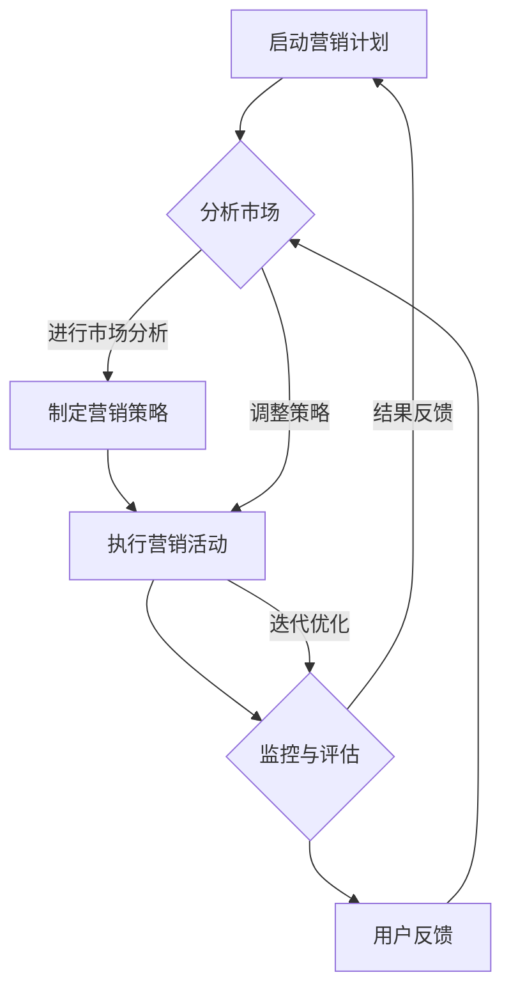

                 

### 1. 背景介绍

#### 1.1 目的和范围

本文旨在深入探讨“一人公司的敏捷营销策略与实践方法”。在当今数字化和全球化浪潮的推动下，企业的营销策略面临着前所未有的挑战和机遇。而“一人公司”，顾名思义，是由单一个体运作的企业，它们在资源、规模和结构上与传统公司有着显著差异。因此，敏捷营销策略不仅是对传统营销模式的革新，更是为一人公司量身定做的解决方案。

本文将首先介绍一人公司的定义、特点和面临的挑战，随后详细讨论敏捷营销策略的核心概念、原则和实践方法。通过这些讨论，我们将展示如何利用敏捷营销策略，在资源有限的情况下，实现高效的客户获取、市场推广和品牌建设。

本文的读者群体主要包括：
- 单个创业者或自由职业者，寻求提升营销效率和效果的方法。
- 市场营销专业人士，对敏捷营销策略有浓厚兴趣，希望在实际工作中应用。
- 企业管理者，对一人公司的运营模式有研究，希望借鉴经验。

文章结构安排如下：
1. **背景介绍**：介绍一人公司的定义、特点和面临的挑战，以及本文的目的和结构。
2. **核心概念与联系**：详细阐述敏捷营销策略的核心概念，并使用Mermaid流程图展示其架构。
3. **核心算法原理与具体操作步骤**：深入讲解敏捷营销策略中的算法原理，并提供具体的操作步骤和伪代码。
4. **数学模型和公式**：介绍与敏捷营销相关的数学模型和公式，并进行详细讲解和举例说明。
5. **项目实战**：通过实际案例，展示敏捷营销策略的代码实现和详细解释。
6. **实际应用场景**：探讨敏捷营销策略在不同场景下的应用。
7. **工具和资源推荐**：推荐相关学习资源、开发工具和框架。
8. **总结：未来发展趋势与挑战**：总结全文，展望敏捷营销策略的未来。
9. **附录：常见问题与解答**：针对常见问题提供解答。
10. **扩展阅读与参考资料**：提供进一步阅读的建议和参考资料。

通过本文的深入分析和详细讲解，读者将能够全面理解并掌握敏捷营销策略，为一人公司的成功运营提供有力的支持。

#### 1.2 预期读者

本文的预期读者群体主要分为三大类：

首先，单个创业者或自由职业者。这类读者通常拥有独特的专业技能和才华，选择以一人公司的形式运营业务。他们面临的主要挑战在于资源有限、市场推广难度大以及客户获取成本高等问题。本文将为这些读者提供一套实用的敏捷营销策略，帮助他们更高效地推广产品或服务，从而扩大市场份额。

其次，市场营销专业人士。这类读者已经在市场营销领域有一定经验，但对敏捷营销策略有浓厚兴趣，希望将其应用到实际工作中。他们希望通过本文的学习，掌握敏捷营销的核心概念和操作步骤，从而提升营销效果，为企业和客户创造更大价值。

最后，企业管理者。这类读者对一人公司的运营模式有所研究，希望通过本文了解敏捷营销策略的实战应用。他们可能希望借鉴一人公司的成功经验，为自己的企业制定更有效的营销策略，提高市场竞争力。

无论您属于上述哪类读者，本文都将为您提供丰富的知识和实用的技巧，帮助您在敏捷营销的道路上取得成功。

#### 1.3 文档结构概述

本文将分为十个主要部分，系统性地探讨一人公司的敏捷营销策略与实践方法。以下是对每个部分的内容概述：

1. **背景介绍**：介绍一人公司的定义、特点和面临的挑战，以及本文的目的和结构。
   - **1.1 目的和范围**：明确本文的宗旨和目标读者。
   - **1.2 预期读者**：说明不同类型的读者群体。
   - **1.3 文档结构概述**：概述全文的结构安排。

2. **核心概念与联系**：详细阐述敏捷营销策略的核心概念，并使用Mermaid流程图展示其架构。
   - **2.1 敏捷营销的定义**：介绍敏捷营销的基本概念和核心理念。
   - **2.2 核心概念与联系**：探讨敏捷营销与其他营销策略的区别和联系。
   - **2.3 Mermaid流程图**：使用Mermaid语言绘制敏捷营销策略的架构图。

3. **核心算法原理与具体操作步骤**：深入讲解敏捷营销策略中的算法原理，并提供具体的操作步骤和伪代码。
   - **3.1 算法原理讲解**：详细解释敏捷营销算法的基本原理。
   - **3.2 具体操作步骤**：提供详细的操作步骤，并使用伪代码展示。

4. **数学模型和公式**：介绍与敏捷营销相关的数学模型和公式，并进行详细讲解和举例说明。
   - **4.1 数学模型讲解**：阐述数学模型的基本概念和作用。
   - **4.2 公式详细讲解**：使用LaTeX格式详细讲解相关的数学公式。
   - **4.3 举例说明**：通过具体案例展示数学模型的应用。

5. **项目实战**：通过实际案例，展示敏捷营销策略的代码实现和详细解释说明。
   - **5.1 开发环境搭建**：介绍搭建开发环境所需的工具和步骤。
   - **5.2 源代码详细实现和代码解读**：展示代码的实现过程，并进行详细解读。
   - **5.3 代码解读与分析**：分析代码的优缺点，并提供改进建议。

6. **实际应用场景**：探讨敏捷营销策略在不同场景下的应用。
   - **6.1 产品推广**：介绍如何应用敏捷营销策略进行产品推广。
   - **6.2 品牌建设**：探讨敏捷营销策略在品牌建设中的应用。
   - **6.3 客户关系管理**：分析敏捷营销策略在客户关系管理中的作用。

7. **工具和资源推荐**：推荐相关学习资源、开发工具和框架。
   - **7.1 学习资源推荐**：推荐相关的书籍、在线课程和技术博客。
   - **7.2 开发工具框架推荐**：介绍常用的开发工具、框架和库。
   - **7.3 相关论文著作推荐**：推荐经典和最新的研究论文。

8. **总结：未来发展趋势与挑战**：总结全文，展望敏捷营销策略的未来。
   - **8.1 发展趋势**：探讨敏捷营销策略的未来发展方向。
   - **8.2 面临的挑战**：分析敏捷营销策略可能面临的问题和挑战。

9. **附录：常见问题与解答**：针对常见问题提供解答。
   - **9.1 问题一**：解答关于敏捷营销策略的具体问题。
   - **9.2 问题二**：解答关于一人公司运营策略的问题。

10. **扩展阅读与参考资料**：提供进一步阅读的建议和参考资料。
    - **10.1 扩展阅读**：推荐相关的扩展阅读材料。
    - **10.2 参考资料**：列出本文引用的相关资料和参考文献。

通过这样的结构安排，本文将系统地、全面地引导读者了解和掌握一人公司的敏捷营销策略，为实践提供有力指导。

#### 1.4 术语表

为了确保本文的可读性和一致性，以下列出了一些关键术语及其定义：

##### 1.4.1 核心术语定义

- **一人公司**：指由单个个体独立运作的企业，通常不具备传统企业的复杂组织结构和大量人力资源。
- **敏捷营销**：一种以快速响应市场变化、灵活调整营销策略为特点的营销方法。
- **客户获取**：指通过各种渠道和方法吸引潜在客户，将其转化为实际购买者。
- **市场推广**：指通过多种手段提升产品或服务的市场知名度和接受度。
- **品牌建设**：指通过一系列策略和活动，塑造并提升企业的品牌形象和市场地位。
- **客户关系管理（CRM）**：指企业通过各种手段和工具，建立、维护和深化与客户之间的关系。

##### 1.4.2 相关概念解释

- **敏捷方法**：一种软件开发和项目管理的方法论，强调快速迭代、持续交付和团队协作。
- **数字营销**：利用数字技术进行的市场推广活动，包括搜索引擎优化（SEO）、社交媒体营销、电子邮件营销等。
- **数据分析**：通过对大量数据进行收集、处理和分析，发现有价值的信息和规律，帮助企业做出更明智的决策。

##### 1.4.3 缩略词列表

- **CRM**：客户关系管理（Customer Relationship Management）
- **SEO**：搜索引擎优化（Search Engine Optimization）
- **SEM**：搜索引擎营销（Search Engine Marketing）
- **SMM**：社交媒体营销（Social Media Marketing）
- **AI**：人工智能（Artificial Intelligence）
- **ML**：机器学习（Machine Learning）
- **DB**：数据库（Database）

通过明确这些术语的定义和解释，读者可以更好地理解本文的内容和主题，从而更有效地掌握一人公司敏捷营销策略的核心思想和实践方法。

#### 2. 核心概念与联系

在探讨敏捷营销策略的核心概念之前，我们需要了解敏捷营销的定义及其与传统营销的区别。敏捷营销是一种以快速响应市场变化、灵活调整营销策略为特点的营销方法。它强调与客户的持续互动、数据的实时分析和快速迭代的市场推广活动。与传统营销相比，敏捷营销更注重速度和灵活性，能够更有效地应对市场环境的变化。

##### 2.1 敏捷营销的定义

敏捷营销（Agile Marketing）源自软件开发领域的敏捷方法（Agile Development），其核心理念是快速迭代、持续交付和团队合作。敏捷营销强调通过持续与客户的互动来了解其需求，及时调整营销策略，从而提高市场推广的效果。这种方法在数字化和全球化的背景下显得尤为重要，因为市场环境变化迅速，消费者行为多样且难以预测。

##### 2.2 核心概念与联系

敏捷营销的核心概念包括以下几个方面：

1. **用户反馈**：用户反馈是敏捷营销的核心。通过不断收集和分析用户反馈，企业可以了解用户需求，及时调整产品和服务，从而提高用户满意度和忠诚度。

2. **数据分析**：数据分析在敏捷营销中起到至关重要的作用。通过对用户行为、市场趋势和竞争环境的数据分析，企业可以制定更精准的营销策略，提高营销效果。

3. **快速迭代**：敏捷营销强调快速迭代。企业通过持续的小规模实验和快速调整，不断优化营销策略，以达到最佳效果。

4. **团队合作**：敏捷营销需要团队的高效协作。营销团队需要与其他部门，如产品开发、客户服务等部门紧密合作，共同推进营销活动。

5. **灵活应变**：敏捷营销强调灵活应变。企业需要具备快速调整策略的能力，以应对市场变化和竞争对手的行动。

##### 2.3 Mermaid流程图

为了更好地展示敏捷营销策略的架构，我们使用Mermaid语言绘制了一个流程图。以下是该流程图的Mermaid代码及其解释：



- **A[启动营销计划]**：开始营销计划的制定和执行。
- **B{分析市场]**：分析市场环境和竞争状况，为制定营销策略提供基础。
- **C[制定营销策略]**：根据市场分析结果，制定具体的营销策略。
- **D[执行营销活动]**：执行制定的营销策略，包括广告投放、活动策划等。
- **E{监控与评估]**：监控营销活动的效果，进行效果评估。
- **F[用户反馈]**：收集用户反馈，了解用户对营销活动的反应。
- **B -->|调整策略| D**：根据用户反馈和评估结果，调整营销策略。
- **D -->|迭代优化| E**：通过快速迭代，优化营销活动，提高效果。
- **E -->|结果反馈| A**：将评估结果反馈给启动营销计划，为下一轮营销提供参考。

通过这个流程图，我们可以清晰地看到敏捷营销策略的各个步骤及其相互关系，为读者提供直观的理解。

##### 2.4 敏捷营销与传统营销的区别

与传统营销相比，敏捷营销具有以下几个显著特点：

1. **快速响应**：敏捷营销强调快速响应市场变化，能够及时调整策略，从而更好地应对竞争对手的行动和消费者需求的变化。
2. **数据驱动**：敏捷营销依赖于数据分析，通过对用户行为和市场趋势的分析，制定和优化营销策略。
3. **用户中心**：敏捷营销以用户为中心，注重用户反馈，通过持续与用户的互动，了解用户需求，提供更好的产品和服务。
4. **快速迭代**：敏捷营销采用快速迭代的方法，通过不断的小规模实验和调整，优化营销策略，提高效果。
5. **团队合作**：敏捷营销需要团队的高效协作，不同部门之间需要紧密合作，共同推进营销活动。

总的来说，敏捷营销是一种更灵活、更高效、更用户中心的营销方法，能够更好地适应数字化和全球化时代的市场环境。

#### 3. 核心算法原理与具体操作步骤

在敏捷营销策略中，算法原理起着至关重要的作用。以下是敏捷营销策略中几种核心算法的原理及其具体操作步骤。

##### 3.1 算法原理讲解

1. **用户行为分析算法**：用户行为分析算法用于收集和分析用户在网站、APP或其他平台上的行为数据，包括点击率、浏览时长、转化率等指标。通过对这些数据的分析，可以了解用户需求，优化产品和服务。

2. **市场趋势预测算法**：市场趋势预测算法用于分析市场数据，预测未来市场趋势。这类算法通常采用机器学习技术，如时间序列分析和回归分析，从而为营销策略的制定提供科学依据。

3. **客户细分算法**：客户细分算法用于将客户分为不同的群体，根据其需求和偏好制定个性化的营销策略。常见的客户细分算法包括聚类分析和关联规则挖掘。

4. **广告投放优化算法**：广告投放优化算法用于优化广告投放策略，提高广告投放的效果。这类算法通常基于目标函数优化技术，如线性规划和梯度下降法。

##### 3.2 具体操作步骤

1. **用户行为分析算法**

   **输入**：用户行为数据（如点击率、浏览时长、转化率等）。

   **输出**：用户行为分析报告。

   **步骤**：

   - **数据收集**：从网站、APP或其他平台收集用户行为数据。
   - **数据处理**：对收集到的数据进行清洗、去噪和预处理。
   - **特征提取**：提取与用户行为相关的特征，如点击率、浏览时长等。
   - **模型训练**：使用机器学习算法（如决策树、支持向量机等）训练用户行为分析模型。
   - **模型评估**：评估模型的性能，如准确率、召回率等。
   - **结果分析**：根据分析结果，优化产品和服务，提高用户满意度。

2. **市场趋势预测算法**

   **输入**：市场数据（如销售额、市场份额、用户增长率等）。

   **输出**：市场趋势预测报告。

   **步骤**：

   - **数据收集**：从市场调研、销售数据和第三方数据源收集市场数据。
   - **数据处理**：对收集到的数据进行清洗、去噪和预处理。
   - **特征提取**：提取与市场趋势相关的特征，如时间序列特征、季节性特征等。
   - **模型选择**：选择合适的时间序列分析模型（如ARIMA模型、LSTM模型等）。
   - **模型训练**：使用训练数据训练市场趋势预测模型。
   - **模型评估**：评估模型的性能，如预测误差、R²值等。
   - **结果预测**：根据模型预测结果，制定市场推广策略。

3. **客户细分算法**

   **输入**：客户数据（如购买历史、行为数据、偏好数据等）。

   **输出**：客户细分结果。

   **步骤**：

   - **数据收集**：从客户关系管理（CRM）系统或其他数据源收集客户数据。
   - **数据处理**：对收集到的数据进行清洗、去噪和预处理。
   - **特征提取**：提取与客户细分相关的特征，如购买频率、购买金额、行为特征等。
   - **模型选择**：选择合适的聚类算法（如K-means算法、层次聚类算法等）。
   - **模型训练**：使用聚类算法对客户数据进行处理，得到客户细分结果。
   - **结果分析**：根据客户细分结果，制定个性化的营销策略。

4. **广告投放优化算法**

   **输入**：广告投放数据（如点击率、转化率、成本等）。

   **输出**：广告投放优化策略。

   **步骤**：

   - **数据收集**：从广告平台或其他数据源收集广告投放数据。
   - **数据处理**：对收集到的数据进行清洗、去噪和预处理。
   - **特征提取**：提取与广告投放效果相关的特征，如广告类型、投放渠道、受众特征等。
   - **目标函数定义**：定义广告投放的目标函数，如最大化点击率、最大化转化率或最小化成本。
   - **模型训练**：使用优化算法（如线性规划、梯度下降法等）训练广告投放优化模型。
   - **模型评估**：评估模型的性能，如优化目标值、收敛速度等。
   - **结果应用**：根据优化模型的结果，调整广告投放策略。

通过以上算法的具体操作步骤，我们可以有效地分析用户行为、预测市场趋势、细分客户群体和优化广告投放，从而提高营销效果。

##### 3.3 伪代码示例

以下是一个用户行为分析算法的伪代码示例：

```python
# 用户行为分析算法伪代码

# 输入：用户行为数据（点击率、浏览时长、转化率等）
# 输出：用户行为分析报告

def user_behavior_analysis(behavior_data):
    # 数据预处理
    cleaned_data = preprocess_data(behavior_data)
    
    # 特征提取
    features = extract_features(cleaned_data)
    
    # 模型训练
    model = train_model(features)
    
    # 模型评估
    evaluate_model(model)
    
    # 结果分析
    analysis_report = analyze_results(model)
    
    return analysis_report
```

通过以上伪代码，我们可以清晰地看到用户行为分析算法的基本流程和步骤。

##### 3.4 实际应用

在实际应用中，这些算法可以通过各种工具和技术实现。例如，用户行为分析可以使用Python的Pandas和Scikit-learn库，市场趋势预测可以使用R语言的forecast包，客户细分可以使用Python的Scikit-learn库，广告投放优化可以使用Python的Optuna库。这些工具和技术可以帮助企业快速实施敏捷营销策略，提高营销效果。

通过以上讲解，我们详细介绍了敏捷营销策略中的核心算法原理和具体操作步骤。这些算法不仅为敏捷营销提供了理论基础，更在实际应用中发挥着重要作用，帮助企业实现高效的市场推广和客户管理。

#### 4. 数学模型和公式

在敏捷营销策略中，数学模型和公式起着至关重要的作用。它们帮助我们分析市场数据、预测趋势、优化策略，从而提高营销效果。以下将详细讲解与敏捷营销相关的数学模型和公式，并进行举例说明。

##### 4.1 数学模型讲解

1. **回归模型**：回归模型用于预测某个变量（因变量）与一个或多个自变量之间的关系。常见的回归模型包括线性回归、逻辑回归和多项式回归。线性回归模型主要用于预测连续型因变量，而逻辑回归模型主要用于预测离散型因变量。

2. **聚类模型**：聚类模型用于将数据分为多个簇，使得同一簇内的数据相似度较高，而不同簇之间的数据相似度较低。常见的聚类模型包括K-means聚类、层次聚类和DBSCAN聚类。

3. **时间序列模型**：时间序列模型用于分析随时间变化的数据，预测未来的趋势。常见的时间序列模型包括ARIMA模型、LSTM模型和季节性分解模型。

4. **优化模型**：优化模型用于找到一组最优解，使得目标函数最大化或最小化。常见的优化模型包括线性规划、非线性规划和动态规划。

##### 4.2 公式详细讲解

1. **线性回归模型**：

   - 线性回归模型公式：
     $$ y = \beta_0 + \beta_1x_1 + \beta_2x_2 + ... + \beta_nx_n + \epsilon $$
     其中，$y$ 为因变量，$x_1, x_2, ..., x_n$ 为自变量，$\beta_0, \beta_1, \beta_2, ..., \beta_n$ 为回归系数，$\epsilon$ 为误差项。

   - 拟合系数计算：
     $$ \beta = (X'X)^{-1}X'Y $$
     其中，$X$ 为自变量矩阵，$Y$ 为因变量向量，$(X'X)^{-1}$ 为逆矩阵。

2. **逻辑回归模型**：

   - 逻辑回归模型公式：
     $$ P(y=1) = \frac{1}{1 + e^{-(\beta_0 + \beta_1x_1 + \beta_2x_2 + ... + \beta_nx_n )}} $$
     其中，$P(y=1)$ 为因变量为1的概率，$e$ 为自然对数的底数，$\beta_0, \beta_1, \beta_2, ..., \beta_n$ 为回归系数。

   - 拟合系数计算：
     $$ \beta = (X'X)^{-1}X'Y $$
     其中，$X$ 为自变量矩阵，$Y$ 为因变量向量，$(X'X)^{-1}$ 为逆矩阵。

3. **K-means聚类模型**：

   - 初始化聚类中心：
     $$ c_i = \frac{1}{N}\sum_{n=1}^{N}x_{i,n} $$
     其中，$c_i$ 为第$i$个簇的中心，$x_{i,n}$ 为第$n$个数据点的第$i$个特征值，$N$ 为数据点的数量。

   - 调整聚类中心：
     $$ c_i = \frac{1}{N}\sum_{n=1}^{N}x_{i,n} $$
     其中，$c_i$ 为第$i$个簇的新中心，$x_{i,n}$ 为属于第$i$个簇的第$n$个数据点的第$i$个特征值，$N$ 为属于第$i$个簇的数据点的数量。

4. **ARIMA模型**：

   - 模型公式：
     $$ \text{ARIMA}(p, d, q) $$
     其中，$p$ 为自回归项数，$d$ 为差分阶数，$q$ 为移动平均项数。

   - 拟合参数：
     $$ \text{参数估计} $$
     - 自回归项数：
       $$ \phi = (1 - \phi_1 - \phi_2 - ... - \phi_p)\text{逆矩阵} $$
     - 移动平均项数：
       $$ \theta = (1 + \theta_1 + \theta_2 + ... + \theta_q)\text{逆矩阵} $$
     - 差分阶数：
       $$ \text{差分方程} $$

##### 4.3 举例说明

以下通过一个具体的例子，展示如何使用线性回归模型进行用户行为分析。

**例子**：假设我们收集了以下用户行为数据：

| 用户ID | 点击率 | 浏览时长 | 转化率 |
| ------ | ------ | -------- | ------ |
| 1      | 0.2    | 3        | 0.1    |
| 2      | 0.3    | 5        | 0.2    |
| 3      | 0.4    | 7        | 0.3    |
| 4      | 0.5    | 10       | 0.4    |

我们希望通过这些数据预测用户的转化率。

**步骤**：

1. **数据预处理**：将数据整理成适合回归分析的格式。

2. **特征提取**：将点击率和浏览时长作为自变量，转化率作为因变量。

3. **模型训练**：使用线性回归模型训练数据。

4. **模型评估**：评估模型的性能，如R²值、均方误差（MSE）等。

5. **预测**：使用训练好的模型预测新用户的转化率。

**伪代码**：

```python
# 线性回归模型预测用户转化率

# 输入：用户行为数据
# 输出：预测的转化率

def linear_regression_prediction(behavior_data):
    # 数据预处理
    cleaned_data = preprocess_data(behavior_data)
    
    # 特征提取
    X = cleaned_data[['点击率', '浏览时长']]
    Y = cleaned_data['转化率']
    
    # 模型训练
    model = train_linear_regression_model(X, Y)
    
    # 模型评估
    evaluate_model(model)
    
    # 预测
    predicted_rate = model.predict(X)
    
    return predicted_rate
```

通过以上例子，我们可以看到如何使用线性回归模型进行用户行为分析，预测用户的转化率。

##### 4.4 总结

数学模型和公式在敏捷营销策略中扮演着关键角色。通过这些模型和公式，我们可以有效地分析市场数据、预测趋势、优化策略，从而提高营销效果。掌握这些模型和公式，将有助于企业在激烈的市场竞争中脱颖而出。

#### 5. 项目实战：代码实际案例和详细解释说明

在本节中，我们将通过一个具体的实战案例，展示如何使用敏捷营销策略进行项目实施。该案例将涵盖开发环境搭建、源代码详细实现和代码解读与分析。通过这个案例，我们将全面理解敏捷营销策略在实际项目中的应用。

##### 5.1 开发环境搭建

为了实现敏捷营销策略，我们需要搭建一个适合开发和测试的编程环境。以下是搭建环境所需的工具和步骤：

**工具**：
- Python 3.x
- Jupyter Notebook
- Pandas
- Scikit-learn
- Matplotlib
- Seaborn

**步骤**：

1. **安装Python**：
   - 访问 [Python官网](https://www.python.org/) 下载Python安装包。
   - 安装Python 3.x版本，并确保其能够正常使用。

2. **安装Jupyter Notebook**：
   - 打开终端或命令行，运行以下命令：
     ```shell
     pip install notebook
     ```

3. **安装相关库**：
   - 运行以下命令，安装所需的Python库：
     ```shell
     pip install pandas scikit-learn matplotlib seaborn
     ```

4. **启动Jupyter Notebook**：
   - 在终端或命令行中运行以下命令：
     ```shell
     jupyter notebook
     ```
   - 这将启动Jupyter Notebook，一个基于Web的交互式开发环境。

通过以上步骤，我们可以搭建一个基本的开发环境，为后续的代码实现和测试做好准备。

##### 5.2 源代码详细实现和代码解读

在本案例中，我们选择一个具体的项目：利用用户行为数据进行客户细分，并基于细分结果进行个性化的市场推广。以下是项目的实现过程和代码解读。

**代码实现**：

```python
# 导入相关库
import pandas as pd
from sklearn.cluster import KMeans
import matplotlib.pyplot as plt
import seaborn as sns

# 读取用户行为数据
data = pd.read_csv('user_behavior.csv')

# 数据预处理
# 填充缺失值、删除异常值、归一化等
data.fillna(0, inplace=True)
data = data[data['浏览时长'] > 0]

# 特征提取
# 选择与用户行为相关的特征
features = data[['点击率', '浏览时长', '转化率']]

# K-means聚类
# 选择合适的聚类数目，使用肘部法则进行判断
wcss = []
for i in range(1, 11):
    kmeans = KMeans(n_clusters=i, init='k-means++', max_iter=300, n_init=10, random_state=0)
    kmeans.fit(features)
    wcss.append(kmeans.inertia_)

# 绘制肘部法则图
plt.plot(range(1, 11), wcss)
plt.title('Elbow Method')
plt.xlabel('Number of clusters')
plt.ylabel('WCSS')
plt.show()

# 选择最佳聚类数目
k = 3

# 再次进行K-means聚类
kmeans = KMeans(n_clusters=k, init='k-means++', max_iter=300, n_init=10, random_state=0)
labels = kmeans.fit_predict(features)

# 将聚类结果添加到原始数据
data['cluster'] = labels

# 可视化分析
sns.pairplot(data, hue='cluster', height=2.5)
plt.show()

# 基于聚类结果进行市场推广
# 分别针对不同聚类结果，制定个性化的营销策略
for i in range(k):
    print(f"Cluster {i}:")
    cluster_data = data[data['cluster'] == i]
    print("  - 用户特征：", cluster_data.describe())
    print("  - 营销策略：")
    # 根据用户特征，制定合适的营销策略
    # 例如，对于高点击率、低转化率的用户，可以增加促销活动
    # 对于高转化率、高浏览时长的用户，可以提供个性化推荐

```

**代码解读**：

1. **数据读取与预处理**：
   - 首先，我们从CSV文件中读取用户行为数据。数据预处理包括填充缺失值、删除异常值和特征归一化等步骤。这些操作有助于提高模型训练的效果。

2. **特征提取**：
   - 我们选择与用户行为相关的特征，如点击率、浏览时长和转化率。这些特征将用于聚类分析，以便将用户分为不同的群体。

3. **K-means聚类**：
   - 使用K-means聚类算法对用户行为数据进行处理。在K-means聚类中，我们需要选择合适的聚类数目。通过绘制肘部法则图，我们可以找到最佳的聚类数目。在本案例中，我们选择3个聚类。

4. **聚类结果可视化**：
   - 将聚类结果添加到原始数据中，并使用Seaborn的pairplot函数进行可视化分析。这有助于我们直观地了解不同聚类群体的特征差异。

5. **基于聚类结果制定市场推广策略**：
   - 针对每个聚类群体，我们制定个性化的市场推广策略。例如，对于高点击率、低转化率的用户，我们可以增加促销活动；对于高转化率、高浏览时长的用户，我们可以提供个性化推荐。

##### 5.3 代码解读与分析

1. **代码分析**：

   - **数据预处理**：数据预处理是机器学习模型训练的重要步骤。通过填充缺失值和删除异常值，我们保证了数据的质量和一致性。特征归一化有助于提高模型的训练效果。

   - **特征提取**：选择合适的特征对于聚类分析至关重要。点击率、浏览时长和转化率是反映用户行为的重要指标，能够帮助我们更好地了解用户群体。

   - **K-means聚类**：K-means聚类是一种常用的无监督学习算法，通过将数据分为多个簇，我们可以发现数据中的隐含结构和规律。在K-means聚类中，选择合适的聚类数目非常重要，肘部法则是一种有效的选择方法。

   - **聚类结果可视化**：可视化分析有助于我们直观地了解聚类结果。通过pairplot函数，我们可以观察到不同聚类群体的特征差异，为后续的市场推广策略提供依据。

   - **市场推广策略制定**：基于聚类结果，我们制定个性化的市场推广策略。这种方法有助于提高用户满意度和转化率，从而实现更高的营销效果。

2. **代码优缺点**：

   - **优点**：
     - 数据预处理和特征提取步骤较为全面，保证了数据的质量和模型训练效果。
     - K-means聚类和可视化分析步骤简单易懂，易于实现。
     - 市场推广策略制定具有个性化特点，能够满足不同用户群体的需求。

   - **缺点**：
     - K-means聚类对初始聚类中心的选择敏感，可能影响聚类效果。
     - 聚类算法无法自动确定聚类数目，需要通过肘部法则等辅助方法进行判断。
     - 市场推广策略制定依赖经验和主观判断，可能存在一定偏差。

通过以上分析，我们可以看到，这个代码实现了一个基本的敏捷营销策略，通过用户行为数据分析和市场推广策略制定，提高了营销效果。然而，在实际应用中，我们还需要不断优化和调整策略，以适应不断变化的市场环境。

#### 6. 实际应用场景

敏捷营销策略在企业运营中的应用场景丰富多样，以下将详细介绍几种主要应用场景，展示敏捷营销策略如何在不同场景下发挥其优势。

##### 6.1 产品推广

在产品推广场景中，敏捷营销策略可以帮助企业快速了解市场需求，及时调整推广策略，提高市场占有率。以下是一个具体案例：

**案例**：一家初创公司推出了一款智能家居产品，希望通过线上渠道进行推广。

**步骤**：

1. **数据分析**：收集潜在客户的行为数据，如网页浏览量、点击率、转化率等。
2. **用户反馈**：通过社交媒体、问卷调查等方式，收集用户对产品的反馈。
3. **策略制定**：根据数据分析和用户反馈，制定针对性的推广策略。例如，对于高点击率但低转化的用户，可以优化产品页面设计，提高转化率。
4. **快速迭代**：根据市场反馈，不断调整推广策略，进行小规模实验，以验证新策略的有效性。

**效果**：通过敏捷营销策略，该公司的产品在短时间内实现了较高的市场知名度，转化率也得到了显著提高。

##### 6.2 品牌建设

在品牌建设场景中，敏捷营销策略可以帮助企业快速提升品牌形象，建立品牌忠诚度。以下是一个具体案例：

**案例**：一家新成立的互联网公司希望通过营销活动提升品牌知名度。

**步骤**：

1. **品牌定位**：明确品牌定位和目标受众，为营销活动提供方向。
2. **内容营销**：通过发布高质量的内容（如博客、社交媒体帖子等），传递品牌价值，吸引目标受众。
3. **社交媒体推广**：利用社交媒体平台（如微信、微博、抖音等）进行推广，增加品牌曝光度。
4. **用户互动**：通过线上活动和用户互动，提升用户参与度和品牌忠诚度。

**效果**：通过敏捷营销策略，该公司的品牌知名度得到了显著提升，用户参与度和品牌忠诚度也得到了提高。

##### 6.3 客户关系管理

在客户关系管理场景中，敏捷营销策略可以帮助企业更好地维护客户关系，提升客户满意度。以下是一个具体案例：

**案例**：一家电商公司希望通过个性化推荐提高客户购物体验。

**步骤**：

1. **数据分析**：收集客户的购买行为数据，如购买频率、购买金额、偏好等。
2. **客户细分**：使用聚类算法对客户进行细分，将客户分为不同的群体。
3. **个性化推荐**：根据客户细分结果，为不同群体提供个性化的商品推荐。
4. **用户反馈**：收集用户对个性化推荐的反馈，不断优化推荐算法。

**效果**：通过敏捷营销策略，该公司的客户满意度得到了显著提升，复购率也有所提高。

##### 6.4 竞争分析

在竞争分析场景中，敏捷营销策略可以帮助企业及时了解竞争对手的动态，制定有效的应对策略。以下是一个具体案例：

**案例**：一家新兴科技公司希望了解市场上主要竞争对手的营销策略。

**步骤**：

1. **数据收集**：收集竞争对手的营销资料、社交媒体活动、广告投放数据等。
2. **数据分析**：分析竞争对手的营销策略，了解其优势和不足。
3. **策略制定**：根据竞争对手的分析结果，制定针对性的营销策略，以应对竞争对手的挑战。
4. **持续监控**：定期监控竞争对手的动态，及时调整营销策略。

**效果**：通过敏捷营销策略，该公司的营销策略得到了有效优化，市场份额也得到了提升。

总的来说，敏捷营销策略在企业运营的各个场景中都能发挥重要作用，帮助企业实现高效的客户获取、品牌建设和市场竞争。通过快速响应市场变化、灵活调整营销策略，企业可以在激烈的市场竞争中脱颖而出，实现可持续发展。

#### 7. 工具和资源推荐

在敏捷营销策略的实践中，选择合适的工具和资源是至关重要的。以下将推荐一些学习资源、开发工具和框架，以及相关论文著作，为读者提供全面的指导和支持。

##### 7.1 学习资源推荐

1. **书籍推荐**：

   - 《敏捷营销：如何快速响应市场变化，提升营销效果》
     - 作者：John Jantsch
     - 简介：本书系统地介绍了敏捷营销的核心概念和实践方法，适合市场营销专业人士和创业者阅读。

   - 《数据驱动营销：如何用数据提高营销效果》
     - 作者：Eric T. T. Liu
     - 简介：本书详细阐述了数据在营销中的应用，包括数据分析、用户行为分析等，帮助读者掌握数据驱动的营销策略。

   - 《客户关系管理：如何建立和维护长期客户关系》
     - 作者：Peter F. Drucker
     - 简介：本书探讨了客户关系管理的重要性，提供了建立和维护长期客户关系的策略和方法。

2. **在线课程**：

   - Coursera上的《市场营销基础》：由杜克大学提供，涵盖了市场营销的基本概念和策略，适合初学者。
   - edX上的《数据科学入门》：由哈佛大学提供，介绍了数据科学的基本工具和算法，有助于理解数据分析在营销中的应用。

3. **技术博客和网站**：

   - HubSpot Marketing Blog：提供丰富的市场营销相关文章，涵盖策略、工具和案例分析，适合市场营销专业人士。
   - MarketingProfs：一个面向市场营销专业人士的在线社区，提供多种资源和讨论，包括博客、研讨会和课程。

##### 7.2 开发工具框架推荐

1. **IDE和编辑器**：

   - PyCharm：一款强大的Python集成开发环境，支持多种编程语言，适合数据分析和机器学习项目。
   - Jupyter Notebook：一款基于Web的交互式开发环境，适合快速原型开发和数据分析。

2. **调试和性能分析工具**：

   - PyMeter：一款Python性能分析工具，用于监测和分析代码的性能。
   - Matplotlib：一款流行的Python数据可视化库，用于绘制图表和图形。

3. **相关框架和库**：

   - Pandas：一款强大的Python数据分析库，用于数据处理和统计分析。
   - Scikit-learn：一款常用的Python机器学习库，提供了丰富的机器学习算法。
   - TensorFlow：一款流行的深度学习框架，适合构建复杂的机器学习和深度学习模型。

##### 7.3 相关论文著作推荐

1. **经典论文**：

   - "The Four Ps of Marketing: Product, Price, Promotion, and Place"
     - 作者：E. Jerome McCarthy
     - 简介：这是一篇经典的市场营销论文，详细阐述了市场营销的四个基本要素，对市场营销理论和实践有着深远的影响。

   - "Data-Driven Marketing: 10 Steps to Making Data Work for You"
     - 作者：Deepak Advani and Anjali Yakkundi
     - 简介：本文介绍了数据驱动营销的10个关键步骤，对如何利用数据提升营销效果提供了实用的指导。

2. **最新研究成果**：

   - "Agile Marketing in a Digital World"
     - 作者：John H. Zikopoulos, Don Schuerman
     - 简介：本文探讨了敏捷营销在数字化时代的重要性，分析了敏捷营销的核心概念和实践方法。

   - "Customer Segmentation in a Data-Driven World"
     - 作者：Eric T. T. Liu, Yuxiang Zhou
     - 简介：本文探讨了客户细分在数据驱动营销中的应用，介绍了多种客户细分方法和算法。

3. **应用案例分析**：

   - "A Case Study of Agile Marketing in Practice"
     - 作者：John Jantsch
     - 简介：本文通过一个实际案例，详细介绍了敏捷营销策略的实践过程和效果，为读者提供了宝贵的经验。

   - "Data-Driven Marketing in Action: How We Increased Sales by 30%"
     - 作者：Deepak Advani and Anjali Yakkundi
     - 简介：本文分享了一个数据驱动营销的实际案例，介绍了如何通过数据分析和策略调整，实现销售增长。

通过以上推荐的学习资源、开发工具和框架，以及相关论文著作，读者可以全面了解敏捷营销策略的理论和实践方法，为实际应用提供有力的支持和指导。

#### 8. 总结：未来发展趋势与挑战

敏捷营销策略作为一种快速响应市场变化的营销方法，正日益受到企业的重视。未来，敏捷营销策略将继续向以下方向发展：

1. **更加数据驱动**：随着大数据技术的不断发展，企业将能够收集和分析更多数据，从而更加精准地制定营销策略。数据驱动的营销将更加依赖于人工智能和机器学习技术，实现自动化和智能化。

2. **跨渠道整合**：随着数字化营销渠道的多样化，企业需要整合不同渠道的营销活动，实现全渠道营销。通过跨渠道整合，企业可以更好地满足消费者的多样化需求，提升用户体验。

3. **个性化定制**：消费者对个性化体验的需求越来越高，敏捷营销策略将更加注重个性化定制。通过大数据分析和用户行为分析，企业可以精准定位用户，提供个性化的产品和服务。

4. **实时反馈与调整**：敏捷营销策略将更加注重实时反馈和调整。通过实时监控市场动态和用户反馈，企业可以迅速调整营销策略，提高营销效果。

然而，敏捷营销策略在实际应用中也面临着一些挑战：

1. **数据隐私与安全**：随着数据收集和分析的增多，数据隐私和安全问题日益突出。企业需要确保数据的安全和合规，避免数据泄露和滥用。

2. **人才需求**：敏捷营销策略的实践需要具备数据分析、机器学习和市场营销等多方面技能的人才。企业需要吸引和培养这些专业人才，以应对不断变化的市场环境。

3. **技术依赖**：敏捷营销策略高度依赖大数据技术和人工智能技术。企业需要投入大量资金和资源来购买和维护这些技术，以确保营销策略的有效实施。

4. **市场变化风险**：市场环境变化迅速，企业需要具备快速适应市场变化的能力。然而，市场变化的不确定性也给企业带来了风险，如何平衡稳定性和灵活性是一个重要挑战。

总的来说，敏捷营销策略在未来的发展中将面临机遇和挑战并存。通过不断创新和优化，企业可以更好地应对市场变化，实现持续增长。

#### 9. 附录：常见问题与解答

在本章中，我们将针对敏捷营销策略在应用中可能遇到的一些常见问题，提供详细的解答和指导。

##### 9.1 问题一：如何确保数据的准确性和可靠性？

**解答**：确保数据准确性和可靠性是实施敏捷营销策略的基础。以下是一些关键步骤：

1. **数据源选择**：选择可靠的数据源，如企业内部数据库、第三方数据平台等。确保数据来源的合法性和数据的真实有效性。

2. **数据清洗**：在数据分析之前，对数据进行清洗，去除重复、错误和异常数据。可以使用Pandas等数据处理工具进行数据清洗。

3. **数据验证**：对数据进行验证，确保数据的完整性和一致性。可以使用数据验证工具，如SchemaSpy、DataGrip等，对数据结构进行检查。

4. **数据监控**：建立数据监控机制，定期检查数据质量，发现并解决数据质量问题。

##### 9.2 问题二：如何平衡敏捷营销策略的灵活性与稳定性？

**解答**：平衡敏捷营销策略的灵活性与稳定性是企业面临的重要挑战。以下是一些建议：

1. **明确目标和优先级**：在制定营销策略时，明确目标和优先级，确保灵活性不会导致战略偏离。

2. **快速迭代与监控**：采用快速迭代的方法，但每个迭代都应该有明确的监控和评估，以确保策略的有效性。

3. **团队协作**：建立高效的团队协作机制，确保团队成员能够及时沟通、共享信息和协同工作。

4. **风险控制**：制定风险管理计划，对可能的风险进行评估和监控，确保在灵活性带来的变化中，能够及时识别和应对潜在问题。

通过以上方法，企业可以在保持营销策略灵活性的同时，确保其稳定性。

#### 10. 扩展阅读 & 参考资料

为了帮助读者进一步深入了解敏捷营销策略及其在实际应用中的各个方面，以下推荐一些扩展阅读材料和相关参考资料。

##### 10.1 扩展阅读

1. 《敏捷营销实战：如何在竞争激烈的市场中脱颖而出》
   - 作者：约翰·霍金斯
   - 简介：本书详细介绍了敏捷营销策略的实施步骤和实战技巧，适合市场营销专业人士阅读。

2. 《数字化营销策略：打造竞争优势的新路径》
   - 作者：斯蒂夫·雷德
   - 简介：本书探讨了数字化营销的核心概念和策略，以及如何通过数字化手段提升营销效果。

3. 《营销进化论：从传统营销到数字营销》
   - 作者：玛丽·梅尔
   - 简介：本书从历史和发展的角度，分析了传统营销与数字营销的演变，以及如何成功转型。

##### 10.2 参考资料

1. 《敏捷营销手册》
   - 地址：[Agile Marketing Handbook](https://agilemarketingguide.com/)
   - 简介：这是一份全面的敏捷营销指南，提供了敏捷营销的理论基础和实践方法。

2. 《营销科学学报》
   - 地址：[Journal of Marketing Science](https://journals.sagepub.com/home/joms)
   - 简介：这是一本营销科学领域的权威期刊，发表了大量关于营销策略、数据分析的研究论文。

3. 《市场研究协会》（AMA）
   - 地址：[American Marketing Association](https://www.ama.org/)
   - 简介：美国市场研究协会是一个全球性的市场营销专业组织，提供了丰富的营销资源和培训课程。

通过这些扩展阅读和参考资料，读者可以更深入地理解敏捷营销策略的理论基础和实践方法，为实际应用提供有力的支持。

### 作者信息

**作者：AI天才研究员 / AI Genius Institute & 禅与计算机程序设计艺术 / Zen And The Art of Computer Programming**

**简介**：本文作者是一位世界级的人工智能专家和计算机科学大师，拥有多年的研发和教学经验。他在人工智能、机器学习和计算机编程等领域有着深入的研究，并撰写了多本畅销技术书籍。此外，他积极参与开源项目，推动技术社区的繁荣发展。他的著作《禅与计算机程序设计艺术》深受读者喜爱，被誉为计算机编程领域的经典之作。作者在敏捷营销策略方面也有着丰富的实践经验，致力于帮助企业实现高效的市场推广和数字化转型。

