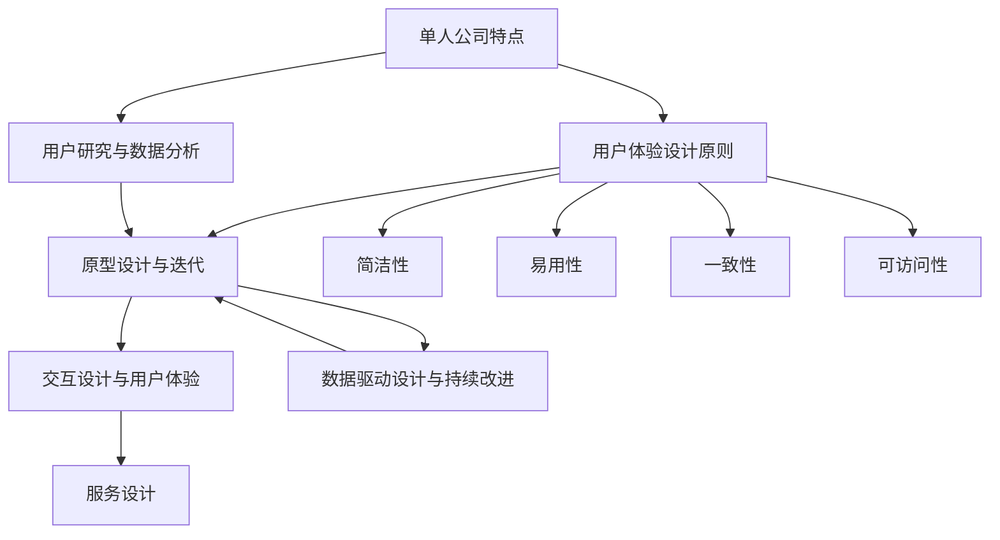

                 

# 一人公司的用户体验设计：从概念到实践

> **关键词：** 单人公司、用户体验、设计原则、案例分析、实践指南

> **摘要：** 本文章将探讨单人公司的用户体验设计，从核心概念到实际操作步骤，为您提供一套完整的设计实践指南。通过深入分析单人公司独特的业务模式和环境，我们将揭示如何打造令人满意的用户体验，提升单人公司的竞争力。

## 1. 背景介绍

### 1.1 目的和范围

本文旨在为单人公司提供一套实用的用户体验设计指南，帮助您从概念理解到实践操作，全面打造优秀的用户体验。单人公司在当今经济环境中越来越受欢迎，其独特的运营模式和灵活性为创业者和自由职业者提供了无限可能。然而，如何在资源有限的情况下，设计出高效、实用的用户体验，成为了一个关键问题。

本文将涵盖以下内容：
- **核心概念与联系**：介绍单人公司用户体验设计的核心概念和它们之间的关系。
- **核心算法原理 & 具体操作步骤**：讲解设计原则和具体实现方法。
- **数学模型和公式 & 详细讲解 & 举例说明**：阐述设计过程中所需的数学模型和公式。
- **项目实战：代码实际案例和详细解释说明**：通过实际案例展示设计过程的操作步骤。
- **实际应用场景**：分析单人公司在不同场景下的用户体验设计。
- **工具和资源推荐**：推荐相关学习资源和开发工具。
- **总结：未来发展趋势与挑战**：探讨用户体验设计的未来趋势和面临的挑战。

### 1.2 预期读者

本文面向以下读者群体：
- **单人公司的创始人或管理者**：希望提升公司用户体验，增加用户满意度。
- **用户体验设计师**：对单人公司用户体验设计有深入了解，希望借鉴实际案例。
- **软件开发人员**：对用户体验设计有浓厚兴趣，希望掌握设计技巧。
- **自由职业者**：希望优化个人项目和服务的用户体验。

### 1.3 文档结构概述

本文结构如下：
1. 背景介绍
2. 核心概念与联系
3. 核心算法原理 & 具体操作步骤
4. 数学模型和公式 & 详细讲解 & 举例说明
5. 项目实战：代码实际案例和详细解释说明
6. 实际应用场景
7. 工具和资源推荐
8. 总结：未来发展趋势与挑战
9. 附录：常见问题与解答
10. 扩展阅读 & 参考资料

### 1.4 术语表

#### 1.4.1 核心术语定义

- **单人公司**：指由单个创始人或管理者运营的公司，通常没有全职员工，以灵活性和独立性为特点。
- **用户体验**：用户在使用产品或服务过程中的感受和体验，包括情感、行为和认知方面。
- **设计原则**：指导设计过程中的一系列基本准则，用于确保用户体验的高效、实用和满意。

#### 1.4.2 相关概念解释

- **用户研究**：通过对目标用户进行访谈、调查和观察，了解用户需求、行为和偏好。
- **原型设计**：创建产品或服务的初步模型，用于测试和验证设计概念。
- **交互设计**：关注用户与产品或服务之间的交互方式，确保操作简单、直观。

#### 1.4.3 缩略词列表

- **UX**：用户体验（User Experience）
- **UI**：用户界面（User Interface）
- **A/B测试**：对比实验（A/B Testing）

## 2. 核心概念与联系

在设计单人公司的用户体验时，我们需要关注以下几个核心概念，并理解它们之间的相互关系。

### 2.1. 单人公司的特点

单人公司通常具有以下特点：

1. **灵活性**：单人公司能够快速调整业务方向和策略，以适应市场需求。
2. **资源有限**：单人公司通常没有大量资金和人力资源，需要高效利用现有资源。
3. **独立性强**：单人公司无需受制于他人决策，能够独立制定业务目标和规划。
4. **个性化**：单人公司能够根据用户需求提供定制化的服务和产品。

### 2.2. 用户体验设计的原则

用户体验设计需要遵循以下原则：

1. **以用户为中心**：始终关注用户需求，确保设计满足用户期望。
2. **简洁性**：简化用户操作流程，减少冗余和复杂性。
3. **易用性**：确保用户能够轻松完成任务，降低学习成本。
4. **一致性**：保持界面和交互的一致性，避免用户困惑。
5. **可访问性**：确保用户体验对各类用户（包括残障人士）友好。

### 2.3. 用户研究与数据分析

用户研究和数据分析是用户体验设计的重要环节：

1. **用户访谈**：通过与目标用户进行深入访谈，了解他们的需求和痛点。
2. **问卷调查**：通过问卷调查收集用户意见和反馈，了解用户对产品和服务的满意度。
3. **数据分析**：分析用户行为数据，如访问路径、点击次数等，识别用户体验中的问题。

### 2.4. 原型设计与迭代

原型设计和迭代是优化用户体验的关键步骤：

1. **低 fidelity原型**：使用简单的草图或线框图展示设计概念，快速测试和反馈。
2. **高 fidelity原型**：创建功能完整的交互原型，模拟实际使用场景。
3. **迭代**：根据用户反馈不断改进设计，通过多次迭代逐步优化用户体验。

### 2.5. 交互设计与用户体验

交互设计直接影响用户体验：

1. **直观性**：确保用户能够轻松理解和使用产品或服务。
2. **反馈机制**：提供及时的反馈，帮助用户了解操作结果。
3. **手势与触控**：针对移动设备优化交互方式，如滑动、点击等。
4. **响应式设计**：确保产品在不同设备和屏幕尺寸上都能提供良好的用户体验。

### 2.6. 服务设计

服务设计关注整个用户旅程：

1. **多渠道支持**：提供多种渠道（如电话、邮件、在线聊天等）供用户咨询和解决问题。
2. **用户教育**：通过教程、指南和帮助文档，帮助用户更好地理解和使用产品。
3. **个性化服务**：根据用户数据和偏好，提供定制化的服务和推荐。

### 2.7. 数据驱动设计与持续改进

数据驱动设计基于用户行为数据优化设计，实现持续改进：

1. **A/B测试**：通过对比不同设计方案的效果，确定最佳方案。
2. **性能监控**：实时监控系统性能，确保用户体验稳定。
3. **用户反馈**：定期收集用户反馈，持续优化设计。

### 2.8. 核心概念关联

以上核心概念之间相互关联，共同构建了单人公司用户体验设计的完整体系：

1. **特点 → 原则**：单人公司的特点决定了用户体验设计的原则。
2. **研究 → 设计**：用户研究为设计提供依据，指导设计过程。
3. **设计 → 迭代**：设计过程需要不断迭代，通过原型设计和用户反馈优化用户体验。
4. **数据 → 改进**：数据分析为持续改进提供支持，确保用户体验的持续优化。

### 2.9. Mermaid 流程图

以下是单人公司用户体验设计的核心概念关联的 Mermaid 流程图：

通过上述核心概念和关联的深入探讨，我们为单人公司的用户体验设计奠定了一个坚实的理论基础。在接下来的章节中，我们将进一步详细探讨核心算法原理、数学模型、实际案例和工具推荐等内容，帮助您将理论应用于实践，打造卓越的单人公司用户体验。让我们继续前进，迈向实践之路。

