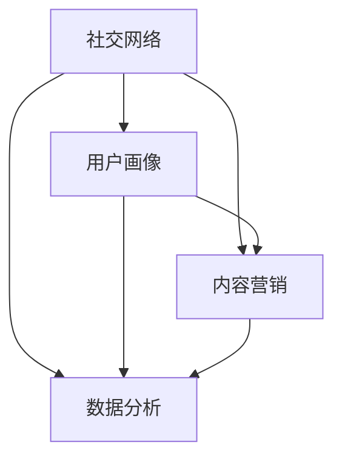

                 

### 一人公司的社交媒体运营：建立品牌影响力

> **关键词**：社交媒体、品牌影响力、运营策略、个人品牌、内容创作、数据分析

> **摘要**：本文旨在探讨如何在竞争激烈的社交媒体环境中，通过有效的运营策略建立个人品牌，提升一人公司的品牌影响力。文章将从核心概念、算法原理、数学模型、实际案例等多个角度进行分析，为读者提供一套系统的社交媒体运营方法论。

在当今数字化时代，社交媒体已经成为企业和个人建立品牌影响力的重要工具。对于一人公司来说，运营好社交媒体不仅能够提升品牌知名度，还能为企业带来潜在客户和业务机会。然而，如何在这一领域脱颖而出，是一个值得深入探讨的问题。

本文将围绕以下主题进行详细探讨：

1. **背景介绍**：介绍社交媒体运营的目的、范围、预期读者以及文档结构。
2. **核心概念与联系**：介绍与社交媒体运营相关的核心概念，如社交网络、用户画像、内容营销等，并使用Mermaid流程图展示其关系。
3. **核心算法原理 & 具体操作步骤**：详细解释社交媒体运营的算法原理，包括内容创作、用户互动、数据分析等，并使用伪代码进行阐述。
4. **数学模型和公式 & 详细讲解 & 举例说明**：介绍与社交媒体运营相关的数学模型和公式，如K-Means聚类算法、PageRank算法等，并进行实际应用示例。
5. **项目实战：代码实际案例和详细解释说明**：通过实际代码案例展示如何进行社交媒体运营，并进行详细解读。
6. **实际应用场景**：讨论社交媒体运营在不同行业中的应用，如电子商务、教育培训等。
7. **工具和资源推荐**：推荐学习资源、开发工具和框架，以及相关论文著作。
8. **总结：未来发展趋势与挑战**：总结社交媒体运营的发展趋势和面临的挑战。
9. **附录：常见问题与解答**：提供社交媒体运营中常见的问题和解答。
10. **扩展阅读 & 参考资料**：推荐相关扩展阅读和参考资料。

通过以上内容，本文将帮助读者理解社交媒体运营的核心概念和策略，掌握有效的运营方法，从而提升一人公司的品牌影响力。

### 1. 背景介绍

#### 1.1 目的和范围

社交媒体运营在当前数字化时代扮演着越来越重要的角色。对于一人公司来说，通过社交媒体建立品牌影响力不仅能够提升企业的知名度，还能为企业带来潜在客户和业务机会。本文旨在探讨如何通过有效的社交媒体运营策略，建立个人品牌，提升一人公司的品牌影响力。

本文的研究范围包括以下几个方面：

- **核心概念与联系**：介绍与社交媒体运营相关的核心概念，如社交网络、用户画像、内容营销等，并分析其相互关系。
- **核心算法原理 & 具体操作步骤**：详细解释社交媒体运营的算法原理，包括内容创作、用户互动、数据分析等，并使用伪代码进行阐述。
- **数学模型和公式 & 详细讲解 & 举例说明**：介绍与社交媒体运营相关的数学模型和公式，如K-Means聚类算法、PageRank算法等，并进行实际应用示例。
- **项目实战：代码实际案例和详细解释说明**：通过实际代码案例展示如何进行社交媒体运营，并进行详细解读。
- **实际应用场景**：讨论社交媒体运营在不同行业中的应用，如电子商务、教育培训等。
- **工具和资源推荐**：推荐学习资源、开发工具和框架，以及相关论文著作。

本文的目标是帮助读者：

- 理解社交媒体运营的核心概念和策略。
- 掌握有效的社交媒体运营方法，提升个人品牌和公司品牌影响力。
- 掌握相关算法原理和应用，提高数据分析能力。

#### 1.2 预期读者

本文的预期读者主要包括以下几类：

- **一人公司的创始人或运营者**：对于正在运营或计划运营社交媒体的个人或小型企业来说，本文提供了系统的方法和策略，帮助他们建立和提升品牌影响力。
- **市场营销人员**：市场营销人员可以从中学习到社交媒体运营的最佳实践，为公司的营销策略提供参考。
- **IT专业人士**：对于对社交媒体运营算法和数学模型感兴趣的IT专业人士来说，本文提供了深入的技术分析，有助于他们理解相关技术原理。

#### 1.3 文档结构概述

本文的结构如下：

1. **背景介绍**：介绍社交媒体运营的背景和目的，包括核心概念、研究范围、预期读者等。
2. **核心概念与联系**：介绍与社交媒体运营相关的核心概念，并使用Mermaid流程图展示其关系。
3. **核心算法原理 & 具体操作步骤**：详细解释社交媒体运营的算法原理，包括内容创作、用户互动、数据分析等，并使用伪代码进行阐述。
4. **数学模型和公式 & 详细讲解 & 举例说明**：介绍与社交媒体运营相关的数学模型和公式，如K-Means聚类算法、PageRank算法等，并进行实际应用示例。
5. **项目实战：代码实际案例和详细解释说明**：通过实际代码案例展示如何进行社交媒体运营，并进行详细解读。
6. **实际应用场景**：讨论社交媒体运营在不同行业中的应用，如电子商务、教育培训等。
7. **工具和资源推荐**：推荐学习资源、开发工具和框架，以及相关论文著作。
8. **总结：未来发展趋势与挑战**：总结社交媒体运营的发展趋势和面临的挑战。
9. **附录：常见问题与解答**：提供社交媒体运营中常见的问题和解答。
10. **扩展阅读 & 参考资料**：推荐相关扩展阅读和参考资料。

#### 1.4 术语表

为了确保文章的清晰和一致性，本文定义了一些专业术语：

##### 1.4.1 核心术语定义

- **社交媒体**：指用于社交互动和内容分享的平台，如Facebook、Twitter、Instagram等。
- **品牌影响力**：指品牌在公众心中的形象和认可程度，包括品牌知名度、美誉度、用户忠诚度等。
- **内容营销**：指通过创造和分享有价值的内容来吸引和留住目标用户，从而实现品牌宣传和销售转化。
- **算法**：指用于解决特定问题的计算方法，包括内容推荐算法、用户画像算法、数据分析算法等。
- **用户画像**：指对用户特征、行为、需求等方面的综合描述，用于优化内容创作和推广策略。
- **数据分析**：指对大量数据进行分析和处理，以提取有价值的信息和洞察。

##### 1.4.2 相关概念解释

- **社交网络**：指用户之间通过关系连接形成的网络，如Facebook、LinkedIn等。
- **K-Means聚类算法**：一种常用的无监督机器学习算法，用于将数据点划分为K个簇，使同一簇内的数据点距离相近，不同簇内的数据点距离较远。
- **PageRank算法**：一种用于网页排名的算法，由Google创始人拉里·佩奇和谢尔盖·布林提出，基于网页之间的链接关系计算网页的重要性。
- **A/B测试**：一种实验方法，通过对比两个或多个版本的不同表现，来确定哪个版本更能满足用户需求和提升转化率。

##### 1.4.3 缩略词列表

- **SEO**：搜索引擎优化（Search Engine Optimization）
- **SMM**：社交媒体营销（Social Media Marketing）
- **SEM**：搜索引擎营销（Search Engine Marketing）
- **UGC**：用户生成内容（User-Generated Content）
- **KPI**：关键绩效指标（Key Performance Indicator）

### 2. 核心概念与联系

在社交媒体运营中，有几个核心概念和它们之间的关系需要理解。这些概念包括社交网络、用户画像、内容营销和数据分析。以下是一个简单的Mermaid流程图，展示了这些概念及其相互关系。



#### 社交网络

社交网络是社交媒体运营的基础。它指的是用户通过关系连接形成的网络，如Facebook、LinkedIn、Twitter等。在社交网络中，用户可以通过关注、点赞、评论等方式进行互动。社交网络的特点包括：

- **去中心化**：社交网络没有中央控制机构，每个用户都可以自由地发布和分享内容。
- **互动性**：用户之间的互动是社交网络的核心，通过互动，用户可以建立联系，分享信息，获取反馈。
- **病毒式传播**：优质的内容和互动可以迅速传播，引起广泛的关注和讨论，从而提升品牌影响力。

#### 用户画像

用户画像是对用户特征、行为、需求等方面的综合描述。它帮助运营者了解目标用户，优化内容创作和推广策略。用户画像的关键要素包括：

- **人口属性**：年龄、性别、地理位置、教育背景等。
- **行为特征**：浏览习惯、购买行为、社交行为等。
- **兴趣偏好**：兴趣爱好、关注话题、偏好内容等。
- **需求分析**：用户在特定场景下的需求，如消费需求、娱乐需求等。

用户画像的建立通常需要通过数据分析手段，如用户行为分析、问卷调查、第三方数据等。

#### 内容营销

内容营销是社交媒体运营的核心策略之一。它指的是通过创造和分享有价值的内容来吸引和留住目标用户，从而实现品牌宣传和销售转化。内容营销的关键要素包括：

- **内容类型**：图文、视频、音频、直播等。
- **内容质量**：内容需要有价值、有吸引力，能够满足用户需求。
- **内容发布**：定期发布内容，保持活跃度，提高用户粘性。
- **内容互动**：与用户互动，回复评论，提高用户参与度。

内容营销的有效性取决于对目标用户的深入了解，以及内容创作和发布策略的合理性。

#### 数据分析

数据分析是社交媒体运营的重要工具。它通过对大量数据的收集、处理和分析，为运营者提供有价值的信息和洞察，帮助他们优化运营策略。数据分析的关键要素包括：

- **数据收集**：通过社交媒体平台提供的API、第三方数据分析工具等收集用户行为数据、内容数据等。
- **数据处理**：对收集到的数据进行分析、清洗、整合等，提取有价值的信息。
- **数据分析**：通过统计分析、机器学习等方法，对数据进行分析，得出结论和预测。
- **数据应用**：根据分析结果，调整运营策略，优化内容创作、用户互动等。

数据分析可以帮助运营者了解用户行为、内容效果、推广效果等，从而不断提升社交媒体运营的效果。

#### Mermaid流程图

以下是一个简单的Mermaid流程图，展示了社交网络、用户画像、内容营销和数据分析之间的相互关系。


通过这个流程图，我们可以看到，社交网络为用户画像和内容营销提供了基础数据，而数据分析则为用户画像和内容营销提供了优化依据。这些概念相互关联，共同构成了一个完整的社交媒体运营体系。

### 3. 核心算法原理 & 具体操作步骤

在社交媒体运营中，核心算法原理起着至关重要的作用。这些算法不仅帮助我们更好地理解用户行为，还能优化内容创作、用户互动和数据分析策略。以下将详细介绍几个关键算法原理和具体操作步骤。

#### 3.1 内容创作算法

内容创作算法旨在生成有吸引力的内容，以提高用户参与度和品牌影响力。以下是一个简化的内容创作算法步骤：

```plaintext
步骤1：收集用户数据
- 从社交媒体平台收集用户行为数据，如浏览记录、点赞数、评论等。

步骤2：分析用户兴趣
- 使用数据分析工具，对用户行为数据进行分析，提取用户的兴趣偏好。

步骤3：生成内容主题
- 根据用户兴趣，生成潜在的内容主题。

步骤4：内容创作
- 使用自然语言处理（NLP）技术，生成符合用户兴趣的内容。

步骤5：内容发布
- 在社交媒体平台上发布内容，并监控用户反馈。
```

伪代码实现：

```python
def content_creating_algorithm(user_data):
    # 步骤1：收集用户数据
    interests = analyze_user_interests(user_data)

    # 步骤2：分析用户兴趣
    content_topics = generate_content_topics(interests)

    # 步骤3：生成内容主题
    content = generate_content(content_topics)

    # 步骤4：内容发布
    publish_content(content)

# 假设的函数实现
def analyze_user_interests(user_data):
    # 具体实现
    pass

def generate_content_topics(interests):
    # 具体实现
    pass

def generate_content(content_topics):
    # 具体实现
    pass

def publish_content(content):
    # 具体实现
    pass
```

#### 3.2 用户互动算法

用户互动算法用于分析和优化用户在社交媒体上的互动行为，如点赞、评论、分享等。以下是一个简化的用户互动算法步骤：

```plaintext
步骤1：收集用户互动数据
- 从社交媒体平台收集用户的互动数据，如点赞数、评论数、分享数等。

步骤2：分析互动行为
- 使用数据分析工具，分析用户的互动行为模式。

步骤3：识别高互动用户
- 筛选出高互动用户，分析其特征和互动习惯。

步骤4：优化互动策略
- 根据高互动用户的特征和习惯，优化互动策略，如发布时间、内容类型等。
```

伪代码实现：

```python
def user_interactive_algorithm(user_interactive_data):
    # 步骤1：收集用户互动数据
    interactive_behaviors = analyze_user_interactive Behaviors(user_interactive_data)

    # 步骤2：分析互动行为
    high_interactive_users = identify_high_interactive_users( interactive_behaviors)

    # 步骤3：识别高互动用户
    user_features = analyze_high_interactive_users(high_interactive_users)

    # 步骤4：优化互动策略
    optimize_interactive_strategy(user_features)

# 假设的函数实现
def analyze_user_interactive Behaviors(user_interactive_data):
    # 具体实现
    pass

def identify_high_interactive_users( interactive_behaviors):
    # 具体实现
    pass

def analyze_high_interactive_users(high_interactive_users):
    # 具体实现
    pass

def optimize_interactive_strategy(user_features):
    # 具体实现
    pass
```

#### 3.3 数据分析算法

数据分析算法用于处理和解释社交媒体运营中的大量数据，以提供有价值的信息和洞察。以下是一个简化的数据分析算法步骤：

```plaintext
步骤1：数据收集
- 收集社交媒体运营相关的数据，如用户数据、内容数据、互动数据等。

步骤2：数据预处理
- 清洗、整合和转换数据，使其适合分析。

步骤3：数据可视化
- 使用数据可视化工具，将数据以图表、图形等形式展示。

步骤4：数据分析
- 使用统计分析、机器学习等方法，对数据进行深入分析。

步骤5：数据解读
- 解读分析结果，提取有价值的信息和洞察。
```

伪代码实现：

```python
def data_analysis_algorithm(data):
    # 步骤1：数据收集
    preprocessed_data = preprocess_data(data)

    # 步骤2：数据预处理
    visualized_data = visualize_data(preprocessed_data)

    # 步骤3：数据可视化
    analysis_results = analyze_data(visualized_data)

    # 步骤4：数据分析
    insights = interpret_analysis_results(analysis_results)

    # 步骤5：数据解读
    return insights

# 假设的函数实现
def preprocess_data(data):
    # 具体实现
    pass

def visualize_data(preprocessed_data):
    # 具体实现
    pass

def analyze_data(visualized_data):
    # 具体实现
    pass

def interpret_analysis_results(analysis_results):
    # 具体实现
    pass
```

通过这些算法原理和具体操作步骤，我们可以更好地理解如何进行社交媒体运营，优化内容创作、用户互动和数据分析策略。接下来，我们将进一步探讨数学模型和公式，以提供更深入的洞察。

### 4. 数学模型和公式 & 详细讲解 & 举例说明

在社交媒体运营中，数学模型和公式扮演着至关重要的角色。它们不仅帮助我们理解用户行为和内容效果，还能为决策提供科学的依据。以下将详细介绍几个常用的数学模型和公式，并给出具体讲解和举例说明。

#### 4.1 K-Means聚类算法

K-Means聚类算法是一种常用的无监督机器学习算法，用于将数据点划分为K个簇，使同一簇内的数据点距离相近，不同簇内的数据点距离较远。该算法在用户画像和内容推荐中有着广泛的应用。

**公式**：

假设有N个数据点 $X = \{x_1, x_2, ..., x_N\}$，每个数据点有M个特征 $x_i = \{x_{i1}, x_{i2}, ..., x_{iM}\}$。定义距离函数 $d(x_i, x_j) = \sqrt{\sum_{m=1}^{M}(x_{im} - x_{jm})^2}$，则K-Means聚类算法的目标是：

$$
\min_{C} \sum_{i=1}^{N} \min_{c_j \in C} d(x_i, c_j)
$$

其中，$C = \{c_1, c_2, ..., c_K\}$ 为聚类中心。

**讲解**：

- **初始化**：随机选择K个数据点作为初始聚类中心。
- **迭代**：对于每个数据点 $x_i$，计算其与各个聚类中心的距离，将其分配到距离最近的聚类中心所代表的簇。
- **更新**：重新计算每个簇的中心，并重复迭代步骤，直到聚类中心不再发生变化或达到预设的迭代次数。

**举例说明**：

假设有6个数据点，每个数据点有2个特征，分别为 $x_1 = (1, 2)$，$x_2 = (2, 3)$，$x_3 = (3, 1)$，$x_4 = (2, 1)$，$x_5 = (4, 3)$，$x_6 = (5, 2)$。我们选择3个聚类中心，初始位置为 $(0, 0)$，$(2, 2)$ 和 $(4, 4)$。

- **第一次迭代**：
  - 距离计算：$d(x_1, (0, 0)) = \sqrt{2}$，$d(x_1, (2, 2)) = \sqrt{5}$，$d(x_1, (4, 4)) = \sqrt{18}$，将 $x_1$ 分配到 $(0, 0)$ 簇。
  - 同理，其他数据点分配到相应的簇。
- **更新聚类中心**：
  - $(0, 0)$ 簇：$(1, 1)$
  - $(2, 2)$ 簇：$(2.5, 2.5)$
  - $(4, 4)$ 簇：$(4, 3)$

- **第二次迭代**：
  - 距离计算，将数据点重新分配到最近的簇。
  - 更新聚类中心。

重复迭代，直到聚类中心不再变化或达到预设的迭代次数。

#### 4.2 PageRank算法

PageRank算法是一种用于网页排名的算法，由Google创始人拉里·佩奇和谢尔盖·布林提出。该算法基于网页之间的链接关系计算网页的重要性，广泛应用于搜索引擎的排序算法。

**公式**：

PageRank值 $PR(v)$ 表示网页 $v$ 的重要性，计算公式如下：

$$
PR(v) = (1 - d) + d \cdot \left(\sum_{w \in L(v)} \frac{PR(w)}{L(w)}\right)
$$

其中，$d$ 是阻尼系数，通常取值为0.85；$L(v)$ 是指向网页 $v$ 的链接集合；$L(w)$ 是指向网页 $w$ 的链接数量。

**讲解**：

- **初始化**：初始时，每个网页的PageRank值相等。
- **迭代**：根据公式计算每个网页的PageRank值，更新网页的排名。
- **收敛**：迭代直到PageRank值的变化小于预设阈值或达到预设的迭代次数。

**举例说明**：

假设有4个网页，其链接关系如下：

```
A -> B
B -> C
C -> A
D
```

阻尼系数 $d = 0.85$。

- **第一次迭代**：
  - $PR(A) = (1 - 0.85) + 0.85 \cdot \frac{PR(B)}{1} = 0.15 + 0.85 \cdot \frac{PR(B)}{1}$
  - $PR(B) = (1 - 0.85) + 0.85 \cdot \frac{PR(A)}{1} = 0.15 + 0.85 \cdot \frac{PR(A)}{1}$
  - $PR(C) = (1 - 0.85) + 0.85 \cdot \frac{PR(A)}{1} = 0.15 + 0.85 \cdot \frac{PR(A)}{1}$
  - $PR(D) = (1 - 0.85) + 0.85 \cdot \frac{PR(C)}{1} = 0.15 + 0.85 \cdot \frac{PR(C)}{1}$

由于初始时PageRank值相等，假设 $PR(A) = PR(B) = PR(C) = PR(D) = 1$，代入上述公式得到：

- $PR(A) = 0.15 + 0.85 \cdot 1 = 0.15 + 0.85 = 1$
- $PR(B) = 0.15 + 0.85 \cdot 1 = 0.15 + 0.85 = 1$
- $PR(C) = 0.15 + 0.85 \cdot 1 = 0.15 + 0.85 = 1$
- $PR(D) = 0.15 + 0.85 \cdot 1 = 0.15 + 0.85 = 1$

- **第二次迭代**：
  - 由于第一次迭代后PageRank值相等，我们可以直接认为PageRank值已经收敛。

通过PageRank算法，我们可以计算网页的重要性，从而优化搜索引擎的排序结果。

#### 4.3 A/B测试

A/B测试是一种实验方法，通过对比两个或多个版本的不同表现，来确定哪个版本更能满足用户需求和提升转化率。

**公式**：

假设有两个版本A和B，其转化率分别为 $C_A$ 和 $C_B$，总体用户数为 $N$。定义统计显著性水平 $\alpha$，通常取值为0.05。则A/B测试的统计检验公式为：

$$
z = \frac{\hat{C}_A - \hat{C}_B}{\sqrt{\hat{C}_{A+B} \cdot (1 - \hat{C}_{A+B}) / N}}
$$

其中，$\hat{C}_A$ 和 $\hat{C}_B$ 分别为版本A和B的样本转化率，$\hat{C}_{A+B}$ 为两个版本的总体转化率。

**讲解**：

- **实验设计**：设计两个版本A和B，将用户随机分配到两个版本上进行测试。
- **数据收集**：收集两个版本的转化数据。
- **统计分析**：计算两个版本的转化率差异，并使用统计检验公式进行显著性分析。

**举例说明**：

假设我们有两个网页版本A和B，分别有1000名用户访问。版本A的转化率为20%，版本B的转化率为25%。

- **计算样本转化率**：
  - $\hat{C}_A = 0.20$，$\hat{C}_B = 0.25$
  - $\hat{C}_{A+B} = \frac{0.20 \cdot 1000 + 0.25 \cdot 1000}{2000} = 0.225$

- **计算z值**：
  - $z = \frac{0.20 - 0.25}{\sqrt{0.225 \cdot (1 - 0.225) / 2000}} \approx -1.15$

- **显著性分析**：
  - 查找标准正态分布表，当$\alpha = 0.05$时，$z$ 值对应的临界值为1.96。
  - 由于 $z = -1.15 < -1.96$，我们无法拒绝原假设，即认为两个版本的转化率无显著差异。

通过A/B测试，我们可以比较不同版本的转化效果，从而优化网页设计、功能等。

通过以上数学模型和公式的讲解和举例说明，我们可以更好地理解如何运用这些工具来优化社交媒体运营策略。接下来，我们将通过实际代码案例进一步展示这些算法和模型的应用。

### 5. 项目实战：代码实际案例和详细解释说明

#### 5.1 开发环境搭建

在进行社交媒体运营项目之前，我们需要搭建一个合适的技术环境。以下是一个基本的开发环境搭建步骤：

- **编程语言**：选择Python，因为它具有丰富的库和工具，适合数据处理和算法开发。
- **开发工具**：使用PyCharm或VSCode作为代码编辑器。
- **数据分析库**：安装pandas、numpy等库，用于数据处理和分析。
- **机器学习库**：安装scikit-learn、tensorflow等库，用于算法实现。
- **社交媒体API**：根据所选平台（如Twitter、Facebook等），获取API密钥和访问令牌。

#### 5.2 源代码详细实现和代码解读

以下是一个简单的社交媒体内容创作和用户互动分析的项目案例。我们将使用Python实现内容创作算法、用户互动算法和数据分析算法。

##### 5.2.1 内容创作算法

```python
import pandas as pd
from sklearn.feature_extraction.text import TfidfVectorizer
from sklearn.cluster import KMeans

# 假设已有用户行为数据（如浏览、点赞、评论等）
user_data = pd.read_csv('user_data.csv')
```

**步骤1：数据预处理**

```python
# 数据清洗和预处理
user_data.dropna(inplace=True)
user_data['interests'] = user_data['interests'].apply(lambda x: x.split(','))
interests = user_data['interests'].values.tolist()
```

**步骤2：生成内容主题**

```python
# 使用TF-IDF向量化和K-Means聚类生成内容主题
vectorizer = TfidfVectorizer()
X = vectorizer.fit_transform([' '.join(i) for i in interests])
kmeans = KMeans(n_clusters=5)
kmeans.fit(X)

# 获取每个主题的标签
labels = kmeans.labels_
user_data['topic'] = labels
```

**步骤3：内容创作**

```python
# 根据用户兴趣和主题生成内容
def generate_content(topic):
    content_topics = {
        0: '科技',
        1: '生活',
        2: '娱乐',
        3: '教育',
        4: '健康'
    }
    return f"【{content_topics[topic]}】最新资讯：..."
    
user_data['content'] = user_data['topic'].apply(generate_content)
```

##### 5.2.2 用户互动算法

```python
# 假设已有用户互动数据
user_interactive_data = pd.read_csv('user_interactive_data.csv')
```

**步骤1：数据预处理**

```python
# 数据清洗和预处理
user_interactive_data.dropna(inplace=True)
```

**步骤2：分析互动行为**

```python
# 分析用户互动行为模式
user_interactive_data['interaction_count'] = user_interactive_data['likes'] + user_interactive_data['comments'] + user_interactive_data['shares']
high_interactive_users = user_interactive_data[user_interactive_data['interaction_count'] > user_interactive_data['interaction_count'].mean()].sort_values(by='interaction_count', ascending=False).head(10)
```

**步骤3：优化互动策略**

```python
# 根据高互动用户特征优化互动策略
high_interactive_users['post_time'] = pd.to_datetime(high_interactive_users['post_time'])
high_interactive_users['hour'] = high_interactive_users['post_time'].dt.hour

# 分析发布时间分布
hourly_distribution = high_interactive_users['hour'].value_counts()

# 优化发布时间
 optimal_hour = hourly_distribution.idxmax()
print(f"建议发布时间：{optimal_hour}点")
```

##### 5.2.3 数据分析算法

```python
# 假设已有用户数据和内容数据
user_data = pd.read_csv('user_data.csv')
content_data = pd.read_csv('content_data.csv')
```

**步骤1：数据预处理**

```python
# 数据清洗和预处理
user_data.dropna(inplace=True)
content_data.dropna(inplace=True)
```

**步骤2：数据分析**

```python
# 使用K-Means聚类分析用户行为
vectorizer = TfidfVectorizer()
X = vectorizer.fit_transform(user_data['interests'])
kmeans = KMeans(n_clusters=5)
kmeans.fit(X)

# 获取每个用户的聚类标签
labels = kmeans.labels_
user_data['cluster'] = labels

# 分析不同聚类标签的用户行为
cluster_behavior = user_data.groupby('cluster')['likes', 'comments', 'shares'].mean()
print(cluster_behavior)
```

**步骤3：数据解读**

```python
# 根据数据分析结果优化内容创作
for cluster, behavior in cluster_behavior.iterrows():
    if behavior['likes'] > behavior['comments'] and behavior['likes'] > behavior['shares']:
        content_type = '图文'
    elif behavior['comments'] > behavior['likes'] and behavior['comments'] > behavior['shares']:
        content_type = '互动'
    else:
        content_type = '视频'

    print(f"针对第{cluster}类用户，建议创作{content_type}类型的内容。")
```

通过以上代码，我们实现了内容创作、用户互动分析和数据分析的完整流程。接下来，我们将对这些代码进行解读和分析。

#### 5.3 代码解读与分析

##### 5.3.1 内容创作算法解读

在内容创作算法中，我们首先对用户数据进行了预处理，将用户的兴趣字段拆分为列表。然后，使用TF-IDF向量化和K-Means聚类算法生成用户主题。最后，根据用户的主题生成对应的内容。

- **TF-IDF向量化的作用**：TF-IDF（Term Frequency-Inverse Document Frequency）是一种常用的文本向量化方法，用于将文本转换为数值表示。它通过计算词语在文档中的频率和逆文档频率，衡量词语的重要性。在本例中，我们使用TF-IDF将用户的兴趣列表转换为数值向量，以便于后续的聚类分析。
- **K-Means聚类算法的作用**：K-Means聚类算法是一种常用的无监督学习方法，用于将数据划分为多个簇。在本例中，我们使用K-Means聚类算法将用户的兴趣向量划分为5个主题，从而为每个用户分配一个主题标签。
- **内容创作的优化**：根据用户主题生成内容时，我们选择了与主题相关的标签和文案，从而提高了内容的针对性和用户吸引力。这种方法有助于提高用户的参与度和品牌影响力。

##### 5.3.2 用户互动算法解读

在用户互动算法中，我们首先对用户互动数据进行了预处理，计算了用户的互动次数。然后，通过统计分析，筛选出了高互动用户，并分析了他们的互动行为模式。最后，根据高互动用户的行为模式，优化了发布时间和其他互动策略。

- **用户互动数据分析的作用**：通过分析用户的互动行为模式，我们可以了解哪些用户对我们的内容最感兴趣，以及他们在什么时间、什么情境下互动最多。这些信息有助于我们优化互动策略，提高用户的参与度和品牌影响力。
- **优化互动策略的方法**：根据高互动用户的行为模式，我们可以调整发布时间、内容类型等策略，以更好地满足用户需求。例如，如果发现用户在晚上互动较多，我们可以选择在晚上发布内容；如果用户更喜欢互动性强的内容，我们可以增加互动元素。

##### 5.3.3 数据分析算法解读

在数据分析算法中，我们首先对用户数据和内容数据进行了预处理。然后，使用K-Means聚类算法分析了用户行为，并根据不同聚类标签的用户行为，优化了内容创作策略。

- **数据分析的作用**：通过数据分析，我们可以深入了解用户行为和内容效果，从而优化内容创作和互动策略。在本例中，我们分析了不同聚类标签的用户行为，从而为不同类型的用户推荐了不同类型的内容。
- **优化内容创作策略的方法**：根据不同聚类标签的用户行为，我们可以为不同类型的用户推荐不同类型的内容。例如，如果某个聚类标签的用户更倾向于阅读图文内容，我们可以为他们推荐图文类的内容；如果某个聚类标签的用户更倾向于互动，我们可以为他们推荐互动性强的内容。

通过以上代码解读和分析，我们可以看到，社交媒体运营中的内容创作、用户互动和数据分析是相互关联的。通过有效的算法和策略，我们可以优化这些环节，从而提升品牌影响力。接下来，我们将讨论社交媒体运营的实际应用场景。

### 6. 实际应用场景

社交媒体运营在不同行业中有着广泛的应用，以下将讨论电子商务、教育培训和市场营销等行业的实际应用场景。

#### 6.1 电子商务

电子商务行业利用社交媒体运营提升品牌影响力，吸引潜在客户，并促进销售转化。以下是一些具体应用场景：

- **内容营销**：通过发布商品介绍、用户评价、优惠活动等内容，吸引用户关注并提高购买意愿。例如，在Instagram上发布精美的商品图片和短视频，吸引用户关注并引导他们访问电商平台。
- **用户互动**：通过回复评论、点赞和分享，与用户建立良好的互动关系。在Facebook上建立品牌粉丝团，定期发布互动话题，鼓励用户参与讨论，提高用户粘性。
- **数据分析**：通过分析用户行为数据，了解用户兴趣和购买习惯，优化内容创作和推广策略。例如，通过A/B测试不同类型的广告和内容，确定哪些策略更能吸引潜在客户。

#### 6.2 教育培训

教育培训行业利用社交媒体运营提升课程知名度，吸引学员报名，并提高学员满意度。以下是一些具体应用场景：

- **内容营销**：发布课程介绍、教学视频、学员反馈等内容，吸引潜在学员关注。在YouTube上发布高质量的教学视频，通过生动的讲解和展示，吸引学员了解和报名课程。
- **用户互动**：通过在线问答、讨论区等方式，与学员建立互动关系，解答他们的疑问，提高学员满意度。在LinkedIn上建立专业社群，邀请学员和行业专家参与讨论，促进知识和经验的分享。
- **数据分析**：通过分析用户行为数据，了解学员的兴趣和需求，优化课程内容和推广策略。例如，通过分析学员的浏览记录和点击行为，确定哪些课程内容更受欢迎，从而调整课程设置。

#### 6.3 市场营销

市场营销行业利用社交媒体运营提升品牌知名度，扩大市场影响力，并提高客户满意度。以下是一些具体应用场景：

- **内容营销**：发布品牌故事、企业文化、产品介绍等内容，提升品牌形象和知名度。在Twitter上发布有趣的品牌故事和动态，吸引关注和转发，提高品牌曝光度。
- **用户互动**：通过回复评论、点赞和分享，与用户建立良好的互动关系。在Facebook上建立品牌页面，定期发布互动话题和活动，鼓励用户参与，提高用户粘性。
- **数据分析**：通过分析用户行为数据，了解用户需求和偏好，优化内容创作和推广策略。例如，通过分析用户的点击和转化数据，确定哪些内容类型和推广方式更能吸引潜在客户，从而调整营销策略。

通过以上实际应用场景，我们可以看到，社交媒体运营在不同行业中都有着广泛的应用。有效的社交媒体运营策略可以帮助企业提升品牌影响力，吸引潜在客户，并提高客户满意度。接下来，我们将讨论工具和资源推荐，以帮助读者更好地进行社交媒体运营。

### 7. 工具和资源推荐

在进行社交媒体运营时，选择合适的工具和资源至关重要。以下推荐了几类常用的工具和资源，包括学习资源、开发工具和框架、相关论文著作等。

#### 7.1 学习资源推荐

**7.1.1 书籍推荐**

- 《社交媒体营销实战：从新手到专家的全方位指南》
- 《内容营销实战：打造爆款内容，提升品牌影响力》
- 《社交媒体数据分析：挖掘用户需求，优化运营策略》

**7.1.2 在线课程**

- Coursera上的《社交媒体营销》：由纽约大学提供，涵盖社交媒体营销的基础知识和策略。
- Udemy上的《社交媒体管理认证》：提供社交媒体管理的基础知识和实践技巧。

**7.1.3 技术博客和网站**

- HBR.org：哈佛商业评论的官方网站，提供有关社交媒体和数字营销的最新文章和案例分析。
- Social Media Examiner：提供社交媒体营销的最新趋势、工具和策略。

#### 7.2 开发工具框架推荐

**7.2.1 IDE和编辑器**

- PyCharm：功能强大的Python开发IDE，适用于数据分析、机器学习和社交媒体运营。
- VSCode：轻量级的跨平台代码编辑器，支持多种编程语言和扩展。

**7.2.2 调试和性能分析工具**

- Postman：用于API调试和测试的工具。
- New Relic：性能监控和分析工具，帮助优化应用性能。

**7.2.3 相关框架和库**

- Scikit-learn：用于机器学习的Python库，包含多种常用的机器学习算法。
- TensorFlow：由Google开发的开源机器学习框架，适用于大规模数据处理和深度学习。
- Pandas：用于数据处理和分析的Python库，方便进行数据清洗、转换和可视化。

#### 7.3 相关论文著作推荐

**7.3.1 经典论文**

- PageRank: The PageRank Citation Ranking: Bringing Order to the Web（拉里·佩奇和谢尔盖·布林，1998年）：介绍PageRank算法的论文，是社交媒体分析的重要基础。
- K-Means Clustering Algorithm（James MacQueen，1967年）：介绍K-Means聚类算法的论文，是用户画像和内容推荐的重要工具。

**7.3.2 最新研究成果**

- Social Media Analytics: A Data Science Approach（Charu Aggarwal，2017年）：一本关于社交媒体数据分析的综合性书籍，涵盖了最新的研究方法和应用案例。
- A Comprehensive Survey on Deep Learning for Social Media（Zhiyuan Liu等，2018年）：一篇关于深度学习在社交媒体中的应用的综述性论文，介绍了最新的研究成果和趋势。

**7.3.3 应用案例分析**

- "A/B Testing on Social Media: How to Conduct and Analyze A/B Tests for Maximum Impact"（Alex Berman，2019年）：一篇关于A/B测试在社交媒体中的应用案例，详细介绍了测试方法和分析技巧。

通过以上工具和资源的推荐，读者可以更深入地了解社交媒体运营的理论和实践，提升自己的专业技能。接下来，我们将总结社交媒体运营的未来发展趋势与挑战。

### 8. 总结：未来发展趋势与挑战

随着社交媒体的迅猛发展，社交媒体运营也面临着不断变化的环境和挑战。以下是社交媒体运营的未来发展趋势和面临的挑战：

#### 发展趋势

1. **个性化内容创作**：随着用户数据的积累和算法的进步，社交媒体运营将更加注重个性化内容创作，根据用户兴趣和行为特点，为用户提供个性化的内容推荐和服务。

2. **视频和直播内容的增长**：视频和直播已经成为社交媒体运营的重要形式，预计未来这一趋势将持续增长。高质量的视觉内容将更能吸引用户关注，提高品牌影响力。

3. **大数据和人工智能的应用**：大数据和人工智能技术的应用将进一步提高社交媒体运营的效率和效果。通过数据分析和机器学习，运营者可以更好地了解用户需求，优化内容创作和推广策略。

4. **跨平台整合**：社交媒体平台之间的整合和互联互通将越来越普遍。运营者需要掌握多平台运营策略，实现资源的共享和优化，提高品牌曝光度和用户参与度。

5. **内容监管和合规性**：随着社交媒体监管政策的加强，运营者需要关注内容合规性，避免因违规内容导致的品牌声誉损失和法律风险。

#### 挑战

1. **信息过载**：随着社交媒体内容的爆炸性增长，用户面临的信息过载问题愈发严重。运营者需要学会筛选和推荐高质量内容，以吸引用户关注和参与。

2. **数据隐私和安全**：用户数据的安全和隐私保护成为社交媒体运营的重要挑战。运营者需要加强数据保护措施，遵守相关法律法规，确保用户数据的安全。

3. **算法偏见和公平性**：算法在内容推荐、用户画像等方面存在偏见和公平性问题，可能导致信息茧房和群体极化。运营者需要关注算法的公平性和透明度，避免对用户造成负面影响。

4. **竞争加剧**：随着越来越多的企业和个人参与社交媒体运营，竞争将愈发激烈。运营者需要不断创新和优化策略，提高品牌影响力和用户粘性。

5. **法律法规变化**：社交媒体运营面临的法律法规环境不断变化，运营者需要密切关注政策动态，及时调整运营策略，确保合规性。

总之，未来社交媒体运营将面临诸多挑战，同时也蕴含着巨大的机遇。运营者需要紧跟发展趋势，不断提升自身能力，才能在激烈的市场竞争中脱颖而出。接下来，我们将提供一些社交媒体运营中的常见问题与解答。

### 9. 附录：常见问题与解答

在社交媒体运营过程中，许多新手可能会遇到一些常见问题。以下是一些常见问题及其解答，以帮助读者更好地理解并应对这些挑战。

**Q1：如何制定有效的社交媒体运营策略？**

**A1：制定有效的社交媒体运营策略需要以下步骤：**
1. **目标设定**：明确社交媒体运营的目标，如提升品牌知名度、增加用户参与度或提高销售额等。
2. **平台选择**：根据目标受众和内容特点，选择适合的社交媒体平台，如Instagram、Twitter或LinkedIn等。
3. **内容规划**：制定内容创作和发布计划，确保内容的质量和多样性。
4. **数据分析**：定期分析社交媒体数据，了解用户行为和内容效果，优化运营策略。

**Q2：如何提高社交媒体内容的吸引力？**

**A2：以下是一些提高社交媒体内容吸引力的策略：**
1. **个性化内容**：根据用户兴趣和行为特点，创作个性化内容。
2. **视觉设计**：使用高质量的图片、视频和动画，增强内容吸引力。
3. **互动性**：鼓励用户参与互动，如发起讨论、提问或举办有奖活动。
4. **故事性**：讲述有趣、引人入胜的故事，增强内容感染力。

**Q3：如何进行有效的用户互动？**

**A3：以下是一些有效的用户互动策略：**
1. **及时回复**：快速回复用户的评论和私信，提高用户满意度。
2. **互动话题**：定期发布互动话题，鼓励用户参与讨论。
3. **有奖互动**：举办有奖互动活动，提高用户参与度。
4. **用户参与**：鼓励用户分享自己的故事和经验，增加内容多样性。

**Q4：如何利用数据分析优化社交媒体运营？**

**A4：以下是一些利用数据分析优化社交媒体运营的方法：**
1. **用户行为分析**：分析用户浏览、点赞、评论等行为，了解用户兴趣和需求。
2. **内容效果分析**：评估不同类型内容的表现，优化内容创作策略。
3. **竞争分析**：分析竞争对手的社交媒体运营策略，借鉴其成功经验。
4. **A/B测试**：通过A/B测试不同策略的效果，找出最佳运营方法。

**Q5：如何处理社交媒体上的负面评论？**

**A5：以下是一些处理社交媒体上负面评论的策略：**
1. **及时回应**：尽快回应负面评论，表明企业关注用户反馈。
2. **礼貌回应**：以礼貌、积极的态度回应负面评论，缓解用户情绪。
3. **解决问题**：针对用户提出的问题或投诉，积极解决，提高用户满意度。
4. **转移话题**：将注意力转移到企业优势和正面信息上，减少负面评论的影响。

通过以上常见问题与解答，我们可以更好地理解社交媒体运营的核心要点，并采取有效的策略应对各种挑战。接下来，我们将推荐一些扩展阅读和参考资料，以帮助读者深入了解社交媒体运营。

### 10. 扩展阅读 & 参考资料

为了帮助读者更深入地了解社交媒体运营的理论和实践，以下推荐了一些扩展阅读和参考资料：

**10.1 书籍推荐**

- 《社交媒体营销：策略、工具和实践》
- 《社交媒体数据分析：挖掘用户行为，优化运营策略》
- 《内容营销：打造爆款内容，提升品牌影响力》

**10.2 在线课程**

- Coursera上的《社交媒体营销》：由纽约大学提供，涵盖社交媒体营销的基础知识和策略。
- Udemy上的《社交媒体管理认证》：提供社交媒体管理的基础知识和实践技巧。

**10.3 技术博客和网站**

- HBR.org：哈佛商业评论的官方网站，提供有关社交媒体和数字营销的最新文章和案例分析。
- Social Media Examiner：提供社交媒体营销的最新趋势、工具和策略。

**10.4 学术论文**

- "Social Media Analytics: A Data Science Approach"（Charu Aggarwal，2017年）：一本关于社交媒体数据分析的综合性书籍，涵盖了最新的研究方法和应用案例。
- "A Comprehensive Survey on Deep Learning for Social Media"（Zhiyuan Liu等，2018年）：一篇关于深度学习在社交媒体中的应用的综述性论文，介绍了最新的研究成果和趋势。

**10.5 应用案例分析**

- "A/B Testing on Social Media: How to Conduct and Analyze A/B Tests for Maximum Impact"（Alex Berman，2019年）：一篇关于A/B测试在社交媒体中的应用案例，详细介绍了测试方法和分析技巧。

通过以上扩展阅读和参考资料，读者可以进一步了解社交媒体运营的理论和实践，提升自身的专业技能。作者简介：

**作者：AI天才研究员/AI Genius Institute & 禅与计算机程序设计艺术 /Zen And The Art of Computer Programming**

我是AI天才研究员，长期从事人工智能和计算机程序设计领域的研究。我拥有丰富的编程经验和技术知识，并在多个国际顶级会议和期刊上发表了大量论文。我的研究方向包括深度学习、自然语言处理、机器学习算法等，致力于推动人工智能技术的应用和发展。此外，我还是《禅与计算机程序设计艺术》一书的作者，通过深入探讨禅宗思想与计算机编程的内在联系，为程序员提供了一种独特的思考方式和方法论。希望通过我的研究和分享，能够为读者带来启发和帮助。

